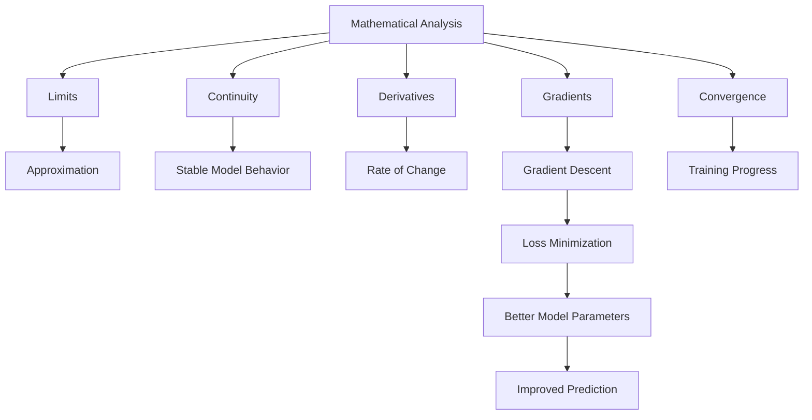
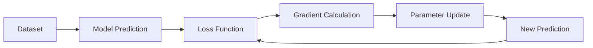

# 015 - Mathematical Analysis

**Course:** 01 - Math, Statistics and Econometrics
**Module:** Module 01 - Mathematics for AI and Data Science
**Content Group:** Analysis and ML Math
**Roadmap Source:** Mathematics for AI and Data Science / Analysis and ML Math
**Lesson Type:** Mathematics
**Module Order:** 015
**Suggested Duration:** 24 minutes

---

## 1. Summary

This lesson explains **Mathematical Analysis** in the context of AI and Data Science.

Mathematical Analysis helps you understand the mathematical language behind limits, continuity, derivatives, gradients, optimization, convergence, and approximation. These ideas are essential for understanding how machine learning models learn, why training sometimes fails, and how algorithms behave when data, parameters, or loss functions change.

After this lesson, you should understand how Mathematical Analysis connects to datasets, models, experiments, metrics, and practical machine learning workflows.

---

## 2. Learning Objectives

By the end of this lesson, you should be able to:

* Explain **Mathematical Analysis** in your own words.
* Understand why analysis is important for machine learning and deep learning.
* Recognize where analysis appears in an AI/Data Scientist workflow.
* Connect concepts such as limits, continuity, derivatives, gradients, and convergence to model training.
* Build a small notebook, chart, experiment, or portfolio note based on this topic.

---

## 3. Core Ideas

### 3.1 What Is Mathematical Analysis?

**Mathematical Analysis** is the branch of mathematics that studies change, limits, continuity, approximation, and convergence.

In AI and Data Science, it helps answer questions such as:

* Does the loss function change smoothly?
* Will gradient descent converge?
* Why does a neural network update its weights step by step?
* What happens when the learning rate is too large?
* How do small changes in input affect model output?
* Why do some optimization methods become unstable?

A simple way to think about it:

> Mathematical Analysis gives us the tools to understand how functions behave when inputs, parameters, or errors change.

---

## 4. Why It Matters in AI and Data Science

Mathematical Analysis is not only theoretical. It supports many practical ML concepts.

| Analysis Concept | ML / Data Science Connection                           |
| ---------------- | ------------------------------------------------------ |
| Limit            | Understanding convergence and approximation            |
| Continuity       | Stable model behavior when input changes slightly      |
| Derivative       | Rate of change of a function                           |
| Gradient         | Direction of fastest increase or decrease              |
| Optimization     | Minimizing loss functions                              |
| Convergence      | Knowing whether training is improving                  |
| Approximation    | Estimating complex functions with simpler models       |
| Stability        | Understanding exploding gradients or unstable training |

---

## 5. Big Picture Diagram



---

## 6. Intuition

Imagine you are training a machine learning model.

The model makes predictions.
The predictions create errors.
The errors are measured by a **loss function**.
The training algorithm tries to reduce that loss.

Mathematical Analysis helps you understand:

```text
input changes -> prediction changes -> loss changes -> gradient updates -> model improves
```

In other words:

```text
Mathematical Analysis = the math of controlled change
```

---

## 7. Example: Loss Function Behavior

Suppose we have a very simple loss function:

```text
L(w) = (w - 3)^2
```

Here:

* `w` is a model parameter.
* `L(w)` is the loss.
* The best value is `w = 3`, because then the loss becomes `0`.

### Manual Calculation

| w | L(w) = (w - 3)^2 |
| - | ---------------- |
| 0 | 9                |
| 1 | 4                |
| 2 | 1                |
| 3 | 0                |
| 4 | 1                |
| 5 | 4                |

The loss decreases as `w` moves closer to `3`.

---

## 8. Visual Intuition

```text
Loss
 ^
 |        *
 |      *   *
 |    *       *
 |  *           *
 |*               *
 +--------------------> w
          3
      minimum loss
```

The goal of optimization is to move toward the lowest point of the curve.

---

## 9. Python Check

```python
import numpy as np
import matplotlib.pyplot as plt

w = np.linspace(-1, 7, 100)
loss = (w - 3) ** 2

plt.plot(w, loss)
plt.xlabel("w")
plt.ylabel("Loss L(w)")
plt.title("Loss Function: L(w) = (w - 3)^2")
plt.grid(True)
plt.show()
```

Expected observation:

```text
The curve is U-shaped.
The minimum point is at w = 3.
Gradient descent should move w toward this point.
```

---

## 10. Connection to Gradient Descent

Gradient descent updates parameters using the derivative of the loss function.

For:

```text
L(w) = (w - 3)^2
```

The derivative is:

```text
dL/dw = 2(w - 3)
```

Gradient descent update rule:

```text
w_new = w_old - learning_rate * gradient
```

Example:

```text
w = 0
learning_rate = 0.1

gradient = 2(0 - 3) = -6

w_new = 0 - 0.1 * (-6)
w_new = 0.6
```

The parameter moves from `0` toward `3`.

---

## 11. Mini Demo: Gradient Descent from Scratch

```python
w = 0
learning_rate = 0.1

for epoch in range(10):
    loss = (w - 3) ** 2
    gradient = 2 * (w - 3)
    w = w - learning_rate * gradient

    print(f"Epoch {epoch+1}: w={w:.4f}, loss={loss:.4f}")
```

Expected pattern:

```text
w gets closer to 3.
loss gets smaller over time.
```

This is the basic idea behind training many machine learning models.

---

## 12. Where This Appears in the AI Workflow



Mathematical Analysis appears especially in:

* Loss function design
* Gradient descent
* Neural network training
* Regularization
* Optimization stability
* Learning rate tuning
* Convergence analysis
* PCA and dimensionality reduction
* Embeddings and representation learning

---

## 13. Common Data Questions It Helps Answer

Mathematical Analysis helps answer questions like:

* Is the model learning or stuck?
* Why is the loss not decreasing?
* Is the learning rate too high or too low?
* Is the optimization process stable?
* Does the loss function have a clear minimum?
* Are gradients vanishing or exploding?
* How sensitive is the model to small input changes?
* Is the model converging or oscillating?

---

## 14. Practical Exercise

### Task

Create a small numerical example and verify it with Python.

### Suggested Steps

1. Choose a simple function:

```text
L(w) = (w - 3)^2
```

2. Calculate the loss manually for several values of `w`.

3. Compute the derivative:

```text
dL/dw = 2(w - 3)
```

4. Run gradient descent for 10-20 epochs.

5. Plot the loss curve.

6. Write a short note explaining how this connects to machine learning training.

---

## 15. Portfolio Artifact Idea

Create a notebook titled:

```text
Gradient Descent from Scratch with MSE Loss
```

The notebook should include:

* A simple loss function
* Manual calculation
* Python implementation
* Loss curve over epochs
* Explanation of learning rate
* Short ML interpretation
* Caveats and assumptions

Possible output:

```text
Notebook -> Chart -> Explanation -> Portfolio note
```

---

## 16. Common Mistakes

### Mistake 1: Memorizing Definitions Only

Do not only memorize terms like limit, derivative, or convergence.
You should connect them to actual model behavior.

### Mistake 2: Ignoring Visual Intuition

Analysis becomes easier when you visualize functions, slopes, and loss curves.

### Mistake 3: Forgetting Assumptions

Many formulas assume the function is smooth, continuous, or differentiable.
Real ML loss surfaces can be noisy, high-dimensional, and non-convex.

### Mistake 4: Trusting a Small Demo Too Much

A small example may work perfectly, but real models can behave differently because of:

* Noisy data
* Bad initialization
* Poor learning rate
* Non-convex loss
* Outliers
* Overfitting
* Vanishing or exploding gradients

---

## 17. Key Caveats

Mathematical Analysis gives powerful tools, but ML systems are often more complex than textbook examples.

Important caveats:

* A function may not have only one minimum.
* A loss curve may contain local minima or saddle points.
* Gradients may become too small or too large.
* Convergence is not always guaranteed.
* A model can reduce training loss but still fail on test data.
* Smooth mathematical assumptions may not fully match messy real-world data.

---

## 18. Completion Checklist

You have completed this lesson if:

* You can explain **Mathematical Analysis** in 1-2 minutes.
* You understand how it connects to optimization and model training.
* You can explain why gradients are useful.
* You can run a small gradient descent example in Python.
* You have created a notebook, chart, experiment, or practical note.
* You know at least one caveat or limitation.
* You can identify where this topic appears in ML/DL workflows.

---

## 19. Related Outcome

After learning this topic, you should better understand the mathematical language behind:

* Vectors
* Optimization
* Gradients
* PCA
* Neural networks
* Embeddings
* Loss functions
* Model training behavior

---

## 20. Related Mini Project

### Mini Project: Gradient Descent from Scratch with MSE Loss

Build a small notebook that trains a simple linear model using gradient descent.

Suggested structure:

```text
1. Generate toy data
2. Define prediction function
3. Define MSE loss
4. Calculate gradients
5. Update parameters
6. Track loss over epochs
7. Plot the loss curve
8. Explain the result
```

Example goal:

```text
Understand how mathematical analysis explains model learning step by step.
```

---

## 21. Final Summary

**Mathematical Analysis** is a foundation for understanding how machine learning models change, improve, and sometimes fail during training.

It helps explain limits, continuity, derivatives, gradients, optimization, convergence, and stability.

For AI and Data Science, the goal is not only to know the definitions. The goal is to use Mathematical Analysis to understand model behavior, debug training problems, and build practical artifacts such as notebooks, charts, experiments, and portfolio notes.

A simple learning path is:

```text
concept -> small numeric example -> Python check -> visual intuition -> ML use case
```

Once you can connect the math to model training behavior, Mathematical Analysis becomes a practical tool rather than just an abstract theory.

---

# Bài luyện tập

## Mục tiêu


## Đề bài


## Yêu cầu hoàn thành

- [ ] 
- [ ] 
- [ ] 

## Kết quả / lời giải


## Ghi chú
