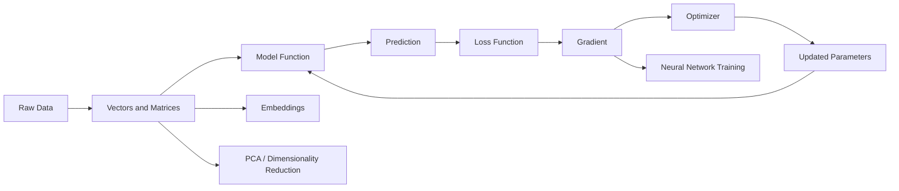
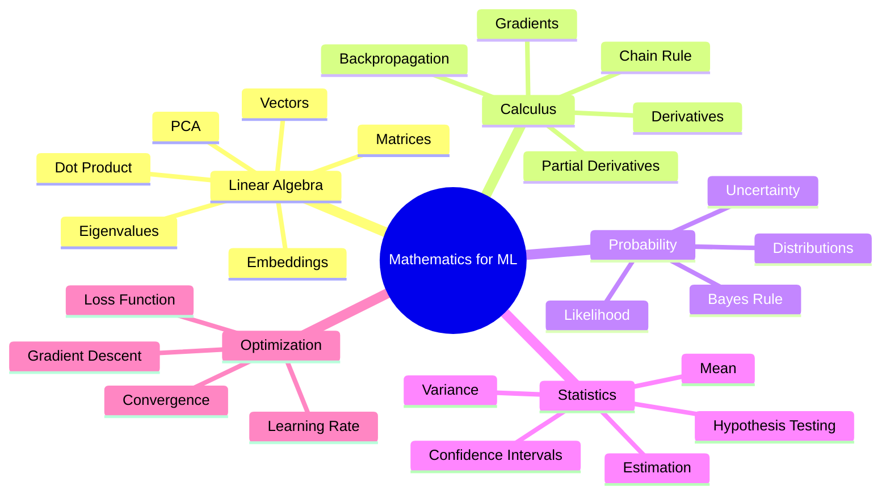
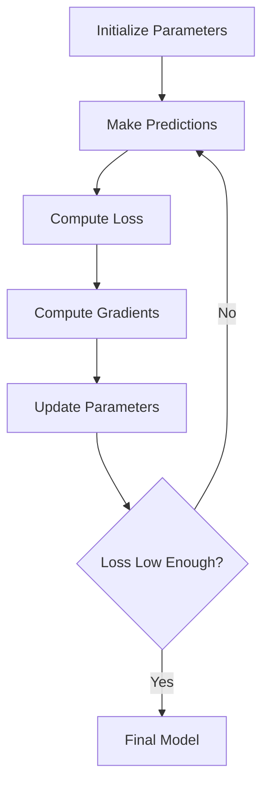
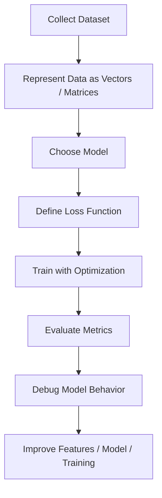

# 017 - Mathematics for Machine Learning

**Course:** 01 - Math, Statistics and Econometrics
**Module:** Module 01 - Mathematics for AI and Data Science
**Content Group:** Analysis and ML Math
**Roadmap Source:** Mathematics for AI and Data Science / Analysis and ML Math
**Lesson Type:** Mathematics
**Order in Module:** 017
**Suggested Duration:** 24 minutes

---

## 1. Summary

This lesson explains **Mathematics for Machine Learning** in the context of AI and Data Science.

Mathematics for Machine Learning is the foundation that helps us understand how machine learning models represent data, make predictions, measure errors, and improve through training.

After this lesson, you should understand how this topic helps answer questions such as:

* How is data represented mathematically?
* How does a model make a prediction?
* How is prediction error measured?
* How does training reduce error?
* Why do gradients and optimization matter?
* How are vectors, matrices, loss functions, PCA, neural networks, and embeddings connected?

The goal is not only to memorize formulas, but also to build intuition, implement small examples, and connect math to real machine learning workflows.

---

## 2. Learning Objectives

By the end of this lesson, you should be able to:

* Explain **Mathematics for Machine Learning** in your own words.
* Identify where mathematical concepts appear in the AI/Data Scientist workflow.
* Understand the role of vectors, matrices, functions, gradients, and optimization.
* Connect mathematical ideas to models such as linear regression, logistic regression, PCA, neural networks, and embeddings.
* Build a small practical artifact such as a notebook, chart, experiment, model, or portfolio note.

---

## 3. Big Picture

Machine Learning can be viewed as a mathematical learning process:

```text
data -> representation -> model -> prediction -> loss -> optimization -> better model
```

In simple terms:

> A machine learning model learns by adjusting its parameters to reduce prediction error.

---

## 4. Machine Learning Math Workflow



---

## 5. Key Concepts

### 5.1 Vector

A **vector** is a list of numbers used to represent one data point.

Example:

```text
house = [area, bedrooms, distance_to_city]
house = [80, 2, 5.5]
```

In Machine Learning, many things can be represented as vectors:

* A house
* A user
* An image
* A document
* A sentence
* A product
* An audio clip

---

### 5.2 Matrix

A **matrix** is a table of numbers, often used to represent a dataset.

Example:

```text
X = [
  [80, 2, 5.5],
  [120, 3, 8.0],
  [60, 1, 3.2]
]
```

In a typical dataset:

* Each row is one sample.
* Each column is one feature.
* Matrix operations help process many samples efficiently.

---

### 5.3 Function

A machine learning model is a function.

```text
input features -> model function -> prediction
```

For example, a simple linear regression model is:

$$
\hat{y} = wx + b
$$

Where:

* $$x$$ is the input feature.
* $$w$$ is the weight.
* $$b$$ is the bias.
* $$\hat{y}$$ is the predicted value.

---

### 5.4 Loss Function

A **loss function** measures how wrong the model prediction is.

For regression, a common loss function is **Mean Squared Error**:

$$
MSE = \frac{1}{n}\sum_{i=1}^{n}(y_i - \hat{y}_i)^2
$$

Meaning:

```text
large error  -> high loss
small error  -> low loss
```

The goal of training is to reduce the loss.

---

### 5.5 Gradient

A **gradient** tells us how the loss changes when the model parameters change.

Simple intuition:

```text
gradient = direction of steepest increase
negative gradient = direction to reduce loss
```

To reduce the loss, the model updates its parameters in the opposite direction of the gradient.

---

### 5.6 Optimization

**Optimization** is the process of finding better model parameters.

Gradient descent updates parameters using this rule:

$$
w = w - \alpha \frac{\partial L}{\partial w}
$$

$$
b = b - \alpha \frac{\partial L}{\partial b}
$$

Where:

* $$L$$ is the loss function.
* $$\alpha$$ is the learning rate.
* $$\frac{\partial L}{\partial w}$$ is the gradient with respect to weight.
* $$\frac{\partial L}{\partial b}$$ is the gradient with respect to bias.

---

## 6. Mathematics Map for Machine Learning



---

## 7. How Math Connects to ML Questions

| Machine Learning Question            | Mathematical Concept           |
| ------------------------------------ | ------------------------------ |
| How do we represent one data point?  | Vector                         |
| How do we represent a dataset?       | Matrix                         |
| How does a model make a prediction?  | Function                       |
| How do we measure prediction error?  | Loss function                  |
| How do we improve the model?         | Gradient descent               |
| How do neural networks learn?        | Chain rule and backpropagation |
| How do we reduce feature dimensions? | PCA and eigenvectors           |
| How do embeddings work?              | Vector space and similarity    |
| How do we model uncertainty?         | Probability                    |
| How do we evaluate data patterns?    | Statistics                     |

---

## 8. Simple Numeric Example

Suppose we have a simple model:

$$
\hat{y} = wx
$$

Given:

```text
x = 2
y = 10
w = 3
```

Prediction:

$$
\hat{y} = 3 \times 2 = 6
$$

Error:

$$
error = y - \hat{y} = 10 - 6 = 4
$$

Squared loss:

$$
L = (10 - 6)^2 = 16
$$

The model predicted `6`, but the correct value is `10`, so the loss is high.

Because:

$$
\hat{y} = wx
$$

If we want the prediction to become larger, the weight $$w$$ should increase.

---

## 9. Python Demo

```python
# Simple gradient descent for y_hat = w * x

x = 2
y = 10

w = 3.0
learning_rate = 0.1

for epoch in range(10):
    # Prediction
    y_hat = w * x

    # Loss
    loss = (y - y_hat) ** 2

    # Gradient of loss with respect to w
    # L = (y - wx)^2
    # dL/dw = -2x(y - wx)
    grad_w = -2 * x * (y - y_hat)

    # Update weight
    w = w - learning_rate * grad_w

    print(
        f"Epoch {epoch + 1}: "
        f"w={w:.4f}, "
        f"prediction={y_hat:.4f}, "
        f"loss={loss:.4f}"
    )
```

Expected behavior:

```text
The weight w moves closer to the value that makes the prediction close to 10.
The loss should generally decrease over epochs.
```

---

## 10. Visual Intuition

Gradient descent can be understood as moving downhill on a loss curve.

```text
Loss
 ^
 |
 |        *
 |      *
 |    *
 |  *
 | *
 +-----------------> Parameter w

Goal: move toward the lowest point of the loss curve.
```

Training loop:

```text
current parameter
      ↓
compute prediction
      ↓
compute loss
      ↓
compute gradient
      ↓
update parameter
      ↓
repeat
```

---

## 11. Training Loop Diagram



---

## 12. Where This Appears in the AI/Data Science Workflow



Mathematics for Machine Learning is useful in:

* Feature engineering
* Model selection
* Model training
* Loss function design
* Hyperparameter tuning
* Model debugging
* Dimensionality reduction
* Embedding search
* Neural network optimization

---

## 13. ML Use Cases

### 13.1 Linear Regression

Linear regression uses:

* Vectors
* Matrices
* Loss function
* Gradient descent

Example use case:

```text
Predict house price from area, number of rooms, and location score.
```

---

### 13.2 Logistic Regression

Logistic regression uses:

* Linear algebra
* Sigmoid function
* Cross-entropy loss
* Optimization

Example use case:

```text
Predict whether an email is spam or not spam.
```

---

### 13.3 PCA

PCA uses:

* Matrix transformation
* Variance
* Eigenvalues
* Eigenvectors

Example use case:

```text
Reduce 100 features into 2 dimensions for visualization.
```

---

### 13.4 Neural Networks

Neural networks use:

* Matrix multiplication
* Activation functions
* Chain rule
* Gradients
* Backpropagation

Example use case:

```text
Classify images into cats, dogs, and birds.
```

---

### 13.5 Embeddings

Embeddings use:

* Vectors
* Distance
* Similarity
* Dot product
* Cosine similarity

Example use case:

```text
Find documents that are semantically similar to a user query.
```

---

## 14. Practical Exercise

### Exercise 1: Manual Calculation

Given:

```text
x = 4
y = 20
w = 3
```

Model:

$$
\hat{y} = wx
$$

Tasks:

1. Compute the prediction.
2. Compute the error.
3. Compute the squared loss.
4. Decide whether $$w$$ should increase or decrease.

---

### Exercise 2: Python Check

Write 5-10 lines of Python to:

1. Create a small dataset.
2. Make predictions using a simple linear model.
3. Compute MSE loss.
4. Update the weight using gradient descent.

Starter code:

```python
xs = [1, 2, 3]
ys = [2, 4, 6]

w = 0.0
lr = 0.01

for epoch in range(100):
    # 1. Compute predictions
    # 2. Compute loss
    # 3. Compute gradient
    # 4. Update w
    pass
```

---

## 15. Mini Project

### Project: Gradient Descent from Scratch with MSE Loss

Create a notebook named:

```text
gradient_descent_from_scratch.ipynb
```

The notebook should include:

1. A small synthetic dataset.
2. A simple model:

```text
y_hat = wx + b
```

3. MSE loss calculation.
4. Manual gradient descent implementation.
5. A loss curve over epochs.
6. Final learned parameters.
7. Short explanation of training behavior.

Suggested chart:

```text
x-axis: epoch
y-axis: loss
```

Expected result:

```text
The loss should decrease as training progresses.
```

---

## 16. Common Mistakes

### Mistake 1: Memorizing Formulas Without Intuition

Do not only memorize:

$$
w = w - \alpha \nabla L
$$

Understand the meaning:

```text
adjust the model parameter in the direction that reduces error
```

---

### Mistake 2: Ignoring Shapes

Many ML bugs come from wrong matrix or tensor shapes.

Example:

```text
X shape: (100, 3)
w shape: (3,)
prediction shape: (100,)
```

Always check shapes when debugging.

---

### Mistake 3: Learning Rate Too Large

If the learning rate is too large, training may become unstable.

```text
loss: 10 -> 50 -> 500 -> 9000
```

This usually means the optimizer is jumping too far.

---

### Mistake 4: Learning Rate Too Small

If the learning rate is too small, training may be very slow.

```text
loss: 10.000 -> 9.999 -> 9.998
```

This usually means the optimizer is moving too little.

---

### Mistake 5: Trusting a Tiny Demo Too Much

A small demo may work, but real datasets can have:

* Noise
* Outliers
* Missing values
* High dimensionality
* Nonlinear patterns
* Data leakage
* Distribution shift

Always write down assumptions, limitations, and caveats.

---

## 17. Completion Checklist

You have completed this lesson if:

* [ ] You can explain **Mathematics for Machine Learning** in 1-2 minutes.
* [ ] You understand why vectors, matrices, functions, loss, and gradients matter.
* [ ] You can connect this topic to at least one ML model.
* [ ] You can compute a small numeric example by hand.
* [ ] You wrote a short Python demo to verify the result.
* [ ] You created or planned a notebook, chart, model, API, or portfolio note.
* [ ] You wrote down at least one caveat, assumption, or follow-up question.

---

## 18. Related Outcome

After this lesson, you should understand the mathematical language behind:

* Vectors
* Optimization
* Gradients
* PCA
* Neural networks
* Embeddings
* Loss functions
* Model training behavior

This foundation helps you read basic ML formulas and debug training behavior more confidently.

---

## 19. Portfolio Artifact

Create a portfolio note or notebook with the title:

```text
Mathematics for Machine Learning: Gradient Descent from Scratch
```

Include:

* Short explanation of the math
* Manual numeric example
* Python implementation
* Loss curve
* Observations
* Common bugs
* Final reflection

Example reflection:

```text
In this experiment, I learned that gradient descent improves a model by repeatedly adjusting parameters to reduce loss. The learning rate controls how large each update is. If it is too large, training can become unstable. If it is too small, training becomes slow.
```

---

## 20. Final Summary

**Mathematics for Machine Learning** is the foundation that helps us understand how models represent data, make predictions, measure errors, and improve through optimization.

For an AI/Data Scientist, the goal is not to study math in isolation. The goal is to turn math into practical artifacts:

```text
math concept -> numeric example -> Python demo -> chart -> ML use case -> portfolio artifact
```

A good learning outcome is not only knowing the formula, but also being able to use it to explain, implement, and debug a real Machine Learning workflow.
