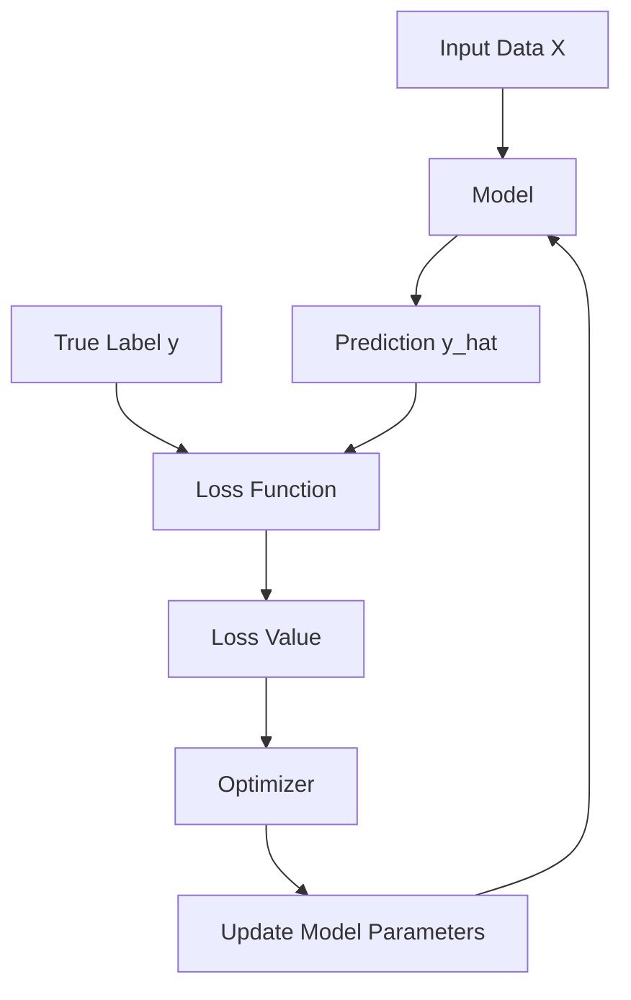
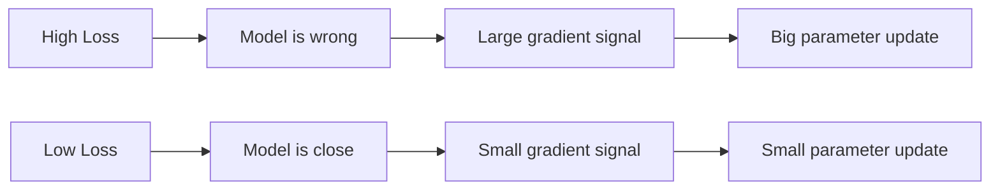

# 018 - Loss Function

**Course:** 01 - Math, Statistics and Econometrics
**Module:** Module 01 - Mathematics for AI and Data Science
**Content Group:** Analysis and ML Math
**Roadmap Source:** Mathematics for AI and Data Science / Analysis and ML Math
**Lesson Type:** Mathematics
**Order in Module:** 018
**Suggested Duration:** 24 minutes

---

## 1. Summary

A **Loss Function** measures how wrong a machine learning model is.

In AI and Data Science, a model makes predictions. The loss function compares those predictions with the true values and produces a number that represents error.

The smaller the loss, the better the model is performing on the given data.

```text
Prediction + True Value -> Loss Function -> Error Score
```

A loss function is the mathematical signal that tells the model how to improve during training.

---

## 2. Learning Objectives

After this lesson, you should be able to:

* Explain what a loss function is in your own words.
* Understand why loss functions are central to model training.
* Distinguish between common loss functions for regression and classification.
* Compute simple loss values by hand.
* Connect loss functions with gradients, optimization, and model debugging.
* Build a mini experiment using MSE loss and gradient descent.

---

## 3. Intuition

A loss function answers one core question:

> “How bad is the model’s prediction?”

Example:

```text
True value:      10
Model prediction: 8
Error:            2
```

But machine learning needs a precise mathematical way to measure this error.

Different problems require different loss functions.

| Problem Type               | Example Task        | Common Loss Function      |
| -------------------------- | ------------------- | ------------------------- |
| Regression                 | Predict house price | MSE, MAE, Huber Loss      |
| Binary Classification      | Spam or not spam    | Binary Cross-Entropy      |
| Multi-Class Classification | Cat, dog, bird      | Categorical Cross-Entropy |
| Ranking / Margin Models    | SVM classification  | Hinge Loss                |

---

## 4. Where Loss Function Fits in Machine Learning



The training loop usually works like this:

```text
1. Model makes prediction
2. Loss function measures error
3. Optimizer uses gradients to update parameters
4. Model improves over many iterations
```

---

## 5. Mathematical Definition

A loss function is usually written as:

$$
L(y, \hat{y})
$$

Where:

* $y$ = true value
* $\hat{y}$ = predicted value
* $L$ = loss function

For a dataset with $n$ samples, the average loss is often written as:

$$
J(\theta) = \frac{1}{n} \sum_{i=1}^{n} L(y_i, \hat{y}_i)
$$

Where:

* $J(\theta)$ = cost function or objective function
* $\theta$ = model parameters
* $n$ = number of training samples
* $y_i$ = true value of sample $i$
* $\hat{y}_i$ = prediction for sample $i$

---

## 6. Loss Function vs Cost Function vs Objective Function

These terms are related but not always identical.

| Term               | Meaning                                                               |
| ------------------ | --------------------------------------------------------------------- |
| Loss Function      | Error for one training example                                        |
| Cost Function      | Average loss over the dataset                                         |
| Objective Function | General function to optimize, often includes loss plus regularization |

Example:

$$
\text{Loss for one sample} = L(y_i, \hat{y}_i)
$$

$$
\text{Cost over dataset} = J(\theta) = \frac{1}{n} \sum_{i=1}^{n} L(y_i, \hat{y}_i)
$$

With regularization:

$$
J(\theta) = \frac{1}{n} \sum_{i=1}^{n} L(y_i, \hat{y}_i) + \lambda R(\theta)
$$

Where:

* $R(\theta)$ = regularization term
* $\lambda$ = strength of regularization

---

## 7. Common Loss Functions

---

### 7.1 Mean Squared Error - MSE

MSE is commonly used for regression.

$$
MSE = \frac{1}{n} \sum_{i=1}^{n} (y_i - \hat{y}_i)^2
$$

MSE penalizes large errors heavily because the error is squared.

Example:

```text
True values:      [3, 5, 7]
Predicted values: [2, 5, 10]

Errors:           [1, 0, -3]
Squared errors:   [1, 0, 9]

MSE = (1 + 0 + 9) / 3 = 3.33
```

Use MSE when:

* The task is regression.
* Large errors should be punished strongly.
* The data does not contain too many extreme outliers.

---

### 7.2 Mean Absolute Error - MAE

MAE measures the average absolute difference.

$$
MAE = \frac{1}{n} \sum_{i=1}^{n} |y_i - \hat{y}_i|
$$

Example:

```text
True values:      [3, 5, 7]
Predicted values: [2, 5, 10]

Absolute errors:  [1, 0, 3]

MAE = (1 + 0 + 3) / 3 = 1.33
```

Use MAE when:

* The task is regression.
* You want a loss function that is more robust to outliers.
* You care about direct error magnitude.

---

### 7.3 Binary Cross-Entropy Loss

Binary Cross-Entropy is used for binary classification.

Examples:

```text
Spam / Not Spam
Fraud / Not Fraud
Disease / No Disease
```

Formula:

$$
BCE = - \frac{1}{n} \sum_{i=1}^{n}
\left[
y_i \log(\hat{y}_i) + (1 - y_i)\log(1 - \hat{y}_i)
\right]
$$

Where:

* $y_i \in {0, 1}$
* $\hat{y}_i$ is the predicted probability

Example:

```text
True label: 1
Predicted probability: 0.9
Loss = -log(0.9) = 0.105
```

If the model is confident but wrong:

```text
True label: 1
Predicted probability: 0.1
Loss = -log(0.1) = 2.303
```

So Binary Cross-Entropy strongly punishes confident wrong predictions.

---

### 7.4 Categorical Cross-Entropy Loss

Categorical Cross-Entropy is used for multi-class classification.

Example task:

```text
Image classification:
- Cat
- Dog
- Bird
```

Formula:

$$
CCE = - \sum_{c=1}^{C} y_c \log(\hat{y}_c)
$$

Where:

* $C$ = number of classes
* $y_c$ = true one-hot label
* $\hat{y}_c$ = predicted probability for class $c$

Example:

```text
True class: Dog

True label:
Cat  = 0
Dog  = 1
Bird = 0

Predicted probabilities:
Cat  = 0.10
Dog  = 0.80
Bird = 0.10

Loss = -log(0.80) = 0.223
```

---

### 7.5 Huber Loss

Huber Loss combines MSE and MAE.

It behaves like MSE for small errors and like MAE for large errors.

$$
L_\delta(y, \hat{y}) =
\begin{cases}
\frac{1}{2}(y - \hat{y})^2, & \text{if } |y - \hat{y}| \leq \delta \
\delta |y - \hat{y}| - \frac{1}{2}\delta^2, & \text{otherwise}
\end{cases}
$$

Use Huber Loss when:

* You are solving a regression problem.
* You want some protection against outliers.
* You still want smooth gradients for small errors.

---

## 8. Visual Intuition



Loss tells the model how much correction is needed.

```text
High loss -> model needs large correction
Low loss  -> model is already close
```

---

## 9. Loss Surface

For simple models, the loss can be imagined as a surface.

```text
Loss
 ^
 |             *
 |          *     *
 |       *           *
 |    *                 *
 | *                       *
 +----------------------------> Model parameter
              minimum
```

The goal of training is to find parameters that minimize the loss.

Mathematically:

$$
\theta^* = \arg\min_{\theta} J(\theta)
$$

This means:

> Find the model parameters $\theta$ that produce the smallest possible cost $J(\theta)$.

---

## 10. Connection to Gradient Descent

Gradient descent updates model parameters in the direction that reduces loss.

Formula:

$$
\theta := \theta - \alpha \nabla_\theta J(\theta)
$$

Where:

* $\theta$ = model parameters
* $\alpha$ = learning rate
* $\nabla_\theta J(\theta)$ = gradient of the loss with respect to parameters

Simple interpretation:

```text
New parameter = Old parameter - Learning rate × Gradient
```

If the loss decreases over time, training is working.

If the loss increases or becomes unstable, something may be wrong.

---

## 11. Mini Numeric Example

Suppose we have one data point:

```text
x = 2
y = 5
```

A simple linear model:

$$
\hat{y} = wx
$$

Let:

```text
w = 1
```

Prediction:

$$
\hat{y} = 1 \times 2 = 2
$$

Error:

$$
y - \hat{y} = 5 - 2 = 3
$$

Squared error loss:

$$
L = (y - \hat{y})^2 = (5 - 2)^2 = 9
$$

So the model has a loss of:

```text
Loss = 9
```

If we increase $w$ from 1 to 2:

$$
\hat{y} = 2 \times 2 = 4
$$

$$
L = (5 - 4)^2 = 1
$$

The loss decreased from 9 to 1, so $w = 2$ is better than $w = 1$ for this data point.

---

## 12. Python Check

```python
import numpy as np

y_true = np.array([3, 5, 7])
y_pred = np.array([2, 5, 10])

mse = np.mean((y_true - y_pred) ** 2)
mae = np.mean(np.abs(y_true - y_pred))

print("MSE:", mse)
print("MAE:", mae)
```

Expected output:

```text
MSE: 3.3333333333333335
MAE: 1.3333333333333333
```

---

## 13. Mini Project: Gradient Descent from Scratch with MSE Loss

Goal:

> Train a simple linear model using MSE loss and visualize the loss curve over epochs.

Model:

$$
\hat{y} = wx + b
$$

Loss:

$$
MSE = \frac{1}{n} \sum_{i=1}^{n}(y_i - \hat{y}_i)^2
$$

Training loop:

```text
Initialize w and b
Repeat for many epochs:
    1. Predict y_hat
    2. Compute MSE loss
    3. Compute gradients
    4. Update w and b
    5. Save loss value
Plot loss curve
```

Python example:

```python
import numpy as np
import matplotlib.pyplot as plt

# Sample data
x = np.array([1, 2, 3, 4, 5], dtype=float)
y = np.array([2, 4, 6, 8, 10], dtype=float)

# Parameters
w = 0.0
b = 0.0
learning_rate = 0.01
epochs = 100

loss_history = []

for epoch in range(epochs):
    # Prediction
    y_pred = w * x + b

    # Loss
    loss = np.mean((y - y_pred) ** 2)
    loss_history.append(loss)

    # Gradients
    dw = np.mean(-2 * x * (y - y_pred))
    db = np.mean(-2 * (y - y_pred))

    # Update
    w = w - learning_rate * dw
    b = b - learning_rate * db

print("Final w:", w)
print("Final b:", b)

plt.plot(loss_history)
plt.xlabel("Epoch")
plt.ylabel("MSE Loss")
plt.title("Loss Curve")
plt.show()
```

Expected result:

```text
Loss should decrease over epochs.
The final model should learn approximately y = 2x.
```

---

## 14. How to Debug Training with Loss

Loss curves are one of the most important debugging tools in ML.

### Case 1: Loss decreases smoothly

```text
Good sign.
Training is working.
```

### Case 2: Loss does not decrease

Possible causes:

* Learning rate is too small.
* Model is too simple.
* Features are not useful.
* Data preprocessing is wrong.
* Gradients are not flowing correctly.

### Case 3: Loss explodes

Possible causes:

* Learning rate is too large.
* Data is not normalized.
* Gradients are exploding.
* Loss function is not suitable.

### Case 4: Training loss decreases but validation loss increases

Possible cause:

```text
Overfitting
```

The model memorizes training data but performs poorly on unseen data.

---

## 15. Common Mistakes

| Mistake                       | Why It Matters                                                       |
| ----------------------------- | -------------------------------------------------------------------- |
| Using MSE for classification  | Classification usually needs probability-based losses                |
| Ignoring outliers with MSE    | Large outliers can dominate squared error                            |
| Looking only at training loss | Validation loss is needed to detect overfitting                      |
| Confusing loss with accuracy  | Loss measures optimization error; accuracy measures task performance |
| Not checking scale            | Large target values can produce very large losses                    |
| Using the wrong reduction     | Mean vs sum changes gradient scale                                   |

---

## 16. Practical Exercise

### Exercise 1: Manual Calculation

Given:

```text
y_true = [4, 6, 8]
y_pred = [5, 5, 10]
```

Calculate:

1. Errors
2. Squared errors
3. MSE
4. Absolute errors
5. MAE

---

### Exercise 2: Python Verification

Write 5-10 lines of Python to verify your manual result.

---

### Exercise 3: ML Connection

Answer these questions:

```text
1. Is this a regression or classification loss?
2. What happens if one prediction is extremely wrong?
3. Would MSE or MAE be more sensitive to that outlier?
4. How would the loss curve help debug training?
```

---

## 17. Portfolio Artifact

Create a notebook named:

```text
018_loss_function_gradient_descent.ipynb
```

The notebook should include:

* Explanation of MSE, MAE, and Binary Cross-Entropy.
* Manual calculation example.
* Python implementation of MSE and MAE.
* Gradient descent from scratch.
* Loss curve over epochs.
* Short explanation of what the curve means.
* One caveat about choosing the right loss function.

---

## 18. Completion Checklist

* [ ] I can explain what a loss function is in 1-2 minutes.
* [ ] I can distinguish loss, cost, and objective function.
* [ ] I can compute MSE and MAE by hand.
* [ ] I understand why Cross-Entropy is used for classification.
* [ ] I know how loss connects to gradient descent.
* [ ] I can read a loss curve and identify basic training problems.
* [ ] I created a small notebook or code demo.
* [ ] I wrote down at least one caveat about loss functions.

---

## 19. Key Takeaways

* A loss function measures model error.
* Training is the process of minimizing loss.
* Regression and classification usually require different loss functions.
* MSE punishes large errors strongly.
* MAE is more robust to outliers.
* Cross-Entropy is useful when predictions are probabilities.
* Loss curves help debug training behavior.
* The choice of loss function directly affects what the model learns.

---

## 20. Final Summary

**Loss Function** is one of the most important mathematical ideas in machine learning.

It connects prediction, error, optimization, gradients, and model improvement.

A model does not simply “learn” by itself. It learns because the loss function gives it a measurable signal of what is wrong.

To make this lesson practical, turn it into a small notebook:

```text
small numeric example -> Python loss calculation -> gradient descent -> loss curve -> ML interpretation
```

This creates a concrete portfolio artifact and prepares you for deeper topics such as optimization, neural networks, regularization, and model evaluation.
