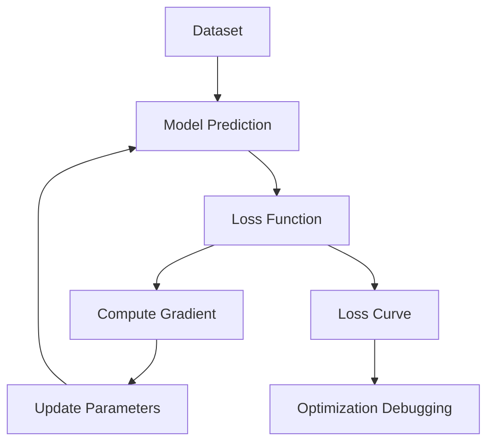
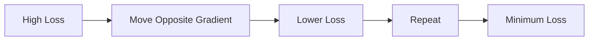
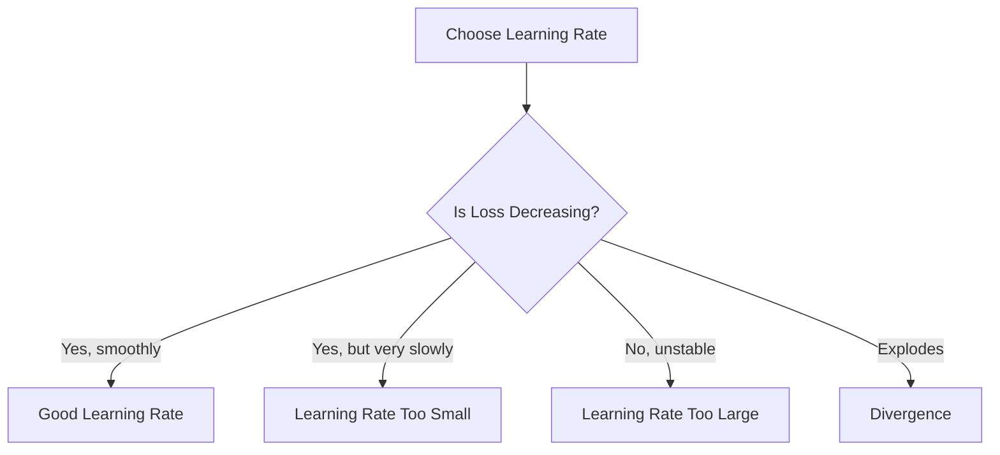

# 019 - Gradient Descent

**Course:** 01 - Math, Statistics and Econometrics
**Module:** Module 01 - Mathematics for AI and Data Science
**Content Group:** Analysis and ML Math
**Roadmap Source:** Mathematics for AI and Data Science / Analysis and ML Math
**Lesson Type:** Mathematics
**Order in Module:** 019
**Suggested Duration:** 24 minutes

---

## 1. Summary

This lesson explains **Gradient Descent** in the context of AI and Data Science.

Gradient Descent is an optimization algorithm used to find model parameters that minimize a loss function. In machine learning, it is one of the most important ideas behind training models such as linear regression, logistic regression, neural networks, and deep learning systems.

After this lesson, you should understand how Gradient Descent answers questions such as:

* How does a model learn from mistakes?
* How are model parameters updated during training?
* Why does the loss decrease over time?
* Why can a learning rate make training stable, slow, or divergent?
* How can we debug optimization using a loss curve?

---

## 2. Learning Objectives

By the end of this lesson, you should be able to:

* Explain Gradient Descent in your own words.
* Understand how it fits into the AI/Data Science workflow.
* Write the basic update rule for Gradient Descent.
* Apply Gradient Descent to a simple linear regression example.
* Plot or interpret a loss curve over training epochs.
* Recognize common training problems such as slow convergence and divergence.

---

## 3. Big Picture

In Machine Learning, a model makes predictions using parameters.

For example, in simple linear regression:

$$
\hat{y} = wx + b
$$

Where:

* $x$ is the input feature.
* $\hat{y}$ is the predicted output.
* $w$ is the weight.
* $b$ is the bias.

The model compares its prediction $\hat{y}$ with the true value $y$ using a **loss function**.

Gradient Descent updates $w$ and $b$ step by step so that the loss becomes smaller.

---

## 4. Where Gradient Descent Fits in the ML Workflow



Gradient Descent sits at the center of model training:

1. The model makes predictions.
2. The loss function measures the error.
3. The gradient tells the model how to change its parameters.
4. The parameters are updated.
5. The process repeats until the model improves.

---

## 5. Core Concept

Gradient Descent updates parameters in the direction that reduces the loss.

The general update rule is:

$$
\theta_{t+1} = \theta_t - \alpha \nabla_\theta J(\theta_t)
$$

Where:

* $\theta$ represents model parameters.
* $t$ is the current training step.
* $\alpha$ is the learning rate.
* $J(\theta)$ is the loss function.
* $\nabla_\theta J(\theta)$ is the gradient of the loss with respect to the parameters.

In simple words:

> New parameter = Old parameter - Learning rate × Gradient

---

## 6. Intuition

Imagine you are standing on a hill and want to walk downhill to the lowest point.

* The **loss function** is the height of the hill.
* The **gradient** tells you the steepest uphill direction.
* Gradient Descent moves in the opposite direction.
* The **learning rate** controls how big each step is.



---

## 7. Loss Function Example: Mean Squared Error

For regression, a common loss function is Mean Squared Error:

$$
J(w,b) = \frac{1}{n} \sum_{i=1}^{n}(\hat{y}_i - y_i)^2
$$

Since:

$$
\hat{y}_i = wx_i + b
$$

We can write:

$$
J(w,b) = \frac{1}{n} \sum_{i=1}^{n}(wx_i + b - y_i)^2
$$

The goal is to find $w$ and $b$ that minimize this loss.

---

## 8. Gradients for Linear Regression

For the model:

$$
\hat{y}_i = wx_i + b
$$

The gradients are:

$$
\frac{\partial J}{\partial w} = \frac{2}{n} \sum_{i=1}^{n} (\hat{y}_i - y_i)x_i
$$

$$
\frac{\partial J}{\partial b} = \frac{2}{n} \sum_{i=1}^{n} (\hat{y}_i - y_i)
$$

Then the parameters are updated as:

$$
w := w - \alpha \frac{\partial J}{\partial w}
$$

$$
b := b - \alpha \frac{\partial J}{\partial b}
$$

---

## 9. Learning Rate

The learning rate controls the step size.

| Learning Rate   | Behavior                           |
| --------------- | ---------------------------------- |
| Too small       | Training is stable but very slow   |
| Good value      | Loss decreases smoothly            |
| Too large       | Loss may jump around or diverge    |
| Extremely large | Model may completely fail to learn |



---

## 10. Algorithm Steps

Gradient Descent follows these steps:

1. Initialize parameters randomly or with zeros.
2. Make predictions using the current parameters.
3. Compute the loss.
4. Compute gradients.
5. Update parameters.
6. Repeat for many epochs.
7. Track the loss curve.

---

## 11. Pseudocode

```text
Initialize w and b

For each epoch:
    y_pred = w * x + b
    loss = mean((y_pred - y)^2)

    grad_w = derivative of loss with respect to w
    grad_b = derivative of loss with respect to b

    w = w - learning_rate * grad_w
    b = b - learning_rate * grad_b

Return trained w and b
```

---

## 12. Python Demo

```python
import numpy as np
import matplotlib.pyplot as plt

# Small dataset
x = np.array([1, 2, 3, 4, 5], dtype=float)
y = np.array([2, 4, 6, 8, 10], dtype=float)

# Initialize parameters
w = 0.0
b = 0.0

# Hyperparameters
lr = 0.01
epochs = 100

loss_history = []

for epoch in range(epochs):
    # Prediction
    y_pred = w * x + b

    # Loss: Mean Squared Error
    loss = ((y_pred - y) ** 2).mean()
    loss_history.append(loss)

    # Gradients
    grad_w = (2 / len(x)) * np.sum((y_pred - y) * x)
    grad_b = (2 / len(x)) * np.sum(y_pred - y)

    # Parameter updates
    w -= lr * grad_w
    b -= lr * grad_b

print("Final weight:", w)
print("Final bias:", b)
print("Final loss:", loss_history[-1])

# Plot loss curve
plt.plot(loss_history)
plt.xlabel("Epoch")
plt.ylabel("Loss")
plt.title("Loss Curve")
plt.show()
```

Expected idea:

```text
The model should learn a weight close to 2.
The bias should be close to 0.
The loss should decrease over epochs.
```

---

## 13. Manual Calculation Example

Suppose we have one data point:

$$
x = 2,\quad y = 6
$$

Initial parameters:

$$
w = 1,\quad b = 0
$$

Prediction:

$$
\hat{y} = wx + b = 1(2) + 0 = 2
$$

Loss:

$$
J = (\hat{y} - y)^2 = (2 - 6)^2 = 16
$$

Gradient with respect to $w$:

$$
\frac{\partial J}{\partial w} = 2(\hat{y} - y)x
$$

$$
\frac{\partial J}{\partial w} = # 2(2 - 6)(2) -16
$$

Gradient with respect to $b$:

$$
\frac{\partial J}{\partial b} = 2(\hat{y} - y)
$$

$$
\frac{\partial J}{\partial b} = # 2(2 - 6) -8
$$

Using learning rate:

$$
\alpha = 0.1
$$

Update $w$:

$$
w := w - \alpha \frac{\partial J}{\partial w}
$$

$$
w := 1 - 0.1(-16) = 2.6
$$

Update $b$:

$$
b := b - \alpha \frac{\partial J}{\partial b}
$$

$$
b := 0 - 0.1(-8) = 0.8
$$

After one update:

$$
w = 2.6,\quad b = 0.8
$$

The model has moved in a direction that reduces the error.

---

## 14. Types of Gradient Descent

| Type                        | Description                             | Pros                      | Cons                       |
| --------------------------- | --------------------------------------- | ------------------------- | -------------------------- |
| Batch Gradient Descent      | Uses the entire dataset for each update | Stable updates            | Slow for large datasets    |
| Stochastic Gradient Descent | Uses one sample per update              | Fast and memory-efficient | Noisy updates              |
| Mini-Batch Gradient Descent | Uses a small batch of samples           | Good balance              | Requires batch-size tuning |

Most deep learning models use **mini-batch Gradient Descent**.

---

## 15. Loss Curve Interpretation

A loss curve helps debug training.

### Good Training

```text
Loss
 |
 |\
 | \
 |  \
 |   \____
 |
 +------------ Epoch
```

Meaning:

* The model is learning.
* The loss decreases smoothly.
* The learning rate is probably reasonable.

### Learning Rate Too Small

```text
Loss
 |
 |\
 | \
 |  \
 |   \
 |    \
 +------------ Epoch
```

Meaning:

* Loss decreases very slowly.
* Training may need more epochs.
* Learning rate may be too small.

### Learning Rate Too Large

```text
Loss
 |
 |  /\   /\  /\
 | /  \ /  \/  \
 |/
 |
 +------------ Epoch
```

Meaning:

* Loss is unstable.
* Parameters may be jumping too far.
* Learning rate may be too large.

### Divergence

```text
Loss
 |
 |        /
 |      /
 |    /
 |  /
 |/
 +------------ Epoch
```

Meaning:

* Loss is increasing.
* Training is failing.
* Learning rate is likely too large.

---

## 16. Common Mistakes

### Mistake 1: Memorizing the Definition Only

Bad approach:

> Gradient Descent is an optimization algorithm.

Better approach:

> Gradient Descent updates model parameters by moving opposite the gradient of the loss function so that prediction error becomes smaller.

---

### Mistake 2: Ignoring the Learning Rate

A model may fail not because the algorithm is wrong, but because the learning rate is poorly chosen.

Common symptoms:

* Loss decreases too slowly.
* Loss oscillates.
* Loss explodes.
* Model parameters become extremely large.

---

### Mistake 3: Not Plotting the Loss Curve

Without a loss curve, it is difficult to know whether the model is learning.

Always track:

* Training loss
* Validation loss
* Number of epochs
* Learning rate
* Batch size

---

### Mistake 4: Confusing Gradient with Parameter Update

The gradient points toward the direction of greatest increase.

Gradient Descent moves in the opposite direction:

$$
\theta := \theta - \alpha \nabla J(\theta)
$$

---

### Mistake 5: Forgetting Validation

A model may reduce training loss but still perform poorly on unseen data.

This is called **overfitting**.

---

## 17. Practical Exercise

### Exercise 1: Manual Calculation

Given:

$$
x = 3,\quad y = 9
$$

Initial parameters:

$$
w = 1,\quad b = 1
$$

Learning rate:

$$
\alpha = 0.05
$$

Tasks:

1. Compute the prediction.
2. Compute the squared error.
3. Compute $\frac{\partial J}{\partial w}$.
4. Compute $\frac{\partial J}{\partial b}$.
5. Update $w$ and $b$.

---

### Exercise 2: Python Practice

Write a short Python script that:

* Creates a small dataset.
* Initializes $w$ and $b$.
* Runs Gradient Descent for 100 epochs.
* Prints the final parameters.
* Plots the loss curve.

---

### Exercise 3: Experiment

Try different learning rates:

```python
learning_rates = [0.0001, 0.001, 0.01, 0.1, 1.0]
```

Observe:

* Which learning rate is too slow?
* Which one is stable?
* Which one diverges?
* How does the loss curve change?

---

## 18. Mini Project

### Project: Gradient Descent from Scratch with MSE Loss

Build a small notebook that trains a linear regression model from scratch.

Your notebook should include:

1. A small synthetic dataset.
2. A linear model:

$$
\hat{y} = wx + b
$$

3. MSE loss:

$$
J(w,b) = \frac{1}{n} \sum_{i=1}^{n}(\hat{y}_i - y_i)^2
$$

4. Manual gradient calculation.
5. Parameter updates.
6. Loss curve visualization.
7. Short explanation of results.

Suggested artifact:

```text
gradient_descent_from_scratch.ipynb
```

Portfolio note:

```text
I implemented Gradient Descent from scratch for linear regression using MSE loss. 
I visualized the loss curve and tested different learning rates to understand 
stable training, slow convergence, and divergence.
```

---

## 19. Relationship to AI and Data Science

Gradient Descent is used in many areas:

| Area                   | How Gradient Descent Appears                |
| ---------------------- | ------------------------------------------- |
| Linear Regression      | Minimize MSE loss                           |
| Logistic Regression    | Minimize binary cross-entropy               |
| Neural Networks        | Train weights through backpropagation       |
| Deep Learning          | Optimize millions or billions of parameters |
| Embeddings             | Learn vector representations                |
| Recommendation Systems | Learn user/item factors                     |
| Computer Vision        | Train CNNs                                  |
| NLP                    | Train language models                       |

---

## 20. Key Takeaways

* Gradient Descent is used to minimize a loss function.
* It updates parameters using gradients.
* The learning rate controls step size.
* A good loss curve usually decreases smoothly.
* A bad learning rate can make training slow or unstable.
* Gradient Descent is the foundation of training many ML and DL models.

---

## 21. Completion Checklist

Before finishing this lesson, make sure you can:

* [ ] Explain Gradient Descent in 1-2 minutes.
* [ ] Write the update rule:

$$
\theta := \theta - \alpha \nabla J(\theta)
$$

* [ ] Explain what the learning rate does.
* [ ] Compute one manual Gradient Descent update.
* [ ] Implement Gradient Descent in 5-10 lines of Python.
* [ ] Plot and interpret a loss curve.
* [ ] Identify at least one caveat or limitation.
* [ ] Connect this topic to ML/DL training.

---

## 22. Caveats and Limitations

Gradient Descent is powerful, but it has limitations:

* It can get stuck in poor local minima or saddle points.
* It is sensitive to the learning rate.
* It may require feature scaling.
* It may be slow on very large datasets.
* It does not guarantee perfect generalization.
* Training loss alone is not enough; validation performance also matters.

---

## 23. Related Outcome

This lesson supports the following roadmap outcome:

> Understand the mathematical language behind vectors, optimization, gradients, PCA, neural networks, and embeddings.

Gradient Descent connects calculus, linear algebra, and machine learning into one practical training process.

---

## 24. Final Summary

**Gradient Descent** is a core optimization method in AI and Data Science.

It teaches a model by repeatedly:

1. Making predictions.
2. Measuring error with a loss function.
3. Computing gradients.
4. Updating parameters in the direction that reduces loss.

The most important formula is:

$$
\theta := \theta - \alpha \nabla J(\theta)
$$

To truly understand Gradient Descent, do not only memorize the definition. Build a small notebook, implement it from scratch, plot the loss curve, and experiment with different learning rates.

---

# Bài luyện tập

## Mục tiêu


## Đề bài


## Yêu cầu hoàn thành

- [ ] 
- [ ] 
- [ ] 

## Kết quả / lời giải


## Ghi chú
