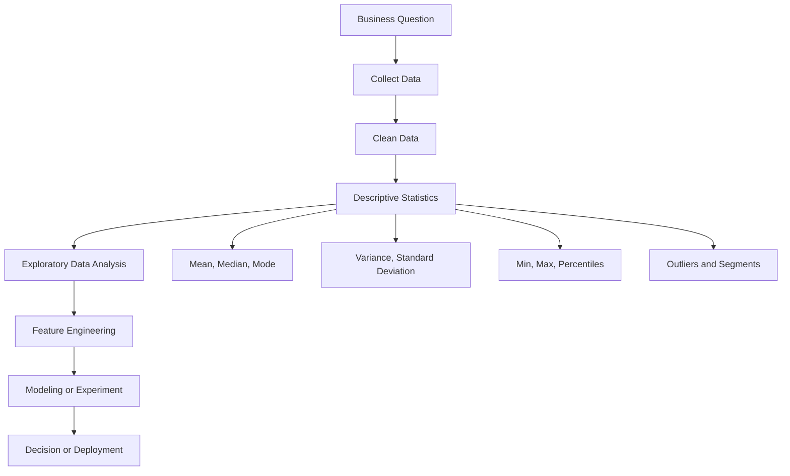
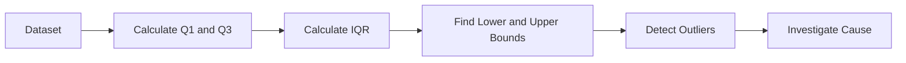
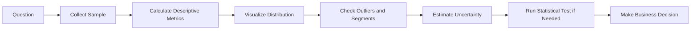
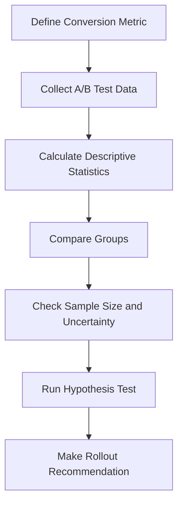

# 001 - Descriptive Statistics

**Course:** 01 - Math, Statistics and Econometrics
**Module:** Module 02 - Statistics
**Content Group:** Descriptive Statistics
**Roadmap Source:** Statistics / Descriptive Statistics
**Lesson Type:** Statistics
**Order in Module:** 001
**Suggested Duration:** 24 minutes

---

## 1. Summary

**Descriptive Statistics** is the foundation for understanding data before applying machine learning, statistical tests, or business decision-making.

It helps an AI or Data Scientist answer questions such as:

* What does the dataset look like?
* What is the typical value?
* How much variation exists?
* Are there outliers or unusual patterns?
* Are different groups or segments behaving differently?
* Is the data ready for modeling or experimentation?

In practice, descriptive statistics often appears in:

* Exploratory Data Analysis, also called EDA
* Data quality checks
* Dashboard metrics
* A/B test preparation
* Feature understanding before model training
* Business reporting

---

## 2. Learning Objectives

After this lesson, you should be able to:

* Explain **Descriptive Statistics** in your own words.
* Identify where descriptive statistics fits in the AI/Data Science workflow.
* Calculate and interpret basic statistical metrics.
* Understand the difference between central tendency, spread, and shape.
* Detect outliers and segment-level differences.
* Turn descriptive statistics into a notebook, chart, dashboard, or portfolio artifact.

---

## 3. Main Idea

Descriptive statistics summarize and describe a dataset.

Instead of looking at thousands or millions of raw rows, we use summary metrics to understand the data quickly.

```text
Raw data
   ↓
Summary metrics
   ↓
Charts and distributions
   ↓
Insights
   ↓
Better decisions
```

---

## 4. Where Descriptive Statistics Fits in the Data Science Workflow



Descriptive statistics is usually one of the first steps after data cleaning.

It helps you avoid modeling blindly.

---

## 5. Key Concepts

### 5.1 Central Tendency

Central tendency describes the typical or representative value of a dataset.

Common metrics:

| Metric | Meaning             | When to Use                                     |
| ------ | ------------------- | ----------------------------------------------- |
| Mean   | Average value       | Good for balanced data without extreme outliers |
| Median | Middle value        | Better when data has outliers or skew           |
| Mode   | Most frequent value | Useful for categorical or repeated values       |

#### Mean

The mean is calculated as:

$$
\bar{x} = \frac{1}{n}\sum_{i=1}^{n}x_i
$$

Where:

* $$\bar{x}$$ is the sample mean
* $$x_i$$ is each data value
* $$n$$ is the number of observations

Example:

```text
Data: 10, 20, 30

Mean = (10 + 20 + 30) / 3 = 20
```

---

### 5.2 Spread or Variability

Spread tells us how much the data varies.

Two datasets can have the same mean but very different variability.

```text
Dataset A: 49, 50, 51
Dataset B: 10, 50, 90

Both may center around 50, but Dataset B is much more spread out.
```

Common spread metrics:

| Metric                   | Meaning                                |
| ------------------------ | -------------------------------------- |
| Range                    | Max value minus min value              |
| Variance                 | Average squared distance from the mean |
| Standard Deviation       | Typical distance from the mean         |
| Interquartile Range, IQR | Spread of the middle 50% of data       |

#### Variance

For a sample:

$$
s^2 = \frac{1}{n-1}\sum_{i=1}^{n}(x_i - \bar{x})^2
$$

#### Standard Deviation

$$
s = \sqrt{s^2}
$$

Standard deviation is easier to interpret because it has the same unit as the original data.

---

### 5.3 Percentiles and Quartiles

Percentiles describe the position of a value in the dataset.

| Metric              | Meaning                            |
| ------------------- | ---------------------------------- |
| 25th percentile, Q1 | 25% of values are below this point |
| 50th percentile, Q2 | Median                             |
| 75th percentile, Q3 | 75% of values are below this point |
| IQR                 | Q3 - Q1                            |

#### Interquartile Range

$$
IQR = Q3 - Q1
$$

IQR is useful for detecting outliers.

---

### 5.4 Outliers

Outliers are unusually high or low values.

A common rule:

$$
Lower\ Bound = Q1 - 1.5 \times IQR
$$

$$
Upper\ Bound = Q3 + 1.5 \times IQR
$$

Values outside this range may be considered outliers.



Important: not every outlier is an error.

Some outliers are real and meaningful, such as:

* Very high-value customers
* Fraudulent transactions
* Extreme weather events
* Viral posts
* System failures

---

### 5.5 Shape of Distribution

The shape of a distribution helps us understand how values are arranged.

Common distribution shapes:

| Shape        | Meaning                                        |
| ------------ | ---------------------------------------------- |
| Symmetric    | Values are balanced around the center          |
| Right-skewed | A few very large values pull the mean upward   |
| Left-skewed  | A few very small values pull the mean downward |
| Bimodal      | Two peaks may indicate two different groups    |

```text
Symmetric:
        *
      * * *
    * * * * *
      * * *
        *

Right-skewed:
    * * * * *
      * * *
        * *
          *
            *

Left-skewed:
            * * * * *
          * * *
        * *
      *
    *
```

---

## 6. Common Descriptive Statistics Metrics

| Category         | Metrics                                  |
| ---------------- | ---------------------------------------- |
| Central tendency | Mean, median, mode                       |
| Spread           | Range, variance, standard deviation, IQR |
| Position         | Percentiles, quartiles, rank             |
| Shape            | Skewness, kurtosis                       |
| Frequency        | Count, frequency table, proportions      |
| Relationship     | Correlation, cross-tabulation            |

---

## 7. Example: Conversion Rate Dataset

Suppose we have a small dataset of users visiting a website.

| User ID | Group | Session Duration | Converted |
| ------- | ----- | ---------------: | --------: |
| 1       | A     |               35 |         0 |
| 2       | A     |               42 |         1 |
| 3       | A     |               28 |         0 |
| 4       | B     |               60 |         1 |
| 5       | B     |               72 |         1 |
| 6       | B     |               25 |         0 |

We can ask:

* What is the average session duration?
* Which group has higher conversion?
* Are there unusually long or short sessions?
* Is Group B really better, or is the sample too small?

---

## 8. Basic Calculation Example

### Mean Session Duration

For Group A:

$$
Mean_A = \frac{35 + 42 + 28}{3} = 35
$$

For Group B:

$$
Mean_B = \frac{60 + 72 + 25}{3} = 52.33
$$

Group B has a higher average session duration.

However, we should be careful because the sample size is very small.

---

## 9. Descriptive Statistics vs Inferential Statistics

| Type                   | Main Question                              | Example                              |
| ---------------------- | ------------------------------------------ | ------------------------------------ |
| Descriptive Statistics | What happened in the data?                 | Average conversion rate is 12%       |
| Inferential Statistics | What can we conclude about the population? | Variant B likely improves conversion |
| Predictive Modeling    | What will happen next?                     | Predict whether a user will convert  |

Descriptive statistics describes the current dataset.

It does not automatically prove cause and effect.

---

## 10. Practical Demo Flow

```text
question -> sample -> metric -> uncertainty -> statistical test -> decision
```

Expanded version:



Example:

```text
Question:
Did the new landing page improve conversion?

Metric:
Conversion rate

Descriptive statistics:
- Number of users
- Number of conversions
- Conversion rate per group
- Difference between groups
- Segment-level breakdown

Decision:
Roll out, reject, or continue testing
```

---

## 11. Python Demo

```python
import pandas as pd

data = {
    "group": ["A", "A", "A", "B", "B", "B"],
    "session_duration": [35, 42, 28, 60, 72, 25],
    "converted": [0, 1, 0, 1, 1, 0]
}

df = pd.DataFrame(data)

summary = df.groupby("group").agg(
    users=("converted", "count"),
    avg_session_duration=("session_duration", "mean"),
    median_session_duration=("session_duration", "median"),
    std_session_duration=("session_duration", "std"),
    conversion_rate=("converted", "mean")
)

print(summary)
```

Expected interpretation:

```text
Group B has higher average session duration and higher conversion rate.
However, the sample size is too small to make a strong conclusion.
```

---

## 12. Business Interpretation Example

A weak conclusion:

```text
Group B is better because its conversion rate is higher.
```

A better conclusion:

```text
In this small sample, Group B shows a higher conversion rate and longer average session duration than Group A. However, the sample size is too small to conclude that the difference is statistically reliable. More data should be collected before making a rollout decision.
```

---

## 13. Common Mistakes

### Mistake 1: Trusting only the mean

The mean can be misleading when the data contains outliers.

Example:

```text
Income data:
300, 350, 400, 450, 10000
```

The mean is much higher than most actual values.

The median may be more representative.

---

### Mistake 2: Ignoring sample size

A metric based on 10 users is much less reliable than a metric based on 10,000 users.

```text
Conversion rate from 2 users:
1 conversion / 2 users = 50%

Conversion rate from 10,000 users:
5,000 conversions / 10,000 users = 50%
```

Both are 50%, but they do not have the same reliability.

---

### Mistake 3: Ignoring segments

A global average can hide important differences.

Example:

```text
Overall conversion rate increased.

But:
- Mobile users decreased
- Desktop users increased
- New users decreased
- Returning users increased
```

Always inspect segments when possible.

---

### Mistake 4: Confusing statistical significance with business significance

A result can be statistically significant but not important for the business.

Example:

```text
Conversion increased from 10.00% to 10.05%.
```

This may be statistically significant with a huge sample size, but the business impact may be too small.

---

### Mistake 5: Ignoring uncertainty

Every metric based on a sample has uncertainty.

Descriptive statistics should often be followed by:

* Confidence intervals
* Hypothesis tests
* A/B test analysis
* Sensitivity analysis

---

## 14. Practical Exercise

Create a small simulated dataset with at least these columns:

| Column           | Description                   |
| ---------------- | ----------------------------- |
| user_id          | Unique user identifier        |
| group            | A/B test group                |
| session_duration | Time spent on product         |
| converted        | Whether the user converted    |
| revenue          | Revenue generated by the user |

Then answer:

1. What is the average session duration?
2. What is the median revenue?
3. Which group has the higher conversion rate?
4. Are there outliers in revenue?
5. Is the sample size large enough to make a strong conclusion?
6. What business recommendation would you give?

---

## 15. Portfolio Artifact Idea

Create a notebook titled:

```text
Descriptive Statistics for A/B Test Conversion Analysis
```

The notebook should include:

* Dataset description
* Summary statistics
* Group-level comparison
* Distribution charts
* Outlier analysis
* Business conclusion
* Caveats and next steps

Possible outputs:

```text
Notebook
Dashboard
Metric report
SQL query
Experiment summary
Portfolio case study
```

---

## 16. Completion Checklist

* [ ] I can explain **Descriptive Statistics** in 1-2 minutes.
* [ ] I can calculate mean, median, mode, variance, and standard deviation.
* [ ] I understand when the median is better than the mean.
* [ ] I can identify outliers using IQR.
* [ ] I can compare descriptive statistics across groups.
* [ ] I understand that descriptive statistics do not prove causality.
* [ ] I can write a business conclusion based on summary metrics.
* [ ] I have created a small notebook, query, chart, dashboard, or portfolio note for this lesson.
* [ ] I have written down at least one caveat, assumption, or follow-up question.

---

## 17. Related Outcome

Use probability, sampling, descriptive statistics, hypothesis testing, and A/B testing to make decisions from data.

---

## 18. Related Project

**Mini Project:** A/B Test Conversion Rate Analysis

Project goal:

```text
Analyze whether a new product or landing page improves conversion rate.
```

Recommended workflow:



Expected final output:

```text
A clear recommendation:
- Roll out variant B
- Keep variant A
- Continue the experiment
- Collect more data
```

---

## 19. Final Summary

**Descriptive Statistics** is the first statistical step in understanding data.

It helps you summarize:

* What is typical
* How much variation exists
* Whether outliers exist
* How groups differ
* Whether the data is ready for deeper analysis

For an AI or Data Scientist, descriptive statistics is not just theory.

It can become:

* An EDA notebook
* A business dashboard
* A data quality report
* An A/B test summary
* A model input analysis
* A portfolio project

The key habit is simple:

```text
Never model before understanding the data.
```

---

# Bài luyện tập

## Mục tiêu


## Đề bài


## Yêu cầu hoàn thành

- [ ] 
- [ ] 
- [ ] 

## Kết quả / lời giải


## Ghi chú
