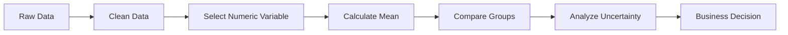
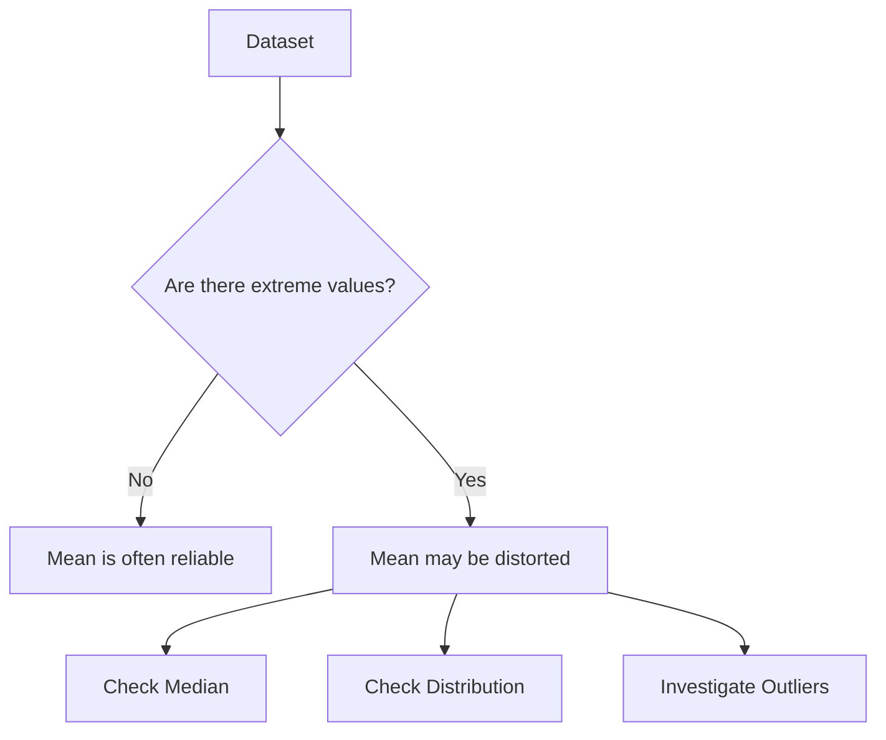
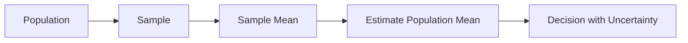
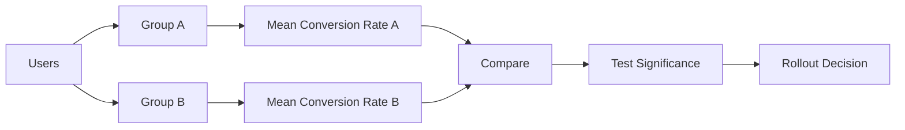
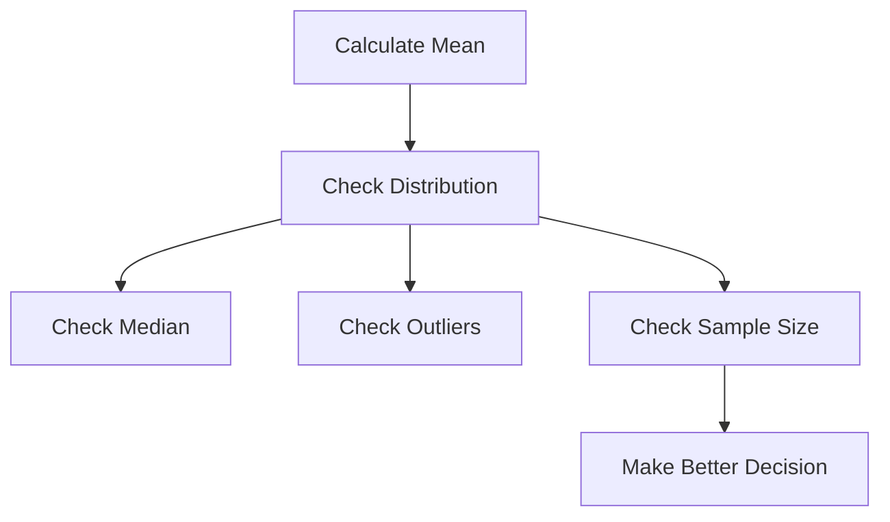
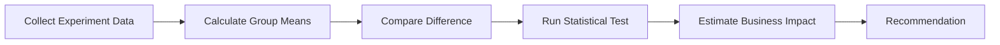

# 002 - Mean

**Course:** 01 - Math, Statistics and Econometrics
**Module:** Module 02 - Statistics
**Content Group:** Descriptive Statistics
**Roadmap Source:** Statistics / Descriptive Statistics
**Lesson Type:** Statistics
**Order in Module:** 002
**Suggested Duration:** 24 minutes

---

## 1. Summary

This lesson explains **Mean** in the context of AI and Data Science.

The **mean** is one of the most common descriptive statistics. It summarizes a group of numerical values into a single representative value. In data science, the mean is often used to understand central tendency, compare groups, monitor metrics, evaluate experiments, and communicate business insights.

After this lesson, you should understand what question the mean helps answer, where it appears in the AI/Data Scientist workflow, and how it can become a notebook, metric, chart, API, experiment report, or portfolio artifact.

---

## 2. Learning Objectives

After completing this lesson, you should be able to:

* Explain **Mean** in your own words.
* Calculate the mean manually and with code.
* Understand where the mean is used in AI/Data Science workflows.
* Recognize when the mean is useful and when it can be misleading.
* Apply the mean to a dataset, metric, dashboard, experiment, or business decision.

---

## 3. Core Concept

The **mean**, also called the **average**, is calculated by adding all values together and dividing by the number of values.

### Formula

For a dataset:

$$
x_1, x_2, x_3, ..., x_n
$$

The sample mean is:

$$
\bar{x} = \frac{x_1 + x_2 + x_3 + ... + x_n}{n}
$$

Or more compactly:

$$
\bar{x} = \frac{1}{n}\sum_{i=1}^{n}x_i
$$

Where:

| Symbol    | Meaning                |
| --------- | ---------------------- |
| $\bar{x}$ | Sample mean            |
| $x_i$     | Each data value        |
| $n$       | Number of observations |
| $\sum$    | Sum of all values      |

---

## 4. Intuition

The mean answers this question:

> If all values were evenly distributed, what value would each observation have?

Example:

```text
Dataset: 10, 20, 30

Mean = (10 + 20 + 30) / 3
Mean = 60 / 3
Mean = 20
```

So the average value is **20**.

---

## 5. Workflow in Data Science



The mean is often used early in the data analysis workflow to summarize data before deeper modeling or testing.

---

## 6. Example in AI & Data Science

Suppose you are analyzing the daily number of active users in an app.

```text
Day 1: 100 users
Day 2: 120 users
Day 3: 130 users
Day 4: 150 users
Day 5: 500 users
```

Mean:

$$
\bar{x} = \frac{100 + 120 + 130 + 150 + 500}{5}
$$

$$
\bar{x} = \frac{1000}{5} = 200
$$

The mean daily active users is **200**.

However, the value **500** is much larger than the other values. This may be an outlier caused by a campaign, bot traffic, or a one-time event.

So the mean is useful, but it must be interpreted carefully.

---

## 7. Mean vs Real Data Behavior



The mean is sensitive to outliers. A single extreme value can significantly change the result.

---

## 8. Types of Mean

### 8.1 Arithmetic Mean

This is the standard average.

$$
\bar{x} = \frac{\sum x_i}{n}
$$

Example use cases:

* Average revenue
* Average session duration
* Average test score
* Average model latency

---

### 8.2 Weighted Mean

A **weighted mean** gives different importance to different values.

Formula:

$$
\bar{x}_w = \frac{\sum w_i x_i}{\sum w_i}
$$

Where:

| Symbol      | Meaning       |
| ----------- | ------------- |
| $x_i$       | Value         |
| $w_i$       | Weight        |
| $\bar{x}_w$ | Weighted mean |

Example:

| Channel | Conversion Rate | Traffic Weight |
| ------- | --------------: | -------------: |
| Organic |              5% |            70% |
| Ads     |              3% |            30% |

Weighted mean:

$$
(0.05 \times 0.70) + (0.03 \times 0.30) = 0.044
$$

The weighted average conversion rate is **4.4%**.

---

## 9. Mean in AI / ML Workflow

The mean appears in many AI and Machine Learning tasks.

| Area                | Example                                                  |
| ------------------- | -------------------------------------------------------- |
| Data exploration    | Average age, income, price, session duration             |
| Feature engineering | Mean encoding, rolling mean, group mean                  |
| Model evaluation    | Mean accuracy, mean loss, mean absolute error            |
| Experiments         | Average conversion rate, average revenue per user        |
| Monitoring          | Average latency, average error rate, average daily usage |
| Business reporting  | Average order value, average retention, average churn    |

---

## 10. Common Metrics Using Mean

### Mean Absolute Error

Used in regression problems.

$$
MAE = \frac{1}{n}\sum_{i=1}^{n}|y_i - \hat{y}_i|
$$

### Mean Squared Error

Also used in regression.

$$
MSE = \frac{1}{n}\sum_{i=1}^{n}(y_i - \hat{y}_i)^2
$$

### Average Conversion Rate

Used in product analytics and A/B testing.

$$
Conversion\ Rate = \frac{Conversions}{Visitors}
$$

When comparing multiple groups, we often compare their average conversion rates.

---

## 11. Practical Demo

### Question

> What is the average order value of customers?

### Sample Dataset

| Customer | Order Value |
| -------- | ----------: |
| A        |          20 |
| B        |          30 |
| C        |          25 |
| D        |          40 |
| E        |          35 |

Mean:

$$
\bar{x} = \frac{20 + 30 + 25 + 40 + 35}{5}
$$

$$
\bar{x} = \frac{150}{5} = 30
$$

The average order value is **30**.

---

## 12. Python Example

```python
import pandas as pd

data = {
    "customer": ["A", "B", "C", "D", "E"],
    "order_value": [20, 30, 25, 40, 35]
}

df = pd.DataFrame(data)

mean_order_value = df["order_value"].mean()

print(mean_order_value)
```

Output:

```text
30.0
```

---

## 13. Mean and Uncertainty

The mean from a sample is only an estimate of the true population mean.



A good data scientist should not only report the mean, but also consider:

* Sample size
* Sampling bias
* Variance
* Confidence interval
* Business impact

---

## 14. Statistical Thinking

A mean value alone is not always enough.

Example:

```text
Group A average revenue: $50
Group B average revenue: $55
```

At first glance, Group B looks better.

But before making a decision, ask:

* How large is the sample size?
* Is the difference statistically significant?
* Is the difference meaningful for the business?
* Are there outliers?
* Are the two groups comparable?
* Could the data be biased?

---

## 15. Mean in A/B Testing

In an A/B test, the mean is often used to compare performance between two groups.



Example:

| Group | Users | Conversions | Conversion Rate |
| ----- | ----: | ----------: | --------------: |
| A     | 1,000 |         100 |             10% |
| B     | 1,000 |         120 |             12% |

Group B has a higher average conversion rate.

However, you still need a statistical test to know whether the difference is likely real or just random noise.

---

## 16. Practical Exercise

Create a small simulated dataset and calculate the mean.

### Task

Use any dataset with at least one numeric column.

Examples:

* User ages
* Product prices
* Daily revenue
* Model latency
* Exam scores
* Number of app sessions

### Steps

```text
question -> sample -> metric -> uncertainty -> statistical test -> decision
```

### Example Questions

* What is the average revenue per user?
* What is the average model response time?
* What is the average test score?
* What is the average order value?
* What is the average conversion rate?

---

## 17. Business Interpretation Template

Use this template to write a business conclusion:

```text
The average [metric] is [value] based on [sample size] observations.
This suggests that [business interpretation].
However, the result should be interpreted carefully because [caveat].
The next step is to check [uncertainty / distribution / outliers / statistical significance].
```

Example:

```text
The average order value is $30 based on 5 customer orders.
This suggests that a typical customer spends around $30 per order.
However, the result should be interpreted carefully because the sample size is small.
The next step is to check the distribution of order values and look for outliers.
```

---

## 18. Common Mistakes

### Mistake 1: Ignoring Outliers

The mean can be strongly affected by extreme values.

```text
Data: 10, 12, 11, 13, 1000
Mean: 209.2
```

The mean is not representative of most values in this dataset.

---

### Mistake 2: Small Sample Size

A mean based on 5 observations is usually less reliable than a mean based on 5,000 observations.

---

### Mistake 3: Confusing Statistical Significance with Business Significance

A difference can be statistically significant but too small to matter for the business.

Example:

```text
Old conversion rate: 10.00%
New conversion rate: 10.01%
```

This may be statistically significant with a huge sample size, but it may not be meaningful enough to justify a product rollout.

---

### Mistake 4: Ignoring Bias

If the sample is biased, the mean may not represent the real population.

Example:

```text
Surveying only active users may overestimate customer satisfaction.
```

---

### Mistake 5: Using Mean Without Distribution

Always inspect the distribution when possible.



---

## 19. Checklist

Before finishing this lesson, make sure you can:

* [ ] Explain **Mean** in 1-2 minutes.
* [ ] Calculate the mean manually.
* [ ] Calculate the mean using Python, SQL, or a spreadsheet.
* [ ] Explain why the mean can be affected by outliers.
* [ ] Compare mean with median at a basic level.
* [ ] Use the mean in a business or data science example.
* [ ] Mention at least one caveat, assumption, or follow-up question.
* [ ] Create a small notebook, query, chart, API, or note using the mean.

---

## 20. Related Outcome

Use probability, sampling, descriptive statistics, hypothesis testing, and A/B testing to make decisions from data.

---

## 21. Related Project

### Mini Project: A/B Test Conversion Rate

Build a small A/B testing analysis that includes:

* Conversion metric
* Group-level mean conversion rate
* Sample size
* Hypothesis test
* Confidence interval
* Rollout recommendation

Suggested project flow:



---

## 22. Final Summary

**Mean** is a foundational concept in Statistics and Data Science.

It helps summarize numerical data into a single representative value. It is widely used in dashboards, experiments, model evaluation, monitoring, and business reporting.

However, the mean should never be interpreted blindly. Always consider sample size, bias, uncertainty, outliers, and business impact.

A strong AI/Data Scientist does not only calculate the mean, but also explains what it means, when it is reliable, and what decision it supports.
