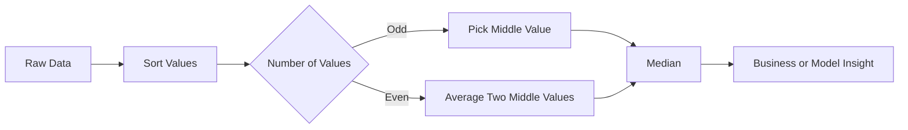

# 003 - Median

**Course:** 01 - Math, Statistics and Econometrics
**Module:** Module 02 - Statistics
**Content Group:** Descriptive Statistics
**Roadmap Source:** Statistics / Descriptive Statistics
**Lesson Type:** Statistics
**Order in Module:** 003
**Suggested Duration:** 24 minutes

---

## 1. Summary

This lesson explains **Median** in the context of AI and Data Science.

After this lesson, you should understand how the median helps summarize data, when it is more useful than the mean, and how it can support decisions in dashboards, experiments, models, and business analysis.

The **median** is the middle value of a sorted dataset. It is especially useful when the data contains **outliers** or is **skewed**.

---

## 2. Learning Objectives

By the end of this lesson, you should be able to:

* Explain **Median** in your own words.
* Understand where median appears in the AI/Data Science workflow.
* Calculate the median manually and with code.
* Compare median with mean.
* Use median to analyze a dataset, chart, notebook, metric, experiment, or dashboard.
* Write a short business conclusion based on median values.

---

## 3. Key Concepts

### 3.1 What Is Median?

The **median** is the value that separates a dataset into two equal halves.

* 50% of the values are less than or equal to the median.
* 50% of the values are greater than or equal to the median.

Example:

```text
Data: 2, 4, 6, 8, 10

Median = 6
```

Because `6` is the middle value.

---

## 4. Median Formula

First, sort the data:

```text
x(1) ≤ x(2) ≤ x(3) ≤ ... ≤ x(n)
```

### Case 1: Odd Number of Values

If `n` is odd:

```text
Median = x((n + 1) / 2)
```

Example:

```text
Data: 3, 5, 7, 9, 11

n = 5

Median = x((5 + 1) / 2)
Median = x(3)
Median = 7
```

---

### Case 2: Even Number of Values

If `n` is even:

```text
Median = [x(n / 2) + x(n / 2 + 1)] / 2
```

Example:

```text
Data: 3, 5, 7, 9

n = 4

Median = [x(2) + x(3)] / 2
Median = (5 + 7) / 2
Median = 6
```

---

## 5. Why Median Matters in Data Science

Median is useful because it is **robust to outliers**.

For example:

```text
Salaries: 500, 600, 700, 800, 100000
```

Mean:

```text
Mean = (500 + 600 + 700 + 800 + 100000) / 5
Mean = 20520
```

Median:

```text
Median = 700
```

The mean is heavily affected by the extreme value `100000`, but the median still represents the typical salary better.

---

## 6. Mean vs Median

| Metric | Meaning       | Sensitive to Outliers? | Best Used When                           |
| ------ | ------------- | ---------------------: | ---------------------------------------- |
| Mean   | Average value |                    Yes | Data is balanced and not strongly skewed |
| Median | Middle value  |                     No | Data is skewed or contains outliers      |

---

## 7. Simple Workflow Diagram



---

## 8. Example / Demo

### Business Question

```text
What is the typical order value of customers?
```

### Sample Data

```text
Order values: 20, 25, 30, 35, 1000
```

### Mean

```text
Mean = (20 + 25 + 30 + 35 + 1000) / 5
Mean = 222
```

### Median

```text
Median = 30
```

### Interpretation

The mean suggests that the typical order value is `222`, but this is misleading because one customer made a very large purchase.

The median value `30` gives a better picture of a typical customer order.

---

## 9. Median in AI and Data Science Workflow

```text
question -> sample -> metric -> uncertainty -> comparison -> decision
```

Example:

```text
Business question:
Are users spending more time in the new app version?

Data:
Session duration from users in version A and version B

Metric:
Median session duration

Decision:
If the median session duration increases meaningfully, the new version may improve user engagement.
```

Median is commonly used in:

* Customer spending analysis
* Salary analysis
* House price analysis
* Session duration analysis
* Latency monitoring
* Model error analysis
* A/B testing
* Dashboard reporting

---

## 10. Python Example

```python
import numpy as np

data = [20, 25, 30, 35, 1000]

mean_value = np.mean(data)
median_value = np.median(data)

print("Mean:", mean_value)
print("Median:", median_value)
```

Expected output:

```text
Mean: 222.0
Median: 30.0
```

---

## 11. Practical Exercise

Create a small simulated dataset and calculate the median.

### Task

Use this dataset:

```text
Customer spending: 15, 20, 22, 25, 27, 30, 500
```

Answer the following questions:

1. What is the mean?
2. What is the median?
3. Which metric better represents a typical customer?
4. Is there an outlier?
5. What business conclusion can you write?

---

## 12. Business Conclusion Example

```text
The median customer spending is much lower than the mean because the dataset contains one very large purchase. Therefore, the median is a better metric for understanding typical customer behavior. The business should not assume that most customers spend as much as the mean value suggests.
```

---

## 13. Common Mistakes

* Using the mean when the data contains strong outliers.
* Forgetting to sort the data before finding the median.
* Treating the median as if it explains the entire distribution.
* Ignoring sample size.
* Ignoring bias in the sample.
* Confusing statistical significance with business significance.
* Making decisions without checking uncertainty or data quality.

---

## 14. Completion Checklist

You have completed this lesson if:

* You can explain **Median** in 1-2 minutes.
* You can calculate the median for odd and even sample sizes.
* You understand why median is robust to outliers.
* You can compare median with mean.
* You have created a small notebook, query, chart, model note, API example, or dashboard metric related to median.
* You have written at least one caveat, assumption, or follow-up question.

---

## 15. Related Outcome

Use probability, sampling, descriptive statistics, hypothesis testing, and A/B testing to make decisions from data.

---

## 16. Related Project

**Mini Project:** A/B Test Conversion Rate with conversion metric, hypothesis test, and rollout recommendation.

Median can support this project when analyzing:

* Median session duration
* Median order value
* Median time to conversion
* Median page load time
* Median customer revenue

---

## 17. Key Takeaway

**Median** is a core concept in descriptive statistics.

It helps Data Scientists describe the typical value of a dataset, especially when the data is skewed or contains outliers.

In real AI and Data Science work, median can become:

* A notebook metric
* A SQL query
* A dashboard number
* A monitoring statistic
* A model evaluation insight
* A business recommendation
* A portfolio artifact

The most important idea:

```text
When outliers distort the mean, check the median.
```
