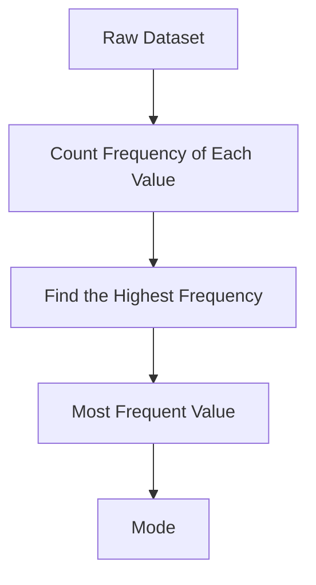

# 004 - Mode

**Course:** 01 - Math, Statistics and Econometrics
**Module:** Module 02 - Statistics
**Content Group:** Descriptive Statistics
**Roadmap Source:** Statistics / Descriptive Statistics
**Lesson Type:** Statistics
**Order in Module:** 004
**Suggested Duration:** 24 minutes

---

## 1. Summary

This lesson explains **Mode** in the context of AI and Data Science.

After this lesson, you should understand how Mode helps answer questions such as:

* What value appears most frequently in a dataset?
* Which category is the most common?
* What user behavior, product choice, label, or class occurs most often?
* How can we summarize categorical or repeated data quickly?

In AI and Data Science, Mode is useful for exploratory data analysis, classification problems, dashboard metrics, customer behavior analysis, feature engineering, and model evaluation.

---

## 2. Learning Objectives

By the end of this lesson, you should be able to:

* Explain **Mode** in your own words.
* Identify where Mode appears in the AI/Data Science workflow.
* Calculate Mode for numerical and categorical data.
* Understand the difference between **Mean**, **Median**, and **Mode**.
* Apply Mode to a small dataset, notebook, dashboard, experiment, or business report.
* Recognize common mistakes when interpreting Mode.

---

## 3. Core Concept

## 3.1 What is Mode?

The **Mode** is the value that appears most frequently in a dataset.

In simple words:

> The Mode answers: **“What is the most common value?”**

Example:

```text
Dataset:  [1, 2, 2, 3, 4, 4, 4, 5]

Mode = 4
```

Because `4` appears more often than any other value.

---

## 3.2 Mathematical Definition

For a dataset:

```text
x1, x2, x3, ..., xn
```

The Mode is the value `x` with the highest frequency.

```text
Mode = value with maximum count
```

Or more formally:

```text
Mode = argmax_x frequency(x)
```

Where:

* `frequency(x)` means how many times value `x` appears.
* `argmax` means the value that gives the maximum result.

---

## 4. Simple Diagram



Example:

```text
Data: A, B, A, C, A, B

Frequency:
A -> 3 times
B -> 2 times
C -> 1 time

Mode = A
```

---

## 5. Types of Mode

## 5.1 Unimodal Dataset

A dataset has one Mode.

```text
Data: [2, 3, 3, 4, 5]

Mode = 3
```

---

## 5.2 Bimodal Dataset

A dataset has two Modes.

```text
Data: [1, 1, 2, 3, 3, 4]

Mode = 1 and 3
```

Both `1` and `3` appear twice.

---

## 5.3 Multimodal Dataset

A dataset has more than two Modes.

```text
Data: [1, 1, 2, 2, 3, 3, 4]

Mode = 1, 2, and 3
```

---

## 5.4 No Mode

If every value appears only once, the dataset may be considered to have no useful Mode.

```text
Data: [1, 2, 3, 4, 5]

No clear Mode
```

---

## 6. Mode in AI and Data Science

Mode is especially useful when working with **categorical data**.

Examples:

| Use Case               | Mode Helps Answer                                     |
| ---------------------- | ----------------------------------------------------- |
| Customer analytics     | Which product category is most purchased?             |
| Classification         | Which class label appears most often?                 |
| Survey analysis        | Which answer is most common?                          |
| Recommendation systems | Which item type is most frequently selected?          |
| Feature engineering    | What value should replace missing categorical values? |
| Dashboard metrics      | What is the most common user action?                  |

---

## 7. Mode vs Mean vs Median

| Metric | Meaning             | Best Used For                       |
| ------ | ------------------- | ----------------------------------- |
| Mean   | Average value       | Balanced numerical data             |
| Median | Middle value        | Skewed numerical data or outliers   |
| Mode   | Most frequent value | Categorical data or repeated values |

Example:

```text
Data: [1, 2, 2, 3, 100]

Mean   = 21.6
Median = 2
Mode   = 2
```

Interpretation:

* The **Mean** is affected by the outlier `100`.
* The **Median** shows the middle value.
* The **Mode** shows the most repeated value.

---

## 8. Example / Demo

Imagine you are analyzing the most common payment method in an e-commerce dataset.

```text
Payment methods:
["Credit Card", "Cash", "Credit Card", "Bank Transfer", "Credit Card", "Cash"]
```

Frequency table:

| Payment Method | Count |
| -------------- | ----: |
| Credit Card    |     3 |
| Cash           |     2 |
| Bank Transfer  |     1 |

Result:

```text
Mode = Credit Card
```

Business conclusion:

> Credit Card is the most common payment method. The business may prioritize improving the credit card checkout experience.

---

## 9. AI/Data Science Workflow

```text
question -> sample -> frequency table -> mode -> insight -> decision
```

Example:

```text
Question:
Which product category is most commonly purchased?

Sample:
Customer transaction data

Metric:
Mode of product_category

Insight:
"Electronics" is the most common category.

Decision:
Promote electronics-related bundles or recommendations.
```

---

## 10. Python Example

```python
import pandas as pd

data = {
    "user_id": [1, 2, 3, 4, 5, 6],
    "payment_method": [
        "Credit Card",
        "Cash",
        "Credit Card",
        "Bank Transfer",
        "Credit Card",
        "Cash"
    ]
}

df = pd.DataFrame(data)

mode_value = df["payment_method"].mode()

print(mode_value)
```

Output:

```text
0    Credit Card
Name: payment_method, dtype: object
```

---

## 11. Practical Exercise

Create a small simulated dataset and calculate the Mode.

Example dataset:

```text
User actions:
["click", "view", "click", "purchase", "view", "click", "view"]
```

Tasks:

1. Count the frequency of each action.
2. Find the Mode.
3. Write a business conclusion.
4. Identify one caveat or assumption.

Expected result:

```text
click -> 3
view -> 3
purchase -> 1

Mode = click and view
```

Business conclusion:

> The most common actions are clicking and viewing. This suggests users are engaging with the interface, but purchases are still relatively rare.

---

## 12. Common Mistakes

## 12.1 Using Mode for Data Without Repetition

If all values appear once, Mode may not give a useful insight.

```text
Data: [10, 20, 30, 40]
```

There is no strong most common value.

---

## 12.2 Ignoring Sample Size

A Mode from a very small sample can be misleading.

```text
Data: ["A", "A", "B"]
Mode = A
```

But the sample size is only 3, so the conclusion may not be reliable.

---

## 12.3 Ignoring Bias

If the data sample is biased, the Mode may reflect the bias instead of the real population.

Example:

```text
Survey only collected from mobile users.
Mode = Mobile App
```

This does not necessarily mean all users prefer the mobile app.

---

## 12.4 Confusing Frequency with Importance

The most frequent value is not always the most valuable value.

Example:

```text
Most common customer segment = Free users
Most profitable customer segment = Premium users
```

Mode tells us what is common, not what is most profitable.

---

## 13. Checklist for Completion

You have completed this lesson if:

* You can explain **Mode** in 1-2 minutes.
* You can calculate Mode manually from a small dataset.
* You can calculate Mode using Python or SQL.
* You understand when Mode is useful.
* You know the difference between Mean, Median, and Mode.
* You can write a business conclusion using Mode.
* You have recorded at least one caveat, assumption, or follow-up question.

---

## 14. Related Outcome

This lesson supports the following roadmap outcome:

> Use probability, sampling, descriptive statistics, hypothesis testing, and A/B testing to make decisions from data.

Mode is part of descriptive statistics because it helps summarize what is most common in a dataset.

---

## 15. Related Project

Mini project:

> **A/B Test Conversion Rate with conversion metric, hypothesis test, and rollout recommendation**

Mode can support this project by answering questions such as:

* What is the most common user action?
* Which variant receives the most repeated behavior?
* Which customer segment appears most often?
* What is the most common reason users do not convert?

Example:

```text
Variant A most common action: view_product
Variant B most common action: add_to_cart
```

This can help explain user behavior beyond only looking at conversion rate.

---

## 16. Final Summary

**Mode** is a basic but important descriptive statistics concept.

It helps identify the most common value in a dataset.

In AI and Data Science, Mode is useful for:

* Categorical data analysis
* Customer behavior analysis
* Classification label analysis
* Feature engineering
* Dashboard reporting
* Business decision-making

However, Mode should always be interpreted carefully with attention to:

* Sample size
* Bias
* Uncertainty
* Business impact
* Whether the most frequent value is actually meaningful

A good Data Scientist does not only calculate the Mode, but also explains what it means, why it matters, and what decision it can support.
