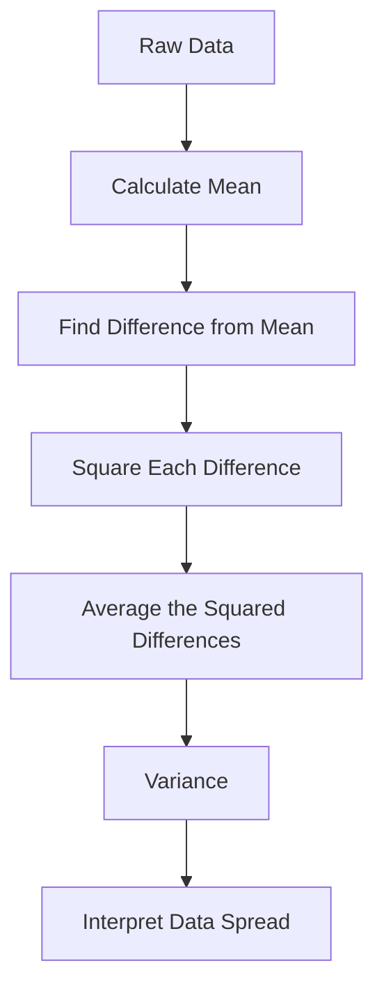

# 005 - Variance

**Course:** 01 - Math, Statistics and Econometrics
**Module:** Module 02 - Statistics
**Content Group:** Descriptive Statistics
**Roadmap Source:** Statistics / Descriptive Statistics
**Lesson Type:** Statistics
**Order in Module:** 005
**Suggested Duration:** 24 minutes

---

## 1. Summary

This lesson explains **Variance** in the context of AI and Data Science.

After this lesson, you should understand how variance helps answer questions about data spread, model stability, experiment uncertainty, and decision risk. You should also be able to turn this concept into a notebook, metric, chart, API, or portfolio artifact.

Variance measures how far data points are spread out from the mean.

A low variance means the values are close to the average.
A high variance means the values are widely spread out.

---

## 2. Learning Objectives

By the end of this lesson, you should be able to:

* Explain **Variance** in your own words.
* Understand where variance appears in the AI/Data Science workflow.
* Calculate variance for a small dataset.
* Interpret variance in a business or modeling context.
* Connect variance to uncertainty, sampling, model performance, and A/B testing.
* Build a small notebook, chart, query, metric, or portfolio note using variance.

---

## 3. Main Concept

Variance is a descriptive statistic that measures the average squared distance between each data point and the mean.

In simple terms:

> **Variance tells us how much the data values differ from the average value.**

---

## 4. Why Variance Matters

Variance is important because the mean alone does not tell the full story.

Two datasets can have the same mean but very different spreads.

Example:

```text
Dataset A: 48, 50, 52
Dataset B: 10, 50, 90
```

Both datasets have the same mean:

```text
Mean = 50
```

However:

* Dataset A has low variance.
* Dataset B has high variance.

This means Dataset B is much more unstable or spread out.

---

## 5. Formula

### Population Variance

Use population variance when you have the entire population.

$$
\sigma^2 = \frac{1}{N}\sum_{i=1}^{N}(x_i - \mu)^2
$$

Where:

* $\sigma^2$ = population variance
* $N$ = number of values in the population
* $x_i$ = each data point
* $\mu$ = population mean

---

### Sample Variance

Use sample variance when you only have a sample from a larger population.

$$
s^2 = \frac{1}{n - 1}\sum_{i=1}^{n}(x_i - \bar{x})^2
$$

Where:

* $s^2$ = sample variance
* $n$ = sample size
* $x_i$ = each data point
* $\bar{x}$ = sample mean
* $n - 1$ = Bessel's correction, used to reduce bias in sample estimation

---

## 6. Intuition

Variance answers this question:

```text
How far are the values from the average?
```

The calculation follows this process:

```text
data values
    ↓
calculate mean
    ↓
measure distance from mean
    ↓
square each distance
    ↓
average the squared distances
    ↓
variance
```

---

## 7. Diagram



---

## 8. Example

Suppose we have the following dataset:

```text
Data = [2, 4, 6]
```

### Step 1: Calculate the mean

$$
\bar{x} = \frac{2 + 4 + 6}{3} = 4
$$

### Step 2: Find the difference from the mean

```text
2 - 4 = -2
4 - 4 = 0
6 - 4 = 2
```

### Step 3: Square each difference

```text
(-2)^2 = 4
0^2 = 0
2^2 = 4
```

### Step 4: Calculate population variance

$$
\sigma^2 = \frac{4 + 0 + 4}{3} = \frac{8}{3} \approx 2.67
$$

So the population variance is:

```text
Variance ≈ 2.67
```

---

## 9. Variance in AI and Data Science

Variance appears in many parts of the AI/Data Science workflow.

### 9.1 Exploratory Data Analysis

Variance helps you understand how spread out a feature is.

Example questions:

* Are customer ages concentrated or widely spread?
* Do product prices vary a lot?
* Is user behavior stable or unpredictable?

---

### 9.2 Feature Engineering

Features with very high variance may dominate some models.

Features with very low variance may carry little useful information.

Example:

```text
Feature A: values change a lot
Feature B: almost always the same value
```

Feature B may not help the model much because it has low variation.

---

### 9.3 Model Evaluation

Variance helps evaluate model stability.

Example:

```text
Fold 1 accuracy: 91%
Fold 2 accuracy: 72%
Fold 3 accuracy: 89%
Fold 4 accuracy: 75%
Fold 5 accuracy: 93%
```

The average accuracy may look acceptable, but the high variance suggests the model is unstable.

---

### 9.4 A/B Testing

Variance helps estimate uncertainty in experiment results.

In A/B testing, you should not only ask:

```text
Which version has a higher conversion rate?
```

You should also ask:

```text
How uncertain is this result?
Is the sample size large enough?
Could the observed difference be random noise?
```

---

## 10. Workflow Context

Variance fits into the data decision workflow like this:

```text
question -> sample -> metric -> variance -> uncertainty -> statistical test -> decision
```

Example:

```text
Business question:
Does the new checkout page improve conversion?

Sample:
Users from A/B test groups

Metric:
Conversion rate

Variance:
How much the conversion outcomes vary

Uncertainty:
Confidence interval or p-value

Decision:
Roll out, reject, or continue testing
```

---

## 11. Practical Demo

### Python Example

```python
import numpy as np

data = [2, 4, 6]

population_variance = np.var(data)
sample_variance = np.var(data, ddof=1)

print("Population variance:", population_variance)
print("Sample variance:", sample_variance)
```

Expected output:

```text
Population variance: 2.6666666666666665
Sample variance: 4.0
```

---

## 12. Business Interpretation Example

Suppose two marketing campaigns have the same average revenue per user.

```text
Campaign A average revenue: $50
Campaign B average revenue: $50
```

But their revenue variance is different:

```text
Campaign A variance: low
Campaign B variance: high
```

Interpretation:

* Campaign A produces more stable revenue.
* Campaign B produces more unpredictable revenue.
* Campaign B may have higher risk even if the average revenue is the same.

Business conclusion:

> Campaign A may be safer for predictable growth, while Campaign B may require deeper analysis to understand risk and customer segments.

---

## 13. Common Mistakes

### Mistake 1: Looking only at the mean

The mean does not show how spread out the data is.

Bad conclusion:

```text
Both groups have the same mean, so they are the same.
```

Better conclusion:

```text
Both groups have the same mean, but their variance is different, so their behavior is not the same.
```

---

### Mistake 2: Ignoring sample size

Variance estimates from very small samples can be unreliable.

Example:

```text
Sample size = 3
```

This may be too small to make a strong conclusion.

---

### Mistake 3: Confusing variance with standard deviation

Variance is measured in squared units.

Standard deviation is the square root of variance.

$$
\text{Standard Deviation} = \sqrt{\text{Variance}}
$$

Standard deviation is often easier to interpret because it uses the same unit as the original data.

---

### Mistake 4: Ignoring business impact

A statistically noticeable difference may not always matter for the business.

Example:

```text
Conversion improves from 10.00% to 10.05%
```

This may be statistically detectable with a large sample, but the business impact may be too small.

---

## 14. Practice Exercise

Create a small simulated dataset and calculate variance.

### Task

Use this dataset:

```text
daily_orders = [20, 22, 19, 21, 80]
```

Answer the following questions:

1. What is the mean?
2. What is the variance?
3. Is there an outlier?
4. How does the outlier affect variance?
5. What business conclusion can you write?

---

## 15. Mini Portfolio Artifact

Create a small notebook titled:

```text
Variance Analysis for Daily Orders
```

The notebook should include:

* A simulated dataset
* Mean calculation
* Variance calculation
* Standard deviation calculation
* A simple chart
* A short business interpretation
* At least one caveat about sample size or outliers

---

## 16. Completion Checklist

You have completed this lesson if:

* [ ] You can explain **Variance** in 1-2 minutes.
* [ ] You can calculate variance manually for a small dataset.
* [ ] You know the difference between population variance and sample variance.
* [ ] You understand why sample size matters.
* [ ] You can explain how variance relates to uncertainty.
* [ ] You can connect variance to datasets, metrics, models, experiments, or deployment.
* [ ] You have created a notebook, query, chart, API, or practice note for this topic.
* [ ] You have written at least one caveat, assumption, or follow-up question.

---

## 17. Related Outcome

Use probability, sampling, descriptive statistics, hypothesis testing, and A/B testing to make decisions from data.

---

## 18. Related Project

### Mini Project: A/B Test Conversion Rate

Build a small A/B testing analysis project with:

* Conversion metric
* Sample size
* Group-level variance
* Hypothesis test
* Confidence interval
* Rollout recommendation

Example final recommendation:

```text
Variant B has a higher conversion rate than Variant A, but the difference is small.
Because uncertainty is still high, we recommend collecting more data before rollout.
```

---

## 19. Final Summary

**Variance** is a key concept in descriptive statistics.

It helps Data Scientists understand how spread out data is, how stable a metric is, and how much uncertainty may exist in a decision.

In AI and Data Science, variance is useful for:

* Exploratory data analysis
* Feature selection
* Model evaluation
* A/B testing
* Risk analysis
* Business decision-making

Do not treat variance as only a formula. Turn it into a practical artifact such as a notebook, chart, experiment report, API metric, or portfolio note.

The main idea:

> **The mean tells you the center. Variance tells you how much the data moves around that center.**
