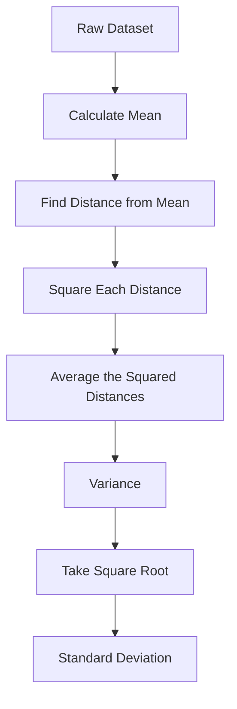
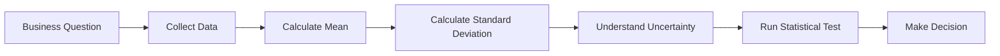

# 006 - Standard Deviation

**Course:** 01 - Math, Statistics and Econometrics
**Module:** Module 02 - Statistics
**Content Group:** Descriptive Statistics
**Roadmap Source:** Statistics / Descriptive Statistics
**Lesson Type:** Statistics
**Order in Module:** 006
**Suggested Duration:** 24 minutes

---

## 1. Summary

This lesson explains **Standard Deviation** in the context of AI and Data Science.

After this lesson, you should understand how standard deviation helps answer questions such as:

* How spread out is the data?
* Are values close to the average or widely scattered?
* Is a dataset stable, noisy, or highly variable?
* How much uncertainty should we consider before making a decision?

Standard deviation is a key descriptive statistic used in data analysis, machine learning, experiment evaluation, dashboard interpretation, and business decision-making.

---

## 2. Learning Objectives

By the end of this lesson, you should be able to:

* Explain **standard deviation** in your own words.
* Understand where standard deviation appears in the AI/Data Science workflow.
* Calculate standard deviation for a small dataset.
* Interpret whether a dataset has low or high variability.
* Use standard deviation in notebooks, charts, metrics, experiments, or portfolio projects.
* Connect standard deviation with variance, uncertainty, model evaluation, and A/B testing.

---

## 3. Core Concept

**Standard deviation** measures how far data points usually are from the mean.

In simple terms:

> Standard deviation tells us how much the data varies around the average.

A small standard deviation means most values are close to the mean.
A large standard deviation means values are spread far away from the mean.

---

## 4. Formula

For a **population**:

$$
\sigma = \sqrt{\frac{\sum_{i=1}^{N}(x_i - \mu)^2}{N}}
$$

Where:

* $\sigma$ = population standard deviation
* $x_i$ = each data point
* $\mu$ = population mean
* $N$ = number of population values

For a **sample**:

$$
s = \sqrt{\frac{\sum_{i=1}^{n}(x_i - \bar{x})^2}{n - 1}}
$$

Where:

* $s$ = sample standard deviation
* $x_i$ = each sample data point
* $\bar{x}$ = sample mean
* $n$ = sample size
* $n - 1$ = degrees of freedom

---

## 5. Intuition

Standard deviation is the square root of variance.

```text
Data points
   ↓
Calculate mean
   ↓
Measure distance from mean
   ↓
Square the distances
   ↓
Average the squared distances
   ↓
Take square root
   ↓
Standard deviation
```

---

## 6. Why Standard Deviation Matters

Standard deviation helps turn raw sample data into more reliable conclusions.

It is useful because it helps us understand:

* Data spread
* Risk
* Noise
* Stability
* Uncertainty
* Outliers
* Model performance consistency
* Experiment reliability

In AI and Data Science, standard deviation is often used to avoid making decisions based only on averages.

For example, two models may have the same average accuracy, but one model may be much more stable than the other.

---

## 7. Simple Example

Suppose we have the daily number of users visiting an app:

```text
[100, 102, 98, 101, 99]
```

The values are close to the mean, so the standard deviation is small.

Now compare it with:

```text
[50, 150, 30, 170, 100]
```

The average may still be around 100, but the values are much more spread out.
This dataset has a larger standard deviation.

---

## 8. Standard Deviation vs Variance

| Concept            | Meaning                                | Unit          |
| ------------------ | -------------------------------------- | ------------- |
| Variance           | Average squared distance from the mean | Squared unit  |
| Standard Deviation | Typical distance from the mean         | Original unit |

Example:

If the dataset is measured in dollars:

* Variance is measured in dollars squared.
* Standard deviation is measured in dollars.

Because standard deviation uses the original unit, it is usually easier to interpret.

---

## 9. Diagram



---

## 10. AI & Data Science Workflow

Standard deviation appears in many parts of the AI/Data Science workflow.

```text
question -> sample -> metric -> uncertainty -> statistical test -> decision
```

More specifically:



---

## 11. Practical Use Cases

### 11.1 Data Analysis

Use standard deviation to understand how variable a feature is.

Example:

```text
Feature: customer spending
Mean: $50
Standard deviation: $5
```

This means most customers spend close to $50.

But if:

```text
Mean: $50
Standard deviation: $40
```

Then customer spending is highly variable.

---

### 11.2 Machine Learning

Standard deviation is useful when comparing model performance across multiple runs.

Example:

| Model   | Mean Accuracy | Standard Deviation |
| ------- | ------------: | -----------------: |
| Model A |           91% |                 1% |
| Model B |           91% |                 8% |

Both models have the same average accuracy, but Model A is more stable.

Model B may be risky because its performance changes a lot between runs.

---

### 11.3 A/B Testing

In A/B testing, standard deviation helps estimate uncertainty.

Example:

```text
Group A conversion rate: 10%
Group B conversion rate: 12%
```

Before choosing Group B, we need to ask:

* Is the difference real?
* Is the sample size large enough?
* Is the result statistically significant?
* Is the business impact meaningful?

Standard deviation helps support this analysis.

---

## 12. Python Demo

```python
import numpy as np

data = [100, 102, 98, 101, 99]

mean_value = np.mean(data)
std_population = np.std(data)
std_sample = np.std(data, ddof=1)

print("Mean:", mean_value)
print("Population Standard Deviation:", std_population)
print("Sample Standard Deviation:", std_sample)
```

Expected interpretation:

```text
The data points are close to the mean.
The standard deviation is small.
This means the dataset is relatively stable.
```

---

## 13. Business Interpretation Example

Suppose an online store has the following daily revenue:

```text
[980, 1020, 1000, 990, 1010]
```

The mean revenue is around $1,000 and the standard deviation is small.

Business conclusion:

> Daily revenue is stable. The business can use the average revenue as a reasonable estimate for short-term planning.

Now suppose the revenue is:

```text
[300, 1800, 500, 2200, 200]
```

The mean may still be close to $1,000, but the standard deviation is large.

Business conclusion:

> Revenue is highly unstable. The average alone is misleading, so we need to investigate traffic sources, campaign effects, seasonality, or outliers.

---

## 14. Common Mistakes

### Mistake 1: Looking only at the mean

Averages can hide important variation.

```text
Same mean does not mean same behavior.
```

---

### Mistake 2: Ignoring sample size

A standard deviation calculated from a very small sample may be unreliable.

Example:

```text
n = 3
```

This is usually too small to make a strong conclusion.

---

### Mistake 3: Confusing statistical significance with business significance

A difference may be statistically significant but too small to matter in business.

Example:

```text
Conversion increases from 10.00% to 10.05%
```

This may not justify a costly rollout.

---

### Mistake 4: Ignoring bias

If the sample is biased, standard deviation does not fix the problem.

Example:

```text
Only surveying loyal customers will not represent all customers.
```

---

### Mistake 5: Ignoring uncertainty

Standard deviation should be interpreted together with:

* Sample size
* Confidence interval
* Sampling method
* Business context
* Experiment design

---

## 15. Practice Exercise

Create a small simulated dataset and calculate the standard deviation.

### Task

```text
Dataset:
[12, 15, 14, 13, 16, 15, 14]
```

Answer the following questions:

1. What is the mean?
2. What is the sample standard deviation?
3. Is the data stable or highly variable?
4. What assumption are you making?
5. What business conclusion can you write?

---

## 16. Mini Project

### Mini Project: A/B Test Conversion Rate

Build a small notebook that compares two landing pages.

### Requirements

* Create simulated data for Group A and Group B.
* Calculate conversion rate for each group.
* Calculate uncertainty.
* Use standard deviation or standard error.
* Run a hypothesis test.
* Write a rollout recommendation.

Example workflow:

```text
simulate data
-> calculate conversion rate
-> measure variation
-> estimate uncertainty
-> run statistical test
-> make rollout decision
```

---

## 17. Portfolio Artifact Ideas

You can turn this lesson into:

* A Jupyter Notebook explaining standard deviation
* A dashboard showing mean and standard deviation
* A Python function for descriptive statistics
* An A/B testing notebook
* A model evaluation report
* A business analysis memo
* A small API that returns summary statistics

Example API output:

```json
{
  "mean": 102.4,
  "standard_deviation": 4.8,
  "sample_size": 100,
  "interpretation": "The metric is relatively stable."
}
```

---

## 18. Completion Checklist

* [ ] I can explain **standard deviation** in 1-2 minutes.
* [ ] I understand the difference between variance and standard deviation.
* [ ] I can calculate standard deviation using Python.
* [ ] I can interpret low vs high standard deviation.
* [ ] I understand why sample size matters.
* [ ] I can connect standard deviation to uncertainty.
* [ ] I can use standard deviation in a notebook, chart, model report, experiment, or dashboard.
* [ ] I have written at least one caveat, assumption, or follow-up question.

---

## 19. Related Outcome

Use probability, sampling, descriptive statistics, hypothesis testing, and A/B testing to make decisions from data.

---

## 20. Related Project

**Mini Project:** A/B Test Conversion Rate

Main components:

* Conversion metric
* Control group and treatment group
* Sample size
* Standard deviation
* Uncertainty
* Hypothesis test
* Rollout recommendation

---

## 21. Final Summary

**Standard Deviation** is one of the most important concepts in descriptive statistics.

It helps AI and Data Scientists understand how spread out the data is, how stable a metric is, and how much uncertainty exists around an average.

A good data scientist does not only ask:

```text
What is the average?
```

They also ask:

```text
How much does the data vary?
How reliable is this conclusion?
What decision should the business make?
```

Standard deviation helps connect raw data with reliable analysis, better experiments, and stronger business decisions.

---

# Bài luyện tập

## Mục tiêu


## Đề bài


## Yêu cầu hoàn thành

- [ ] 
- [ ] 
- [ ] 

## Kết quả / lời giải


## Ghi chú
