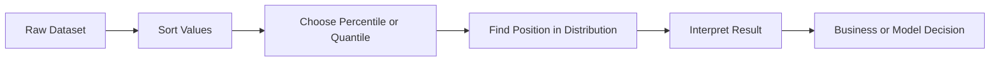

# 007 - Percentile and Quantile

**Course:** 01 - Math, Statistics and Econometrics
**Module:** Module 02 - Statistics
**Content Group:** Descriptive Statistics
**Roadmap Source:** Statistics / Descriptive Statistics
**Lesson Type:** Statistics
**Order in Module:** 007
**Suggested Duration:** 24 minutes

---

## 1. Summary

This lesson explains **Percentile and Quantile** in the context of AI and Data Science.

After this lesson, you should understand how percentiles and quantiles help describe the position of a value inside a dataset. They are especially useful when data is skewed, contains outliers, or when you need to explain distribution-based insights to business stakeholders.

In AI and Data Science, percentiles and quantiles are commonly used for:

* Understanding data distribution
* Detecting outliers
* Creating thresholds
* Comparing user behavior
* Evaluating model prediction errors
* Monitoring production systems
* Supporting A/B testing and business decisions

---

## 2. Learning Objectives

By the end of this lesson, you should be able to:

* Explain **percentile** and **quantile** in your own words.
* Understand where percentiles and quantiles appear in the AI/Data Science workflow.
* Calculate percentiles and quantiles from a dataset.
* Use them to summarize skewed data more effectively than using the mean alone.
* Apply them to a small dataset, notebook, chart, dashboard, API, model, experiment, or portfolio artifact.

---

## 3. Main Idea

Percentiles and quantiles help answer this question:

> Where does a value stand compared with the rest of the data?

For example:

> If a student is in the 90th percentile, they scored higher than about 90% of students.

Percentiles and quantiles are useful because they describe the **relative position** of values, not just the average.

---

## 4. Key Concepts

### 4.1 Percentile

A **percentile** divides data into 100 parts.

The `p-th percentile` is the value below which approximately `p%` of the data falls.

Example:

```text
90th percentile = value below which 90% of observations are located
```

If your website response time is at the 95th percentile:

```text
95% of requests are faster than this value
5% of requests are slower than this value
```

This is often written as:

```text
P95 latency
```

---

### 4.2 Quantile

A **quantile** is a more general concept. It divides data into equal-sized groups.

Common quantiles include:

| Quantile Type | Divides Data Into | Example         |
| ------------- | ----------------: | --------------- |
| Median        |           2 parts | 50th percentile |
| Quartile      |           4 parts | Q1, Q2, Q3      |
| Decile        |          10 parts | D1 to D9        |
| Percentile    |         100 parts | P1 to P99       |

So:

```text
Percentiles are a special type of quantile.
```

---

## 5. Percentile vs Quantile

| Concept    | Meaning                                          | Example                      |
| ---------- | ------------------------------------------------ | ---------------------------- |
| Percentile | Divides data into 100 parts                      | 90th percentile              |
| Quantile   | General term for dividing data into equal groups | Quartile, decile, percentile |
| Median     | 50th percentile                                  | Middle value                 |
| Quartile   | Divides data into 4 parts                        | Q1, Q2, Q3                   |

---

## 6. Simple Example

Suppose we have the following exam scores:

```text
[50, 60, 65, 70, 75, 80, 85, 90, 95, 100]
```

The median is:

```text
50th percentile = 77.5
```

The 90th percentile is close to:

```text
90th percentile = 95.5
```

Interpretation:

```text
About 90% of students scored below 95.5.
```

---

## 7. Visual Explanation

```text
Sorted Data
↓
[10, 20, 30, 40, 50, 60, 70, 80, 90, 100]

       Q1          Q2 / Median          Q3
       ↓               ↓                ↓
      25%             50%              75%

P90 is near the high end of the distribution.
```

---

## 8. Diagram



---

## 9. Formula

A common approximate position formula for the `p-th percentile` is:

```text
Position = (p / 100) × (n + 1)
```

Where:

| Symbol | Meaning                |
| ------ | ---------------------- |
| `p`    | Percentile value       |
| `n`    | Number of observations |

Example:

```text
Dataset size: n = 20
Percentile: p = 75

Position = (75 / 100) × (20 + 1)
Position = 0.75 × 21
Position = 15.75
```

So the 75th percentile lies between the 15th and 16th values in the sorted dataset.

Different tools may use slightly different interpolation methods, so results can vary a little across Excel, NumPy, Pandas, SQL, and statistical software.

---

## 10. Why Percentiles Matter in AI and Data Science

Percentiles and quantiles are important because real-world data is often not normally distributed.

For example, income, website traffic, transaction value, and API latency are usually skewed.

In these cases, the mean can be misleading.

Example:

```text
Response times in milliseconds:

[100, 110, 120, 130, 140, 10000]
```

The mean is very high because of one extreme value.

But percentiles give a better picture:

```text
Median: typical user experience
P90: slow experience
P99: worst-case experience
```

---

## 11. AI/Data Science Workflow

Percentiles and quantiles can appear in many parts of the workflow:

```text
question -> sample -> distribution -> percentile/quantile -> insight -> decision
```

Example workflow:

```text
Business Question
↓
Collect Sample Data
↓
Sort and Explore Distribution
↓
Calculate Median, Q1, Q3, P90, P95, P99
↓
Check Outliers and Uncertainty
↓
Make Data-Driven Decision
```

---

## 12. Common Use Cases

### 12.1 Outlier Detection

The interquartile range, or IQR, is commonly used to detect outliers.

```text
IQR = Q3 - Q1
```

Common rule:

```text
Lower Bound = Q1 - 1.5 × IQR
Upper Bound = Q3 + 1.5 × IQR
```

Values outside this range may be considered potential outliers.

---

### 12.2 Model Error Analysis

In machine learning, percentiles can describe prediction error distribution.

Example:

```text
Median absolute error = typical model error
P90 absolute error = error for difficult cases
P99 absolute error = extreme failure cases
```

This is more informative than only reporting average error.

---

### 12.3 Product Analytics

Percentiles help answer questions like:

```text
What is the 90th percentile session duration?
What is the median purchase value?
What is the P95 page load time?
What percentage of users spend more than the 75th percentile?
```

---

### 12.4 A/B Testing

In an A/B test, percentiles can help compare distributions, not just averages.

Example:

```text
Group A median order value = $20
Group B median order value = $22

Group A P90 order value = $100
Group B P90 order value = $150
```

This suggests Group B may perform better among high-value users.

---

## 13. Example in Python

```python
import numpy as np

data = [50, 60, 65, 70, 75, 80, 85, 90, 95, 100]

p25 = np.percentile(data, 25)
p50 = np.percentile(data, 50)
p75 = np.percentile(data, 75)
p90 = np.percentile(data, 90)

print("25th percentile:", p25)
print("50th percentile / Median:", p50)
print("75th percentile:", p75)
print("90th percentile:", p90)
```

Possible output:

```text
25th percentile: 66.25
50th percentile / Median: 77.5
75th percentile: 88.75
90th percentile: 95.5
```

---

## 14. Example Business Interpretation

Suppose we analyze delivery time in minutes:

```text
Median delivery time: 25 minutes
P75 delivery time: 35 minutes
P90 delivery time: 50 minutes
P99 delivery time: 90 minutes
```

Business interpretation:

```text
Most deliveries are completed in a reasonable time, but the slowest 10% of deliveries are much worse.
The company should investigate regions, drivers, restaurants, or time periods causing high P90 and P99 delivery times.
```

A better business conclusion:

```text
The typical delivery experience is acceptable, but tail performance is poor. We should focus on reducing P90 and P99 delivery times before scaling the service.
```

---

## 15. Practical Demo

```text
question -> sample -> metric -> uncertainty -> statistical test -> decision
```

Example:

```text
Question:
Do premium users spend more time in the app?

Sample:
Free users and premium users

Metric:
Median session duration
P75 session duration
P90 session duration

Uncertainty:
Check sample size and confidence intervals

Statistical Test:
Use a suitable test depending on assumptions

Decision:
Decide whether the premium experience is meaningfully better
```

---

## 16. Common Mistakes

### Mistake 1: Using the Mean for Skewed Data

Bad:

```text
Average income is $80,000, so most people earn around $80,000.
```

Better:

```text
Median income is $45,000, while P90 income is $120,000.
The income distribution is skewed.
```

---

### Mistake 2: Ignoring Sample Size

Bad:

```text
The P95 latency improved based on 20 requests.
```

Better:

```text
The sample size is too small to trust the P95 estimate. We need more observations.
```

---

### Mistake 3: Confusing Statistical Significance and Business Significance

A percentile difference may be statistically significant but too small to matter for business.

Example:

```text
P90 latency improved from 802 ms to 798 ms.
```

This may not justify a major engineering effort.

---

### Mistake 4: Ignoring Bias

If the sample is biased, the percentile result may be misleading.

Example:

```text
Only measuring active users may overestimate product engagement.
```

---

### Mistake 5: Ignoring Multiple Comparisons

If many percentiles, segments, or experiments are tested, some findings may appear significant by chance.

---

## 17. Practice Exercises

### Exercise 1: Calculate Percentiles

Create a small dataset:

```text
[12, 15, 18, 20, 25, 30, 35, 40, 100]
```

Calculate:

```text
P25
P50
P75
P90
```

Then answer:

```text
Is this dataset skewed?
Is the mean or median more representative?
Is 100 an outlier?
```

---

### Exercise 2: Business Conclusion

Given this website latency data:

```text
Median latency: 300 ms
P90 latency: 900 ms
P99 latency: 3000 ms
```

Write a business conclusion in plain English.

Example answer:

```text
Most users experience acceptable latency, but the slowest users experience very poor performance. The team should investigate tail latency, especially P99, because it may hurt user experience and retention.
```

---

### Exercise 3: Mini Notebook

Build a small notebook that includes:

```text
1. Simulated dataset
2. Mean and median
3. Q1, Q3, IQR
4. P90 and P95
5. Boxplot or histogram
6. Business interpretation
```

---

## 18. Portfolio Artifact Idea

Create a small project:

```text
API Latency Percentile Dashboard
```

Include:

* Simulated API latency dataset
* Median latency
* P90 latency
* P95 latency
* P99 latency
* Outlier detection using IQR
* Business recommendation

Example portfolio conclusion:

```text
The average latency hides serious tail-latency problems. Although the median request is fast, the P99 latency is too high and may affect user experience. Optimization should focus on slow endpoints and peak traffic periods.
```

---

## 19. Connection to A/B Testing Project

Related mini project:

```text
A/B Test Conversion Rate with conversion metric, hypothesis test, and rollout recommendation
```

Percentiles and quantiles can support this project by helping analyze:

* Revenue per user
* Session duration
* Purchase amount
* Time to conversion
* Model prediction error
* Tail behavior of user segments

Instead of only asking:

```text
Which group has a higher average?
```

You can also ask:

```text
Which group performs better for the median user?
Which group performs better for high-value users?
Which group has worse tail behavior?
```

---

## 20. Checklist

You have completed this lesson if:

* [ ] You can explain **Percentile and Quantile** in 1-2 minutes.
* [ ] You understand the difference between percentile, quantile, quartile, and median.
* [ ] You can calculate basic percentiles from a dataset.
* [ ] You know why percentiles are useful for skewed data.
* [ ] You can use P90, P95, or P99 to describe tail behavior.
* [ ] You have created a notebook, query, chart, model, API, or practical note for this topic.
* [ ] You have written at least one caveat, assumption, or follow-up analysis question.

---

## 21. Key Takeaways

* **Percentiles** divide data into 100 parts.
* **Quantiles** are a general way to divide data into equal groups.
* The **median** is the 50th percentile.
* **Quartiles** divide data into 4 parts.
* Percentiles are very useful when data is skewed or contains outliers.
* P90, P95, and P99 are commonly used in product analytics, system monitoring, and model evaluation.
* Good statistical analysis should consider sample size, bias, uncertainty, and business impact.

---

## 22. Final Summary

**Percentile and Quantile** are important tools in the AI and Data Scientist roadmap.

They help transform raw sample data into reliable distribution-based insights. Instead of relying only on averages, percentiles and quantiles allow you to understand typical behavior, extreme behavior, and the shape of the data.

To make this knowledge practical, turn it into a:

```text
notebook
query
chart
experiment
model evaluation report
API monitoring dashboard
portfolio note
```

The goal is not only to calculate a number, but to make a better data-driven decision.

---

# Bài luyện tập

## Mục tiêu


## Đề bài


## Yêu cầu hoàn thành

- [ ] 
- [ ] 
- [ ] 

## Kết quả / lời giải


## Ghi chú
