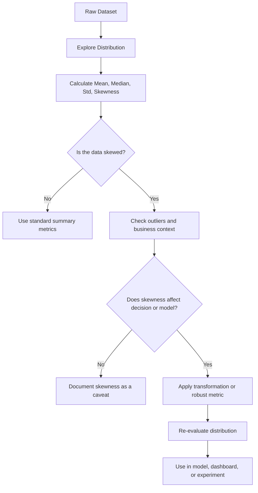

# 008 - Skewness

**Course:** 01 - Math, Statistics and Econometrics
**Module:** Module 02 - Statistics
**Content Group:** Descriptive Statistics
**Roadmap Source:** Statistics / Descriptive Statistics
**Lesson Type:** Statistics
**Order in Module:** 008
**Suggested Duration:** 24 minutes

---

## 1. Summary

This lesson explains **Skewness** in the context of **AI & Data Science**.

Skewness measures whether a dataset is **symmetric** or **tilted to one side**. It helps data scientists understand the **shape of a distribution**, detect **outliers**, choose suitable **metrics**, and decide whether data transformation is needed before modeling.

After this lesson, you should understand:

* What skewness means.
* How skewness affects mean, median, and model behavior.
* How to interpret positive, negative, and near-zero skewness.
* How skewness appears in real datasets such as income, purchase amount, response time, and conversion behavior.

---

## 2. Learning Objectives

By the end of this lesson, you should be able to:

* Explain **Skewness** in your own words.
* Identify whether a distribution is symmetric, right-skewed, or left-skewed.
* Understand how skewness affects descriptive statistics.
* Apply skewness analysis to a small dataset or business problem.
* Recognize when skewness may require data transformation before machine learning.

---

## 3. Key Concept

### 3.1 What Is Skewness?

**Skewness** describes the **asymmetry** of a data distribution.

A distribution is symmetric when the left side and right side have similar shapes.
A distribution is skewed when one side has a longer tail than the other.

```text
Skewness = measure of distribution asymmetry
```

In simple terms:

```text
Skewness answers:
"Is the data balanced, or is it pulled toward one side?"
```

---

## 4. Types of Skewness

### 4.1 Zero or Near-Zero Skewness

A distribution has **zero skewness** when it is approximately symmetric.

```text
Mean ≈ Median ≈ Mode
```

Example:

```text
Test scores: 60, 65, 70, 75, 80
```

The data is balanced around the center.

```text
Symmetric distribution:

        *
      *   *
    *       *
  *           *
*               *
```

---

### 4.2 Positive Skewness

A distribution has **positive skewness** when the right tail is longer.

This is also called **right-skewed distribution**.

```text
Mean > Median > Mode
```

Example:

```text
Monthly income:
500, 600, 700, 800, 10000
```

Most people earn between 500 and 800, but one very high value pulls the mean upward.

```text
Positive skew / right-skewed:

*
* *
*   *
*     *
*        *
*              *
-------------------->
             long right tail
```

Common examples:

* Income
* House prices
* Customer spending
* Website response time
* Number of followers
* Insurance claims

---

### 4.3 Negative Skewness

A distribution has **negative skewness** when the left tail is longer.

This is also called **left-skewed distribution**.

```text
Mean < Median < Mode
```

Example:

```text
Exam scores:
10, 85, 88, 90, 95
```

Most students scored high, but one very low value pulls the mean downward.

```text
Negative skew / left-skewed:

             *
           * *
        *    *
     *       *
  *          *
*            *
<--------------------
long left tail
```

Common examples:

* Easy exam scores
* Customer satisfaction ratings when most users are happy
* Product ratings with many 5-star reviews
* Age at retirement in some datasets

---

## 5. Mathematical Formula

A common formula for sample skewness is:

$$
\text{Skewness} =
\frac{
\frac{1}{n}\sum_{i=1}^{n}(x_i - \bar{x})^3
}{
s^3
}
$$

Where:

| Symbol    | Meaning                |
| --------- | ---------------------- |
| $x_i$     | Each data value        |
| $\bar{x}$ | Mean of the dataset    |
| $s$       | Standard deviation     |
| $n$       | Number of observations |

### Intuition

The term:

$$
(x_i - \bar{x})^3
$$

keeps the direction of deviation:

* Large positive deviations increase skewness.
* Large negative deviations decrease skewness.
* Symmetric deviations cancel each other out.

---

## 6. Skewness Interpretation Guide

|            Skewness Value | Interpretation                             |
| ------------------------: | ------------------------------------------ |
|                  Around 0 | Approximately symmetric                    |
|            Greater than 0 | Positively skewed / right-skewed           |
|               Less than 0 | Negatively skewed / left-skewed            |
| Very large positive value | Strong right tail or extreme high outliers |
| Very large negative value | Strong left tail or extreme low outliers   |

A rough practical guide:

|                          Range | Meaning           |
| -----------------------------: | ----------------- |
|                    -0.5 to 0.5 | Low skewness      |
|         -1 to -0.5 or 0.5 to 1 | Moderate skewness |
| Less than -1 or greater than 1 | High skewness     |

---

## 7. Why Skewness Matters in AI & Data Science

Skewness is important because many models, metrics, and statistical methods are affected by distribution shape.

### 7.1 Impact on Mean and Median

In skewed data, the mean may be misleading.

Example:

```text
Customer spending:
10, 12, 15, 18, 500
```

Mean:

$$
\frac{10 + 12 + 15 + 18 + 500}{5} = 111
$$

Median:

$$
15
$$

The mean says the average customer spends 111, but most customers spend around 10 to 18.

In this case, the **median** gives a better picture of a typical customer.

---

### 7.2 Impact on Machine Learning Models

Skewed features may affect model training.

Examples:

* Linear regression may be influenced by extreme values.
* Distance-based models like KNN may be distorted.
* Neural networks may learn unstable patterns if input scales are highly skewed.
* Tree-based models are usually more robust but can still be affected by extreme outliers.

Common solutions:

* Log transformation
* Square root transformation
* Box-Cox transformation
* Winsorization
* Using robust metrics such as median or percentile

---

## 8. Workflow Diagram



---

## 9. Practical Example

Suppose you are analyzing customer purchase amounts.

```text
Purchase amount:
20, 25, 30, 35, 40, 45, 1000
```

The value 1000 is much larger than the rest.

### Business Question

```text
What is the typical customer purchase amount?
```

### Analysis

The distribution is likely **positively skewed** because there is one very large value.

The mean will be pulled upward.

The median may better represent a typical customer.

### Business Conclusion

```text
The purchase amount distribution is right-skewed.
Most customers spend between 20 and 45, but a small number of high-value customers increase the average.
For typical customer behavior, the median is more reliable than the mean.
For revenue strategy, the high-value customer segment should be analyzed separately.
```

---

## 10. Python Demo

```python
import numpy as np
import pandas as pd
from scipy.stats import skew

data = [20, 25, 30, 35, 40, 45, 1000]

df = pd.DataFrame({"purchase_amount": data})

mean_value = df["purchase_amount"].mean()
median_value = df["purchase_amount"].median()
skewness_value = skew(df["purchase_amount"])

print("Mean:", mean_value)
print("Median:", median_value)
print("Skewness:", skewness_value)
```

Expected interpretation:

```text
Mean is much higher than median.
Skewness is positive.
The dataset is right-skewed.
```

---

## 11. Skewness vs Variance vs Standard Deviation

| Concept            | Main Question                     | What It Measures                    |
| ------------------ | --------------------------------- | ----------------------------------- |
| Variance           | How spread out is the data?       | Average squared deviation           |
| Standard Deviation | How far are values from the mean? | Typical distance from the mean      |
| Skewness           | Is the data symmetric or tilted?  | Direction and strength of asymmetry |

Simple comparison:

```text
Variance / Standard Deviation -> How wide is the distribution?
Skewness -> Which side has the longer tail?
```

---

## 12. Common Use Cases

### 12.1 Product Analytics

Skewness helps analyze:

* Revenue per user
* Session duration
* Purchase amount
* Number of actions per user

Example:

```text
Most users buy little, but a few users buy a lot.
This creates positive skewness.
```

---

### 12.2 A/B Testing

In A/B testing, skewness can affect metric interpretation.

Example:

```text
Metric: revenue per user
```

If a few users spend extremely high amounts, the mean revenue may look better even if most users do not improve.

Better approach:

* Compare mean and median.
* Check percentiles.
* Use confidence intervals.
* Segment high-value users.
* Consider robust statistical tests.

---

### 12.3 Machine Learning

Skewness is useful during feature engineering.

Example skewed features:

* Income
* Transaction amount
* Number of clicks
* Number of purchases
* Time spent on page

Possible transformation:

$$
x' = \log(1 + x)
$$

This reduces the effect of extreme large values.

---

## 13. Mini Project Connection

### Project: A/B Test Conversion Rate

Although conversion rate is often binary, related business metrics may be skewed.

Example metrics:

| Metric           | Possible Skewness               |
| ---------------- | ------------------------------- |
| Conversion rate  | Usually binary/proportion-based |
| Revenue per user | Often right-skewed              |
| Purchase amount  | Often right-skewed              |
| Session duration | Often right-skewed              |
| Number of visits | Often right-skewed              |

A good experiment analysis should not only ask:

```text
Did conversion improve?
```

It should also ask:

```text
Did the improvement come from many users or only a few extreme users?
```

---

## 14. Practice Exercise

Create a small simulated dataset and calculate skewness.

### Dataset A

```text
10, 12, 13, 15, 16, 18, 20
```

Questions:

1. Is the data symmetric?
2. Is the mean close to the median?
3. Is skewness near zero?

---

### Dataset B

```text
10, 12, 13, 15, 16, 18, 200
```

Questions:

1. Is the data right-skewed?
2. How does the outlier affect the mean?
3. Would median be more reliable?

---

### Dataset C

```text
1, 80, 82, 85, 87, 90, 92
```

Questions:

1. Is the data left-skewed?
2. What value creates the long left tail?
3. Would the mean be lower than the median?

---

## 15. Common Mistakes

### Mistake 1: Using Mean Without Checking Skewness

In skewed data, the mean may not represent the typical case.

Better:

```text
Always compare mean and median.
```

---

### Mistake 2: Ignoring Outliers

Skewness may be caused by extreme values.

Better:

```text
Check whether extreme values are data errors or meaningful business cases.
```

---

### Mistake 3: Removing Outliers Too Quickly

Sometimes outliers are important.

Example:

```text
High-spending customers may be rare but valuable.
```

Do not remove them automatically.

---

### Mistake 4: Confusing Statistical Significance with Business Significance

A skewed metric may show statistical improvement, but the business impact may only come from a small group.

Better:

```text
Analyze both statistical evidence and business impact.
```

---

## 16. Checklist

Before finishing this lesson, make sure you can:

* [ ] Explain skewness in 1-2 minutes.
* [ ] Identify positive, negative, and near-zero skewness.
* [ ] Explain how skewness affects mean and median.
* [ ] Calculate skewness using Python.
* [ ] Interpret skewness in a business context.
* [ ] Decide whether a skewed feature needs transformation.
* [ ] Write down at least one caveat, assumption, or follow-up question.

---

## 17. Business Conclusion Template

Use this template when writing analysis conclusions:

```text
The distribution of [metric] is [right-skewed / left-skewed / approximately symmetric].
This means [interpretation].
Because of this skewness, [mean / median / percentile] is more appropriate for decision-making.
The business implication is [decision or recommendation].
However, we should also consider [sample size / outliers / bias / uncertainty].
```

Example:

```text
The distribution of purchase amount is right-skewed.
This means most customers spend a small amount, while a few customers spend much more.
Because of this skewness, the median is more appropriate for describing typical customer behavior.
The business implication is that we should separately analyze normal customers and high-value customers.
However, we should also check sample size, outliers, and whether extreme values are valid.
```

---

## 18. Final Takeaway

**Skewness** is a key concept in descriptive statistics. It helps data scientists understand whether a dataset is balanced or pulled toward one side.

In AI and Data Science, skewness is useful for:

* Exploratory data analysis
* Outlier detection
* Feature engineering
* Model preparation
* A/B testing
* Business decision-making

A good data scientist does not only ask:

```text
What is the average?
```

A good data scientist also asks:

```text
Is the distribution skewed?
Is the average still meaningful?
What decision could be wrong if I ignore the skewness?
```

Skewness turns raw numbers into more reliable insight.
