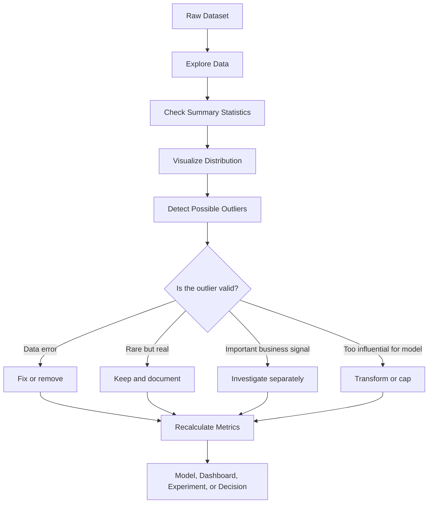
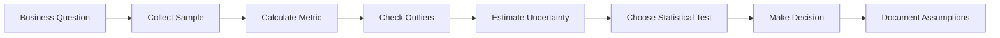

# 009 - Outlier

**Course:** 01 - Math, Statistics and Econometrics
**Module:** Module 02 - Statistics
**Content Group:** Descriptive Statistics
**Roadmap Source:** Statistics / Descriptive Statistics
**Lesson Type:** Statistics
**Order in Module:** 009
**Suggested Duration:** 24 minutes

---

## 1. Summary

This lesson explains **Outliers** in the context of **AI & Data Science**.

An **outlier** is a data point that is very different from most other values in a dataset. Outliers can be caused by data errors, rare events, unusual user behavior, fraud, system failures, or genuinely important business cases.

After this lesson, you should understand:

* What an outlier is.
* Why outliers matter in statistics, dashboards, experiments, and machine learning.
* How to detect outliers using simple rules.
* How to decide whether to keep, remove, transform, or investigate an outlier.

---

## 2. Learning Objectives

By the end of this lesson, you should be able to:

* Explain **Outlier** in your own words.
* Identify suspicious extreme values in a dataset.
* Understand how outliers affect mean, variance, standard deviation, skewness, and models.
* Use basic outlier detection methods such as IQR and Z-score.
* Write a business conclusion that includes assumptions, sample size, uncertainty, and impact.

---

## 3. Key Concept

### 3.1 What Is an Outlier?

An **outlier** is a value that is far away from the majority of data points.

```text
Outlier = a data point that is unusually high, unusually low, or abnormal compared to the rest of the dataset
```

Example:

```text
Normal values:
10, 12, 13, 15, 16, 18

Outlier:
200
```

Full dataset:

```text
10, 12, 13, 15, 16, 18, 200
```

The value `200` is much larger than the other values, so it may be an outlier.

---

## 4. Simple Visual Intuition

```text
Most data points:
10  12  13  15  16  18

Outlier:
200
```

```text
Number line:

10  12  13  15  16  18                                      200
|---|---|---|---|---|------------------------------------------|
normal cluster                                           outlier
```

Outliers are not always wrong. Sometimes they are the most important part of the dataset.

---

## 5. Why Outliers Matter

Outliers can strongly affect statistical conclusions.

### 5.1 Impact on Mean

Example:

```text
Dataset A:
10, 12, 13, 15, 16, 18

Mean = 14
```

Now add one outlier:

```text
Dataset B:
10, 12, 13, 15, 16, 18, 200

Mean = 40.57
```

The typical values are still around `10-18`, but the mean becomes much larger because of the outlier.

### 5.2 Impact on Median

For the same dataset:

```text
10, 12, 13, 15, 16, 18, 200
```

Median:

```text
15
```

The median is more stable than the mean when outliers exist.

---

## 6. Outlier in AI & Data Science Workflow

Outlier detection usually appears during **Exploratory Data Analysis**, **Data Cleaning**, **Feature Engineering**, and **Model Evaluation**.



---

## 7. Common Causes of Outliers

| Cause                | Example                                        |
| -------------------- | ---------------------------------------------- |
| Data entry error     | Age = 300                                      |
| Measurement error    | Sensor records temperature = 999°C             |
| System bug           | Revenue duplicated 100 times                   |
| Rare but valid event | One customer spends $50,000                    |
| Fraud or abuse       | Extremely high number of transactions          |
| Different population | Enterprise customer mixed with normal users    |
| Natural extreme case | Very high income or very long session duration |

---

## 8. Types of Outliers

### 8.1 Univariate Outlier

An outlier in one variable.

Example:

```text
User age:
18, 21, 25, 30, 33, 120
```

The value `120` may be an outlier.

---

### 8.2 Multivariate Outlier

A data point may look normal in each individual variable but strange when variables are combined.

Example:

| User | Age | Monthly Income |
| ---- | --: | -------------: |
| A    |  25 |            800 |
| B    |  30 |           1200 |
| C    |  35 |           1500 |
| D    |  18 |         100000 |

Age `18` is not impossible. Income `100000` is not impossible.
But the combination may be unusual and should be investigated.

---

## 9. Outlier Detection Methods

## 9.1 Method 1: Visual Detection

Common charts:

* Histogram
* Boxplot
* Scatter plot
* Time series plot

Example boxplot logic:

```text
        normal range
|-------------------------|
     [ Q1 ---- Q2 ---- Q3 ]                         *
                                                     outlier
```

---

## 9.2 Method 2: IQR Rule

The **IQR** method is one of the most common outlier detection methods.

### Step 1: Calculate Quartiles

```text
Q1 = 25th percentile
Q3 = 75th percentile
IQR = Q3 - Q1
```

### Step 2: Define Bounds

```text
Lower Bound = Q1 - 1.5 × IQR
Upper Bound = Q3 + 1.5 × IQR
```

### Step 3: Detect Outliers

```text
If x < Lower Bound or x > Upper Bound, then x is a possible outlier.
```

---

## 9.3 Method 3: Z-Score

The **Z-score** measures how many standard deviations a value is from the mean.

Formula:

$$
z = \frac{x - \mu}{\sigma}
$$

Where:

| Symbol   | Meaning            |
| -------- | ------------------ |
| $x$      | Data value         |
| $\mu$    | Mean               |
| $\sigma$ | Standard deviation |

Common rule:

```text
If |z| > 3, the value may be an outlier.
```

However, Z-score works better when the data is approximately normally distributed.

---

## 10. IQR Example

Dataset:

```text
10, 12, 13, 15, 16, 18, 200
```

Suppose:

```text
Q1 = 12
Q3 = 18
IQR = 18 - 12 = 6
```

Calculate bounds:

```text
Lower Bound = 12 - 1.5 × 6 = 3
Upper Bound = 18 + 1.5 × 6 = 27
```

Any value greater than `27` is a possible outlier.

```text
200 > 27
```

Therefore:

```text
200 is a possible outlier.
```

---

## 11. Python Demo

```python
import pandas as pd

data = [10, 12, 13, 15, 16, 18, 200]

df = pd.DataFrame({"value": data})

Q1 = df["value"].quantile(0.25)
Q3 = df["value"].quantile(0.75)
IQR = Q3 - Q1

lower_bound = Q1 - 1.5 * IQR
upper_bound = Q3 + 1.5 * IQR

outliers = df[(df["value"] < lower_bound) | (df["value"] > upper_bound)]

print("Q1:", Q1)
print("Q3:", Q3)
print("IQR:", IQR)
print("Lower Bound:", lower_bound)
print("Upper Bound:", upper_bound)
print("Outliers:")
print(outliers)
```

Expected interpretation:

```text
The value 200 is detected as a possible outlier.
```

---

## 12. Outliers and Business Decisions

Outliers should not be removed automatically. The correct action depends on the business context.

### Example: Customer Spending

Dataset:

```text
20, 25, 30, 35, 40, 45, 1000
```

The value `1000` is an outlier.

Possible interpretations:

| Interpretation            | Action                 |
| ------------------------- | ---------------------- |
| Data entry error          | Fix or remove          |
| Real VIP customer         | Keep and segment       |
| Fraudulent transaction    | Flag for investigation |
| One-time promotion effect | Analyze separately     |
| System duplication bug    | Deduplicate            |

Business conclusion:

```text
The purchase amount distribution contains one extreme high value.
This value strongly increases the mean, so the median is more reliable for describing typical customer behavior.
However, the outlier may represent a high-value customer, so it should be investigated before removal.
```

---

## 13. Outliers in Machine Learning

Outliers can affect models in different ways.

| Model Type          | Outlier Sensitivity                  |
| ------------------- | ------------------------------------ |
| Linear Regression   | High                                 |
| Logistic Regression | Medium to high                       |
| KNN                 | High                                 |
| K-Means             | High                                 |
| Decision Tree       | Lower                                |
| Random Forest       | Lower                                |
| Gradient Boosting   | Medium                               |
| Neural Network      | Depends on scaling and loss function |

---

## 14. Common Ways to Handle Outliers

### 14.1 Remove

Use when the outlier is clearly wrong.

Example:

```text
Age = 999
```

---

### 14.2 Cap or Winsorize

Limit extreme values to a maximum or minimum threshold.

Example:

```text
If purchase_amount > 99th percentile, replace it with the 99th percentile value.
```

---

### 14.3 Transform

Use transformations to reduce the influence of large values.

Common transformation:

$$
x' = \log(1 + x)
$$

Useful for:

* Income
* Revenue
* Transaction amount
* Session duration
* Number of clicks

---

### 14.4 Segment

Analyze outliers as a separate group.

Example:

```text
Normal customers vs VIP customers
```

---

### 14.5 Keep and Document

Sometimes the outlier is valid and important.

Example:

```text
A rare but real high-value customer purchase should not be removed without business review.
```

---

## 15. Outlier vs Noise vs Anomaly

| Concept | Meaning                                                        |
| ------- | -------------------------------------------------------------- |
| Outlier | A value far from most data points                              |
| Noise   | Random variation that does not carry useful signal             |
| Anomaly | An unusual pattern that may require investigation              |
| Error   | Incorrect data caused by collection, entry, or system problems |

Simple comparison:

```text
Outlier = statistically unusual
Anomaly = unusual and potentially meaningful
Error = wrong data
Noise = random disturbance
```

---

## 16. Connection to A/B Testing

Outliers are important in A/B testing because they may distort experiment metrics.

Example:

```text
Metric: Revenue per user
```

Group A:

```text
10, 12, 15, 18, 20
```

Group B:

```text
10, 12, 15, 18, 1000
```

Group B may have a much higher average revenue because of one extreme user.

Important questions:

```text
Did the treatment improve revenue for many users?
Or did one extreme user create the difference?
```

Better analysis:

* Compare mean and median.
* Check percentiles.
* Use confidence intervals.
* Inspect extreme users.
* Segment normal users and high-value users.
* Report both statistical and business significance.

---

## 17. Practical Workflow

```text
question -> sample -> metric -> outlier check -> uncertainty -> decision
```

Expanded workflow:



---

## 18. Practice Exercise

### Dataset A

```text
12, 13, 14, 15, 16, 17, 18
```

Questions:

1. Are there any obvious outliers?
2. Are the mean and median close?
3. Is this dataset approximately balanced?

---

### Dataset B

```text
12, 13, 14, 15, 16, 17, 100
```

Questions:

1. Which value is a possible outlier?
2. How does it affect the mean?
3. Should you remove it immediately? Why or why not?

---

### Dataset C

```text
1, 80, 82, 85, 87, 90, 92
```

Questions:

1. Which value is a possible outlier?
2. Is the outlier on the low side or high side?
3. What business explanation could make this value valid?

---

## 19. Mini Project Connection

### Mini Project: A/B Test Conversion Rate

Outlier analysis can support the A/B testing project.

Although conversion rate is usually binary, related metrics often contain outliers.

Example metrics:

| Metric           | Outlier Risk   |
| ---------------- | -------------- |
| Conversion rate  | Lower          |
| Revenue per user | High           |
| Purchase amount  | High           |
| Session duration | High           |
| Number of visits | Medium to high |
| Number of clicks | Medium to high |

A strong experiment report should include:

```text
We checked whether the result was driven by a few extreme users.
```

---

## 20. Common Mistakes

### Mistake 1: Removing Outliers Automatically

Not all outliers are errors.

Better:

```text
Investigate before removing.
```

---

### Mistake 2: Ignoring Outliers

Outliers can completely change conclusions.

Better:

```text
Compare metrics with and without extreme values.
```

---

### Mistake 3: Using Only the Mean

The mean is sensitive to outliers.

Better:

```text
Report mean, median, percentiles, and sample size.
```

---

### Mistake 4: Forgetting Business Context

A statistically unusual value may be a valuable business signal.

Example:

```text
A high-spending customer may be an outlier, but also very important.
```

---

### Mistake 5: Confusing Statistical Significance with Business Significance

An outlier can create a statistically significant result that does not represent normal users.

Better:

```text
Check whether the result affects many users or only a few extreme cases.
```

---

## 21. Checklist

Before finishing this lesson, make sure you can:

* [ ] Explain **Outlier** in 1-2 minutes.
* [ ] Identify possible outliers in a small dataset.
* [ ] Explain how outliers affect mean, variance, standard deviation, and skewness.
* [ ] Use the IQR method to detect outliers.
* [ ] Use Z-score carefully and understand its limitation.
* [ ] Decide whether to remove, keep, transform, cap, or investigate an outlier.
* [ ] Write a business conclusion with caveats and assumptions.

---

## 22. Business Conclusion Template

```text
The dataset contains a possible outlier in [variable/metric].
This value is unusual because [reason].
It affects [mean / variance / model / dashboard / experiment result] by [impact].
Before removing it, we should check whether it is a data error, a rare valid case, or an important business signal.
For decision-making, we should also report [median / percentile / metric without outlier] and document the assumption.
```

Example:

```text
The dataset contains a possible outlier in purchase amount.
The value 1000 is unusual because most purchases are between 20 and 45.
It increases the mean and may make typical customer spending look higher than it really is.
Before removing it, we should check whether it is a data error, a VIP customer, or a fraud case.
For decision-making, we should also report the median and compare results with and without the outlier.
```

---

## 23. Final Takeaway

**Outliers** are unusual data points that can strongly influence statistics, dashboards, experiments, and machine learning models.

In AI and Data Science, outlier analysis helps you avoid misleading conclusions.

A good data scientist does not only ask:

```text
What is the average?
```

A good data scientist also asks:

```text
Are there extreme values?
Are they errors or meaningful signals?
How would the decision change if we handled them differently?
```

Outlier analysis turns raw data into more reliable and responsible decision-making.
