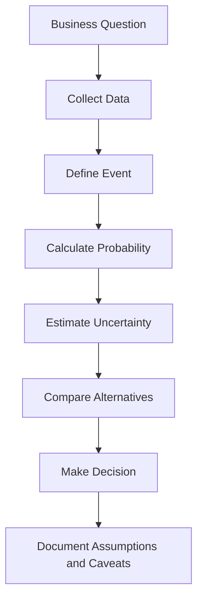
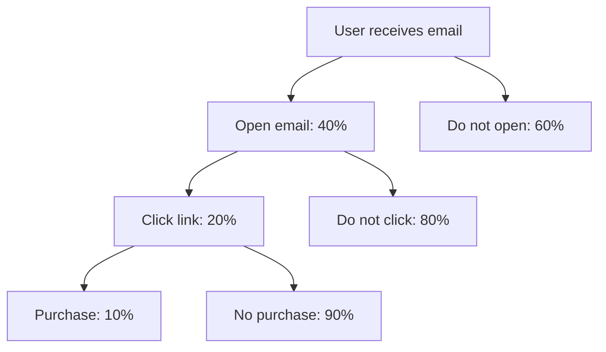

# 010 - Probability

**Course:** 01 - Math, Statistics and Econometrics
**Module:** Module 02 - Statistics
**Content Group:** Probability and Sampling
**Roadmap Source:** Statistics / Probability and Sampling
**Lesson Type:** Statistics
**Order in Module:** 010
**Suggested Duration:** 24 minutes

---

## 1. Summary

This lesson explains **Probability** in the context of **AI & Data Science**.

Probability is the study of **uncertainty**. It helps us answer questions such as:

* How likely is an event to happen?
* How confident are we in a prediction?
* How risky is a decision?
* How much uncertainty exists in our data?
* How should we make decisions when outcomes are not guaranteed?

In AI and Data Science, probability is used in:

* Machine learning models
* Classification scores
* A/B testing
* Forecasting
* Sampling
* Risk analysis
* Decision-making under uncertainty

---

## 2. Learning Objectives

By the end of this lesson, you should be able to:

* Explain **Probability** in your own words.
* Understand probability as a measure of uncertainty.
* Calculate simple probabilities.
* Distinguish between event, sample space, and outcome.
* Understand conditional probability.
* Connect probability to machine learning, experiments, and business decisions.
* Write a probability-based business conclusion with caveats.

---

## 3. Key Concept

## 3.1 What Is Probability?

**Probability** measures how likely an event is to happen.

```text
Probability = likelihood of an event
```

Probability values range from `0` to `1`.

| Probability | Meaning        |
| ----------: | -------------- |
|           0 | Impossible     |
|        0.25 | Unlikely       |
|         0.5 | Equally likely |
|        0.75 | Likely         |
|           1 | Certain        |

Example:

```text
If the probability of conversion is 0.08,
then about 8 out of 100 users are expected to convert.
```

---

## 4. Basic Probability Formula

The basic probability formula is:

$$
P(A) = \frac{\text{Number of favorable outcomes}}{\text{Total number of possible outcomes}}
$$

Where:

| Symbol             | Meaning                        |
| ------------------ | ------------------------------ |
| $P(A)$             | Probability of event A         |
| $A$                | Event of interest              |
| Favorable outcomes | Outcomes where event A happens |
| Total outcomes     | All possible outcomes          |

Example:

A fair coin has two possible outcomes:

```text
Heads, Tails
```

Probability of getting Heads:

$$
P(\text{Heads}) = \frac{1}{2} = 0.5
$$

---

## 5. Important Terms

| Term         | Meaning                            | Example        |
| ------------ | ---------------------------------- | -------------- |
| Experiment   | A process that produces an outcome | Tossing a coin |
| Outcome      | One possible result                | Heads          |
| Sample Space | All possible outcomes              | {Heads, Tails} |
| Event        | A set of outcomes we care about    | Getting Heads  |
| Probability  | Likelihood of the event            | 0.5            |

---

## 6. Simple Example

Suppose you have a website with 1,000 visitors.

Out of those visitors, 80 users made a purchase.

The probability of purchase is:

$$
P(\text{Purchase}) = \frac{80}{1000} = 0.08
$$

So:

```text
The estimated probability of purchase is 8%.
```

Business interpretation:

```text
Based on the sample, around 8 out of every 100 visitors are expected to purchase.
However, this estimate depends on sample size, traffic quality, seasonality, and possible bias.
```

---

## 7. Probability in Data Science Workflow



Example workflow:

```text
question -> sample -> probability -> uncertainty -> statistical test -> decision
```

---

## 8. Types of Probability

## 8.1 Theoretical Probability

This is based on logic or known rules.

Example:

```text
A fair dice has 6 sides.
```

Probability of rolling a 3:

$$
P(3) = \frac{1}{6}
$$

---

## 8.2 Empirical Probability

This is based on observed data.

Example:

```text
Out of 1,000 users, 80 converted.
```

$$
P(\text{Conversion}) = \frac{80}{1000} = 0.08
$$

In data science, empirical probability is very common because we usually estimate probabilities from data.

---

## 8.3 Subjective Probability

This is based on expert judgment or belief.

Example:

```text
A product manager believes there is a 70% chance that the new feature will improve retention.
```

Subjective probability can be useful, but it should be updated when real data becomes available.

---

## 9. Probability Rules

## 9.1 Complement Rule

The complement of event A means event A does not happen.

$$
P(A^c) = 1 - P(A)
$$

Example:

If the probability of conversion is 8%:

$$
P(\text{No Conversion}) = 1 - 0.08 = 0.92
$$

So:

```text
There is a 92% probability that a visitor does not convert.
```

---

## 9.2 Addition Rule

For two events A and B:

$$
P(A \cup B) = P(A) + P(B) - P(A \cap B)
$$

Where:

| Symbol     | Meaning             |
| ---------- | ------------------- |
| $A \cup B$ | A or B happens      |
| $A \cap B$ | Both A and B happen |

Example:

```text
A = user clicks ad
B = user signs up
```

If some users both click the ad and sign up, we must subtract the overlap to avoid double counting.

---

## 9.3 Multiplication Rule

For two independent events A and B:

$$
P(A \cap B) = P(A) \times P(B)
$$

Example:

If:

```text
P(User opens email) = 0.4
P(User clicks link after opening) = 0.2
```

Then:

$$
P(\text{Open and Click}) = 0.4 \times 0.2 = 0.08
$$

So:

```text
The probability that a user opens the email and clicks the link is 8%.
```

---

## 10. Conditional Probability

Conditional probability measures the probability of an event given that another event has already happened.

Formula:

$$
P(A \mid B) = \frac{P(A \cap B)}{P(B)}
$$

Where:

| Symbol        | Meaning                     |
| ------------- | --------------------------- |
| $P(A \mid B)$ | Probability of A given B    |
| $P(A \cap B)$ | Probability of both A and B |
| $P(B)$        | Probability of B            |

Example:

```text
A = user purchases
B = user clicks product page
```

Then:

```text
P(Purchase | Product Page Click)
```

means:

```text
Probability that a user purchases, given that they clicked the product page.
```

This is very useful in product analytics and funnel analysis.

---

## 11. Probability Tree Diagram

Example: Email campaign funnel



Probability of open, click, and purchase:

$$
0.40 \times 0.20 \times 0.10 = 0.008
$$

So:

```text
The probability that a user opens the email, clicks the link, and purchases is 0.8%.
```

---

## 12. Probability and Machine Learning

Many machine learning models output probabilities.

Example:

```text
Model prediction:
P(Churn) = 0.82
```

This means:

```text
The model estimates that the customer has an 82% probability of churn.
```

This probability can support business decisions:

| Probability of Churn | Possible Action                             |
| -------------------: | ------------------------------------------- |
|                 0.10 | No action needed                            |
|                 0.40 | Monitor customer                            |
|                 0.70 | Send retention offer                        |
|                 0.90 | High-risk customer, prioritize intervention |

Important caveat:

```text
A model probability is only useful if the model is well-calibrated and evaluated properly.
```

---

## 13. Probability and Classification

In classification tasks, probability helps choose a decision threshold.

Example:

```text
P(Spam) = 0.76
```

If the threshold is `0.5`, then:

```text
Classify as spam.
```

If the threshold is `0.9`, then:

```text
Do not classify as spam yet.
```

Threshold choice depends on business cost.

| Problem                 | False Positive Cost | False Negative Cost |
| ----------------------- | ------------------: | ------------------: |
| Spam detection          |              Medium |                 Low |
| Fraud detection         |              Medium |                High |
| Medical diagnosis       |                High |           Very high |
| Loan default prediction |                High |                High |

---

## 14. Probability and A/B Testing

Probability is the foundation of A/B testing.

Example:

```text
Variant A conversion rate = 8%
Variant B conversion rate = 10%
```

Important question:

```text
Is Variant B truly better, or could this difference happen by random chance?
```

Probability helps us estimate:

* Conversion rate
* Uncertainty
* Confidence interval
* Statistical significance
* Risk of wrong decision

A good A/B test conclusion should include:

```text
Variant B shows a higher observed conversion rate, but we need to check uncertainty, sample size, and statistical significance before rollout.
```

---

## 15. Probability vs Statistics

| Concept     | Main Question                                             |
| ----------- | --------------------------------------------------------- |
| Probability | Given a process, what data might we observe?              |
| Statistics  | Given observed data, what can we infer about the process? |

Simple explanation:

```text
Probability: model -> data
Statistics: data -> model
```

Example:

```text
Probability:
If conversion probability is 8%, how many conversions might we see?

Statistics:
If we observed 80 conversions out of 1,000 users, what is the estimated conversion probability?
```

---

## 16. Python Demo

```python
import pandas as pd

data = {
    "user_id": range(1, 11),
    "converted": [1, 0, 0, 1, 0, 0, 0, 1, 0, 0]
}

df = pd.DataFrame(data)

conversion_probability = df["converted"].mean()

print("Estimated probability of conversion:", conversion_probability)
```

Expected output:

```text
Estimated probability of conversion: 0.3
```

Interpretation:

```text
In this small sample, 3 out of 10 users converted.
The estimated probability of conversion is 30%.
However, the sample size is very small, so uncertainty is high.
```

---

## 17. Practical Example: Conversion Probability

Dataset:

| User | Converted |
| ---: | --------: |
|    1 |         1 |
|    2 |         0 |
|    3 |         0 |
|    4 |         1 |
|    5 |         0 |
|    6 |         0 |
|    7 |         0 |
|    8 |         1 |
|    9 |         0 |
|   10 |         0 |

Number of converted users:

```text
3
```

Total users:

```text
10
```

Probability of conversion:

$$
P(\text{Conversion}) = \frac{3}{10} = 0.3
$$

Business conclusion:

```text
The estimated conversion probability is 30% in this sample.
However, because the sample size is only 10 users, this estimate is uncertain.
We should collect more data before making a rollout decision.
```

---

## 18. Common Mistakes

## 18.1 Treating Probability as Certainty

Wrong interpretation:

```text
The model says churn probability is 80%, so the user will definitely churn.
```

Better interpretation:

```text
The model estimates high churn risk, but the outcome is still uncertain.
```

---

## 18.2 Ignoring Sample Size

A probability estimated from a small sample can be unstable.

Example:

```text
3 conversions out of 10 users = 30%
300 conversions out of 1,000 users = 30%
```

Both have the same observed conversion rate, but the second estimate is more reliable because it has a larger sample size.

---

## 18.3 Confusing Correlation with Probability

Probability can describe how often events happen together, but it does not automatically prove causation.

Example:

```text
Users who watch a product video may have higher purchase probability.
```

But this does not necessarily mean the video caused the purchase. Those users may already be more interested.

---

## 18.4 Ignoring Bias

If the sample is biased, the probability estimate may be misleading.

Example:

```text
Surveying only loyal customers may overestimate satisfaction probability.
```

---

## 18.5 Ignoring Business Impact

A probability can be statistically interesting but not business-important.

Example:

```text
A conversion increase from 8.00% to 8.05% may be statistically significant with huge traffic,
but the business impact may be too small to justify rollout.
```

---

## 19. Mini Project Connection

### Mini Project: A/B Test Conversion Rate

Probability is directly connected to conversion rate.

Conversion rate is an empirical probability:

$$
\text{Conversion Rate} = \frac{\text{Number of conversions}}{\text{Number of users}}
$$

Example:

```text
A/B Test Result:

Variant A:
80 conversions / 1000 users = 8%

Variant B:
100 conversions / 1000 users = 10%
```

Questions to answer:

1. Which variant has a higher observed probability of conversion?
2. Is the difference statistically reliable?
3. Is the business impact meaningful?
4. Could the result be caused by sample bias or random chance?
5. Should the team roll out Variant B?

---

## 20. Practice Exercise

### Exercise 1: Basic Probability

A website has 500 visitors.
40 visitors make a purchase.

Questions:

1. What is the probability of purchase?
2. What is the probability of no purchase?
3. Is the sample size large enough to trust the result?

---

### Exercise 2: Email Campaign

An email campaign is sent to 1,000 users.

* 400 users open the email.
* 100 users click the link.
* 20 users purchase.

Questions:

1. What is the probability of opening the email?
2. What is the probability of clicking the link?
3. What is the probability of purchase?
4. What is the conditional probability of purchase given click?

---

### Exercise 3: Model Probability

A churn model gives this prediction:

```text
P(Churn) = 0.78
```

Questions:

1. What does this probability mean?
2. Should the company contact this customer?
3. What business cost should be considered before taking action?

---

## 21. Checklist

Before finishing this lesson, make sure you can:

* [ ] Explain **Probability** in 1-2 minutes.
* [ ] Calculate simple probability from observed data.
* [ ] Explain event, outcome, and sample space.
* [ ] Understand complement, addition, and multiplication rules.
* [ ] Explain conditional probability.
* [ ] Connect probability to conversion rate and A/B testing.
* [ ] Interpret machine learning model probabilities.
* [ ] Write a business conclusion with sample size, uncertainty, bias, and impact.

---

## 22. Business Conclusion Template

```text
The estimated probability of [event] is [value].
This means that approximately [interpretation] out of [sample size] cases are expected to experience the event.
However, this estimate depends on sample size, data quality, sampling bias, and uncertainty.
For business decision-making, we should compare this probability with alternatives and evaluate the expected impact.
```

Example:

```text
The estimated probability of conversion is 8%.
This means that approximately 8 out of every 100 visitors are expected to convert.
However, this estimate depends on sample size, traffic source, seasonality, and possible sampling bias.
For business decision-making, we should compare this probability with the control group and evaluate whether the uplift is statistically and practically meaningful.
```

---

## 23. Final Takeaway

**Probability** is the language of uncertainty.

In AI and Data Science, probability helps us move from raw data to better decisions by answering:

```text
How likely is this event?
How uncertain is the estimate?
What decision should we make under uncertainty?
```

A good data scientist does not only say:

```text
The conversion rate is 8%.
```

A good data scientist also asks:

```text
How reliable is this probability?
How large is the sample?
Could the data be biased?
What is the business impact if this estimate is wrong?
```

Probability is the foundation for sampling, hypothesis testing, A/B testing, forecasting, and machine learning.

---

# Bài luyện tập

## Mục tiêu


## Đề bài


## Yêu cầu hoàn thành

- [ ] 
- [ ] 
- [ ] 

## Kết quả / lời giải


## Ghi chú
