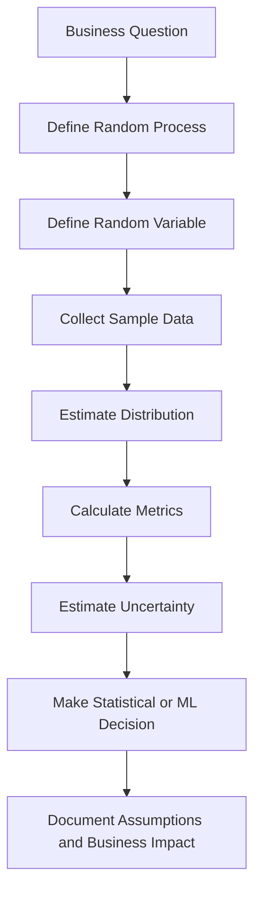
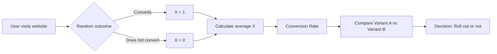

# 011 - Random Variable

**Course:** 01 - Math, Statistics and Econometrics
**Module:** Module 02 - Statistics
**Content Group:** Probability and Sampling
**Roadmap Source:** Statistics / Probability and Sampling
**Lesson Type:** Statistics
**Order in Module:** 011
**Suggested Duration:** 24 minutes

---

## 1. Summary

This lesson explains **Random Variable** in the context of **AI & Data Science**.

A **random variable** is a variable whose value depends on the outcome of a random process. It connects real-world uncertainty to numbers that we can analyze using probability, statistics, and machine learning.

In simple terms:

```text
A random variable turns uncertain outcomes into numeric values.
```

After this lesson, you should understand:

* What a random variable is.
* The difference between discrete and continuous random variables.
* How random variables are used in probability, sampling, A/B testing, and machine learning.
* How to interpret random variables in business and data science problems.

---

## 2. Learning Objectives

By the end of this lesson, you should be able to:

* Explain **Random Variable** in your own words.
* Identify random variables in real datasets.
* Distinguish between **discrete** and **continuous** random variables.
* Understand probability distributions of random variables.
* Connect random variables to metrics, experiments, models, and decisions.
* Apply the concept to a small dataset, notebook, chart, or business analysis.

---

## 3. Key Concept

## 3.1 What Is a Random Variable?

A **random variable** is a function that assigns a numerical value to each possible outcome of a random experiment.

Mathematically:

$$
X: \Omega \rightarrow \mathbb{R}
$$

Where:

| Symbol       | Meaning             |
| ------------ | ------------------- |
| $X$          | Random variable     |
| $\Omega$     | Sample space        |
| $\mathbb{R}$ | Set of real numbers |

In simpler language:

```text
Random outcome -> numeric value
```

Example:

Suppose we toss a coin.

| Outcome | Random Variable X |
| ------- | ----------------: |
| Heads   |                 1 |
| Tails   |                 0 |

Here, $X$ is a random variable representing whether the coin toss is Heads.

```text
X = 1 if Heads
X = 0 if Tails
```

---

## 4. Why Random Variables Matter

Random variables are important because they allow us to model uncertainty with numbers.

In AI and Data Science, we often ask questions like:

* Will a user convert?
* How much revenue will a customer generate?
* How long will a user stay on the app?
* Will a customer churn?
* How many orders will happen tomorrow?
* What will the model prediction be?

Each of these can be represented as a random variable.

---

## 5. Simple Examples

### Example 1: Conversion

```text
X = 1 if a user converts
X = 0 if a user does not convert
```

This is a random variable because we do not know in advance whether a user will convert.

---

### Example 2: Purchase Amount

```text
Y = purchase amount of a customer
```

Possible values:

```text
0, 10, 25, 99, 150, 1000, ...
```

This is a random variable because customer spending is uncertain.

---

### Example 3: Session Duration

```text
T = time spent on a website
```

Possible values:

```text
3.2 seconds, 15.8 seconds, 120.5 seconds, ...
```

This is also a random variable.

---

## 6. Random Variable in Data Science Workflow



Example workflow:

```text
question -> random variable -> sample -> metric -> uncertainty -> decision
```

---

## 7. Types of Random Variables

There are two main types:

1. **Discrete Random Variable**
2. **Continuous Random Variable**

---

## 7.1 Discrete Random Variable

A **discrete random variable** has countable values.

Examples:

| Random Variable         | Possible Values |
| ----------------------- | --------------- |
| Number of clicks        | 0, 1, 2, 3, ... |
| Number of purchases     | 0, 1, 2, 3, ... |
| Conversion status       | 0 or 1          |
| Number of emails opened | 0, 1, 2, 3, ... |
| Number of defects       | 0, 1, 2, 3, ... |

Example:

```text
X = number of purchases made by a user in one month
```

Possible values:

```text
0, 1, 2, 3, 4, ...
```

Since we can count the values, $X$ is discrete.

---

## 7.2 Continuous Random Variable

A **continuous random variable** can take infinitely many values within a range.

Examples:

| Random Variable        | Possible Values                |
| ---------------------- | ------------------------------ |
| User session duration  | 3.5 seconds, 4.72 seconds, ... |
| Revenue amount         | 10.25, 19.99, 100.50, ...      |
| Temperature            | 25.1°C, 25.12°C, ...           |
| Model confidence score | 0.01 to 0.99                   |
| Delivery time          | 1.2 days, 2.75 days, ...       |

Example:

```text
Y = time spent on a website
```

Possible values:

```text
1.5 seconds, 1.51 seconds, 1.512 seconds, ...
```

Since the values can vary continuously, $Y$ is continuous.

---

## 8. Discrete vs Continuous Random Variables

| Feature             | Discrete Random Variable                   | Continuous Random Variable              |
| ------------------- | ------------------------------------------ | --------------------------------------- |
| Values              | Countable                                  | Infinite within a range                 |
| Example             | Number of clicks                           | Session duration                        |
| Probability         | Probability of exact value can be non-zero | Probability of exact value is usually 0 |
| Common Distribution | Bernoulli, Binomial, Poisson               | Normal, Exponential, Uniform            |
| Data Type           | Count or category encoded as number        | Measurement                             |

Simple memory rule:

```text
Discrete = count
Continuous = measure
```

---

## 9. Probability Distribution

A **probability distribution** describes how likely each value of a random variable is.

For a discrete random variable:

```text
P(X = x)
```

means:

```text
The probability that random variable X takes value x.
```

Example:

Suppose $X$ is the number of purchases per user.

|  X | Probability |
| -: | ----------: |
|  0 |        0.60 |
|  1 |        0.25 |
|  2 |        0.10 |
|  3 |        0.05 |

Interpretation:

```text
There is a 60% probability that a user makes 0 purchases.
There is a 25% probability that a user makes 1 purchase.
There is a 10% probability that a user makes 2 purchases.
There is a 5% probability that a user makes 3 purchases.
```

The probabilities must sum to 1:

$$
0.60 + 0.25 + 0.10 + 0.05 = 1
$$

---

## 10. Expected Value

The **expected value** is the long-run average value of a random variable.

For a discrete random variable:

$$
E[X] = \sum x \cdot P(X = x)
$$

Example:

| X = Purchases | Probability |
| ------------: | ----------: |
|             0 |        0.60 |
|             1 |        0.25 |
|             2 |        0.10 |
|             3 |        0.05 |

Expected value:

$$
E[X] = 0(0.60) + 1(0.25) + 2(0.10) + 3(0.05)
$$

$$
E[X] = 0 + 0.25 + 0.20 + 0.15 = 0.60
$$

Interpretation:

```text
On average, each user is expected to make 0.6 purchases.
```

Important note:

```text
Expected value does not mean every user makes 0.6 purchases.
It means the long-run average is 0.6 purchases per user.
```

---

## 11. Variance and Standard Deviation of a Random Variable

Random variables have uncertainty. Variance and standard deviation measure how much the values spread out.

Variance:

$$
Var(X) = E[(X - E[X])^2]
$$

Standard deviation:

$$
SD(X) = \sqrt{Var(X)}
$$

Interpretation:

```text
Expected value tells us the average outcome.
Variance and standard deviation tell us how uncertain or spread out the outcome is.
```

---

## 12. Random Variable and Machine Learning

Machine learning models often predict random variables.

### Classification Example

```text
Y = whether a customer churns
```

Possible values:

```text
Y = 1 if churn
Y = 0 if not churn
```

The model may output:

```text
P(Y = 1 | user features) = 0.82
```

Interpretation:

```text
Given this user's features, the model estimates an 82% probability of churn.
```

---

### Regression Example

```text
Y = monthly revenue from a customer
```

The model predicts:

```text
Predicted revenue = $45
```

Here, revenue is a random variable because the actual future revenue is uncertain.

---

## 13. Random Variable and A/B Testing

In A/B testing, the outcome metric is often a random variable.

Example:

```text
X = conversion outcome for one user
```

Possible values:

```text
X = 1 if converted
X = 0 if not converted
```

The conversion rate is the average of many random variables:

$$
\bar{X} = \frac{X_1 + X_2 + ... + X_n}{n}
$$

Where:

| Symbol    | Meaning                      |
| --------- | ---------------------------- |
| $X_i$     | Conversion outcome of user i |
| $n$       | Number of users              |
| $\bar{X}$ | Sample conversion rate       |

If 80 out of 1,000 users convert:

$$
\bar{X} = \frac{80}{1000} = 0.08
$$

Business interpretation:

```text
The observed conversion rate is 8%.
Because this is estimated from a sample, it has uncertainty.
```

---

## 14. Diagram: Random Variable in A/B Testing



---

## 15. Common Random Variables in AI & Data Science

| Business Question                     | Random Variable      |
| ------------------------------------- | -------------------- |
| Will a user convert?                  | Conversion indicator |
| Will a customer churn?                | Churn indicator      |
| How much will a user spend?           | Purchase amount      |
| How long will a session last?         | Session duration     |
| How many clicks will a user make?     | Number of clicks     |
| How many orders will happen tomorrow? | Daily order count    |
| What score will the model output?     | Prediction score     |
| Will a transaction be fraud?          | Fraud indicator      |

---

## 16. Python Demo

```python
import pandas as pd

# X = conversion outcome
# 1 = converted, 0 = not converted
data = {
    "user_id": range(1, 11),
    "converted": [1, 0, 0, 1, 0, 0, 0, 1, 0, 0]
}

df = pd.DataFrame(data)

expected_value = df["converted"].mean()
variance = df["converted"].var()
std_dev = df["converted"].std()

print("Estimated expected value:", expected_value)
print("Estimated variance:", variance)
print("Estimated standard deviation:", std_dev)
```

Expected interpretation:

```text
The estimated expected value is the sample conversion rate.
If the mean is 0.3, then 30% of users converted in this small sample.
Because the sample size is small, uncertainty is high.
```

---

## 17. Practical Example

Suppose we define:

```text
X = number of purchases made by a customer in one month
```

Observed sample:

```text
0, 0, 1, 0, 2, 1, 0, 3, 0, 1
```

Mean:

$$
\bar{X} = \frac{0 + 0 + 1 + 0 + 2 + 1 + 0 + 3 + 0 + 1}{10}
$$

$$
\bar{X} = \frac{8}{10} = 0.8
$$

Business conclusion:

```text
In this sample, the average number of purchases is 0.8 per customer per month.
However, the sample size is only 10 customers, so this estimate is uncertain.
We should collect more data and check whether the sample represents the full customer population.
```

---

## 18. Random Variable vs Normal Variable

| Concept         | Meaning                                      |
| --------------- | -------------------------------------------- |
| Variable        | A value that can change                      |
| Random Variable | A value that depends on a random process     |
| Feature         | An input variable used by a model            |
| Target Variable | The output variable a model tries to predict |

Example:

```text
age = normal feature
conversion = random target variable
purchase amount = random target variable
```

In real datasets, many columns can be interpreted as random variables because they are observed outcomes from uncertain processes.

---

## 19. Connection to Sampling

When we collect data, we usually observe a sample from a larger population.

Example:

```text
Population: all users
Sample: 1,000 users observed in an experiment
Random variable: conversion outcome of each user
```

Each user's conversion can be represented as:

```text
X_i = 1 if user i converts
X_i = 0 if user i does not convert
```

The sample mean estimates the population probability:

$$
\bar{X} \approx P(\text{Conversion})
$$

This is why random variables are central to statistics.

---

## 20. Common Mistakes

### Mistake 1: Thinking a Random Variable Must Be Random Noise

A random variable is not always meaningless noise. It can represent important business outcomes.

Example:

```text
Customer spending is uncertain, but it is still meaningful.
```

---

### Mistake 2: Confusing Outcome with Random Variable

Outcome:

```text
A user converted.
```

Random variable:

```text
X = 1 if the user converts, 0 otherwise.
```

The random variable is the rule that maps outcomes to numbers.

---

### Mistake 3: Ignoring Sample Size

A random variable estimated from a small sample can lead to unstable conclusions.

Example:

```text
3 conversions out of 10 users = 30%
300 conversions out of 1000 users = 30%
```

Both have the same observed conversion rate, but the second estimate is more reliable.

---

### Mistake 4: Ignoring Bias

If the sample is biased, the estimated distribution of the random variable may be misleading.

Example:

```text
If we only observe loyal customers, we may overestimate conversion probability.
```

---

### Mistake 5: Treating Expected Value as a Guaranteed Outcome

Expected value is a long-run average, not a guaranteed result.

Example:

```text
Expected purchases = 0.8
```

This does not mean every customer buys 0.8 products. It means the average over many customers is 0.8.

---

## 21. Mini Project Connection

### Mini Project: A/B Test Conversion Rate

Random variables are the foundation of A/B testing.

Define:

```text
X_A = conversion outcome for a user in Variant A
X_B = conversion outcome for a user in Variant B
```

Where:

```text
X = 1 if converted
X = 0 if not converted
```

Then:

```text
E[X_A] = true conversion probability of Variant A
E[X_B] = true conversion probability of Variant B
```

The goal of the A/B test is to estimate:

$$
E[X_B] - E[X_A]
$$

Business question:

```text
Is Variant B truly better than Variant A, or is the observed difference caused by random variation?
```

---

## 22. Practice Exercise

### Exercise 1: Identify the Random Variable

For each business question, define a random variable.

| Business Question                 | Random Variable |
| --------------------------------- | --------------- |
| Will a user convert?              | ?               |
| How much will a user spend?       | ?               |
| How many clicks will a user make? | ?               |
| Will a transaction be fraud?      | ?               |

---

### Exercise 2: Discrete or Continuous?

Classify each random variable as discrete or continuous.

| Random Variable      | Type |
| -------------------- | ---- |
| Number of purchases  | ?    |
| Session duration     | ?    |
| Purchase amount      | ?    |
| Conversion status    | ?    |
| Number of page views | ?    |
| Delivery time        | ?    |

---

### Exercise 3: Business Interpretation

Dataset:

```text
Conversion outcomes:
1, 0, 0, 1, 0, 1, 0, 0, 0, 1
```

Questions:

1. What random variable is being observed?
2. What is the sample conversion rate?
3. Is the sample size large enough?
4. What uncertainty or bias should be considered?
5. How would you explain the result to a product manager?

---

## 23. Checklist

Before finishing this lesson, make sure you can:

* [ ] Explain **Random Variable** in 1-2 minutes.
* [ ] Give examples of random variables in business and machine learning.
* [ ] Distinguish between discrete and continuous random variables.
* [ ] Explain probability distribution in simple language.
* [ ] Calculate the sample mean of a random variable.
* [ ] Connect random variables to conversion rate and A/B testing.
* [ ] Write a business conclusion with sample size, uncertainty, bias, and impact.

---

## 24. Business Conclusion Template

```text
The random variable [X] represents [business outcome].
In our sample of [n] observations, the estimated average/probability is [value].
This suggests that [business interpretation].
However, this estimate may be affected by sample size, sampling bias, uncertainty, and data quality.
Before making a decision, we should compare it with a baseline, confidence interval, or experiment result.
```

Example:

```text
The random variable X represents whether a user converts.
In our sample of 1,000 users, the estimated conversion probability is 8%.
This suggests that around 8 out of every 100 users convert.
However, this estimate may be affected by traffic source, seasonality, sample size, and sampling bias.
Before making a rollout decision, we should compare it with the control group and evaluate statistical and business significance.
```

---

## 25. Final Takeaway

A **random variable** is one of the most important ideas in probability and statistics.

It allows us to convert uncertain real-world outcomes into numbers that can be analyzed.

In AI and Data Science, random variables help us understand:

* User behavior
* Conversion rates
* Revenue
* Churn
* Fraud
* Model predictions
* Experiment outcomes
* Business uncertainty

A good data scientist does not only ask:

```text
What happened in the sample?
```

A good data scientist also asks:

```text
What random variable generated this data?
What is its distribution?
How uncertain is our estimate?
How should this uncertainty affect the business decision?
```

Random variables are the bridge between uncertainty and data-driven decision-making.

---

# Bài luyện tập

## Mục tiêu


## Đề bài


## Yêu cầu hoàn thành

- [ ] 
- [ ] 
- [ ] 

## Kết quả / lời giải


## Ghi chú
