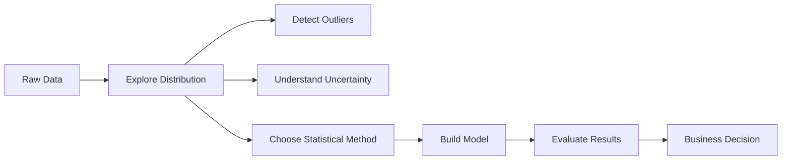
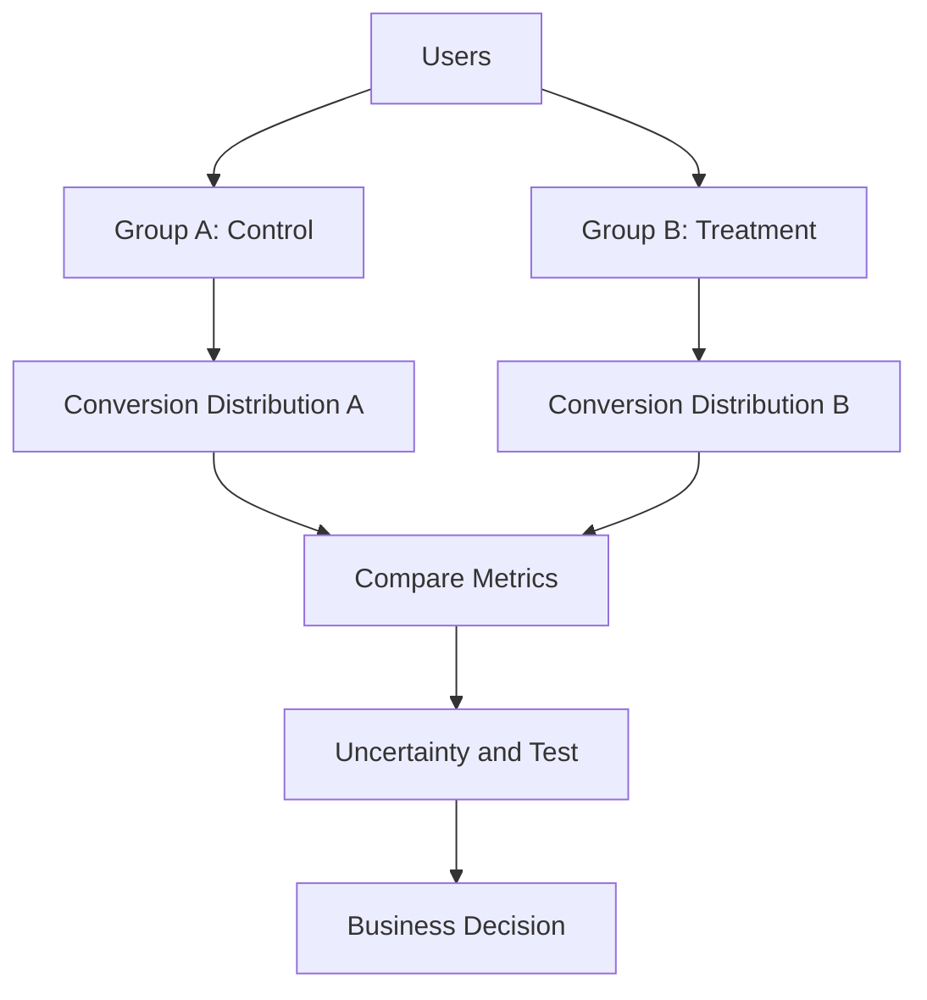

# 012 - Distribution

**Course:** 01 - Math, Statistics and Econometrics
**Module:** Module 02 - Statistics
**Content Group:** Probability and Sampling
**Roadmap Source:** Statistics / Probability and Sampling
**Lesson Type:** Statistics
**Order in Module:** 012
**Suggested Duration:** 24 minutes

---

## 1. Summary

This lesson explains **Distribution** in the context of AI and Data Science.

A **distribution** describes how values in a dataset or random process are spread. It helps us understand what values are common, what values are rare, how uncertain the data is, and what patterns may exist behind the observations.

After this lesson, you should understand how distributions help answer data questions, support model development, guide experiments, and become useful artifacts such as notebooks, charts, metrics, APIs, or portfolio projects.

---

## 2. Learning Objectives

After completing this lesson, you should be able to:

* Explain **Distribution** in your own words.
* Understand where distributions appear in the AI/Data Science workflow.
* Identify whether a variable is discrete or continuous.
* Recognize common distributions used in statistics and machine learning.
* Use distributions to reason about uncertainty, sampling, and decision-making.
* Apply the concept to a small dataset, notebook, chart, experiment, or model artifact.

---

## 3. Core Concept

A **distribution** tells us how data values are arranged.

Instead of only asking:

```text
What is the average value?
```

we also ask:

```text
How are the values spread?
Are most values close to the mean?
Are there outliers?
Is the data symmetric or skewed?
What values are likely or unlikely?
```

---

## 4. Simple Intuition

Suppose we collect user session durations from an app:

```text
[2, 3, 3, 4, 5, 6, 20]
```

The mean is:

```text
mean = 43 / 7 ≈ 6.14 minutes
```

But the distribution shows something more important:

```text
Most users spend around 2-6 minutes,
but one user spends 20 minutes.
```

So the average alone may be misleading.

A distribution helps us understand the full shape of the data.

---

## 5. Distribution in Data Science Workflow



In AI and Data Science, distributions are used to:

* Understand data before modeling.
* Detect outliers and abnormal values.
* Compare groups in experiments.
* Estimate uncertainty.
* Select appropriate statistical tests.
* Understand model predictions.
* Monitor data drift in production.

---

## 6. Why Distribution Matters

Distribution helps turn sample data into reliable conclusions.

Good statistical reasoning requires attention to:

* **Sample size**
* **Sampling bias**
* **Uncertainty**
* **Outliers**
* **Business impact**
* **Model assumptions**

Without understanding the distribution, we may make decisions based only on incomplete dashboard metrics or misleading averages.

---

## 7. Basic Types of Distribution

### 7.1 Discrete Distribution

A **discrete distribution** describes variables that take countable values.

Examples:

```text
Number of clicks
Number of purchases
Number of users
Number of failed transactions
```

Example:

```text
X = number of purchases by a user
X can be 0, 1, 2, 3, ...
```

Common discrete distributions:

| Distribution | Used For                            |
| ------------ | ----------------------------------- |
| Bernoulli    | One yes/no event                    |
| Binomial     | Number of successes in fixed trials |
| Poisson      | Count of events in a time period    |

---

### 7.2 Continuous Distribution

A **continuous distribution** describes variables that can take infinitely many values in a range.

Examples:

```text
User session duration
Revenue amount
Height
Temperature
Model prediction score
```

Common continuous distributions:

| Distribution | Used For                                          |
| ------------ | ------------------------------------------------- |
| Normal       | Symmetric data around a mean                      |
| Uniform      | Equal probability across a range                  |
| Exponential  | Waiting time between events                       |
| Log-normal   | Positive skewed values such as income or spending |

---

## 8. Important Distribution Functions

### 8.1 Probability Mass Function, PMF

Used for discrete variables.

The PMF gives the probability that a random variable equals a specific value.

```math
P(X = x)
```

Example:

```text
P(number_of_purchases = 2) = 0.15
```

This means there is a 15% chance that a user makes exactly 2 purchases.

---

### 8.2 Probability Density Function, PDF

Used for continuous variables.

The PDF describes the relative likelihood of values.

```math
f(x)
```

For continuous variables:

```math
P(X = x) = 0
```

Instead, we calculate probability over an interval:

```math
P(a \leq X \leq b)
```

Example:

```text
Probability that session duration is between 5 and 10 minutes.
```

---

### 8.3 Cumulative Distribution Function, CDF

The CDF gives the probability that a random variable is less than or equal to a value.

```math
F(x) = P(X \leq x)
```

Example:

```text
F(10) = 0.80
```

This means:

```text
80% of users have session duration less than or equal to 10 minutes.
```

---

## 9. Distribution Shape

A distribution can have different shapes.

### 9.1 Symmetric Distribution

```text
        *
      * * *
    * * * * *
  * * * * * * *
```

Most values are centered around the mean.

Example:

```text
Exam scores in a well-balanced test
```

---

### 9.2 Right-Skewed Distribution

```text
  * * * * *
        * *
          *
            *
              *
```

Most values are small, but some values are very large.

Examples:

```text
Income
Purchase amount
User spending
Session duration
```

---

### 9.3 Left-Skewed Distribution

```text
              *
            *
          *
        * *
  * * * * *
```

Most values are high, but some values are very low.

Example:

```text
Scores on an easy exam
```

---

## 10. Common Distributions in AI and Data Science

### 10.1 Bernoulli Distribution

Used for one binary event.

Examples:

```text
Clicked or not clicked
Converted or not converted
Fraud or not fraud
Pass or fail
```

Formula:

```math
X \sim Bernoulli(p)
```

Where:

```text
p = probability of success
```

Example:

```text
A user either converts or does not convert.
```

---

### 10.2 Binomial Distribution

Used for counting successes in a fixed number of trials.

Formula:

```math
X \sim Binomial(n, p)
```

Where:

```text
n = number of trials
p = probability of success
```

Example:

```text
Out of 100 users, how many converted?
```

---

### 10.3 Normal Distribution

The normal distribution is symmetric and bell-shaped.

```text
          *
        * * *
      * * * * *
    * * * * * * *
  * * * * * * * * *
```

Formula:

```math
X \sim N(\mu, \sigma^2)
```

Where:

```text
μ = mean
σ² = variance
σ = standard deviation
```

Used in:

```text
Measurement errors
Confidence intervals
Hypothesis testing
Model assumptions
```

---

### 10.4 Poisson Distribution

Used for counting events in a fixed time or space.

Formula:

```math
X \sim Poisson(\lambda)
```

Where:

```text
λ = average number of events
```

Examples:

```text
Number of API requests per minute
Number of bugs per release
Number of customer support tickets per hour
```

---

### 10.5 Exponential Distribution

Used for waiting time between events.

Examples:

```text
Time until next user signup
Time until next server failure
Time between customer purchases
```

---

### 10.6 Log-normal Distribution

Used when values are positive and heavily right-skewed.

Examples:

```text
Income
Product price
User spending
Company revenue
File size
```

---

## 11. Distribution and Sampling

In real-world data science, we usually do not have the full population.

Instead, we work with a sample.

```text
Population -> Sample -> Metric -> Uncertainty -> Decision
```

Example:

```text
All users -> 10,000 sampled users -> conversion rate -> confidence interval -> rollout decision
```

A sample distribution helps estimate the population distribution.

However, the sample must be representative.

---

## 12. Distribution and A/B Testing

Distribution is very important in A/B testing.

Example question:

```text
Did version B improve conversion rate compared to version A?
```

Workflow:



Example:

```text
Group A conversion rate = 10.2%
Group B conversion rate = 11.1%
```

But we still need to ask:

```text
Is the difference statistically reliable?
Is the sample size large enough?
Is the business impact meaningful?
```

---

## 13. Distribution and Machine Learning

Distributions appear in many ML tasks.

### Input Data Distribution

```text
What does the training data look like?
```

If training and production distributions are different, the model may fail.

This is called:

```text
Data drift
```

---

### Target Distribution

```text
Are the labels balanced?
```

Example:

```text
Fraud detection dataset:
99% normal transactions
1% fraud transactions
```

This affects model training and evaluation.

---

### Prediction Distribution

```text
How are model outputs distributed?
```

Example:

```text
Most prediction scores are between 0.1 and 0.3,
but some are above 0.9.
```

This helps choose thresholds and detect abnormal model behavior.

---

## 14. Practical Demo

Suppose we have conversion data:

```text
0 = not converted
1 = converted
```

Dataset:

```text
[0, 1, 0, 0, 1, 0, 1, 0, 0, 1]
```

Conversion rate:

```math
conversion\ rate = \frac{number\ of\ conversions}{number\ of\ users}
```

Calculation:

```text
Number of conversions = 4
Number of users = 10
Conversion rate = 4 / 10 = 0.40 = 40%
```

Interpretation:

```text
In this sample, 40% of users converted.
```

But we should also ask:

```text
Is the sample size large enough?
Was the sample biased?
How uncertain is this estimate?
Would this result hold for a larger population?
```

---

## 15. Example: Distribution-Based Thinking

Bad conclusion:

```text
The average order value is $100, so most users spend around $100.
```

Better conclusion:

```text
The average order value is $100, but the distribution is right-skewed.
Most users spend below $50, while a small number of high-value users increase the mean.
The median and percentile analysis should be reported together with the mean.
```

---

## 16. Mini Project Connection

### Mini Project: A/B Test Conversion Rate

Goal:

```text
Evaluate whether a new product page improves conversion rate.
```

Steps:

```text
1. Collect user data from Group A and Group B.
2. Calculate conversion rates.
3. Visualize conversion distribution.
4. Estimate uncertainty.
5. Run a hypothesis test.
6. Compare statistical significance with business significance.
7. Make a rollout recommendation.
```

Example decision:

```text
Version B increases conversion from 10.2% to 11.1%.
The result is statistically significant, but the business impact should be compared with engineering and marketing costs before rollout.
```

---

## 17. Practice Exercise

Create a small simulated dataset.

Example:

```text
User purchase amount:
[0, 0, 5, 10, 12, 15, 20, 100]
```

Tasks:

1. Calculate the mean.
2. Calculate the median.
3. Identify whether the distribution is skewed.
4. Describe the business meaning.
5. Write one caveat about sample size or bias.

Example business conclusion:

```text
The average purchase amount is affected by one high-value user.
The median may better represent typical customer behavior.
More data is needed before making pricing or campaign decisions.
```

---

## 18. Common Mistakes

### Mistake 1: Only Looking at the Mean

The mean can hide skewness and outliers.

Better approach:

```text
Check mean, median, percentiles, and histogram.
```

---

### Mistake 2: Ignoring Sample Size

Small samples can produce unstable conclusions.

Bad:

```text
5 out of 10 users converted, so conversion is 50%.
```

Better:

```text
The sample conversion rate is 50%, but the sample size is too small to make a reliable conclusion.
```

---

### Mistake 3: Confusing Statistical Significance with Business Significance

A result can be statistically significant but not useful for business.

Example:

```text
Conversion increased by 0.01%.
```

This may be statistically detectable with a huge sample, but not worth implementing.

---

### Mistake 4: Ignoring Bias

If the sample is not representative, the distribution may be misleading.

Example:

```text
Only surveying active users may overestimate product satisfaction.
```

---

### Mistake 5: Ignoring Multiple Comparisons

If many tests are performed, some may appear significant by chance.

Example:

```text
Testing 50 metrics and only reporting the one that improved.
```

---

## 19. Checklist

Before finishing this lesson, make sure you can answer:

* Can I explain **Distribution** in 1-2 minutes?
* Can I distinguish discrete and continuous distributions?
* Can I explain why the mean alone is not enough?
* Can I identify skewness or outliers from a chart?
* Can I connect distribution to sampling and uncertainty?
* Can I explain how distribution is used in A/B testing?
* Can I connect distribution to model training, evaluation, or monitoring?
* Do I have a notebook, query, chart, model, API, or practice note for this topic?
* Did I record at least one caveat, assumption, or follow-up question?

---

## 20. Related Outcome

This lesson supports the ability to:

```text
Use probability, sampling, descriptive statistics, hypothesis testing,
and A/B testing to make decisions from data.
```

---

## 21. Related Project

### Mini Project: A/B Test Conversion Rate

Build a small project that includes:

* Conversion metric
* Group A and Group B comparison
* Distribution visualization
* Hypothesis test
* Uncertainty explanation
* Rollout recommendation

Suggested portfolio artifact:

```text
A notebook that analyzes conversion rate distribution and recommends whether to launch a new product page.
```

---

## 22. Final Summary

**Distribution** is a core concept in Statistics, AI, and Data Science.

It helps answer questions such as:

```text
What values are common?
What values are rare?
How uncertain is this metric?
Is the data skewed?
Are there outliers?
Can we trust this sample?
Is a model seeing similar data in production?
```

A strong Data Scientist does not only report one number. They study the full distribution, understand uncertainty, and connect statistical findings to real business decisions.

Turn this topic into a practical artifact such as:

```text
notebook
query
chart
experiment report
model diagnostic
API
Docker service
portfolio note
```

The goal is not only to know the definition of distribution, but to use it to make better decisions from data.
