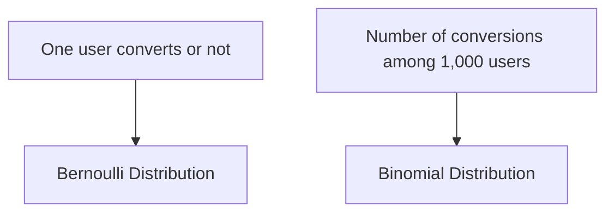

# 013 - Bernoulli Distribution

**Course:** 01 - Math, Statistics and Econometrics
**Module:** Module 02 - Statistics
**Content Group:** Probability and Sampling
**Roadmap Source:** Statistics / Probability and Sampling
**Lesson Type:** Statistics
**Order in Module:** 013
**Suggested Duration:** 24 minutes

---

## 1. Summary

A **Bernoulli Distribution** describes a random experiment with only two possible outcomes:

* **Success** = `1`
* **Failure** = `0`

It is one of the most fundamental probability distributions in statistics, machine learning, and A/B testing.

In AI and Data Science, Bernoulli Distribution helps model events such as:

* A user clicks an ad or does not click.
* A customer converts or does not convert.
* An email is spam or not spam.
* A patient has a disease or does not have a disease.
* A model prediction is correct or incorrect.

After this lesson, you should understand how Bernoulli Distribution helps answer data questions, how it connects to experiments and binary classification, and how it can become a notebook, metric, chart, API, or portfolio artifact.

---

## 2. Learning Objectives

By the end of this lesson, you should be able to:

* Explain **Bernoulli Distribution** in your own words.
* Identify when a real-world problem can be modeled as a Bernoulli trial.
* Calculate probability, expected value, and variance for Bernoulli variables.
* Understand how Bernoulli Distribution connects to conversion rate, classification, and A/B testing.
* Apply Bernoulli Distribution to a small dataset or experiment.

---

## 3. Core Idea

A random variable (X) follows a Bernoulli Distribution if it can take only two values:

$$
X =
\begin{cases}
1, & \text{with probability } p \
0, & \text{with probability } 1-p
\end{cases}
$$

Where:

* (X = 1): success
* (X = 0): failure
* (p): probability of success
* (1-p): probability of failure

We write:

$$
X \sim \mathrm{Bernoulli}(p)
$$

---

## 4. Simple Example

Suppose an e-commerce website wants to measure whether a user buys a product after visiting a product page.

Each user visit can be represented as:

| User   | Bought Product? | Bernoulli Value |
| ------ | --------------: | --------------: |
| User 1 |             Yes |               1 |
| User 2 |              No |               0 |
| User 3 |              No |               0 |
| User 4 |             Yes |               1 |
| User 5 |             Yes |               1 |

If the probability that a user buys a product is (p = 0.3), then:

$$
X \sim \mathrm{Bernoulli}(0.3)
$$

This means:

$$
P(X = 1) = 0.3
$$

$$
P(X = 0) = 0.7
$$

---

## 5. Probability Mass Function

The probability mass function, or PMF, of a Bernoulli random variable is:

$$
P(X = x) = p^x(1-p)^{1-x}
$$

Where:

$$
x \in {0, 1}
$$

This formula works for both cases.

### Case 1: Success

If (x = 1):

$$
P(X = 1) = p^1(1-p)^0 = p
$$

### Case 2: Failure

If (x = 0):

$$
P(X = 0) = p^0(1-p)^1 = 1-p
$$

---

## 6. Expected Value and Variance

### Expected Value

The expected value of a Bernoulli random variable is:

$$
E[X] = p
$$

This means the long-term average outcome equals the probability of success.

For example, if conversion probability is (p = 0.2), then the expected value is:

$$
E[X] = 0.2
$$

In business language, this means the expected conversion rate is **20%**.

---

### Variance

The variance of a Bernoulli random variable is:

$$
\mathrm{Var}(X) = p(1-p)
$$

Variance measures uncertainty.

If (p = 0.5):

$$
\mathrm{Var}(X) = 0.5(1-0.5) = 0.25
$$

If (p = 0.9):

$$
\mathrm{Var}(X) = 0.9(1-0.9) = 0.09
$$

The uncertainty is highest when (p = 0.5), because the outcome is most unpredictable.

---

## 7. Bernoulli Distribution in the AI/Data Science Workflow


Example workflow:

```text
question -> binary event -> Bernoulli variable -> sample -> metric -> uncertainty -> decision
```

For example:

```text
Will a user convert?
-> conversion: yes/no
-> X = 1 if converted, X = 0 otherwise
-> collect user data
-> estimate conversion rate
-> measure uncertainty
-> decide whether to launch a new feature
```

---

## 8. Connection to Conversion Rate

If each user either converts or does not convert, then each user can be modeled as a Bernoulli trial.

For one user:

$$
X_i \sim \mathrm{Bernoulli}(p)
$$

For many users:

$$
X_1, X_2, X_3, \ldots, X_n
$$

The sample conversion rate is:

$$
\hat{p} = \frac{\text{number of conversions}}{\text{number of users}}
$$

Or:

$$
\hat{p} = \frac{1}{n}\sum_{i=1}^{n}X_i
$$

Example:

| Users | Conversions |
| ----: | ----------: |
| 1,000 |         120 |

Then:

$$
\hat{p} = \frac{120}{1000} = 0.12
$$

So the estimated conversion rate is:

$$
12%
$$

---

## 9. Bernoulli vs Binomial Distribution

Bernoulli Distribution models **one binary trial**.

Binomial Distribution models the **number of successes in many Bernoulli trials**.



| Distribution | Meaning     | Example                           |
| ------------ | ----------- | --------------------------------- |
| Bernoulli    | One trial   | One user clicks or does not click |
| Binomial     | Many trials | Number of clicks from 1,000 users |

If:

$$
X_i \sim \mathrm{Bernoulli}(p)
$$

Then the total number of successes:

$$
S = X_1 + X_2 + \cdots + X_n
$$

follows a Binomial Distribution:

$$
S \sim \mathrm{Binomial}(n, p)
$$

---

## 10. Applications in AI and Data Science

### 10.1 A/B Testing

In A/B testing, each user outcome is often binary:

* Converted or not converted
* Clicked or not clicked
* Subscribed or not subscribed

Each user's behavior can be represented as a Bernoulli variable.

Example:

$$
X_A \sim \mathrm{Bernoulli}(p_A)
$$

$$
X_B \sim \mathrm{Bernoulli}(p_B)
$$

The goal is to compare:

$$
p_A \quad \text{vs} \quad p_B
$$

Business question:

> Does version B increase conversion compared to version A?

---

### 10.2 Binary Classification

Many machine learning tasks are binary:

* Spam vs not spam
* Fraud vs not fraud
* Churn vs not churn
* Disease vs no disease

The model often predicts a probability:

$$
P(Y = 1 \mid X)
$$

For example:

```text
P(churn = 1 | user features) = 0.78
```

This means the model estimates a 78% probability that the user will churn.

---

### 10.3 Logistic Regression

Logistic regression directly models Bernoulli outcomes.

The target variable is:

$$
Y \in {0, 1}
$$

The model predicts:

$$
P(Y = 1 \mid X) = \sigma(w^T X + b)
$$

Where:

$$
\sigma(z) = \frac{1}{1 + e^{-z}}
$$

The output is a probability between 0 and 1.

---

## 11. Practical Demo

Suppose we observe 10 users:

```text
[1, 0, 0, 1, 1, 0, 0, 0, 1, 0]
```

Where:

* `1` means converted
* `0` means not converted

Number of users:

$$
n = 10
$$

Number of conversions:

$$
4
$$

Estimated probability:

$$
\hat{p} = \frac{4}{10} = 0.4
$$

So the estimated conversion rate is:

$$
40%
$$

---

## 12. Python Example

```python
import numpy as np

# Simulated Bernoulli data
data = np.array([1, 0, 0, 1, 1, 0, 0, 0, 1, 0])

# Sample size
n = len(data)

# Estimated probability of success
p_hat = data.mean()

# Estimated variance
variance = p_hat * (1 - p_hat)

print("Sample size:", n)
print("Estimated probability:", p_hat)
print("Estimated variance:", variance)
```

Expected output:

```text
Sample size: 10
Estimated probability: 0.4
Estimated variance: 0.24
```

---

## 13. Business Interpretation

A technical result:

```text
Estimated p = 0.4
```

Can be translated into business language:

> Based on the sample, around 40% of users converted. However, because the sample size is small, this estimate has high uncertainty. More data should be collected before making a rollout decision.

Good statistical thinking does not stop at the metric. It also considers:

* sample size
* bias
* uncertainty
* business impact
* cost of wrong decisions

---

## 14. Common Mistakes

### Mistake 1: Ignoring Sample Size

A conversion rate of 80% from 5 users is not very reliable.

```text
4 conversions / 5 users = 80%
```

But the sample is too small.

A conversion rate of 52% from 100,000 users is usually much more reliable.

---

### Mistake 2: Confusing Statistical Significance with Business Significance

A result may be statistically significant but still not meaningful for the business.

Example:

```text
Conversion increases from 10.00% to 10.05%
```

This may be statistically detectable with a huge sample size, but the business impact may be too small.

---

### Mistake 3: Ignoring Bias

If the sample only includes loyal users, the estimated probability may not represent all users.

Example:

```text
Sample: premium users only
Conclusion: all users will convert at 40%
```

This is likely biased.

---

### Mistake 4: Treating Probability as Certainty

If a model says:

```text
P(churn = 1) = 0.8
```

It does not mean the user will definitely churn.

It means the user has a high estimated probability of churn.

---

## 15. Mini Project: A/B Test Conversion Rate

### Project Goal

Use Bernoulli Distribution to analyze a simple A/B test.

### Dataset

| User ID | Group | Converted |
| ------- | ----- | --------: |
| 1       | A     |         0 |
| 2       | A     |         1 |
| 3       | A     |         0 |
| 4       | B     |         1 |
| 5       | B     |         1 |
| 6       | B     |         0 |

### Steps

1. Represent each conversion as a Bernoulli variable.
2. Calculate conversion rate for group A.
3. Calculate conversion rate for group B.
4. Compare the two estimated probabilities.
5. Discuss uncertainty and sample size.
6. Write a rollout recommendation.

### Example Conclusion

> Group B has a higher observed conversion rate than Group A in this sample. However, the sample size is very small, so the result is not reliable enough for a full rollout. The next step should be to collect more data and run a formal hypothesis test.

---

## 16. Practice Exercises

### Exercise 1

A website has 200 visitors. 30 visitors sign up.

Calculate the estimated signup probability:

$$
\hat{p} = ?
$$

---

### Exercise 2

A machine learning model predicts whether an email is spam.

For each email:

```text
spam = 1
not spam = 0
```

Explain why this can be modeled as a Bernoulli variable.

---

### Exercise 3

A product team observes this conversion data:

```text
[0, 1, 0, 0, 1, 1, 0, 0, 0, 1]
```

Calculate:

* sample size
* number of conversions
* estimated probability
* variance

---

### Exercise 4

Write a business conclusion for this result:

```text
Estimated conversion rate = 6%
Sample size = 50
```

Your conclusion should mention uncertainty.

---

## 17. Completion Checklist

You have completed this lesson if you can:

* Explain **Bernoulli Distribution** in 1-2 minutes.
* Identify binary events that can be modeled as Bernoulli variables.
* Calculate (P(X=1)), (P(X=0)), (E[X]), and (\mathrm{Var}(X)).
* Connect Bernoulli Distribution to conversion rate and binary classification.
* Explain why sample size and uncertainty matter.
* Create a small notebook, query, chart, model, API, or portfolio note using this topic.
* Write at least one caveat, assumption, or follow-up question for analysis.

---

## 18. Related Outcome

Use probability, sampling, descriptive statistics, hypothesis testing, and A/B testing to make decisions from data.

---

## 19. Related Project

**Mini Project:** A/B Test Conversion Rate

Build a small analysis project that includes:

* conversion metric
* Bernoulli trials
* estimated probability
* uncertainty discussion
* hypothesis test
* rollout recommendation

---

## 20. Final Summary

**Bernoulli Distribution** is the probability distribution for a single binary event.

It is simple but extremely important in AI and Data Science because many real-world problems are binary:

```text
click / no click
buy / no buy
spam / not spam
fraud / not fraud
convert / not convert
```

The key idea is:

$$
X \sim \mathrm{Bernoulli}(p)
$$

Where:

* (X = 1) means success
* (X = 0) means failure
* (p) is the probability of success

Bernoulli Distribution is the foundation for conversion analysis, A/B testing, binary classification, logistic regression, and many decision-making systems in data science.
