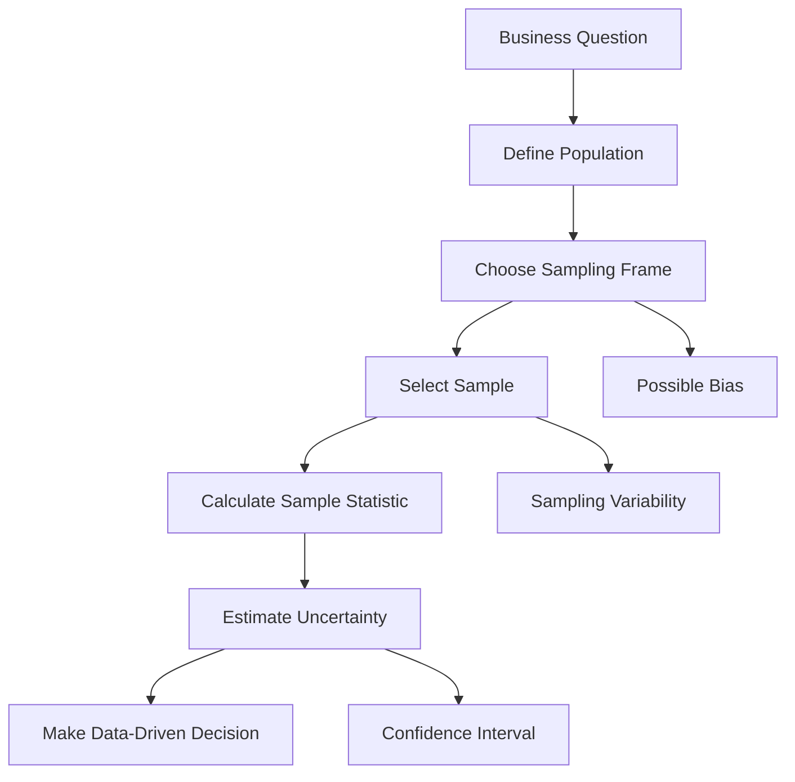
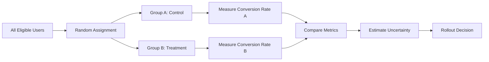

# 016 - Sampling

**Course:** 01 - Math, Statistics and Econometrics
**Module:** Module 02 - Statistics
**Content Group:** Probability and Sampling
**Roadmap Source:** Statistics / Probability and Sampling
**Lesson Type:** Statistics
**Order in Module:** 016
**Suggested Duration:** 24 minutes

---

## 1. Summary

**Sampling** is the process of selecting a smaller group of observations from a larger population in order to make conclusions about that population.

In AI and Data Science, we often cannot collect or analyze all possible data. Instead, we use samples to estimate metrics, train models, test hypotheses, and support business decisions.

Sampling helps answer questions such as:

* What is the average behavior of all users?
* Is the conversion rate improving after a product change?
* Can a small dataset represent the full customer population?
* Is a model evaluation result reliable?
* How much uncertainty exists in our estimate?

After this lesson, you should understand how sampling connects data collection, metrics, uncertainty, experiments, and decision-making.

---

## 2. Learning Objectives

By the end of this lesson, you should be able to:

* Explain **Sampling** in your own words.
* Understand why samples are used instead of full populations.
* Identify where sampling appears in the AI/Data Scientist workflow.
* Recognize common sampling methods and their trade-offs.
* Understand the relationship between sample size, bias, uncertainty, and business impact.
* Apply sampling concepts to a dataset, notebook, chart, metric, experiment, model, or portfolio artifact.

---

## 3. Key Concepts

### 3.1 Population

A **population** is the complete group you want to study.

Examples:

* All users of an app
* All transactions in a month
* All customers in a market
* All images in a target production environment
* All possible future model predictions

---

### 3.2 Sample

A **sample** is a smaller subset selected from the population.

Example:

```text
Population: 1,000,000 users
Sample: 10,000 selected users
```

The goal is to use the sample to estimate something about the population.

---

### 3.3 Sampling Frame

A **sampling frame** is the actual list or source from which the sample is selected.

Example:

```text
Target population: all customers
Sampling frame: customers with email addresses in the database
```

If the sampling frame misses part of the population, the sample may become biased.

---

### 3.4 Parameter vs Statistic

| Concept       | Meaning                               | Example                                  |
| ------------- | ------------------------------------- | ---------------------------------------- |
| **Parameter** | A true value from the full population | True average revenue of all users        |
| **Statistic** | An estimate calculated from a sample  | Average revenue from 5,000 sampled users |

In real-world data science, we often do not know the true parameter, so we estimate it using a statistic.

---

## 4. Why Sampling Matters in AI and Data Science

Sampling is important because data is often:

* Too large to process fully
* Expensive to collect
* Time-consuming to label
* Continuously changing
* Unavailable in complete form
* Risky to use without privacy or compliance controls

Sampling allows data scientists to make practical decisions with limited data.

---

## 5. Sampling Workflow

```text
Business Question
        |
        v
Define Population
        |
        v
Choose Sampling Method
        |
        v
Collect Sample
        |
        v
Calculate Metric
        |
        v
Estimate Uncertainty
        |
        v
Run Statistical Test
        |
        v
Make Decision
```

---

## 6. Mermaid Diagram: Sampling Process



---

## 7. Common Sampling Methods

### 7.1 Simple Random Sampling

Every observation has an equal chance of being selected.

```text
Population -> randomly select n observations -> sample
```

Example:

Randomly select 1,000 users from all active users.

Best used when:

* The population is well-defined.
* Every item can be accessed.
* You want a fair and unbiased sample.

---

### 7.2 Stratified Sampling

The population is divided into groups, then samples are taken from each group.

Example:

```text
Users grouped by region:
- North
- South
- East
- West

Sample users from each region.
```

Best used when:

* Important subgroups exist.
* You want each subgroup to be represented.
* The dataset is imbalanced.

AI example:

Sampling images from each class in a classification dataset.

---

### 7.3 Cluster Sampling

The population is divided into clusters, and some clusters are selected.

Example:

```text
Population: all schools in a country
Clusters: schools
Sample: select some schools and survey students inside them
```

Best used when:

* The population is geographically or naturally grouped.
* Full random sampling is expensive.
* Data collection happens by group.

---

### 7.4 Systematic Sampling

Select every `k-th` observation from a list.

Example:

```text
Select every 10th transaction from a database.
```

Best used when:

* Data is ordered.
* You need a simple sampling process.

Warning:

If the data has hidden patterns, systematic sampling may introduce bias.

---

### 7.5 Convenience Sampling

Select data that is easiest to access.

Example:

```text
Use only users who replied to a survey.
```

This method is easy but often biased.

Use with caution.

---

## 8. Sampling in Machine Learning

Sampling appears in many parts of the machine learning workflow.

| Workflow Stage  | Sampling Example                                 |
| --------------- | ------------------------------------------------ |
| Data collection | Select a subset of users or events               |
| Labeling        | Sample images or text for annotation             |
| Training        | Use mini-batches during model training           |
| Validation      | Split data into train, validation, and test sets |
| Evaluation      | Estimate model accuracy from test samples        |
| A/B testing     | Compare sampled user groups                      |
| Monitoring      | Sample production logs for quality checks        |

---

## 9. Important Formulas

### 9.1 Sample Mean

The sample mean estimates the population mean.

$$
\bar{x} = \frac{1}{n}\sum_{i=1}^{n}x_i
$$

Where:

* $\bar{x}$ = sample mean
* $n$ = sample size
* $x_i$ = each observation

---

### 9.2 Sample Proportion

Used for binary outcomes such as conversion, click, churn, or success.

$$
\hat{p} = \frac{x}{n}
$$

Where:

* $\hat{p}$ = sample proportion
* $x$ = number of successes
* $n$ = sample size

Example:

```text
200 conversions out of 5,000 users

p_hat = 200 / 5000 = 0.04

Conversion rate = 4%
```

---

### 9.3 Standard Error of the Mean

Standard error measures how much the sample mean may vary from sample to sample.

$$
SE = \frac{s}{\sqrt{n}}
$$

Where:

* $SE$ = standard error
* $s$ = sample standard deviation
* $n$ = sample size

Larger sample size usually means smaller standard error.

---

### 9.4 Standard Error of a Proportion

For conversion rate or click-through rate:

$$
SE = \sqrt{\frac{\hat{p}(1-\hat{p})}{n}}
$$

This is commonly used in A/B testing.

---

## 10. Sample Size and Uncertainty

Sample size affects uncertainty.

```text
Small sample size  -> high uncertainty
Large sample size  -> lower uncertainty
```

However, a large sample does not automatically fix bias.

```text
Large biased sample -> confidently wrong conclusion
```

A good sample should be:

* Large enough
* Representative
* Collected consistently
* Relevant to the business question

---

## 11. Sampling Bias

**Sampling bias** happens when the sample does not represent the population.

Examples:

* Surveying only active users
* Using only data from one country
* Training a model only on high-quality images
* Evaluating a recommendation system only on frequent buyers
* Collecting feedback only from unhappy customers

Sampling bias can lead to poor decisions even if the sample size is large.

---

## 12. Sampling Variability

Different samples from the same population can produce different results.

Example:

```text
Sample A conversion rate: 4.1%
Sample B conversion rate: 3.8%
Sample C conversion rate: 4.3%
```

This natural variation is called **sampling variability**.

Statistical methods help quantify this uncertainty.

---

## 13. Sampling and Confidence Intervals

A confidence interval gives a range of plausible values for the population metric.

Example:

```text
Estimated conversion rate: 4.0%
95% confidence interval: 3.6% to 4.4%
```

Business interpretation:

```text
The true conversion rate is likely around 4%, but there is uncertainty.
```

---

## 14. Sampling in A/B Testing

Sampling is central to A/B testing.

```text
Users
  |
  |-- Group A: Control
  |
  |-- Group B: Treatment
```

Then compare metrics:

```text
Conversion Rate A = 4.0%
Conversion Rate B = 4.6%
```

Key question:

```text
Is the difference real, or could it be caused by random sampling variation?
```

---

## 15. Mermaid Diagram: Sampling in A/B Testing



---

## 16. Example / Demo

### Business Question

```text
Did the new checkout page improve conversion rate?
```

### Dataset

```text
Control group: 5,000 users, 200 conversions
Treatment group: 5,000 users, 230 conversions
```

### Metrics

```text
Control conversion rate = 200 / 5000 = 4.0%
Treatment conversion rate = 230 / 5000 = 4.6%
Difference = 0.6 percentage points
```

### Interpretation

The treatment group has a higher observed conversion rate.

However, before making a rollout decision, we need to check uncertainty.

Possible conclusion:

```text
The new checkout page may improve conversion rate, but we need a statistical test or confidence interval before deciding whether the improvement is reliable.
```

---

## 17. Sampling in Model Evaluation

When evaluating a machine learning model, the test set is a sample from the target population.

Example:

```text
Model accuracy on test set = 91%
```

This does not mean the model will always be 91% accurate in production.

Questions to ask:

* Is the test set representative?
* Is the test set large enough?
* Does the test set match production data?
* Are rare classes included?
* Are edge cases included?

---

## 18. Practical Notebook Idea

Create a small notebook that simulates sampling.

### Steps

1. Create a fake population of users.
2. Assign each user a conversion outcome.
3. Draw different random samples.
4. Calculate conversion rate for each sample.
5. Visualize how sample estimates vary.
6. Compare small samples and large samples.

Example workflow:

```text
create population
        |
draw sample of size 100
        |
draw sample of size 1,000
        |
draw sample of size 10,000
        |
compare uncertainty
```

---

## 19. Practical Exercise

### Task 1: Create a Simulated Dataset

Create a small dataset with:

* `user_id`
* `group`
* `converted`
* `country`
* `device_type`

Example:

```text
user_id | group     | converted | country | device_type
1       | control   | 0         | VN      | mobile
2       | treatment | 1         | VN      | desktop
3       | control   | 0         | US      | mobile
```

---

### Task 2: Calculate Metrics

Calculate:

* Sample size
* Conversion rate
* Difference between groups
* Standard error
* Confidence interval

---

### Task 3: Write a Business Conclusion

Example:

```text
The treatment group shows a higher conversion rate than the control group. However, the sample size and uncertainty should be checked before recommending a full rollout.
```

---

## 20. Common Mistakes

### Mistake 1: Using a Sample That Is Too Small

Small samples can produce unstable results.

```text
10 users, 2 conversions -> 20% conversion rate
```

This may look impressive, but it is not reliable.

---

### Mistake 2: Ignoring Sampling Bias

A large biased sample can still lead to the wrong conclusion.

Example:

```text
Surveying only power users does not represent all users.
```

---

### Mistake 3: Confusing Statistical Significance with Business Significance

A result can be statistically significant but too small to matter in business.

Example:

```text
Conversion increased by 0.01%.
```

This may not justify engineering, marketing, or operational costs.

---

### Mistake 4: Ignoring Uncertainty

Do not report only one number.

Weak conclusion:

```text
Conversion rate is 4.2%.
```

Better conclusion:

```text
Conversion rate is estimated at 4.2%, with uncertainty depending on sample size and sampling method.
```

---

### Mistake 5: Multiple Comparisons

If you test many metrics or segments, some may look significant by chance.

Example:

```text
Testing 50 user segments may produce false positives.
```

---

## 21. Checklist for Completion

You have completed this lesson if:

* [ ] You can explain **Sampling** in 1-2 minutes.
* [ ] You understand the difference between population and sample.
* [ ] You can describe at least three sampling methods.
* [ ] You know why sample size affects uncertainty.
* [ ] You understand why bias is dangerous.
* [ ] You can connect sampling to A/B testing.
* [ ] You can connect sampling to model evaluation.
* [ ] You have created a notebook, query, chart, model, API, or practice note for this lesson.
* [ ] You have written at least one caveat, assumption, or follow-up question.

---

## 22. Related Outcome

Use probability, sampling, descriptive statistics, hypothesis testing, and A/B testing to make decisions from data.

---

## 23. Related Project

### Mini Project: A/B Test Conversion Rate

Build a small A/B testing analysis project.

Required components:

* Conversion metric
* Control group and treatment group
* Sample size check
* Hypothesis test
* Confidence interval
* Business recommendation

Example final recommendation:

```text
Based on the observed conversion lift and uncertainty estimate, we recommend either rolling out the treatment, continuing the experiment, or stopping the test due to insufficient evidence.
```

---

## 24. Portfolio Artifact Ideas

You can turn this lesson into:

* A Jupyter Notebook about sampling simulation
* A dashboard showing sample size and uncertainty
* A SQL query that samples production data
* A chart comparing sample estimates
* An A/B testing report
* A model evaluation note
* A short blog post explaining sampling bias
* A portfolio case study on conversion rate analysis

---

## 25. Final Summary

**Sampling** is a core concept in statistics, AI, and Data Science. It allows us to make conclusions about a large population using a smaller subset of data.

Good sampling helps data scientists avoid emotional or misleading conclusions from dashboards. It connects directly to metrics, uncertainty, model evaluation, hypothesis testing, and A/B testing.

A strong data scientist does not only ask:

```text
What does the sample say?
```

They also ask:

```text
Is this sample representative?
How large is the uncertainty?
Could bias affect the conclusion?
Does the result matter for the business?
```

Sampling is not just a statistical technique. It is a decision-making tool.

---

# Bài luyện tập

## Mục tiêu


## Đề bài


## Yêu cầu hoàn thành

- [ ] 
- [ ] 
- [ ] 

## Kết quả / lời giải


## Ghi chú
