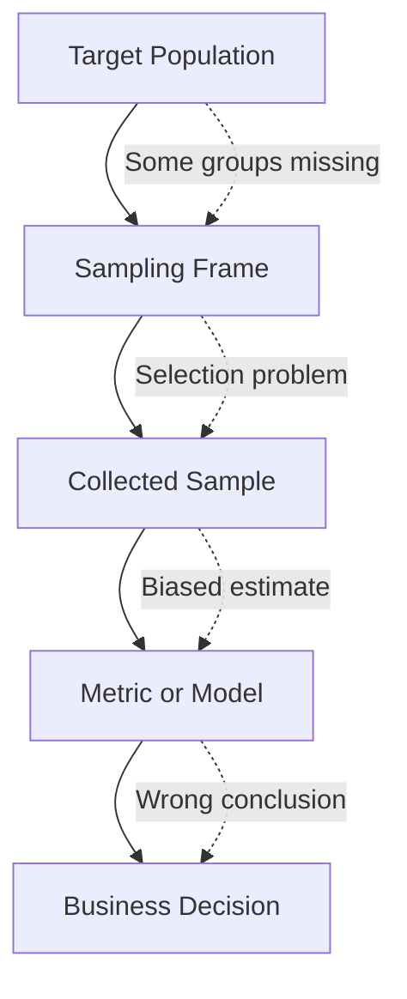
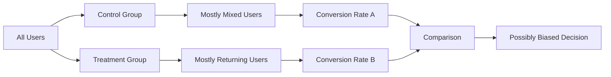

# 017 - Sampling Bias

**Course:** 01 - Math, Statistics and Econometrics
**Module:** Module 02 - Statistics
**Content Group:** Probability and Sampling
**Roadmap Source:** Statistics / Probability and Sampling
**Lesson Type:** Statistics
**Order in Module:** 017
**Suggested Duration:** 24 minutes

---

## 1. Summary

**Sampling Bias** happens when the sample used in an analysis does not properly represent the target population.

In AI and Data Science, sampling bias is dangerous because it can make a metric, model, dashboard, or experiment look reliable while actually leading to the wrong conclusion.

Sampling bias helps answer questions such as:

* Is this dataset representative of the real population?
* Are some user groups missing from the sample?
* Is the model being trained on biased data?
* Is the A/B test result trustworthy?
* Could the business decision be wrong because the sample is unfair or incomplete?

After this lesson, you should understand how sampling bias affects metrics, experiments, model evaluation, and business decisions.

---

## 2. Learning Objectives

By the end of this lesson, you should be able to:

* Explain **Sampling Bias** in your own words.
* Understand why a large sample can still be biased.
* Identify common types of sampling bias.
* Recognize sampling bias in datasets, dashboards, surveys, and experiments.
* Explain how sampling bias affects AI models and A/B testing.
* Apply this concept to a dataset, notebook, chart, model, experiment, or portfolio artifact.

---

## 3. Key Concepts

### 3.1 Population

A **population** is the full group you want to understand.

Examples:

* All users of an app
* All customers in a market
* All product transactions
* All patients in a medical system
* All future images a model may see in production

---

### 3.2 Sample

A **sample** is a smaller subset selected from the population.

```text id="x6gq2k"
Population: all app users
Sample: 10,000 selected app users
```

A good sample should represent the population.

---

### 3.3 Sampling Bias

**Sampling Bias** occurs when the sample systematically differs from the population.

```text id="p34n8m"
Good sample:
Sample looks like the population.

Biased sample:
Sample misses or overrepresents certain groups.
```

---

## 4. Why Sampling Bias Matters

Sampling bias matters because it can produce confident but wrong conclusions.

A biased sample can make you think:

* A product feature is better than it really is.
* A model performs well when it does not.
* Customers are satisfied when only happy users responded.
* A campaign works when only active users were measured.
* A metric is stable when some groups are missing.

Important idea:

```text id="b4m7q9"
Large sample size does not automatically remove bias.
```

A large biased dataset can still lead to a wrong decision.

---

## 5. Sampling Bias Workflow

```text id="k9q5la"
Business Question
        |
        v
Target Population
        |
        v
Sampling Frame
        |
        v
Collected Sample
        |
        v
Metric / Model / Test
        |
        v
Decision
```

Bias can appear when the collected sample does not match the target population.

---

## 6. Mermaid Diagram: Where Bias Appears



---

## 7. Simple Example

### Business Question

```text id="l72nrx"
Are users satisfied with the new app design?
```

### Biased Sample

```text id="z19wpt"
Survey sent only to users who opened the app every day.
```

### Problem

Daily active users may be more engaged and more positive than average users.

The sample misses:

* New users
* Inactive users
* Frustrated users
* Users who stopped using the app
* Users who had technical problems

### Bad Conclusion

```text id="v2q83c"
Most users love the new design.
```

### Better Conclusion

```text id="q6tz4m"
Among highly active users who responded to the survey, satisfaction appears high. However, the sample may not represent all users.
```

---

## 8. Common Types of Sampling Bias

### 8.1 Selection Bias

Selection bias happens when some members of the population are more likely to be selected than others.

Example:

```text id="r5j83x"
Only measuring users who completed checkout.
```

Problem:

This ignores users who abandoned checkout.

---

### 8.2 Survivorship Bias

Survivorship bias happens when analysis only includes successful or remaining cases.

Example:

```text id="m4kp81"
Analyzing only customers who are still subscribed.
```

Problem:

You ignore customers who churned.

---

### 8.3 Non-response Bias

Non-response bias happens when people who respond are different from people who do not respond.

Example:

```text id="c8yq20"
Only 5% of users answer a feedback survey.
```

Problem:

The respondents may not represent all users.

---

### 8.4 Convenience Sampling Bias

Convenience sampling bias happens when data is collected from the easiest available source.

Example:

```text id="a1fj52"
Testing an app only with employees inside the company.
```

Problem:

Employees may not behave like real customers.

---

### 8.5 Coverage Bias

Coverage bias happens when the sampling frame does not include the full population.

Example:

```text id="w2pu69"
Surveying only users with verified email addresses.
```

Problem:

Users without verified emails are excluded.

---

### 8.6 Time-Based Bias

Time-based bias happens when the sample is collected during an unusual time period.

Example:

```text id="e7mn5b"
Measuring shopping behavior only during Black Friday.
```

Problem:

Black Friday behavior may not represent normal shopping behavior.

---

## 9. Sampling Bias in AI and Machine Learning

Sampling bias can affect machine learning at many stages.

| ML Stage        | Bias Example                                | Possible Impact                   |
| --------------- | ------------------------------------------- | --------------------------------- |
| Data collection | Only collecting data from one region        | Poor performance in other regions |
| Labeling        | Only easy examples are labeled              | Model fails on hard cases         |
| Training        | Rare classes are underrepresented           | Model ignores minority classes    |
| Validation      | Test set does not match production          | Evaluation looks too optimistic   |
| Deployment      | Production users differ from training users | Model performance drops           |
| Monitoring      | Only sampling successful requests           | Failures are hidden               |

---

## 10. Sampling Bias in Model Evaluation

A model test set is also a sample.

Example:

```text id="sx9z2r"
Model accuracy on test set = 95%
```

This result may be misleading if the test set is biased.

Questions to ask:

* Does the test set match production data?
* Are rare classes included?
* Are difficult examples included?
* Are different user groups represented?
* Are edge cases included?
* Was data collected from the same time period as production?

Better interpretation:

```text id="a93klp"
The model achieved 95% accuracy on this test set, but we need to verify whether the test set is representative of real production data.
```

---

## 11. Sampling Bias in A/B Testing

Sampling bias can make an A/B test result unreliable.

Example:

```text id="n8v3xq"
Control group: random users
Treatment group: mostly returning users
```

Problem:

Returning users may already convert at a higher rate.

The observed difference may come from user differences, not the product change.

---

## 12. Mermaid Diagram: Biased A/B Test



---

## 13. Sample Size vs Sampling Bias

Sample size and sampling bias are different problems.

| Issue             | Meaning                               | Fixed By Larger Sample? |
| ----------------- | ------------------------------------- | ----------------------- |
| Small sample size | Too few observations                  | Often yes               |
| High uncertainty  | Estimate changes a lot across samples | Often yes               |
| Sampling bias     | Sample does not represent population  | Not necessarily         |

Important:

```text id="u5lx2n"
More biased data can make you more confident in the wrong answer.
```

---

## 14. Example: Large Biased Sample

```text id="d9r0nh"
Population:
All app users

Sample:
1,000,000 users who logged in during the last 7 days
```

This sample is large.

But it may still be biased because it excludes:

* Inactive users
* Churned users
* Users who had bad experiences
* Users who could not log in
* New users who left quickly

Conclusion:

```text id="j62vh1"
Large sample size reduces random uncertainty, but it does not automatically solve sampling bias.
```

---

## 15. Practical Demo

### Question

```text id="ka4r0x"
What is the average spending of all customers?
```

### Biased Sample

```text id="y3k8px"
Only customers who joined the loyalty program.
```

### Issue

Loyalty program members may spend more than average customers.

### Result

```text id="m3vu01"
Estimated average spending may be too high.
```

### Better Approach

Use a sample that includes:

* Loyalty members
* Non-loyalty customers
* New customers
* Returning customers
* Low-frequency buyers
* High-frequency buyers

---

## 16. How to Detect Sampling Bias

Ask these questions:

* Who is included in the sample?
* Who is excluded from the sample?
* How was the sample collected?
* Does the sample match the target population?
* Are important segments represented?
* Was the data collected during a normal time period?
* Are there missing groups or rare cases?
* Could user behavior differ between sampled and non-sampled groups?

---

## 17. How to Reduce Sampling Bias

Common methods include:

* Use random sampling when possible.
* Use stratified sampling for important groups.
* Compare sample distribution with population distribution.
* Include rare but important cases.
* Avoid relying only on convenience data.
* Track missing data and non-response.
* Validate models on realistic production-like data.
* Report limitations clearly.

---

## 18. Practical Exercise

### Task 1: Create a Simulated Dataset

Create a dataset with:

* `user_id`
* `country`
* `device_type`
* `is_active`
* `converted`
* `spending`

Example:

```text id="s0qu59"
user_id | country | device_type | is_active | converted | spending
1       | VN      | mobile      | 1         | 1         | 25
2       | US      | desktop     | 0         | 0         | 0
3       | VN      | mobile      | 1         | 0         | 10
```

---

### Task 2: Compare Two Samples

Create two samples:

```text id="l6df4t"
Sample A: random users
Sample B: only active users
```

Calculate:

* Conversion rate
* Average spending
* Sample size
* Distribution by country
* Distribution by device type

---

### Task 3: Write a Business Conclusion

Example:

```text id="ms9x4b"
The active-user sample shows higher spending and conversion than the random sample. This suggests that using only active users may overestimate business performance.
```

---

## 19. Common Mistakes

### Mistake 1: Believing Large Samples Are Always Reliable

A large sample can still be biased.

```text id="l3x80a"
Large sample + biased collection = wrong conclusion
```

---

### Mistake 2: Ignoring Missing Groups

If important groups are missing, the result may not generalize.

Example:

```text id="hw58kp"
A model trained only on daytime images may fail at night.
```

---

### Mistake 3: Using Dashboard Metrics Without Checking Data Source

Dashboard metrics may only include tracked users or successful events.

Example:

```text id="t91cxb"
Failed requests are missing from the dashboard.
```

This can make system performance look better than it really is.

---

### Mistake 4: Confusing Correlation with Sample Quality

A metric may look stable but still come from a biased sample.

```text id="p9aw2j"
Stable does not always mean representative.
```

---

### Mistake 5: Ignoring Business Impact

Bias can affect real decisions.

Examples:

* Wrong product rollout
* Wrong marketing budget
* Poor model performance in production
* Unfair treatment of user groups
* Misleading executive dashboard

---

## 20. Checklist for Completion

You have completed this lesson if:

* [ ] You can explain **Sampling Bias** in 1-2 minutes.
* [ ] You understand why a sample should represent the population.
* [ ] You can name at least three types of sampling bias.
* [ ] You can explain why a large sample can still be biased.
* [ ] You can identify sampling bias in a dataset or dashboard.
* [ ] You can connect sampling bias to A/B testing.
* [ ] You can connect sampling bias to model evaluation.
* [ ] You have created a notebook, query, chart, model, API, or practice note for this lesson.
* [ ] You have written at least one caveat, assumption, or follow-up question.

---

## 21. Related Outcome

Use probability, sampling, descriptive statistics, hypothesis testing, and A/B testing to make decisions from data.

---

## 22. Related Project

### Mini Project: A/B Test Conversion Rate

Build a small A/B testing analysis project and check whether sampling bias may affect the result.

Required components:

* Conversion metric
* Control group and treatment group
* Sample size check
* Segment distribution check
* Bias check
* Hypothesis test
* Confidence interval
* Business recommendation

Example final recommendation:

```text id="b72jpr"
The treatment group has a higher observed conversion rate, but the user distribution differs between groups. Before rollout, we should verify random assignment and check whether the result is affected by sampling bias.
```

---

## 23. Portfolio Artifact Ideas

You can turn this lesson into:

* A Jupyter Notebook showing biased vs unbiased samples
* A dashboard comparing sample distribution and population distribution
* A SQL query for checking segment representation
* An A/B testing bias audit
* A model evaluation report
* A blog post explaining sampling bias
* A case study about misleading dashboard metrics
* A portfolio note about data quality and decision-making

---

## 24. Final Summary

**Sampling Bias** is one of the most important risks in statistics, AI, and Data Science. It happens when the sample does not represent the population.

A biased sample can make metrics, experiments, dashboards, and models look reliable while producing the wrong conclusion.

A strong data scientist does not only ask:

```text id="v8q2jp"
What does the sample say?
```

They also ask:

```text id="f0z41n"
Who is missing from the sample?
Does this sample represent the population?
Could this result be biased?
Would this conclusion hold in production?
```

Sampling bias is not just a technical issue. It is a decision-making risk.
