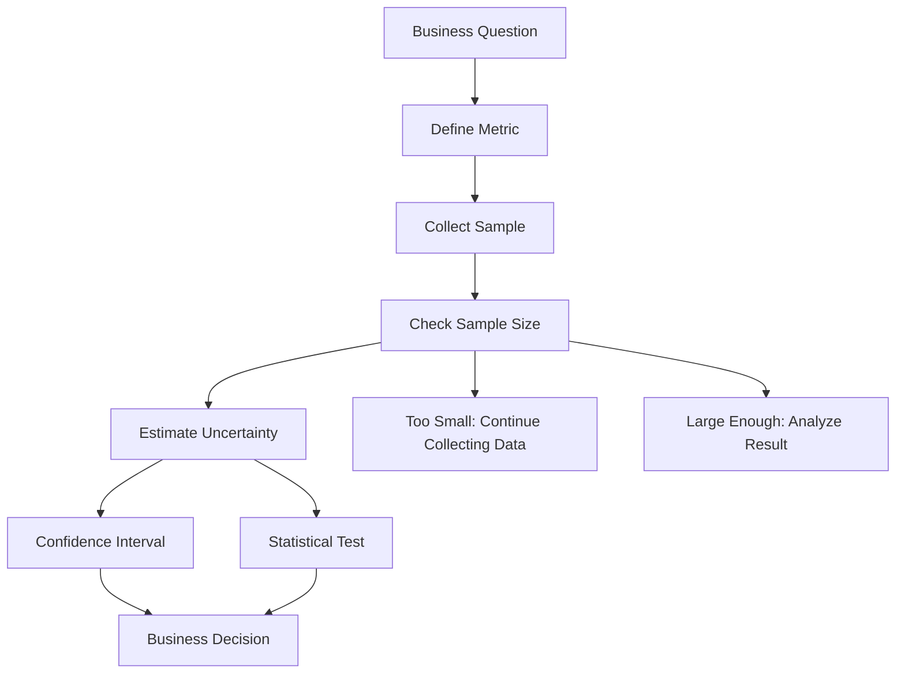
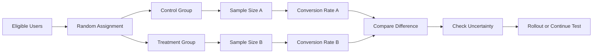

# 018 - Sample Size

**Course:** 01 - Math, Statistics and Econometrics
**Module:** Module 02 - Statistics
**Content Group:** Probability and Sampling
**Roadmap Source:** Statistics / Probability and Sampling
**Lesson Type:** Statistics
**Order in Module:** 018
**Suggested Duration:** 24 minutes

---

## 1. Summary

**Sample Size** refers to the number of observations included in a sample.

In AI and Data Science, sample size is important because it affects how reliable, stable, and trustworthy a metric, experiment, or model evaluation result is.

A small sample may produce noisy or misleading results. A larger sample usually reduces random uncertainty, but it does not automatically remove bias.

Sample size helps answer questions such as:

* Is this metric reliable enough to support a decision?
* Do we have enough users for an A/B test?
* Is the model evaluation result stable?
* How much uncertainty exists in the estimate?
* Should we continue collecting data before making a decision?

After this lesson, you should understand how sample size connects to uncertainty, statistical tests, confidence intervals, A/B testing, and business impact.

---

## 2. Learning Objectives

By the end of this lesson, you should be able to:

* Explain **Sample Size** in your own words.
* Understand why sample size affects uncertainty.
* Recognize when a sample is too small for a reliable conclusion.
* Explain the difference between sample size and sampling bias.
* Connect sample size to A/B testing and model evaluation.
* Apply sample size reasoning to a dataset, notebook, chart, experiment, model, or portfolio artifact.

---

## 3. Key Concepts

### 3.1 Sample Size

**Sample size** is the number of observations used in an analysis.

```text
Sample size = n
```

Example:

```text
A/B test group: 5,000 users
Sample size: n = 5,000
```

---

### 3.2 Population vs Sample

| Concept         | Meaning                                  | Example               |
| --------------- | ---------------------------------------- | --------------------- |
| **Population**  | The full group you want to understand    | All app users         |
| **Sample**      | A subset of the population               | 10,000 selected users |
| **Sample Size** | The number of observations in the sample | n = 10,000            |

---

### 3.3 Why Sample Size Matters

Sample size affects the stability of estimates.

```text
Small sample size  -> high uncertainty
Large sample size  -> lower uncertainty
```

However:

```text
Large sample size does not guarantee an unbiased sample.
```

A large biased sample can still produce the wrong conclusion.

---

## 4. Why Sample Size Matters in AI and Data Science

Sample size matters because data scientists often make decisions from incomplete data.

It affects:

* Conversion rate estimates
* Average revenue estimates
* Survey results
* A/B testing decisions
* Model accuracy estimates
* Error rate estimates
* Production monitoring metrics
* Business rollout decisions

A good data scientist does not only ask:

```text
What is the metric?
```

They also ask:

```text
How many observations produced this metric?
How uncertain is this estimate?
Is the sample large enough for this decision?
```

---

## 5. Sample Size Workflow

```text
Business Question
        |
        v
Define Metric
        |
        v
Collect Sample
        |
        v
Check Sample Size
        |
        v
Estimate Uncertainty
        |
        v
Run Statistical Test
        |
        v
Make Decision
```

---

## 6. Mermaid Diagram: Sample Size and Decision-Making



---

## 7. Simple Example

### Question

```text
What is the conversion rate of the new checkout page?
```

### Small Sample

```text
20 users
2 conversions
Conversion rate = 10%
```

This looks strong, but the sample is very small.

A few extra conversions or non-conversions could change the result a lot.

---

### Larger Sample

```text
10,000 users
800 conversions
Conversion rate = 8%
```

This estimate is more stable because it is based on more observations.

---

## 8. Sample Size and Uncertainty

Sample size is directly related to uncertainty.

When sample size increases, random variation usually decreases.

```text
n = 50      -> estimate may be very unstable
n = 500     -> estimate becomes more stable
n = 5,000   -> estimate becomes even more stable
n = 50,000  -> estimate is usually much more precise
```

But sample size alone is not enough.

You still need to check:

* Sampling bias
* Data quality
* Missing values
* Measurement errors
* Segment representation
* Business relevance

---

## 9. Important Formulas

### 9.1 Sample Mean

The sample mean estimates the average value of a population.

$$
\bar{x} = \frac{1}{n}\sum_{i=1}^{n}x_i
$$

Where:

* $\bar{x}$ = sample mean
* $n$ = sample size
* $x_i$ = each observation

---

### 9.2 Standard Error of the Mean

Standard error measures how much the sample mean may vary across different samples.

$$
SE = \frac{s}{\sqrt{n}}
$$

Where:

* $SE$ = standard error
* $s$ = sample standard deviation
* $n$ = sample size

Important idea:

```text
As n increases, SE decreases.
```

---

### 9.3 Sample Proportion

For binary outcomes such as conversion, click, churn, or success:

$$
\hat{p} = \frac{x}{n}
$$

Where:

* $\hat{p}$ = sample proportion
* $x$ = number of successes
* $n$ = sample size

Example:

```text
400 conversions out of 10,000 users

p_hat = 400 / 10000 = 0.04

Conversion rate = 4%
```

---

### 9.4 Standard Error of a Proportion

For conversion rate or click-through rate:

$$
SE = \sqrt{\frac{\hat{p}(1-\hat{p})}{n}}
$$

This formula is commonly used in A/B testing and product analytics.

---

## 10. Sample Size in A/B Testing

Sample size is critical in A/B testing.

```text
Users
  |
  |-- Group A: Control
  |
  |-- Group B: Treatment
```

Each group needs enough users to detect a meaningful difference.

Example:

```text
Control group: 500 users
Treatment group: 500 users
```

This may be too small if the expected improvement is tiny.

---

### Example: Small Effect Needs Large Sample

Suppose the current conversion rate is:

```text
Control conversion rate = 4.0%
```

You want to detect an increase to:

```text
Treatment conversion rate = 4.2%
```

The difference is only:

```text
0.2 percentage points
```

This small difference usually requires a large sample size to detect reliably.

---

## 11. Mermaid Diagram: Sample Size in A/B Testing



---

## 12. Minimum Detectable Effect

**Minimum Detectable Effect**, or **MDE**, is the smallest effect size you want to detect.

Example:

```text
Current conversion rate: 4.0%
Minimum Detectable Effect: +0.5 percentage points
Target detectable rate: 4.5%
```

Smaller MDE requires larger sample size.

```text
Large effect  -> smaller sample size may be enough
Small effect  -> larger sample size is needed
```

---

## 13. Statistical Power

**Statistical power** is the probability that a test detects a real effect when the effect truly exists.

In A/B testing, common power is often:

```text
80%
```

This means the test has a good chance of detecting the effect if the effect is real.

Low power can cause false negatives.

```text
Real improvement exists, but the test fails to detect it.
```

---

## 14. Sample Size vs Sampling Bias

Sample size and sampling bias are different problems.

| Issue             | Meaning                              | Can Larger Sample Help? |
| ----------------- | ------------------------------------ | ----------------------- |
| Small sample size | Too few observations                 | Usually yes             |
| High uncertainty  | Estimate is unstable                 | Usually yes             |
| Sampling bias     | Sample does not represent population | Not necessarily         |

Important warning:

```text
A bigger biased sample can make you more confident in the wrong answer.
```

---

## 15. Example: Large but Biased Sample

```text
Question:
What do all users think about the product?

Sample:
100,000 responses from only highly active users.
```

The sample size is large.

But the sample may exclude:

* New users
* Inactive users
* Churned users
* Dissatisfied users
* Users who had technical issues

Better conclusion:

```text
The result reflects highly active users, not necessarily all users.
```

---

## 16. Sample Size in Model Evaluation

Model evaluation also depends on sample size.

Example:

```text
Test set size = 100 images
Model accuracy = 95%
```

This means the model got 95 images correct.

But with only 100 images, the result may be unstable.

A better evaluation may require:

* More test samples
* More rare cases
* More edge cases
* Balanced class representation
* Production-like data
* Segment-level evaluation

---

## 17. Example: Class Imbalance and Sample Size

Suppose a dataset has rare fraud cases.

```text
Total transactions: 100,000
Fraud cases: 100
Non-fraud cases: 99,900
```

Even though the total sample size is large, the number of fraud examples is small.

This can hurt model training and evaluation.

Important:

```text
Overall sample size is not enough.
You also need enough samples per important class or segment.
```

---

## 18. Practical Demo

### Business Question

```text
Did the new checkout page improve conversion rate?
```

### Dataset

```text
Control group: 5,000 users, 200 conversions
Treatment group: 5,000 users, 230 conversions
```

### Metrics

```text
Control conversion rate = 200 / 5000 = 4.0%
Treatment conversion rate = 230 / 5000 = 4.6%
Difference = 0.6 percentage points
```

### Interpretation

The treatment group has a higher observed conversion rate.

However, before making a rollout decision, we need to ask:

```text
Is the sample size large enough?
How uncertain is the difference?
Could the difference be due to random variation?
Is the difference meaningful for the business?
```

---

## 19. Practical Exercise

### Task 1: Create a Simulated Dataset

Create a dataset with:

* `user_id`
* `group`
* `converted`
* `country`
* `device_type`

Example:

```text
user_id | group     | converted | country | device_type
1       | control   | 0         | VN      | mobile
2       | treatment | 1         | VN      | desktop
3       | control   | 0         | US      | mobile
```

---

### Task 2: Compare Different Sample Sizes

Create samples with different sizes:

```text
n = 50
n = 500
n = 5,000
n = 50,000
```

For each sample, calculate:

* Conversion rate
* Standard error
* Confidence interval
* Difference from the true population rate

---

### Task 3: Write a Business Conclusion

Example:

```text
The smaller samples produce unstable conversion estimates, while larger samples produce more stable estimates. However, sample size alone does not guarantee correctness if the sample is biased.
```

---

## 20. Notebook Idea

Build a notebook called:

```text
sample_size_uncertainty_demo.ipynb
```

Notebook sections:

1. Create a fake population.
2. Define a true conversion rate.
3. Draw samples of different sizes.
4. Calculate sample conversion rates.
5. Plot how estimates vary.
6. Calculate standard error.
7. Write a business recommendation.

Expected learning:

```text
Larger samples usually produce more stable estimates, but bias must still be checked.
```

---

## 21. Common Mistakes

### Mistake 1: Making Decisions from Tiny Samples

Example:

```text
10 users tested the feature.
2 users converted.
Conversion rate = 20%.
```

This is not enough evidence for a strong business decision.

---

### Mistake 2: Thinking Big Data Always Means Good Data

Large datasets can still be biased, incomplete, or poorly measured.

```text
Big data does not automatically mean good data.
```

---

### Mistake 3: Ignoring Segment-Level Sample Size

Overall sample size may look large, but some segments may be too small.

Example:

```text
Total users: 100,000
Users from one important region: 50
```

The regional result may not be reliable.

---

### Mistake 4: Confusing Statistical Significance with Business Significance

A huge sample can make a tiny difference statistically significant.

Example:

```text
Conversion increased from 4.000% to 4.005%.
```

This may not matter for the business.

---

### Mistake 5: Stopping an Experiment Too Early

Early results may look strong because of random variation.

Example:

```text
Day 1 result: Treatment is winning.
Day 7 result: No meaningful difference.
```

Do not stop an experiment before reaching the planned sample size unless there is a clear rule.

---

## 22. Checklist for Completion

You have completed this lesson if:

* [ ] You can explain **Sample Size** in 1-2 minutes.
* [ ] You understand why sample size affects uncertainty.
* [ ] You can explain the relationship between sample size and standard error.
* [ ] You know why larger sample size does not automatically remove bias.
* [ ] You can connect sample size to A/B testing.
* [ ] You can connect sample size to model evaluation.
* [ ] You can identify when segment-level sample size is too small.
* [ ] You have created a notebook, query, chart, model, API, or practice note for this lesson.
* [ ] You have written at least one caveat, assumption, or follow-up question.

---

## 23. Related Outcome

Use probability, sampling, descriptive statistics, hypothesis testing, and A/B testing to make decisions from data.

---

## 24. Related Project

### Mini Project: A/B Test Conversion Rate

Build a small A/B testing analysis project with a sample size check.

Required components:

* Conversion metric
* Control group and treatment group
* Sample size per group
* Minimum detectable effect
* Standard error
* Confidence interval
* Hypothesis test
* Business recommendation

Example final recommendation:

```text
The treatment group has a higher observed conversion rate, but the experiment should continue until the planned sample size is reached. The current result may still be affected by random variation.
```

---

## 25. Portfolio Artifact Ideas

You can turn this lesson into:

* A Jupyter Notebook showing sample size and uncertainty
* A chart comparing estimates from different sample sizes
* A dashboard showing confidence intervals
* A SQL query that checks sample size by segment
* An A/B testing sample size report
* A model evaluation reliability note
* A blog post about why sample size matters
* A portfolio case study on experiment design

---

## 26. Final Summary

**Sample Size** is a core concept in statistics, AI, and Data Science. It determines how much data is used to estimate a metric, evaluate a model, or support a business decision.

A larger sample size usually reduces random uncertainty, but it does not automatically solve sampling bias or poor data quality.

A strong data scientist does not only ask:

```text
What is the result?
```

They also ask:

```text
How many observations support this result?
Is the sample size large enough?
How uncertain is the estimate?
Are important segments represented?
Does the result matter for the business?
```

Sample size is not just a number. It is a key part of trustworthy decision-making.
