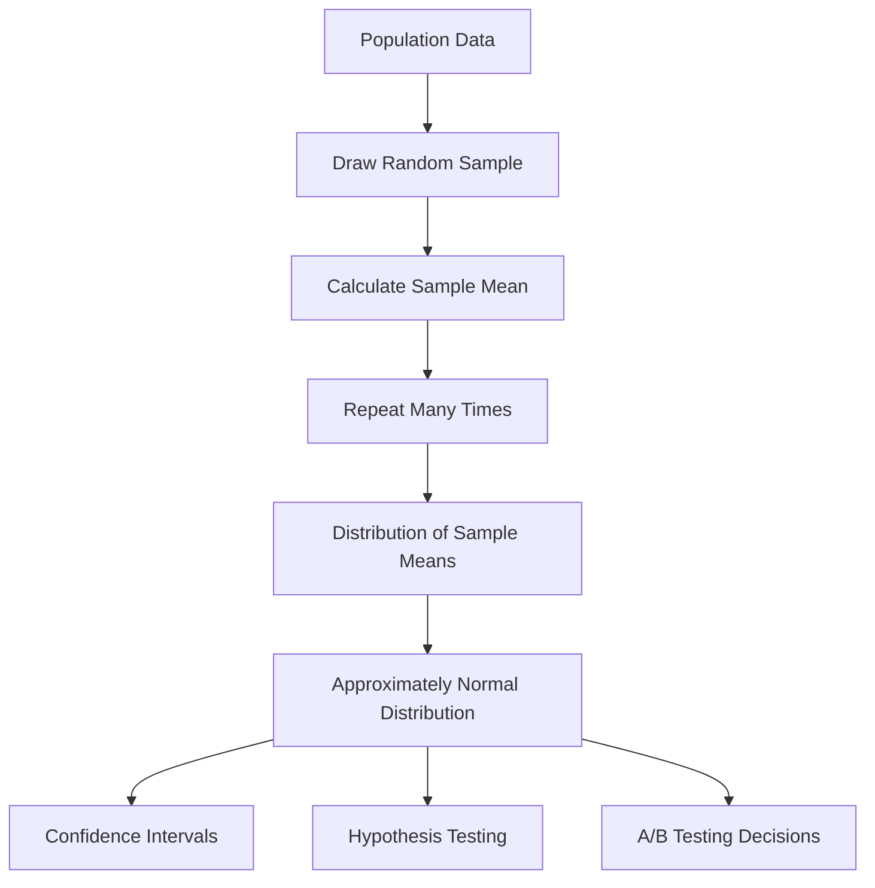

# 019 - Central Limit Theorem

**Course:** 01 - Math, Statistics and Econometrics
**Module:** Module 02 - Statistics
**Content Group:** Probability and Sampling
**Roadmap Source:** Statistics / Probability and Sampling
**Lesson Type:** Statistics
**Order in Module:** 019
**Suggested Duration:** 24 minutes

---

## 1. Summary

The **Central Limit Theorem**, often abbreviated as **CLT**, is one of the most important ideas in statistics.

It explains why the **average of many random samples** often follows a **normal distribution**, even when the original data does not look normal.

In AI and Data Science, the Central Limit Theorem helps answer questions such as:

* How reliable is a sample metric?
* How much uncertainty is there around an estimate?
* Can we build a confidence interval?
* Can we run a hypothesis test?
* Can we compare two groups in an A/B test?

After this lesson, you should understand why CLT is important for sampling, uncertainty estimation, confidence intervals, hypothesis testing, and business decision-making from data.

---

## 2. Learning Objectives

By the end of this lesson, you should be able to:

* Explain the **Central Limit Theorem** in your own words.
* Understand why sample means become approximately normal as sample size increases.
* Connect CLT to confidence intervals, hypothesis testing, and A/B testing.
* Identify where CLT appears in an AI/Data Science workflow.
* Apply CLT concepts to a small dataset, notebook, chart, experiment, or portfolio artifact.

---

## 3. Core Idea

The **Central Limit Theorem** says:

> If we repeatedly take random samples from a population and calculate the mean of each sample, the distribution of those sample means will become approximately normal as the sample size becomes large.

This is true even if the original population distribution is not normal, as long as some key assumptions are reasonably satisfied.

---

## 4. Intuition

Imagine a population with a strange distribution.

For example, customer spending may be highly skewed:

```text
Most customers spend a little.
A few customers spend a lot.
```

The original data may look like this:

```text
Population data
Low values:  ███████████████████
High values: ██
Very high:   █
```

Now suppose we repeatedly take samples and calculate the average spending in each sample.

As sample size increases, the distribution of sample averages becomes smoother and more bell-shaped.

```text
Sample means
        █
      █████
    █████████
  █████████████
█████████████████
```

This bell-shaped pattern is the key idea behind the Central Limit Theorem.

---

## 5. Simple Workflow

```text
Population
    ↓
Take many random samples
    ↓
Calculate sample mean for each sample
    ↓
Build distribution of sample means
    ↓
Sample means approach a normal distribution
    ↓
Estimate uncertainty and make statistical decisions
```

---

## 6. Mermaid Diagram



---

## 7. Key Formula

Let:

* ( \mu ) = population mean
* ( \sigma ) = population standard deviation
* ( n ) = sample size
* ( \bar{x} ) = sample mean

According to the Central Limit Theorem:

$$
\bar{x} \approx N\left(\mu, \frac{\sigma}{\sqrt{n}}\right)
$$

This means the sample mean is approximately normally distributed with:

$$
\text{Mean of sample means} = \mu
$$

$$
\text{Standard error} = \frac{\sigma}{\sqrt{n}}
$$

---

## 8. Standard Error

The **standard error** measures how much the sample mean varies from sample to sample.

$$
SE = \frac{\sigma}{\sqrt{n}}
$$

As sample size increases, standard error decreases.

|  Sample Size |      Standard Error |
| -----------: | ------------------: |
| Small sample |  Larger uncertainty |
| Large sample | Smaller uncertainty |

This is why larger samples usually produce more stable estimates.

---

## 9. Why CLT Matters in AI and Data Science

The Central Limit Theorem is important because many real-world decisions are made from samples, not full populations.

In AI and Data Science, CLT is used in:

| Area                   | How CLT Helps                                                |
| ---------------------- | ------------------------------------------------------------ |
| Descriptive statistics | Understand uncertainty around sample metrics                 |
| A/B testing            | Compare conversion rates, revenue, or engagement             |
| Hypothesis testing     | Decide whether observed differences are likely due to chance |
| Confidence intervals   | Estimate a range for the true population value               |
| Model evaluation       | Measure uncertainty in accuracy, precision, recall, or loss  |
| Business analytics     | Support data-driven decisions from limited data              |

---

## 10. Example: A/B Testing

Suppose a company tests two versions of a landing page.

| Group | Users | Conversions | Conversion Rate |
| ----- | ----: | ----------: | --------------: |
| A     | 1,000 |         100 |             10% |
| B     | 1,000 |         120 |             12% |

The business question is:

> Is version B truly better, or did it only look better because of random sampling?

CLT helps us estimate the uncertainty around each conversion rate.

Then we can use a statistical test to decide whether the difference is likely meaningful.

```text
Question
   ↓
Sample users
   ↓
Measure conversion rate
   ↓
Estimate uncertainty
   ↓
Run hypothesis test
   ↓
Make rollout decision
```

---

## 11. Mini Demo Concept

Suppose the original population is not normal.

For example, income, spending, session duration, and transaction value are often skewed.

```text
Original population:
Right-skewed, not normal
```

But if we repeatedly sample users and calculate the average value:

```text
Sample mean distribution:
Approximately normal when sample size is large
```

This allows us to use normal-based methods such as:

* Confidence intervals
* Z-tests
* T-tests
* A/B test analysis

---

## 12. Important Assumptions

The Central Limit Theorem works best when:

| Assumption               | Meaning                                                          |
| ------------------------ | ---------------------------------------------------------------- |
| Random sampling          | The sample should represent the population fairly                |
| Independent observations | One data point should not strongly depend on another             |
| Large enough sample size | Larger samples make the normal approximation better              |
| Finite variance          | The data should not have infinite or extremely unstable variance |

A common rule of thumb is:

$$
n \geq 30
$$

However, this is only a rough guideline.

If the population is extremely skewed or has many outliers, a larger sample size may be needed.

---

## 13. What CLT Does Not Fix

The Central Limit Theorem is powerful, but it does not solve every problem.

CLT does **not** fix:

* Biased sampling
* Bad experiment design
* Missing data problems
* Confounding variables
* Data leakage
* Poor metric definition
* Multiple comparison issues
* Business interpretation mistakes

For example:

```text
Large biased sample ≠ good sample
```

A large sample can still lead to a wrong conclusion if the sampling process is biased.

---

## 14. CLT vs Law of Large Numbers

The **Law of Large Numbers** and the **Central Limit Theorem** are related, but they answer different questions.

| Concept               | Main Question                                                          |
| --------------------- | ---------------------------------------------------------------------- |
| Law of Large Numbers  | Does the sample mean get closer to the true mean as sample size grows? |
| Central Limit Theorem | What does the distribution of sample means look like?                  |

In simple terms:

```text
Law of Large Numbers:
Sample mean becomes more accurate.

Central Limit Theorem:
Sample mean becomes approximately normal.
```

---

## 15. Practical Exercise

Create a small simulation notebook.

### Step 1: Generate a skewed dataset

Example:

```python
import numpy as np

population = np.random.exponential(scale=10, size=100000)
```

### Step 2: Take many random samples

```python
sample_means = []

for _ in range(1000):
    sample = np.random.choice(population, size=30)
    sample_means.append(sample.mean())
```

### Step 3: Plot the sample means

```python
import matplotlib.pyplot as plt

plt.hist(sample_means, bins=30)
plt.title("Distribution of Sample Means")
plt.xlabel("Sample Mean")
plt.ylabel("Frequency")
plt.show()
```

### Step 4: Interpret the result

Write a short business conclusion:

```text
Although the original population is skewed, the distribution of sample means becomes approximately normal. This allows us to estimate uncertainty around the average and build confidence intervals for decision-making.
```

---

## 16. Common Mistakes

### Mistake 1: Thinking CLT means all data becomes normal

CLT does not say the original data becomes normal.

It says the **distribution of sample means** becomes approximately normal.

---

### Mistake 2: Ignoring sample bias

A large sample is not useful if the data collection process is biased.

Example:

```text
Surveying only active users may not represent all users.
```

---

### Mistake 3: Using CLT with very small samples

Small samples may not provide a good normal approximation, especially when the original data is highly skewed.

---

### Mistake 4: Confusing statistical significance with business significance

A result can be statistically significant but still too small to matter in business.

Example:

```text
Conversion rate improves from 10.00% to 10.05%.
Statistically significant? Maybe.
Business meaningful? Maybe not.
```

---

### Mistake 5: Forgetting multiple comparisons

If many tests are performed at once, some results may look significant by chance.

---

## 17. AI/Data Science Workflow Connection

```text
Business Question
      ↓
Collect Sample Data
      ↓
Calculate Metric
      ↓
Estimate Uncertainty
      ↓
Apply CLT-Based Reasoning
      ↓
Confidence Interval or Hypothesis Test
      ↓
Decision or Recommendation
```

Examples:

| Workflow Stage   | CLT Connection                                 |
| ---------------- | ---------------------------------------------- |
| Data collection  | Need representative samples                    |
| EDA              | Understand metric variability                  |
| Experimentation  | Estimate treatment effect uncertainty          |
| Model evaluation | Estimate confidence around performance metrics |
| Reporting        | Communicate uncertainty to stakeholders        |
| Deployment       | Decide whether changes are safe to roll out    |

---

## 18. Portfolio Artifact Idea

Create a notebook titled:

```text
Central Limit Theorem Simulation for A/B Testing
```

Your notebook should include:

* A skewed population distribution
* Repeated random sampling
* Distribution of sample means
* Standard error calculation
* Confidence interval example
* Business interpretation
* Caveats and assumptions

Suggested chart:

```text
Chart 1: Original skewed population
Chart 2: Distribution of sample means
Chart 3: Standard error decreases as sample size increases
```

---

## 19. Completion Checklist

* [ ] I can explain the **Central Limit Theorem** in 1-2 minutes.
* [ ] I understand that CLT applies to sample means, not necessarily the original data.
* [ ] I know why sample size affects uncertainty.
* [ ] I can explain standard error.
* [ ] I can connect CLT to confidence intervals and hypothesis testing.
* [ ] I can apply CLT to an A/B testing example.
* [ ] I have created a notebook, query, chart, model, API, or practical note for this lesson.
* [ ] I have written down at least one assumption, caveat, or follow-up question.

---

## 20. Related Outcome

Use probability, sampling, descriptive statistics, hypothesis testing, and A/B testing to make decisions from data.

---

## 21. Related Project

### Mini Project: A/B Test Conversion Rate

Build a small A/B testing project with:

* Conversion metric
* Control group and treatment group
* Sample size explanation
* Confidence interval
* Hypothesis test
* Rollout recommendation
* Business conclusion

Example final recommendation:

```text
Version B shows a higher conversion rate than Version A. However, the confidence interval and hypothesis test should be reviewed before rollout. If the improvement is statistically significant and business meaningful, Version B can be gradually deployed to more users.
```

---

## 22. Final Summary

The **Central Limit Theorem** is a key concept in the AI and Data Scientist roadmap.

It explains why sample averages often become approximately normal as sample size increases.

This idea supports many practical tools in data work, including:

* Confidence intervals
* Hypothesis testing
* A/B testing
* Metric uncertainty
* Model evaluation
* Business decision-making

The most important lesson is:

> CLT helps us reason about uncertainty, but it does not replace good sampling, good experiment design, or good business judgment.

Turn this lesson into a notebook, chart, experiment, dashboard, API, Docker service, or portfolio note so the concept becomes practical and reusable.

---

# Bài luyện tập

## Mục tiêu


## Đề bài


## Yêu cầu hoàn thành

- [ ] 
- [ ] 
- [ ] 

## Kết quả / lời giải


## Ghi chú
