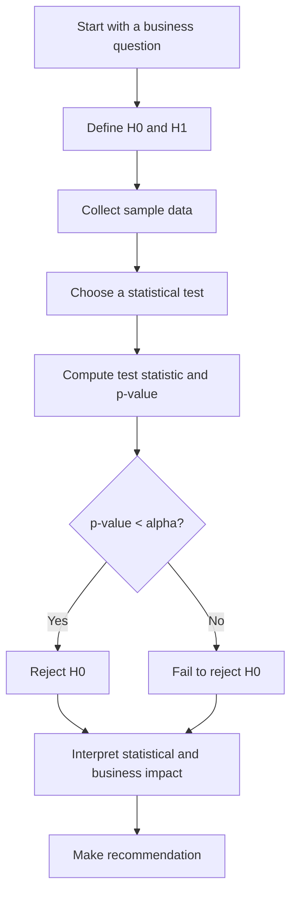
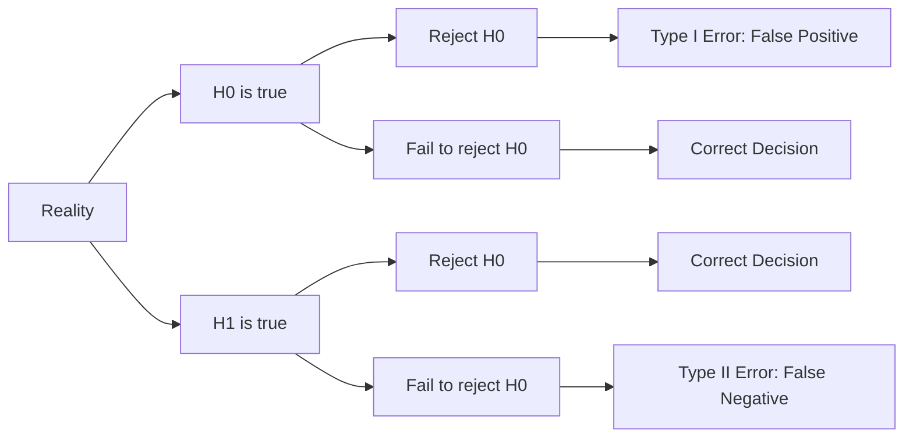

# 020 - Hypothesis Testing

**Course:** 01 - Math, Statistics and Econometrics
**Module:** Module 02 - Statistics
**Content Group:** Testing and Experiments
**Roadmap Source:** Statistics / Testing and Experiments
**Lesson Type:** Statistics
**Order in Module:** 020
**Suggested Duration:** 24 minutes

---

## 1. Summary

**Hypothesis Testing** is a statistical method used to decide whether an observed pattern, difference, or effect in data is likely to be real or simply caused by random chance.

In AI and Data Science, hypothesis testing helps answer questions such as:

* Did the new recommendation model improve click-through rate?
* Is conversion rate higher in version B than version A?
* Is the model accuracy improvement statistically meaningful?
* Did a product change increase user engagement?
* Is the difference between two groups large enough to support a decision?

After this lesson, you should understand how hypothesis testing supports data-driven decision making, A/B testing, model comparison, experiment analysis, and business recommendations.

---

## 2. Learning Objectives

By the end of this lesson, you should be able to:

* Explain **Hypothesis Testing** in your own words.
* Define the **null hypothesis** and **alternative hypothesis**.
* Interpret **p-value**, **significance level**, **confidence interval**, and **effect size**.
* Understand **Type I error** and **Type II error**.
* Apply hypothesis testing to a small dataset or A/B testing scenario.
* Write a business conclusion based on statistical results.

---

## 3. Main Idea

Hypothesis testing starts with a question:

> Is the observed difference real, or could it happen by chance?

For example:

```text
Group A conversion rate = 10%
Group B conversion rate = 12%

Question:
Is B truly better than A, or is this just random variation?
```

Hypothesis testing gives us a structured way to evaluate this question.

---

## 4. Key Concepts

### 4.1 Null Hypothesis

The **null hypothesis** is the default assumption.

It usually says that there is:

* no difference,
* no effect,
* no improvement,
* no relationship.

Notation:

```text
H0
```

Example:

```text
H0: conversion_A = conversion_B
```

This means:

> Version A and version B have the same conversion rate.

---

### 4.2 Alternative Hypothesis

The **alternative hypothesis** is what we want to test for.

It says that there is a difference or effect.

Notation:

```text
H1 or Ha
```

Example:

```text
H1: conversion_A != conversion_B
```

This means:

> Version A and version B have different conversion rates.

---

## 5. Hypothesis Testing Workflow



---

## 6. Example: A/B Test Conversion Rate

Suppose a company tests two landing pages.

| Group | Visitors | Conversions | Conversion Rate |
| ----- | -------: | ----------: | --------------: |
| A     |    1,000 |         100 |             10% |
| B     |    1,000 |         120 |             12% |

The observed difference is:

```text
12% - 10% = 2 percentage points
```

Now we need to ask:

> Is this 2% increase statistically significant?

---

## 7. Hypotheses

For a two-sided test:

```text
H0: conversion_A = conversion_B
H1: conversion_A != conversion_B
```

For a one-sided test:

```text
H0: conversion_B <= conversion_A
H1: conversion_B > conversion_A
```

Use a **two-sided test** when you want to detect any difference.
Use a **one-sided test** when you only care whether one version is better.

---

## 8. Important Terms

### 8.1 Significance Level

The **significance level** is the threshold used to decide whether the result is statistically significant.

Common value:

```text
alpha = 0.05
```

This means we accept a 5% risk of rejecting the null hypothesis when it is actually true.

---

### 8.2 p-value

The **p-value** tells us how likely it is to observe a result this extreme if the null hypothesis is true.

Simple interpretation:

```text
Small p-value = observed result is unlikely under H0
Large p-value = observed result could easily happen by chance
```

Decision rule:

```text
If p-value < alpha:
    Reject H0

If p-value >= alpha:
    Fail to reject H0
```

---

### 8.3 Confidence Interval

A **confidence interval** gives a range of plausible values for the true effect.

Example:

```text
Difference in conversion rate = 2%
95% CI = [0.3%, 3.7%]
```

Interpretation:

> The true improvement is likely between 0.3% and 3.7%.

If the confidence interval does not include `0`, the result is often statistically significant.

---

### 8.4 Effect Size

**Effect size** measures how large the difference is.

Statistical significance only tells us whether the result is unlikely to be caused by chance.
Effect size tells us whether the result is meaningful.

Example:

```text
Conversion increased from 10% to 10.1%
p-value = 0.01
```

This result may be statistically significant, but the business impact might be small.

---

## 9. Statistical Significance vs Business Significance

| Concept                  | Meaning                              | Question                       |
| ------------------------ | ------------------------------------ | ------------------------------ |
| Statistical significance | The result is unlikely due to chance | Is the effect real?            |
| Business significance    | The effect is useful or valuable     | Is the effect worth acting on? |

A result can be statistically significant but not useful for business.

Example:

```text
A model improves accuracy from 92.00% to 92.05%.
```

This may be statistically significant with a large dataset, but the improvement may not justify deployment cost.

---

## 10. Type I and Type II Errors

### 10.1 Type I Error

A **Type I error** happens when we reject the null hypothesis even though it is true.

```text
False positive
```

Example:

> We conclude that version B is better, but in reality, it is not.

---

### 10.2 Type II Error

A **Type II error** happens when we fail to reject the null hypothesis even though the alternative hypothesis is true.

```text
False negative
```

Example:

> Version B is actually better, but we fail to detect the improvement.

---

## 11. Error Trade-off Diagram



---

## 12. Common Statistical Tests

| Scenario                                        | Common Test                              |
| ----------------------------------------------- | ---------------------------------------- |
| Compare two means                               | t-test                                   |
| Compare two proportions                         | z-test for proportions                   |
| Compare more than two groups                    | ANOVA                                    |
| Test relationship between categorical variables | Chi-square test                          |
| Compare model performance                       | Paired test, bootstrap, permutation test |

---

## 13. Formula Example: Test Statistic

A general test statistic has the form:

```text
test statistic = observed effect / standard error
```

For example:

```text
z = (p_B - p_A) / SE
```

Where:

```text
p_A = conversion rate of group A
p_B = conversion rate of group B
SE  = standard error
```

The larger the test statistic, the stronger the evidence against the null hypothesis.

---

## 14. AI and Data Science Applications

Hypothesis testing is useful in many AI and Data Science workflows.

### Product Experimentation

* A/B testing landing pages
* Testing recommendation algorithms
* Measuring conversion changes
* Comparing user engagement between features

### Machine Learning

* Comparing model accuracy
* Testing whether feature engineering improves performance
* Checking if a new model significantly reduces error
* Evaluating online model deployment impact

### Business Analytics

* Comparing customer segments
* Measuring campaign effectiveness
* Testing pricing changes
* Evaluating retention strategies

---

## 15. Practical Demo

Example:

```text
H0: conversion_A = conversion_B
H1: conversion_A != conversion_B

Group A:
Visitors = 1000
Conversions = 100
Conversion rate = 10%

Group B:
Visitors = 1000
Conversions = 120
Conversion rate = 12%

Observed difference:
12% - 10% = 2%

Check:
- p-value
- confidence interval
- effect size
- sample size
- business impact
```

Possible conclusion:

```text
Version B has a higher observed conversion rate than version A.
If the p-value is below 0.05 and the confidence interval does not include 0,
we may conclude that the improvement is statistically significant.

However, before rollout, we should also check whether the 2 percentage point
increase is large enough to justify implementation cost and business risk.
```

---

## 16. Mini Python Example

```python
import numpy as np
from statsmodels.stats.proportion import proportions_ztest

# Data
conversions = np.array([100, 120])
visitors = np.array([1000, 1000])

# Two-proportion z-test
z_stat, p_value = proportions_ztest(conversions, visitors)

print("Z-statistic:", z_stat)
print("P-value:", p_value)

alpha = 0.05

if p_value < alpha:
    print("Reject H0: The conversion rates are significantly different.")
else:
    print("Fail to reject H0: Not enough evidence of a significant difference.")
```

---

## 17. Practical Exercise

Create a small simulated dataset and perform a hypothesis test.

### Task

Simulate an A/B test:

```text
Group A conversion rate: 10%
Group B conversion rate: 12%
Sample size per group: 1000
```

Then answer:

1. What are `H0` and `H1`?
2. What is the observed difference?
3. What is the p-value?
4. Is the result statistically significant?
5. Is the result meaningful for business?
6. What recommendation would you give?

---

## 18. Common Mistakes

### Mistake 1: Using Too Small a Sample Size

Small samples can produce unstable results.

```text
Bad conclusion:
B is better because 3 out of 10 users converted.
```

A small sample may not represent the real population.

---

### Mistake 2: Confusing Statistical Significance with Business Significance

A result can be statistically significant but too small to matter.

```text
p-value = 0.01
conversion increase = 0.05%
```

This may not be worth deploying.

---

### Mistake 3: Ignoring Bias

If the sample is biased, the test result may be misleading.

Example:

```text
Group A users are from mobile.
Group B users are from desktop.
```

The difference may be caused by device type, not the tested feature.

---

### Mistake 4: Ignoring Multiple Comparisons

If you test many hypotheses, some may appear significant by chance.

Example:

```text
Testing 100 button colors may produce false positives.
```

Use correction methods or validate results with another experiment.

---

### Mistake 5: Saying “Accept H0”

Usually, we do not say:

```text
Accept H0
```

A better phrase is:

```text
Fail to reject H0
```

This means we do not have enough evidence to reject the null hypothesis.

---

## 19. Checklist

Before finishing this lesson, make sure you can:

* [ ] Explain **Hypothesis Testing** in 1-2 minutes.
* [ ] Define `H0` and `H1`.
* [ ] Explain what a p-value means.
* [ ] Explain what a confidence interval means.
* [ ] Distinguish statistical significance from business significance.
* [ ] Identify Type I and Type II errors.
* [ ] Apply hypothesis testing to an A/B testing example.
* [ ] Write a business conclusion from statistical results.
* [ ] Mention at least one assumption, caveat, or limitation.

---

## 20. Portfolio Artifact

You can turn this lesson into a small portfolio project.

### Project: A/B Test Conversion Rate

Build a notebook that includes:

* Simulated A/B test dataset
* Conversion rate calculation
* Hypothesis definition
* Two-proportion z-test
* p-value interpretation
* Confidence interval
* Effect size
* Business recommendation
* Final rollout decision

Example project title:

```text
A/B Test Conversion Rate Analysis with Hypothesis Testing
```

---

## 21. Related Outcome

This lesson supports the following roadmap outcome:

> Use probability, sampling, descriptive statistics, hypothesis testing, and A/B testing to make decisions from data.

---

## 22. Final Summary

**Hypothesis Testing** is a core skill for AI and Data Scientists because it helps transform data into reliable decisions.

It helps answer:

```text
Is this result real, or could it happen by chance?
```

In practice, hypothesis testing is not only about calculating a p-value.
A good Data Scientist must also consider:

* sample size,
* uncertainty,
* assumptions,
* effect size,
* business impact,
* experiment design,
* and decision risk.

To make this topic practical, turn it into a notebook, chart, experiment report, API, dashboard, or portfolio case study.
