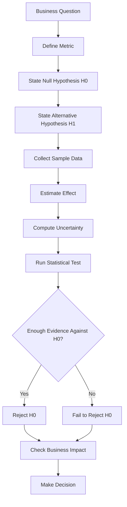
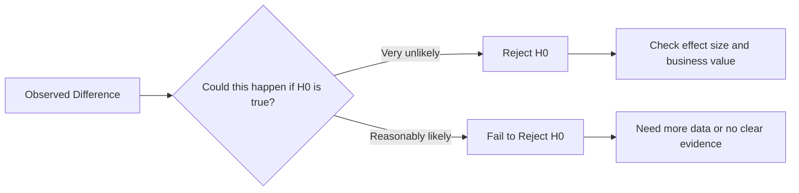

# 021 - Null Hypothesis

**Course:** 01 - Math, Statistics and Econometrics
**Module:** Module 02 - Statistics
**Content Group:** Testing and Experiments
**Roadmap Source:** Statistics / Testing and Experiments
**Lesson Type:** Statistics
**Order in Module:** 021
**Suggested Duration:** 24 minutes

---

## 1. Summary

The **Null Hypothesis** is the default assumption in hypothesis testing.

It usually says that there is:

* no difference,
* no effect,
* no improvement,
* no relationship,
* or no meaningful change.

In AI and Data Science, the null hypothesis helps us avoid making decisions based only on feelings, random noise, or misleading dashboard changes.

Instead of saying:

> “Version B looks better, so we should launch it.”

A Data Scientist asks:

> “Is there enough statistical evidence to reject the assumption that A and B are actually the same?”

---

## 2. Learning Objectives

By the end of this lesson, you should be able to:

* Explain **Null Hypothesis** in your own words.
* Understand why the null hypothesis is the starting point of hypothesis testing.
* Write a null hypothesis for an A/B test.
* Distinguish between the null hypothesis and the alternative hypothesis.
* Interpret test results using p-value, confidence interval, and business impact.
* Apply the concept to a dataset, experiment, model comparison, or product decision.

---

## 3. Main Idea

The null hypothesis is the “nothing changed” assumption.

In statistics, we do not start by assuming that our idea works.
We start by assuming that there is no real effect, then we check whether the data gives enough evidence against that assumption.

Simple idea:

```text
H0 = no effect / no difference / no improvement
H1 = there is an effect / difference / improvement
```

Example:

```text
H0: conversion_A = conversion_B
H1: conversion_A != conversion_B
```

This means:

> The null hypothesis says that version A and version B have the same conversion rate.

---

## 4. Why Null Hypothesis Matters

In real-world data, random variation happens all the time.

For example:

```text
Day 1: conversion rate = 10.1%
Day 2: conversion rate = 10.8%
Day 3: conversion rate = 9.7%
```

These changes may happen naturally, even when nothing important has changed.

The null hypothesis protects us from overreacting to noise.

It helps answer:

```text
Is this observed result strong enough to support a real conclusion?
```

---

## 5. Null Hypothesis in the Data Science Workflow



---

## 6. Null Hypothesis vs Alternative Hypothesis

| Concept                | Meaning                  | Example                              |
| ---------------------- | ------------------------ | ------------------------------------ |
| Null Hypothesis        | Default assumption       | The new feature has no effect        |
| Alternative Hypothesis | What we want to test     | The new feature changes conversion   |
| Notation               | `H0`                     | `H1` or `Ha`                         |
| Decision               | Reject or fail to reject | Supported only if evidence is strong |

---

## 7. Example: A/B Test Conversion Rate

Suppose a company tests two landing pages.

| Group | Visitors | Conversions | Conversion Rate |
| ----- | -------: | ----------: | --------------: |
| A     |    1,000 |         100 |             10% |
| B     |    1,000 |         120 |             12% |

At first glance, version B looks better.

But before launching B, we need to test whether the difference may be caused by random chance.

---

## 8. Define the Hypotheses

### Two-Sided Test

Use a two-sided test when you want to know whether there is any difference.

```text
H0: conversion_A = conversion_B
H1: conversion_A != conversion_B
```

Meaning:

```text
H0: A and B have the same conversion rate.
H1: A and B have different conversion rates.
```

---

### One-Sided Test

Use a one-sided test when you only care whether B is better than A.

```text
H0: conversion_B <= conversion_A
H1: conversion_B > conversion_A
```

Meaning:

```text
H0: B is not better than A.
H1: B is better than A.
```

---

## 9. Decision Logic

The null hypothesis is tested using a statistical test.

A common decision rule is:

```text
If p-value < alpha:
    Reject H0

If p-value >= alpha:
    Fail to reject H0
```

Usually:

```text
alpha = 0.05
```

This means we use a 5% significance level.

---

## 10. Important Interpretation

### Reject H0

If we reject the null hypothesis, it means:

```text
The data provides enough evidence against H0.
```

Example conclusion:

```text
The conversion rate of version B is significantly different from version A.
```

---

### Fail to Reject H0

If we fail to reject the null hypothesis, it means:

```text
The data does not provide enough evidence against H0.
```

It does **not** prove that H0 is true.

Better wording:

```text
We fail to reject H0.
```

Avoid saying:

```text
We accept H0.
```

---

## 11. Null Hypothesis and p-value

The p-value answers this question:

```text
If H0 were true, how likely would we be to observe a result this extreme?
```

Simple interpretation:

|         p-value | Meaning                                    |
| --------------: | ------------------------------------------ |
|   Small p-value | The observed result is unlikely under H0   |
|   Large p-value | The observed result could happen by chance |
|  p-value < 0.05 | Often considered statistically significant |
| p-value >= 0.05 | Not enough evidence to reject H0           |

---

## 12. Null Hypothesis and Confidence Interval

A confidence interval gives a range of plausible values for the true effect.

Example:

```text
Observed difference = 2 percentage points
95% CI = [0.3%, 3.7%]
```

Because the interval does not include `0`, the result may be statistically significant.

Another example:

```text
Observed difference = 2 percentage points
95% CI = [-0.5%, 4.5%]
```

Because the interval includes `0`, the true effect could be zero.
In this case, we may fail to reject the null hypothesis.

---

## 13. Visual Intuition



---

## 14. AI and Data Science Applications

The null hypothesis appears in many Data Science tasks.

### A/B Testing

```text
H0: conversion_A = conversion_B
```

Used to test whether a new feature, design, or recommendation system improves user behavior.

---

### Model Comparison

```text
H0: model_A_accuracy = model_B_accuracy
```

Used to test whether a new model actually performs better than the current model.

---

### Marketing Campaign Analysis

```text
H0: campaign has no effect on revenue
```

Used to check whether a campaign increased sales, retention, or engagement.

---

### Feature Engineering

```text
H0: the new feature does not improve model performance
```

Used to decide whether a new feature should be included in the model pipeline.

---

## 15. Practical Demo

```text
Question:
Does version B improve conversion rate compared with version A?

Metric:
Conversion rate

Sample:
A: 100 conversions / 1000 visitors = 10%
B: 120 conversions / 1000 visitors = 12%

Hypotheses:
H0: conversion_A = conversion_B
H1: conversion_A != conversion_B

Observed effect:
12% - 10% = 2 percentage points

Check:
- sample size
- p-value
- confidence interval
- effect size
- business impact
```

Possible conclusion:

```text
Version B has a higher observed conversion rate than version A.

However, we should not launch B only because the dashboard shows 12% vs 10%.
We need to test whether this difference is statistically significant and whether
the improvement is large enough to matter for the business.
```

---

## 16. Mini Python Example

```python
import numpy as np
from statsmodels.stats.proportion import proportions_ztest

# Conversion data
conversions = np.array([100, 120])
visitors = np.array([1000, 1000])

# Run two-proportion z-test
z_stat, p_value = proportions_ztest(conversions, visitors)

alpha = 0.05

print("Z-statistic:", z_stat)
print("P-value:", p_value)

if p_value < alpha:
    print("Reject H0: There is evidence that conversion rates are different.")
else:
    print("Fail to reject H0: There is not enough evidence of a difference.")
```

---

## 17. Common Mistakes

### Mistake 1: Thinking H0 Is Something We Want to Prove

The null hypothesis is not something we usually try to prove.

Instead, we test whether the data gives enough evidence to reject it.

---

### Mistake 2: Saying “Accept H0”

Avoid this wording:

```text
Accept H0
```

Use this instead:

```text
Fail to reject H0
```

Because failing to reject H0 does not mean H0 is definitely true.

---

### Mistake 3: Ignoring Sample Size

A small sample can make the result unstable.

Example:

```text
A: 1 conversion / 10 visitors = 10%
B: 2 conversions / 10 visitors = 20%
```

Version B looks much better, but the sample size is too small to make a reliable decision.

---

### Mistake 4: Ignoring Bias

If the experiment groups are not comparable, the conclusion may be wrong.

Example:

```text
Group A = mostly new users
Group B = mostly returning users
```

The difference may come from user type, not the tested feature.

---

### Mistake 5: Confusing Statistical Significance with Business Significance

A result can be statistically significant but not valuable.

Example:

```text
p-value = 0.01
conversion increase = 0.02%
```

This may not be worth engineering cost, design risk, or product complexity.

---

## 18. Practical Exercise

Create a small simulated A/B test dataset.

### Task

Use the following setup:

```text
Group A conversion rate: 10%
Group B conversion rate: 12%
Sample size per group: 1000
```

Answer these questions:

1. What is the null hypothesis?
2. What is the alternative hypothesis?
3. What is the observed difference?
4. What is the p-value?
5. Do you reject or fail to reject H0?
6. Is the result meaningful for business?
7. What rollout recommendation would you give?

---

## 19. Checklist

Before finishing this lesson, make sure you can:

* [ ] Explain **Null Hypothesis** in 1-2 minutes.
* [ ] Write `H0` for an A/B test.
* [ ] Write `H1` for an A/B test.
* [ ] Explain why we start with the assumption of no effect.
* [ ] Interpret p-value in relation to H0.
* [ ] Explain why “fail to reject H0” is better than “accept H0”.
* [ ] Connect null hypothesis to sample size, bias, uncertainty, and business impact.
* [ ] Apply the concept to a notebook, query, chart, model, API, or experiment report.
* [ ] Write at least one caveat, assumption, or follow-up question.

---

## 20. Portfolio Artifact

You can turn this lesson into a small portfolio artifact.

### Project: A/B Test Conversion Rate with Null Hypothesis

Build a notebook that includes:

* Business question
* Metric definition
* Null hypothesis
* Alternative hypothesis
* Simulated A/B test data
* Conversion rate calculation
* Statistical test
* p-value interpretation
* Confidence interval
* Business recommendation
* Final rollout decision

Example title:

```text
Testing a Null Hypothesis in an A/B Test Conversion Experiment
```

---

## 21. Related Outcome

This lesson supports the following roadmap outcome:

> Use probability, sampling, descriptive statistics, hypothesis testing, and A/B testing to make decisions from data.

---

## 22. Final Summary

The **Null Hypothesis** is the default assumption that there is no real effect, no difference, or no improvement.

It helps Data Scientists avoid jumping to conclusions from noisy data.

In practice, the null hypothesis supports decisions such as:

```text
Should we launch version B?
Is the new model actually better?
Did the campaign really increase revenue?
Is this result reliable or just random chance?
```

A good Data Scientist does not only ask whether the result is statistically significant.
They also check:

* sample size,
* bias,
* uncertainty,
* p-value,
* confidence interval,
* effect size,
* and business impact.

The null hypothesis is one of the most important foundations of experiment analysis and data-driven decision making.

---

# Bài luyện tập

## Mục tiêu


## Đề bài


## Yêu cầu hoàn thành

- [ ] 
- [ ] 
- [ ] 

## Kết quả / lời giải


## Ghi chú
