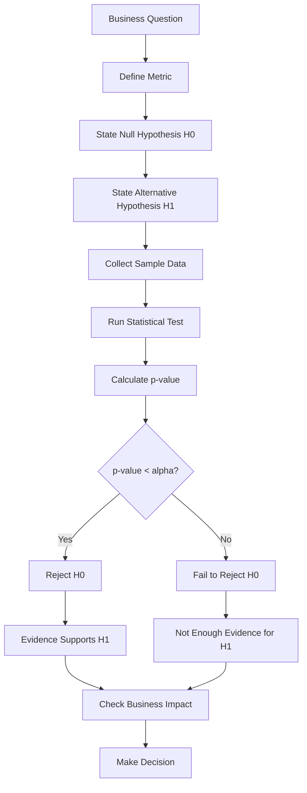
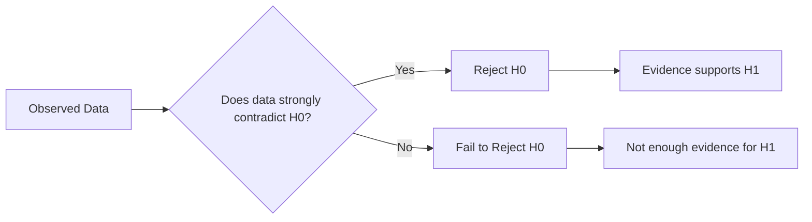

# 022 - Alternative Hypothesis

**Course:** 01 - Math, Statistics and Econometrics
**Module:** Module 02 - Statistics
**Content Group:** Testing and Experiments
**Roadmap Source:** Statistics / Testing and Experiments
**Lesson Type:** Statistics
**Order in Module:** 022
**Suggested Duration:** 24 minutes

---

## 1. Summary

The **Alternative Hypothesis** is the statement that represents the effect, difference, improvement, or relationship we want to test.

In hypothesis testing, we usually start with two competing ideas:

```text
H0 = Null Hypothesis
H1 = Alternative Hypothesis
```

The **null hypothesis** says that there is no real effect.
The **alternative hypothesis** says that there is a real effect.

In AI and Data Science, the alternative hypothesis helps answer questions such as:

* Did the new model improve accuracy?
* Did version B increase conversion rate?
* Did the marketing campaign increase revenue?
* Is there a relationship between two variables?
* Did a product change affect user behavior?

The alternative hypothesis is important because it defines what kind of evidence we are looking for.

---

## 2. Learning Objectives

By the end of this lesson, you should be able to:

* Explain **Alternative Hypothesis** in your own words.
* Distinguish between the null hypothesis and the alternative hypothesis.
* Write an alternative hypothesis for an A/B test.
* Understand one-sided and two-sided alternative hypotheses.
* Interpret statistical test results in relation to `H1`.
* Apply the concept to a dataset, notebook, model comparison, experiment, or business decision.

---

## 3. Main Idea

The alternative hypothesis is the claim that something has changed.

Simple structure:

```text
H0: There is no effect.
H1: There is an effect.
```

Example:

```text
H0: conversion_A = conversion_B
H1: conversion_A != conversion_B
```

Meaning:

```text
H0: Version A and version B have the same conversion rate.
H1: Version A and version B have different conversion rates.
```

The alternative hypothesis is supported only when the data gives enough evidence against the null hypothesis.

---

## 4. Null Hypothesis vs Alternative Hypothesis

| Concept                | Meaning                         | Example                                 |
| ---------------------- | ------------------------------- | --------------------------------------- |
| Null Hypothesis        | Default assumption of no effect | A and B have the same conversion rate   |
| Alternative Hypothesis | Claim that there is an effect   | A and B have different conversion rates |
| Notation               | `H0`                            | `H1` or `Ha`                            |
| Role                   | Starting assumption             | What we want evidence for               |
| Decision               | Reject or fail to reject        | Supported if `H0` is rejected           |

---

## 5. Hypothesis Testing Workflow



---

## 6. Example: A/B Test Conversion Rate

Suppose a company tests two landing pages.

| Group | Visitors | Conversions | Conversion Rate |
| ----- | -------: | ----------: | --------------: |
| A     |    1,000 |         100 |             10% |
| B     |    1,000 |         120 |             12% |

Version B looks better because its conversion rate is higher.

However, we need to test whether this difference is statistically reliable.

---

## 7. Define the Hypotheses

### Two-Sided Alternative Hypothesis

A **two-sided test** checks whether there is any difference between two groups.

```text
H0: conversion_A = conversion_B
H1: conversion_A != conversion_B
```

Meaning:

```text
H0: A and B have the same conversion rate.
H1: A and B have different conversion rates.
```

Use this when you want to detect either direction:

```text
B may be better than A.
B may be worse than A.
```

---

### One-Sided Alternative Hypothesis

A **one-sided test** checks whether the effect goes in one specific direction.

Example: testing whether B is better than A.

```text
H0: conversion_B <= conversion_A
H1: conversion_B > conversion_A
```

Meaning:

```text
H0: Version B is not better than version A.
H1: Version B is better than version A.
```

Use this when the business question is directional:

```text
Do we have evidence that B improves conversion?
```

---

## 8. Types of Alternative Hypotheses

| Type         | Alternative Hypothesis | Meaning               |
| ------------ | ---------------------- | --------------------- |
| Two-sided    | `H1: A != B`           | A and B are different |
| Right-tailed | `H1: B > A`            | B is greater than A   |
| Left-tailed  | `H1: B < A`            | B is less than A      |

---

## 9. Visual Intuition



---

## 10. Alternative Hypothesis and p-value

The p-value helps decide whether the data provides enough evidence for the alternative hypothesis.

Decision rule:

```text
If p-value < alpha:
    Reject H0
    Evidence supports H1

If p-value >= alpha:
    Fail to reject H0
    Not enough evidence supports H1
```

Common significance level:

```text
alpha = 0.05
```

Important note:

```text
A small p-value does not prove H1 is true.
It only means the data gives strong evidence against H0.
```

---

## 11. Alternative Hypothesis and Confidence Interval

A confidence interval can also help evaluate the alternative hypothesis.

Example:

```text
Observed difference = 2 percentage points
95% CI = [0.3%, 3.7%]
```

Because the confidence interval does not include `0`, the data supports the idea that there may be a real difference.

Another example:

```text
Observed difference = 2 percentage points
95% CI = [-0.5%, 4.5%]
```

Because the confidence interval includes `0`, the true effect could be zero.
In this case, there is not enough evidence to support the alternative hypothesis.

---

## 12. Alternative Hypothesis in AI and Data Science

### A/B Testing

```text
H0: conversion_A = conversion_B
H1: conversion_B > conversion_A
```

Question:

```text
Does the new landing page increase conversion?
```

---

### Model Comparison

```text
H0: model_A_accuracy = model_B_accuracy
H1: model_B_accuracy > model_A_accuracy
```

Question:

```text
Does the new model perform better than the old model?
```

---

### Recommendation System

```text
H0: new_recommender_CTR = old_recommender_CTR
H1: new_recommender_CTR > old_recommender_CTR
```

Question:

```text
Does the new recommendation algorithm increase click-through rate?
```

---

### Marketing Campaign

```text
H0: campaign has no effect on revenue
H1: campaign increases revenue
```

Question:

```text
Did the campaign improve business performance?
```

---

### Feature Engineering

```text
H0: new_feature does not improve model performance
H1: new_feature improves model performance
```

Question:

```text
Should we include this new feature in the machine learning pipeline?
```

---

## 13. Practical Demo

```text
Question:
Does version B improve conversion rate compared with version A?

Metric:
Conversion rate

Sample:
A: 100 conversions / 1000 visitors = 10%
B: 120 conversions / 1000 visitors = 12%

Null Hypothesis:
H0: conversion_B <= conversion_A

Alternative Hypothesis:
H1: conversion_B > conversion_A

Observed effect:
12% - 10% = 2 percentage points

Check:
- sample size
- p-value
- confidence interval
- effect size
- business impact
```

Possible conclusion:

```text
Version B has a higher observed conversion rate than version A.

If the p-value is below 0.05, we may reject H0 and say that the data provides
evidence supporting the alternative hypothesis that version B improves conversion.

However, we should still check whether the improvement is large enough to justify
the cost and risk of rollout.
```

---

## 14. Mini Python Example

```python
import numpy as np
from statsmodels.stats.proportion import proportions_ztest

# Conversion data
conversions = np.array([100, 120])
visitors = np.array([1000, 1000])

# One-sided test:
# H0: conversion_B <= conversion_A
# H1: conversion_B > conversion_A

z_stat, p_value_two_sided = proportions_ztest(conversions, visitors)

# Convert two-sided p-value to one-sided p-value
p_value_one_sided = p_value_two_sided / 2

alpha = 0.05

print("Z-statistic:", z_stat)
print("One-sided p-value:", p_value_one_sided)

if p_value_one_sided < alpha:
    print("Reject H0: Evidence supports H1 that B improves conversion.")
else:
    print("Fail to reject H0: Not enough evidence that B improves conversion.")
```

---

## 15. Statistical Significance vs Business Significance

Supporting the alternative hypothesis is not always enough.

A result can be statistically significant but not useful for business.

Example:

```text
p-value = 0.01
conversion increase = 0.02%
```

This may support the alternative hypothesis statistically, but the business impact may be too small.

Always ask:

```text
Is the effect large enough to matter?
```

---

## 16. Common Mistakes

### Mistake 1: Writing H1 Before Defining the Business Question

Bad approach:

```text
H1: B is better
```

Better approach:

```text
Business question:
Does version B increase conversion rate?

H1:
conversion_B > conversion_A
```

The alternative hypothesis should match the business question.

---

### Mistake 2: Confusing Two-Sided and One-Sided Tests

Two-sided:

```text
H1: A != B
```

One-sided:

```text
H1: B > A
```

Do not choose one-sided testing only because it makes significance easier to achieve.

---

### Mistake 3: Thinking H1 Is Proven

Rejecting `H0` does not prove `H1` with 100% certainty.

Better wording:

```text
The data provides evidence supporting H1.
```

Avoid:

```text
H1 is definitely true.
```

---

### Mistake 4: Ignoring Sample Size

A small sample can create misleading differences.

Example:

```text
A: 1 conversion / 10 visitors = 10%
B: 2 conversions / 10 visitors = 20%
```

Version B looks better, but the sample size is too small for a reliable conclusion.

---

### Mistake 5: Ignoring Bias

If the experiment groups are not comparable, the alternative hypothesis may appear supported for the wrong reason.

Example:

```text
Group A = mostly mobile users
Group B = mostly desktop users
```

The difference may come from device type, not the tested feature.

---

### Mistake 6: Ignoring Multiple Comparisons

If you test many alternative hypotheses, some may look significant by chance.

Example:

```text
Testing 100 different button colors
```

Some results may appear significant even if there is no real effect.

---

## 17. Practical Exercise

Create a small simulated A/B test dataset.

### Setup

```text
Group A conversion rate: 10%
Group B conversion rate: 12%
Sample size per group: 1000
```

Answer the following questions:

1. What is the business question?
2. What is the null hypothesis?
3. What is the alternative hypothesis?
4. Is the test one-sided or two-sided?
5. What is the observed difference?
6. What is the p-value?
7. Does the data support the alternative hypothesis?
8. Is the result meaningful for business?
9. What rollout recommendation would you give?

---

## 18. Checklist

Before finishing this lesson, make sure you can:

* [ ] Explain **Alternative Hypothesis** in 1-2 minutes.
* [ ] Write `H1` for an A/B test.
* [ ] Distinguish `H0` from `H1`.
* [ ] Explain the difference between one-sided and two-sided tests.
* [ ] Interpret p-value in relation to `H1`.
* [ ] Explain why rejecting `H0` does not prove `H1`.
* [ ] Connect `H1` to sample size, bias, uncertainty, and business impact.
* [ ] Apply the concept to a notebook, query, chart, model, API, or experiment report.
* [ ] Write at least one caveat, assumption, or follow-up question.

---

## 19. Portfolio Artifact

You can turn this lesson into a small portfolio artifact.

### Project: A/B Test Conversion Rate with Alternative Hypothesis

Build a notebook that includes:

* Business question
* Metric definition
* Null hypothesis
* Alternative hypothesis
* One-sided or two-sided test explanation
* Simulated A/B test data
* Conversion rate calculation
* Statistical test
* p-value interpretation
* Confidence interval
* Effect size
* Business recommendation
* Final rollout decision

Example project title:

```text
Testing an Alternative Hypothesis in an A/B Test Experiment
```

---

## 20. Related Outcome

This lesson supports the following roadmap outcome:

> Use probability, sampling, descriptive statistics, hypothesis testing, and A/B testing to make decisions from data.

---

## 21. Final Summary

The **Alternative Hypothesis** is the statement that represents the effect, difference, improvement, or relationship we want to test.

In simple terms:

```text
H0: Nothing changed.
H1: Something changed.
```

In AI and Data Science, the alternative hypothesis helps test whether:

```text
A new model is better.
A new feature increases conversion.
A campaign improves revenue.
A recommendation system increases CTR.
A product change affects user behavior.
```

A good Data Scientist does not only ask whether the data supports `H1`.
They also check:

* sample size,
* bias,
* uncertainty,
* p-value,
* confidence interval,
* effect size,
* and business impact.

The alternative hypothesis is a key part of experiment analysis because it clearly defines what evidence the data must support before making a decision.

---

# Bài luyện tập

## Mục tiêu


## Đề bài


## Yêu cầu hoàn thành

- [ ] 
- [ ] 
- [ ] 

## Kết quả / lời giải


## Ghi chú
