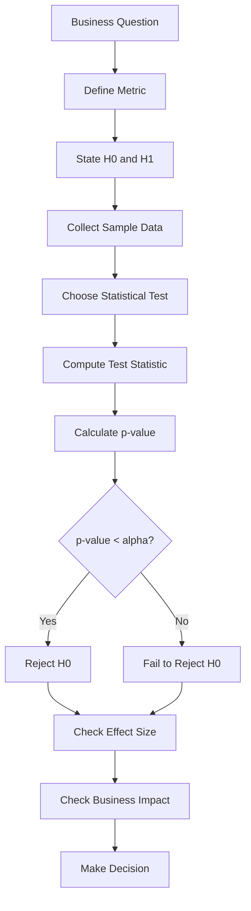
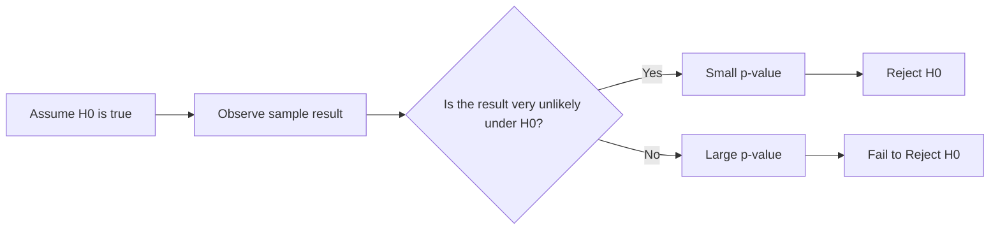

# 023 - p-value

**Course:** 01 - Math, Statistics and Econometrics
**Module:** Module 02 - Statistics
**Content Group:** Testing and Experiments
**Roadmap Source:** Statistics / Testing and Experiments
**Lesson Type:** Statistics
**Order in Module:** 023
**Suggested Duration:** 24 minutes

---

## 1. Summary

A **p-value** is a statistical measure used in hypothesis testing.

It helps answer this question:

> If the null hypothesis were true, how likely would we be to observe a result this extreme or more extreme?

In AI and Data Science, p-value is commonly used in:

* A/B testing
* model comparison
* experiment analysis
* feature impact testing
* marketing campaign analysis
* product decision-making

A small p-value means the observed result would be unlikely if the null hypothesis were true.

However, a p-value does **not** automatically mean the result is important for business.

---

## 2. Learning Objectives

By the end of this lesson, you should be able to:

* Explain **p-value** in your own words.
* Understand how p-value relates to the null hypothesis.
* Use p-value to decide whether to reject `H0`.
* Distinguish statistical significance from business significance.
* Avoid common misunderstandings about p-value.
* Apply p-value to an A/B testing or model comparison example.

---

## 3. Main Idea

The p-value tells us how surprising the observed data is under the null hypothesis.

Simple interpretation:

```text
Small p-value = result is unlikely under H0
Large p-value = result could reasonably happen under H0
```

Formal idea:

```text
p-value = P(observing this result or a more extreme result | H0 is true)
```

Important:

```text
The p-value is NOT the probability that H0 is true.
```

---

## 4. p-value in Hypothesis Testing

Hypothesis testing usually starts with:

```text
H0: There is no effect.
H1: There is an effect.
```

Then we collect sample data and calculate a p-value.

Decision rule:

```text
If p-value < alpha:
    Reject H0

If p-value >= alpha:
    Fail to reject H0
```

Common significance level:

```text
alpha = 0.05
```

This means we use a 5% threshold for statistical significance.

---

## 5. Hypothesis Testing Workflow



---

## 6. Example: A/B Test Conversion Rate

Suppose a company tests two landing pages.

| Group | Visitors | Conversions | Conversion Rate |
| ----- | -------: | ----------: | --------------: |
| A     |    1,000 |         100 |             10% |
| B     |    1,000 |         120 |             12% |

Observed difference:

```text
12% - 10% = 2 percentage points
```

Question:

> Is version B truly better, or could this difference happen by random chance?

---

## 7. Define the Hypotheses

For a two-sided test:

```text
H0: conversion_A = conversion_B
H1: conversion_A != conversion_B
```

Meaning:

```text
H0: Version A and version B have the same conversion rate.
H1: Version A and version B have different conversion rates.
```

The p-value tells us whether the observed 2 percentage point difference is surprising under `H0`.

---

## 8. How to Interpret p-value

|            p-value | Interpretation                                |
| -----------------: | --------------------------------------------- |
|         `p < 0.01` | Strong evidence against `H0`                  |
|         `p < 0.05` | Common threshold for statistical significance |
|        `p >= 0.05` | Not enough evidence to reject `H0`            |
| Very large p-value | Observed result is not surprising under `H0`  |

Example:

```text
p-value = 0.03
alpha = 0.05
```

Since:

```text
0.03 < 0.05
```

Decision:

```text
Reject H0
```

Interpretation:

```text
The data provides evidence that the conversion rates are different.
```

---

## 9. What p-value Does NOT Mean

A p-value is often misunderstood.

### Incorrect Interpretation

```text
p-value = 0.03 means there is a 3% probability that H0 is true.
```

This is wrong.

### Better Interpretation

```text
If H0 were true, there would be a 3% chance of observing a result this extreme or more extreme.
```

The p-value measures how surprising the data is under the null hypothesis.

---

## 10. Visual Intuition



---

## 11. p-value and Statistical Significance

A result is often called **statistically significant** when:

```text
p-value < alpha
```

For example:

```text
p-value = 0.02
alpha = 0.05
```

Because `0.02 < 0.05`, the result is statistically significant.

However, statistical significance only means:

```text
The observed result is unlikely under H0.
```

It does not automatically mean:

```text
The result is large.
The result is useful.
The result should be deployed.
The business impact is meaningful.
```

---

## 12. Statistical Significance vs Business Significance

| Concept                  | Meaning                               | Example Question                    |
| ------------------------ | ------------------------------------- | ----------------------------------- |
| Statistical significance | Is the result unlikely due to chance? | Is B really different from A?       |
| Business significance    | Is the result useful or valuable?     | Is the improvement worth launching? |

Example:

```text
p-value = 0.001
Conversion increase = 0.02%
```

This result may be statistically significant, but the business impact may be too small.

Always ask:

```text
Is the effect large enough to matter?
```

---

## 13. p-value and Sample Size

Sample size strongly affects p-value.

### Small Sample Size

With a small sample, even a large observed difference may not be statistically significant.

Example:

```text
A: 1 conversion / 10 visitors = 10%
B: 2 conversions / 10 visitors = 20%
```

The difference looks large, but the sample is too small.

---

### Large Sample Size

With a very large sample, even a tiny difference may become statistically significant.

Example:

```text
A: 10.00% conversion rate
B: 10.05% conversion rate
p-value = 0.01
```

The result may be statistically significant, but the improvement may not be useful.

---

## 14. p-value and Confidence Interval

A p-value tells us whether the result is statistically significant.

A confidence interval tells us the range of plausible effect sizes.

Example:

```text
Observed difference = 2 percentage points
95% CI = [0.3%, 3.7%]
p-value = 0.03
```

Interpretation:

```text
The result is statistically significant because the confidence interval does not include 0.
The true improvement may be between 0.3% and 3.7%.
```

Another example:

```text
Observed difference = 2 percentage points
95% CI = [-0.5%, 4.5%]
p-value = 0.12
```

Interpretation:

```text
The result is not statistically significant because the confidence interval includes 0.
The true effect could be positive, negative, or zero.
```

---

## 15. AI and Data Science Applications

### A/B Testing

```text
H0: conversion_A = conversion_B
H1: conversion_A != conversion_B
```

Use p-value to check whether a conversion difference is likely real.

---

### Model Comparison

```text
H0: model_A_accuracy = model_B_accuracy
H1: model_A_accuracy != model_B_accuracy
```

Use p-value to check whether one model performs significantly differently.

---

### Recommendation Systems

```text
H0: old_CTR = new_CTR
H1: old_CTR != new_CTR
```

Use p-value to evaluate whether a new recommender changes click-through rate.

---

### Marketing Campaigns

```text
H0: campaign has no effect on revenue
H1: campaign changes revenue
```

Use p-value to evaluate campaign impact.

---

## 16. Practical Demo

```text
Question:
Does version B improve conversion rate compared with version A?

Metric:
Conversion rate

Sample:
A: 100 conversions / 1000 visitors = 10%
B: 120 conversions / 1000 visitors = 12%

Hypotheses:
H0: conversion_A = conversion_B
H1: conversion_A != conversion_B

Observed effect:
12% - 10% = 2 percentage points

Check:
- p-value
- confidence interval
- effect size
- sample size
- bias
- business impact
```

Possible conclusion:

```text
Version B has a higher observed conversion rate than version A.

If the p-value is below 0.05, we may reject H0 and conclude that the data
provides evidence of a statistically significant difference.

However, before rollout, we should also check whether the 2 percentage point
increase is large enough to justify engineering cost, product risk, and business impact.
```

---

## 17. Mini Python Example

```python
import numpy as np
from statsmodels.stats.proportion import proportions_ztest

# Conversion data
conversions = np.array([100, 120])
visitors = np.array([1000, 1000])

# H0: conversion_A = conversion_B
# H1: conversion_A != conversion_B

z_stat, p_value = proportions_ztest(conversions, visitors)

alpha = 0.05

print("Z-statistic:", z_stat)
print("P-value:", p_value)

if p_value < alpha:
    print("Reject H0: The conversion rates are significantly different.")
else:
    print("Fail to reject H0: Not enough evidence of a significant difference.")
```

---

## 18. Common Mistakes

### Mistake 1: Thinking p-value Is the Probability That H0 Is True

Wrong:

```text
p-value = probability that H0 is true
```

Correct:

```text
p-value = probability of observing this result or a more extreme result if H0 is true
```

---

### Mistake 2: Treating p-value as Business Impact

A small p-value does not mean the effect is large.

Example:

```text
p-value = 0.001
conversion increase = 0.01%
```

The result may be statistically significant but not meaningful.

---

### Mistake 3: Ignoring Sample Size

A p-value without sample size can be misleading.

Always report:

```text
sample size
observed effect
p-value
confidence interval
business impact
```

---

### Mistake 4: Ignoring Bias

If the sample is biased, the p-value may not save the analysis.

Example:

```text
Group A = mostly mobile users
Group B = mostly desktop users
```

The observed difference may come from user type, not the experiment.

---

### Mistake 5: Ignoring Multiple Comparisons

If many tests are performed, some small p-values may appear by chance.

Example:

```text
Testing 100 button colors
```

Some results may look significant even if there is no real effect.

---

### Mistake 6: Using 0.05 as a Magic Rule

The threshold `0.05` is common, but it is not always the correct choice.

In high-risk decisions, you may need a stricter threshold.

Example:

```text
alpha = 0.01
```

In exploratory analysis, you may use p-value as one signal, not a final decision.

---

## 19. Practical Exercise

Create a small simulated A/B test dataset.

### Setup

```text
Group A conversion rate: 10%
Group B conversion rate: 12%
Sample size per group: 1000
```

Answer the following questions:

1. What is the business question?
2. What is the null hypothesis?
3. What is the alternative hypothesis?
4. What is the observed difference?
5. What is the p-value?
6. Do you reject or fail to reject `H0`?
7. Is the result statistically significant?
8. Is the result meaningful for business?
9. What rollout recommendation would you give?

---

## 20. Checklist

Before finishing this lesson, make sure you can:

* [ ] Explain **p-value** in 1-2 minutes.
* [ ] Explain how p-value relates to `H0`.
* [ ] Use p-value to reject or fail to reject `H0`.
* [ ] Explain why p-value is not the probability that `H0` is true.
* [ ] Distinguish statistical significance from business significance.
* [ ] Explain why sample size affects p-value.
* [ ] Connect p-value to confidence interval and effect size.
* [ ] Apply p-value to an A/B testing example.
* [ ] Write at least one caveat, assumption, or follow-up question.

---

## 21. Portfolio Artifact

You can turn this lesson into a small portfolio artifact.

### Project: A/B Test Conversion Rate with p-value

Build a notebook that includes:

* business question
* metric definition
* null hypothesis
* alternative hypothesis
* simulated A/B test data
* conversion rate calculation
* p-value calculation
* confidence interval
* effect size
* statistical significance interpretation
* business significance interpretation
* rollout recommendation

Example project title:

```text
Interpreting p-value in an A/B Test Conversion Experiment
```

---

## 22. Related Outcome

This lesson supports the following roadmap outcome:

> Use probability, sampling, descriptive statistics, hypothesis testing, and A/B testing to make decisions from data.

---

## 23. Final Summary

A **p-value** helps us measure how surprising the observed data is if the null hypothesis is true.

Simple idea:

```text
Small p-value = strong evidence against H0
Large p-value = not enough evidence against H0
```

In AI and Data Science, p-value is useful for:

```text
A/B testing
model comparison
experiment analysis
feature testing
business decision-making
```

However, a good Data Scientist does not stop at the p-value.

They also check:

* sample size,
* bias,
* uncertainty,
* confidence interval,
* effect size,
* multiple comparisons,
* and business impact.

The p-value is an important tool, but it should be interpreted carefully and combined with practical judgment.

---

# Bài luyện tập

## Mục tiêu


## Đề bài


## Yêu cầu hoàn thành

- [ ] 
- [ ] 
- [ ] 

## Kết quả / lời giải


## Ghi chú
