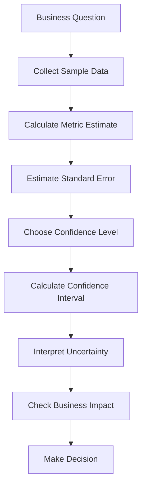
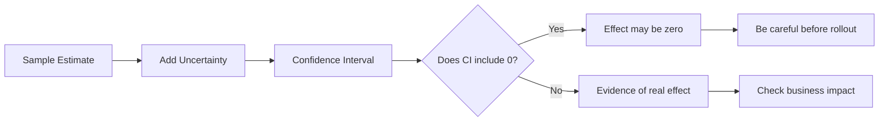

# 024 - Confidence Interval

**Course:** 01 - Math, Statistics and Econometrics
**Module:** Module 02 - Statistics
**Content Group:** Testing and Experiments
**Roadmap Source:** Statistics / Testing and Experiments
**Lesson Type:** Statistics
**Order in Module:** 024
**Suggested Duration:** 24 minutes

---

## 1. Summary

A **Confidence Interval** is a range of plausible values for an unknown population parameter.

Instead of giving only one number, a confidence interval gives a range that reflects uncertainty.

For example, instead of saying:

```text
The conversion rate improvement is 2%.
```

A Data Scientist may say:

```text
The estimated improvement is 2%, with a 95% confidence interval from 0.3% to 3.7%.
```

This is more useful because it shows both:

* the estimated effect,
* and the uncertainty around that estimate.

In AI and Data Science, confidence intervals are used in:

* A/B testing,
* model evaluation,
* experiment analysis,
* business reporting,
* metric monitoring,
* forecasting,
* and decision-making under uncertainty.

---

## 2. Learning Objectives

By the end of this lesson, you should be able to:

* Explain **Confidence Interval** in your own words.
* Understand why estimates from samples have uncertainty.
* Interpret a 95% confidence interval correctly.
* Connect confidence intervals with p-values and hypothesis testing.
* Use confidence intervals to support business decisions.
* Apply confidence intervals to an A/B testing or model evaluation example.

---

## 3. Main Idea

A confidence interval answers this question:

```text
What range of values is plausible for the true effect?
```

Example:

```text
Observed conversion lift = 2 percentage points
95% Confidence Interval = [0.3%, 3.7%]
```

Interpretation:

```text
The true conversion lift is plausibly between 0.3% and 3.7%.
```

The interval helps us avoid overconfidence in one sample estimate.

---

## 4. Why Confidence Intervals Matter

Sample data is not perfect.

Different samples may produce different results.

Example:

```text
Sample 1: conversion lift = 1.8%
Sample 2: conversion lift = 2.3%
Sample 3: conversion lift = 1.5%
Sample 4: conversion lift = 2.7%
```

A confidence interval helps express this uncertainty.

Instead of making a decision from a single number, we use a range.

---

## 5. Confidence Interval Formula

A common structure is:

```text
Confidence Interval = Estimate ± Margin of Error
```

More formally:

```text
CI = estimate ± critical_value × standard_error
```

Where:

```text
estimate         = sample statistic, such as mean or conversion rate
critical_value   = value based on confidence level, such as 1.96 for 95%
standard_error   = uncertainty of the estimate
```

For a 95% confidence interval:

```text
CI = estimate ± 1.96 × standard_error
```

---

## 6. Confidence Interval Workflow



---

## 7. Example: A/B Test Conversion Rate

Suppose a company tests two landing pages.

| Group | Visitors | Conversions | Conversion Rate |
| ----- | -------: | ----------: | --------------: |
| A     |    1,000 |         100 |             10% |
| B     |    1,000 |         120 |             12% |

Observed difference:

```text
12% - 10% = 2 percentage points
```

But the true difference may not be exactly 2%.

A confidence interval may look like this:

```text
95% CI for conversion lift = [-0.7%, 4.7%]
```

Interpretation:

```text
The true lift could be negative, zero, or positive.
```

Because the interval includes `0`, we may not have enough evidence to say that B is truly better.

---

## 8. Confidence Interval and Hypothesis Testing

Confidence intervals are closely related to hypothesis testing.

For a two-sided test:

```text
H0: effect = 0
H1: effect != 0
```

If the confidence interval does **not** include `0`, the result is often statistically significant.

Example:

```text
95% CI = [0.3%, 3.7%]
```

Because `0` is not inside the interval, the result supports a real difference.

Another example:

```text
95% CI = [-0.5%, 4.5%]
```

Because `0` is inside the interval, the true effect could be zero.

---

## 9. Visual Intuition



---

## 10. Correct Interpretation

A 95% confidence interval does **not** mean:

```text
There is a 95% probability that the true value is inside this specific interval.
```

A better frequentist interpretation is:

```text
If we repeated the sampling process many times,
about 95% of the intervals constructed this way would contain the true value.
```

For practical Data Science communication, you can say:

```text
This interval gives a reasonable range of plausible values for the true effect.
```

---

## 11. Confidence Level

The confidence level controls how wide the interval is.

Common confidence levels:

| Confidence Level | Critical Value | Interval Width |
| ---------------: | -------------: | -------------- |
|              90% |          1.645 | Narrower       |
|              95% |           1.96 | Common         |
|              99% |          2.576 | Wider          |

Higher confidence means a wider interval.

Example:

```text
90% CI: [0.5%, 3.5%]
95% CI: [0.3%, 3.7%]
99% CI: [-0.2%, 4.2%]
```

As confidence increases, the interval becomes wider because we want to be more cautious.

---

## 12. Confidence Interval and Sample Size

Sample size strongly affects confidence intervals.

### Small Sample Size

Small sample size usually creates a wide confidence interval.

```text
A: 10 visitors
B: 10 visitors
```

Result:

```text
Estimated lift = 10%
95% CI = [-20%, 40%]
```

This interval is too wide for a confident decision.

---

### Large Sample Size

Large sample size usually creates a narrower confidence interval.

```text
A: 100,000 visitors
B: 100,000 visitors
```

Result:

```text
Estimated lift = 1%
95% CI = [0.7%, 1.3%]
```

This interval is more precise.

---

## 13. Confidence Interval vs p-value

| Concept             | Main Question                        | Example        |
| ------------------- | ------------------------------------ | -------------- |
| p-value             | Is the result surprising under `H0`? | `p = 0.03`     |
| Confidence Interval | What range of effects is plausible?  | `[0.3%, 3.7%]` |

The p-value gives a significance signal.

The confidence interval gives more information because it shows:

* direction of effect,
* possible size of effect,
* uncertainty,
* and whether zero is plausible.

---

## 14. Statistical Significance vs Business Significance

A confidence interval can help evaluate business impact.

Example:

```text
Estimated lift = 0.05%
95% CI = [0.01%, 0.09%]
```

This may be statistically significant because the interval does not include `0`.

However, the effect may be too small to matter for business.

Another example:

```text
Estimated lift = 3%
95% CI = [1%, 5%]
```

This result may be both statistically significant and business meaningful.

Always ask:

```text
Is the entire plausible range useful enough for the business?
```

---

## 15. AI and Data Science Applications

### A/B Testing

```text
Metric: conversion rate
Estimate: B - A
Confidence Interval: plausible conversion lift range
```

Used to decide whether a product change should be launched.

---

### Model Evaluation

```text
Metric: accuracy, F1-score, RMSE, AUC
Confidence Interval: uncertainty around model performance
```

Used to decide whether a new model is reliably better.

---

### Forecasting

```text
Forecast: expected sales next month
Confidence Interval: plausible range of future sales
```

Used to communicate uncertainty in predictions.

---

### Business Reporting

```text
Metric: average order value
Confidence Interval: plausible range of true average value
```

Used to avoid overreacting to noisy dashboard changes.

---

## 16. Practical Demo

```text
Question:
Does version B improve conversion rate compared with version A?

Metric:
Conversion rate

Sample:
A: 100 conversions / 1000 visitors = 10%
B: 120 conversions / 1000 visitors = 12%

Observed effect:
12% - 10% = 2 percentage points

Confidence Interval:
95% CI = [-0.7%, 4.7%]

Interpretation:
The true effect could be negative, zero, or positive.

Decision:
Do not rollout immediately based only on this result.
Collect more data or continue the experiment.
```

Another possible result:

```text
Observed effect:
2 percentage points

Confidence Interval:
95% CI = [0.4%, 3.6%]

Interpretation:
The true effect is likely positive.

Decision:
Consider rollout if the business impact is meaningful.
```

---

## 17. Mini Python Example

```python
import numpy as np
from statsmodels.stats.proportion import confint_proportions_2indep

# Data
conversions_A = 100
visitors_A = 1000

conversions_B = 120
visitors_B = 1000

# Confidence interval for difference in proportions: B - A
ci_low, ci_high = confint_proportions_2indep(
    count1=conversions_B,
    nobs1=visitors_B,
    count2=conversions_A,
    nobs2=visitors_A,
    method="wald"
)

conversion_A = conversions_A / visitors_A
conversion_B = conversions_B / visitors_B
observed_diff = conversion_B - conversion_A

print("Conversion A:", conversion_A)
print("Conversion B:", conversion_B)
print("Observed Difference:", observed_diff)
print("95% Confidence Interval:", (ci_low, ci_high))
```

---

## 18. Common Mistakes

### Mistake 1: Thinking the Estimate Is Exact

Bad interpretation:

```text
The lift is exactly 2%.
```

Better interpretation:

```text
The estimated lift is 2%, with uncertainty around it.
```

---

### Mistake 2: Ignoring Wide Intervals

Example:

```text
Estimated lift = 5%
95% CI = [-10%, 20%]
```

The estimate looks positive, but the interval is too wide.

This means the data is not precise enough.

---

### Mistake 3: Ignoring Business Impact

Example:

```text
Estimated lift = 0.02%
95% CI = [0.01%, 0.03%]
```

The result may be precise and statistically significant, but too small to matter.

---

### Mistake 4: Forgetting Sample Size

Small sample size often leads to wide intervals.

Always report:

```text
sample size
estimate
confidence interval
business impact
```

---

### Mistake 5: Ignoring Bias

A confidence interval only reflects sampling uncertainty.

It does not fix biased data.

Example:

```text
Group A = mobile users
Group B = desktop users
```

The confidence interval may be precise, but the experiment design is flawed.

---

### Mistake 6: Saying Confidence Interval Proves the Truth

A confidence interval does not prove the exact true value.

It gives a range of plausible values based on data and assumptions.

---

## 19. Practical Exercise

Create a small simulated A/B test dataset.

### Setup

```text
Group A conversion rate: 10%
Group B conversion rate: 12%
Sample size per group: 1000
```

Answer the following questions:

1. What is the business question?
2. What metric are you testing?
3. What is the observed difference?
4. What is the 95% confidence interval?
5. Does the interval include `0`?
6. Is the result statistically significant?
7. Is the plausible effect range meaningful for business?
8. What rollout recommendation would you give?

---

## 20. Checklist

Before finishing this lesson, make sure you can:

* [ ] Explain **Confidence Interval** in 1-2 minutes.
* [ ] Explain why sample estimates have uncertainty.
* [ ] Interpret a 95% confidence interval.
* [ ] Explain why confidence intervals get narrower with larger sample size.
* [ ] Connect confidence interval with p-value and hypothesis testing.
* [ ] Check whether a confidence interval includes `0`.
* [ ] Distinguish statistical significance from business significance.
* [ ] Apply confidence intervals to an A/B testing example.
* [ ] Write at least one caveat, assumption, or follow-up question.

---

## 21. Portfolio Artifact

You can turn this lesson into a small portfolio artifact.

### Project: A/B Test Conversion Rate with Confidence Interval

Build a notebook that includes:

* business question,
* metric definition,
* null hypothesis,
* alternative hypothesis,
* simulated A/B test data,
* conversion rate calculation,
* observed effect,
* confidence interval calculation,
* p-value comparison,
* effect size interpretation,
* business significance interpretation,
* rollout recommendation.

Example project title:

```text
Estimating Conversion Lift with Confidence Intervals in an A/B Test
```

---

## 22. Related Outcome

This lesson supports the following roadmap outcome:

> Use probability, sampling, descriptive statistics, hypothesis testing, and A/B testing to make decisions from data.

---

## 23. Final Summary

A **Confidence Interval** gives a range of plausible values for a true population parameter or experiment effect.

Simple idea:

```text
Point estimate = one number
Confidence interval = one number plus uncertainty
```

In AI and Data Science, confidence intervals help answer:

```text
How large could the real effect be?
Could the effect be zero?
Is the estimate precise enough?
Is the result useful for business?
```

A good Data Scientist does not only report a p-value.

They also report:

* sample size,
* estimate,
* confidence interval,
* effect size,
* uncertainty,
* bias risk,
* and business impact.

Confidence intervals are powerful because they help turn uncertain sample data into careful, transparent, and reliable decisions.

---

# Bài luyện tập

## Mục tiêu


## Đề bài


## Yêu cầu hoàn thành

- [ ] 
- [ ] 
- [ ] 

## Kết quả / lời giải


## Ghi chú
