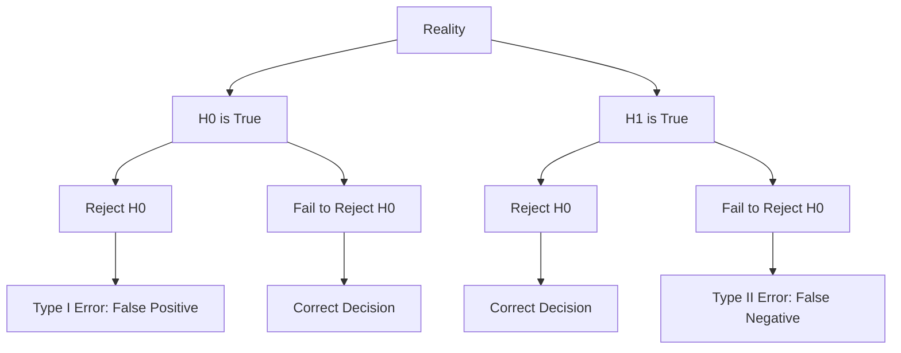
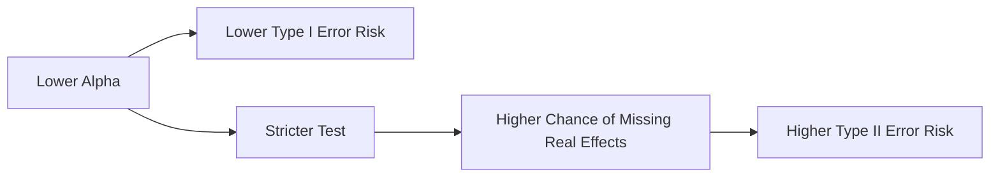

# 025 - Type I / Type II Error

**Course:** 01 - Math, Statistics and Econometrics
**Module:** Module 02 - Statistics
**Content Group:** Testing and Experiments
**Roadmap Source:** Statistics / Testing and Experiments
**Lesson Type:** Statistics
**Order in Module:** 025
**Suggested Duration:** 24 minutes

---

## 1. Summary

**Type I Error** and **Type II Error** are two possible mistakes in hypothesis testing.

In AI and Data Science, we often use sample data to make decisions. However, sample data contains uncertainty, so our decision may be wrong.

When we run a statistical test, we usually decide between:

```text
Reject H0
Fail to reject H0
```

But reality may be different from our decision.

That creates two important error types:

```text
Type I Error  = False Positive
Type II Error = False Negative
```

These errors are important in:

* A/B testing,
* model evaluation,
* medical prediction,
* fraud detection,
* recommendation systems,
* marketing experiments,
* product rollout decisions.

---

## 2. Learning Objectives

By the end of this lesson, you should be able to:

* Explain **Type I Error** and **Type II Error** in your own words.
* Connect Type I Error with false positives.
* Connect Type II Error with false negatives.
* Understand how `alpha`, `beta`, and statistical power relate to testing.
* Apply these errors to A/B testing and AI model evaluation.
* Make better experiment decisions by considering business risk.

---

## 3. Main Idea

In hypothesis testing, we start with:

```text
H0: There is no effect.
H1: There is an effect.
```

Then we make a decision using sample data.

But because sample data is uncertain, two mistakes can happen.

```text
Type I Error:
Reject H0 when H0 is actually true.

Type II Error:
Fail to reject H0 when H1 is actually true.
```

Simple memory trick:

```text
Type I Error  = false alarm
Type II Error = missed detection
```

---

## 4. Decision Matrix

| Reality    | Decision: Reject H0 | Decision: Fail to Reject H0 |
| ---------- | ------------------- | --------------------------- |
| H0 is true | Type I Error        | Correct decision            |
| H1 is true | Correct decision    | Type II Error               |

In simple terms:

| Error Type    | Meaning                              | Also Called    |
| ------------- | ------------------------------------ | -------------- |
| Type I Error  | Detecting an effect that is not real | False Positive |
| Type II Error | Missing an effect that is real       | False Negative |

---

## 5. Visual Diagram



---

## 6. Type I Error

A **Type I Error** happens when we reject the null hypothesis even though the null hypothesis is actually true.

```text
Type I Error = Reject H0 when H0 is true
```

This is also called a:

```text
False Positive
```

Example in A/B testing:

```text
H0: Version B does not improve conversion.
Decision: Launch version B.
Reality: Version B does not actually improve conversion.
```

Business meaning:

> We thought the new version worked, but it was only random noise.

---

## 7. Type II Error

A **Type II Error** happens when we fail to reject the null hypothesis even though the alternative hypothesis is actually true.

```text
Type II Error = Fail to reject H0 when H1 is true
```

This is also called a:

```text
False Negative
```

Example in A/B testing:

```text
H0: Version B does not improve conversion.
Decision: Do not launch version B.
Reality: Version B actually improves conversion.
```

Business meaning:

> We missed a real improvement because the experiment did not detect it.

---

## 8. A/B Testing Example

Suppose a company tests two landing pages.

| Group | Visitors | Conversions | Conversion Rate |
| ----- | -------: | ----------: | --------------: |
| A     |    1,000 |         100 |             10% |
| B     |    1,000 |         120 |             12% |

Hypotheses:

```text
H0: conversion_A = conversion_B
H1: conversion_A != conversion_B
```

Possible decisions:

| Decision          | If Reality Is No Real Difference | If Reality Is Real Difference |
| ----------------- | -------------------------------- | ----------------------------- |
| Reject H0         | Type I Error                     | Correct                       |
| Fail to reject H0 | Correct                          | Type II Error                 |

---

## 9. Type I Error in A/B Testing

Imagine the test result says:

```text
p-value = 0.03
alpha = 0.05
```

Because:

```text
0.03 < 0.05
```

We reject `H0`.

But what if the true reality is:

```text
Version B is not actually better.
The observed difference was caused by random chance.
```

Then we made a **Type I Error**.

Business risk:

* launching a feature that does not really help,
* wasting engineering resources,
* increasing product complexity,
* hurting user experience,
* trusting a false experiment result.

---

## 10. Type II Error in A/B Testing

Imagine the test result says:

```text
p-value = 0.20
alpha = 0.05
```

Because:

```text
0.20 >= 0.05
```

We fail to reject `H0`.

But what if the true reality is:

```text
Version B actually improves conversion.
The experiment failed to detect it.
```

Then we made a **Type II Error**.

Business risk:

* missing a useful feature,
* delaying growth,
* ignoring a real improvement,
* losing potential revenue,
* keeping an inferior version.

---

## 11. Alpha, Beta, and Power

### Alpha

`alpha` is the probability of making a Type I Error.

```text
alpha = P(Type I Error)
```

Common value:

```text
alpha = 0.05
```

Meaning:

```text
We accept a 5% risk of false positive.
```

---

### Beta

`beta` is the probability of making a Type II Error.

```text
beta = P(Type II Error)
```

Meaning:

```text
We fail to detect a real effect.
```

---

### Statistical Power

Statistical power is the probability of detecting a real effect when it exists.

```text
Power = 1 - beta
```

Example:

```text
Power = 0.80
```

Meaning:

```text
If the effect is real, the test has an 80% chance of detecting it.
```

---

## 12. Error Trade-off

Reducing one type of error can sometimes increase the other.

For example, if we make `alpha` smaller:

```text
alpha = 0.01
```

We reduce the risk of Type I Error.

But the test becomes stricter, so we may increase the risk of Type II Error.



---

## 13. Which Error Is Worse?

It depends on the business context.

| Scenario                            | More Dangerous Error             |
| ----------------------------------- | -------------------------------- |
| Launching a risky medical treatment | Type I Error                     |
| Detecting fraud transactions        | Type II Error                    |
| Testing a harmless UI color         | Type I Error may be acceptable   |
| Detecting security attacks          | Type II Error may be very costly |
| Deploying expensive infrastructure  | Type I Error may be costly       |
| Finding a growth opportunity        | Type II Error may be costly      |

There is no universal answer.

A good Data Scientist asks:

```text
What is the cost of a false positive?
What is the cost of a false negative?
```

---

## 14. AI and Data Science Applications

### A/B Testing

```text
Type I Error:
Launch a feature that does not really improve conversion.

Type II Error:
Fail to launch a feature that actually improves conversion.
```

---

### Fraud Detection

```text
Type I Error:
Flag a normal transaction as fraud.

Type II Error:
Miss an actual fraud transaction.
```

---

### Medical AI

```text
Type I Error:
Predict disease when the patient does not have it.

Type II Error:
Miss disease when the patient actually has it.
```

---

### Spam Classification

```text
Type I Error:
Classify a normal email as spam.

Type II Error:
Classify spam as normal email.
```

---

### Model Deployment

```text
Type I Error:
Deploy a model that is not truly better.

Type II Error:
Reject a model that actually improves performance.
```

---

## 15. Practical Demo

```text
Question:
Does version B improve conversion compared with version A?

Metric:
Conversion rate

Hypotheses:
H0: conversion_A = conversion_B
H1: conversion_A != conversion_B

Possible Type I Error:
We conclude B is better, but B is not actually better.

Possible Type II Error:
We conclude there is not enough evidence for B, but B is actually better.
```

Business interpretation:

```text
Type I Error may cause us to launch a useless or harmful feature.
Type II Error may cause us to miss a valuable improvement.
```

---

## 16. Mini Python Simulation

```python
import numpy as np
from statsmodels.stats.proportion import proportions_ztest

np.random.seed(42)

# True conversion rates
true_rate_A = 0.10
true_rate_B = 0.10  # no real difference, so H0 is true

# Sample size
n_A = 1000
n_B = 1000

# Simulate conversions
conversions_A = np.random.binomial(n_A, true_rate_A)
conversions_B = np.random.binomial(n_B, true_rate_B)

conversions = np.array([conversions_A, conversions_B])
visitors = np.array([n_A, n_B])

# Run hypothesis test
z_stat, p_value = proportions_ztest(conversions, visitors)

alpha = 0.05

print("Conversions A:", conversions_A)
print("Conversions B:", conversions_B)
print("p-value:", p_value)

if p_value < alpha:
    print("Reject H0")
    print("If H0 is actually true, this is a Type I Error.")
else:
    print("Fail to reject H0")
    print("Correct decision if H0 is actually true.")
```

---

## 17. Common Mistakes

### Mistake 1: Thinking Statistical Tests Are Always Correct

Statistical tests reduce uncertainty, but they do not remove it completely.

Even with good methods, errors can still happen.

---

### Mistake 2: Ignoring Type I Error

If you run many experiments, some will look significant by chance.

Example:

```text
Testing 100 button colors
```

Some small p-values may appear even if no real effect exists.

---

### Mistake 3: Ignoring Type II Error

A non-significant result does not always mean there is no effect.

It may mean:

```text
The sample size was too small.
The effect was too small to detect.
The experiment had low power.
```

---

### Mistake 4: Confusing Type I and Type II Error

Memory trick:

```text
Type I Error:
False Positive

Type II Error:
False Negative
```

---

### Mistake 5: Choosing Alpha Without Thinking About Risk

Do not use `alpha = 0.05` blindly.

For high-risk decisions, use a stricter threshold.

Example:

```text
alpha = 0.01
```

For exploratory analysis, `alpha = 0.05` may be acceptable as an early signal.

---

### Mistake 6: Ignoring Business Cost

The best statistical decision depends on the real-world cost of each mistake.

Example:

```text
False positive cost = wasted launch
False negative cost = missed revenue
```

A good decision balances both risks.

---

## 18. Practical Exercise

Create a small A/B testing scenario.

### Setup

```text
Group A conversion rate: 10%
Group B conversion rate: 12%
Sample size per group: 1000
```

Answer the following questions:

1. What is the null hypothesis?
2. What is the alternative hypothesis?
3. What would a Type I Error mean in this experiment?
4. What would a Type II Error mean in this experiment?
5. Which error is more costly for the business?
6. What alpha level would you choose?
7. How could increasing sample size affect Type II Error?
8. What rollout recommendation would you give?

---

## 19. Checklist

Before finishing this lesson, make sure you can:

* [ ] Explain **Type I Error** in 1-2 minutes.
* [ ] Explain **Type II Error** in 1-2 minutes.
* [ ] Connect Type I Error with false positives.
* [ ] Connect Type II Error with false negatives.
* [ ] Explain what `alpha` means.
* [ ] Explain what `beta` means.
* [ ] Explain statistical power as `1 - beta`.
* [ ] Apply Type I and Type II errors to A/B testing.
* [ ] Discuss which error is more costly in a business context.
* [ ] Write at least one caveat, assumption, or follow-up question.

---

## 20. Portfolio Artifact

You can turn this lesson into a small portfolio artifact.

### Project: A/B Test Risk Analysis with Type I and Type II Errors

Build a notebook or report that includes:

* business question,
* metric definition,
* null hypothesis,
* alternative hypothesis,
* simulated A/B test data,
* p-value calculation,
* Type I Error interpretation,
* Type II Error interpretation,
* alpha selection,
* power discussion,
* business risk analysis,
* rollout recommendation.

Example project title:

```text
Understanding False Positives and False Negatives in A/B Testing
```

---

## 21. Related Outcome

This lesson supports the following roadmap outcome:

> Use probability, sampling, descriptive statistics, hypothesis testing, and A/B testing to make decisions from data.

---

## 22. Final Summary

**Type I Error** and **Type II Error** describe the two main ways a statistical decision can be wrong.

Simple summary:

```text
Type I Error  = False Positive = detecting an effect that is not real
Type II Error = False Negative = missing an effect that is real
```

In AI and Data Science, these errors help us think more carefully about:

```text
Should we launch this feature?
Is the new model actually better?
Did the campaign really work?
Are we missing a real signal?
Are we overreacting to random noise?
```

A good Data Scientist does not only report a p-value.

They also consider:

* sample size,
* alpha,
* beta,
* statistical power,
* false positive cost,
* false negative cost,
* uncertainty,
* bias,
* and business impact.

Understanding Type I and Type II errors helps turn statistical testing into better real-world decisions.
