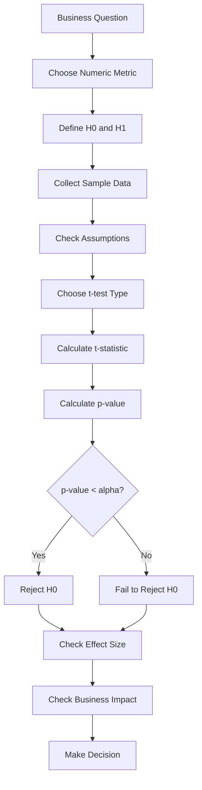
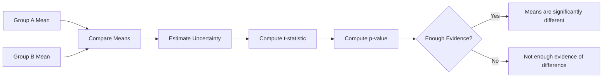

# 026 - t-test

**Course:** 01 - Math, Statistics and Econometrics
**Module:** Module 02 - Statistics
**Content Group:** Testing and Experiments
**Roadmap Source:** Statistics / Testing and Experiments
**Lesson Type:** Statistics
**Order in Module:** 026
**Suggested Duration:** 24 minutes

---

## 1. Summary

A **t-test** is a statistical test used to compare means.

It helps answer questions such as:

```text
Are two groups different in average value?
Did the new model reduce average error?
Did users spend more time after a product change?
Is the average order value higher after a campaign?
```

In AI and Data Science, a t-test is useful when the metric is numerical, such as:

* average revenue,
* average session duration,
* average rating,
* average model error,
* average delivery time,
* average exam score,
* average customer lifetime value.

A t-test helps decide whether an observed difference in means is likely to be real or could simply happen by random chance.

---

## 2. Learning Objectives

By the end of this lesson, you should be able to:

* Explain **t-test** in your own words.
* Understand when to use a t-test.
* Distinguish one-sample, two-sample, and paired t-tests.
* Define the null hypothesis and alternative hypothesis for a t-test.
* Interpret t-statistic, p-value, and confidence interval.
* Apply a t-test to a small dataset, experiment, model comparison, or business analysis.
* Avoid common mistakes when comparing group averages.

---

## 3. Main Idea

A t-test compares an observed mean difference against the uncertainty of that difference.

Simple idea:

```text
t-test = observed difference / uncertainty
```

More formally:

```text
t-statistic = difference in means / standard error
```

If the observed difference is large compared with the uncertainty, the t-statistic becomes large, and the p-value may become small.

That gives evidence against the null hypothesis.

---

## 4. When to Use a t-test

Use a t-test when you want to compare means.

| Question                               | Metric Type         | Suitable Test          |
| -------------------------------------- | ------------------- | ---------------------- |
| Did average session duration increase? | Numeric             | t-test                 |
| Did average order value increase?      | Numeric             | t-test                 |
| Did model B reduce average error?      | Numeric             | t-test                 |
| Did conversion rate increase?          | Binary / proportion | z-test for proportions |
| Are category counts different?         | Categorical         | Chi-square test        |

Important note:

```text
A t-test is mainly for numerical averages.
For conversion rate, use a proportion test instead.
```

---

## 5. t-test in the Data Science Workflow



---

## 6. Hypotheses for a t-test

A t-test usually starts with:

```text
H0: There is no difference in means.
H1: There is a difference in means.
```

Example:

```text
H0: mean_session_duration_A = mean_session_duration_B
H1: mean_session_duration_A != mean_session_duration_B
```

Meaning:

```text
H0: Version A and version B have the same average session duration.
H1: Version A and version B have different average session duration.
```

---

## 7. Types of t-tests

There are three common types of t-tests.

| Type              | Use Case                                 | Example                                                   |
| ----------------- | ---------------------------------------- | --------------------------------------------------------- |
| One-sample t-test | Compare one sample mean to a known value | Is average rating different from 4.0?                     |
| Two-sample t-test | Compare means of two independent groups  | Is average revenue different between A and B?             |
| Paired t-test     | Compare two related measurements         | Is model error lower after tuning on the same test cases? |

---

## 8. One-Sample t-test

A **one-sample t-test** compares the mean of one sample to a known or expected value.

Example:

```text
Question:
Is the average customer rating different from 4.0?

H0: mean_rating = 4.0
H1: mean_rating != 4.0
```

Use this when you have one group and one benchmark value.

Formula:

```text
t = (sample_mean - expected_mean) / standard_error
```

---

## 9. Two-Sample t-test

A **two-sample t-test** compares the means of two independent groups.

Example:

```text
Question:
Does version B increase average session duration compared with version A?

H0: mean_A = mean_B
H1: mean_A != mean_B
```

Example data:

| Group | Users | Average Session Duration |
| ----- | ----: | -----------------------: |
| A     |   100 |              5.2 minutes |
| B     |   100 |              5.8 minutes |

Observed difference:

```text
5.8 - 5.2 = 0.6 minutes
```

The t-test checks whether this 0.6-minute difference is large enough compared with sample uncertainty.

---

## 10. Paired t-test

A **paired t-test** compares two related measurements.

Use it when observations are naturally paired.

Example:

```text
Same users before and after a product change.
Same test cases evaluated by two models.
Same students before and after a course.
```

Example:

```text
Question:
Did model tuning reduce prediction error on the same test dataset?

H0: mean_error_before = mean_error_after
H1: mean_error_before != mean_error_after
```

The paired t-test focuses on the difference within each pair.

---

## 11. Visual Intuition



---

## 12. t-statistic

The **t-statistic** measures how large the observed difference is relative to uncertainty.

Simple formula:

```text
t-statistic = observed difference / standard error
```

Interpretation:

|               t-statistic | Meaning                                     |
| ------------------------: | ------------------------------------------- |
|                Close to 0 | Difference is small relative to uncertainty |
|            Large positive | Group B may be higher than Group A          |
|            Large negative | Group B may be lower than Group A           |
| Very large absolute value | Stronger evidence against H0                |

A large absolute t-statistic usually leads to a smaller p-value.

---

## 13. p-value in a t-test

The p-value tells us how surprising the observed mean difference is if the null hypothesis is true.

Decision rule:

```text
If p-value < alpha:
    Reject H0

If p-value >= alpha:
    Fail to reject H0
```

Common threshold:

```text
alpha = 0.05
```

Example:

```text
p-value = 0.03
alpha = 0.05
```

Since:

```text
0.03 < 0.05
```

Decision:

```text
Reject H0
```

Interpretation:

```text
The data provides evidence that the group means are different.
```

---

## 14. Confidence Interval in a t-test

A t-test is often reported together with a confidence interval.

Example:

```text
Observed difference = 0.6 minutes
95% CI = [0.1, 1.1] minutes
```

Interpretation:

```text
The true average increase is plausibly between 0.1 and 1.1 minutes.
```

Because the interval does not include `0`, the result may be statistically significant.

Another example:

```text
Observed difference = 0.6 minutes
95% CI = [-0.2, 1.4] minutes
```

Because the interval includes `0`, the true difference could be zero.

---

## 15. Assumptions of a t-test

A t-test works best when certain assumptions are reasonable.

| Assumption                        | Meaning                                                  |
| --------------------------------- | -------------------------------------------------------- |
| Independent observations          | One observation should not depend on another             |
| Numeric outcome                   | The metric should be continuous or approximately numeric |
| Approximately normal distribution | Especially important for small samples                   |
| No extreme outliers               | Outliers can strongly affect the mean                    |
| Similar variances                 | Important for standard two-sample t-test                 |

For two independent groups, **Welch’s t-test** is often safer because it does not require equal variances.

---

## 16. Student’s t-test vs Welch’s t-test

| Test             | Assumption                      | Practical Use                            |
| ---------------- | ------------------------------- | ---------------------------------------- |
| Student’s t-test | Assumes equal variances         | Use when group variances are similar     |
| Welch’s t-test   | Does not assume equal variances | Safer default for two independent groups |

In practical Data Science, Welch’s t-test is often preferred.

```text
When unsure, use Welch’s t-test for two independent groups.
```

---

## 17. AI and Data Science Applications

### Product Experimentation

```text
Question:
Did the new UI increase average session duration?

Metric:
Average session duration

Test:
Two-sample t-test
```

---

### Model Evaluation

```text
Question:
Did model B reduce average prediction error compared with model A?

Metric:
Prediction error

Test:
Paired t-test if both models are tested on the same examples.
```

---

### Marketing Analytics

```text
Question:
Did the campaign increase average order value?

Metric:
Average order value

Test:
Two-sample t-test
```

---

### Education Analytics

```text
Question:
Did students improve after a training program?

Metric:
Test score

Test:
Paired t-test if the same students are measured before and after.
```

---

## 18. Practical Demo

Suppose we test average session duration.

| Group | Sample Size | Mean Duration | Standard Deviation |
| ----- | ----------: | ------------: | -----------------: |
| A     |         100 |   5.2 minutes |                1.4 |
| B     |         100 |   5.8 minutes |                1.6 |

Hypotheses:

```text
H0: mean_A = mean_B
H1: mean_A != mean_B
```

Observed difference:

```text
5.8 - 5.2 = 0.6 minutes
```

Check:

```text
- sample size
- mean difference
- standard deviation
- t-statistic
- p-value
- confidence interval
- effect size
- business impact
```

Possible conclusion:

```text
Version B has a higher observed average session duration than version A.

If the p-value is below 0.05, we may reject H0 and conclude that the data
provides evidence of a statistically significant difference in average session duration.

However, before rollout, we should also check whether the increase is large enough
to matter for business and whether the experiment design is unbiased.
```

---

## 19. Mini Python Example: Two-Sample t-test

```python
import numpy as np
from scipy.stats import ttest_ind

np.random.seed(42)

# Simulated session duration data
group_A = np.random.normal(loc=5.2, scale=1.4, size=100)
group_B = np.random.normal(loc=5.8, scale=1.6, size=100)

# Welch's t-test
t_stat, p_value = ttest_ind(group_B, group_A, equal_var=False)

alpha = 0.05

print("Mean A:", group_A.mean())
print("Mean B:", group_B.mean())
print("Observed Difference:", group_B.mean() - group_A.mean())
print("t-statistic:", t_stat)
print("p-value:", p_value)

if p_value < alpha:
    print("Reject H0: The group means are significantly different.")
else:
    print("Fail to reject H0: Not enough evidence of a mean difference.")
```

---

## 20. Mini Python Example: Paired t-test

```python
import numpy as np
from scipy.stats import ttest_rel

np.random.seed(42)

# Same model test cases before and after tuning
error_before = np.random.normal(loc=0.35, scale=0.08, size=50)
error_after = error_before - np.random.normal(loc=0.03, scale=0.04, size=50)

# Paired t-test
t_stat, p_value = ttest_rel(error_before, error_after)

alpha = 0.05

print("Mean Error Before:", error_before.mean())
print("Mean Error After:", error_after.mean())
print("Mean Improvement:", error_before.mean() - error_after.mean())
print("t-statistic:", t_stat)
print("p-value:", p_value)

if p_value < alpha:
    print("Reject H0: Model tuning changed the average error.")
else:
    print("Fail to reject H0: Not enough evidence that tuning changed average error.")
```

---

## 21. Statistical Significance vs Business Significance

A t-test may show that two means are statistically different.

But that does not always mean the difference is useful.

Example:

```text
Average session duration increased from 5.200 minutes to 5.205 minutes.
p-value = 0.01
```

This result may be statistically significant because the sample size is very large.

But the business impact may be too small.

Always ask:

```text
Is the mean difference large enough to matter?
```

---

## 22. Common Mistakes

### Mistake 1: Using a t-test for Conversion Rate

Conversion rate is a proportion, not a continuous mean.

Bad choice:

```text
Use t-test for conversion_A vs conversion_B
```

Better choice:

```text
Use a z-test for proportions or chi-square test.
```

---

### Mistake 2: Ignoring Outliers

The mean is sensitive to outliers.

Example:

```text
Most users spend 5 minutes.
One user spends 500 minutes.
```

This can distort the average and affect the t-test.

---

### Mistake 3: Ignoring Sample Size

Small sample size can make the result unstable.

Example:

```text
Group A: 5 users
Group B: 5 users
```

A visible difference in means may still be unreliable.

---

### Mistake 4: Using Independent t-test for Paired Data

Bad choice:

```text
Use two-sample t-test for before vs after measurements from the same users.
```

Better choice:

```text
Use paired t-test.
```

---

### Mistake 5: Confusing Statistical Significance with Business Significance

A small p-value does not mean the effect is important.

Always report:

```text
mean difference
p-value
confidence interval
effect size
business impact
```

---

### Mistake 6: Ignoring Bias

A t-test cannot fix poor experiment design.

Example:

```text
Group A = mostly new users
Group B = mostly returning users
```

The difference may come from user type, not the tested feature.

---

## 23. Practical Exercise

Create a small simulated experiment.

### Setup

```text
Group A:
Average session duration = 5.2 minutes
Standard deviation = 1.4
Sample size = 100

Group B:
Average session duration = 5.8 minutes
Standard deviation = 1.6
Sample size = 100
```

Answer the following questions:

1. What is the business question?
2. What is the metric?
3. What is the null hypothesis?
4. What is the alternative hypothesis?
5. Which t-test should you use?
6. What is the observed mean difference?
7. What is the p-value?
8. Do you reject or fail to reject `H0`?
9. Is the difference meaningful for business?
10. What rollout recommendation would you give?

---

## 24. Checklist

Before finishing this lesson, make sure you can:

* [ ] Explain **t-test** in 1-2 minutes.
* [ ] Explain when to use a t-test.
* [ ] Distinguish one-sample, two-sample, and paired t-tests.
* [ ] Write `H0` and `H1` for a t-test.
* [ ] Interpret t-statistic and p-value.
* [ ] Explain why confidence intervals matter.
* [ ] Explain why Welch’s t-test is often safer than Student’s t-test.
* [ ] Avoid using t-test incorrectly for conversion rates.
* [ ] Connect t-test results to business impact.
* [ ] Write at least one caveat, assumption, or follow-up question.

---

## 25. Portfolio Artifact

You can turn this lesson into a small portfolio artifact.

### Project: Comparing Average Session Duration with a t-test

Build a notebook that includes:

* business question,
* metric definition,
* null hypothesis,
* alternative hypothesis,
* simulated experiment data,
* group mean comparison,
* distribution visualization,
* Welch’s t-test,
* p-value interpretation,
* confidence interval,
* effect size,
* business significance analysis,
* rollout recommendation.

Example project title:

```text
Using a t-test to Compare Average Session Duration in a Product Experiment
```

---

## 26. Related Outcome

This lesson supports the following roadmap outcome:

> Use probability, sampling, descriptive statistics, hypothesis testing, and A/B testing to make decisions from data.

---

## 27. Final Summary

A **t-test** is used to compare means and decide whether an observed average difference is likely to be real or could happen by chance.

Simple idea:

```text
t-test = mean difference compared with uncertainty
```

In AI and Data Science, t-tests are useful for:

```text
comparing average session duration,
comparing average order value,
comparing model error,
evaluating before-after changes,
testing experiment impact on numeric metrics.
```

A good Data Scientist does not only report the p-value.

They also check:

* sample size,
* outliers,
* assumptions,
* confidence interval,
* effect size,
* bias,
* and business impact.

The t-test is a practical tool for turning numerical experiment data into reliable, evidence-based decisions.

---

# Bài luyện tập

## Mục tiêu


## Đề bài


## Yêu cầu hoàn thành

- [ ] 
- [ ] 
- [ ] 

## Kết quả / lời giải


## Ghi chú
