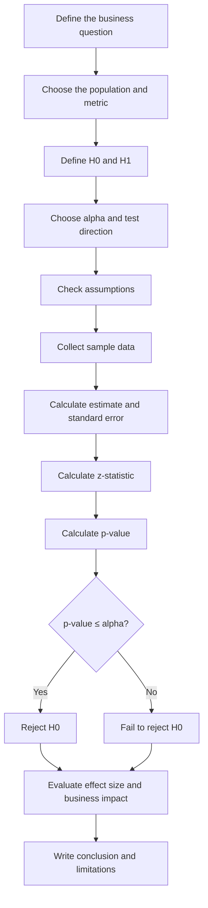

# 027 — z-Test

**Course:** 01 — Math, Statistics and Econometrics
**Module:** Module 02 — Statistics
**Content Group:** Testing and Experiments
**Roadmap Source:** Statistics / Testing and Experiments
**Lesson Type:** Statistics
**Order in Module:** 027
**Suggested Duration:** 24 minutes

---

## 1. Summary

A **z-test** is a statistical hypothesis test used to determine whether a sample statistic is significantly different from a population value or whether two groups are significantly different from each other.

The z-test measures how far an observed result is from the value expected under the null hypothesis, expressed in units of **standard error**.

In AI and Data Science, a z-test can help answer questions such as:

* Is a new model's accuracy significantly higher than the baseline accuracy?
* Did a new recommendation algorithm improve the conversion rate?
* Is the average response time after deployment different from the previous average?
* Is the difference between two A/B test conversion rates statistically significant?
* Is the observed failure rate significantly higher than the expected failure rate?

The general workflow is:

```text
Question
   ↓
Define hypotheses
   ↓
Collect a representative sample
   ↓
Calculate the z-statistic
   ↓
Calculate the p-value
   ↓
Compare with significance level
   ↓
Make a statistical and business decision
```

A z-test is commonly used when:

1. The sample size is sufficiently large.
2. Observations are independent.
3. The population standard deviation is known, or the large-sample approximation is reasonable.
4. The sampling distribution of the statistic is approximately normal.

---

## 2. Learning Objectives

After completing this lesson, you should be able to:

* Explain the z-test in your own words.
* Define null and alternative hypotheses.
* Calculate a z-statistic.
* Interpret a p-value and significance level.
* Distinguish between one-tailed and two-tailed z-tests.
* Perform one-sample and two-sample z-tests.
* Perform a z-test for proportions.
* Explain the assumptions behind a z-test.
* Distinguish statistical significance from business significance.
* Apply a z-test to an AI, product, or A/B testing problem.
* Implement a z-test in Python.
* Write a clear statistical conclusion for business stakeholders.

---

## 3. Why the z-Test Matters in AI and Data Science

Data dashboards often show that one number is larger than another.

For example:

```text
Old conversion rate: 10.0%
New conversion rate: 10.8%
```

The new version appears better, but the difference may be caused by random sampling variation.

A statistical test helps answer:

> Is the observed difference large enough to be unlikely under random chance?

The z-test converts an observed difference into a standardized statistic:

$$
z = \frac{\text{Observed statistic} - \text{Expected statistic}} {\text{Standard error}}
$$

The resulting z-score represents how many standard errors the observation is away from the value expected under the null hypothesis.

For example:

* (z = 0): the observed result equals the null hypothesis value.
* (z = 1): the result is one standard error above the null value.
* (z = -2): the result is two standard errors below the null value.
* A large absolute z-score provides stronger evidence against the null hypothesis.

---

## 4. Core Concepts

### 4.1 Population and Sample

A **population** is the complete group that we want to study.

Examples:

* All users of an application.
* All transactions processed by a payment platform.
* All predictions made by a deployed model.
* All API requests received by a service.

A **sample** is a subset of the population used for analysis.

```text
Population
├── User 1
├── User 2
├── User 3
├── ...
└── User N

        Sampling

Sample
├── User 3
├── User 18
├── User 42
└── User 87
```

The purpose of hypothesis testing is to use sample evidence to make a decision about the population.

---

### 4.2 Null Hypothesis

The **null hypothesis**, written as (H_0), usually represents:

* No change.
* No difference.
* No improvement.
* No relationship.
* The current or baseline value remains true.

Example:

$$
H_0:\mu = 500
$$

This means the population mean is assumed to be 500 unless the sample provides sufficient evidence against it.

---

### 4.3 Alternative Hypothesis

The **alternative hypothesis**, written as (H_1) or (H_a), represents the claim we want to investigate.

Examples:

#### Two-sided alternative

$$
H_1:\mu \neq 500
$$

The population mean may be either greater than or less than 500.

#### Right-tailed alternative

$$
H_1:\mu > 500
$$

The population mean is greater than 500.

#### Left-tailed alternative

$$
H_1:\mu < 500
$$

The population mean is less than 500.

---

### 4.4 Significance Level

The **significance level**, denoted by (\alpha), is the probability threshold used to decide whether the evidence against the null hypothesis is strong enough.

A common choice is:

$$
\alpha = 0.05
$$

This represents a 5% tolerance for a Type I error.

Typical values include:

$$
\alpha \in {0.10,\ 0.05,\ 0.01}
$$

A smaller significance level requires stronger evidence before rejecting the null hypothesis.

---

### 4.5 p-Value

The **p-value** is the probability of observing a result at least as extreme as the sample result, assuming that the null hypothesis is true.

Decision rule:

$$
\text{If } p \leq \alpha, \quad \text{reject } H_0
$$

$$
\text{If } p > \alpha, \quad \text{fail to reject } H_0
$$

Important:

> Failing to reject the null hypothesis does not prove that the null hypothesis is true.

It only means that the available evidence is not strong enough to reject it.

---

## 5. The General z-Test Formula

The general z-statistic is:

$$
z = \frac{\text{Observed value} - \text{Expected value under }H_0} {\text{Standard error}}
$$

It can also be written as:

$$
z = \frac{\hat{\theta}-\theta_0} {\text{SE}(\hat{\theta})}
$$

where:

* (\hat{\theta}) is the statistic estimated from the sample.
* (\theta_0) is the value assumed by the null hypothesis.
* (\text{SE}(\hat{\theta})) is the standard error of the statistic.

The specific formula depends on whether we are testing:

* One population mean.
* Two population means.
* One population proportion.
* Two population proportions.

---

## 6. Standard Error

The **standard error** measures how much a sample statistic is expected to vary across repeated samples.

For a sample mean:

$$
\text{SE}(\bar{x}) = \frac{\sigma}{\sqrt{n}}
$$

where:

* (\sigma) is the population standard deviation.
* (n) is the sample size.

As the sample size increases:

$$
n \uparrow \quad\Longrightarrow\quad \text{SE} \downarrow
$$

Therefore, larger samples usually produce more precise estimates.

### Standard error relationship

```text
Small sample
   ↓
Large standard error
   ↓
More uncertainty

Large sample
   ↓
Small standard error
   ↓
More precision
```

However, a large sample does not automatically remove:

* Selection bias.
* Measurement errors.
* Confounding.
* Data leakage.
* Poor experimental design.

---

## 7. Standard Normal Distribution

The z-test uses the **standard normal distribution**:

$$
Z \sim \mathcal{N}(0,1)
$$

It has:

$$
\mu_Z = 0
$$

and:

$$
\sigma_Z = 1
$$

A z-score indicates the number of standard deviations or standard errors from the center of the distribution.

```text
Probability density
       ^
       |
       |                   .
       |                .     .
       |              .         .
       |            .             .
       |__________._________________.__________> z
               -1.96      0       1.96

         Reject H₀          Reject H₀
          2.5%                2.5%
```

For a two-sided test with:

$$
\alpha = 0.05
$$

the critical z-values are approximately:

$$
z_{\alpha/2} = \pm 1.96
$$

The null hypothesis is rejected when:

$$
|z| > 1.96
$$

---

## 8. One-Tailed and Two-Tailed Tests

### 8.1 Two-Tailed Test

Use a two-tailed test when a difference in either direction matters.

Hypotheses:

$$
H_0:\mu=\mu_0
$$

$$
H_1:\mu\neq\mu_0
$$

Decision rule for (\alpha=0.05):

$$
z < -1.96 \quad\text{or}\quad z > 1.96
$$

Equivalent form:

$$
|z| > 1.96
$$

Example question:

> Has the average API latency changed from 300 milliseconds?

Both an increase and a decrease are considered meaningful.

---

### 8.2 Right-Tailed Test

Use a right-tailed test when only an increase matters.

Hypotheses:

$$
H_0:\mu\leq\mu_0
$$

$$
H_1:\mu>\mu_0
$$

For:

$$
\alpha=0.05
$$

the critical value is approximately:

$$
z_{0.05}=1.645
$$

Reject the null hypothesis when:

$$
z > 1.645
$$

Example question:

> Did the new ranking model increase average revenue per user?

---

### 8.3 Left-Tailed Test

Use a left-tailed test when only a decrease matters.

Hypotheses:

$$
H_0:\mu\geq\mu_0
$$

$$
H_1:\mu<\mu_0
$$

For:

$$
\alpha=0.05
$$

reject the null hypothesis when:

$$
z < -1.645
$$

Example question:

> Did the optimization reduce average inference latency?

---

## 9. Critical Values

Common critical z-values are:

| Significance level | One-tailed critical value | Two-tailed critical values |
| -----------------: | ------------------------: | -------------------------: |
|             (0.10) |                   (1.282) |                 (\pm1.645) |
|             (0.05) |                   (1.645) |                 (\pm1.960) |
|             (0.01) |                   (2.326) |                 (\pm2.576) |

For left-tailed tests, use the corresponding negative value.

For example:

$$
\alpha=0.05
$$

Left-tailed:

$$
z_{\text{critical}}=-1.645
$$

Right-tailed:

$$
z_{\text{critical}}=1.645
$$

Two-tailed:

$$
z_{\text{critical}}=\pm1.96
$$

---

## 10. One-Sample z-Test for a Mean

A one-sample z-test compares a sample mean with a known or hypothesized population mean.

### 10.1 Hypotheses

$$
H_0:\mu=\mu_0
$$

$$
H_1:\mu\neq\mu_0
$$

The alternative may also be one-sided.

---

### 10.2 Formula

$$
z = \frac{\bar{x}-\mu_0} {\sigma/\sqrt{n}}
$$

where:

* (\bar{x}) is the sample mean.
* (\mu_0) is the hypothesized population mean.
* (\sigma) is the known population standard deviation.
* (n) is the sample size.

---

### 10.3 Example: API Response Time

Suppose the historical average API response time is:

$$
\mu_0=500\text{ ms}
$$

A sample of:

$$
n=100
$$

requests has:

$$
\bar{x}=480\text{ ms}
$$

Assume the known population standard deviation is:

$$
\sigma=80\text{ ms}
$$

We want to test whether the average response time has changed.

#### Step 1: Define hypotheses

$$
H_0:\mu=500
$$

$$
H_1:\mu\neq500
$$

#### Step 2: Calculate the standard error

$$
\text{SE} = \frac{80}{\sqrt{100}}
$$

$$
\text{SE} = \frac{80}{10} = 8
$$

#### Step 3: Calculate the z-statistic

$$
z = \frac{480-500}{8}
$$

$$
z=-2.5
$$

#### Step 4: Compare with the critical value

For a two-sided test at:

$$
\alpha=0.05
$$

the critical values are:

$$
\pm1.96
$$

Since:

$$
|-2.5|>1.96
$$

we reject the null hypothesis.

#### Statistical conclusion

There is statistically significant evidence that the average API response time differs from 500 milliseconds.

#### Business conclusion

The sample indicates an average reduction of:

$$
500-480=20\text{ ms}
$$

However, the team should still determine whether a 20-millisecond improvement is operationally meaningful.

---

## 11. Confidence Interval for a Population Mean

A confidence interval provides a range of plausible values for the population mean.

When the population standard deviation is known:

$$
\bar{x} \pm z_{\alpha/2} \frac{\sigma}{\sqrt{n}}
$$

For a 95% confidence interval:

$$
z_{\alpha/2}=1.96
$$

Using the API latency example:

$$
480 \pm 1.96 \left(\frac{80}{\sqrt{100}}\right)
$$

$$
480\pm1.96(8)
$$

$$
480\pm15.68
$$

Therefore:

$$
[464.32,\ 495.68]
$$

Because 500 milliseconds is outside this interval, the result is consistent with rejecting:

$$
H_0:\mu=500
$$

---

## 12. Two-Sample z-Test for Means

A two-sample z-test compares the means of two independent populations.

### 12.1 Hypotheses

$$
H_0:\mu_1-\mu_2=0
$$

$$
H_1:\mu_1-\mu_2\neq0
$$

---

### 12.2 Formula

When the population standard deviations are known:

$$
z = \frac{(\bar{x}_1-\bar{x}_2)-\Delta_0} {\sqrt{ \frac{\sigma_1^2}{n_1} + \frac{\sigma_2^2}{n_2} }}
$$

where:

* (\bar{x}_1) is the mean of sample 1.
* (\bar{x}_2) is the mean of sample 2.
* (\sigma_1) and (\sigma_2) are population standard deviations.
* (n_1) and (n_2) are sample sizes.
* (\Delta_0) is the hypothesized difference, usually zero.

When:

$$
\Delta_0=0
$$

the formula becomes:

$$
z = \frac{\bar{x}_1-\bar{x}_2} {\sqrt{ \frac{\sigma_1^2}{n_1} + \frac{\sigma_2^2}{n_2} }}
$$

---

### 12.3 Example: Model Inference Latency

Suppose two model-serving systems are compared.

#### System A

$$
\bar{x}_A=210\text{ ms}
$$

$$
\sigma_A=40\text{ ms}
$$

$$
n_A=200
$$

#### System B

$$
\bar{x}_B=225\text{ ms}
$$

$$
\sigma_B=50\text{ ms}
$$

$$
n_B=250
$$

The standard error is:

$$
\text{SE} = \sqrt{ \frac{40^2}{200} + \frac{50^2}{250} } = \sqrt{ \frac{1600}{200} + \frac{2500}{250} } = \sqrt{8+10} = \sqrt{18} \approx4.243
$$

The z-statistic is:

$$
z = \frac{210-225}{4.243}
$$

$$
z\approx-3.535
$$

Since:

$$
|-3.535|>1.96
$$

the difference is statistically significant at the 5% level.

The estimated latency reduction is:

$$
225-210=15\text{ ms}
$$

The business team should evaluate whether this reduction justifies deployment cost, engineering effort, and infrastructure changes.

---

## 13. One-Sample z-Test for a Proportion

A one-sample proportion z-test compares an observed sample proportion with a hypothesized population proportion.

### 13.1 Hypotheses

$$
H_0:p=p_0
$$

$$
H_1:p\neq p_0
$$

---

### 13.2 Sample Proportion

If (x) successes occur in (n) observations:

$$
\hat{p} = \frac{x}{n}
$$

---

### 13.3 Standard Error Under the Null Hypothesis

$$
\text{SE}_0 = \sqrt{ \frac{p_0(1-p_0)}{n} }
$$

---

### 13.4 z-Test Formula

$$
z = \frac{\hat{p}-p_0} {\sqrt{ \frac{p_0(1-p_0)}{n} }}
$$

---

### 13.5 Example: Model Accuracy

A production classification model is expected to have an accuracy of:

$$
p_0=0.80
$$

It is evaluated on:

$$
n=1000
$$

independent observations and correctly predicts:

$$
x=830
$$

cases.

The observed accuracy is:

$$
\hat{p} = # \frac{830}{1000} 0.83
$$

Hypotheses:

$$
H_0:p=0.80
$$

$$
H_1:p>0.80
$$

Calculate the null standard error:

$$
\text{SE}_0 = \sqrt{ \frac{0.80(1-0.80)}{1000} } = \sqrt{ \frac{0.16}{1000} } = \sqrt{0.00016}
$$

$$
\approx0.01265
$$

Calculate the z-statistic:

$$
z = \frac{0.83-0.80}{0.01265}
$$

$$
z\approx2.372
$$

For a right-tailed test with:

$$
\alpha=0.05
$$

the critical value is:

$$
1.645
$$

Since:

$$
2.372>1.645
$$

we reject the null hypothesis.

There is statistically significant evidence that the model accuracy is greater than 80%.

---

## 14. Two-Proportion z-Test

The two-proportion z-test is widely used in A/B testing.

It compares the success proportions of two independent groups.

Examples:

* Conversion rate in control versus treatment.
* Click-through rate for two recommendation systems.
* Error rate before and after a deployment.
* Retention rate for two onboarding flows.
* Fraud detection rate for two models.

---

### 14.1 Hypotheses

$$
H_0:p_1=p_2
$$

or:

$$
H_0:p_1-p_2=0
$$

For a two-sided test:

$$
H_1:p_1\neq p_2
$$

For a right-tailed test:

$$
H_1:p_1>p_2
$$

---

### 14.2 Sample Proportions

For group 1:

$$
\hat{p}_1 = \frac{x_1}{n_1}
$$

For group 2:

$$
\hat{p}_2 = \frac{x_2}{n_2}
$$

---

### 14.3 Pooled Proportion

Under the null hypothesis that the two proportions are equal, calculate the pooled proportion:

$$
\hat{p} = \frac{x_1+x_2} {n_1+n_2}
$$

---

### 14.4 Pooled Standard Error

$$
\text{SE}_{\text{pooled}} = \sqrt{ \hat{p}(1-\hat{p}) \left( \frac{1}{n_1} + \frac{1}{n_2} \right) }
$$

---

### 14.5 z-Statistic

$$
z = \frac{\hat{p}_1-\hat{p}_2} { \sqrt{ \hat{p}(1-\hat{p}) \left( \frac{1}{n_1} + \frac{1}{n_2} \right) } }
$$

---

## 15. A/B Test Example: Conversion Rate

Suppose an e-commerce company compares two checkout designs.

### Control Group A

$$
n_A=5000
$$

$$
x_A=500
$$

$$
\hat{p}_A = # \frac{500}{5000} 0.10
$$

### Treatment Group B

$$
n_B=5000
$$

$$
x_B=575
$$

$$
\hat{p}_B = # \frac{575}{5000} 0.115
$$

The observed absolute difference is:

$$
\hat{p}_B-\hat{p}_A = # 0.115-0.10 0.015
$$

Therefore, the treatment improved conversion by:

$$
1.5\text{ percentage points}
$$

The relative uplift is:

$$
\frac{0.115-0.10}{0.10} \times100% = 15%
$$

---

### 15.1 Define Hypotheses

Suppose the company wants to determine whether treatment B has a different conversion rate.

$$
H_0:p_A=p_B
$$

$$
H_1:p_A\neq p_B
$$

---

### 15.2 Calculate the Pooled Proportion

$$
\hat{p} = \frac{500+575}{5000+5000} = \frac{1075}{10000}
$$

$$
=0.1075
$$

---

### 15.3 Calculate the Pooled Standard Error

$$
\text{SE} = \sqrt{ 0.1075(1-0.1075) \left( \frac{1}{5000} + \frac{1}{5000} \right) } = \sqrt{ 0.1075(0.8925)(0.0004) }
$$

$$
\approx0.006195
$$

---

### 15.4 Calculate the z-Statistic

Using treatment minus control:

$$
z = \frac{0.115-0.10}{0.006195}
$$

$$
z\approx2.421
$$

For a two-sided test with:

$$
\alpha=0.05
$$

the critical value is:

$$
1.96
$$

Since:

$$
|2.421|>1.96
$$

we reject the null hypothesis.

---

### 15.5 Statistical Conclusion

There is statistically significant evidence that the conversion rates of designs A and B are different.

---

### 15.6 Business Conclusion

Treatment B increased conversion from 10% to 11.5%.

This is:

* An absolute increase of 1.5 percentage points.
* A relative increase of 15%.

Before a full rollout, the team should also evaluate:

* Revenue per conversion.
* Refund rate.
* Customer complaints.
* Page latency.
* Long-term retention.
* Experiment cost.
* Segment-specific effects.
* Guardrail metrics.

---

## 16. Confidence Interval for the Difference Between Two Proportions

For estimation, the unpooled standard error is commonly used:

$$
\text{SE}_{\text{unpooled}} = \sqrt{ \frac{\hat{p}_1(1-\hat{p}_1)}{n_1} + \frac{\hat{p}_2(1-\hat{p}_2)}{n_2} }
$$

A confidence interval for the difference is:

$$
(\hat{p}_1-\hat{p}_2) \pm z_{\alpha/2} \text{SE}_{\text{unpooled}}
$$

For the A/B example:

$$
\text{SE}_{\text{unpooled}} = \sqrt{ \frac{0.115(0.885)}{5000} + \frac{0.10(0.90)}{5000} }
$$

$$
\approx0.006195
$$

The 95% confidence interval is:

$$
0.015 \pm 1.96(0.006195)
$$

$$
0.015 \pm 0.012142
$$

Therefore:

$$
[0.002858,\ 0.027142]
$$

Expressed in percentage points:

$$
[0.286,\ 2.714]
$$

This interval does not contain zero, which is consistent with rejecting the null hypothesis.

---

## 17. Relative Uplift Versus Absolute Difference

A/B test results are often presented using both absolute and relative changes.

### Absolute difference

$$
\text{Absolute difference} = \hat{p}_B-\hat{p}_A
$$

For the example:

$$
0.115-0.10=0.015
$$

This is a:

$$
1.5\text{ percentage-point increase}
$$

### Relative uplift

$$
\text{Relative uplift} = \frac{\hat{p}_B-\hat{p}_A}{\hat{p}_A} = # \frac{0.015}{0.10} 0.15
$$

Therefore:

$$
\text{Relative uplift}=15%
$$

These values should not be confused:

```text
From 10% to 11.5%

Absolute increase: 1.5 percentage points
Relative increase: 15%
```

---

## 18. Assumptions of the z-Test

A z-test is valid only when its assumptions are reasonably satisfied.

### 18.1 Independent Observations

Each observation should be independent of the others.

Potential violations include:

* The same user appears multiple times.
* Multiple events come from the same household.
* Repeated measurements are treated as independent.
* Sessions are analyzed instead of users.
* Social-network users influence one another.
* Geographic clusters share external effects.

If independence is violated, the standard error may be underestimated.

---

### 18.2 Random or Representative Sampling

The sample should reasonably represent the target population.

Bias may occur when:

* Only highly active users are sampled.
* Only one country is included.
* Weekend traffic is excluded.
* Mobile users are excluded.
* Failed requests are removed.
* Certain model outputs are manually filtered.

A large biased sample remains biased.

---

### 18.3 Normality or Large-Sample Approximation

For means, the sample mean should be approximately normally distributed.

The Central Limit Theorem often supports this when the sample size is sufficiently large:

$$
\bar{X} \approx \mathcal{N} \left( \mu, \frac{\sigma^2}{n} \right)
$$

For proportions, the normal approximation is usually considered reasonable when expected counts are sufficiently large.

For a one-sample proportion test:

$$
np_0 \geq 10
$$

and:

$$
n(1-p_0)\geq10
$$

For two-proportion tests, each group should have enough expected successes and failures.

---

### 18.4 Known Population Standard Deviation

The classical one-sample mean z-test assumes the population standard deviation is known.

In practice, the population standard deviation is often unknown.

If the population standard deviation is unknown and the sample is small, a **t-test** is generally more appropriate.

---

### 18.5 Correct Experimental Unit

The analysis unit must match the randomization unit.

For example:

```text
Randomization unit: user
Analysis unit: user       ✓

Randomization unit: user
Analysis unit: session    ⚠
```

Using sessions as independent observations when users were randomized may produce artificially small standard errors.

---

## 19. z-Test Versus t-Test

Both tests compare observed statistics with values expected under a null hypothesis.

| Criterion                     | z-Test                        | t-Test                        |
| ----------------------------- | ----------------------------- | ----------------------------- |
| Population standard deviation | Usually known                 | Usually unknown               |
| Reference distribution        | Standard normal               | Student's t                   |
| Small samples                 | Less appropriate              | More appropriate              |
| Large samples                 | Commonly appropriate          | Also appropriate              |
| Tail thickness                | Thinner                       | Heavier                       |
| Common use                    | Proportions and large samples | Means with estimated variance |

The one-sample t-statistic is:

$$
t = \frac{\bar{x}-\mu_0} {s/\sqrt{n}}
$$

where (s) is the sample standard deviation.

As the degrees of freedom increase:

$$
t_{\nu} \rightarrow \mathcal{N}(0,1)
$$

Therefore, the t-distribution approaches the standard normal distribution for large samples.

### Practical decision guide

```text
Are you testing a proportion?
        |
        ├── Yes → z-test is commonly used
        |
        └── No → Are you testing a mean?
                    |
                    ├── Population σ known → z-test
                    |
                    └── Population σ unknown → t-test
```

---

## 20. Errors in Hypothesis Testing

A statistical decision can be correct or incorrect.

| Reality        | Fail to reject (H_0) | Reject (H_0)     |
| -------------- | -------------------- | ---------------- |
| (H_0) is true  | Correct decision     | Type I error     |
| (H_0) is false | Type II error        | Correct decision |

---

### 20.1 Type I Error

A Type I error occurs when we reject a true null hypothesis.

$$
P(\text{Type I error})=\alpha
$$

Example:

The team concludes that the new model improves conversion, but it actually does not.

This is a false positive.

---

### 20.2 Type II Error

A Type II error occurs when we fail to reject a false null hypothesis.

$$
P(\text{Type II error})=\beta
$$

Example:

The new recommendation system truly improves conversion, but the experiment fails to detect it.

This is a false negative.

---

### 20.3 Statistical Power

Statistical power is the probability of detecting a true effect.

$$
\text{Power}=1-\beta
$$

A common target is:

$$
\text{Power}=0.80
$$

Power tends to increase when:

* Sample size increases.
* The true effect becomes larger.
* Measurement noise decreases.
* The significance threshold becomes less strict.
* Experimental design becomes more efficient.

---

## 21. Statistical Significance Versus Practical Significance

A statistically significant result is not automatically valuable.

For example, suppose a new model decreases average latency from:

$$
200.0\text{ ms}
$$

to:

$$
199.7\text{ ms}
$$

With millions of requests, the difference may be statistically significant.

However, the improvement is only:

$$
0.3\text{ ms}
$$

The engineering cost may exceed the practical benefit.

A complete decision should consider:

$$
\text{Decision} = f( \text{statistical evidence}, \text{effect size}, \text{business value}, \text{risk}, \text{cost} )
$$

Good reporting includes:

* Sample size.
* Point estimate.
* Absolute difference.
* Relative difference.
* Confidence interval.
* p-value.
* Business impact.
* Guardrail metrics.
* Known limitations.

---

## 22. Minimum Detectable Effect

The **minimum detectable effect**, or MDE, is the smallest effect that an experiment is designed to detect with a chosen power and significance level.

For a two-group proportion experiment with equal sample sizes, a rough approximation is:

$$
n \approx \frac{ 2\bar{p}(1-\bar{p}) \left( z_{1-\alpha/2} + z_{1-\beta} \right)^2 } {\delta^2}
$$

where:

* (n) is the approximate sample size per group.
* (\bar{p}) is the expected baseline proportion.
* (\delta) is the minimum detectable absolute difference.
* (\alpha) is the significance level.
* (1-\beta) is statistical power.

Important relationship:

$$
\delta \downarrow \quad\Longrightarrow\quad n \uparrow
$$

Detecting smaller effects requires larger samples.

---

## 23. Multiple Comparisons

When many hypotheses are tested, the probability of false positives increases.

Suppose 20 independent tests are performed with:

$$
\alpha=0.05
$$

The probability of at least one false positive is approximately:

$$
1-(1-\alpha)^{20} = 1-0.95^{20}
$$

$$
\approx0.642
$$

Therefore, there is approximately a 64.2% probability of at least one false positive under the global null.

Possible corrections include:

### Bonferroni correction

$$
\alpha_{\text{adjusted}} = \frac{\alpha}{m}
$$

where (m) is the number of tests.

### Holm correction

A sequential procedure that is usually less conservative than Bonferroni.

### False Discovery Rate

Procedures such as Benjamini–Hochberg control the expected proportion of false discoveries.

Multiple-testing corrections are important when:

* Testing many model variants.
* Examining many user segments.
* Comparing many metrics.
* Trying multiple feature definitions.
* Repeatedly checking experiment results.

---

## 24. Repeated Peeking and Sequential Testing

Repeatedly checking the p-value and stopping when it becomes significant increases the false-positive rate.

Unsafe workflow:

```text
Run experiment
   ↓
Check p-value every hour
   ↓
Stop immediately when p < 0.05
   ↓
Inflated false-positive risk
```

Safer alternatives include:

* Predefine the sample size.
* Predefine the experiment duration.
* Predefine the primary metric.
* Use a validated sequential testing method.
* Use alpha-spending procedures.
* Use confidence sequences.
* Record the analysis plan before viewing the result.

---

## 25. Sample Ratio Mismatch

In an A/B test, the observed allocation should be close to the planned allocation.

For example, if the expected split is:

```text
Control:   50%
Treatment: 50%
```

but the observed split is:

```text
Control:   62%
Treatment: 38%
```

there may be a **sample ratio mismatch**.

Possible causes include:

* Broken randomization.
* Logging errors.
* Bot traffic.
* Eligibility differences.
* Missing events.
* Caching behavior.
* Platform-specific assignment problems.

A statistically significant experiment result should not be trusted until allocation problems are investigated.

---

## 26. Common z-Test Workflow



---

## 27. Manual Python Implementation

### 27.1 One-Sample z-Test for a Mean

```python
from math import sqrt
from statistics import NormalDist

sample_mean = 480.0
population_mean = 500.0
population_std = 80.0
sample_size = 100
alpha = 0.05

standard_error = population_std / sqrt(sample_size)

z_statistic = (
    sample_mean - population_mean
) / standard_error

# Two-sided p-value
standard_normal = NormalDist()

p_value = 2 * (
    1 - standard_normal.cdf(abs(z_statistic))
)

print(f"Standard error: {standard_error:.4f}")
print(f"z-statistic: {z_statistic:.4f}")
print(f"p-value: {p_value:.6f}")

if p_value <= alpha:
    print("Reject the null hypothesis.")
else:
    print("Fail to reject the null hypothesis.")
```

Expected result:

```text
Standard error: 8.0000
z-statistic: -2.5000
p-value: approximately 0.0124
Reject the null hypothesis.
```

---

### 27.2 One-Sample Proportion z-Test

```python
from math import sqrt
from statistics import NormalDist

successes = 830
sample_size = 1000
null_proportion = 0.80
alpha = 0.05

sample_proportion = successes / sample_size

standard_error_null = sqrt(
    null_proportion
    * (1 - null_proportion)
    / sample_size
)

z_statistic = (
    sample_proportion - null_proportion
) / standard_error_null

# Right-tailed p-value
p_value = 1 - NormalDist().cdf(z_statistic)

print(f"Observed proportion: {sample_proportion:.4f}")
print(f"z-statistic: {z_statistic:.4f}")
print(f"p-value: {p_value:.6f}")

if p_value <= alpha:
    print("Reject the null hypothesis.")
else:
    print("Fail to reject the null hypothesis.")
```

---

### 27.3 Two-Proportion z-Test from Scratch

```python
from math import sqrt
from statistics import NormalDist

control_successes = 500
control_size = 5000

treatment_successes = 575
treatment_size = 5000

alpha = 0.05

control_rate = control_successes / control_size
treatment_rate = treatment_successes / treatment_size

pooled_rate = (
    control_successes + treatment_successes
) / (
    control_size + treatment_size
)

standard_error = sqrt(
    pooled_rate
    * (1 - pooled_rate)
    * (
        1 / control_size
        + 1 / treatment_size
    )
)

z_statistic = (
    treatment_rate - control_rate
) / standard_error

p_value = 2 * (
    1 - NormalDist().cdf(abs(z_statistic))
)

absolute_difference = treatment_rate - control_rate
relative_uplift = absolute_difference / control_rate

print(f"Control rate: {control_rate:.4%}")
print(f"Treatment rate: {treatment_rate:.4%}")
print(f"Absolute difference: {absolute_difference:.4%}")
print(f"Relative uplift: {relative_uplift:.2%}")
print(f"z-statistic: {z_statistic:.4f}")
print(f"p-value: {p_value:.6f}")

if p_value <= alpha:
    print("Reject the null hypothesis.")
else:
    print("Fail to reject the null hypothesis.")
```

---

## 28. Two-Proportion z-Test with `statsmodels`

```python
import numpy as np
from statsmodels.stats.proportion import proportions_ztest

successes = np.array([575, 500])
observations = np.array([5000, 5000])

z_statistic, p_value = proportions_ztest(
    count=successes,
    nobs=observations,
    alternative="two-sided",
)

print(f"z-statistic: {z_statistic:.4f}")
print(f"p-value: {p_value:.6f}")
```

Possible values for `alternative` include:

```python
alternative="two-sided"
alternative="larger"
alternative="smaller"
```

The group order matters for one-sided alternatives.

For example:

```python
successes = np.array([
    treatment_successes,
    control_successes,
])
```

With:

```python
alternative="larger"
```

the test investigates whether the treatment proportion is larger than the control proportion.

---

## 29. Confidence Interval in Python

```python
from math import sqrt
from statistics import NormalDist

control_successes = 500
control_size = 5000

treatment_successes = 575
treatment_size = 5000

alpha = 0.05

control_rate = control_successes / control_size
treatment_rate = treatment_successes / treatment_size

difference = treatment_rate - control_rate

standard_error_unpooled = sqrt(
    treatment_rate
    * (1 - treatment_rate)
    / treatment_size
    +
    control_rate
    * (1 - control_rate)
    / control_size
)

critical_value = NormalDist().inv_cdf(
    1 - alpha / 2
)

margin_of_error = (
    critical_value
    * standard_error_unpooled
)

lower_bound = difference - margin_of_error
upper_bound = difference + margin_of_error

print(f"Difference: {difference:.4%}")
print(
    "95% confidence interval: "
    f"[{lower_bound:.4%}, {upper_bound:.4%}]"
)
```

---

## 30. Reusable Python Function

```python
from dataclasses import dataclass
from math import sqrt
from statistics import NormalDist


@dataclass
class ProportionZTestResult:
    rate_a: float
    rate_b: float
    difference: float
    relative_uplift: float
    standard_error: float
    z_statistic: float
    p_value: float
    reject_null: bool


def two_proportion_z_test(
    successes_a: int,
    observations_a: int,
    successes_b: int,
    observations_b: int,
    alpha: float = 0.05,
) -> ProportionZTestResult:
    if observations_a <= 0 or observations_b <= 0:
        raise ValueError(
            "Observation counts must be positive."
        )

    if not 0 <= successes_a <= observations_a:
        raise ValueError(
            "successes_a must be between 0 and observations_a."
        )

    if not 0 <= successes_b <= observations_b:
        raise ValueError(
            "successes_b must be between 0 and observations_b."
        )

    if not 0 < alpha < 1:
        raise ValueError(
            "alpha must be between 0 and 1."
        )

    rate_a = successes_a / observations_a
    rate_b = successes_b / observations_b

    pooled_rate = (
        successes_a + successes_b
    ) / (
        observations_a + observations_b
    )

    standard_error = sqrt(
        pooled_rate
        * (1 - pooled_rate)
        * (
            1 / observations_a
            + 1 / observations_b
        )
    )

    if standard_error == 0:
        raise ValueError(
            "The standard error is zero; "
            "the test cannot be calculated."
        )

    difference = rate_b - rate_a

    z_statistic = (
        difference / standard_error
    )

    p_value = 2 * (
        1 - NormalDist().cdf(abs(z_statistic))
    )

    relative_uplift = (
        difference / rate_a
        if rate_a != 0
        else float("inf")
    )

    return ProportionZTestResult(
        rate_a=rate_a,
        rate_b=rate_b,
        difference=difference,
        relative_uplift=relative_uplift,
        standard_error=standard_error,
        z_statistic=z_statistic,
        p_value=p_value,
        reject_null=p_value <= alpha,
    )


result = two_proportion_z_test(
    successes_a=500,
    observations_a=5000,
    successes_b=575,
    observations_b=5000,
)

print(result)
```

---

## 31. Example Dataset for Practice

```python
import numpy as np
import pandas as pd

rng = np.random.default_rng(seed=42)

sample_size_per_group = 5000

control = rng.binomial(
    n=1,
    p=0.10,
    size=sample_size_per_group,
)

treatment = rng.binomial(
    n=1,
    p=0.115,
    size=sample_size_per_group,
)

data = pd.DataFrame({
    "group": (
        ["control"] * sample_size_per_group
        + ["treatment"] * sample_size_per_group
    ),
    "converted": np.concatenate([
        control,
        treatment,
    ]),
})

summary = (
    data
    .groupby("group")
    .agg(
        users=("converted", "size"),
        conversions=("converted", "sum"),
        conversion_rate=("converted", "mean"),
    )
)

print(summary)
```

Example schema:

| Column      | Meaning                                  |
| ----------- | ---------------------------------------- |
| `group`     | Experiment assignment                    |
| `converted` | `1` if the user converted, otherwise `0` |

---

## 32. Visualizing Conversion Rates

```python
import matplotlib.pyplot as plt

conversion_rates = (
    data
    .groupby("group")["converted"]
    .mean()
)

conversion_rates.plot(
    kind="bar",
)

plt.title("Conversion Rate by Experiment Group")
plt.xlabel("Experiment Group")
plt.ylabel("Conversion Rate")
plt.xticks(rotation=0)
plt.tight_layout()
plt.show()
```

A chart is useful for communication, but it does not replace statistical testing.

```text
Chart
  ↓
Shows the observed difference

z-test
  ↓
Measures uncertainty around the difference

Business analysis
  ↓
Evaluates whether the difference matters
```

---

## 33. Reporting Template

A good statistical report should include more than the p-value.

```text
Experiment:
Checkout design A versus checkout design B

Primary metric:
Conversion rate

Sample:
A = 5,000 users
B = 5,000 users

Observed result:
A = 10.0%
B = 11.5%

Absolute difference:
+1.5 percentage points

Relative uplift:
+15.0%

Statistical result:
z = 2.42
p = 0.0155
alpha = 0.05

95% confidence interval:
Approximately +0.29 to +2.71 percentage points

Decision:
Reject the null hypothesis.

Business recommendation:
Consider a staged rollout after validating guardrail metrics,
segment consistency, experiment integrity, and implementation cost.
```

---

## 34. Common Mistakes

### 34.1 Using a z-Test with a Small Sample

The normal approximation may be poor when the sample contains too few observations, successes, or failures.

For proportion tests, check:

$$
np_0
$$

and:

$$
n(1-p_0)
$$

For very small samples, consider an exact method such as Fisher's exact test.

---

### 34.2 Confusing Statistical and Business Significance

A small p-value does not tell you whether the effect is valuable.

Always report:

* Effect size.
* Confidence interval.
* Cost.
* Risk.
* Expected business impact.

---

### 34.3 Treating the p-Value as the Probability That (H_0) Is True

Incorrect interpretation:

```text
p = 0.03 means there is a 3% probability that H₀ is true.
```

Correct interpretation:

```text
Assuming H₀ is true, the probability of observing a result
at least as extreme as this one is approximately 3%.
```

---

### 34.4 Saying That a Non-Significant Result Proves No Effect

A non-significant result may occur because:

* The true effect is zero.
* The sample is too small.
* The metric is noisy.
* The experiment has low power.
* The data is biased.
* The effect exists only in certain segments.

Use:

> We failed to reject the null hypothesis.

Avoid:

> We proved that there is no difference.

---

### 34.5 Choosing a One-Sided Test After Seeing the Data

The test direction should be chosen before analyzing results.

Changing from a two-sided test to a one-sided test after observing the direction of the effect increases false-positive risk.

---

### 34.6 Ignoring Multiple Comparisons

Testing many metrics or segments without correction can produce false discoveries.

Predefine:

* One primary metric.
* Key secondary metrics.
* Guardrail metrics.
* Adjustment procedures.

---

### 34.7 Ignoring Dependence

Repeated user events are not necessarily independent.

For example:

```text
1,000 users
10 sessions per user
10,000 sessions
```

The effective sample size is not automatically 10,000 independent observations.

---

### 34.8 Ignoring Experiment Integrity

A significant result may still be invalid because of:

* Sample ratio mismatch.
* Missing events.
* Tracking changes.
* Bot traffic.
* Cross-group contamination.
* Inconsistent eligibility rules.
* Feature exposure errors.

---

### 34.9 Running the Test Too Early

Small early samples produce unstable estimates.

Avoid stopping an experiment only because the current p-value falls below 0.05.

---

### 34.10 Reporting Only the p-Value

This statement is incomplete:

```text
The result is significant because p < 0.05.
```

A stronger report includes:

```text
Treatment increased conversion by 1.5 percentage points,
with a 95% confidence interval of approximately
0.29 to 2.71 percentage points.
The two-sided p-value was approximately 0.0155.
```

---

## 35. Applications in AI and Data Science

### 35.1 Model Accuracy Comparison

Test whether a new model achieves a higher correct-prediction proportion than a baseline.

Possible metric:

$$
\hat{p} = \frac{\text{Correct predictions}} {\text{Total predictions}}
$$

Caution:

Two model predictions on the same test examples are paired rather than independent. A paired method, such as McNemar's test, may be more appropriate.

---

### 35.2 Click-Through Rate

Compare click-through rates between two ranking or recommendation algorithms.

$$
\text{CTR} = \frac{\text{Clicks}} {\text{Impressions}}
$$

Potential issue:

Multiple impressions from the same user may violate independence.

---

### 35.3 Conversion Rate

Compare product, checkout, pricing, or onboarding variants.

$$
\text{Conversion rate} = \frac{\text{Converted users}} {\text{Eligible users}}
$$

---

### 35.4 Error Rate Monitoring

Test whether a production error rate exceeds a target threshold.

$$
H_0:p\leq p_0
$$

$$
H_1:p>p_0
$$

This can support quality-control or alerting systems.

---

### 35.5 Fraud Detection

Compare the proportion of correctly detected fraudulent transactions between model versions.

Important guardrails may include:

* False-positive rate.
* Customer friction.
* Manual-review volume.
* Financial loss.
* Segment fairness.

---

### 35.6 Latency Monitoring

Test whether average latency differs from an operational target.

$$
H_0:\mu=\mu_0
$$

However, latency data is often skewed. Means alone may hide tail behavior.

Also monitor:

* Median latency.
* p95 latency.
* p99 latency.
* Timeout rate.
* Error rate.

---

### 35.7 Data Drift Monitoring

A proportion z-test can detect changes in categorical feature frequencies.

Example:

$$
H_0:p_{\text{current}}=p_{\text{reference}}
$$

For many categories, a chi-square test may be more appropriate than running many separate z-tests.

---

## 36. When Not to Use a z-Test

A z-test may not be appropriate when:

* The sample is very small.
* Observations are dependent.
* The metric distribution is highly skewed.
* The population standard deviation is unknown and the sample is small.
* Expected success or failure counts are too low.
* The experiment uses paired observations.
* The data is clustered.
* The metric is ordinal rather than continuous.
* Randomization or logging is broken.
* The analysis was repeatedly modified after viewing results.

Possible alternatives include:

| Situation                           | Possible alternative              |
| ----------------------------------- | --------------------------------- |
| Unknown variance, small sample mean | t-test                            |
| Paired continuous data              | Paired t-test                     |
| Paired binary predictions           | McNemar's test                    |
| Very small categorical sample       | Fisher's exact test               |
| Multiple categories                 | Chi-square test                   |
| Strongly skewed independent samples | Mann–Whitney U test               |
| Paired non-normal samples           | Wilcoxon signed-rank test         |
| Clustered observations              | Cluster-robust methods            |
| Complex experiment design           | Regression or hierarchical models |
| Repeated monitoring                 | Sequential testing methods        |

---

## 37. Practical Exercise

### Scenario

A product team tests a new recommendation algorithm.

#### Control group

$$
n_A=8000
$$

$$
x_A=960
$$

#### Treatment group

$$
n_B=8200
$$

$$
x_B=1066
$$

Use:

$$
\alpha=0.05
$$

### Tasks

1. Calculate the conversion rate for each group.
2. Calculate the absolute difference.
3. Calculate the relative uplift.
4. Define the null and alternative hypotheses.
5. Calculate the pooled proportion.
6. Calculate the pooled standard error.
7. Calculate the z-statistic.
8. Calculate the two-sided p-value.
9. Construct a 95% confidence interval.
10. Write a statistical conclusion.
11. Write a business recommendation.
12. List at least three assumptions.
13. List at least three guardrail metrics.
14. Explain whether statistical significance would be sufficient for rollout.

---

## 38. Suggested Notebook Structure

```text
01. Problem statement
02. Metric definition
03. Hypotheses
04. Significance level
05. Dataset generation or loading
06. Data validation
07. Sample size summary
08. Experiment integrity checks
09. Group-level descriptive statistics
10. Assumption checks
11. z-test calculation
12. p-value
13. Confidence interval
14. Effect-size analysis
15. Visualization
16. Segment analysis
17. Guardrail metrics
18. Business conclusion
19. Limitations
20. Rollout recommendation
```

---

## 39. Suggested API Design

A small portfolio project could expose a z-test through an API.

### Endpoint

```http
POST /statistics/two-proportion-z-test
```

### Request

```json
{
  "group_a": {
    "successes": 500,
    "observations": 5000
  },
  "group_b": {
    "successes": 575,
    "observations": 5000
  },
  "alpha": 0.05,
  "alternative": "two-sided"
}
```

### Response

```json
{
  "rate_a": 0.1,
  "rate_b": 0.115,
  "absolute_difference": 0.015,
  "relative_uplift": 0.15,
  "z_statistic": 2.421,
  "p_value": 0.0155,
  "alpha": 0.05,
  "reject_null": true,
  "decision": "statistically_significant"
}
```

Useful validation rules include:

* `successes >= 0`
* `observations > 0`
* `successes <= observations`
* `0 < alpha < 1`
* Sufficient expected successes and failures.

---

## 40. Completion Checklist

* [ ] I can explain a z-test in one or two minutes.
* [ ] I can define (H_0) and (H_1).
* [ ] I understand one-tailed and two-tailed tests.
* [ ] I can calculate a standard error.
* [ ] I can calculate a z-statistic.
* [ ] I can interpret a p-value correctly.
* [ ] I can perform a one-sample mean z-test.
* [ ] I can perform a one-sample proportion z-test.
* [ ] I can perform a two-proportion z-test.
* [ ] I can construct a confidence interval.
* [ ] I understand Type I and Type II errors.
* [ ] I understand statistical power.
* [ ] I can distinguish statistical significance from business significance.
* [ ] I know when a t-test is more appropriate.
* [ ] I can identify independence and sampling assumptions.
* [ ] I can identify multiple-comparison risks.
* [ ] I can implement the test in Python.
* [ ] I can produce a notebook, chart, API, or portfolio note.
* [ ] I have documented at least one caveat or limitation.
* [ ] I can write a rollout recommendation using both statistics and business context.

---

## 41. Related Outcome

Use probability, sampling, descriptive statistics, hypothesis testing, confidence intervals, and A/B testing to make reliable decisions from data.

The expected workflow is:

```text
Raw data
   ↓
Validate experiment integrity
   ↓
Calculate descriptive metrics
   ↓
Quantify uncertainty
   ↓
Perform hypothesis test
   ↓
Estimate effect size
   ↓
Evaluate business impact
   ↓
Recommend rollout, iteration, or rejection
```

---

## 42. Related Project

### Mini Project: A/B Test Conversion Rate

Build a small statistical analysis project containing:

* A synthetic or real A/B testing dataset.
* Data-quality checks.
* Control and treatment summaries.
* A two-proportion z-test.
* Confidence intervals.
* Absolute and relative effect sizes.
* Conversion-rate visualization.
* Sample-size assumptions.
* Guardrail metrics.
* A rollout recommendation.
* A reproducible notebook.
* An optional FastAPI endpoint.
* An optional Docker service.

Suggested project structure:

```text
ab-test-z-test/
├── data/
│   └── experiment.csv
├── notebooks/
│   └── ab_test_analysis.ipynb
├── src/
│   ├── statistics.py
│   ├── validation.py
│   └── reporting.py
├── api/
│   └── main.py
├── tests/
│   └── test_statistics.py
├── README.md
├── requirements.txt
└── Dockerfile
```

---

## 43. Final Summary

A **z-test** evaluates whether an observed sample statistic is sufficiently far from a value expected under the null hypothesis.

The core idea is:

$$
z = \frac{\text{Observed difference}} {\text{Standard error}}
$$

A large absolute z-score indicates that the observed result would be unusual if the null hypothesis were true.

A complete analysis should not stop at:

```text
p < 0.05
```

It should include:

```text
Sample size
+ assumptions
+ observed metric
+ effect size
+ standard error
+ z-statistic
+ p-value
+ confidence interval
+ business impact
+ guardrail metrics
+ limitations
+ decision
```

The z-test is an important milestone in the AI and Data Science roadmap because it connects:

* Probability.
* Sampling.
* Uncertainty.
* Hypothesis testing.
* Experimentation.
* Model evaluation.
* Product decisions.
* Deployment monitoring.

Turn this topic into a notebook, experiment report, dashboard, API, Docker service, or portfolio project so that the concept becomes an applied data-science skill rather than only a mathematical formula.
