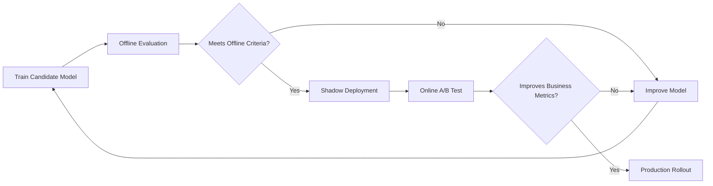
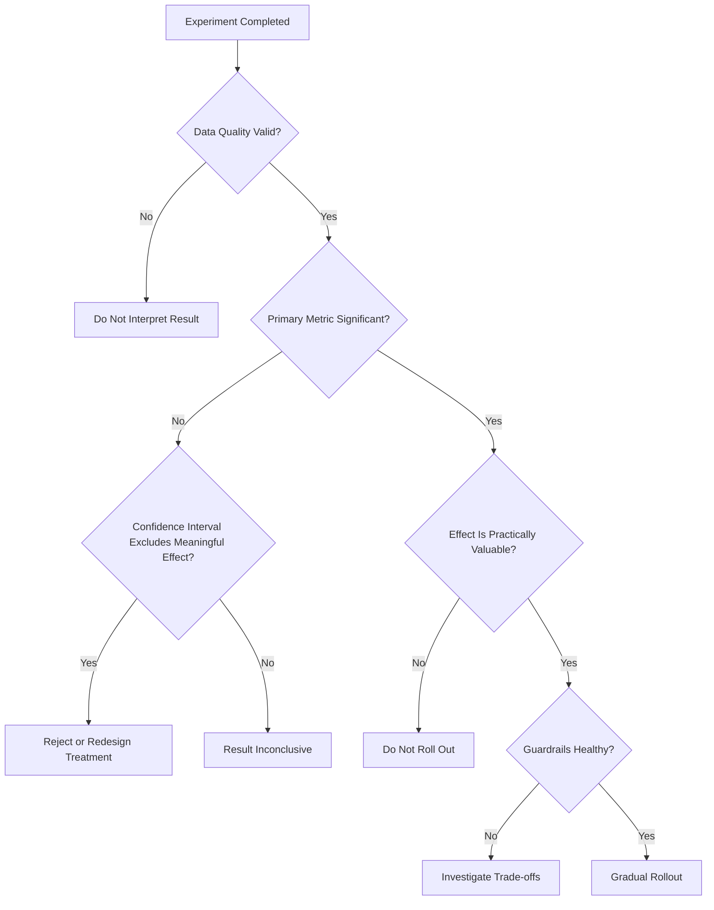

# 🧪 029 — A/B Testing

**Course:** 01 — Math, Statistics and Econometrics
**Module:** Module 02 — Statistics
**Content Group:** Testing and Experiments
**Roadmap Source:** Statistics / Testing and Experiments
**Lesson Type:** Statistics
**Order in Module:** 029
**Suggested Duration:** 24 minutes

---

## 1. 📌 Summary

**A/B Testing** is a controlled experiment used to compare two or more versions of a product, feature, model, interface, or business strategy.

The goal is to determine whether a proposed change produces a measurable improvement compared with the current version.

In a basic A/B test:

* **Variant A** is the control or current version.
* **Variant B** is the treatment or new version.
* Users are randomly assigned to one of the variants.
* A predefined metric is measured for each group.
* Statistical analysis is used to determine whether the observed difference is likely to be real.

Common A/B testing questions include:

* Does a new checkout page increase purchases?
* Does a new recommendation model improve click-through rate?
* Does a shorter registration form increase sign-ups?
* Does a new notification strategy improve user retention?
* Does a new machine learning model reduce prediction errors?
* Does a new pricing page increase revenue per visitor?

A/B testing is widely used in:

* Product development
* Digital marketing
* Machine learning deployment
* User experience design
* Recommendation systems
* Pricing experiments
* Email campaigns
* Model monitoring
* Conversion optimization

A reliable experiment should define the following elements **before launch**:

1. The business objective
2. The primary metric
3. The hypothesis
4. The sample size
5. The randomization method
6. The experiment duration
7. The significance level
8. The decision rule
9. The rollout strategy

---

## 2. 🎯 Learning Objectives

After completing this lesson, you should be able to:

* Explain A/B Testing in your own words.
* Identify the control group and treatment group.
* Define appropriate experiment metrics.
* Write null and alternative hypotheses.
* Estimate the required sample size.
* Randomly assign users to experiment variants.
* Calculate conversion rates and metric differences.
* Interpret p-values and confidence intervals.
* Distinguish statistical significance from practical significance.
* Identify common experiment design mistakes.
* Write a business recommendation based on experiment results.
* Connect A/B Testing to AI and Data Science workflows.
* Build a small experiment notebook, dashboard, API, or portfolio project.

---

## 3. 🧠 What Is A/B Testing?

A/B Testing is a randomized controlled experiment that compares the performance of different variants.

Suppose an e-commerce company wants to test a new checkout button.

* **Version A:** Current blue checkout button
* **Version B:** New green checkout button

Users are randomly divided into two groups.

```text
Users
  |
  +-------------------+
  |                   |
  v                   v
Variant A           Variant B
Blue button         Green button
  |                   |
  v                   v
Measure purchases   Measure purchases
  |                   |
  +---------+---------+
            |
            v
     Compare results
```

If Variant B produces a higher conversion rate, the company must determine whether the improvement is:

* A real effect caused by the new button
* Or a random difference caused by sampling variation

Statistical hypothesis testing helps answer this question.

---

## 4. 🔄 A/B Testing Workflow

```mermaid
flowchart LR
    A[Define Business Problem] --> B[Choose Primary Metric]
    B --> C[Write Hypotheses]
    C --> D[Estimate Sample Size]
    D --> E[Randomly Assign Users]
    E --> F[Run Experiment]
    F --> G[Validate Data Quality]
    G --> H[Analyze Results]
    H --> I[Evaluate Practical Impact]
    I --> J[Make Decision]
    J --> K[Roll Out or Iterate]
```



A simplified workflow is:

```text
business question
      ↓
experiment design
      ↓
randomization
      ↓
metric collection
      ↓
statistical test
      ↓
business decision
      ↓
rollout or iteration
```

---

## 5. 🧩 Core Components of an A/B Test

### 5.1 Control Group

The **control group** receives the current or existing experience.

It represents the baseline against which the treatment is compared.

Example:

```text
Control A = Current recommendation algorithm
```

---

### 5.2 Treatment Group

The **treatment group** receives the new version being tested.

Example:

```text
Treatment B = New recommendation algorithm
```

---

### 5.3 Experimental Unit

The experimental unit is the entity assigned to a variant.

Common experimental units include:

* User
* Session
* Device
* Household
* Store
* Region
* Company account
* Advertisement impression

The assignment unit should match how the treatment is delivered.

For example, when testing a personalized home page, assignment should usually happen at the **user level**, not the page-view level.

---

### 5.4 Randomization

Randomization ensures that users are assigned to variants without systematic bias.

A simple assignment rule may be:

```python
variant = hash(user_id) % 2
```

Possible output:

```text
0 → Control A
1 → Treatment B
```

Good randomization helps balance characteristics such as:

* Device type
* User activity
* Geography
* Age group
* Purchase history
* Traffic source
* Subscription status

Without randomization, differences between groups may be caused by user characteristics rather than the treatment.

---

### 5.5 Metric

A metric measures the outcome of the experiment.

Common metrics include:

| Metric              | Formula                           | Example                  |
| ------------------- | --------------------------------- | ------------------------ |
| Conversion rate     | Conversions / Visitors            | Purchases per visitor    |
| Click-through rate  | Clicks / Impressions              | Advertisement clicks     |
| Retention rate      | Returning users / Eligible users  | Day-7 retention          |
| Average order value | Revenue / Orders                  | Revenue per purchase     |
| Revenue per user    | Revenue / Users                   | Monetization performance |
| Error rate          | Errors / Requests                 | Deployment reliability   |
| Model accuracy      | Correct predictions / Predictions | Classification quality   |
| Latency             | Response time                     | API or model speed       |
| Churn rate          | Churned users / Customers         | Subscription loss        |

---

## 6. 📏 Primary, Secondary, and Guardrail Metrics

### 6.1 Primary Metric

The **primary metric** determines whether the experiment succeeds.

Example:

```text
Primary metric: Purchase conversion rate
```

A test should usually have one clearly defined primary metric.

This reduces the risk of selecting only the most favorable result after the experiment ends.

---

### 6.2 Secondary Metrics

Secondary metrics provide additional context.

Examples:

* Average order value
* Number of items per order
* Time spent on the checkout page
* Coupon usage
* Repeat purchases

Secondary metrics should support interpretation but should not replace the predefined primary decision metric.

---

### 6.3 Guardrail Metrics

Guardrail metrics protect against harmful side effects.

Examples:

* Page latency
* Error rate
* Refund rate
* Unsubscribe rate
* User complaints
* Model inference cost
* Customer support tickets

For example, a new recommendation model may increase clicks but also increase page latency.

```text
Primary metric:
Click-through rate

Guardrail metrics:
- Page latency
- Error rate
- Revenue per user
```

---

## 7. 🧪 Hypotheses

A/B Testing is commonly formulated as a hypothesis test.

Suppose:

* (p_A) is the conversion rate of Variant A.
* (p_B) is the conversion rate of Variant B.

### 7.1 Two-Sided Test

The null hypothesis states that there is no difference:

$$
H_0: p_A = p_B
$$

The alternative hypothesis states that the rates are different:

$$
H_1: p_A \neq p_B
$$

A two-sided test is appropriate when both positive and negative effects matter.

---

### 7.2 One-Sided Test

When the experiment is specifically testing whether Variant B performs better:

$$
H_0: p_B \leq p_A
$$

$$
H_1: p_B > p_A
$$

A one-sided test should only be selected before the data is observed.

---

## 8. 📊 Conversion Rate

The conversion rate is:

$$
\hat{p} = \frac{x}{n}
$$

Where:

* (x) is the number of conversions.
* (n) is the number of users or observations.
* (\hat{p}) is the observed conversion rate.

Example:

```text
Variant A:
Visitors = 10,000
Purchases = 1,000

Variant B:
Visitors = 10,000
Purchases = 1,120
```

The conversion rates are:

$$
\hat{p}_A = \frac{1000}{10000} = 0.10
$$

$$
\hat{p}_B = \frac{1120}{10000} = 0.112
$$

Therefore:

```text
A conversion rate = 10.0%
B conversion rate = 11.2%
```

---

## 9. 📈 Absolute and Relative Lift

### 9.1 Absolute Lift

Absolute lift is the direct difference between the treatment and control metrics.

$$
\text{Absolute Lift} = \hat{p}_B - \hat{p}_A
$$

For the previous example:

$$
0.112 - 0.10 = 0.012
$$

Therefore:

```text
Absolute lift = 1.2 percentage points
```

---

### 9.2 Relative Lift

Relative lift compares the difference with the control rate.

$$
\text{Relative Lift} = \frac{\hat{p}_B - \hat{p}_A}{\hat{p}_A}
$$

$$
\text{Relative Lift} = # \frac{0.112 - 0.10}{0.10} 0.12
$$

Therefore:

```text
Relative lift = 12%
```

Be careful when reporting these values.

```text
10.0% → 11.2%
```

means:

* An increase of **1.2 percentage points**
* A relative increase of **12%**

These are not the same measurement.

---

## 10. 🔢 Two-Proportion Z-Test

When comparing two conversion rates, a two-proportion z-test is commonly used.

The pooled conversion rate is:

$$
\hat{p} = \frac{x_A+x_B}{n_A+n_B}
$$

The standard error under the null hypothesis is:

$$
SE = \sqrt{ \hat{p}(1-\hat{p}) \left( \frac{1}{n_A}+\frac{1}{n_B} \right) }
$$

The z-statistic is:

$$
z = \frac{\hat{p}_B-\hat{p}_A}{SE}
$$

The z-statistic is then converted into a p-value.

A small p-value indicates that the observed difference would be unlikely if the null hypothesis were true.

---

## 11. 🎯 Significance Level

The significance level is usually represented by:

$$
\alpha
$$

A common choice is:

$$
\alpha = 0.05
$$

Decision rule:

```text
If p-value < 0.05:
    Reject H₀

If p-value ≥ 0.05:
    Fail to reject H₀
```

This does not mean that a p-value of 0.04 proves that Variant B is better.

It means the observed result is considered sufficiently inconsistent with the null hypothesis under the selected testing assumptions.

---

## 12. 📐 Confidence Interval

A confidence interval estimates a range of plausible values for the true treatment effect.

For a difference in conversion rates:

$$
(\hat{p}_B-\hat{p}_A) \pm z_{\alpha/2} \times SE
$$

Example result:

```text
Estimated lift: +1.2 percentage points
95% confidence interval: +0.3 to +2.1 percentage points
```

Interpretation:

The data suggests that the true improvement may be between approximately 0.3 and 2.1 percentage points.

A confidence interval is often more informative than a p-value because it shows:

* The direction of the effect
* The size of the effect
* The uncertainty of the estimate

---

## 13. 📦 Sample Size

A test needs enough observations to detect a meaningful effect.

The required sample size depends on:

* Baseline conversion rate
* Minimum detectable effect
* Significance level
* Statistical power
* Variability of the metric
* Number of variants
* Allocation ratio

### 13.1 Minimum Detectable Effect

The **minimum detectable effect**, or MDE, is the smallest improvement worth detecting.

Example:

```text
Baseline conversion rate: 10%
Minimum meaningful conversion rate: 10.5%
MDE: 0.5 percentage points
```

Smaller effects require larger sample sizes.

---

### 13.2 Statistical Power

Statistical power is:

$$
1-\beta
$$

It represents the probability of detecting an effect when a real effect of the specified size exists.

A common choice is:

```text
Power = 80%
```

Typical experiment settings are:

```text
Significance level = 5%
Power = 80%
```

---

### 13.3 Sample Size Relationships

The required sample size increases when:

* The desired MDE becomes smaller.
* The required power becomes larger.
* The significance threshold becomes stricter.
* The metric has greater variance.
* More variants are tested.

```text
Smaller effect to detect
        ↓
More observations required
        ↓
Longer experiment duration
```

---

## 14. ⏱️ Experiment Duration

An experiment should run long enough to:

* Reach the required sample size
* Capture weekday and weekend behavior
* Include complete user behavior cycles
* Reduce sensitivity to short-term events
* Avoid novelty effects
* Avoid stopping based on temporary fluctuations

Example:

```text
Required sample size per variant: 50,000 users
Daily eligible traffic: 10,000 users
Traffic allocation per variant: 50%

Users per variant per day:
10,000 × 50% = 5,000

Estimated minimum duration:
50,000 / 5,000 = 10 days
```

The experiment may need to run longer to cover complete weekly cycles.

---

## 15. 🎲 Randomization and Assignment

A robust assignment process should be:

* Random
* Stable
* Reproducible
* Mutually exclusive
* Consistent across sessions

Example pseudocode:

```python
def assign_variant(user_id: str) -> str:
    bucket = hash(user_id) % 100

    if bucket < 50:
        return "A"

    return "B"
```

A user should normally remain in the same group for the entire experiment.

```text
User 101 → A
User 102 → B
User 103 → A
User 104 → B
```

---

## 16. ⚖️ Sample Ratio Mismatch

Suppose the planned split is:

```text
50% Control
50% Treatment
```

But the observed split is:

```text
Control: 58%
Treatment: 42%
```

This may indicate a **sample ratio mismatch**, or SRM.

Possible causes include:

* Assignment bugs
* Tracking failures
* Eligibility logic differences
* Caching problems
* Bot traffic
* Variant loading failures
* Different exclusion rules

An experiment with severe SRM should not be trusted until the issue is investigated.

---

## 17. 🧑‍🤝‍🧑 Balance Check

Randomization should create similar groups before treatment effects occur.

Possible balance variables include:

| Variable                 | Control A | Treatment B |
| ------------------------ | --------: | ----------: |
| Mobile users             |     62.1% |       61.8% |
| Returning users          |     43.2% |       43.5% |
| Average account age      |  204 days |    202 days |
| Historical purchase rate |      8.7% |        8.6% |

Minor differences are expected because of random variation.

Large systematic differences may indicate a randomization problem.

---

## 18. 🛑 Peeking and Early Stopping

**Peeking** means repeatedly checking the p-value during the experiment and stopping as soon as significance appears.

Example:

```text
Day 1: p = 0.21
Day 2: p = 0.14
Day 3: p = 0.07
Day 4: p = 0.049 → Stop experiment
```

This behavior increases the probability of false-positive results.

A standard fixed-horizon experiment should define:

* Required sample size
* Minimum duration
* Maximum duration
* Decision time

before launching.

Sequential testing methods can support repeated monitoring, but they require specialized statistical procedures.

---

## 19. ⚠️ Multiple Comparisons

Suppose an experiment tests:

* Five variants
* Ten metrics
* Six user segments

The total number of comparisons becomes large.

Even when no real effect exists, some comparisons may appear statistically significant by chance.

For example:

```text
50 independent tests
α = 0.05
```

The expected number of false positives is approximately:

$$
50 \times 0.05 = 2.5
$$

Possible corrections include:

* Bonferroni correction
* Holm correction
* Benjamini–Hochberg procedure
* Predefined primary metric
* Hierarchical testing
* Limiting unnecessary comparisons

---

## 20. 📉 Statistical vs. Practical Significance

A result can be statistically significant but too small to matter.

Example:

```text
Control conversion rate: 10.000%
Treatment conversion rate: 10.015%
p-value: 0.01
```

With millions of observations, a very small difference may become statistically significant.

However, the improvement may not justify:

* Engineering cost
* Design cost
* Infrastructure cost
* Additional latency
* Increased model inference cost
* Operational risk
* User experience complexity

A rollout decision should consider:

```text
Statistical significance
          +
Effect size
          +
Business value
          +
Implementation cost
          +
Risk
          =
Decision
```

---

## 21. 💰 Estimating Business Impact

Suppose:

```text
Monthly visitors = 2,000,000
Control conversion rate = 10.0%
Treatment conversion rate = 11.2%
Average profit per conversion = $8
```

Expected additional conversions:

$$
2{,}000{,}000 \times (0.112-0.10) = 24{,}000
$$

Expected additional monthly profit:

$$
24{,}000 \times 8 = $192{,}000
$$

A complete recommendation should also account for:

* Implementation cost
* Maintenance cost
* Model inference cost
* Increased refunds
* Customer support impact
* Long-term retention
* Confidence interval uncertainty

---

## 22. 🤖 A/B Testing in AI and Data Science

A/B Testing is used to evaluate machine learning systems in production.

Examples include:

### Recommendation Systems

```text
A = Current recommendation model
B = New recommendation model

Primary metric:
Click-through rate

Guardrail metrics:
- Revenue per session
- Page latency
- Hide or dislike rate
```

### Search Ranking

```text
A = Current ranking model
B = New ranking model

Metrics:
- Search click-through rate
- Successful search rate
- Query reformulation rate
- Time to first click
```

### Chatbot Systems

```text
A = Existing response generation model
B = New response generation model

Metrics:
- Task completion rate
- User satisfaction
- Response latency
- Cost per conversation
- Escalation rate
```

### Fraud Detection

```text
A = Existing fraud model
B = New fraud model

Metrics:
- Fraud loss prevented
- False-positive rate
- Manual review workload
- Customer complaint rate
```

### Computer Vision API

```text
A = Existing image model
B = New image model

Metrics:
- Prediction accuracy
- Processing latency
- Cost per request
- Failure rate
```

---

## 23. 🧠 Offline Evaluation vs. Online A/B Testing

Machine learning models are often evaluated in two stages.



### Offline Metrics

Examples:

* Accuracy
* Precision
* Recall
* F1-score
* RMSE
* Log loss
* NDCG
* Mean average precision

### Online Metrics

Examples:

* Conversion rate
* Revenue
* Retention
* Click-through rate
* Session duration
* Customer satisfaction

A model can improve offline accuracy without improving user behavior or business outcomes.

Therefore:

```text
Offline improvement ≠ guaranteed online improvement
```

---

## 24. 🧪 Example Experiment

A product team wants to test whether a new recommendation algorithm increases product clicks.

### Experiment Design

```text
Control A:
Current recommendation algorithm

Treatment B:
New recommendation algorithm

Primary metric:
Click-through rate

Guardrail metrics:
- Page latency
- Error rate
- Purchase conversion rate

Significance level:
5%

Power:
80%

Minimum detectable effect:
5% relative improvement

Randomization unit:
User

Traffic split:
50% / 50%

Duration:
14 days
```

### Observed Results

| Variant |  Users | Clicks |   CTR |
| ------- | -----: | -----: | ----: |
| A       | 50,000 |  5,000 | 10.0% |
| B       | 50,000 |  5,400 | 10.8% |

Absolute lift:

$$
10.8%-10.0%=0.8\text{ percentage points}
$$

Relative lift:

$$
\frac{10.8%-10.0%}{10.0%}=8%
$$

Possible conclusion:

> Variant B increased click-through rate from 10.0% to 10.8%, corresponding to an absolute lift of 0.8 percentage points and a relative lift of 8%. If the confidence interval excludes zero and no guardrail metric deteriorates materially, the treatment may be considered for gradual rollout.

---

## 25. 💻 Python Demo

```python
from math import sqrt

from scipy.stats import norm


def two_proportion_z_test(
    conversions_a: int,
    visitors_a: int,
    conversions_b: int,
    visitors_b: int,
) -> dict[str, float]:
    """
    Compare two conversion rates using a two-sided,
    two-proportion z-test.
    """

    if visitors_a <= 0 or visitors_b <= 0:
        raise ValueError("Visitor counts must be positive.")

    if not 0 <= conversions_a <= visitors_a:
        raise ValueError("Invalid conversion count for Variant A.")

    if not 0 <= conversions_b <= visitors_b:
        raise ValueError("Invalid conversion count for Variant B.")

    rate_a = conversions_a / visitors_a
    rate_b = conversions_b / visitors_b

    pooled_rate = (
        conversions_a + conversions_b
    ) / (
        visitors_a + visitors_b
    )

    standard_error = sqrt(
        pooled_rate
        * (1 - pooled_rate)
        * ((1 / visitors_a) + (1 / visitors_b))
    )

    if standard_error == 0:
        raise ValueError(
            "The standard error is zero, so the test cannot be calculated."
        )

    z_score = (rate_b - rate_a) / standard_error
    p_value = 2 * (1 - norm.cdf(abs(z_score)))

    absolute_lift = rate_b - rate_a

    relative_lift = (
        absolute_lift / rate_a
        if rate_a != 0
        else float("inf")
    )

    return {
        "rate_a": rate_a,
        "rate_b": rate_b,
        "absolute_lift": absolute_lift,
        "relative_lift": relative_lift,
        "z_score": z_score,
        "p_value": p_value,
    }


result = two_proportion_z_test(
    conversions_a=1000,
    visitors_a=10_000,
    conversions_b=1120,
    visitors_b=10_000,
)

for metric, value in result.items():
    print(f"{metric}: {value:.6f}")
```

Possible output:

```text
rate_a: 0.100000
rate_b: 0.112000
absolute_lift: 0.012000
relative_lift: 0.120000
z_score: 2.709...
p_value: 0.006...
```

At a significance level of 5%:

```text
p-value < 0.05
```

Therefore, the null hypothesis would be rejected.

However, the final decision should also examine:

* Confidence interval
* Guardrail metrics
* Data quality
* Sample ratio
* Business value
* Implementation cost

---

## 26. 📐 Confidence Interval Demo

```python
from math import sqrt

from scipy.stats import norm


def conversion_difference_confidence_interval(
    conversions_a: int,
    visitors_a: int,
    conversions_b: int,
    visitors_b: int,
    confidence_level: float = 0.95,
) -> tuple[float, float]:
    """
    Calculate a confidence interval for the difference
    between two conversion rates.
    """

    if not 0 < confidence_level < 1:
        raise ValueError(
            "confidence_level must be between 0 and 1."
        )

    rate_a = conversions_a / visitors_a
    rate_b = conversions_b / visitors_b

    difference = rate_b - rate_a

    standard_error = sqrt(
        (rate_a * (1 - rate_a) / visitors_a)
        + (rate_b * (1 - rate_b) / visitors_b)
    )

    alpha = 1 - confidence_level
    critical_value = norm.ppf(1 - alpha / 2)

    lower_bound = difference - critical_value * standard_error
    upper_bound = difference + critical_value * standard_error

    return lower_bound, upper_bound


lower, upper = conversion_difference_confidence_interval(
    conversions_a=1000,
    visitors_a=10_000,
    conversions_b=1120,
    visitors_b=10_000,
)

print(f"95% CI: [{lower:.4%}, {upper:.4%}]")
```

---

## 27. 📊 Suggested Experiment Dataset

A simple event-level dataset may contain:

| user_id | variant | viewed_page | converted | revenue | device  | latency_ms |
| ------- | ------- | ----------: | --------: | ------: | ------- | ---------: |
| U001    | A       |           1 |         0 |       0 | mobile  |        180 |
| U002    | B       |           1 |         1 |      45 | desktop |        210 |
| U003    | A       |           1 |         1 |      30 | mobile  |        175 |
| U004    | B       |           1 |         0 |       0 | mobile  |        225 |

Recommended columns:

```text
user_id
experiment_id
variant
assignment_timestamp
event_timestamp
eligible
converted
revenue
device_type
country
new_user
latency_ms
error_flag
```

---

## 28. 🗃️ SQL Example

```sql
SELECT
    variant,
    COUNT(DISTINCT user_id) AS users,
    SUM(converted) AS conversions,
    AVG(converted) AS conversion_rate,
    SUM(revenue) AS total_revenue,
    AVG(revenue) AS revenue_per_user,
    AVG(latency_ms) AS average_latency_ms
FROM experiment_events
WHERE experiment_id = 'checkout_button_2026_01'
  AND eligible = TRUE
GROUP BY variant
ORDER BY variant;
```

Example result:

| variant |  users | conversions | conversion_rate | revenue_per_user |
| ------- | -----: | ----------: | --------------: | ---------------: |
| A       | 10,000 |       1,000 |           0.100 |             4.82 |
| B       | 10,000 |       1,120 |           0.112 |             5.21 |

---

## 29. 📡 Experiment API Example

An experiment assignment API might return:

```json
{
  "experiment_id": "checkout_button_2026_01",
  "user_id": "user_10293",
  "variant": "B",
  "assigned_at": "2026-07-10T10:00:00Z"
}
```

An event-tracking API may receive:

```json
{
  "experiment_id": "checkout_button_2026_01",
  "user_id": "user_10293",
  "variant": "B",
  "event_name": "purchase_completed",
  "event_value": 49.99,
  "timestamp": "2026-07-10T10:05:32Z"
}
```

Important validation rules include:

* A user should not appear in multiple variants.
* The assigned variant should match the tracked variant.
* Events before assignment should be excluded.
* Duplicate events should be removed.
* Bot and internal traffic should be filtered.
* Eligibility rules should be applied consistently.

---

## 30. 🧯 Common A/B Testing Mistakes

### 30.1 Sample Size Is Too Small

A small sample produces unstable estimates and wide confidence intervals.

```text
A: 4 conversions from 20 users
B: 7 conversions from 20 users
```

The difference appears large, but the uncertainty is also large.

---

### 30.2 Stopping the Experiment Early

Stopping when a desirable result first appears increases false positives.

Define the stopping rule before launch.

---

### 30.3 Changing the Metric Mid-Test

Changing the primary metric after seeing the data creates selection bias.

The metric should be defined in the experiment plan.

---

### 30.4 Ignoring Practical Significance

A statistically significant result may have almost no business value.

Always estimate the effect in business terms.

---

### 30.5 Ignoring Guardrail Metrics

A treatment may improve the primary metric while harming:

* Retention
* Revenue
* Performance
* Trust
* Customer satisfaction

---

### 30.6 Testing Too Many Metrics

Searching through many metrics increases the risk of false discoveries.

Define a primary metric and account for multiple testing.

---

### 30.7 Invalid Randomization

Users may be incorrectly assigned because of:

* Caching
* Authentication state
* Device switching
* Traffic routing
* Feature-flag bugs

Validate assignment before interpreting outcomes.

---

### 30.8 Mixing Experimental Units

Assigning by session but analyzing by user can create dependence and contamination.

The assignment unit and analysis unit should be compatible.

---

### 30.9 Novelty Effect

Users may temporarily respond positively because a feature is new.

The effect may disappear after users become familiar with it.

---

### 30.10 Seasonality

Behavior may change because of:

* Weekends
* Holidays
* Promotions
* Paydays
* Weather
* Special events

An experiment should run across a representative period.

---

### 30.11 Network Effects

One user's treatment may affect another user's outcome.

Examples include:

* Social networks
* Marketplaces
* Multiplayer games
* Messaging systems
* Ride-sharing platforms

Standard user-level randomization may not be valid in these cases.

Cluster or geographic randomization may be required.

---

## 31. 🔍 Pre-Experiment Checklist

### Business Definition

* [ ] Is the business problem clearly defined?
* [ ] Is there a clear decision that will follow the result?
* [ ] Is the expected benefit worth testing?

### Hypothesis

* [ ] Is the null hypothesis defined?
* [ ] Is the alternative hypothesis defined?
* [ ] Is the test one-sided or two-sided?
* [ ] Was the direction chosen before observing the data?

### Metrics

* [ ] Is there one primary metric?
* [ ] Are secondary metrics clearly labeled?
* [ ] Are guardrail metrics defined?
* [ ] Is the metric calculation documented?

### Sample and Duration

* [ ] Is the baseline metric estimated?
* [ ] Is the MDE defined?
* [ ] Is statistical power selected?
* [ ] Is the required sample size calculated?
* [ ] Is the minimum experiment duration defined?

### Engineering

* [ ] Is user assignment stable?
* [ ] Are variants mutually exclusive?
* [ ] Is event tracking validated?
* [ ] Are duplicate events handled?
* [ ] Are assignment and exposure timestamps stored?

---

## 32. ✅ Post-Experiment Checklist

* [ ] Did the experiment reach the planned sample size?
* [ ] Did it run for the planned duration?
* [ ] Was there a sample ratio mismatch?
* [ ] Were the groups balanced?
* [ ] Did all metrics use the predefined formulas?
* [ ] Was the primary metric analyzed first?
* [ ] Were multiple comparisons handled?
* [ ] Was the confidence interval reported?
* [ ] Was practical significance evaluated?
* [ ] Did any guardrail metric deteriorate?
* [ ] Were implementation costs considered?
* [ ] Was the decision documented?
* [ ] Is a gradual rollout required?
* [ ] Will the result be monitored after deployment?

---

## 33. 🧾 Experiment Report Template

```markdown
# Experiment Report

## Experiment Name

New Checkout Button A/B Test

## Business Objective

Increase completed purchases without increasing latency
or refund rate.

## Variants

- Control A: Existing blue checkout button
- Treatment B: New green checkout button

## Primary Metric

Purchase conversion rate

## Guardrail Metrics

- Page latency
- Error rate
- Refund rate

## Hypotheses

H₀: pA = pB  
H₁: pA ≠ pB

## Experiment Design

- Randomization unit: User
- Traffic split: 50/50
- Significance level: 5%
- Power: 80%
- Planned duration: 14 days
- Required sample size: 10,000 users per variant

## Results

- Control conversion rate: 10.0%
- Treatment conversion rate: 11.2%
- Absolute lift: 1.2 percentage points
- Relative lift: 12%
- p-value: 0.006
- 95% confidence interval: [0.3, 2.1] percentage points

## Guardrail Results

- No meaningful increase in latency
- No meaningful increase in refund rate
- Error rate remained stable

## Recommendation

Proceed with a gradual rollout while monitoring conversion,
latency, refunds, and error rate.
```

---

## 34. 🛠️ Practical Exercise

### Objective

Create a simulated A/B test dataset and evaluate whether Variant B improves conversion rate.

### Requirements

1. Simulate 20,000 users.
2. Assign 50% to Variant A and 50% to Variant B.
3. Use the following true conversion probabilities:

```text
Variant A: 10%
Variant B: 11%
```

4. Calculate:

* Number of users per variant
* Number of conversions
* Conversion rate
* Absolute lift
* Relative lift
* Z-statistic
* P-value
* 95% confidence interval

5. Write a business recommendation.

---

### Example Simulation

```python
import numpy as np
import pandas as pd

rng = np.random.default_rng(seed=42)

number_of_users = 20_000

data = pd.DataFrame({
    "user_id": np.arange(1, number_of_users + 1),
    "variant": rng.choice(
        ["A", "B"],
        size=number_of_users,
        p=[0.5, 0.5],
    ),
})

conversion_probability = data["variant"].map({
    "A": 0.10,
    "B": 0.11,
})

data["converted"] = rng.binomial(
    n=1,
    p=conversion_probability,
)

summary = (
    data.groupby("variant")
    .agg(
        users=("user_id", "nunique"),
        conversions=("converted", "sum"),
        conversion_rate=("converted", "mean"),
    )
    .reset_index()
)

print(summary)
```

---

## 35. 📝 Business Conclusion Template

> Variant B produced a conversion rate of **X%**, compared with **Y%** for Variant A. This represents an absolute lift of **Z percentage points** and a relative lift of **R%**. The estimated effect was statistically significant at the 5% level, with a p-value of **P** and a 95% confidence interval of **[L, U]**. Guardrail metrics remained stable. Based on the observed effect size, expected business impact, implementation cost, and experiment quality checks, the recommended action is to **roll out, continue testing, modify, or reject** Variant B.

---

## 36. 🚀 Rollout Strategies

A successful treatment does not always need to be released to all users immediately.

A gradual rollout may follow:

```text
5% traffic
    ↓
10% traffic
    ↓
25% traffic
    ↓
50% traffic
    ↓
100% traffic
```

During rollout, monitor:

* Primary metric
* Error rate
* Latency
* Revenue
* User complaints
* Model cost
* System reliability
* Segment-level performance

A feature may pass the A/B test but still fail during a full-scale deployment because of infrastructure or operational issues.

---

## 37. 🧭 A/B Testing Decision Framework



---

## 38. 🔬 Extensions Beyond Basic A/B Testing

More advanced experiment designs include:

### A/B/n Testing

Compares more than two variants.

```text
A = Control
B = Treatment 1
C = Treatment 2
D = Treatment 3
```

---

### Multivariate Testing

Tests multiple elements simultaneously.

Example:

```text
Button color:
Blue or green

Headline:
Short or long

Layout:
Grid or list
```

---

### Cluster Randomized Experiments

Randomizes groups instead of individual users.

Examples:

* Schools
* Cities
* Stores
* Teams
* Companies

---

### Switchback Experiments

Alternates treatments over time.

Useful when users interact in shared systems, such as:

* Delivery platforms
* Ride-sharing markets
* Logistics systems
* Marketplace pricing

---

### Sequential Testing

Allows repeated evaluation while controlling the false-positive rate.

---

### Multi-Armed Bandits

Dynamically allocate more traffic to better-performing variants.

A/B testing focuses primarily on learning, while bandit methods balance learning and reward optimization.

---

## 39. 🆚 A/B Testing vs. Multi-Armed Bandits

| Aspect               | A/B Testing                              | Multi-Armed Bandit             |
| -------------------- | ---------------------------------------- | ------------------------------ |
| Main goal            | Estimate treatment effect                | Maximize reward while learning |
| Traffic allocation   | Usually fixed                            | Changes dynamically            |
| Statistical analysis | Traditional hypothesis testing           | Sequential decision process    |
| Interpretability     | Usually simpler                          | Often more complex             |
| Experiment cost      | May expose many users to weaker variants | Reduces exposure over time     |
| Best use             | Product and causal decisions             | Continuous optimization        |

---

## 40. 💼 Portfolio Project

### Mini Project: A/B Test Conversion Rate

Build a complete experiment analysis project containing:

```text
ab-testing-project/
├── data/
│   └── experiment.csv
├── notebooks/
│   └── ab_test_analysis.ipynb
├── src/
│   ├── metrics.py
│   ├── hypothesis_test.py
│   ├── confidence_interval.py
│   └── validation.py
├── dashboard/
│   └── app.py
├── reports/
│   └── experiment_report.md
├── tests/
│   └── test_metrics.py
├── requirements.txt
├── Dockerfile
└── README.md
```

The project should include:

* Data quality checks
* Sample ratio mismatch check
* Conversion rate calculation
* Absolute and relative lift
* Hypothesis testing
* Confidence interval
* Segment analysis
* Guardrail metrics
* Business impact estimate
* Rollout recommendation
* Reproducible notebook
* Optional Streamlit dashboard
* Optional FastAPI endpoint
* Optional Docker deployment

---

## 41. 📊 Suggested Dashboard

An A/B testing dashboard may display:

```text
Experiment Overview
├── Status
├── Start Date
├── Planned End Date
├── Traffic Allocation
└── Sample Progress

Primary Metric
├── Control Rate
├── Treatment Rate
├── Absolute Lift
├── Relative Lift
├── Confidence Interval
└── P-Value

Experiment Health
├── Sample Ratio
├── Tracking Errors
├── Duplicate Events
├── Group Balance
└── Missing Data

Guardrails
├── Latency
├── Error Rate
├── Refund Rate
└── Revenue per User

Decision
├── Roll Out
├── Continue
├── Stop
└── Redesign
```

---

## 42. ❓ Review Questions

1. What is the difference between the control and treatment groups?
2. Why is random assignment important?
3. What is a primary metric?
4. What is a guardrail metric?
5. What does the null hypothesis represent?
6. What is the difference between absolute lift and relative lift?
7. Why should the sample size be calculated before launch?
8. What is the minimum detectable effect?
9. What does statistical power measure?
10. Why is repeatedly checking the p-value dangerous?
11. What is sample ratio mismatch?
12. Why can statistical significance differ from business significance?
13. Why are multiple comparisons a problem?
14. Why can offline model improvements fail online?
15. What should be checked before rolling out a treatment?

---

## 43. ✅ Completion Checklist

* [ ] I can explain **A/B Testing** in one or two minutes.
* [ ] I can identify the control and treatment groups.
* [ ] I can define a primary experiment metric.
* [ ] I can define relevant guardrail metrics.
* [ ] I can write null and alternative hypotheses.
* [ ] I understand random assignment.
* [ ] I understand sample size, power, and MDE.
* [ ] I can calculate conversion rates.
* [ ] I can calculate absolute and relative lift.
* [ ] I can interpret a p-value.
* [ ] I can interpret a confidence interval.
* [ ] I understand statistical and practical significance.
* [ ] I can identify common experiment mistakes.
* [ ] I can write a business recommendation.
* [ ] I have created a notebook, chart, API, dashboard, or experiment report.
* [ ] I have documented at least one assumption, caveat, or open question.

---

## 44. 🎓 Related Outcome

Use probability, sampling, descriptive statistics, hypothesis testing, and A/B testing to make evidence-based decisions from data.

A strong Data Scientist should be able to move from:

```text
Business question
      ↓
Measurable hypothesis
      ↓
Controlled experiment
      ↓
Reliable data
      ↓
Statistical analysis
      ↓
Business interpretation
      ↓
Deployment decision
```

---

## 45. 🚀 Related Project

**Mini Project:** A/B Test Conversion Rate

Recommended project outputs:

* Simulated or real experiment dataset
* Experiment design document
* Sample-size calculation
* Conversion metric implementation
* Hypothesis test
* Confidence interval
* Data quality checks
* Experiment dashboard
* Business impact analysis
* Rollout recommendation

---

## 46. 🧾 Final Summary

**A/B Testing** is one of the most important tools for making data-driven product and machine learning decisions.

A reliable A/B test requires more than comparing two averages.

It requires:

* A clear business objective
* A predefined hypothesis
* A meaningful primary metric
* Appropriate guardrail metrics
* Random assignment
* Sufficient sample size
* A fixed decision rule
* Data quality validation
* Statistical analysis
* Practical impact evaluation
* Careful rollout monitoring

The complete process is:

```text
question
   ↓
hypothesis
   ↓
metric
   ↓
sample size
   ↓
randomization
   ↓
experiment
   ↓
validation
   ↓
statistical analysis
   ↓
business evaluation
   ↓
rollout decision
```

Turn this lesson into a practical artifact such as:

* A Jupyter Notebook
* A SQL analysis
* A conversion dashboard
* An experiment API
* A statistical testing library
* A Dockerized analytics service
* A portfolio case study

The most important principle is:

> Do not ask only whether the result is statistically significant. Ask whether the experiment was valid, the effect is meaningful, the uncertainty is acceptable, and the decision creates real business value.

---

# Bài luyện tập

## Mục tiêu


## Đề bài


## Yêu cầu hoàn thành

- [ ] 
- [ ] 
- [ ] 

## Kết quả / lời giải


## Ghi chú
