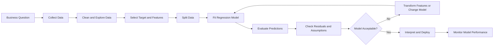
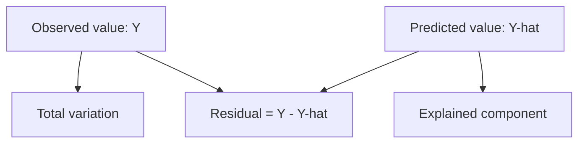
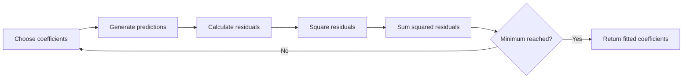
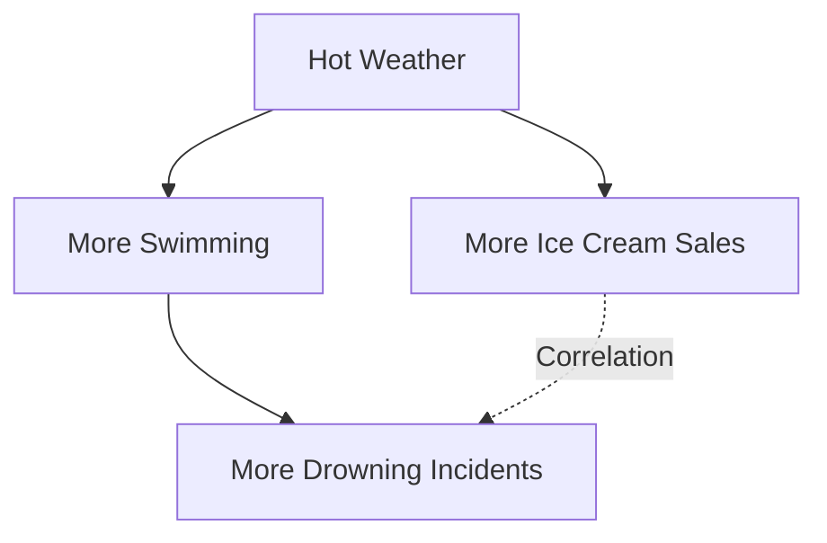

# 002 - Regression

**Course:** 01 - Math, Statistics and Econometrics
**Module:** Module 03 - Econometrics and Time Series
**Content Group:** Econometrics Fundamentals
**Roadmap Source:** Econometrics and Time Series / Econometrics Fundamentals
**Lesson Type:** Econometrics and Time Series
**Order in Module:** 002
**Suggested Duration:** 22 minutes

---

## 1. Overview

Regression is a statistical and machine learning technique used to model the relationship between a **target variable** and one or more **explanatory variables**.

It helps answer questions such as:

* How does advertising spending relate to sales?
* How much does house size affect house price?
* Which factors are associated with customer spending?
* How will demand change when price increases?
* Can historical information predict a future numerical value?

Regression has two major purposes:

1. **Prediction:** Estimate an unknown or future numerical value.
2. **Explanation:** Measure how changes in explanatory variables are associated with changes in the target.

In an AI and Data Science workflow, regression can become:

* A Jupyter notebook
* A predictive model
* A statistical report
* A residual diagnostic chart
* A forecasting baseline
* A REST API
* A dashboard metric
* A portfolio project

---

## 2. Learning Objectives

After completing this lesson, you should be able to:

* Explain regression in your own words.
* Distinguish the target variable from explanatory variables.
* Understand simple and multiple linear regression.
* Interpret regression coefficients.
* Fit a regression model using Python.
* Evaluate prediction quality using regression metrics.
* Examine residuals and model assumptions.
* Recognize multicollinearity, overfitting and data leakage.
* Explain why regression does not automatically prove causation.
* Connect regression to forecasting and business decision-making.

---

## 3. Where Regression Fits in the Data Workflow



Regression should not begin with model training. It begins with a clear question and a well-defined target variable.

For example:

> Can monthly advertising spending help predict monthly sales?

In this question:

* **Target variable:** Monthly sales
* **Explanatory variable:** Advertising spending
* **Observation unit:** One month

---

## 4. Core Concepts

### 4.1 Target Variable

The target variable is the numerical value that the model attempts to explain or predict.

Common notation:

$$
Y
$$

Examples:

* House price
* Monthly sales
* Customer lifetime value
* Delivery time
* Energy consumption
* Product demand

The target variable is also called:

* Dependent variable
* Response variable
* Outcome variable
* Label

---

### 4.2 Explanatory Variables

Explanatory variables contain information used to explain or predict the target.

Common notation:

$$
X_1, X_2, \ldots, X_p
$$

Examples for house-price prediction:

* House size
* Number of bedrooms
* House age
* Distance to the city center
* Neighborhood category

Explanatory variables are also called:

* Independent variables
* Predictors
* Features
* Covariates
* Regressors

---

### 4.3 Observation

An observation represents one row in a dataset.

For example:

| House | Size | Bedrooms | Age |   Price |
| ----- | ---: | -------: | --: | ------: |
| A     |   80 |        2 |   8 | 180,000 |
| B     |  120 |        3 |   5 | 260,000 |
| C     |  150 |        4 |   2 | 340,000 |

Each house is one observation.

---

## 5. Simple Linear Regression

Simple linear regression uses one explanatory variable to model a numerical target.

The population model is:

$$
Y_i = \beta_0 + \beta_1 X_i + \varepsilon_i
$$

Where:

* $Y_i$ is the target value for observation $i$.
* $X_i$ is the explanatory variable.
* $\beta_0$ is the intercept.
* $\beta_1$ is the slope coefficient.
* $\varepsilon_i$ is the error term.

After estimating the model from data, the fitted equation is:

$$
\hat{Y}_i = \hat{\beta}_0 + \hat{\beta}_1 X_i
$$

The symbol $\hat{Y}_i$ represents the predicted value.

### Example

Suppose the estimated sales model is:

$$
\widehat{\text{Sales}} = 20{,}000 + 3.5 \times \text{Advertising}
$$

If advertising spending is measured in dollars, the slope means:

> An additional dollar of advertising spending is associated with an estimated increase of 3.5 dollars in sales.

For an advertising budget of 10,000 dollars:

$$
\widehat{\text{Sales}} = 20{,}000 + 3.5 \times 10{,}000
$$

$$
\widehat{\text{Sales}} = 55{,}000
$$

---

## 6. Understanding the Regression Line



The regression line produces a prediction for each observation.

The difference between the observed and predicted values is the **residual**:

$$
e_i = Y_i - \hat{Y}_i
$$

A positive residual means the model predicted too low.

A negative residual means the model predicted too high.

### Example

Observed sales:

$$
Y_i = 60{,}000
$$

Predicted sales:

$$
\hat{Y}_i = 55{,}000
$$

Residual:

$$
e_i = 60{,}000 - 55{,}000 = 5{,}000
$$

The model underpredicted sales by 5,000 dollars.

---

## 7. Ordinary Least Squares

Ordinary Least Squares, or OLS, estimates the regression coefficients by minimizing the sum of squared residuals.

The objective is:

$$
\min_{\beta_0,\beta_1}
\sum_{i=1}^{n}
\left(
Y_i - \hat{Y}_i
\right)^2
$$

For simple linear regression:

$$
\min_{\beta_0,\beta_1}
\sum_{i=1}^{n}
\left(
Y_i - \beta_0 - \beta_1 X_i
\right)^2
$$

Squaring the residuals has two important effects:

* Positive and negative errors cannot cancel each other.
* Large prediction errors receive a stronger penalty.



---

## 8. Multiple Linear Regression

Most real-world problems involve more than one explanatory variable.

Multiple linear regression is written as:

$$
Y_i = \beta_0 + \beta_1 X_{i1} + \beta_2 X_{i2} + \cdots + \beta_p X_{ip} + \varepsilon_i
$$

The fitted model is:

$$
\hat{Y}_i = \hat{\beta}_0 + \hat{\beta}_1 X_{i1} + \hat{\beta}_2 X_{i2} + \cdots + \hat{\beta}_p X_{ip}
$$

### House-price example

A model could be:

$$
\widehat{\text{Price}} = 50{,}000 + 2{,}000 \times \text{Size} + 15{,}000 \times \text{Bedrooms} - 1{,}500 \times \text{Age}
$$

Possible interpretation:

* Holding bedrooms and age constant, one additional square meter is associated with an estimated price increase of 2,000 dollars.
* Holding size and age constant, one additional bedroom is associated with an estimated price increase of 15,000 dollars.
* Holding size and bedrooms constant, one additional year of age is associated with an estimated price decrease of 1,500 dollars.

The phrase **holding other variables constant** is essential when interpreting multiple regression coefficients.

---

## 9. Prediction Versus Explanation

Regression can be used for both prediction and explanation, but these objectives are not identical.

| Objective        | Main Question                                    | Main Focus                         |
| ---------------- | ------------------------------------------------ | ---------------------------------- |
| Prediction       | How accurately can the model predict new values? | Test-set performance               |
| Explanation      | How is each variable associated with the target? | Coefficients and uncertainty       |
| Causal inference | What would happen if we changed a variable?      | Research design and identification |

A model can predict well without providing a valid causal explanation.

A model can also produce interpretable coefficients while having only moderate predictive accuracy.

---

## 10. Correlation Does Not Prove Causation

Suppose a regression finds that ice cream sales are positively related to drowning incidents.

It would be incorrect to conclude:

> Buying ice cream causes drowning.

A third variable, such as temperature, may increase both ice cream sales and swimming activity.



Regression measures conditional relationships in the available data. Causal interpretation requires stronger assumptions or research designs such as:

* Randomized experiments
* Natural experiments
* Difference-in-differences
* Instrumental variables
* Regression discontinuity
* Careful control of confounding variables

---

## 11. Important Regression Assumptions

Regression coefficients and statistical tests are reliable only when the necessary assumptions are reasonably satisfied.

### 11.1 Linearity

The expected target should be approximately linear in the model parameters.

For a simple model:

$$
E[Y \mid X] = \beta_0 + \beta_1 X
$$

A curved relationship may require:

* Polynomial terms
* Logarithmic transformations
* Splines
* Tree-based models
* Generalized additive models

---

### 11.2 Independent Errors

Residuals should not be strongly dependent on one another.

This assumption is often violated in:

* Time-series data
* Repeated measurements
* Geographic data
* Customer-level event data
* Clustered experiments

For time-series regression, residual autocorrelation should be checked explicitly.

---

### 11.3 Constant Error Variance

The residual variance should remain approximately constant across prediction levels.

This property is called **homoscedasticity**.

When residual variance changes with the prediction level, the data exhibit **heteroscedasticity**.

Possible solutions include:

* Transforming the target
* Using robust standard errors
* Applying weighted least squares
* Modeling variance directly

---

### 11.4 No Perfect Multicollinearity

An explanatory variable should not be an exact linear combination of other explanatory variables.

For example, including all three variables below would create perfect multicollinearity:

$$
\text{Total Cost} = \text{Fixed Cost} + \text{Variable Cost}
$$

Strong but imperfect correlations can also make coefficient estimates unstable.

---

### 11.5 Zero Conditional Mean

For explanatory interpretation, the expected error should be zero after conditioning on the explanatory variables:

$$
E[\varepsilon \mid X] = 0
$$

This assumption can fail because of:

* Omitted variables
* Reverse causality
* Measurement error
* Selection bias
* Simultaneous relationships

A violation can produce biased coefficient estimates.

---

### 11.6 Approximate Normality of Errors

Normally distributed residuals are mainly important for small-sample confidence intervals and hypothesis tests.

Normality is not always required for prediction.

With sufficiently large samples, inference may remain useful because of asymptotic statistical results.

---

## 12. Residual Diagnostics

Residual analysis helps determine whether a fitted regression model is trustworthy.

### 12.1 Residuals Versus Fitted Values

This chart helps detect:

* Nonlinearity
* Unequal variance
* Missing transformations
* Unusual observations

A healthy residual plot should resemble a random cloud around zero.

### 12.2 Histogram or Q-Q Plot

These charts examine whether residuals are approximately normally distributed.

### 12.3 Residuals Over Time

This chart can reveal:

* Autocorrelation
* Trend
* Seasonality
* Structural breaks

### 12.4 Influence Diagnostics

Some observations can strongly affect the fitted coefficients.

Useful measures include:

* Leverage
* Studentized residuals
* Cook's distance

An influential point should be investigated, not automatically deleted.

---

## 13. Multicollinearity

Multicollinearity occurs when explanatory variables contain overlapping information.

For example:

* House size and number of rooms
* Advertising impressions and advertising reach
* Age and years of work experience
* Revenue and number of transactions

Possible consequences:

* Large standard errors
* Unstable coefficients
* Unexpected coefficient signs
* Difficulty interpreting individual variables

A common diagnostic is the Variance Inflation Factor:

$$
\text{VIF}_j = \frac{1}{1-R_j^2}
$$

Where $R_j^2$ comes from regressing feature $j$ on the other features.

A large VIF suggests that the variable is strongly explained by the remaining predictors.

Possible responses include:

* Removing redundant features
* Combining related features
* Applying principal component analysis
* Using Ridge regression
* Collecting more data
* Interpreting groups of variables instead of individual coefficients

VIF thresholds are guidelines, not universal laws.

---

## 14. Regression Evaluation Metrics

### 14.1 Mean Absolute Error

Mean Absolute Error measures the average absolute prediction error.

$$
\text{MAE} = \frac{1}{n} \sum_{i=1}^{n} \left| Y_i-\hat{Y}_i \right|
$$

Advantages:

* Easy to interpret
* Uses the same unit as the target
* Less sensitive to extreme errors than MSE

---

### 14.2 Mean Squared Error

Mean Squared Error gives larger errors more weight.

$$
\text{MSE} = \frac{1}{n} \sum_{i=1}^{n} \left( Y_i-\hat{Y}_i \right)^2
$$

Advantages:

* Strongly penalizes large errors
* Convenient for optimization

Disadvantage:

* Expressed in squared target units

---

### 14.3 Root Mean Squared Error

Root Mean Squared Error returns the error to the target's original unit.

$$
\text{RMSE} = \sqrt{ \frac{1}{n} \sum_{i=1}^{n} \left( Y_i-\hat{Y}_i \right)^2 }
$$

RMSE is more sensitive to large errors than MAE.

---

### 14.4 Coefficient of Determination

The coefficient of determination measures how much target variation is explained by the model.

$$
R^2 = 1 - \frac{ \sum_{i=1}^{n} \left( Y_i-\hat{Y}_i \right)^2 }{ \sum_{i=1}^{n} \left( Y_i-\bar{Y} \right)^2 }
$$

Interpretation:

* $R^2 = 1$: Perfect fit on the evaluated data
* $R^2 = 0$: No improvement over predicting the mean
* $R^2 < 0$: Worse than predicting the mean

A high $R^2$ does not prove:

* Causality
* Correct model assumptions
* Good test-set performance
* Absence of data leakage
* Business usefulness

---

### 14.5 Adjusted R-squared

Regular $R^2$ usually does not decrease when extra variables are added.

Adjusted $R^2$ penalizes unnecessary predictors:

$$
\bar{R}^2 = 1 - \left( 1-R^2 \right) \frac{n-1}{n-p-1}
$$

Where:

* $n$ is the number of observations.
* $p$ is the number of explanatory variables.

Adjusted $R^2$ is useful for comparing related linear models, but it should not replace test-set validation.

---

## 15. Training, Validation and Testing

Evaluating a model on the same data used for fitting produces an overly optimistic result.

A common workflow is:

```text
Complete dataset
    |
    +-- Training set: fit model parameters
    |
    +-- Validation set: select features and hyperparameters
    |
    +-- Test set: estimate final performance
```

For ordinary tabular data, random splitting may be appropriate.

For time-dependent data, use chronological splitting:

```text
Past observations          Recent observations
|-------------------------|--------------------|
         Training                  Test
```

Never train on future data and evaluate on past data.

---

## 16. Feature Transformations

A relationship may become easier to model after transforming variables.

### 16.1 Log Transformation

A log-level model is:

$$
Y = \beta_0 + \beta_1 \log(X) + \varepsilon
$$

A one-percent increase in $X$ is associated with an approximate change of:

$$
\frac{\beta_1}{100}
$$

units in $Y$.

A log-log model is:

$$
\log(Y) = \beta_0 + \beta_1 \log(X) + \varepsilon
$$

In this model, $\beta_1$ is approximately an elasticity:

> A one-percent increase in $X$ is associated with a $\beta_1$ percent change in $Y$.

---

### 16.2 Polynomial Terms

A curved relationship can be modeled using polynomial features:

$$
Y = \beta_0 + \beta_1 X + \beta_2 X^2 + \varepsilon
$$

Although this model is nonlinear in $X$, it is linear in the coefficients.

---

### 16.3 Interaction Terms

An interaction allows the effect of one variable to depend on another variable.

$$
Y = \beta_0 + \beta_1 X_1 + \beta_2 X_2 + \beta_3 X_1X_2 + \varepsilon
$$

For example, the effect of advertising spending may depend on whether a campaign runs during a holiday period.

---

### 16.4 Categorical Variables

Categorical variables must usually be encoded using indicator variables.

For a region variable with three categories:

* North
* Central
* South

Use two indicator variables and select one category as the reference group.

Example:

$$
Y = \beta_0 + \beta_1 D_{\text{Central}} + \beta_2 D_{\text{South}} + \varepsilon
$$

The North region is the reference category.

---

## 17. Regularized Regression

When a dataset contains many correlated features, regularization can improve prediction stability.

### 17.1 Ridge Regression

Ridge regression minimizes:

$$
\sum_{i=1}^{n}
\left(
Y_i-\hat{Y}_i
\right)^2
+
\lambda
\sum_{j=1}^{p}
\beta_j^2
$$

Ridge regression:

* Shrinks coefficients toward zero
* Usually keeps all features
* Helps with multicollinearity
* Requires feature scaling in most applications

---

### 17.2 Lasso Regression

Lasso regression minimizes:

$$
\sum_{i=1}^{n}
\left(
Y_i-\hat{Y}_i
\right)^2
+
\lambda
\sum_{j=1}^{p}
|\beta_j|
$$

Lasso regression can shrink some coefficients exactly to zero.

It can therefore perform a form of feature selection.

---

### 17.3 Elastic Net

Elastic Net combines Ridge and Lasso penalties:

$$
\text{Loss} = \text{Squared Error} + \lambda_1 \sum_{j=1}^{p} |\beta_j| + \lambda_2 \sum_{j=1}^{p} \beta_j^2
$$

It is often useful when many features are correlated.

---

## 18. Practical Python Demo

The following example models sales using advertising spending, product price and a holiday indicator.

```python
import pandas as pd
import statsmodels.api as sm
from sklearn.metrics import mean_absolute_error, mean_squared_error, r2_score
from sklearn.model_selection import train_test_split

# Example dataset
data = pd.DataFrame(
    {
        "advertising": [
            1000, 1500, 1800, 2200, 2600,
            3000, 3500, 4000, 4500, 5000,
            5500, 6000, 6500, 7000, 7500
        ],
        "price": [
            20, 19, 21, 18, 20,
            17, 19, 16, 18, 15,
            17, 14, 16, 13, 15
        ],
        "holiday": [
            0, 0, 0, 0, 1,
            0, 0, 1, 0, 0,
            1, 0, 0, 1, 1
        ],
        "sales": [
            220, 260, 250, 320, 390,
            370, 410, 510, 480, 540,
            650, 610, 660, 790, 820
        ],
    }
)

features = ["advertising", "price", "holiday"]

X = data[features]
y = data["sales"]

# Hold out part of the data for evaluation
X_train, X_test, y_train, y_test = train_test_split(
    X,
    y,
    test_size=0.25,
    random_state=42
)

# Statsmodels requires an explicit intercept column
X_train_with_constant = sm.add_constant(X_train, has_constant="add")
X_test_with_constant = sm.add_constant(X_test, has_constant="add")

model = sm.OLS(y_train, X_train_with_constant).fit()

predictions = model.predict(X_test_with_constant)

mae = mean_absolute_error(y_test, predictions)
mse = mean_squared_error(y_test, predictions)
rmse = mse ** 0.5
r2 = r2_score(y_test, predictions)

print(model.summary())
print(f"Test MAE:  {mae:.2f}")
print(f"Test RMSE: {rmse:.2f}")
print(f"Test R²:   {r2:.3f}")
```

### Important note

This dataset is intentionally small and designed only for demonstration.

A production analysis should include:

* More observations
* A reproducible data pipeline
* Missing-value handling
* Outlier analysis
* Cross-validation
* Residual diagnostics
* Multicollinearity checks
* Business-specific evaluation
* Model monitoring

---

## 19. Residual Diagnostic Code

```python
import matplotlib.pyplot as plt
import statsmodels.api as sm

train_predictions = model.predict(X_train_with_constant)
residuals = y_train - train_predictions

# Residuals versus fitted values
plt.figure(figsize=(8, 5))
plt.scatter(train_predictions, residuals)
plt.axhline(0, linestyle="--")
plt.xlabel("Fitted Values")
plt.ylabel("Residuals")
plt.title("Residuals Versus Fitted Values")
plt.show()

# Q-Q plot
sm.qqplot(residuals, line="45", fit=True)
plt.title("Residual Q-Q Plot")
plt.show()

# Residuals over observation order
plt.figure(figsize=(8, 5))
plt.plot(range(len(residuals)), residuals, marker="o")
plt.axhline(0, linestyle="--")
plt.xlabel("Observation Order")
plt.ylabel("Residual")
plt.title("Residuals Over Observation Order")
plt.show()
```

Questions to ask while examining the charts:

* Are residuals centered around zero?
* Is there a visible curve?
* Does residual variance increase with fitted values?
* Are there extreme outliers?
* Is there a trend over time?
* Are residuals approximately symmetric?

---

## 20. Multicollinearity Diagnostic Code

```python
import pandas as pd
from statsmodels.stats.outliers_influence import variance_inflation_factor

X_vif = sm.add_constant(data[features], has_constant="add")

vif_table = pd.DataFrame(
    {
        "feature": X_vif.columns,
        "vif": [
            variance_inflation_factor(X_vif.values, index)
            for index in range(X_vif.shape[1])
        ],
    }
)

print(vif_table)
```

A high VIF should trigger investigation rather than automatic feature deletion.

Consider:

* Whether the feature is theoretically important
* Whether coefficient interpretation is required
* Whether prediction or explanation is the main objective
* Whether regularization can improve stability

---

## 21. Regression for Time-Dependent Data

Regression can also model trend, seasonality and external drivers.

A basic time-dependent regression may be:

$$
Y_t = \beta_0 + \beta_1 t + \beta_2 D_{\text{Monday},t} + \beta_3 D_{\text{Tuesday},t} + \cdots + \beta_k X_t + \varepsilon_t
$$

Where:

* $t$ captures trend.
* Day or month indicators capture seasonality.
* $X_t$ represents external factors such as promotions or weather.

However, ordinary regression may be insufficient if residuals remain autocorrelated.

Possible extensions include:

* Lag features
* Autoregressive models
* ARIMA
* Dynamic regression
* State-space models
* Exponential smoothing
* Gradient boosting with time features

---

## 22. Regression Forecasting Workflow


A regression model should be compared with a simple baseline.

Common forecasting baselines include:

* Last observed value
* Previous-week value
* Previous-year value
* Historical mean
* Seasonal average

A complex model that cannot outperform a simple baseline may not be useful.

---

## 23. Common Mistakes

### Mistake 1: Interpreting Association as Causation

A significant coefficient does not automatically mean that changing the variable will change the target.

### Mistake 2: Evaluating on Training Data

Training performance does not measure generalization to unseen data.

### Mistake 3: Ignoring Residuals

Good aggregate metrics can hide nonlinearity, unequal variance or time dependence.

### Mistake 4: Adding Every Available Feature

More variables can increase noise, instability, leakage and maintenance cost.

### Mistake 5: Ignoring Multicollinearity

Highly correlated variables can produce unstable and misleading coefficient estimates.

### Mistake 6: Using Future Information

Features created from future observations cause data leakage.

### Mistake 7: Extrapolating Too Far

A regression relationship observed within the training range may not remain valid outside that range.

### Mistake 8: Ignoring Units

A coefficient cannot be interpreted correctly without knowing the units of the target and explanatory variables.

### Mistake 9: Removing Outliers Automatically

An outlier may represent:

* A data error
* A rare but valid event
* A different population
* A structural business change

Investigate the cause before removing it.

### Mistake 10: Focusing Only on Statistical Significance

A statistically significant effect may be too small to matter operationally.

Always consider:

* Effect size
* Confidence interval
* Business value
* Implementation cost
* Model stability

---

## 24. Practical Exercise

### Dataset Idea

Use a sales dataset containing:

* Date
* Sales
* Product price
* Advertising spending
* Promotion indicator
* Holiday indicator
* Store traffic

### Tasks

1. Define the target variable.
2. Identify explanatory variables.
3. Create a chronological train-test split.
4. Fit a baseline regression model.
5. Report MAE, RMSE and $R^2$.
6. Interpret at least two coefficients.
7. Plot residuals versus fitted values.
8. Check whether residuals contain time patterns.
9. Calculate VIF values.
10. Add a trend or seasonal feature.
11. Compare the improved model with the baseline.
12. Write one limitation and one next research question.

### Suggested Artifact

Create a notebook named:

```text
regression_sales_analysis.ipynb
```

Recommended sections:

```text
1. Business Question
2. Dataset Description
3. Exploratory Data Analysis
4. Feature Engineering
5. Baseline Model
6. Regression Model
7. Evaluation
8. Residual Diagnostics
9. Coefficient Interpretation
10. Limitations
11. Business Recommendation
```

---

## 25. Mini Project: Sales Forecasting

### Project Goal

Build a regression-based forecasting baseline for weekly sales.

### Inputs

* Historical weekly sales
* Product price
* Promotion status
* Holiday status
* Week number
* Month
* Lagged sales

### Expected Outputs

* Exploratory charts
* Naive forecast baseline
* Linear regression forecast
* MAE and RMSE comparison
* Residual chart
* Forecast versus actual chart
* Short business recommendation

### Example Recommendation

> The regression model improves RMSE compared with the previous-week baseline, but residual seasonality remains visible. The next iteration should compare the regression model with a seasonal ARIMA model and use rolling-window backtesting.

---

## 26. Completion Checklist

* [ ] I can explain regression in one or two minutes.
* [ ] I can identify the target and explanatory variables.
* [ ] I understand the difference between simple and multiple regression.
* [ ] I can interpret a regression coefficient with the correct units.
* [ ] I understand the meaning of “holding other variables constant.”
* [ ] I can calculate a residual.
* [ ] I understand the OLS objective.
* [ ] I can evaluate a model using MAE, RMSE and $R^2$.
* [ ] I can explain why training performance is insufficient.
* [ ] I can inspect a residual plot.
* [ ] I understand multicollinearity and VIF.
* [ ] I know that regression does not automatically prove causation.
* [ ] I can identify at least one regression assumption.
* [ ] I have created a notebook, model, chart or report for this lesson.
* [ ] I have documented at least one caveat or unanswered question.

---

## 27. Five-Sentence Self-Test

Without looking at the lesson, explain:

1. What regression attempts to model.
2. The difference between a target and an explanatory variable.
3. What a regression coefficient means.
4. Why residual diagnostics are necessary.
5. Why regression coefficients should not automatically be interpreted as causal effects.

---

## 28. Key Takeaways

* Regression models relationships between a numerical target and explanatory variables.
* Simple regression uses one explanatory variable, while multiple regression uses several.
* OLS estimates coefficients by minimizing squared residuals.
* Coefficients describe conditional associations when other included variables are held constant.
* Prediction quality should be measured on unseen data.
* MAE, RMSE and $R^2$ capture different aspects of model performance.
* Residual analysis helps detect misspecification, unequal variance and time dependence.
* Multicollinearity can make individual coefficients unstable.
* A strong regression relationship does not automatically imply causation.
* For time-dependent data, use chronological validation and check residual autocorrelation.
* A regression model should be compared with a simple baseline before deployment.

---

## 29. Related Outcome

Model relationships and time-dependent data using:

* Linear regression
* Multiple regression
* Regression diagnostics
* Feature transformations
* Regularization
* Time-based validation
* ARIMA and forecasting workflows

---

## 30. Related Project

**Mini Project:** Sales Forecasting with trend and seasonality analysis.

The project should contain:

* A naive baseline
* A regression model
* Chronological train-test splitting
* Regression evaluation metrics
* Residual diagnostics
* A comparison with ARIMA or another forecasting method
* A business-focused conclusion

---

## 31. Summary

Regression is one of the most important foundations of econometrics, statistics and machine learning.

It can help an AI or Data Scientist:

* Predict numerical outcomes
* Quantify relationships
* Build forecasting baselines
* Test hypotheses
* Identify important explanatory variables
* Translate data into business recommendations

A fitted regression model should not be trusted based only on its coefficients or $R^2$.

Before using the results, always examine:

* Data quality
* Validation design
* Residual behavior
* Multicollinearity
* Model assumptions
* Possible confounding
* Practical effect size
* Business relevance

Turn this lesson into a notebook, diagnostic report, model API or forecasting project so that regression becomes an applied skill rather than only a mathematical definition.
