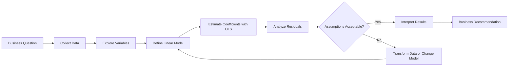
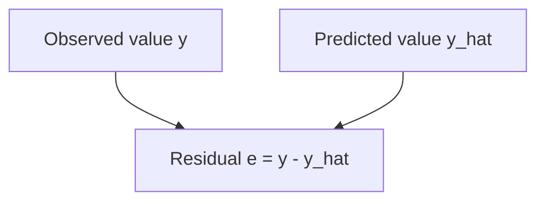
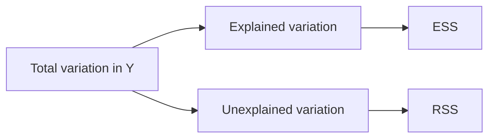
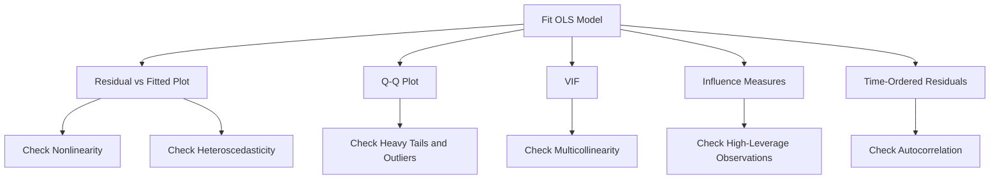
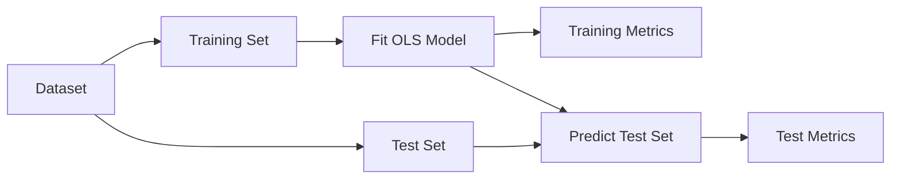

# 004 - Ordinary Least Squares

**Course:** 01 - Math, Statistics and Econometrics
**Module:** Module 03 - Econometrics and Time Series
**Content Group:** Econometrics Fundamentals
**Roadmap Source:** Econometrics and Time Series / Econometrics Fundamentals
**Lesson Type:** Econometrics and Time Series
**Order in Module:** 004
**Suggested Duration:** 22 minutes

---

## 1. Summary

**Ordinary Least Squares**, usually abbreviated as **OLS**, is a method for estimating the parameters of a linear regression model.

OLS finds the regression line or regression surface that minimizes the sum of squared differences between the observed values and the values predicted by the model.

In the simple linear regression case:

$$
y_i = \beta_0 + \beta_1 x_i + \varepsilon_i
$$

OLS estimates the intercept $\beta_0$ and slope $\beta_1$ by minimizing:

$$
\sum_{i=1}^{n}
\left(
y_i - \hat{y}_i
\right)^2
$$

where:

* $y_i$ is the observed value.
* $\hat{y}_i$ is the predicted value.
* $y_i - \hat{y}_i$ is the residual.
* $n$ is the number of observations.

OLS is widely used in:

* Econometrics
* Business analytics
* Experiment analysis
* Machine learning
* Forecasting baselines
* Causal analysis
* Feature-effect interpretation

After this lesson, you should understand how OLS estimates a linear model, what assumptions it relies on, how to diagnose problems, and how to translate regression results into business insights.

---

## 2. Learning Objectives

By the end of this lesson, you should be able to:

* Explain OLS in your own words.
* Describe the objective function minimized by OLS.
* Distinguish observed values, fitted values, errors, and residuals.
* Interpret OLS coefficients in business language.
* Understand the main assumptions behind OLS.
* Diagnose common regression problems using residual analysis.
* Fit an OLS model using Python.
* Evaluate whether OLS is appropriate for a dataset.
* Use OLS as a baseline for machine learning or forecasting.
* Document assumptions, limitations, and caveats.

---

## 3. Where OLS Fits in the Data Workflow



OLS is not only a mathematical formula. It is one part of a larger analytical workflow.

A complete OLS analysis should include:

1. A clearly defined business question.
2. Appropriate variables.
3. Data-quality checks.
4. Model estimation.
5. Residual diagnostics.
6. Coefficient interpretation.
7. Validation.
8. Limitations and recommendations.

---

## 4. Core Concept

Suppose a company wants to understand how advertising expenditure affects weekly sales.

A simple linear regression model may be written as:

$$
\text{Sales}_i = \beta_0 + \beta_1 \text{Advertising}_i + \varepsilon_i
$$

The model contains three main components:

### 4.1 Systematic component

$$
\beta_0 + \beta_1 x_i
$$

This is the part of the outcome explained by the observed predictor.

### 4.2 Random component

$$
\varepsilon_i
$$

This represents factors not included in the model, such as:

* Competitor activity
* Weather
* Product availability
* Customer preferences
* Measurement error
* Random variation

### 4.3 Observed outcome

$$
y_i
$$

The observed outcome combines the systematic and random components:

$$
y_i = \text{Explained component} + \text{Unexplained component}
$$

---

## 5. Errors and Residuals

The terms **error** and **residual** are related but not identical.

### 5.1 Error term

The theoretical error is:

$$
\varepsilon_i = y_i - \left( \beta_0 + \beta_1 x_i \right)
$$

The true values of $\beta_0$ and $\beta_1$ are unknown, so the true error cannot normally be observed.

### 5.2 Residual

After estimating the model, the residual is:

$$
e_i = y_i - \hat{y}_i
$$

where:

$$
\hat{y}_i = \hat{\beta}_0 + \hat{\beta}_1 x_i
$$

Residuals are observable estimates of the unobservable errors.



A positive residual means the model predicted too low.

A negative residual means the model predicted too high.

---

## 6. The OLS Objective Function

OLS chooses coefficient estimates that minimize the **Residual Sum of Squares**, abbreviated as RSS.

$$
RSS = \sum_{i=1}^{n} e_i^2
$$

Substituting the residual definition:

$$
RSS = \sum_{i=1}^{n} \left[ y_i - \left( \hat{\beta}_0 + \hat{\beta}_1 x_i \right) \right]^2
$$

The estimated coefficients are therefore:

$$
\left( \hat{\beta}_0, \hat{\beta}_1 \right) = \underset{\beta_0,\beta_1}{\text{argmin}} \sum_{i=1}^{n} \left[ y_i - \left( \beta_0 + \beta_1 x_i \right) \right]^2
$$

### Why square the residuals?

Squaring provides several useful properties:

* Positive and negative residuals do not cancel each other.
* Large errors receive a stronger penalty.
* The objective function is differentiable.
* A closed-form mathematical solution exists.
* Optimization is computationally efficient.

However, squared errors also make OLS sensitive to outliers.

---

## 7. Geometric Intuition

OLS searches for the line that makes the total squared vertical distance between the observations and the line as small as possible.

```text
Observed value
     ●
     │
     │ residual
     │
     × predicted value on regression line
─────╱──────────────── Regression line
    ╱
```

For each observation:

$$
\text{Residual} = \text{Observed value} - \text{Predicted value}
$$

OLS does not minimize horizontal distances or perpendicular distances. In standard regression, it minimizes the squared vertical distances in the outcome variable.

---

## 8. Closed-Form Solution for Simple Linear Regression

For a model with one predictor:

$$
y_i = \beta_0 + \beta_1 x_i + \varepsilon_i
$$

the estimated slope is:

$$
\hat{\beta}_1 = \frac{ \sum_{i=1}^{n} \left( x_i - \bar{x} \right) \left( y_i - \bar{y} \right) }{ \sum_{i=1}^{n} \left( x_i - \bar{x} \right)^2 }
$$

The estimated intercept is:

$$
\hat{\beta}_0 = \bar{y} - \hat{\beta}_1 \bar{x}
$$

The slope can also be expressed as:

$$
\hat{\beta}_1 = \frac{ \text{Cov}(X,Y) }{ \text{Var}(X) }
$$

This equation shows that the slope depends on how $X$ and $Y$ vary together relative to the variation in $X$.

---

## 9. Interpreting the Coefficients

Consider the estimated model:

$$
\widehat{\text{Sales}} = 120 + 4.5 \times \text{Advertising}
$$

Suppose advertising is measured in thousands of dollars and sales are measured in units.

### Intercept interpretation

$$
\hat{\beta}_0 = 120
$$

When advertising expenditure is zero, the model predicts 120 units of sales.

This interpretation may not be practically meaningful when zero is outside the observed advertising range.

### Slope interpretation

$$
\hat{\beta}_1 = 4.5
$$

For each additional one thousand dollars spent on advertising, expected sales increase by approximately 4.5 units, on average.

A careful interpretation uses language such as:

> Holding the model structure constant, an additional one thousand dollars of advertising is associated with an average increase of 4.5 sales units.

An OLS coefficient does not automatically prove causation.

---

## 10. Multiple Linear Regression

Most real-world problems involve multiple predictors.

A multiple linear regression model is:

$$
y_i = \beta_0 + \beta_1 x_{i1} + \beta_2 x_{i2} + \cdots + \beta_p x_{ip} + \varepsilon_i
$$

For example:

$$
\text{Sales} = \beta_0 + \beta_1 \text{Advertising} + \beta_2 \text{Price} + \beta_3 \text{Holiday} + \varepsilon
$$

The interpretation of $\beta_1$ is:

> The expected change in sales associated with a one-unit increase in advertising, while holding price and holiday status constant.

The phrase **holding other variables constant** is essential in multiple regression.

---

## 11. Matrix Form of OLS

Multiple linear regression can be written compactly as:

$$
\mathbf{y} = \mathbf{X}\boldsymbol{\beta} + \boldsymbol{\varepsilon}
$$

where:

* $\mathbf{y}$ is the outcome vector.
* $\mathbf{X}$ is the design matrix.
* $\boldsymbol{\beta}$ is the coefficient vector.
* $\boldsymbol{\varepsilon}$ is the error vector.

OLS minimizes:

$$
\left( \mathbf{y} - \mathbf{X}\boldsymbol{\beta} \right)^\top \left( \mathbf{y} - \mathbf{X}\boldsymbol{\beta} \right)
$$

When $\mathbf{X}^\top \mathbf{X}$ is invertible, the OLS solution is:

$$
\hat{\boldsymbol{\beta}} = \left( \mathbf{X}^\top \mathbf{X} \right)^{-1} \mathbf{X}^\top \mathbf{y}
$$

In production code, numerical libraries usually avoid calculating the matrix inverse directly. More stable methods include:

* QR decomposition
* Singular Value Decomposition
* Iterative optimization methods

---

## 12. OLS Assumptions

OLS can always calculate coefficients when the mathematical system is valid. However, reliable interpretation and statistical inference require additional assumptions.

### 12.1 Linearity

The expected outcome should be linear in the parameters:

$$
E[Y \mid X] = \beta_0 + \beta_1 X_1 + \cdots + \beta_p X_p
$$

This does not mean every raw variable must appear only in its original form.

A model such as the following is still linear in the coefficients:

$$
Y = \beta_0 + \beta_1 X + \beta_2 X^2 + \varepsilon
$$

### 12.2 Independent observations

Observations should not contain unexplained dependence.

Violations are common in:

* Time-series data
* Repeated measurements
* Users with multiple records
* Geographic data
* Clustered experiments

### 12.3 Zero conditional mean

The error should have an expected value of zero after conditioning on the predictors:

$$
E[\varepsilon \mid X] = 0
$$

This assumption is violated when important variables are omitted and correlated with included predictors.

### 12.4 No perfect multicollinearity

No predictor should be an exact linear combination of other predictors.

For example, if:

$$
X_3 = X_1 + X_2
$$

then all three variables cannot be estimated independently in the same model.

### 12.5 Constant error variance

The error variance should remain constant across predictor values:

$$
\text{Var} \left( \varepsilon_i \mid X_i \right) = \sigma^2
$$

This property is called **homoscedasticity**.

When error variance changes with the predictors, the data are **heteroscedastic**.

### 12.6 Normally distributed errors

For small-sample hypothesis tests and confidence intervals, errors are often assumed to follow:

$$
\varepsilon_i
\sim
N(0,\sigma^2)
$$

Normality is not required for calculating OLS coefficients. It is mainly relevant for exact small-sample statistical inference.

---

## 13. Gauss-Markov Theorem

Under the classical linear regression assumptions, OLS is the **Best Linear Unbiased Estimator**, commonly abbreviated as **BLUE**.

* **Best:** It has the smallest variance among linear unbiased estimators.
* **Linear:** The estimator is linear in the observed outcome values.
* **Unbiased:** Its expected value equals the true parameter.
* **Estimator:** It uses sample data to estimate population parameters.

The theorem does not say that OLS is always the best possible model.

It only establishes its optimality within a specific class of estimators under specific assumptions.

---

## 14. Fitted Values and Residual Properties

The fitted values are:

$$
\hat{\mathbf{y}} = \mathbf{X} \hat{\boldsymbol{\beta}}
$$

The residual vector is:

$$
\mathbf{e} = \mathbf{y} - \hat{\mathbf{y}}
$$

When the model includes an intercept, several useful properties hold.

### Residuals sum to zero

$$
\sum_{i=1}^{n} e_i = 0
$$

### Mean fitted value equals mean observed value

$$
\overline{\hat{y}} = \bar{y}
$$

### Residuals are orthogonal to included predictors

$$
\mathbf{X}^\top \mathbf{e} = \mathbf{0}
$$

These properties are mathematical consequences of the OLS optimization process. They do not prove that the model is correctly specified.

---

## 15. Decomposing Variation

OLS separates the variation in the outcome into explained and unexplained components.

### Total Sum of Squares

$$
TSS = \sum_{i=1}^{n} \left( y_i - \bar{y} \right)^2
$$

### Explained Sum of Squares

$$
ESS = \sum_{i=1}^{n} \left( \hat{y}_i - \bar{y} \right)^2
$$

### Residual Sum of Squares

$$
RSS = \sum_{i=1}^{n} \left( y_i - \hat{y}_i \right)^2
$$

For a model with an intercept:

$$
TSS = ESS + RSS
$$



---

## 16. R-Squared

The coefficient of determination is:

$$
R^2 = 1 - \frac{RSS}{TSS}
$$

It can also be written as:

$$
R^2 = \frac{ESS}{TSS}
$$

Interpretation:

> $R^2$ measures the proportion of variation in the observed outcome explained by the fitted model.

For example:

$$
R^2 = 0.72
$$

means that the model explains approximately 72 percent of the observed variation in the outcome.

### Important limitations

A high $R^2$ does not prove that:

* The model is causal.
* The assumptions are satisfied.
* The predictions generalize.
* The coefficients are unbiased.
* The model is appropriate.
* Data leakage is absent.

Adding more predictors cannot decrease the training-set $R^2$, even when the new predictors are useless.

---

## 17. Adjusted R-Squared

Adjusted $R^2$ accounts for the number of predictors:

$$
\bar{R}^2 = 1 - \left( 1 - R^2 \right) \frac{ n - 1 }{ n - p - 1 }
$$

where:

* $n$ is the number of observations.
* $p$ is the number of predictors.

Adjusted $R^2$ can decrease when a weak predictor is added.

It is useful for comparing models fitted to the same outcome and dataset, although it should not replace validation on unseen data.

---

## 18. Coefficient Uncertainty

An estimated coefficient is not known with perfect certainty.

A confidence interval is commonly written as:

$$
\hat{\beta}_j
\pm
t_{\alpha/2}
\text{SE}
\left(
\hat{\beta}_j
\right)
$$

where:

* $\hat{\beta}_j$ is the estimated coefficient.
* $\text{SE}(\hat{\beta}_j)$ is its standard error.
* $t_{\alpha/2}$ is the appropriate critical value.

A wide confidence interval indicates greater uncertainty.

Uncertainty may increase because of:

* Small sample size
* High noise
* Multicollinearity
* Limited predictor variation
* Model misspecification

---

## 19. Hypothesis Testing

A common test for coefficient $\beta_j$ is:

$$
H_0: \beta_j = 0
$$

against:

$$
H_1: \beta_j \neq 0
$$

The test statistic is:

$$
t = \frac{ \hat{\beta}_j }{ \text{SE} \left( \hat{\beta}_j \right) }
$$

A small p-value provides evidence against the null hypothesis under the model assumptions.

However, statistical significance does not necessarily imply:

* Business significance
* Causal importance
* Strong predictive value
* Large effect size
* Practical usefulness

Always report the estimated effect and its uncertainty, not only the p-value.

---

## 20. OLS Diagnostics

A fitted model should be diagnosed before its results are trusted.



### 20.1 Residuals versus fitted values

Desired pattern:

* Residuals randomly distributed around zero.
* No curve.
* No funnel shape.
* No clear clusters.

Possible problems:

* Curved pattern: nonlinearity.
* Funnel pattern: heteroscedasticity.
* Separated groups: missing categorical structure.
* Repeated pattern: time dependence.

### 20.2 Q-Q plot

A Q-Q plot compares residual quantiles with theoretical normal quantiles.

Large deviations may indicate:

* Heavy-tailed errors
* Skewness
* Outliers
* Incorrect model specification

### 20.3 Multicollinearity

Multicollinearity occurs when predictors are strongly related.

Possible consequences include:

* Unstable coefficients
* Large standard errors
* Unexpected coefficient signs
* Sensitivity to small data changes

A common diagnostic is the Variance Inflation Factor:

$$
VIF_j = \frac{ 1 }{ 1 - R_j^2 }
$$

where $R_j^2$ comes from regressing predictor $X_j$ on the other predictors.

A high VIF is a warning, not an automatic reason to delete a variable.

### 20.4 Influential observations

An observation may be influential when it combines:

* A large residual
* High leverage
* A strong effect on the estimated coefficients

Common diagnostics include:

* Studentized residuals
* Leverage values
* Cook's distance
* DFBETAs

Influential observations should be investigated, not automatically removed.

---

## 21. Common OLS Problems

### 21.1 Omitted variable bias

Suppose the true model is:

$$
Y = \beta_0 + \beta_1 X + \beta_2 Z + \varepsilon
$$

but the fitted model excludes $Z$:

$$
Y = \alpha_0 + \alpha_1 X + u
$$

If $Z$ affects $Y$ and is correlated with $X$, the estimated effect of $X$ may be biased.

Example:

A regression of salary on education may be biased if ability affects salary and is correlated with education.

### 21.2 Reverse causality

A relationship between $X$ and $Y$ does not establish which variable causes the other.

Example:

Advertising may increase sales, but companies may also increase advertising when they expect sales to rise.

### 21.3 Measurement error

Incorrectly measured predictors can bias coefficient estimates.

Examples include:

* Self-reported income
* Inaccurate device measurements
* Incorrect location data
* Missing transaction records

### 21.4 Outliers

Because OLS squares residuals, extreme observations can strongly affect the fitted model.

Possible responses include:

* Verify the data.
* Analyze influential points.
* Transform variables.
* Use robust standard errors.
* Use robust regression.
* Report sensitivity analyses.

### 21.5 Heteroscedasticity

When the error variance is not constant, OLS coefficient estimates may remain unbiased under some conditions, but conventional standard errors may be incorrect.

Possible responses include:

* Heteroscedasticity-robust standard errors
* Variable transformation
* Weighted least squares
* Improved model specification

### 21.6 Autocorrelation

Time-series residuals may depend on previous residuals:

$$
\text{Corr}
\left(
\varepsilon_t,
\varepsilon_{t-1}
\right)
\neq 0
$$

Autocorrelation can cause misleading standard errors and confidence intervals.

Possible responses include:

* Add lagged variables.
* Model trend and seasonality.
* Use Newey-West standard errors.
* Use generalized least squares.
* Use ARIMA or other time-series models.

### 21.7 Data leakage

Leakage occurs when the model uses information that would not be available at prediction time.

Examples include:

* Future sales included in current features
* Full-dataset normalization before splitting
* Post-outcome variables used as predictors
* Random splitting of strongly time-dependent data

---

## 22. OLS for Time-Series Data

OLS can be useful for time-series analysis, but temporal structure must be handled explicitly.

A trend model may be:

$$
y_t = \beta_0 + \beta_1 t + \varepsilon_t
$$

A trend-and-seasonality model may be:

$$
y_t = \beta_0 + \beta_1 t + \gamma_1 D_{1,t} + \gamma_2 D_{2,t} + \cdots + \gamma_{11} D_{11,t} + \varepsilon_t
$$

where the $D$ variables represent monthly indicators.

A model with lagged values may be:

$$
y_t = \beta_0 + \beta_1 y_{t-1} + \beta_2 x_t + \varepsilon_t
$$

### Time-series workflow


Do not randomly shuffle time-series observations when evaluating future forecasting performance.

---

## 23. Worked Example

Suppose we observe the following relationship between advertising expenditure and sales.

| Week | Advertising | Sales |
| ---: | ----------: | ----: |
|    1 |           2 |    13 |
|    2 |           3 |    17 |
|    3 |           5 |    24 |
|    4 |           7 |    31 |
|    5 |           9 |    37 |

Assume the fitted model is:

$$
\widehat{\text{Sales}} = 6.9 + 3.4 \times \text{Advertising}
$$

For an advertising expenditure of 5 units:

$$
\widehat{\text{Sales}} = 6.9 + 3.4 \times 5
$$

$$
\widehat{\text{Sales}} = 23.9
$$

The observed value is 24, so the residual is:

$$
e = 24 - 23.9 = 0.1
$$

### Business interpretation

* Baseline predicted sales are approximately 6.9 units when advertising is zero.
* Each additional advertising unit is associated with approximately 3.4 additional sales units.
* At an advertising value of 5, predicted sales are approximately 23.9 units.
* The model slightly underpredicts the observed value by 0.1 unit.

---

## 24. Python Demo with Statsmodels

```python
import pandas as pd
import statsmodels.api as sm

data = pd.DataFrame(
    {
        "advertising": [2, 3, 5, 7, 9],
        "sales": [13, 17, 24, 31, 37],
    }
)

X = data[["advertising"]]
X = sm.add_constant(X)

y = data["sales"]

model = sm.OLS(y, X).fit()

print(model.summary())

data["predicted_sales"] = model.predict(X)
data["residual"] = data["sales"] - data["predicted_sales"]

print(data)
```

### Why use Statsmodels?

Statsmodels is useful when the goal includes:

* Coefficient interpretation
* Standard errors
* Confidence intervals
* Hypothesis testing
* Residual diagnostics
* Econometric analysis

---

## 25. Python Demo with Scikit-Learn

```python
import pandas as pd
from sklearn.linear_model import LinearRegression
from sklearn.metrics import mean_absolute_error
from sklearn.metrics import mean_squared_error
from sklearn.metrics import r2_score

data = pd.DataFrame(
    {
        "advertising": [2, 3, 5, 7, 9],
        "sales": [13, 17, 24, 31, 37],
    }
)

X = data[["advertising"]]
y = data["sales"]

model = LinearRegression()
model.fit(X, y)

predictions = model.predict(X)

print("Intercept:", model.intercept_)
print("Coefficient:", model.coef_[0])
print("MAE:", mean_absolute_error(y, predictions))
print("MSE:", mean_squared_error(y, predictions))
print("R-squared:", r2_score(y, predictions))
```

### Why use Scikit-Learn?

Scikit-Learn is useful when the goal includes:

* Prediction pipelines
* Cross-validation
* Feature preprocessing
* Model comparison
* Deployment
* Integration with machine-learning workflows

---

## 26. Residual Diagnostic Plot

```python
import matplotlib.pyplot as plt

data["predicted_sales"] = model.predict(X)
data["residual"] = y - data["predicted_sales"]

plt.scatter(data["predicted_sales"], data["residual"])
plt.axhline(y=0, linestyle="--")
plt.xlabel("Predicted Sales")
plt.ylabel("Residual")
plt.title("Residuals vs Predicted Values")
plt.show()
```

Look for:

* Residuals centered around zero
* No curved pattern
* No funnel shape
* No isolated extreme observations

Because this example contains only five observations, it is useful for demonstration but not for reliable statistical inference.

---

## 27. OLS Versus Gradient Descent

OLS coefficients can be estimated in more than one way.

### Closed-form OLS

$$
\hat{\boldsymbol{\beta}} = \left( \mathbf{X}^\top \mathbf{X} \right)^{-1} \mathbf{X}^\top \mathbf{y}
$$

Advantages:

* Direct mathematical solution
* No learning rate
* No iterative convergence process
* Effective for small and medium datasets

Limitations:

* Matrix operations may become expensive.
* Numerical instability can occur.
* High-dimensional data may require regularization.

### Gradient descent

Gradient descent minimizes the same squared-error objective iteratively:

$$
\boldsymbol{\beta}^{(k+1)} = \boldsymbol{\beta}^{(k)} - \eta \nabla J \left( \boldsymbol{\beta}^{(k)} \right)
$$

where $\eta$ is the learning rate.

Gradient descent is useful when:

* The dataset is extremely large.
* The number of features is large.
* Data arrive in batches.
* The model is part of a larger optimization system.

---

## 28. OLS Versus Regularized Regression

OLS minimizes only the residual sum of squares.

### OLS

$$
\min_{\boldsymbol{\beta}}
\sum_{i=1}^{n}
\left(
y_i - \hat{y}_i
\right)^2
$$

### Ridge regression

$$
\min_{\boldsymbol{\beta}}
\left[
\sum_{i=1}^{n}
\left(
y_i - \hat{y}_i
\right)^2
+
\lambda
\sum_{j=1}^{p}
\beta_j^2
\right]
$$

### Lasso regression

$$
\min_{\boldsymbol{\beta}}
\left[
\sum_{i=1}^{n}
\left(
y_i - \hat{y}_i
\right)^2
+
\lambda
\sum_{j=1}^{p}
\left|
\beta_j
\right|
\right]
$$

Regularization is often useful when:

* There are many predictors.
* Predictors are highly correlated.
* Prediction is more important than coefficient unbiasedness.
* Overfitting is a concern.

---

## 29. OLS for Prediction Versus Explanation

The same OLS model may be used for different goals.

### Explanation or inference

Primary questions:

* What is the estimated effect of each predictor?
* Is the coefficient distinguishable from zero?
* What is the confidence interval?
* Are important confounders controlled?
* Are standard errors valid?

### Prediction

Primary questions:

* How accurate are predictions on unseen data?
* Does the model outperform a baseline?
* Are predictions stable over time?
* Is there data leakage?
* How large are MAE, RMSE, and forecast errors?

A model can have interpretable coefficients but weak predictive performance.

A model can also predict well while providing unreliable causal interpretation.

---

## 30. Train-Test Validation

Training performance is not sufficient for evaluating predictive performance.



For ordinary independent data, common approaches include:

* Train-test split
* K-fold cross-validation
* Repeated cross-validation

For time-series data, use:

* Chronological split
* Expanding-window validation
* Rolling-window validation

Never use future observations to create features for past predictions.

---

## 31. Evaluation Metrics

### Mean Absolute Error

$$
MAE = \frac{1}{n} \sum_{i=1}^{n} \left| y_i - \hat{y}_i \right|
$$

MAE is easy to interpret because it uses the same unit as the outcome.

### Mean Squared Error

$$
MSE = \frac{1}{n} \sum_{i=1}^{n} \left( y_i - \hat{y}_i \right)^2
$$

MSE penalizes large errors more heavily.

### Root Mean Squared Error

$$
RMSE = \sqrt{ \frac{1}{n} \sum_{i=1}^{n} \left( y_i - \hat{y}_i \right)^2 }
$$

RMSE has the same unit as the target variable.

### R-squared

$$
R^2 = 1 - \frac{ \sum_{i=1}^{n} \left( y_i - \hat{y}_i \right)^2 }{ \sum_{i=1}^{n} \left( y_i - \bar{y} \right)^2 }
$$

Use multiple metrics because each metric answers a different question.

---

## 32. Translating OLS Results into Business Language

Avoid presenting only technical output such as:

> The advertising coefficient is 3.4 and the p-value is 0.02.

A more useful explanation is:

> After accounting for the variables included in the model, one additional unit of advertising is associated with approximately 3.4 additional sales units. The estimate is statistically distinguishable from zero under the model assumptions. However, the analysis is observational, so the coefficient should not automatically be interpreted as a causal effect.

A complete business interpretation should mention:

* Effect direction
* Effect magnitude
* Measurement unit
* Uncertainty
* Assumptions
* Practical significance
* Causal limitations
* Recommended action

---

## 33. Common Mistakes

### Mistake 1: Treating association as causation

OLS estimates conditional associations unless the research design supports causal interpretation.

### Mistake 2: Reporting only R-squared

A high $R^2$ does not guarantee a useful or valid model.

### Mistake 3: Ignoring residual diagnostics

Good training metrics can hide nonlinearity, heteroscedasticity, autocorrelation, or outliers.

### Mistake 4: Interpreting the intercept outside the data range

The intercept may have no practical meaning when $X = 0$ is unrealistic.

### Mistake 5: Ignoring units

A coefficient has no clear meaning without the units of both predictor and outcome.

### Mistake 6: Removing variables only because p-values are high

Variable selection should consider:

* Business knowledge
* Confounding
* Prediction performance
* Research design
* Multicollinearity
* Model stability

### Mistake 7: Using random splits for time-series data

Random splits can place future information in the training set.

### Mistake 8: Ignoring nonlinear relationships

A near-zero linear coefficient does not prove that no relationship exists.

### Mistake 9: Extrapolating far beyond the observed data

Predictions outside the training range may be unreliable.

### Mistake 10: Evaluating only on training data

Training performance is usually optimistic.

---

## 34. Practical Exercise

Use a small dataset containing:

* Advertising expenditure
* Product price
* Holiday indicator
* Weekly sales

Complete the following steps.

### Step 1: Define the model

$$
\text{Sales} = \beta_0 + \beta_1 \text{Advertising} + \beta_2 \text{Price} + \beta_3 \text{Holiday} + \varepsilon
$$

### Step 2: Explore the data

Check:

* Missing values
* Outliers
* Variable distributions
* Pairwise relationships
* Time ordering
* Potential leakage

### Step 3: Fit an OLS model

Use either Statsmodels or Scikit-Learn.

### Step 4: Interpret coefficients

Write one business sentence for each coefficient.

### Step 5: Evaluate the model

Calculate:

* MAE
* RMSE
* $R^2$
* Adjusted $R^2$

### Step 6: Diagnose residuals

Create:

* Residuals-versus-fitted plot
* Q-Q plot
* Residual histogram
* Time-ordered residual plot

### Step 7: Document limitations

Record at least three caveats, such as:

* Small sample size
* Missing competitor information
* Possible seasonality
* Non-random advertising allocation
* Autocorrelated residuals

### Step 8: Write a recommendation

Summarize:

* What the model found
* How uncertain the result is
* Whether the result is predictive or causal
* What should be investigated next

---

## 35. Suggested Notebook Structure

```text
ols-analysis/
├── data/
│   └── weekly_sales.csv
├── notebooks/
│   └── ols_sales_analysis.ipynb
├── reports/
│   └── regression_summary.md
├── figures/
│   ├── observed_vs_predicted.png
│   ├── residuals_vs_fitted.png
│   └── residual_qq_plot.png
├── src/
│   ├── features.py
│   ├── train.py
│   └── diagnostics.py
└── README.md
```

Your notebook should contain:

1. Business question
2. Data description
3. Exploratory analysis
4. Model specification
5. OLS estimation
6. Coefficient interpretation
7. Validation metrics
8. Residual diagnostics
9. Assumptions
10. Limitations
11. Business recommendation

---

## 36. Portfolio Artifact

A strong portfolio artifact could be:

> **Sales Driver Analysis and Forecasting Baseline with OLS**

The project could include:

* Data cleaning
* Exploratory charts
* An OLS sales-driver model
* Coefficient confidence intervals
* Residual diagnostics
* Time-based validation
* Comparison with a naive baseline
* Comparison with Ridge or ARIMA
* A business-facing report
* A small prediction API

Example API request:

```json
{
  "advertising": 12.0,
  "price": 9.99,
  "holiday": 1
}
```

Example API response:

```json
{
  "predicted_sales": 154.7,
  "model_version": "ols-v1",
  "warning": "Prediction assumes future data follow the historical relationship."
}
```

---

## 37. Completion Checklist

* [ ] I can explain OLS in one or two minutes.
* [ ] I understand what quantity OLS minimizes.
* [ ] I can distinguish errors from residuals.
* [ ] I can interpret intercepts and slopes with correct units.
* [ ] I understand the main OLS assumptions.
* [ ] I can calculate or explain RSS and $R^2$.
* [ ] I can fit an OLS model in Python.
* [ ] I can create a residual diagnostic plot.
* [ ] I can identify possible multicollinearity.
* [ ] I can explain why association does not imply causation.
* [ ] I can evaluate the model on unseen data.
* [ ] I can describe at least one limitation or caveat.
* [ ] I have created a notebook, chart, model, API, or portfolio note.

---

## 38. Review Questions

1. What objective function does OLS minimize?
2. Why are residuals squared?
3. What is the difference between an error and a residual?
4. How is the slope interpreted in simple linear regression?
5. What does “holding other variables constant” mean?
6. Why can multicollinearity make coefficients unstable?
7. Does a high $R^2$ prove that a model is correct?
8. Why does OLS not automatically establish causality?
9. What pattern should residuals-versus-fitted values ideally show?
10. Why should time-series data be split chronologically?
11. When might robust standard errors be needed?
12. What is the difference between explanatory and predictive modeling?

---

## 39. Related Outcome

Model relationships and time-dependent data using:

* Regression
* Statistical diagnostics
* Trend models
* Seasonal features
* ARIMA
* Forecast validation
* Business interpretation

---

## 40. Related Project

### Mini Project: Sales Forecasting with OLS

Build a sales forecasting baseline that includes:

* Trend analysis
* Seasonal indicators
* Promotional variables
* Lagged predictors
* Chronological validation
* Residual autocorrelation analysis
* Comparison with a naive forecast
* Comparison with ARIMA or another time-series model

Suggested workflow:

```text
historical sales
    -> data-quality checks
    -> trend and seasonality analysis
    -> feature engineering
    -> chronological split
    -> OLS baseline
    -> residual diagnostics
    -> forecast evaluation
    -> business recommendation
```

---

## 41. Key Takeaways

* OLS estimates linear regression coefficients by minimizing the sum of squared residuals.
* The fitted coefficients describe conditional relationships between predictors and the outcome.
* Squaring residuals prevents cancellation and strongly penalizes large errors.
* Reliable inference depends on assumptions about linearity, exogeneity, variance, dependence, and model specification.
* Residual diagnostics are essential.
* A high $R^2$ does not guarantee causality, generalization, or correct specification.
* Time-series OLS requires explicit treatment of trend, seasonality, autocorrelation, and temporal leakage.
* Statistical significance should be interpreted together with effect size, uncertainty, and business value.
* OLS is both an interpretable econometric model and a useful machine-learning baseline.
* A complete OLS analysis ends with an actionable recommendation, not only a regression summary.

---

## 42. Conclusion

**Ordinary Least Squares** is one of the most important foundations in econometrics, statistics, and machine learning.

Its mathematical idea is simple:

$$
\text{Choose the coefficients that minimize squared prediction errors.}
$$

Its practical use requires more care.

A trustworthy OLS workflow must connect:

```text
business question
    -> data
    -> model specification
    -> coefficient estimation
    -> residual diagnostics
    -> validation
    -> interpretation
    -> recommendation
```

Do not stop after calling `.fit()`.

Turn the lesson into a concrete artifact such as:

* A regression notebook
* A diagnostic dashboard
* A forecast baseline
* A model-comparison experiment
* A prediction API
* A Docker service
* A business-facing analytical report
* A portfolio case study

---

# Bài luyện tập

## Mục tiêu


## Đề bài


## Yêu cầu hoàn thành

- [ ] 
- [ ] 
- [ ] 

## Kết quả / lời giải


## Ghi chú
