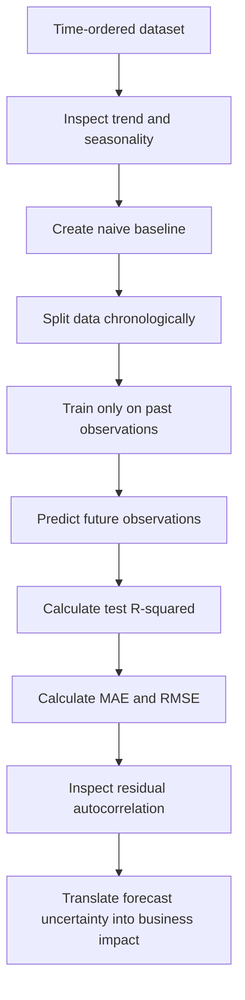

# 006 — R-squared

**Course:** 01 — Math, Statistics and Econometrics
**Module:** Module 03 — Econometrics and Time Series
**Content Group:** Econometrics Fundamentals
**Roadmap Source:** Econometrics and Time Series / Econometrics Fundamentals
**Lesson Type:** Econometrics and Time Series
**Order in Module:** 006
**Suggested Duration:** 22 minutes

---

## 1. Lesson Summary

This lesson explains **R-squared**, also written as $R^2$, in the context of AI, data science, econometrics, and forecasting.

R-squared measures how much of the variation in a target variable is explained by a regression model.

For example, suppose a model predicts house prices using floor area, location, and number of rooms. An R-squared value of `0.80` means that the model explains approximately 80% of the observed variation in house prices within the evaluated dataset.

R-squared is useful, but it does not prove that:

* the model is correct;
* the variables have a causal relationship;
* the model will perform well on future data;
* the prediction errors are acceptably small;
* the regression assumptions are satisfied.

Therefore, R-squared should be interpreted together with residual diagnostics, validation metrics, domain knowledge, and business requirements.

---

## 2. Learning Objectives

After completing this lesson, you should be able to:

* Explain R-squared in your own words.
* Calculate R-squared from actual and predicted values.
* Interpret high, low, zero, and negative R-squared values.
* Distinguish R-squared from correlation and prediction error.
* Explain why a high R-squared does not guarantee a good model.
* Compare R-squared with adjusted R-squared.
* Use R-squared appropriately in machine learning and time-series workflows.
* Build a small notebook or visualization that evaluates a regression model.

---

## 3. Core Idea

R-squared answers the following question:

> How much better is the regression model than simply predicting the mean of the target variable?

A model is compared against a simple baseline:

$$
\hat{y}_i = \bar{y}
$$

where:

* $y_i$ is the actual value;
* $\hat{y}_i$ is the predicted value;
* $\bar{y}$ is the mean of the actual target values.

If the regression model reduces prediction error substantially compared with the mean baseline, its R-squared value will be high.

---

## 4. Where R-squared Fits in the Workflow

```mermaid
flowchart LR
    A[Define the business question] --> B[Collect and clean data]
    B --> C[Select features and target]
    C --> D[Create a baseline model]
    D --> E[Train a regression model]
    E --> F[Generate predictions]
    F --> G[Calculate R-squared]
    G --> H[Inspect residuals]
    H --> I[Validate on unseen data]
    I --> J[Translate results into business decisions]
```



R-squared is only one part of model evaluation. It should not replace residual analysis or out-of-sample validation.

---

## 5. Mathematical Definition

R-squared is calculated as:

$$
R^2 = 1 - \frac{SS_{\text{res}}}{SS_{\text{tot}}}
$$

where:

$$
SS_{\text{res}} = \sum_{i=1}^{n}(y_i-\hat{y}_i)^2
$$

and:

$$
SS_{\text{tot}} = \sum_{i=1}^{n}(y_i-\bar{y})^2
$$

The components are:

* $SS_{\text{res}}$: residual sum of squares;
* $SS_{\text{tot}}$: total sum of squares;
* $y_i$: actual value for observation $i$;
* $\hat{y}_i$: predicted value for observation $i$;
* $\bar{y}$: mean of all actual target values;
* $n$: number of observations.

The formula compares the model's unexplained variation with the original total variation in the target.

---

## 6. Understanding the Components

### 6.1 Total Sum of Squares

The total sum of squares measures how much the actual values vary around their mean:

$$
SS_{\text{tot}} = \sum_{i=1}^{n}(y_i-\bar{y})^2
$$

It represents the error produced by a baseline model that predicts the target mean for every observation.

### 6.2 Residual Sum of Squares

The residual sum of squares measures the remaining error after using the regression model:

$$
SS_{\text{res}} = \sum_{i=1}^{n}(y_i-\hat{y}_i)^2
$$

A smaller residual sum of squares means that predictions are closer to the actual values.

### 6.3 Explained Sum of Squares

For an ordinary least squares regression with an intercept, the explained sum of squares can be written as:

$$
SS_{\text{reg}} = \sum_{i=1}^{n}(\hat{y}_i-\bar{y})^2
$$

Under the standard OLS decomposition:

$$
SS_{\text{tot}} = SS_{\text{reg}} + SS_{\text{res}}
$$

Therefore:

$$
R^2 = \frac{SS_{\text{reg}}}{SS_{\text{tot}}}
$$

This interpretation only works cleanly under the usual OLS setup, especially when the model contains an intercept.

---

## 7. Intuitive Interpretation

Consider three cases.

### Case 1: Perfect predictions

If:

$$
\hat{y}_i = y_i
$$

for every observation, then:

$$
SS_{\text{res}} = 0
$$

Therefore:

$$
R^2 = 1
$$

The model explains all observed variation in the target.

### Case 2: Predictions are equal to the target mean

If the model predicts:

$$
\hat{y}_i = \bar{y}
$$

for every observation, then:

$$
SS_{\text{res}} = SS_{\text{tot}}
$$

Therefore:

$$
R^2 = 0
$$

The model performs no better than the mean baseline.

### Case 3: Predictions are worse than the target mean

If:

$$
SS_{\text{res}} > SS_{\text{tot}}
$$

then:

$$
R^2 < 0
$$

A negative R-squared means that the evaluated model performs worse than predicting the target mean.

---

## 8. Interpreting R-squared Values

| R-squared | General interpretation                             |
| --------: | -------------------------------------------------- |
|    `1.00` | Perfect fit on the evaluated data                  |
|    `0.90` | Approximately 90% of target variation is explained |
|    `0.50` | Approximately 50% of target variation is explained |
|    `0.00` | No improvement over predicting the target mean     |
|  `< 0.00` | Worse than the mean baseline                       |

These interpretations are context-dependent.

An R-squared of `0.40` may be valuable in a noisy social-science problem, while an R-squared of `0.95` may be inadequate for a highly controlled engineering process.

There is no universal threshold that defines a good R-squared value.

---

## 9. Manual Calculation Example

Suppose the actual and predicted values are:

| Observation | Actual $y_i$ | Predicted $\hat{y}_i$ |
| ----------: | -----------: | --------------------: |
|           1 |            3 |                   2.5 |
|           2 |            5 |                   5.0 |
|           3 |            7 |                   6.5 |
|           4 |            9 |                   8.0 |

### Step 1: Calculate the mean

$$
\bar{y} = \frac{3+5+7+9}{4} = 6
$$

### Step 2: Calculate the total sum of squares

$$
SS_{\text{tot}} = (3-6)^2 + (5-6)^2 + (7-6)^2 + (9-6)^2
$$

$$
SS_{\text{tot}} = 9+1+1+9 = 20
$$

### Step 3: Calculate the residual sum of squares

$$
SS_{\text{res}} = (3-2.5)^2 + (5-5)^2 + (7-6.5)^2 + (9-8)^2
$$

$$
SS_{\text{res}} = 0.25 + 0 + 0.25 + 1 = 1.5
$$

### Step 4: Calculate R-squared

$$
R^2 = 1 - \frac{1.5}{20}
$$

$$
R^2 = 0.925
$$

The model explains approximately 92.5% of the observed variation in the target values.

This does not mean that every prediction is 92.5% accurate. R-squared measures explained variation, not percentage accuracy.

---

## 10. R-squared Is Not Prediction Accuracy

A common mistake is to say:

> An R-squared of 0.90 means the model is 90% accurate.

This statement is incorrect.

R-squared does not directly measure the magnitude of prediction errors. Two models can have similar R-squared values but very different MAE or RMSE values.

For example:

* R-squared measures explained variation.
* MAE measures average absolute prediction error.
* RMSE penalizes large prediction errors more strongly.

A complete regression evaluation may include:

$$
R^2,\quad MAE,\quad RMSE
$$

The correct metric depends on the business problem.

---

## 11. R-squared vs Other Metrics

| Metric    | Main question answered                                            | Unit                |
| --------- | ----------------------------------------------------------------- | ------------------- |
| R-squared | How much variation is explained?                                  | Unitless            |
| MAE       | What is the average absolute error?                               | Same unit as target |
| MSE       | What is the average squared error?                                | Squared target unit |
| RMSE      | What is the typical error with larger penalties for large misses? | Same unit as target |
| MAPE      | What is the average percentage error?                             | Percentage          |

R-squared is useful for relative fit, while MAE and RMSE are often easier to explain to business stakeholders.

For example:

* “The model has an R-squared of 0.82” describes explained variation.
* “The model misses monthly revenue by an average of $12,000” describes operational prediction error.

---

## 12. R-squared and Correlation

R-squared and correlation are related but are not generally identical.

In a simple linear regression with:

* one predictor;
* an intercept;
* ordinary least squares estimation;

R-squared equals the squared Pearson correlation between $X$ and $Y$:

$$
R^2 = r_{XY}^2
$$

However, this relationship does not directly apply to every regression setting.

Important differences:

* Correlation measures linear association between two variables.
* R-squared evaluates the fit of a regression model.
* Correlation has a sign, from `-1` to `1`.
* R-squared usually does not communicate direction.
* Multiple regression can have many predictors, so there is no single predictor-target correlation equivalent.

---

## 13. Why R-squared Usually Increases When Features Are Added

In ordinary least squares regression, adding another predictor cannot increase the training residual sum of squares.

Therefore, training R-squared usually stays the same or increases:

$$
R^2_{\text{new}} \geq R^2_{\text{old}}
$$

This happens even when the new feature has little real predictive value.

As a result, a model with more variables may appear better according to training R-squared while becoming:

* harder to interpret;
* more sensitive to noise;
* more likely to overfit;
* worse on unseen data.

This limitation motivates adjusted R-squared.

---

## 14. Adjusted R-squared

Adjusted R-squared penalizes the inclusion of unnecessary predictors.

Its formula is:

$$
\bar{R}^2 = 1 - (1-R^2)\frac{n-1}{n-p-1}
$$

where:

* $n$ is the number of observations;
* $p$ is the number of predictors;
* $R^2$ is the ordinary R-squared.

Unlike regular R-squared, adjusted R-squared can decrease when a weak predictor is added.

### Example

Suppose:

$$
R^2 = 0.80,\quad n=100,\quad p=5
$$

Then:

$$
\bar{R}^2 = 1 - (1-0.80)\frac{100-1}{100-5-1}
$$

$$
\bar{R}^2 = 1 - 0.20\left(\frac{99}{94}\right)
$$

$$
\bar{R}^2 \approx 0.789
$$

Adjusted R-squared is slightly lower because it accounts for model complexity.

### When to use each metric

| Metric               | Recommended use                                           |
| -------------------- | --------------------------------------------------------- |
| R-squared            | Reporting the proportion of variation explained           |
| Adjusted R-squared   | Comparing OLS models with different numbers of predictors |
| Validation R-squared | Evaluating generalization to unseen data                  |
| MAE or RMSE          | Measuring error in meaningful target units                |

---

## 15. Training R-squared vs Test R-squared

Training R-squared measures how well the model fits the data used during training.

Test R-squared measures performance on unseen data.

A large gap may indicate overfitting:

| Metric             |  Value |
| ------------------ | -----: |
| Training R-squared | `0.96` |
| Test R-squared     | `0.58` |

The model explains 96% of the training variation but only 58% of the test variation.

This suggests that the model learned patterns that do not generalize well.

A better workflow is:

```text
training data
    -> fit model
    -> calculate training R-squared

validation or test data
    -> generate unseen predictions
    -> calculate test R-squared
    -> compare with MAE, RMSE, and residual diagnostics
```

---

## 16. Python Demo

```python
import numpy as np
from sklearn.linear_model import LinearRegression
from sklearn.metrics import mean_absolute_error, mean_squared_error, r2_score
from sklearn.model_selection import train_test_split

# Example feature and target
X = np.array([
    [1],
    [2],
    [3],
    [4],
    [5],
    [6],
    [7],
    [8],
    [9],
    [10],
])

y = np.array([
    3.1,
    4.8,
    7.2,
    8.7,
    11.1,
    13.2,
    14.0,
    16.5,
    18.1,
    20.4,
])

X_train, X_test, y_train, y_test = train_test_split(
    X,
    y,
    test_size=0.3,
    random_state=42,
)

model = LinearRegression()
model.fit(X_train, y_train)

train_predictions = model.predict(X_train)
test_predictions = model.predict(X_test)

train_r2 = r2_score(y_train, train_predictions)
test_r2 = r2_score(y_test, test_predictions)

test_mae = mean_absolute_error(y_test, test_predictions)
test_rmse = mean_squared_error(
    y_test,
    test_predictions,
) ** 0.5

print(f"Training R-squared: {train_r2:.3f}")
print(f"Test R-squared: {test_r2:.3f}")
print(f"Test MAE: {test_mae:.3f}")
print(f"Test RMSE: {test_rmse:.3f}")
```

The important comparison is not only whether R-squared is high, but whether:

* test performance is close to training performance;
* errors are acceptable in business units;
* residuals reveal systematic patterns;
* results remain stable across validation splits.

---

## 17. Manual R-squared Function

The following function calculates R-squared without using a machine-learning library:

```python
import numpy as np


def calculate_r_squared(
    y_true: np.ndarray,
    y_pred: np.ndarray,
) -> float:
    """Calculate R-squared from actual and predicted values."""

    y_true = np.asarray(y_true, dtype=float)
    y_pred = np.asarray(y_pred, dtype=float)

    if y_true.shape != y_pred.shape:
        raise ValueError(
            "y_true and y_pred must have the same shape."
        )

    if y_true.size == 0:
        raise ValueError(
            "Input arrays must not be empty."
        )

    target_mean = np.mean(y_true)

    residual_sum_of_squares = np.sum(
        (y_true - y_pred) ** 2
    )

    total_sum_of_squares = np.sum(
        (y_true - target_mean) ** 2
    )

    if total_sum_of_squares == 0:
        raise ValueError(
            "R-squared is undefined when all target values are identical."
        )

    return 1 - (
        residual_sum_of_squares
        / total_sum_of_squares
    )


actual = np.array([3, 5, 7, 9])
predicted = np.array([2.5, 5.0, 6.5, 8.0])

score = calculate_r_squared(actual, predicted)

print(f"R-squared: {score:.3f}")
```

Expected result:

```text
R-squared: 0.925
```

---

## 18. Visualizing Model Fit

A useful regression chart contains:

* observed data points;
* the fitted regression line;
* residual distances;
* training and test metrics.

```python
import matplotlib.pyplot as plt

plt.scatter(
    X_test.flatten(),
    y_test,
    label="Actual values",
)

plt.scatter(
    X_test.flatten(),
    test_predictions,
    label="Predicted values",
)

plt.xlabel("Feature")
plt.ylabel("Target")
plt.title(f"Regression Predictions — Test R² = {test_r2:.3f}")
plt.legend()
plt.show()
```

The chart should be interpreted together with a residual plot.

---

## 19. Residual Diagnostics

A high R-squared does not guarantee that the regression assumptions are satisfied.

Residuals are calculated as:

$$
e_i = y_i - \hat{y}_i
$$

A residual plot can reveal:

* non-linearity;
* heteroscedasticity;
* autocorrelation;
* outliers;
* missing variables;
* structural breaks;
* seasonal patterns.

```python
residuals = y_test - test_predictions

plt.scatter(test_predictions, residuals)
plt.axhline(0)
plt.xlabel("Predicted values")
plt.ylabel("Residuals")
plt.title("Residual Plot")
plt.show()
```

A healthy residual plot usually has points distributed around zero without an obvious systematic pattern.

### Example patterns

| Residual pattern              | Possible issue                            |
| ----------------------------- | ----------------------------------------- |
| Curved shape                  | Missing nonlinear relationship            |
| Funnel shape                  | Heteroscedasticity                        |
| Long runs above or below zero | Autocorrelation or missing time structure |
| Isolated extreme points       | Outliers or data errors                   |
| Seasonal pattern              | Missing seasonality variables             |

---

## 20. R-squared in Time-Series Problems

R-squared must be used carefully for time-series data.

Time-dependent data may contain:

* trend;
* seasonality;
* autocorrelation;
* structural changes;
* non-stationarity;
* leakage from future observations.

A model may achieve a high R-squared simply because both variables trend upward over time.

For example:

```text
advertising spend rises over time
sales also rise over time
```

A regression may produce a high R-squared even when the apparent relationship is mostly caused by the shared trend.

This is sometimes called a **spurious regression**.

### Time-series evaluation workflow



Do not randomly shuffle time-series observations unless the modeling design explicitly allows it.

---

## 21. Baselines for Time-Series R-squared

The standard R-squared baseline predicts the target mean.

However, the mean may be a weak baseline for forecasting.

More realistic time-series baselines include:

### Naive forecast

$$
\hat{y}_t = y_{t-1}
$$

The next value is predicted using the most recent observation.

### Seasonal naive forecast

$$
\hat{y}_t = y_{t-s}
$$

where $s$ is the seasonal period.

For monthly data with yearly seasonality:

$$
s=12
$$

A forecasting model should ideally outperform these baselines, not only the global mean.

---

## 22. High R-squared but Bad Model

A model can have a high R-squared and still be unsuitable.

### Scenario 1: Data leakage

A feature contains information that would not be available when making a real prediction.

```text
Target:
customer churn next month

Leaky feature:
account closure status recorded after churn
```

The model may achieve an extremely high R-squared or classification score, but it cannot be deployed correctly.

### Scenario 2: Overfitting

The model memorizes training noise and performs poorly on test data.

### Scenario 3: Spurious correlation

Two variables move together because of a shared trend or external factor.

### Scenario 4: Incorrect functional form

A linear model is fitted to a nonlinear relationship.

### Scenario 5: Important local errors

The overall R-squared is high, but the model fails badly for a critical customer segment or time period.

### Scenario 6: Small but costly errors

The model explains most variation, but its remaining errors produce unacceptable financial or safety consequences.

---

## 23. Low R-squared but Useful Model

A low R-squared does not always make a model useless.

Suppose a customer-behavior model has:

$$
R^2 = 0.25
$$

Human behavior may be influenced by many unobserved factors. Explaining 25% of the variation could still create meaningful business value if the model:

* improves targeting;
* reduces acquisition costs;
* identifies high-risk customers;
* supports better resource allocation;
* consistently outperforms a simple baseline.

The correct question is not only:

> Is R-squared high?

It is also:

> Does the model improve decisions enough to create value?

---

## 24. Common Mistakes

### Mistake 1: Treating R-squared as percentage accuracy

Incorrect:

```text
R² = 0.80 means the model is 80% accurate.
```

Better:

```text
The model explains approximately 80% of the observed variation in the target.
```

### Mistake 2: Evaluating only training R-squared

A high training score may result from overfitting.

Always calculate R-squared on validation or test data.

### Mistake 3: Ignoring residuals

A high R-squared can coexist with:

* non-linearity;
* heteroscedasticity;
* autocorrelation;
* outliers.

### Mistake 4: Comparing R-squared across unrelated datasets

R-squared depends on the variation in the evaluated target data. Scores from different datasets or target definitions may not be directly comparable.

### Mistake 5: Adding variables only to increase R-squared

Regular R-squared usually increases when predictors are added. Use adjusted R-squared and out-of-sample validation.

### Mistake 6: Assuming causality

A high R-squared demonstrates model fit, not a causal relationship.

### Mistake 7: Ignoring temporal leakage

Future information must not be used to predict the past.

### Mistake 8: Ignoring business units

Stakeholders may understand MAE in dollars, days, or units more easily than R-squared.

### Mistake 9: Using R-squared for the wrong problem

R-squared is primarily a regression metric. It is not a standard evaluation metric for classification problems.

---

## 25. Business Interpretation Template

A useful business explanation can follow this structure:

> The model achieved a test R-squared of **0.76**, meaning that it explained approximately **76% of the observed variation in weekly sales** during the test period. Its RMSE was **1,250 units**, so predictions typically differed from actual sales by an operationally meaningful amount. Residual analysis showed larger errors during holiday weeks, suggesting that promotion and holiday features should be improved before deployment.

This explanation includes:

* the evaluated dataset;
* the R-squared value;
* the meaning of the value;
* an error metric in business units;
* an important limitation;
* a recommended next step.

---

## 26. Practical Mini-Demo: Sales Prediction

Suppose a company wants to predict weekly sales using:

* advertising spend;
* product price;
* promotion status;
* holiday indicator;
* previous-week sales.

A suitable workflow is:

```text
weekly sales data
    -> chronological train/test split
    -> mean and naive baselines
    -> linear regression
    -> test R-squared
    -> MAE and RMSE
    -> residual analysis
    -> segment analysis
    -> business recommendation
```

Example report:

```text
Training R-squared: 0.88
Test R-squared: 0.72
Test MAE: 910 units
Test RMSE: 1,270 units

Interpretation:
The model explains 72% of sales variation in the future test
period. Errors increase during holiday campaigns, so holiday
interaction features and a seasonal forecasting model should be
tested next.
```

---

## 27. Model Evaluation Checklist

Before accepting an R-squared result, ask:

* Was the score calculated on unseen data?
* Was the data split correctly?
* Was temporal order preserved?
* Is there any target leakage?
* Was a meaningful baseline evaluated?
* Are MAE and RMSE also reported?
* Were residuals inspected?
* Are errors stable across segments?
* Are the regression assumptions reasonable?
* Does the model improve business decisions?
* Is the result stable across different validation periods?
* Are prediction intervals or uncertainty estimates needed?

---

## 28. Hands-on Exercise

Use a small regression dataset such as:

* house prices;
* monthly sales;
* energy consumption;
* advertising and revenue;
* delivery time;
* product demand.

Complete the following tasks:

1. Select a target variable and at least one predictor.
2. Split the data into training and test sets.
3. Train a baseline that predicts the target mean.
4. Train a linear regression model.
5. Calculate training R-squared.
6. Calculate test R-squared.
7. Calculate MAE and RMSE.
8. Plot actual values against predicted values.
9. Create a residual plot.
10. Write a five-sentence business interpretation.

### Suggested output

```text
Dataset:
Target:
Predictors:
Training R-squared:
Test R-squared:
Test MAE:
Test RMSE:
Main residual pattern:
Business interpretation:
Main caveat:
Next experiment:
```

---

## 29. Reflection Questions

1. What does R-squared compare the model against?
2. Why can test R-squared be negative?
3. Why does training R-squared usually increase when predictors are added?
4. How does adjusted R-squared address this limitation?
5. Why does a high R-squared not prove causality?
6. What can a residual plot reveal that R-squared cannot?
7. Why is random train-test splitting dangerous for time-series data?
8. When might a low R-squared model still create business value?
9. Why should R-squared be reported together with MAE or RMSE?
10. What baseline would be appropriate for your current dataset?

---

## 30. Common Interview Questions

### What is R-squared?

R-squared measures the proportion of observed target variation explained by a regression model relative to a mean-prediction baseline.

### Can R-squared be negative?

Yes. Test R-squared can be negative when the model performs worse than predicting the mean of the evaluated target values.

### Is a higher R-squared always better?

Not necessarily. A higher training R-squared may result from overfitting, leakage, unnecessary predictors, or spurious relationships.

### What is the difference between R-squared and adjusted R-squared?

R-squared does not penalize additional predictors. Adjusted R-squared accounts for both sample size and the number of predictors.

### Does high R-squared imply causation?

No. It measures model fit, not causality.

### Should R-squared be used alone?

No. It should be combined with validation results, MAE or RMSE, residual diagnostics, domain knowledge, and business requirements.

---

## 31. Completion Checklist

* [ ] I can explain R-squared in one or two minutes.
* [ ] I understand the mean-prediction baseline.
* [ ] I can write the R-squared formula.
* [ ] I can calculate R-squared manually.
* [ ] I understand why R-squared can be negative.
* [ ] I know that R-squared is not percentage accuracy.
* [ ] I can distinguish R-squared from MAE and RMSE.
* [ ] I understand adjusted R-squared.
* [ ] I can calculate training and test R-squared.
* [ ] I can inspect a residual plot.
* [ ] I understand the risks of time-series leakage.
* [ ] I have created a notebook, chart, model, API, or portfolio note for this lesson.
* [ ] I have documented at least one assumption, limitation, or unanswered question.

---

## 32. Related Outcome

Model relationships and time-dependent data using:

* regression;
* model diagnostics;
* residual analysis;
* baseline comparison;
* ARIMA;
* forecasting workflows;
* out-of-sample evaluation.

---

## 33. Related Project

### Mini Project: Sales Forecasting

Build a sales forecasting notebook that includes:

* exploratory time-series analysis;
* trend and seasonality visualization;
* chronological data splitting;
* mean and naive baselines;
* linear regression;
* optional ARIMA or seasonal model;
* training and test R-squared;
* MAE and RMSE;
* residual diagnostics;
* business recommendations.

### Suggested portfolio artifacts

* Jupyter notebook;
* cleaned dataset;
* actual-versus-predicted chart;
* residual plot;
* metric comparison table;
* model card;
* README explanation;
* FastAPI prediction endpoint;
* Dockerized model service.

---

## 34. Key Takeaways

1. R-squared measures explained variation relative to a mean baseline.

2. Its main formula is:

$$
R^2 = 1 - \frac{SS_{\text{res}}}{SS_{\text{tot}}}
$$

3. An R-squared of `1` represents a perfect fit on the evaluated data.

4. An R-squared of `0` means the model is no better than predicting the mean.

5. A negative test R-squared means the model is worse than the mean baseline.

6. R-squared is not percentage accuracy.

7. A high R-squared does not guarantee good predictions, valid assumptions, causality, or business value.

8. Training R-squared should be compared with validation or test R-squared.

9. Adjusted R-squared is useful when comparing OLS models with different numbers of predictors.

10. R-squared should be reported together with MAE, RMSE, residual diagnostics, and domain-specific interpretation.

---

## 35. Final Summary

**R-squared** is a central regression metric that describes how much variation in a target variable is explained by a model relative to a mean-prediction baseline.

It is useful for understanding model fit, comparing regression models, and communicating explained variation. However, it should never be interpreted in isolation.

A reliable AI or data-science workflow combines R-squared with:

* out-of-sample validation;
* baseline comparison;
* MAE or RMSE;
* residual diagnostics;
* leakage checks;
* time-aware evaluation;
* business interpretation.

Turn this lesson into a notebook, model evaluation report, visualization, API, Docker service, or portfolio artifact so that the concept becomes practical rather than purely theoretical.