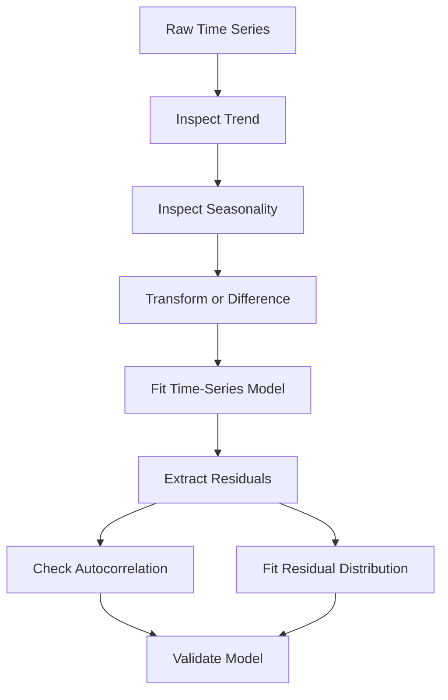
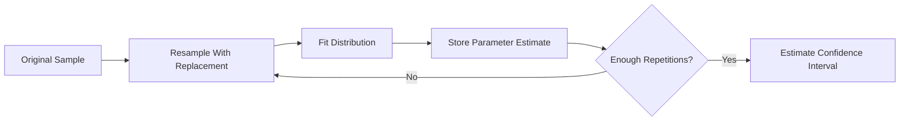
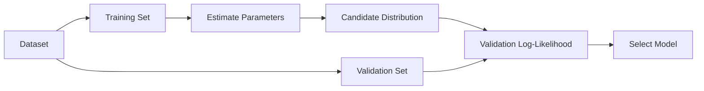

# 009 — Fitting Distributions

**Course:** 01 — Math, Statistics and Econometrics
**Module:** Module 03 — Econometrics and Time Series
**Content Group:** Econometrics Fundamentals
**Roadmap Source:** Econometrics and Time Series / Econometrics Fundamentals
**Lesson Type:** Econometrics and Time Series
**Order in Module:** 009
**Suggested Duration:** 22 minutes

---

## 1. Overview

**Distribution fitting** is the process of selecting a probability distribution and estimating its parameters so that the distribution represents the observed data as closely as possible.

For example, a Data Scientist may want to determine whether:

* Customer waiting times follow an exponential or gamma distribution.
* Daily order counts follow a Poisson or negative binomial distribution.
* Product demand follows a normal or log-normal distribution.
* Insurance claims follow a gamma or Weibull distribution.
* Model residuals are approximately normally distributed.

A fitted distribution can be used to:

* Describe uncertainty.
* Estimate probabilities and percentiles.
* Detect unusual observations.
* Simulate realistic synthetic data.
* Build probabilistic models.
* Perform risk analysis.
* Validate statistical assumptions.

The goal is not to find a distribution that matches every observation perfectly. The goal is to find a useful probabilistic approximation of the data-generating process.

---

## 2. Learning Objectives

After completing this lesson, you should be able to:

* Explain distribution fitting in your own words.
* Distinguish between empirical and theoretical distributions.
* Identify suitable candidate distributions for different types of data.
* Estimate distribution parameters using common methods.
* Evaluate goodness of fit using visual and statistical diagnostics.
* Compare candidate distributions using information criteria.
* Recognize the limitations of distribution fitting.
* Apply distribution fitting to an AI or Data Science problem.
* Create a small notebook, chart, API, or portfolio artifact.

---

## 3. Core Concept

Suppose we observe a dataset:

$$
x_1, x_2, \ldots, x_n
$$

We assume that the observations were generated from a probability distribution with parameter vector $\theta$:

$$
X \sim f(x \mid \theta)
$$

Distribution fitting attempts to estimate:

$$
\hat{\theta}
$$

so that:

$$
f(x \mid \hat{\theta})
$$

provides a reasonable representation of the observed data.

For a normal distribution:

$$
X \sim \mathcal{N}(\mu, \sigma^2)
$$

the unknown parameters are:

$$
\theta = (\mu, \sigma)
$$

After fitting the distribution, we obtain estimates:

$$
\hat{\mu}
\quad \text{and} \quad
\hat{\sigma}
$$

The fitted model becomes:

$$
X \sim \mathcal{N}(\hat{\mu}, \hat{\sigma}^2)
$$

---

## 4. Empirical vs. Theoretical Distributions

### 4.1 Empirical distribution

The empirical distribution is constructed directly from the observed data.

It does not assume a specific mathematical form.

Examples include:

* Histogram.
* Empirical cumulative distribution function.
* Kernel density estimate.
* Observed quantiles.

The empirical cumulative distribution function is:

$$
\hat{F}_n(x) = \frac{1}{n} \sum_{i=1}^{n} \mathbf{1}(x_i \leq x)
$$

where $\mathbf{1}(\cdot)$ is an indicator function.

The empirical distribution is flexible, but it may not generalize well beyond the observed sample.

---

### 4.2 Theoretical distribution

A theoretical distribution follows a defined mathematical form.

Examples include:

* Normal distribution.
* Log-normal distribution.
* Exponential distribution.
* Gamma distribution.
* Weibull distribution.
* Poisson distribution.
* Binomial distribution.
* Negative binomial distribution.

A theoretical distribution is more restrictive, but it offers several benefits:

* Compact parameter representation.
* Probability calculations.
* Tail-risk estimation.
* Simulation of new observations.
* Integration into statistical models.

---

## 5. Distribution-Fitting Workflow


A practical fitting process should combine:

1. Domain knowledge.
2. Data-type constraints.
3. Parameter estimation.
4. Visual diagnostics.
5. Statistical tests.
6. Business usefulness.

No single metric should determine the final distribution.

---

## 6. Choosing Candidate Distributions

The type and support of the variable should guide the initial candidate distributions.

### 6.1 Continuous variables

| Data characteristics           | Possible distributions          |
| ------------------------------ | ------------------------------- |
| Symmetric, unrestricted values | Normal, Student's t             |
| Positive and right-skewed      | Log-normal, Gamma, Weibull      |
| Time until an event            | Exponential, Gamma, Weibull     |
| Values between 0 and 1         | Beta                            |
| Heavy-tailed values            | Student's t, Pareto, log-normal |
| Extreme values                 | Generalized extreme value       |

---

### 6.2 Discrete variables

| Data characteristics                | Possible distributions                     |
| ----------------------------------- | ------------------------------------------ |
| Binary outcome                      | Bernoulli                                  |
| Number of successes in fixed trials | Binomial                                   |
| Count of events in a fixed interval | Poisson                                    |
| Count data with overdispersion      | Negative binomial                          |
| Number of trials until success      | Geometric                                  |
| Excessive zero observations         | Zero-inflated Poisson or negative binomial |

---

### 6.3 Domain constraints

Before fitting a distribution, check the support of the data.

For example:

* A normal distribution permits negative values.
* A gamma distribution only permits positive values.
* A beta distribution requires values between 0 and 1.
* A Poisson distribution is defined for non-negative integer counts.

A distribution may produce a good numerical fit while still violating important domain constraints.

---

## 7. Common Probability Distributions

## 7.1 Normal distribution

The normal probability density function is:

$$
f(x) = \frac{1}{\sigma\sqrt{2\pi}} \exp\left( -\frac{(x-\mu)^2}{2\sigma^2} \right)
$$

where:

* $\mu$ is the mean.
* $\sigma$ is the standard deviation.
* $-\infty < x < \infty$.

Use the normal distribution when the data are approximately symmetric and bell-shaped.

Common applications:

* Measurement errors.
* Aggregated quantities.
* Model residuals.
* Standardized test scores.

A normal distribution is often inappropriate for strongly skewed, non-negative data such as revenue or waiting time.

---

## 7.2 Log-normal distribution

A variable $X$ follows a log-normal distribution when:

$$
\log(X) \sim \mathcal{N}(\mu, \sigma^2)
$$

The variable must satisfy:

$$
X > 0
$$

The log-normal distribution is useful for positive, right-skewed variables created by multiplicative processes.

Common applications:

* Customer spending.
* Income.
* File sizes.
* Transaction values.
* Time required to complete a task.

---

## 7.3 Exponential distribution

The exponential density function is:

$$
f(x) = \lambda e^{-\lambda x}, \qquad x \geq 0
$$

where $\lambda$ is the event rate.

Its expected value is:

$$
\mathbb{E}[X] = \frac{1}{\lambda}
$$

The exponential distribution is commonly used for waiting times when the event rate is assumed to be constant.

A major property is memorylessness:

$$
P(X > s+t \mid X > s) = P(X > t)
$$

This assumption may be unrealistic when the probability of an event changes over time.

---

## 7.4 Gamma distribution

The gamma density function can be written as:

$$
f(x) = \frac{1}{\Gamma(k)\theta^k} x^{k-1} e^{-x/\theta}, \qquad x > 0
$$

where:

* $k$ is the shape parameter.
* $\theta$ is the scale parameter.

Its mean and variance are:

$$
\mathbb{E}[X] = k\theta
$$

$$
\text{Var}(X) = k\theta^2
$$

The gamma distribution is useful for positive and right-skewed data.

Common applications:

* Customer service duration.
* Insurance claims.
* Rainfall amounts.
* Transaction values.
* Total waiting time across several events.

---

## 7.5 Weibull distribution

The Weibull density is:

$$
f(x) = \frac{k}{\lambda} \left( \frac{x}{\lambda} \right)^{k-1} \exp\left[ -\left( \frac{x}{\lambda} \right)^k \right], \qquad x \geq 0
$$

where:

* $k$ is the shape parameter.
* $\lambda$ is the scale parameter.

The shape parameter provides information about the event rate:

* $k < 1$: the event rate decreases over time.
* $k = 1$: the event rate is constant.
* $k > 1$: the event rate increases over time.

The Weibull distribution is frequently used in:

* Reliability engineering.
* Failure-time analysis.
* Churn-time modeling.
* Survival analysis.

---

## 7.6 Poisson distribution

The Poisson probability mass function is:

$$
P(X=x) = \frac{\lambda^x e^{-\lambda}}{x!}, \qquad x = 0,1,2,\ldots
$$

Its mean and variance are both equal to $\lambda$:

$$
\mathbb{E}[X] = \lambda
$$

$$
\text{Var}(X) = \lambda
$$

The Poisson distribution is appropriate for event counts when:

* Events occur independently.
* The event rate is approximately constant.
* The observation interval is fixed.
* The mean and variance are reasonably similar.

Examples include:

* Orders per hour.
* Website errors per minute.
* Support tickets per day.
* Machine failures per week.

---

## 7.7 Negative binomial distribution

Count data often have:

$$
\text{Var}(X) > \mathbb{E}[X]
$$

This is called **overdispersion**.

In that situation, a negative binomial distribution may fit better than a Poisson distribution.

Possible causes of overdispersion include:

* Different user behaviors.
* Hidden subgroups.
* Time-varying event rates.
* Clustering of events.
* Unobserved explanatory variables.

---

## 8. Parameter Estimation Methods

## 8.1 Maximum Likelihood Estimation

Maximum likelihood estimation, or MLE, selects parameters that make the observed data most probable.

For independent observations:

$$
L(\theta) = \prod_{i=1}^{n} f(x_i \mid \theta)
$$

The MLE is:

$$
\hat{\theta}_{\text{MLE}} = \arg\max_{\theta} L(\theta)
$$

Because products of many probabilities can become extremely small, we usually maximize the log-likelihood:

$$
\ell(\theta) = # \log L(\theta) \sum_{i=1}^{n} \log f(x_i \mid \theta)
$$

Therefore:

$$
\hat{\theta}_{\text{MLE}} = \arg\max_{\theta} \ell(\theta)
$$

MLE is widely used because it is:

* General.
* Statistically well studied.
* Compatible with optimization algorithms.
* Available in most statistical libraries.

However, MLE estimates can be sensitive to outliers and model misspecification.

---

## 8.2 Method of Moments

The method of moments matches theoretical moments to sample moments.

For example, the first sample moment is:

$$
m_1 = \frac{1}{n} \sum_{i=1}^{n} x_i
$$

The second sample moment is:

$$
m_2 = \frac{1}{n} \sum_{i=1}^{n} x_i^2
$$

These sample moments are matched with theoretical moments to solve for the unknown parameters.

For a normal distribution:

$$
\hat{\mu} = \bar{x}
$$

and:

$$
\hat{\sigma}^2 = \frac{1}{n} \sum_{i=1}^{n} (x_i-\bar{x})^2
$$

The method of moments is often simple and computationally efficient, but it may be less statistically efficient than MLE.

---

## 8.3 Bayesian estimation

Bayesian estimation combines:

* A prior distribution for the parameters.
* The likelihood from the observed data.
* A posterior distribution.

Bayes' rule gives:

$$
p(\theta \mid x) = \frac{ p(x \mid \theta)p(\theta) }{ p(x) }
$$

or proportionally:

$$
p(\theta \mid x)
\propto
p(x \mid \theta)p(\theta)
$$

Instead of producing only one parameter estimate, Bayesian fitting produces a distribution over plausible parameter values.

This is useful when:

* Data are limited.
* Prior knowledge is available.
* Parameter uncertainty is important.
* The model is hierarchical.

---

## 9. Visual Goodness-of-Fit Diagnostics

Visual inspection should be performed before relying on formal tests.

## 9.1 Histogram with fitted density

Overlay the fitted probability density function on the observed histogram.

This helps identify:

* Skewness mismatch.
* Incorrect modality.
* Poor tail fit.
* Incorrect variance.
* Impossible support.

However, the appearance of a histogram depends on the selected bin width.

---

## 9.2 Empirical and fitted CDF

Compare the empirical CDF:

$$
\hat{F}_n(x)
$$

with the fitted theoretical CDF:

$$
F(x \mid \hat{\theta})
$$

CDF comparisons are often more stable than histogram comparisons because they do not depend on bin selection.

---

## 9.3 Q–Q plot

A quantile–quantile plot compares observed quantiles with theoretical quantiles.

If the fitted distribution is appropriate, the points should lie approximately on a straight diagonal line.

```text
Theoretical Quantiles
        |
        |                    •
        |                •
        |            •
        |        •
        |    •
        | •
        +-------------------------- Observed Quantiles
```

Common Q–Q plot patterns:

| Pattern                      | Possible interpretation       |
| ---------------------------- | ----------------------------- |
| Approximately straight line  | Reasonable fit                |
| Curved shape                 | Skewness mismatch             |
| Deviations at both ends      | Tail mismatch                 |
| Large deviation on the right | Poor upper-tail fit           |
| Clusters or steps            | Discrete or grouped data      |
| Multiple curves or bends     | Possible mixture distribution |

---

## 9.4 P–P plot

A probability–probability plot compares:

$$
F(x_i \mid \hat{\theta})
$$

with the empirical cumulative probabilities.

P–P plots emphasize the center of the distribution, while Q–Q plots are often better for diagnosing tail behavior.

---

## 10. Statistical Goodness-of-Fit Tests

## 10.1 Kolmogorov–Smirnov test

The Kolmogorov–Smirnov statistic is:

$$
D_n = \sup_x \left| \hat{F}_n(x) - F(x \mid \hat{\theta}) \right|
$$

It measures the largest absolute difference between the empirical and theoretical CDFs.

Hypotheses:

$$
H_0:
\text{The sample follows the specified distribution}
$$

$$
H_1:
\text{The sample does not follow the specified distribution}
$$

A small p-value provides evidence against the fitted distribution.

Important caveat: the standard Kolmogorov–Smirnov test assumes that the distribution parameters were specified independently of the sample. When parameters are estimated from the same data, adjusted procedures or bootstrapping may be needed.

---

## 10.2 Anderson–Darling test

The Anderson–Darling test compares the empirical and theoretical CDFs while giving more weight to the tails.

It is useful when extreme values are important, such as:

* Financial risk.
* Reliability.
* Fraud detection.
* Service-level violations.
* Insurance claims.

---

## 10.3 Chi-square goodness-of-fit test

For grouped observations, the statistic is:

$$
\chi^2 = \sum_{j=1}^{k} \frac{ (O_j-E_j)^2 }{ E_j }
$$

where:

* $O_j$ is the observed frequency in group $j$.
* $E_j$ is the expected frequency under the fitted model.

This test is commonly used for discrete or binned data.

Its result can depend on how categories or bins are defined.

---

## 10.4 Shapiro–Wilk test

The Shapiro–Wilk test is specifically used to evaluate normality.

It is useful for small and moderate sample sizes, but it should not replace:

* A histogram.
* A Q–Q plot.
* Domain analysis.
* Residual diagnostics.

With a very large sample, even a minor and practically irrelevant deviation from normality may produce a very small p-value.

---

## 11. Model Comparison

When several candidate distributions appear plausible, compare them using both statistical fit and practical relevance.

## 11.1 Log-likelihood

A larger maximized log-likelihood indicates that a distribution fits the observed data better.

However, flexible models with more parameters can naturally achieve a better likelihood.

Therefore, the number of parameters should also be considered.

---

## 11.2 Akaike Information Criterion

The Akaike Information Criterion is:

$$
\mathrm{AIC} = 2k - 2\ell(\hat{\theta})
$$

where:

* $k$ is the number of estimated parameters.
* $\ell(\hat{\theta})$ is the maximized log-likelihood.

A smaller AIC is preferred.

AIC balances:

* Goodness of fit.
* Model complexity.

---

## 11.3 Bayesian Information Criterion

The Bayesian Information Criterion is:

$$
\mathrm{BIC} = k\log(n) - 2\ell(\hat{\theta})
$$

where:

* $n$ is the sample size.
* $k$ is the number of parameters.

A smaller BIC is preferred.

BIC penalizes model complexity more strongly as the sample size increases.

---

## 11.4 AIC differences

Let the smallest AIC among all candidate models be:

$$
\mathrm{AIC}_{\min}
$$

For candidate model $i$:

$$
\Delta_i = \mathrm{AIC}_i - \mathrm{AIC}_{\min}
$$

A common interpretation is:

|    AIC difference | Interpretation            |
| ----------------: | ------------------------- |
|        $0$ to $2$ | Strong support            |
|        $4$ to $7$ | Considerably less support |
| Greater than $10$ | Very weak support         |

These values are guidelines, not universal decision rules.

---

## 12. Why a Good Fit Does Not Prove the Distribution Is True

Suppose a gamma distribution fits customer spending well.

This does not prove that customer spending is truly generated by a gamma process.

Several distributions may provide similar fits over the observed range.

The fitted model may also fail when:

* The population changes.
* The product changes.
* Seasonality appears.
* Economic conditions change.
* New customer segments are introduced.
* Extreme events occur outside the training range.

A fitted distribution is a model, not an absolute description of reality.

---

## 13. Practical Python Example

Suppose we have positive, right-skewed customer transaction values.

We will compare:

* Normal distribution.
* Log-normal distribution.
* Gamma distribution.

```python
import numpy as np
import pandas as pd
import matplotlib.pyplot as plt
from scipy import stats

rng = np.random.default_rng(42)

# Example transaction values
transaction_values = rng.gamma(
    shape=2.5,
    scale=30.0,
    size=1_000,
)

data = pd.Series(transaction_values, name="transaction_value")

print(data.describe())
```

---

### 13.1 Visualize the observed distribution

```python
fig, ax = plt.subplots(figsize=(9, 5))

ax.hist(
    data,
    bins=35,
    density=True,
    alpha=0.6,
    edgecolor="black",
)

ax.set_title("Distribution of Transaction Values")
ax.set_xlabel("Transaction Value")
ax.set_ylabel("Density")

plt.tight_layout()
plt.show()
```

The chart should show positive and right-skewed data.

---

### 13.2 Fit candidate distributions

```python
from scipy.stats import gamma, lognorm, norm

# Normal distribution
normal_params = norm.fit(data)

# Force the location to zero for positive distributions
gamma_params = gamma.fit(data, floc=0)
lognormal_params = lognorm.fit(data, floc=0)

print("Normal parameters:", normal_params)
print("Gamma parameters:", gamma_params)
print("Log-normal parameters:", lognormal_params)
```

The parameter outputs follow SciPy conventions:

* Normal: `location`, `scale`.
* Gamma: `shape`, `location`, `scale`.
* Log-normal: `shape`, `location`, `scale`.

---

### 13.3 Overlay fitted densities

```python
x = np.linspace(data.min(), data.max(), 500)

normal_pdf = norm.pdf(x, *normal_params)
gamma_pdf = gamma.pdf(x, *gamma_params)
lognormal_pdf = lognorm.pdf(x, *lognormal_params)

fig, ax = plt.subplots(figsize=(10, 6))

ax.hist(
    data,
    bins=35,
    density=True,
    alpha=0.5,
    edgecolor="black",
    label="Observed data",
)

ax.plot(x, normal_pdf, linewidth=2, label="Normal")
ax.plot(x, gamma_pdf, linewidth=2, label="Gamma")
ax.plot(x, lognormal_pdf, linewidth=2, label="Log-normal")

ax.set_title("Observed Data and Fitted Distributions")
ax.set_xlabel("Transaction Value")
ax.set_ylabel("Density")
ax.legend()

plt.tight_layout()
plt.show()
```

The normal distribution may assign probability to negative values and may not capture the right-skewed shape.

The gamma and log-normal distributions are more plausible because:

* Their support is positive.
* They can represent right-skewed data.

---

### 13.4 Calculate log-likelihood and AIC

```python
candidate_models = {
    "Normal": {
        "distribution": norm,
        "parameters": normal_params,
        "number_of_parameters": 2,
    },
    "Gamma": {
        "distribution": gamma,
        "parameters": gamma_params,
        "number_of_parameters": 2,
    },
    "Log-normal": {
        "distribution": lognorm,
        "parameters": lognormal_params,
        "number_of_parameters": 2,
    },
}

results = []

for model_name, model in candidate_models.items():
    distribution = model["distribution"]
    parameters = model["parameters"]
    k = model["number_of_parameters"]

    log_likelihood = np.sum(
        distribution.logpdf(data, *parameters)
    )

    aic = 2 * k - 2 * log_likelihood
    bic = k * np.log(len(data)) - 2 * log_likelihood

    results.append(
        {
            "model": model_name,
            "log_likelihood": log_likelihood,
            "aic": aic,
            "bic": bic,
        }
    )

comparison = (
    pd.DataFrame(results)
    .sort_values("aic")
    .reset_index(drop=True)
)

print(comparison)
```

A lower AIC or BIC indicates a better trade-off between fit and complexity.

In this simulated example, the gamma distribution should generally perform well because the data were generated from a gamma distribution.

---

### 13.5 Create a Q–Q plot

```python
fig, ax = plt.subplots(figsize=(7, 7))

stats.probplot(
    data,
    dist=gamma,
    sparams=gamma_params,
    plot=ax,
)

ax.set_title("Gamma Q–Q Plot")

plt.tight_layout()
plt.show()
```

Points close to the diagonal line indicate that the theoretical gamma quantiles are similar to the observed quantiles.

Pay particular attention to deviations in the upper-right region because they indicate a possible upper-tail mismatch.

---

## 14. Example: Fitting Count Data

Suppose the number of customer support tickets per day has:

$$
\bar{x} = 12.4
$$

and:

$$
s^2 = 31.8
$$

Because:

$$
31.8 > 12.4
$$

the variance is much larger than the mean.

A Poisson model assumes:

$$
\text{Var}(X) = \mathbb{E}[X]
$$

Therefore, the data show evidence of overdispersion, and a negative binomial model may be more appropriate.

Possible business reasons include:

* Some days have promotions.
* Product incidents create ticket clusters.
* Weekdays and weekends have different rates.
* Different customer groups have different support needs.

The distribution diagnostic can therefore reveal both a modeling issue and a business process issue.

---

## 15. Distribution Fitting in Regression

Distribution fitting is also important in regression analysis.

A regression model may assume:

$$
Y_i = \beta_0 + \beta_1 X_{i1} + \cdots + \beta_p X_{ip} + \varepsilon_i
$$

where the error term is often assumed to satisfy:

$$
\varepsilon_i
\sim
\mathcal{N}(0, \sigma^2)
$$

After estimating the model, we inspect residuals:

$$
e_i = y_i - \hat{y}_i
$$

Residual diagnostics can help answer:

* Are residuals approximately symmetric?
* Do they have heavy tails?
* Are there influential outliers?
* Is the normality assumption reasonable?
* Is variance constant across fitted values?

However, normal residuals do not guarantee that the regression model is correctly specified.

Other assumptions must also be checked, including:

* Linearity.
* Independence.
* Homoskedasticity.
* Absence of serious omitted-variable bias.

---

## 16. Distribution Fitting in Time Series

For time-series data, fitting a marginal distribution alone is not enough.

A time series can have:

* Trend.
* Seasonality.
* Autocorrelation.
* Changing variance.
* Structural breaks.
* Regime changes.

A sequence of observations may each appear normally distributed while still being dependent over time.

A better workflow is:



For forecasting, the distribution of the residuals affects:

* Prediction intervals.
* Risk estimates.
* Anomaly thresholds.
* Simulation of future scenarios.

Never randomly shuffle time-series data when estimating out-of-sample performance.

---

## 17. Applications in AI and Data Science

## 17.1 Anomaly detection

After fitting a distribution, unusual observations can be detected using tail probabilities.

For an observation $x$:

$$
p_{\text{upper}} = # P(X \geq x) 1-F(x)
$$

An observation may be flagged when:

$$
p_{\text{upper}} < \alpha
$$

For example, if $\alpha = 0.01$, values in the most extreme upper 1% may be considered anomalies.

However, anomaly detection should account for:

* Multiple testing.
* Seasonality.
* Segment differences.
* Distribution drift.
* Dependence between observations.

---

## 17.2 Synthetic data generation

A fitted distribution can generate simulated observations:

$$
X_{\text{new}}
\sim
f(x \mid \hat{\theta})
$$

Synthetic data can be useful for:

* Testing pipelines.
* Simulating rare events.
* Load testing.
* Monte Carlo experiments.
* Privacy-aware prototyping.

A single fitted distribution may fail to preserve relationships between multiple variables.

Multivariate or conditional models may be required.

---

## 17.3 Probabilistic forecasting

Instead of predicting only one value:

$$
\hat{y}_{t+h}
$$

a probabilistic model estimates:

$$
p(y_{t+h} \mid \text{historical data})
$$

This allows the model to produce:

* Prediction intervals.
* Probability of exceeding a threshold.
* Expected shortage.
* Risk under alternative scenarios.

---

## 17.4 Machine-learning residual analysis

After training a regression model, distribution fitting can help analyze its errors.

Examples:

* Fit a normal distribution to standard residuals.
* Fit a Student's t distribution when residuals are heavy-tailed.
* Fit separate error distributions for different customer segments.
* Detect whether forecast uncertainty increases with the prediction level.

This information may improve:

* Confidence intervals.
* Prediction intervals.
* Loss-function selection.
* Monitoring thresholds.

---

## 17.5 Monte Carlo simulation

Suppose transaction values follow a fitted gamma distribution and transaction counts follow a fitted negative binomial distribution.

A simulation can estimate total future revenue:

$$
R = \sum_{i=1}^{N} V_i
$$

where:

* $N$ is the simulated number of transactions.
* $V_i$ is the simulated value of transaction $i$.

Repeating the simulation many times gives an approximate distribution of future revenue.

This can support:

* Capacity planning.
* Financial risk estimation.
* Inventory management.
* Budget scenarios.

---

## 18. Mixture Distributions

A single distribution may fit poorly when the data contain multiple subpopulations.

For example, transaction values may come from:

* Regular customers.
* Business customers.
* Premium customers.

A mixture model can be written as:

$$
f(x) = \sum_{j=1}^{K} \pi_j f_j(x \mid \theta_j)
$$

where:

$$
\pi_j \geq 0
$$

and:

$$
\sum_{j=1}^{K}
\pi_j = 1
$$

Each component represents a possible subgroup.

Mixture distributions are useful when the data are:

* Multimodal.
* Segmented.
* Generated by multiple latent processes.

However, they are more difficult to estimate and interpret than single-distribution models.

---

## 19. Parameter Uncertainty

A fitted parameter is an estimate, not a known constant.

Suppose the fitted mean is:

$$
\hat{\mu} = 75
$$

The actual population mean may differ from 75.

Parameter uncertainty can be evaluated using:

* Standard errors.
* Confidence intervals.
* Bootstrap resampling.
* Bayesian posterior distributions.

### Bootstrap workflow



Example:

```python
from scipy.stats import gamma
import numpy as np

rng = np.random.default_rng(42)

bootstrap_shapes = []

for _ in range(1_000):
    bootstrap_sample = rng.choice(
        data,
        size=len(data),
        replace=True,
    )

    shape, location, scale = gamma.fit(
        bootstrap_sample,
        floc=0,
    )

    bootstrap_shapes.append(shape)

lower, upper = np.percentile(
    bootstrap_shapes,
    [2.5, 97.5],
)

print(f"95% bootstrap interval for shape: [{lower:.3f}, {upper:.3f}]")
```

---

## 20. Train–Validation Evaluation

Selecting the best distribution using the entire dataset can lead to overfitting.

A stronger approach is:

1. Fit the candidate distributions using training data.
2. Evaluate their likelihood on validation data.
3. Select the model with better out-of-sample performance.



For time-series data, the split must preserve chronological order:

```text
Past observations | Future observations
Training period   | Validation period
```

Do not randomly shuffle time-dependent observations.

---

## 21. Common Mistakes

### 21.1 Selecting a distribution only from the histogram

A histogram can change substantially when the bin width changes.

Use additional tools:

* Empirical CDF.
* Q–Q plot.
* P–P plot.
* Likelihood.
* AIC or BIC.
* Out-of-sample validation.

---

### 21.2 Ignoring the support of the distribution

A normal model may assign nonzero probability to negative transaction values.

Even when the center looks reasonable, the model may be invalid for the application.

---

### 21.3 Treating a large p-value as proof

A large goodness-of-fit p-value does not prove that the assumed distribution is correct.

It may indicate that the sample does not provide enough evidence to reject it.

---

### 21.4 Relying only on a p-value

With a very large dataset, a statistical test may reject a distribution because of a tiny difference that has little practical impact.

With a small dataset, the test may fail to detect an important mismatch.

Always combine statistical and visual evidence.

---

### 21.5 Ignoring the tails

Two distributions may fit the center similarly but imply very different probabilities for extreme observations.

Tail behavior is crucial for:

* Fraud detection.
* Financial loss.
* Capacity planning.
* Insurance.
* Service-level agreements.

---

### 21.6 Ignoring dependence

Distribution fitting often assumes observations are independent.

This assumption may fail for:

* Repeated user measurements.
* Time-series observations.
* Geographic data.
* Clustered experiments.
* Network data.

---

### 21.7 Ignoring population heterogeneity

A poor fit may result from combining several groups.

Before choosing a more complicated distribution, check whether the data should be segmented by:

* Geography.
* Customer type.
* Product.
* Acquisition channel.
* Time period.
* Device type.

---

### 21.8 Removing outliers automatically

Extreme observations may represent:

* Data-entry errors.
* Fraud.
* Rare but valid customer behavior.
* System failures.
* A genuine heavy-tailed process.

Investigate the observations before removing them.

---

### 21.9 Assuming stationarity

A distribution fitted to historical data may become invalid if the process changes over time.

Monitor parameters and distributional fit after deployment.

---

## 22. Distribution Drift

Suppose the training distribution is:

$$
X_{\text{train}}
\sim
f(x \mid \theta_{\text{train}})
$$

After deployment, new data may follow:

$$
X_{\text{current}}
\sim
g(x \mid \theta_{\text{current}})
$$

If the two distributions differ materially, distribution drift has occurred.

Possible causes include:

* New user behavior.
* Product changes.
* Market changes.
* Seasonal effects.
* Logging changes.
* Data-pipeline defects.

Useful drift-monitoring methods include:

* Population Stability Index.
* Kolmogorov–Smirnov statistic.
* Jensen–Shannon divergence.
* Wasserstein distance.
* Quantile comparison.
* Parameter monitoring.

A monitoring system should distinguish between:

* Statistically detectable drift.
* Operationally important drift.

---

## 23. Business Interpretation

A technical conclusion might be:

> A gamma distribution with shape 2.6 and scale 29.1 produced the lowest AIC.

A stronger business interpretation is:

> Transaction values are positive and strongly right-skewed. Most purchases are moderate, but a small number of large purchases create a long upper tail. The gamma model captures this pattern better than the normal model and can be used to estimate high-value transaction thresholds. However, the largest 1% of transactions remain difficult to model and should be monitored separately.

A useful interpretation should explain:

* What the distribution shape means.
* Why it matters to the business.
* What decision the model supports.
* Where the model may fail.

---

## 24. Mini Case Study: Customer Service Duration

Suppose a support team records call durations in minutes.

### Observed behavior

* All values are positive.
* Most calls are short.
* A small number of calls are very long.
* The histogram is right-skewed.

### Candidate distributions

* Normal.
* Exponential.
* Gamma.
* Log-normal.

### Evaluation process

1. Fit all candidate distributions.
2. Compare AIC and validation log-likelihood.
3. Inspect histogram-density overlays.
4. Inspect Q–Q plots.
5. Evaluate the upper tail.
6. Estimate the 90th and 95th percentiles.
7. Translate results into staffing recommendations.

Suppose the fitted 95th percentile is:

$$
q_{0.95} = 24.7 \text{ minutes}
$$

Business interpretation:

> Approximately 95% of support calls are expected to finish within 24.7 minutes under the current process. The remaining 5% represent unusually long calls and may require specialized escalation workflows.

This statement is only reliable if the fitted distribution and operating conditions remain stable.

---

## 25. Practical Exercise

Use a dataset containing one numeric variable, such as:

* Order value.
* Session duration.
* Delivery time.
* Daily ticket count.
* Model residual.
* Time between failures.

Complete the following steps:

1. Describe the variable and its business meaning.
2. Check whether the variable is continuous or discrete.
3. Inspect its valid range and domain constraints.
4. Create a histogram.
5. Create an empirical CDF.
6. Select at least three candidate distributions.
7. Fit each distribution using MLE.
8. Overlay fitted densities or probability masses.
9. Create Q–Q plots where appropriate.
10. Calculate log-likelihood, AIC, and BIC.
11. Evaluate the fit on validation data.
12. Inspect the lower and upper tails.
13. Select the most useful distribution.
14. Write a business interpretation.
15. Document assumptions and limitations.

---

## 26. Suggested Notebook Structure

```text
distribution-fitting/
├── data/
│   └── observations.csv
├── notebooks/
│   └── 01_distribution_fitting.ipynb
├── src/
│   ├── fit_distributions.py
│   └── diagnostics.py
├── reports/
│   ├── distribution_comparison.csv
│   └── findings.md
├── figures/
│   ├── histogram_overlay.png
│   ├── empirical_cdf.png
│   └── qq_plot.png
├── requirements.txt
└── README.md
```

Recommended notebook sections:

```markdown
# Distribution Fitting Analysis

## 1. Problem Definition

## 2. Data Loading

## 3. Data Quality Checks

## 4. Exploratory Analysis

## 5. Candidate Distributions

## 6. Parameter Estimation

## 7. Visual Diagnostics

## 8. AIC and BIC Comparison

## 9. Validation Performance

## 10. Tail Analysis

## 11. Business Interpretation

## 12. Assumptions and Limitations
```

---

## 27. Optional API Artifact

A simple distribution-fitting service could expose:

```http
POST /distributions/fit
```

Example request:

```json
{
  "values": [12.4, 18.7, 25.1, 9.8, 31.5],
  "candidates": [
    "normal",
    "gamma",
    "lognormal"
  ]
}
```

Example response:

```json
{
  "selected_distribution": "gamma",
  "parameters": {
    "shape": 2.61,
    "location": 0.0,
    "scale": 7.42
  },
  "metrics": {
    "log_likelihood": -19.84,
    "aic": 43.68,
    "bic": 42.90
  },
  "quantiles": {
    "p50": 17.02,
    "p90": 37.48,
    "p95": 45.91
  },
  "warnings": [
    "The sample size is small.",
    "Tail estimates may be unstable."
  ]
}
```

The production version should validate:

* Missing values.
* Infinite values.
* Sample size.
* Data support.
* Distribution names.
* Optimization failures.
* Numerical overflow.
* Constant data.
* Parameter constraints.

---

## 28. Review Questions

1. What is the difference between an empirical distribution and a theoretical distribution?
2. Why is the support of a distribution important?
3. What does maximum likelihood estimation optimize?
4. Why can several distributions fit the same dataset reasonably well?
5. What information does a Q–Q plot provide?
6. Why should AIC not be used as the only selection criterion?
7. When is a negative binomial distribution preferable to a Poisson distribution?
8. Why can a goodness-of-fit test reject a useful model for a very large dataset?
9. Why are the tails important in risk-sensitive applications?
10. How does distribution fitting support anomaly detection?
11. Why is a chronological validation split required for time-series data?
12. What is distribution drift?

---

## 29. Completion Checklist

* [ ] I can explain distribution fitting in one or two minutes.
* [ ] I can distinguish empirical and theoretical distributions.
* [ ] I can select candidate distributions based on data type and support.
* [ ] I understand maximum likelihood estimation.
* [ ] I can create a histogram-density overlay.
* [ ] I can interpret a Q–Q plot.
* [ ] I can compare models using log-likelihood, AIC, and BIC.
* [ ] I understand why a large p-value does not prove a model is correct.
* [ ] I have inspected the tails of the fitted distribution.
* [ ] I have documented assumptions and limitations.
* [ ] I have created a notebook, chart, report, API, or portfolio artifact.
* [ ] I can explain the result in business language.

---

## 30. Related Outcome

Use probability distributions to represent uncertainty, diagnose model assumptions, simulate realistic outcomes, detect anomalies, and support regression or forecasting workflows.

Distribution fitting connects directly to:

* Probability theory.
* Maximum likelihood estimation.
* Regression residual diagnostics.
* Generalized linear models.
* Survival analysis.
* Time-series forecasting.
* Bayesian modeling.
* Monte Carlo simulation.
* Anomaly detection.
* Model monitoring.

---

## 31. Related Mini Project

### Sales Distribution and Risk Analysis

Build a notebook that:

1. Loads historical order values.
2. Examines missing values and extreme observations.
3. Visualizes the empirical distribution.
4. Fits normal, gamma, log-normal, and Weibull distributions.
5. Compares their log-likelihood, AIC, and BIC.
6. Uses validation data to evaluate generalization.
7. Estimates the 90th, 95th, and 99th percentiles.
8. Simulates future order values.
9. Calculates the probability of exceeding a business threshold.
10. Produces a recommendation for revenue or capacity planning.

Possible portfolio outputs:

* Jupyter notebook.
* Distribution-comparison dashboard.
* FastAPI fitting service.
* Drift-monitoring report.
* Dockerized probability-modeling service.

---

## 32. Summary

**Distribution fitting** estimates a theoretical probability model from observed data.

A reliable workflow includes:

1. Understanding the variable and its domain.
2. Inspecting the empirical distribution.
3. Selecting reasonable candidate distributions.
4. Estimating parameters.
5. Comparing visual and statistical diagnostics.
6. Evaluating tails and out-of-sample performance.
7. Quantifying parameter uncertainty.
8. Translating the result into a business decision.
9. Monitoring the distribution after deployment.

The most important principle is:

> Do not select a distribution only because one test or metric says it is best. Select a model whose assumptions, support, shape, tail behavior, predictive performance, and business meaning are appropriate for the problem.

Turn this lesson into a notebook, chart, experiment, model, API, Docker service, or portfolio note so that the knowledge becomes practical and reusable.
