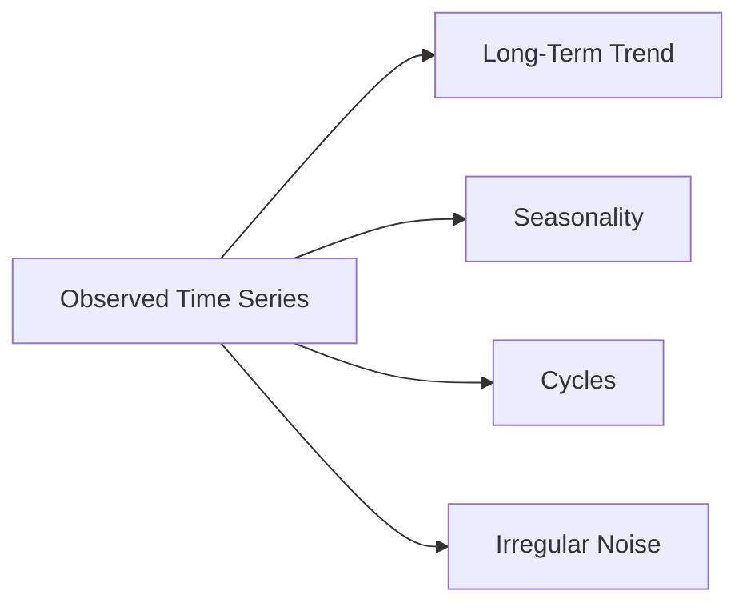
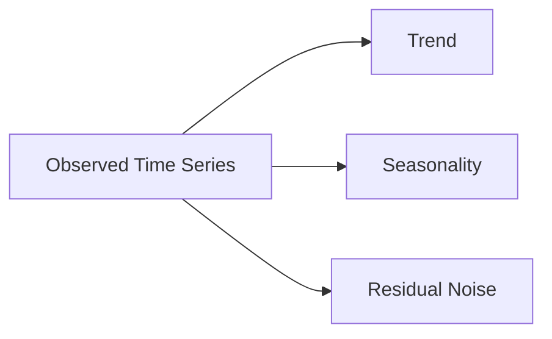
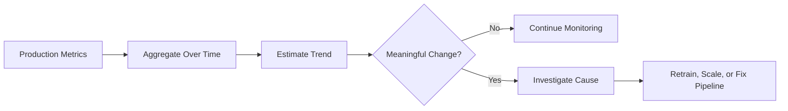

# 011 — Trend

**Course:** 01 — Math, Statistics and Econometrics
**Module:** Module 03 — Econometrics and Time Series
**Content Group:** Time Series
**Roadmap Source:** Econometrics and Time Series / Time Series
**Lesson Type:** Econometrics and Time Series
**Order in Module:** 011
**Suggested Duration:** 22 minutes

---

## 1. Overview

A **trend** is the long-term direction of a time series.

It describes whether a variable generally:

- Increases over time
- Decreases over time
- Remains approximately stable
- Changes direction
- Grows at an accelerating or decelerating rate

Examples of trends include:

- Monthly revenue increasing over several years
- Manufacturing costs gradually decreasing
- Website traffic growing after a product launch
- Average temperature increasing over decades
- Customer churn declining after service improvements
- Server load rising as the number of users grows

A trend represents the persistent movement of a series rather than its short-term fluctuations.



For an AI Engineer or Data Scientist, trend analysis helps answer questions such as:

- Is the business growing?
- Is demand declining?
- Is model latency increasing over time?
- Should historical data be detrended before modeling?
- Is recent growth sustainable?
- Did an intervention change the long-term direction?
- Will a model trained on older data generalize to future periods?

A trend analysis can produce practical artifacts such as:

- Exploratory charts
- Trend coefficients
- Growth-rate metrics
- Detrended datasets
- Forecasting features
- Monitoring dashboards
- Regression models
- Forecasting APIs
- Business recommendations

---

## 2. Learning Objectives

After completing this lesson, you should be able to:

1. Explain trend in your own words.
2. Distinguish trend from seasonality, cycles, and noise.
3. Identify increasing, decreasing, linear, and nonlinear trends.
4. Estimate a trend using moving averages and regression.
5. Calculate absolute and percentage growth.
6. Remove a trend from a time series.
7. Explain why trend can cause non-stationarity.
8. Avoid future-data leakage when estimating trends.
9. Evaluate whether a trend is useful for forecasting.
10. Interpret trend results in business language.

---

## 3. What Is a Trend?

A trend is the smooth, long-term movement in a time series.

A simple representation is:

$$
y_t = T_t + R_t
$$

where:

- $y_t$ is the observed value at time $t$
- $T_t$ is the trend component
- $R_t$ contains seasonality, cycles, and noise

A more complete additive decomposition is:

$$
y_t = T_t + S_t + C_t + \varepsilon_t
$$

where:

- $T_t$: trend
- $S_t$: seasonality
- $C_t$: cyclical movement
- $\varepsilon_t$: irregular noise

The trend does not need to explain every observation. It captures the broad direction around which short-term variation occurs.

---

## 4. Visual Intuition

### 4.1 Upward Trend

```text
Value
  ^
  |                         *
  |                    *  *
  |                * *
  |           *  *
  |       * *
  |   * *
  +--------------------------------> Time
```

The series generally increases over time.

Possible examples:

- Revenue growth
- Increasing user adoption
- Rising electricity demand
- Increasing cloud infrastructure costs

---

### 4.2 Downward Trend

```text
Value
  ^
  |  * *
  |      * *
  |          * *
  |              * *
  |                  * *
  |                      *
  +--------------------------------> Time
```

The series generally decreases over time.

Possible examples:

- Declining defect rates
- Falling customer churn
- Decreasing hardware costs
- Reduced error frequency

---

### 4.3 No Clear Trend

```text
Value
  ^
  |      *      *        *
  |  *      *       *
  |       *      *       *
  |    *      *      *
  +--------------------------------> Time
```

The series fluctuates around a relatively stable level.

---

### 4.4 Changing Trend

```text
Value
  ^
  |                    *
  |                * *
  |        * * * *
  |     * *
  |  * *
  |          \
  |           * * *
  +--------------------------------> Time
```

A time series may change direction because of:

- New business policies
- Market shocks
- Product launches
- Economic changes
- Data pipeline modifications
- Changes in customer behavior

---

## 5. Trend vs. Seasonality, Cycles, and Noise

These components are related but not identical.

| Component   | Meaning                              | Repetition              |
| ----------- | ------------------------------------ | ----------------------- |
| Trend       | Long-term direction                  | Does not need to repeat |
| Seasonality | Regular pattern at a fixed frequency | Repeats predictably     |
| Cycle       | Long-term rise and fall              | Duration may vary       |
| Noise       | Random or unexplained variation      | No stable pattern       |

Consider monthly retail sales:

```text
Sales
  ^
  |               /\              /\
  |          ____/  \_______ ____/  \____
  |     ____/
  |____/
  +----------------------------------------> Time
        upward trend + yearly seasonality
```

The upward movement is the trend, while the repeated peaks may represent yearly seasonality.

---

## 6. Common Types of Trend

### 6.1 Linear Trend

A linear trend changes by approximately the same absolute amount each period.

$$
T_t = \beta_0 + \beta_1 t
$$

where:

- $\beta_0$ is the starting level
- $\beta_1$ is the change per time unit

If:

$$
T_t = 100 + 5t
$$

then the expected value increases by approximately 5 units per period.

```text
Value
  ^
  |                     *
  |                 *
  |             *
  |         *
  |     *
  | *
  +-----------------------------> Time
```

---

### 6.2 Exponential Trend

An exponential trend changes by approximately the same percentage each period.

$$
T_t = \alpha e^{\beta t}
$$

An alternative representation is:

$$
T_t = T_0(1+r)^t
$$

where $r$ is the growth rate.

```text
Value
  ^
  |                         *
  |                    *
  |                *
  |            *
  |        *
  |    *
  | *
  +-----------------------------> Time
```

Examples include:

- Early product adoption
- Compound financial growth
- Rapid growth in data volume
- Viral user acquisition

Taking logarithms can approximately linearize exponential growth:

$$
\log(T_t) = \log(\alpha) + \beta t
$$

---

### 6.3 Polynomial Trend

A nonlinear trend may be modeled using polynomial terms:

$$
T_t = \beta_0 + \beta_1 t + \beta_2 t^2 + \cdots + \beta_p t^p
$$

A quadratic trend may increase and later decrease, or decrease and later increase.

However, high-degree polynomial trends may behave unrealistically outside the training period.

---

### 6.4 Logarithmic Trend

A logarithmic trend changes rapidly at first and then slows down.

$$
T_t = \beta_0 + \beta_1 \log(t)
$$

Possible examples:

- Learning curves
- Early adoption followed by saturation
- Productivity improvement that slows over time

---

### 6.5 Saturating Trend

A saturating trend approaches a maximum capacity.

A logistic growth curve is:

$$
T_t = \frac{L}{1 + e^{-k(t-t_0)}}
$$

where:

- $L$ is the maximum level
- $k$ controls the growth rate
- $t_0$ is the midpoint

```text
Value
  ^
L |                         ______
  |                    ____/
  |                ___/
  |            ___/
  |       ____/
  |______/
  +--------------------------------> Time
```

This can describe:

- Market adoption
- User growth with limited market size
- Storage capacity utilization
- Product penetration

---

### 6.6 Piecewise Trend

A piecewise trend uses different trend equations in different periods.

$$
T_t =
\begin{cases}
\beta_0 + \beta_1 t, & t < c, \\
\gamma_0 + \gamma_1 t, & t \ge c.
\end{cases}
$$

where $c$ is a change point.

Examples:

- Growth before and after a marketing campaign
- Demand before and after a pricing change
- Traffic before and after a platform migration

---

### 6.7 Local Trend

The direction may differ across shorter periods.

For example:

```text
Long-term direction: upward

Local behavior:
Month 1–3: increase
Month 4–5: decline
Month 6–9: increase
```

A local decline does not necessarily mean that the long-term trend has reversed.

---

## 7. Absolute and Relative Growth

### 7.1 Absolute Change

The absolute change between two periods is:

$$
\Delta y_t = y_t - y_{t-1}
$$

Example:

$$
120 - 100 = 20
$$

The value increased by 20 units.

---

### 7.2 Percentage Change

The percentage change is:

$$
g_t = \frac{y_t-y_{t-1}}{y_{t-1}} \times 100
$$

Example:

$$
\frac{120-100}{100}\times 100 = 20\%
$$

---

### 7.3 Compound Growth Rate

For growth from $y_0$ to $y_T$ over $T$ periods:

$$
\text{CAGR} = \left(\frac{y_T}{y_0}\right)^{1/T} - 1
$$

For business reporting, CAGR describes the constant per-period growth rate that would produce the same total change over the full interval.

---

## 8. Deterministic and Stochastic Trends

### 8.1 Deterministic Trend

A deterministic trend follows a fixed function of time:

$$
y_t = \beta_0 + \beta_1 t + \varepsilon_t
$$

After removing the fitted trend, the remaining series may be approximately stationary.

---

### 8.2 Stochastic Trend

A stochastic trend evolves through accumulated random changes.

A random walk is:

$$
y_t = y_{t-1} + \varepsilon_t
$$

or equivalently:

$$
\Delta y_t = \varepsilon_t
$$

Random shocks have permanent effects on the level of the series.

Deterministic and stochastic trends require different modeling approaches:

| Trend Type                | Common Treatment      |
| ------------------------- | --------------------- |
| Deterministic trend       | Regression detrending |
| Stochastic trend          | Differencing          |
| Seasonal stochastic trend | Seasonal differencing |

---

## 9. Trend and Stationarity

A stationary series has statistical properties that remain approximately stable over time.

A strong trend changes the mean of the series:

$$
\mathbb{E}[y_t] \neq \text{constant}
$$

Therefore, a trending series is usually non-stationary.

This matters for models such as:

- Autoregressive models
- ARMA
- ARIMA
- Vector autoregression
- Some statistical hypothesis tests

Possible responses to trend include:

- Add time as a model feature
- Remove the fitted trend
- Difference the series
- Use a model that explicitly supports trend
- Model trend and seasonality separately

---

## 10. Detecting Trend Visually

The first step is usually to plot the series.

```python
import matplotlib.pyplot as plt

fig, ax = plt.subplots(figsize=(12, 5))

ax.plot(df.index, df["sales"])
ax.set_title("Sales Over Time")
ax.set_xlabel("Date")
ax.set_ylabel("Sales")

plt.tight_layout()
plt.show()
```

Look for:

- Persistent upward or downward movement
- Changes in slope
- Curvature
- Sudden level shifts
- Increasing variability
- Trend differences across groups
- Periods that do not follow the general direction

A chart is essential, but visual judgment should be supported by numerical evidence.

---

## 11. Estimating Trend with Moving Averages

A moving average smooths short-term fluctuations.

For a window of size $k$:

$$
\text{MA}_t^{(k)} = \frac{1}{k}\sum_{i=0}^{k-1} y_{t-i}
$$

For example, a seven-day moving average is:

$$
\text{MA}_t^{(7)} = \frac{y_t+y_{t-1}+\cdots+y_{t-6}}{7}
$$

Python example:

```python
df["rolling_mean_7"] = (
    df["sales"]
    .rolling(window=7)
    .mean()
)
```

For a forecasting feature, shift the series first:

```python
df["previous_7_day_mean"] = (
    df["sales"]
    .shift(1)
    .rolling(window=7)
    .mean()
)
```

The shift prevents the current target from entering its own feature.

### Advantages

- Easy to calculate
- Reduces short-term noise
- Makes long-term direction easier to see
- Useful for dashboards

### Limitations

- Creates missing values at the beginning
- Reacts slowly to sudden changes
- Depends strongly on window size
- A centered moving average can use future data

---

## 12. Centered Moving Average

A centered moving average uses observations before and after the current period.

For an odd window size:

$$
\text{CMA}_t^{(3)} = \frac{y_{t-1}+y_t+y_{t+1}}{3}
$$

It is useful for historical decomposition but unsafe for real-time forecasting because it uses future information.

```python
df["centered_mean_7"] = (
    df["sales"]
    .rolling(window=7, center=True)
    .mean()
)
```

Use centered averages only when future observations are already known and the objective is historical analysis.

---

## 13. Estimating a Linear Trend with Regression

A simple time trend model is:

$$
y_t = \beta_0 + \beta_1 t + \varepsilon_t
$$

where:

- $t$ is a numerical time index
- $\beta_1$ measures average change per period

Python example:

```python
import numpy as np
from sklearn.linear_model import LinearRegression

df = df.copy()
df["time_index"] = np.arange(len(df))

X = df[["time_index"]]
y = df["sales"]

trend_model = LinearRegression()
trend_model.fit(X, y)

df["linear_trend"] = trend_model.predict(X)

print("Intercept:", trend_model.intercept_)
print("Slope:", trend_model.coef_[0])
```

If the slope is:

```text
2.4
```

the interpretation is:

> Sales increased by approximately 2.4 units per period on average.

The meaning of one period depends on the data frequency:

- Hourly data: units per hour
- Daily data: units per day
- Monthly data: units per month

---

## 14. Plotting the Estimated Trend

```python
fig, ax = plt.subplots(figsize=(12, 5))

ax.plot(
    df.index,
    df["sales"],
    label="Observed sales",
)

ax.plot(
    df.index,
    df["linear_trend"],
    label="Estimated trend",
)

ax.set_title("Observed Series and Linear Trend")
ax.set_xlabel("Date")
ax.set_ylabel("Sales")
ax.legend()

plt.tight_layout()
plt.show()
```

The fitted line summarizes the long-term direction but may ignore:

- Seasonality
- Nonlinear growth
- Structural changes
- Outliers
- Changing variance

---

## 15. Polynomial Trend Regression

If the trend is curved, polynomial features can be added.

A quadratic trend is:

$$
y_t = \beta_0 + \beta_1 t + \beta_2 t^2 + \varepsilon_t
$$

Python example:

```python
from sklearn.preprocessing import PolynomialFeatures
from sklearn.linear_model import LinearRegression

X_time = df[["time_index"]]

polynomial = PolynomialFeatures(
    degree=2,
    include_bias=False,
)

X_poly = polynomial.fit_transform(X_time)

quadratic_model = LinearRegression()
quadratic_model.fit(X_poly, y)

df["quadratic_trend"] = quadratic_model.predict(X_poly)
```

Polynomial trends should be used carefully because:

- They may overfit
- Coefficients are harder to interpret
- Extrapolation can become unrealistic
- High-degree curves may change sharply outside the observed period

---

## 16. Trend Estimation with Exponential Smoothing

Exponential smoothing gives greater weight to recent observations.

A simple smoothed level is:

$$
\ell_t = \alpha y_t + (1-\alpha)\ell_{t-1}
$$

Holt's method adds an explicit trend component:

$$
\ell_t = \alpha y_t + (1-\alpha)(\ell_{t-1}+b_{t-1})
$$

$$
b_t = \beta(\ell_t-\ell_{t-1}) + (1-\beta)b_{t-1}
$$

where:

- $\ell_t$ is the estimated level
- $b_t$ is the estimated trend
- $\alpha$ and $\beta$ are smoothing parameters

Holt's method is useful when recent trend information should receive more weight than distant history.

---

## 17. Trend Decomposition

A time series can be decomposed into trend, seasonality, and residual components.

For an additive structure:

$$
y_t = T_t + S_t + \varepsilon_t
$$

Conceptual workflow:



After decomposition:

```text
Observed series
    ├── Trend: long-term direction
    ├── Seasonality: repeated pattern
    └── Residual: unexplained variation
```

Decomposition helps determine whether forecast performance comes from:

- Long-term movement
- Repeated seasonal behavior
- Short-term dynamics
- External factors

---

## 18. Removing a Trend

Removing the trend is called **detrending**.

### 18.1 Regression Detrending

Estimate the trend and subtract it:

$$
y_t^{\text{detrended}} = y_t - \hat{T}_t
$$

Python example:

```python
df["detrended_sales"] = (
    df["sales"]
    - df["linear_trend"]
)
```

Use regression detrending when the trend is approximately deterministic.

---

### 18.2 First Differencing

First differencing calculates:

$$
\Delta y_t = y_t - y_{t-1}
$$

Python example:

```python
df["sales_difference_1"] = (
    df["sales"]
    .diff(1)
)
```

Differencing converts level information into change information.

For example:

| Time | Sales | First Difference |
| ---- | ----: | ---------------: |
| 1    |   100 |                — |
| 2    |   108 |                8 |
| 3    |   113 |                5 |
| 4    |   109 |               -4 |

First differencing is commonly used for stochastic trends.

---

### 18.3 Seasonal Differencing

For seasonal period $s$:

$$
\Delta_s y_t = y_t-y_{t-s}
$$

For daily data with weekly seasonality:

```python
df["sales_difference_7"] = (
    df["sales"]
    .diff(7)
)
```

Seasonal differencing removes repeated seasonal level effects rather than ordinary long-term trend alone.

---

## 19. Trend as a Forecasting Feature

A time index can be used as a model feature:

```python
df["time_index"] = np.arange(len(df))
```

Additional trend-related features may include:

```python
df["time_squared"] = df["time_index"] ** 2
df["log_time"] = np.log1p(df["time_index"])
```

For a known change point:

```python
change_point = 180

df["after_change"] = (
    df["time_index"] >= change_point
).astype(int)

df["time_after_change"] = (
    df["time_index"] - change_point
).clip(lower=0)
```

These features allow a regression model to represent:

- A global trend
- Curvature
- Level changes
- Slope changes

---

## 20. Practical Python Demo

The following example creates synthetic daily sales data with an upward trend, weekly seasonality, and random noise.

```python
import numpy as np
import pandas as pd
import matplotlib.pyplot as plt
from sklearn.linear_model import LinearRegression

rng = np.random.default_rng(42)

dates = pd.date_range(
    start="2025-01-01",
    periods=240,
    freq="D",
)

time_index = np.arange(len(dates))

trend = 100 + 0.35 * time_index

weekly_pattern = np.array([
    -8,
    -4,
    0,
    3,
    8,
    20,
    14,
])

seasonality = np.array([
    weekly_pattern[date.dayofweek]
    for date in dates
])

noise = rng.normal(
    loc=0,
    scale=6,
    size=len(dates),
)

sales = trend + seasonality + noise

df = pd.DataFrame({
    "date": dates,
    "sales": sales,
    "time_index": time_index,
})

df = df.set_index("date")
```

---

## 21. Visualize the Raw Series

```python
fig, ax = plt.subplots(figsize=(12, 5))

ax.plot(df.index, df["sales"])
ax.set_title("Daily Sales with Trend and Weekly Seasonality")
ax.set_xlabel("Date")
ax.set_ylabel("Sales")

plt.tight_layout()
plt.show()
```

From the chart, we should look for:

- A persistent upward direction
- Weekly fluctuations
- Unexpected spikes
- Changes in variability
- Possible structural breaks

---

## 22. Estimate a Moving-Average Trend

```python
df["rolling_mean_28"] = (
    df["sales"]
    .rolling(window=28)
    .mean()
)
```

A 28-day window smooths much of the weekly seasonality.

```python
fig, ax = plt.subplots(figsize=(12, 5))

ax.plot(
    df.index,
    df["sales"],
    label="Daily sales",
    alpha=0.5,
)

ax.plot(
    df.index,
    df["rolling_mean_28"],
    label="28-day moving average",
)

ax.set_title("Sales and Smoothed Trend")
ax.set_xlabel("Date")
ax.set_ylabel("Sales")
ax.legend()

plt.tight_layout()
plt.show()
```

---

## 23. Estimate a Linear Trend

```python
X = df[["time_index"]]
y = df["sales"]

model = LinearRegression()
model.fit(X, y)

df["estimated_linear_trend"] = model.predict(X)

slope = model.coef_[0]
intercept = model.intercept_

print(f"Intercept: {intercept:.2f}")
print(f"Trend slope: {slope:.3f} units per day")
```

The expected slope should be close to the trend used when generating the data, although seasonality and noise may affect the estimate.

---

## 24. Detrend the Series

```python
df["detrended_sales"] = (
    df["sales"]
    - df["estimated_linear_trend"]
)
```

Plot the result:

```python
fig, ax = plt.subplots(figsize=(12, 5))

ax.plot(df.index, df["detrended_sales"])
ax.axhline(y=0, linestyle="--")

ax.set_title("Detrended Sales")
ax.set_xlabel("Date")
ax.set_ylabel("Sales Minus Estimated Trend")

plt.tight_layout()
plt.show()
```

After removing the long-term trend, weekly seasonality should remain visible.

---

## 25. Train/Test Split for Trend Forecasting

The final 30 days can be reserved as a test set.

```python
test_size = 30

train = df.iloc[:-test_size].copy()
test = df.iloc[-test_size:].copy()
```

Fit the trend model only on the training data:

```python
trend_model = LinearRegression()

trend_model.fit(
    train[["time_index"]],
    train["sales"],
)

test["trend_forecast"] = trend_model.predict(
    test[["time_index"]]
)
```

This setup avoids fitting the trend using future test observations.

---

## 26. Compare Trend Forecast and Seasonal Baseline

A trend-only forecast may miss weekly seasonality.

Create a seasonal naive baseline:

```python
df["lag_7"] = df["sales"].shift(7)

train = df.iloc[:-test_size].copy()
test = df.iloc[-test_size:].copy()

test["seasonal_naive_forecast"] = test["lag_7"]
```

A combined regression model can include both trend and calendar effects:

```python
model_df = df.copy()

model_df["day_of_week"] = model_df.index.dayofweek

model_df = pd.get_dummies(
    model_df,
    columns=["day_of_week"],
    drop_first=True,
)

train = model_df.iloc[:-test_size].copy()
test = model_df.iloc[-test_size:].copy()

feature_columns = [
    column
    for column in model_df.columns
    if column.startswith("time_index")
    or column.startswith("day_of_week_")
]

combined_model = LinearRegression()

combined_model.fit(
    train[feature_columns],
    train["sales"],
)

test["combined_forecast"] = combined_model.predict(
    test[feature_columns]
)
```

This model captures:

- Long-term growth through `time_index`
- Weekly seasonality through day-of-week indicators

---

## 27. Forecast Evaluation

Common metrics include:

### Mean Absolute Error

$$
\text{MAE} = \frac{1}{n}\sum_{t=1}^{n}\left|y_t-\hat{y}_t\right|
$$

### Root Mean Squared Error

$$
\text{RMSE} = \sqrt{\frac{1}{n}\sum_{t=1}^{n}(y_t-\hat{y}_t)^2}
$$

Python example:

```python
from sklearn.metrics import (
    mean_absolute_error,
    mean_squared_error,
)

def evaluate_forecast(
    actual: pd.Series,
    predicted: pd.Series,
) -> dict[str, float]:
    valid = actual.notna() & predicted.notna()

    y_true = actual.loc[valid]
    y_pred = predicted.loc[valid]

    mae = mean_absolute_error(y_true, y_pred)

    rmse = mean_squared_error(
        y_true,
        y_pred,
    ) ** 0.5

    return {
        "MAE": mae,
        "RMSE": rmse,
    }
```

A trend model should be compared against:

- Naive forecast
- Seasonal naive forecast
- Moving-average forecast
- Trend-plus-seasonality model

A trend model is useful only when it improves performance on relevant, unseen future periods.

---

## 28. Trend and Residual Analysis

For a fitted trend:

$$
e_t = y_t-\hat{T}_t
$$

Residuals should be inspected for:

- Remaining trend
- Seasonality
- Autocorrelation
- Changing variance
- Outliers
- Structural breaks

If residuals still show a clear upward pattern, the trend model is incomplete.

If residuals show weekly repetition, the model is missing seasonality.

```text
Observed series
      ↓
Estimate trend
      ↓
Subtract fitted trend
      ↓
Inspect residual structure
      ├── Remaining trend?
      ├── Seasonality?
      ├── Autocorrelation?
      └── Outliers?
```

---

## 29. Structural Breaks and Change Points

A single trend line may be misleading when the series changes direction.

Examples:

- Revenue growth accelerates after a campaign
- Demand falls after a price increase
- Model latency rises after deployment
- Traffic changes after a tracking update

A structural break can affect:

- The level
- The slope
- The variance
- Seasonal behavior
- Relationships with external variables

```text
Value
  ^
  |                       *
  |                    *
  |                 *
  |        * * * *
  |     * *
  |  * *
  +----------------|----------------> Time
               change point
```

Possible responses include:

- Fit separate trends before and after the change
- Add intervention indicators
- Use rolling-window models
- Retrain using more recent data
- Apply change-point detection

---

## 30. Trend Leakage

Trend estimation can cause leakage when future observations influence training features.

### Unsafe Example

Fit a trend on the full dataset before splitting:

```python
model.fit(
    df[["time_index"]],
    df["sales"],
)

df["trend"] = model.predict(
    df[["time_index"]]
)
```

The estimated coefficients include information from the future test period.

### Safer Approach

```text
1. Split data chronologically
2. Fit the trend using training data only
3. Generate trend values for training and future periods
4. Evaluate on unseen future observations
```

This principle also applies to:

- Moving averages
- Scaling
- Missing-value imputation
- Decomposition
- Feature selection
- Hyperparameter tuning

---

## 31. Trend Extrapolation Risks

Extrapolation means extending the estimated trend beyond the observed data.

A linear model assumes that the same slope continues:

$$
\hat{y}_{T+h} = \hat{\beta}_0 + \hat{\beta}_1(T+h)
$$

This assumption may fail because:

- Markets saturate
- Prices change
- Competitors enter
- Capacity becomes limited
- Policies change
- Customer behavior shifts
- Growth cannot continue indefinitely

Trend forecasts should therefore include:

- A forecast horizon
- Uncertainty
- Business assumptions
- Scenario analysis
- Monitoring rules

---

## 32. Interpreting Trend in Business Language

Avoid reporting only a coefficient or metric.

Weak interpretation:

```text
The estimated slope is 4.2.
```

Better interpretation:

```text
Daily sales increased by approximately 4.2 units per day during
the training period. If the historical relationship continues,
the model expects sales to be about 126 units higher after 30 days.
However, this projection does not account for promotions,
capacity limits, or structural changes.
```

A useful business interpretation should state:

1. Direction
2. Magnitude
3. Time unit
4. Business meaning
5. Assumptions
6. Limitations
7. Recommended action

---

## 33. Trend in Production Monitoring

Trend analysis is also useful after model deployment.

Examples include:

- Increasing prediction latency
- Declining model accuracy
- Growing error rates
- Rising infrastructure costs
- Falling user engagement
- Increasing missing-feature rates

A monitoring workflow may be:



A trend alert should consider both:

- Statistical significance
- Operational importance

A statistically detectable change may still be too small to matter in practice.

---

## 34. Common Mistakes

### 34.1 Confusing Trend with Seasonality

A weekend sales peak is seasonal, not necessarily a long-term upward trend.

### 34.2 Estimating the Trend from Too Little Data

A short increase may be temporary noise rather than a persistent trend.

### 34.3 Fitting One Straight Line to a Nonlinear Process

A linear trend may understate early growth and overstate future growth.

### 34.4 Ignoring Structural Breaks

A single slope can hide different business regimes.

### 34.5 Using Future Data

Centered moving averages and full-dataset trend estimation may leak future information.

### 34.6 Treating Correlation with Time as Causation

A variable can rise over time without time itself causing the increase.

### 34.7 Extrapolating Too Far

Long-horizon forecasts can become unrealistic when trend assumptions fail.

### 34.8 Ignoring Seasonality

A trend-only model may systematically miss weekends, holidays, or yearly peaks.

### 34.9 Reporting Only a Metric

A slope or $R^2$ value is incomplete without business interpretation.

### 34.10 Removing Trend Automatically

Trend may contain the most important business information. Detrending should serve a clear modeling purpose.

---

## 35. Assumptions and Caveats

Before using a trend model, consider:

- Is the trend approximately stable?
- Is the relationship linear or nonlinear?
- Is seasonality also present?
- Are there structural breaks?
- Are outliers influencing the slope?
- Is the time interval regular?
- Is the forecast horizon reasonable?
- Is the same data-generating process expected to continue?
- Was the trend estimated using training data only?
- Does the business process have natural growth limits?

---

## 36. Practical Exercise

Choose a time series such as:

- Daily sales
- Monthly revenue
- Website visits
- Electricity demand
- Server latency
- Customer registrations
- Product prices
- Model error rates

Complete the following tasks:

1. Parse the timestamp column.
2. Sort observations chronologically.
3. Plot the raw series.
4. Describe the apparent trend.
5. Calculate period-to-period changes.
6. Calculate percentage growth.
7. Create a moving-average trend.
8. Fit a linear trend regression.
9. Interpret the slope.
10. Detrend the series.
11. Inspect the detrended values.
12. Split the data chronologically.
13. Forecast the test period using the trend model.
14. Compare it with a naive baseline.
15. Write one business recommendation.
16. Document one assumption and one limitation.

---

## 37. Suggested Notebook Structure

```text
01. Problem Definition
02. Dataset Description
03. Time Index Validation
04. Raw Time Series Plot
05. Growth-Rate Analysis
06. Moving-Average Trend
07. Linear Trend Regression
08. Nonlinear Trend Comparison
09. Detrending
10. Residual Analysis
11. Chronological Train/Test Split
12. Baseline Forecast
13. Trend Forecast
14. Evaluation Metrics
15. Business Interpretation
16. Assumptions and Limitations
```

---

## 38. Reflection Questions

1. What does a trend represent?
2. How is trend different from seasonality?
3. What does the slope of a linear trend mean?
4. When is an exponential trend more appropriate than a linear trend?
5. Why can a trending series be non-stationary?
6. What is the difference between deterministic and stochastic trends?
7. When should a series be detrended?
8. Why can a centered moving average cause leakage?
9. How can a structural break affect a trend model?
10. Why is long-term trend extrapolation risky?
11. What business decision will use the trend analysis?
12. What evidence would show that the trend has changed?

---

## 39. Completion Checklist

- [ ] I can explain trend in one or two minutes.
- [ ] I can distinguish trend from seasonality, cycles, and noise.
- [ ] I can identify an upward or downward trend in a chart.
- [ ] I understand linear, nonlinear, and piecewise trends.
- [ ] I can calculate absolute and percentage growth.
- [ ] I can estimate a trend using a moving average.
- [ ] I can estimate a linear trend using regression.
- [ ] I can interpret the trend coefficient.
- [ ] I understand regression detrending and differencing.
- [ ] I can identify potential structural breaks.
- [ ] I know how trend-related leakage occurs.
- [ ] I can compare a trend model with a baseline.
- [ ] I can explain the result in business language.
- [ ] I have documented at least one assumption or limitation.
- [ ] I have created a notebook, chart, model, API, or portfolio note.

---

## 40. Related Outcome

Model relationships and time-dependent data using:

- Regression
- Trend estimation
- Residual diagnostics
- Time-series decomposition
- Differencing
- Stationarity analysis
- ARIMA
- Forecasting
- Model monitoring

---

## 41. Related Project

### Mini Project: Sales Trend and Forecasting

Build a sales forecasting workflow containing:

1. Time-index validation
2. Raw sales visualization
3. Growth-rate analysis
4. Moving-average trend
5. Linear trend estimation
6. Weekly seasonality analysis
7. Trend-plus-seasonality model
8. Chronological train/test split
9. Naive or seasonal naive baseline
10. Optional ARIMA model
11. MAE and RMSE comparison
12. Business recommendation

### Suggested Portfolio Artifacts

- Jupyter notebook
- Trend analysis report
- Forecasting dashboard
- REST forecast API
- Dockerized prediction service
- Automated trend-monitoring pipeline
- Change-point alert system

---

## 42. Key Takeaways

1. A trend represents the persistent long-term direction of a time series.
2. Trends may be increasing, decreasing, linear, nonlinear, saturating, or piecewise.
3. Trend is different from seasonality, cycles, and random noise.
4. Moving averages provide a simple way to visualize the trend.
5. Regression estimates the direction and magnitude of a deterministic trend.
6. Differencing is commonly used to remove stochastic trends.
7. Trend can make a time series non-stationary.
8. Trend models should be fitted using past data only.
9. Structural breaks can make historical trends unreliable.
10. Trend extrapolation requires clear assumptions and a reasonable horizon.
11. A trend model should be compared with simple forecasting baselines.
12. Results should be translated into concrete business meaning.

---

## 43. Summary

A **trend** describes the long-term movement of a time series.

A practical trend-analysis workflow is:

```text
Time-stamped data
      ↓
Validate and sort observations
      ↓
Plot the raw series
      ↓
Identify possible trend and seasonality
      ↓
Estimate trend with smoothing or regression
      ↓
Inspect residuals and structural breaks
      ↓
Detrend or difference when necessary
      ↓
Split data chronologically
      ↓
Compare trend forecasts with baselines
      ↓
Translate results into business action
      ↓
Deploy and monitor for trend changes
```

Trend analysis is more than drawing a line through historical data. It requires checking assumptions, avoiding temporal leakage, evaluating future performance, recognizing structural changes, and connecting the estimated direction to a real decision.

Turn this lesson into a practical artifact such as a notebook, query, chart, forecasting model, API, Docker service, monitoring dashboard, or portfolio report.