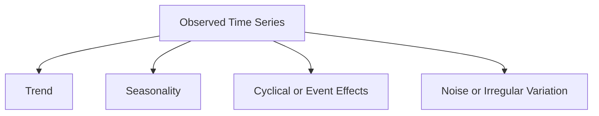
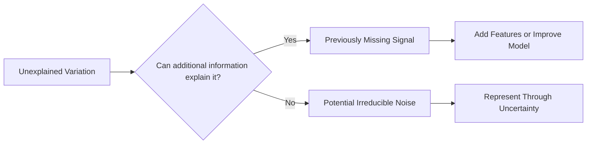
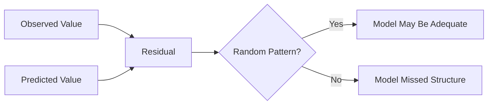
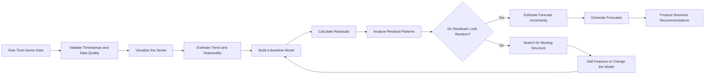
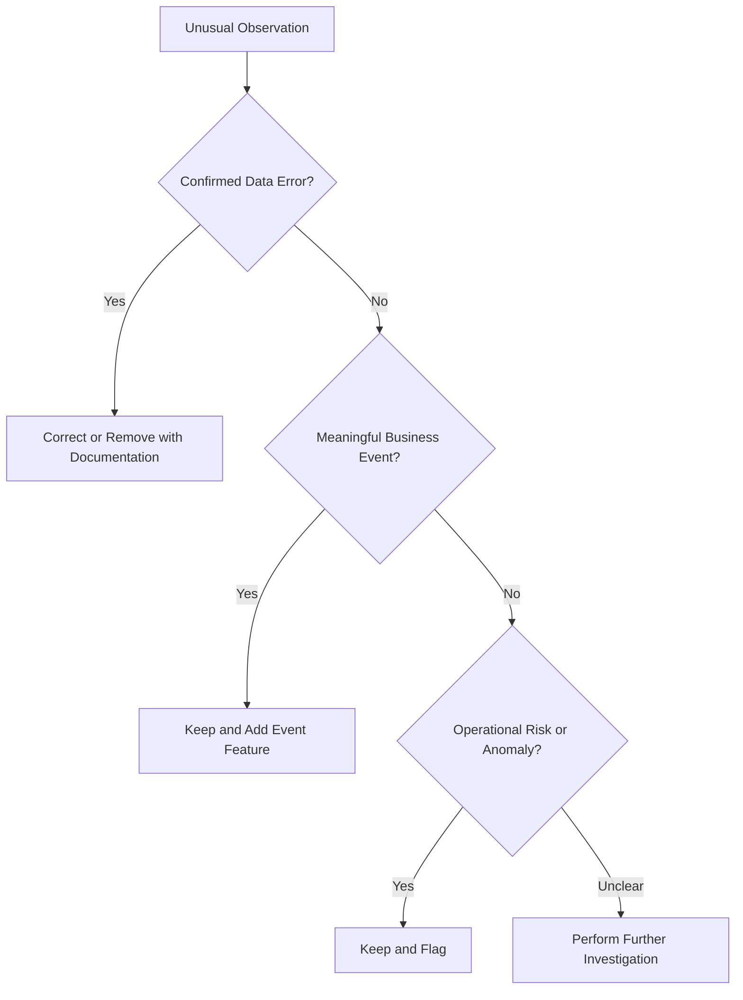
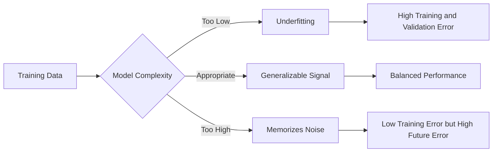
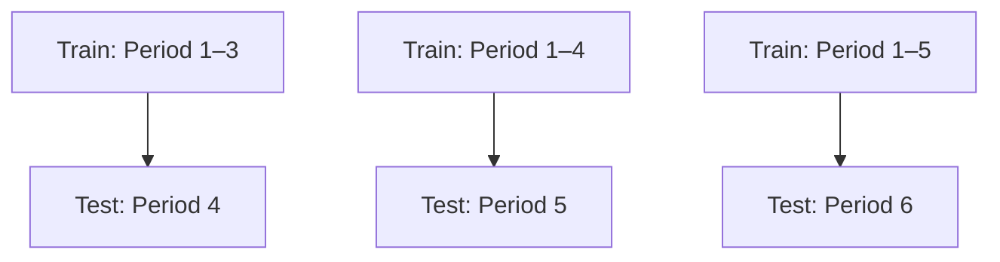

# 013 — Noise in Time Series

| Metadata               | Details                                    |
| ---------------------- | ------------------------------------------ |
| **Course**             | 01 — Math, Statistics, and Econometrics    |
| **Module**             | Module 03 — Econometrics and Time Series   |
| **Content Group**      | Time Series                                |
| **Roadmap Source**     | Econometrics and Time Series / Time Series |
| **Lesson Type**        | Econometrics and Time Series               |
| **Lesson Order**       | 013                                        |
| **Suggested Duration** | 22 minutes                                 |

---

## 1. Overview

This lesson explains **noise** in the context of time-series analysis, forecasting, machine learning, and data science.

Noise represents random or unexplained variation in observed data. It may come from:

* Measurement errors.
* Unpredictable events.
* Missing explanatory variables.
* Data-collection problems.
* Data-processing errors.
* Natural randomness in the underlying process.

After completing this lesson, you should understand:

* What noise means in a time series.
* How noise differs from trend and seasonality.
* How noise affects forecasting and model training.
* How to identify excessive or structured noise.
* How to distinguish useful signals from random fluctuations.
* How noise affects prediction uncertainty.
* How to build a practical signal-versus-noise analysis artifact.

---

## 2. Learning Objectives

By the end of this lesson, you should be able to:

1. Explain noise using your own words.
2. Separate meaningful time-series components from random variation.
3. Identify common sources of noise in real-world datasets.
4. Analyze unexplained variation using residual plots and statistical diagnostics.
5. Explain how noise affects model performance and forecast uncertainty.
6. Apply smoothing and filtering methods carefully.
7. Distinguish white noise from structured residual behavior.
8. Build a small notebook or report that demonstrates signal-versus-noise analysis.
9. Communicate the business impact of noisy data.

---

## 3. What Is Noise?

In time-series analysis, **noise** is the random or unexplained component of an observed sequence.

A common additive representation is:

$$
Y_t = T_t + S_t + N_t
$$

where:

* $Y_t$ is the observed value at time $t$.
* $T_t$ is the trend component.
* $S_t$ is the seasonal component.
* $N_t$ is the noise or irregular component.

The observed series therefore contains both meaningful structure and unpredictable variation.



Noise is not always completely useless.

What initially appears to be noise may contain:

* An unmodeled seasonal pattern.
* A hidden external variable.
* A change in customer behavior.
* A data-quality problem.
* A structural break.
* An unusual but meaningful event.

Therefore, unexplained variation should be investigated before it is removed or ignored.

---

## 4. Signal Versus Noise

A **signal** is a meaningful pattern that helps explain or predict the observed data.

Noise is the variation that the current model and available information cannot explain.

$$
\text{Observed Data} = \text{Signal} + \text{Noise}
$$

Examples of useful signals include:

* Long-term sales growth.
* Weekly website-traffic patterns.
* Monthly salary-payment cycles.
* Holiday effects.
* Marketing-campaign effects.
* Temperature-driven energy consumption.
* Demand changes caused by price adjustments.

Examples of noise include:

* Random measurement errors.
* Temporary sensor interference.
* Accidental duplicate transactions.
* Unpredictable behavior in low-volume data.
* Minor fluctuations without stable temporal structure.

### Important Principle

Noise is defined relative to the model and the available information.

A variation may appear random to a simple model but become predictable after adding:

* Calendar features.
* Weather data.
* Promotion indicators.
* Product-launch dates.
* System-outage indicators.
* Economic variables.
* Competitor activity.
* Lagged observations.



---

## 5. Time-Series Decomposition

A time series is commonly represented using either an additive or multiplicative model.

### 5.1 Additive Decomposition

$$
Y_t = T_t + S_t + N_t
$$

An additive model is appropriate when the magnitude of seasonal variation remains approximately constant over time.

Example:

* Sales increase gradually.
* Seasonal fluctuations remain close to $\pm 1{,}000$ units.

### 5.2 Multiplicative Decomposition

$$
Y_t = T_t \times S_t \times N_t
$$

A multiplicative model is more appropriate when seasonal variation increases or decreases with the overall level of the series.

Example:

* Sales double over several years.
* Holiday peaks also become approximately twice as large.

A logarithmic transformation can convert a multiplicative relationship into an additive one:

$$
\log(Y_t) = \log(T_t) + \log(S_t) + \log(N_t)
$$

This transformation is useful when variability grows with the level of the series.

---

## 6. Common Sources of Noise

Noise may enter a dataset through several different mechanisms.

### 6.1 Measurement Noise

Measurement noise occurs when the recorded value differs from the true value.

Examples:

* A temperature sensor has limited precision.
* A user enters the wrong sales amount.
* A tracking system misses some events.
* Currency values are rounded.
* A device produces unstable readings.

### 6.2 Sampling Noise

Sampling noise appears when only part of a population is observed.

Examples:

* Estimating customer satisfaction from a small survey.
* Measuring conversion rates from a small number of visitors.
* Forecasting demand for a product with few historical orders.
* Estimating click-through rates for a new advertisement.

Sampling noise is usually more severe when the sample size is small.

### 6.3 Process Noise

Process noise is natural randomness in the underlying system.

Examples:

* Customers make unpredictable purchase decisions.
* Financial prices react to unexpected information.
* Delivery times vary because of traffic conditions.
* Manufacturing durations vary slightly between units.

### 6.4 External-Event Noise

Unexpected external events may create irregular observations.

Examples:

* Server outages.
* Severe weather.
* Sudden regulatory changes.
* Viral social-media activity.
* Supply-chain disruptions.
* Unexpected competitor campaigns.

Some external events are not truly random. They can become explanatory variables when they are recorded correctly.

### 6.5 Data-Pipeline Noise

Noise may also be introduced during data collection and processing.

Examples:

* Duplicate records.
* Incorrect timestamps.
* Time-zone conversion errors.
* Missing observations.
* Inconsistent aggregation windows.
* Delayed events.
* Changed tracking definitions.
* Incorrect joins between datasets.
* Unit-conversion errors.

Data-pipeline noise should be treated as an engineering problem rather than as unavoidable statistical uncertainty.

---

## 7. White Noise

A special type of noise is called **white noise**.

A white-noise process $\epsilon_t$ usually has the following properties:

$$
\mathbb{E}[\epsilon_t] = 0
$$

$$
\text{Var}(\epsilon_t) = \sigma^2
$$

$$
\text{Cov}(\epsilon_t, \epsilon_{t-k}) = 0
\qquad \text{for } k \neq 0
$$

A simplified notation is:

$$
\epsilon_t \sim WN(0,\sigma^2)
$$

This means that white noise:

* Has an expected value of zero.
* Has constant variance.
* Has no autocorrelation at nonzero lags.
* Has no predictable temporal structure.

### Important Clarification

White noise does not necessarily have to follow a normal distribution.

When the errors are both white noise and normally distributed, they may be written as:

$$
\epsilon_t \sim \mathcal{N}(0,\sigma^2)
$$

### Why White Noise Matters

A forecasting model is generally considered well specified when its residuals behave approximately like white noise.

If residuals still contain autocorrelation, seasonality, or a trend, the model has probably missed useful temporal structure.

---

## 8. Noise and Residuals

A residual is the difference between an observed value and the corresponding model prediction:

$$
e_t = y_t - \hat{y}_t
$$

where:

* $y_t$ is the observed value.
* $\hat{y}_t$ is the predicted value.
* $e_t$ is the residual.

Residuals estimate the unexplained component of the data.

However:

$$
\text{Residuals} \neq \text{True Noise}
$$

Residuals may contain:

* Random noise.
* Missed seasonality.
* Missed trend.
* Outliers.
* Structural breaks.
* Model bias.
* Incorrect functional relationships.
* Missing explanatory variables.
* Data-quality problems.

A strong forecasting model should leave residuals that appear random rather than systematic.



---

## 9. Residual Diagnostic Questions

When examining model residuals, ask:

1. Is the residual mean close to zero?
2. Is the residual variance approximately constant?
3. Is there remaining autocorrelation?
4. Are there visible seasonal patterns?
5. Are there unusually large residuals?
6. Does the residual distribution have heavy tails?
7. Does residual behavior change over time?
8. Are errors larger during specific events?
9. Are important explanatory variables missing?
10. Was validation performed chronologically?
11. Is there any future-data leakage?
12. Do residuals behave differently across customer, product, or geographic segments?

---

## 10. Noise-Analysis Workflow



---

## 11. How to Detect and Analyze Noise

Noise cannot always be observed directly, but several techniques help evaluate unexplained variation.

### 11.1 Time-Series Plot

Begin by plotting the raw series.

Look for:

* High-frequency fluctuations.
* Sudden spikes.
* Long-term trends.
* Repeating seasonal cycles.
* Changes in volatility.
* Missing intervals.
* Level shifts.
* Structural breaks.

```python
import matplotlib.pyplot as plt

df["sales"].plot(
    figsize=(12, 5),
    title="Daily Sales"
)

plt.xlabel("Date")
plt.ylabel("Sales")
plt.show()
```

A raw time-series plot helps determine whether variation appears structured or irregular.

---

### 11.2 Rolling Mean

A rolling mean smooths short-term fluctuations:

$$
MA_t = \frac{1}{k} \sum_{i=0}^{k-1} y_{t-i}
$$

where $k$ is the rolling-window size.

```python
df["rolling_mean_7"] = (
    df["sales"]
    .rolling(window=7)
    .mean()
)
```

A larger window produces stronger smoothing but may remove meaningful short-term patterns.

---

### 11.3 Rolling Standard Deviation

A rolling standard deviation helps detect changes in volatility:

```python
df["rolling_std_7"] = (
    df["sales"]
    .rolling(window=7)
    .std()
)
```

An increasing rolling standard deviation may indicate:

* Increasing volatility.
* Heteroskedasticity.
* A structural change.
* Scale-dependent noise.
* A data-quality problem.

---

### 11.4 Autocorrelation Function

The autocorrelation function measures the correlation between a time series and its lagged values:

$$
\rho_k = \text{Corr}(Y_t,Y_{t-k})
$$

For white noise, autocorrelations should be approximately zero at all nonzero lags.

Significant residual autocorrelation suggests that the model has missed temporal structure.

```python
from statsmodels.graphics.tsaplots import plot_acf

plot_acf(
    residuals.dropna(),
    lags=30
)

plt.title("Residual Autocorrelation")
plt.show()
```

---

### 11.5 Residual Plot

Calculate and plot residuals over time:

```python
residuals = y_test - predictions

residuals.plot(
    figsize=(12, 4),
    title="Residuals Over Time"
)

plt.axhline(0, linestyle="--")
plt.xlabel("Date")
plt.ylabel("Residual")
plt.show()
```

A desirable residual plot should show:

* Values scattered around zero.
* No visible trend.
* No repeating seasonal pattern.
* Approximately stable variance.
* Few unexplained extreme values.

---

### 11.6 Residual Histogram

A histogram helps analyze:

* Center.
* Spread.
* Skewness.
* Heavy tails.
* Extreme errors.
* Multimodal behavior.

```python
residuals.hist(bins=30)

plt.title("Residual Distribution")
plt.xlabel("Residual")
plt.ylabel("Frequency")
plt.show()
```

Normal residuals are useful for some statistical-inference procedures, but normality is not required for every forecasting model.

In many forecasting problems, the more important question is whether residuals remain predictable.

---

### 11.7 Ljung–Box Test

The Ljung–Box test evaluates whether a group of residual autocorrelations differs significantly from zero.

The hypotheses are:

$$
H_0:
\text{The residuals are independently distributed}
$$

$$
H_1:
\text{The residuals contain autocorrelation}
$$

Example:

```python
from statsmodels.stats.diagnostic import acorr_ljungbox

result = acorr_ljungbox(
    residuals.dropna(),
    lags=[7, 14],
    return_df=True
)

print(result)
```

Typical interpretation:

* A large p-value means there is insufficient evidence of residual autocorrelation.
* A small p-value suggests that temporal structure remains in the residuals.

The test does not automatically explain how the model should be improved. It only indicates that the residual sequence may not be independent.

---

## 12. Practical Python Example

The following example creates a synthetic time series containing:

* A trend.
* Weekly seasonality.
* Random noise.

```python
import numpy as np
import pandas as pd
import matplotlib.pyplot as plt

np.random.seed(42)

n = 180
dates = pd.date_range(
    start="2026-01-01",
    periods=n,
    freq="D"
)

time_index = np.arange(n)

trend = np.linspace(100, 150, n)

seasonality = (
    12
    * np.sin(
        2 * np.pi * time_index / 7
    )
)

noise = np.random.normal(
    loc=0,
    scale=5,
    size=n
)

sales = trend + seasonality + noise

df = pd.DataFrame(
    {
        "date": dates,
        "sales": sales,
        "trend": trend,
        "seasonality": seasonality,
        "noise": noise,
    }
).set_index("date")

df["rolling_mean_7"] = (
    df["sales"]
    .rolling(window=7)
    .mean()
)

df[["sales", "rolling_mean_7"]].plot(
    figsize=(12, 5),
    title="Observed Sales and 7-Day Rolling Mean"
)

plt.xlabel("Date")
plt.ylabel("Sales")
plt.show()
```

### Interpretation

The observed sales series is generated as:

$$
\text{Sales}_t = \text{Trend}_t + \text{Seasonality}_t + \text{Noise}_t
$$

The rolling mean reduces short-term fluctuations and makes the underlying trend easier to observe.

However, it also reduces the visible weekly seasonal pattern.

This demonstrates an important trade-off:

> Smoothing can reduce noise, but excessive smoothing can destroy useful signals.

---

## 13. Time-Series Decomposition in Python

A seasonal decomposition can separate the observed series into estimated components.

```python
from statsmodels.tsa.seasonal import seasonal_decompose

decomposition = seasonal_decompose(
    df["sales"],
    model="additive",
    period=7
)

decomposition.plot()
plt.show()
```

The output contains:

* Observed series.
* Estimated trend.
* Estimated seasonality.
* Estimated residual component.

The residual component should not automatically be interpreted as pure random noise. It may still contain:

* Outliers.
* Missed nonlinear patterns.
* Structural changes.
* Incorrectly modeled seasonality.

For more robust decomposition, STL can be used:

```python
from statsmodels.tsa.seasonal import STL

stl = STL(
    df["sales"],
    period=7,
    robust=True
)

result = stl.fit()
result.plot()
plt.show()
```

The `robust=True` option reduces the influence of extreme observations on the estimated trend and seasonal components.

---

## 14. Naive Forecast and Residual Analysis

A simple one-step naive forecast uses the previous observed value:

$$
\hat{y}_t = y_{t-1}
$$

```python
df["naive_forecast"] = df["sales"].shift(1)

df["naive_residual"] = (
    df["sales"]
    - df["naive_forecast"]
)

valid_naive = df.dropna(
    subset=["naive_forecast"]
)

naive_mae = (
    valid_naive["naive_residual"]
    .abs()
    .mean()
)

naive_rmse = np.sqrt(
    (
        valid_naive["naive_residual"] ** 2
    ).mean()
)

print(f"Naive MAE: {naive_mae:.2f}")
print(f"Naive RMSE: {naive_rmse:.2f}")
```

Plot the residuals:

```python
valid_naive["naive_residual"].plot(
    figsize=(12, 4),
    title="Residuals from the Naive Forecast"
)

plt.axhline(0, linestyle="--")
plt.xlabel("Date")
plt.ylabel("Residual")
plt.show()
```

### Questions to Ask

* Are the residuals centered around zero?
* Do they still show a weekly pattern?
* Does their variance change over time?
* Are large errors concentrated around specific dates?
* Would a seasonal-naive forecast perform better?

---

## 15. Seasonal-Naive Baseline

For daily data with weekly seasonality, a stronger baseline is:

$$
\hat{y}_t = y_{t-7}
$$

```python
df["seasonal_naive_forecast"] = (
    df["sales"]
    .shift(7)
)

df["seasonal_residual"] = (
    df["sales"]
    - df["seasonal_naive_forecast"]
)

valid_seasonal = df.dropna(
    subset=["seasonal_naive_forecast"]
)

seasonal_mae = (
    valid_seasonal["seasonal_residual"]
    .abs()
    .mean()
)

seasonal_rmse = np.sqrt(
    (
        valid_seasonal["seasonal_residual"] ** 2
    ).mean()
)

print(
    f"Seasonal-Naive MAE: "
    f"{seasonal_mae:.2f}"
)

print(
    f"Seasonal-Naive RMSE: "
    f"{seasonal_rmse:.2f}"
)
```

The seasonal-naive model may produce less structured residuals because it explicitly models weekly repetition.

### Compare the Baselines

```python
comparison = pd.DataFrame(
    {
        "Model": [
            "Naive",
            "Seasonal Naive"
        ],
        "MAE": [
            naive_mae,
            seasonal_mae
        ],
        "RMSE": [
            naive_rmse,
            seasonal_rmse
        ],
    }
)

print(comparison)
```

A model should be compared not only by error metrics but also by the structure remaining in its residuals.

---

## 16. Complete Residual Diagnostic Example

```python
import matplotlib.pyplot as plt
from statsmodels.graphics.tsaplots import plot_acf
from statsmodels.stats.diagnostic import acorr_ljungbox

residuals = (
    valid_seasonal["seasonal_residual"]
    .dropna()
)

residuals.plot(
    figsize=(12, 4),
    title="Seasonal-Naive Residuals"
)

plt.axhline(0, linestyle="--")
plt.show()

residuals.hist(
    bins=30,
    figsize=(8, 4)
)

plt.title("Residual Distribution")
plt.xlabel("Residual")
plt.show()

plot_acf(
    residuals,
    lags=30
)

plt.title("Residual ACF")
plt.show()

ljung_box_result = acorr_ljungbox(
    residuals,
    lags=[7, 14, 21],
    return_df=True
)

print(ljung_box_result)
```

The model may require improvement when:

* Residuals have a nonzero average.
* Residual variance changes over time.
* The ACF contains significant spikes.
* Ljung–Box p-values are small.
* Errors are concentrated around known business events.

---

## 17. Noise-Reduction Techniques

Several techniques can reduce, explain, or manage noise.

### 17.1 Moving Average

A moving average reduces high-frequency fluctuations.

Advantages:

* Simple.
* Easy to explain.
* Useful for visualization.
* Useful for estimating local level.

Limitations:

* Introduces lag.
* Can blur sudden changes.
* May remove real short-term signals.
* Is sensitive to the selected window size.

---

### 17.2 Exponential Smoothing

Simple exponential smoothing gives more weight to recent observations:

$$
S_t = \alpha Y_t + (1-\alpha)S_{t-1}
$$

where:

$$
0 < \alpha < 1
$$

A larger $\alpha$:

* Reacts faster to new observations.
* Preserves more recent variation.
* Produces less smoothing.

A smaller $\alpha$:

* Produces stronger smoothing.
* Reacts more slowly to changes.

```python
df["exponential_smoothing"] = (
    df["sales"]
    .ewm(alpha=0.2)
    .mean()
)
```

---

### 17.3 Median Filter

A median filter is useful for reducing isolated spikes.

```python
df["rolling_median_5"] = (
    df["sales"]
    .rolling(
        window=5,
        center=True
    )
    .median()
)
```

A median filter is often more robust than a moving average when the series contains extreme outliers.

---

### 17.4 Aggregation

High-frequency data can be aggregated into lower-frequency intervals.

```python
daily_sales = (
    hourly_sales
    .resample("D")
    .sum()
)
```

Aggregation can reduce random variation but may hide:

* Peak-hour behavior.
* Intraday seasonality.
* Short operational failures.
* Local anomalies.
* Rapid demand changes.

The aggregation frequency should match the business decision being supported.

---

### 17.5 Feature Engineering

Instead of removing variation, try to explain it using relevant features.

Possible features include:

* Day of week.
* Week of year.
* Month.
* Holiday indicator.
* Promotion status.
* Weather.
* Product price.
* Marketing spend.
* System-outage flag.
* Competitor activity.
* Previous sales.
* Rolling statistics.

Variation explained by relevant features becomes modeled signal rather than unexplained noise.

---

### 17.6 Robust Models

Robust methods reduce sensitivity to noisy or extreme observations.

Examples include:

* Median-based statistics.
* Huber loss.
* Quantile regression.
* Tree-based models.
* Robust scaling.
* Outlier-aware state-space models.
* Robust STL decomposition.

A robust model does not necessarily remove unusual observations. Instead, it limits their influence during estimation.

---

## 18. When Not to Remove Noise

Not every fluctuation should be smoothed away.

A sudden spike may represent:

* Fraud.
* A system failure.
* A product going viral.
* A major customer purchase.
* A supply shortage.
* A tracking error.
* A genuine regime change.
* A successful campaign.
* A security incident.

Before removing an unusual observation, ask:

1. Is it a confirmed data error?
2. Is it a valid real-world event?
3. Could a similar event happen again?
4. Is it relevant to the business objective?
5. Should it become an explanatory feature?
6. Should the model predict it?
7. Should the system detect and flag it instead?
8. Would removing it introduce bias?

Automatically deleting outliers can create misleadingly clean data and hide important business information.



---

## 19. Noise and Forecast Uncertainty

Noise limits forecasting accuracy.

A forecast should therefore include:

* A point prediction.
* An uncertainty interval.

A simplified prediction interval may be written as:

$$
\hat{y}_{t+h}
\pm
z_{1-\alpha/2}
\cdot
SE\left(\hat{y}_{t+h}\right)
$$

where:

* $\hat{y}_{t+h}$ is the forecast for horizon $h$.
* $SE(\hat{y}_{t+h})$ is the forecast standard error.
* $z_{1-\alpha/2}$ is the critical value for the selected confidence level.

```text
Low noise
    -> more stable patterns
    -> lower forecast uncertainty
    -> narrower prediction intervals

High noise
    -> less predictable observations
    -> higher forecast uncertainty
    -> wider prediction intervals
```

A model with slightly weaker point accuracy may still be more useful when its uncertainty estimates are well calibrated.

### Business Interpretation

Suppose two models predict tomorrow's sales as 10,000 units.

Model A reports:

```text
Forecast: 10,000
95% interval: 9,800–10,200
```

Model B reports:

```text
Forecast: 10,000
95% interval: 7,000–13,000
```

The point forecasts are identical, but the operational implications are very different.

---

## 20. Irreducible Error

In supervised learning, the observed target may be represented as:

$$
Y = f(X) + \epsilon
$$

where:

* $f(X)$ is the predictable relationship.
* $\epsilon$ is irreducible noise.

Even a theoretically perfect model cannot predict truly random noise.

Conceptually:

$$
\text{Total Prediction Error} = \text{Reducible Error} + \text{Irreducible Error}
$$

Reducible error may come from:

* Model bias.
* Poor features.
* Insufficient training.
* Incorrect assumptions.
* Underfitting.
* Overfitting.
* Inappropriate loss functions.

Irreducible error comes from:

* Inherent randomness.
* Unobserved information.
* Measurement limits.
* Future events that cannot be known in advance.

The objective is not to achieve zero error. The objective is to reduce avoidable error and quantify the uncertainty that remains.

---

## 21. Noise and Overfitting

A model overfits when it learns random fluctuations rather than generalizable patterns.



Common warning signs include:

* Training performance is much better than validation performance.
* The model reacts strongly to minor fluctuations.
* Forecasts are unstable.
* Small changes in training data produce large prediction changes.
* Performance degrades sharply on future periods.
* The model is unnecessarily complex.

Possible solutions include:

* Regularization.
* Simpler models.
* More training data.
* Time-based cross-validation.
* Better explanatory features.
* Early stopping.
* Feature selection.
* Smoothing when it is justified by the process.

---

## 22. Time-Aware Validation

Random train-test splitting is often inappropriate for time-series data.

### Correct Chronological Split

```text
Past Data                          Future Data
|--------------------------------|-------------|
             Training                 Testing
```

### Incorrect Random Split

```text
Training observations and future observations are mixed
                    |
                    v
         Temporal information leakage
                    |
                    v
       Unrealistically strong evaluation
```

Example:

```python
split_index = int(len(df) * 0.8)

train = df.iloc[:split_index]
test = df.iloc[split_index:]
```

For repeated evaluation, use walk-forward validation.



Time-aware validation is essential because:

* Noise levels may change.
* Relationships may drift.
* Seasonal behavior may evolve.
* Data distributions may change.
* Future information must not influence past predictions.

---

## 23. Noise, Anomalies, and Outliers

These concepts are related but not identical.

| Concept               | Meaning                                                   |
| --------------------- | --------------------------------------------------------- |
| **Noise**             | Random or unexplained variation                           |
| **Outlier**           | An observation far from most other values                 |
| **Anomaly**           | An observation or pattern that violates expected behavior |
| **Residual**          | The difference between an observation and its prediction  |
| **Measurement error** | Incorrect recording of the true value                     |
| **Structural break**  | A persistent change in the underlying process             |
| **Innovation**        | New information arriving at a specific time point         |

An outlier may be:

* Random noise.
* A valid rare event.
* A data error.
* Evidence of a regime change.
* Evidence that the current model is incomplete.

Context determines the correct interpretation.

---

## 24. Business Example: Daily Retail Sales

Suppose a retailer forecasts daily sales.

The observed series includes:

* A long-term growth trend.
* Weekend seasonality.
* Holiday spikes.
* Promotion effects.
* Random daily fluctuations.

A basic model ignores promotions and holidays.

Its residuals show large positive errors during campaign periods.

These errors are not purely random noise. They indicate missing explanatory variables.

### Weak Interpretation

> The model has an RMSE of 450.

### Stronger Interpretation

> The largest forecast errors occur during promotions and public holidays. Adding calendar and campaign features may reduce this systematic error. Remaining day-to-day variation should be represented through prediction intervals instead of being treated as completely predictable.

### Potential Business Actions

* Add promotion indicators.
* Add public-holiday features.
* Train separate models for normal and campaign periods.
* Increase inventory buffers when forecast intervals are wide.
* Monitor whether noise increases for specific product categories.

---

## 25. Business Example: Sensor Monitoring

An industrial temperature sensor produces one measurement per second.

The raw series contains rapid fluctuations caused by electrical interference.

A rolling median reduces isolated spikes, but excessive smoothing may delay detection of real overheating.

The business question is not simply:

> How can we remove as much noise as possible?

The more useful question is:

> How can we reduce measurement noise without hiding operational failures?

This trade-off determines:

* The filtering method.
* The window size.
* The anomaly threshold.
* The acceptable alert delay.
* The required sensitivity.
* The cost of false alarms.
* The cost of missed failures.

---

## 26. Model Evaluation Under Noise

Common regression and forecasting metrics include the following.

### 26.1 Mean Absolute Error

$$
MAE = \frac{1}{n} \sum_{t=1}^{n} \left| y_t-\hat{y}_t \right|
$$

MAE is easy to interpret and is less sensitive to extreme errors than RMSE.

---

### 26.2 Root Mean Squared Error

$$
RMSE = \sqrt{ \frac{1}{n} \sum_{t=1}^{n} \left( y_t-\hat{y}_t \right)^2 }
$$

RMSE penalizes large errors more strongly than MAE.

---

### 26.3 Mean Absolute Percentage Error

$$
MAPE = \frac{100}{n} \sum_{t=1}^{n} \left| \frac{ y_t-\hat{y}_t }{ y_t } \right|
$$

MAPE can become unstable when actual values are zero or close to zero.

---

### 26.4 Mean Absolute Scaled Error

A useful alternative for time-series comparison is the Mean Absolute Scaled Error:

$$
MASE = \frac{ \frac{1}{n} \sum_{t=1}^{n} |y_t-\hat{y}_t| }{ \frac{1}{T-m} \sum_{t=m+1}^{T} |y_t-y_{t-m}| }
$$

where $m$ is the seasonal period.

Interpretation:

* $MASE < 1$: the model outperforms the selected naive baseline.
* $MASE > 1$: the model performs worse than the baseline.

### Important Limitation

A single metric does not prove that residuals are random.

Model evaluation should combine:

* Error metrics.
* Residual plots.
* Autocorrelation diagnostics.
* Baseline comparison.
* Time-based validation.
* Prediction-interval evaluation.
* Business-impact analysis.

---

## 27. Common Mistakes

### 27.1 Treating Every Fluctuation as Noise

A repeating pattern is not random noise.

It may represent:

* Seasonality.
* Calendar effects.
* Promotions.
* Delayed responses.
* External variables.

### 27.2 Excessive Smoothing

Too much smoothing can:

* Remove meaningful changes.
* Delay anomaly detection.
* Reduce seasonal information.
* Hide regime changes.

### 27.3 Automatically Deleting Outliers

Outliers should be investigated before removal.

### 27.4 Ignoring Residual Autocorrelation

Strong aggregate metrics can hide systematic temporal patterns.

### 27.5 Using Random Validation Splits

Random splits may leak future information into the training set.

### 27.6 Confusing Residuals with Pure Noise

Residuals may still contain predictable structure.

### 27.7 Reporting Only Model Metrics

A useful analysis should also explain:

* When the model fails.
* Why errors occur.
* How uncertainty affects decisions.
* Which variables may reduce unexplained variation.

### 27.8 Ignoring Data-Pipeline Problems

Timestamp errors, duplicates, and missing events may look like natural randomness even though they are engineering defects.

### 27.9 Assuming Normality Is Required

Residual normality is useful for some forms of statistical inference, but forecast residuals do not always need to be normally distributed.

### 27.10 Ignoring Changing Noise Variance

A model may have zero-mean residuals but still underestimate risk when volatility changes over time.

---

## 28. Practical Exercise

Use a daily sales, traffic, energy, financial, or sensor dataset.

### Task 1 — Visualize the Series

Create a time-series plot and identify:

* Trend.
* Seasonality.
* Spikes.
* Missing periods.
* Level shifts.
* Changes in variance.

### Task 2 — Check Data Quality

Inspect:

* Duplicate timestamps.
* Missing timestamps.
* Incorrect time zones.
* Impossible values.
* Changes in data definitions.

### Task 3 — Apply a Smoothing Method

Calculate one of the following:

* Seven-period moving average.
* Exponential moving average.
* Rolling median.

Compare the smoothed series with the original observations.

### Task 4 — Build Two Baselines

Implement:

1. Previous-value naive forecast.
2. Seasonal-naive forecast.

### Task 5 — Evaluate the Models

Calculate:

* MAE.
* RMSE.
* Optional MASE.

Use chronological validation.

### Task 6 — Analyze Residuals

Create:

* Residual time-series plot.
* Residual histogram.
* Residual ACF plot.
* Ljung–Box test.

### Task 7 — Write a Business Interpretation

Answer:

* Which variations appear predictable?
* Which variations appear random?
* Are explanatory variables missing?
* Does noise increase during specific periods?
* How does noise affect forecast confidence?
* What should the business do when forecasts are uncertain?

---

## 29. Suggested Notebook Structure

```text
noise-analysis/
├── data/
│   └── daily_sales.csv
├── notebooks/
│   ├── 01_problem_definition.ipynb
│   ├── 02_data_quality_checks.ipynb
│   ├── 03_signal_and_noise_visualization.ipynb
│   ├── 04_smoothing_methods.ipynb
│   ├── 05_baseline_forecasts.ipynb
│   ├── 06_residual_diagnostics.ipynb
│   └── 07_business_interpretation.ipynb
├── reports/
│   └── noise_diagnostic_report.md
├── figures/
│   ├── raw_series.png
│   ├── decomposition.png
│   ├── residuals.png
│   └── residual_acf.png
└── README.md
```

A compact project can also be implemented in a single notebook with clearly separated sections.

---

## 30. Portfolio Artifact

Create a small project titled:

> **Signal and Noise Analysis for Daily Sales Forecasting**

Recommended outputs:

* Raw time-series chart.
* Data-quality report.
* Trend and seasonal decomposition.
* Rolling mean or exponential-smoothing chart.
* Naive and seasonal-naive forecasts.
* MAE and RMSE comparison.
* Residual plot.
* Residual histogram.
* Residual ACF.
* Ljung–Box test result.
* Forecast interval.
* Business recommendation.

Optional extensions:

* Compare additive and multiplicative decomposition.
* Add holiday and promotion features.
* Detect structural breaks.
* Compare ARIMA with baseline models.
* Compare exponential smoothing with ARIMA.
* Build an anomaly-detection endpoint.
* Deploy the forecast as a small API.
* Build an interactive monitoring dashboard.

---

## 31. Completion Checklist

* [ ] I can explain noise in one or two minutes.
* [ ] I can distinguish noise from trend and seasonality.
* [ ] I understand the difference between residuals and true noise.
* [ ] I can explain the main properties of white noise.
* [ ] I can inspect residuals for autocorrelation.
* [ ] I can apply smoothing without automatically destroying useful signals.
* [ ] I can compare naive and seasonal-naive forecasts.
* [ ] I can evaluate forecasts using chronological validation.
* [ ] I can explain how noise affects prediction intervals.
* [ ] I can investigate outliers before removing them.
* [ ] I have created a notebook, chart, model, API, or technical report.
* [ ] I have documented at least one assumption, limitation, or follow-up question.

---

## 32. Key Takeaways

1. Noise is the random or unexplained variation in observed data.
2. A time series can be viewed as a combination of signal and noise.
3. Noise is defined relative to the model and available information.
4. Residuals approximate unexplained variation, but they may still contain useful structure.
5. Good model residuals should behave approximately like white noise.
6. Residual autocorrelation suggests that the model has missed temporal information.
7. Smoothing can reduce noise, but excessive smoothing may remove important signals.
8. Outliers and anomalies should be investigated before removal.
9. Data-pipeline errors should not be accepted as irreducible noise.
10. High noise increases forecast uncertainty and widens prediction intervals.
11. Some prediction error is irreducible.
12. Forecasting results should be translated into business decisions rather than reported only as metrics.

---

## 33. Related Concepts

This lesson connects to:

* Regression.
* Residual diagnostics.
* Trend analysis.
* Seasonality.
* Time-series decomposition.
* Moving averages.
* Exponential smoothing.
* Autocorrelation.
* Stationarity.
* Heteroskedasticity.
* ARIMA.
* Forecast intervals.
* Anomaly detection.
* Time-aware validation.
* Bias-variance trade-off.

---

## 34. Related Mini Project

### Sales Forecasting with Signal and Noise Analysis

Build a forecasting workflow that:

1. Loads historical sales data.
2. Validates timestamps and missing values.
3. Detects duplicate or inconsistent records.
4. Identifies trend and seasonality.
5. Estimates the irregular component.
6. Builds naive and seasonal-naive baselines.
7. Fits an optional ARIMA or exponential-smoothing model.
8. Examines residual autocorrelation.
9. Compares forecasting metrics.
10. Generates point forecasts and uncertainty intervals.
11. Identifies periods with unusually high forecast error.
12. Produces a practical business recommendation.

---

## 35. Summary

**Noise** is a fundamental concept in time-series analysis because real-world observations are rarely perfectly predictable.

The objective is not to eliminate every fluctuation.

The objective is to determine:

* Which patterns contain useful information.
* Which variations are caused by data problems.
* Which events require additional explanatory features.
* Which uncertainty is unavoidable.
* Whether the model has captured all available temporal structure.
* How forecast risk should influence business decisions.

A complete noise analysis should combine:

* Data-quality validation.
* Time-series visualization.
* Decomposition.
* Baseline forecasting.
* Residual diagnostics.
* Autocorrelation testing.
* Prediction intervals.
* Business interpretation.

The final result can be presented as a notebook, residual-d
