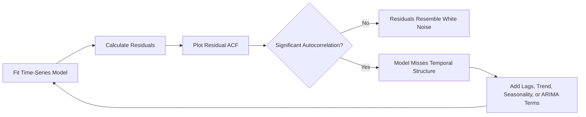
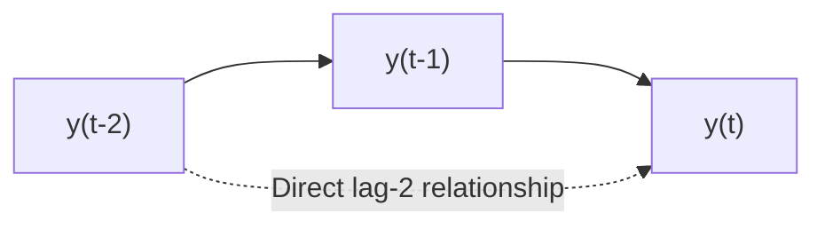
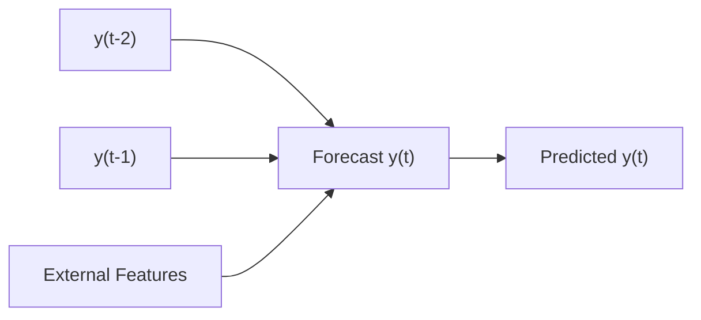
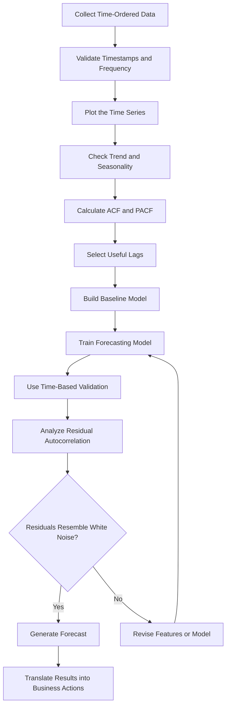

# 015 — Autocorrelation

**Course:** 01 — Math, Statistics, and Econometrics
**Module:** Module 03 — Econometrics and Time Series
**Content Group:** Time Series
**Roadmap Source:** Econometrics and Time Series / Time Series
**Lesson Type:** Econometrics and Time Series
**Lesson Order:** 015
**Suggested Duration:** 22 minutes

---

## 1. Overview

**Autocorrelation** measures the relationship between a time series and its own past values.

It helps answer questions such as:

* Does today's value depend on yesterday's value?
* Do high values tend to be followed by high values?
* Does the series repeat a pattern after a fixed number of periods?
* Do model residuals still contain time-dependent information?
* Can historical values improve future forecasts?

Autocorrelation is important in:

* Time-series exploration
* Forecasting
* Regression diagnostics
* Feature engineering
* ARIMA modeling
* Anomaly detection
* Model validation

A time series with strong autocorrelation contains temporal structure that may be useful for prediction. However, autocorrelation in model residuals often indicates that the model has failed to capture all relevant time-dependent patterns.

---

## 2. Learning Objectives

By the end of this lesson, you should be able to:

* Explain autocorrelation in your own words.
* Distinguish between positive, negative, and zero autocorrelation.
* Understand the meaning of a lag.
* Calculate and interpret autocorrelation coefficients.
* Read an Autocorrelation Function, or ACF, plot.
* Detect autocorrelation in model residuals.
* Understand why autocorrelation can violate regression assumptions.
* Use autocorrelation for time-series feature engineering and forecasting.
* Apply autocorrelation analysis to a small dataset.
* Translate statistical findings into business recommendations.

---

## 3. Core Concept

Autocorrelation is the correlation between observations of the same variable at different points in time.

For a time series:

$$
y_1, y_2, y_3, \ldots, y_t
$$

we may compare the current value $y_t$ with a previous value such as:

$$
y_{t-1}
$$

The relationship between $y_t$ and $y_{t-1}$ is called **lag-1 autocorrelation**.

Similarly:

* Lag 1 compares $y_t$ with $y_{t-1}$
* Lag 2 compares $y_t$ with $y_{t-2}$
* Lag 7 compares $y_t$ with (y_{t-7})
* Lag 12 compares $y_t$ with (y_{t-12})

For daily sales data, lag 7 may capture weekly behavior.
For monthly sales data, lag 12 may capture yearly seasonality.

---

## 4. What Is a Lag?

A **lag** is the number of time steps separating two observations.

Consider the following daily sales values:

| Day | Sales | Lag-1 Sales |
| --: | ----: | ----------: |
|   1 |   100 |           — |
|   2 |   110 |         100 |
|   3 |   115 |         110 |
|   4 |   108 |         115 |
|   5 |   120 |         108 |

The lag-1 version of the series shifts the original values by one period.

```text
Original series:  100 → 110 → 115 → 108 → 120
Lag-1 series:       — → 100 → 110 → 115 → 108
```

Autocorrelation measures how strongly the original series is related to this shifted version.

---

## 5. Mathematical Definition

The autocorrelation at lag $k$ is commonly written as:

$$
\rho_k =
\frac{
\text{Cov}(y_t, y_{t-k})
}{
\sqrt{
\text{Var}(y_t)
\text{Var}(y_{t-k})
}
}
$$

For a stationary time series, this is often simplified to:

$$
\rho_k =
\frac{
\text{Cov}(y_t, y_{t-k})
}{
\text{Var}(y_t)
}
$$

The sample autocorrelation at lag $k$ can be estimated as:

$$
r_k =
\frac{
\sum_{t=k+1}^{n}
(y_t-\bar{y})(y_{t-k}-\bar{y})
}{
\sum_{t=1}^{n}
(y_t-\bar{y})^2
}
$$

where:

* $y_t$ is the value at time $t$
* $y_{t-k}$ is the value $k$ periods earlier
* $\bar{y}$ is the sample mean
* $k$ is the selected lag
* $n$ is the number of observations

Like a standard correlation coefficient:

$$
-1 \leq r_k \leq 1
$$

---

## 6. Types of Autocorrelation

### 6.1 Positive Autocorrelation

Positive autocorrelation occurs when similar values tend to follow one another.

```text
High → High → High
Low  → Low  → Low
```

Example:

```text
100, 105, 110, 115, 120
```

This series changes gradually, so adjacent observations are likely to have strong positive correlation.

A positive lag-1 autocorrelation means:

$$
y_t \uparrow
\quad \Rightarrow \quad
y_{t+1} \text{ is also likely to be high}
$$

Common causes include:

* Trend
* Persistence
* Gradual changes
* Business momentum
* Slowly changing external conditions

---

### 6.2 Negative Autocorrelation

Negative autocorrelation occurs when high values tend to be followed by low values, and low values tend to be followed by high values.

```text
High → Low → High → Low
```

Example:

```text
100, 50, 105, 45, 110, 40
```

This pattern may appear in systems that alternate or correct themselves rapidly.

A negative lag-1 autocorrelation means:

$$
y_t \uparrow
\quad \Rightarrow \quad
y_{t+1} \text{ is more likely to be low}
$$

---

### 6.3 Zero or Weak Autocorrelation

Weak autocorrelation means that past values provide little linear information about current values.

Example:

```text
42, 105, 31, 88, 17, 73
```

This may indicate:

* Random noise
* An unpredictable process
* A model residual behaving like white noise
* A nonlinear dependency that correlation cannot detect

Zero autocorrelation does not necessarily imply complete independence.

---

## 7. Visual Intuition

### Positive Autocorrelation

```text
Value
  ^
  |                         ●
  |                    ●
  |                ●
  |           ●
  |      ●
  |  ●
  +--------------------------------> Time
```

Nearby values are similar and move in the same direction.

### Negative Autocorrelation

```text
Value
  ^
  | ●       ●       ●
  |
  |     ●       ●       ●
  +--------------------------------> Time
```

The series alternates between high and low values.

### Weak Autocorrelation

```text
Value
  ^
  |       ●             ●
  | ●               ●
  |            ●
  |    ●                    ●
  +--------------------------------> Time
```

There is no obvious relationship between nearby observations.

---

## 8. Autocorrelation Function

The **Autocorrelation Function**, or **ACF**, calculates autocorrelation over multiple lags.

$$
\text{ACF}(k) = \text{Corr}(y_t, y_{t-k})
$$

An ACF plot usually contains:

* The lag number on the horizontal axis
* The autocorrelation coefficient on the vertical axis
* Confidence bounds around zero
* Vertical bars representing autocorrelation at each lag

Example:

```text
Autocorrelation
  1.0 | █
  0.8 | █
  0.6 | █     █
  0.4 | █     █
  0.2 | █  █  █
  0.0 |-------------------------------
 -0.2 |
       0  1  2  3  4  5  6  7   Lag
```

Lag 0 always has an autocorrelation of 1 because the series is perfectly correlated with itself.

---

## 9. Interpreting an ACF Plot

### Pattern 1: Slowly Decreasing ACF

```text
Lag:  1    2    3    4    5
ACF: .90  .82  .74  .66  .58
```

Possible interpretation:

* Strong persistence
* Trend
* Non-stationarity
* An autoregressive process

The series may need detrending or differencing.

---

### Pattern 2: Significant Spikes at Seasonal Lags

For monthly data:

```text
Strong spikes at lag 12, 24, 36
```

Possible interpretation:

* Annual seasonality
* Similar values recur every 12 months

For daily data:

```text
Strong spikes at lag 7, 14, 21
```

Possible interpretation:

* Weekly seasonality

---

### Pattern 3: ACF Drops Quickly to Zero

```text
Lag:  1    2    3    4
ACF: .55  .10  .03  .01
```

Possible interpretation:

* Short-term dependence
* A moving-average process
* Limited predictive information after the first few lags

---

### Pattern 4: No Significant Spikes

Possible interpretation:

* The series resembles white noise
* The model residuals do not contain obvious linear time dependence
* Historical values may provide limited forecasting power

---

## 10. Confidence Bounds

ACF plots normally include approximate confidence bounds around zero.

A common approximation for a 95% confidence interval is:

$$
\pm \frac{1.96}{\sqrt{n}}
$$

where $n$ is the number of observations.

Autocorrelation bars extending beyond these bounds may be statistically significant.

However, significance should not be interpreted mechanically because:

* Many lags are tested simultaneously.
* Large datasets can make very small effects significant.
* Trend and seasonality can create misleading autocorrelation.
* Business importance may differ from statistical significance.

---

## 11. Autocorrelation and Stationarity

Autocorrelation analysis is often connected to **stationarity**.

A stationary time series has statistical properties that remain approximately stable over time, including:

* Constant mean
* Constant variance
* Stable autocorrelation structure

A trending series often has strong autocorrelation even when there is no meaningful direct causal dependency between neighboring observations.

Example:

```text
Time:   1   2   3   4   5
Sales: 10  20  30  40  50
```

This series has strong positive autocorrelation mainly because both current and past values increase over time.

Therefore, before interpreting autocorrelation, check for:

* Trend
* Seasonality
* Structural breaks
* Changing variance
* Missing observations
* Irregular time intervals

---

## 12. Autocorrelation Versus Seasonality

Autocorrelation and seasonality are related but not identical.

* **Autocorrelation** measures statistical dependence across time lags.
* **Seasonality** describes a repeating pattern with a known or approximately fixed period.

Seasonality often creates autocorrelation at specific lags.

For example, weekly seasonality in daily sales may produce:

$$
\rho_7 > 0
$$

because Mondays resemble previous Mondays, Tuesdays resemble previous Tuesdays, and so on.


However, high autocorrelation can also be caused by trend, persistence, or smoothing, not only seasonality.

---

## 13. Autocorrelation in Regression Residuals

In classical linear regression, errors are often assumed to be independent:

$$
\text{Cov}(\varepsilon_t,\varepsilon_s)=0
\quad \text{for } t \neq s
$$

Autocorrelated residuals violate this assumption.

A common residual relationship is:

$$
\varepsilon_t = \phi\varepsilon_{t-1} + u_t
$$

where:

* $\phi$ controls the strength of autocorrelation
* $u_t$ is a random error term

When residuals are autocorrelated:

* OLS coefficient estimates may remain unbiased under some conditions.
* Standard errors may be incorrect.
* Confidence intervals may be misleading.
* Hypothesis tests may become unreliable.
* The model may be missing important temporal structure.
* Forecast uncertainty may be underestimated.

---

## 14. Why Residual Autocorrelation Matters

Suppose a sales model predicts:

$$
\text{Sales}_t = \beta_0 + \beta_1 \text{Advertising}_t + \varepsilon_t
$$

If residuals remain positive for several consecutive periods:

```text
Actual sales are above prediction:
Week 1 → Week 2 → Week 3 → Week 4
```

the model may be missing:

* A trend
* A seasonal feature
* A promotion period
* A delayed advertising effect
* A competitor event
* An autoregressive component

A good forecasting model should usually produce residuals that resemble white noise.



---

## 15. Detecting Autocorrelation

Common methods include:

1. Time-series plot
2. Lag plot
3. ACF plot
4. Durbin–Watson statistic
5. Ljung–Box test
6. Breusch–Godfrey test
7. Residual sequence analysis

---

## 16. Lag Plot

A lag plot compares:

$$
y_t
$$

against:

$$
y_{t-k}
$$

For lag 1, the plot compares each observation with the immediately previous observation.

### Positive Autocorrelation

Points form an upward diagonal pattern:

```text
y(t)
 ^
 |          ●
 |       ●
 |    ●
 | ●
 +-----------------> y(t-1)
```

### Negative Autocorrelation

Points form a downward diagonal pattern:

```text
y(t)
 ^
 | ●
 |    ●
 |       ●
 |          ●
 +-----------------> y(t-1)
```

### Weak Autocorrelation

Points appear randomly scattered.

---

## 17. Durbin–Watson Statistic

The Durbin–Watson statistic is commonly used to detect first-order autocorrelation in regression residuals.

$$
DW = \frac{ \sum_{t=2}^{n} (\varepsilon_t-\varepsilon_{t-1})^2 }{ \sum_{t=1}^{n} \varepsilon_t^2 }
$$

Its value is approximately between 0 and 4.

A simplified interpretation is:

| Durbin–Watson Value | Possible Interpretation            |
| ------------------: | ---------------------------------- |
|              Near 0 | Strong positive autocorrelation    |
|              Near 2 | Little first-order autocorrelation |
|              Near 4 | Strong negative autocorrelation    |

A useful approximation is:

$$
DW \approx 2(1-r_1)
$$

where $r_1$ is the lag-1 residual autocorrelation.

Important limitations:

* It focuses mainly on first-order autocorrelation.
* It has special assumptions and inconclusive regions.
* It is not suitable for every model specification.
* It should not be used as the only diagnostic.

---

## 18. Ljung–Box Test

The Ljung–Box test checks whether a group of autocorrelations is jointly equal to zero.

The null hypothesis is:

$$
H_0:
\rho_1=\rho_2=\cdots=\rho_h=0
$$

The alternative hypothesis is:

$$
H_1:
\text{At least one autocorrelation is nonzero}
$$

The test statistic is:

$$
Q = n(n+2) \sum_{k=1}^{h} \frac{r_k^2}{n-k}
$$

where:

* $n$ is the sample size
* $h$ is the maximum tested lag
* $r_k$ is the sample autocorrelation at lag $k$

Interpretation:

* Large p-value: insufficient evidence of residual autocorrelation
* Small p-value: evidence that the residuals are not independently distributed

The choice of maximum lag $h$ should reflect the data frequency and expected seasonal behavior.

---

## 19. Autocorrelation Versus Partial Autocorrelation

The **ACF** measures the total relationship between $y_t$ and $y_{t-k}$, including indirect relationships through intermediate lags.

The **Partial Autocorrelation Function**, or **PACF**, measures the direct relationship between $y_t$ and $y_{t-k}$ after controlling for lags:

$$
1, 2, \ldots, k-1
$$

Example:

```text
y(t-2) → y(t-1) → y(t)
```

The ACF at lag 2 may be high because $y_{t-2}$ affects $y_{t-1}$, which then affects $y_t$.

PACF attempts to isolate the direct relationship between:

$$
y_t
\quad \text{and} \quad
y_{t-2}
$$



A simplified ARIMA identification guideline is:

| Process | Typical ACF Pattern    | Typical PACF Pattern   |
| ------- | ---------------------- | ---------------------- |
| AR($p$) | Gradually decays       | Cuts off after lag $p$ |
| MA($q$) | Cuts off after lag $q$ | Gradually decays       |
| ARMA    | Gradually decays       | Gradually decays       |

These patterns are guidelines, not strict rules.

---

## 20. Autocorrelation in AR Models

An autoregressive model predicts the current value using previous values.

An AR(1) model is:

$$
y_t = c + \phi_1 y_{t-1} + \varepsilon_t
$$

An AR(2) model is:

$$
y_t = c + \phi_1 y_{t-1} + \phi_2 y_{t-2} + \varepsilon_t
$$

The model explicitly uses autocorrelation for prediction.



---

## 21. Autocorrelation in Machine Learning

Autocorrelation affects standard machine-learning workflows because observations are not independently and identically distributed.

### 21.1 Feature Engineering

Past observations can become predictive features:

$$
\text{lag\_1}_t = y_{t-1}
$$

$$
\text{lag\_7}_t = y_{t-7}
$$

$$
\text{rolling\_mean\_7}_t = \frac{1}{7} \sum_{i=1}^{7} y_{t-i}
$$

Common time-series features include:

* Lag values
* Rolling means
* Rolling standard deviations
* Seasonal lag values
* Expanding statistics
* Differences
* Percentage changes

---

### 21.2 Validation Strategy

Random train-test splitting can leak temporal information.

Incorrect approach:

```text
Random observations
        ↓
Train and test contain mixed past and future records
        ↓
Future patterns may leak into training
        ↓
Overly optimistic evaluation
```

Recommended approach:

```text
Past observations        Future observations
[ Training period ] ---> [ Validation period ]
```


Useful validation methods include:

* Chronological train-test split
* Expanding-window validation
* Rolling-window validation
* Walk-forward validation

---

### 21.3 Leakage Through Rolling Features

A rolling feature must only use information available before the prediction time.

Incorrect:

$$
\text{rolling\_mean}_t = \frac{y_{t-1}+y_t+y_{t+1}}{3}
$$

This uses the future value $y_{t+1}$.

Correct:

$$
\text{rolling\_mean}_t = \frac{y_{t-3}+y_{t-2}+y_{t-1}}{3}
$$

The feature should usually be shifted before calculating the rolling statistic.

---

## 22. Practical Example: Daily Sales

Suppose a store records the following daily sales:

| Day | Sales |
| --: | ----: |
|   1 |   100 |
|   2 |   108 |
|   3 |   115 |
|   4 |   117 |
|   5 |   125 |
|   6 |   130 |
|   7 |   128 |
|   8 |   135 |

The values change gradually, so nearby observations are similar.

A high lag-1 autocorrelation may indicate that yesterday's sales help predict today's sales.

A baseline model could be:

$$
\hat{y}_t = y_{t-1}
$$

This is called the **naive forecast**.

```text
Yesterday's sales
        ↓
Use as today's prediction
        ↓
Compare with actual sales
        ↓
Measure MAE or RMSE
```

Although simple, this baseline can perform well when autocorrelation is strong.

---

## 23. Python Demo

```python
import matplotlib.pyplot as plt
import pandas as pd
from statsmodels.graphics.tsaplots import plot_acf, plot_pacf
from statsmodels.stats.diagnostic import acorr_ljungbox

# Example daily sales data
sales = pd.Series(
    [
        100, 108, 115, 117, 125, 130, 128,
        135, 140, 145, 143, 150, 157, 160
    ],
    name="sales",
)

# Lag-1 autocorrelation
lag_1_autocorrelation = sales.autocorr(lag=1)
print(f"Lag-1 autocorrelation: {lag_1_autocorrelation:.3f}")

# Autocorrelation at selected lags
for lag in [1, 2, 3, 7]:
    value = sales.autocorr(lag=lag)
    print(f"Lag {lag}: {value:.3f}")

# Plot the time series
plt.figure(figsize=(10, 4))
plt.plot(sales.index, sales.values, marker="o")
plt.title("Daily Sales")
plt.xlabel("Time")
plt.ylabel("Sales")
plt.grid(alpha=0.3)
plt.show()

# ACF plot
plot_acf(sales, lags=7)
plt.title("Autocorrelation Function")
plt.show()

# PACF plot
plot_pacf(sales, lags=6, method="ywm")
plt.title("Partial Autocorrelation Function")
plt.show()

# Ljung–Box test
result = acorr_ljungbox(sales, lags=[3, 6], return_df=True)
print(result)
```

---

## 24. Residual Autocorrelation Demo

```python
import matplotlib.pyplot as plt
import numpy as np
import pandas as pd
import statsmodels.api as sm
from statsmodels.graphics.tsaplots import plot_acf
from statsmodels.stats.stattools import durbin_watson
from statsmodels.stats.diagnostic import acorr_ljungbox

# Example data
data = pd.DataFrame(
    {
        "advertising": [10, 12, 11, 15, 17, 18, 20, 21, 23, 25],
        "sales": [100, 105, 108, 120, 127, 135, 145, 152, 165, 178],
    }
)

# Fit a simple regression
X = sm.add_constant(data["advertising"])
model = sm.OLS(data["sales"], X).fit()

# Extract residuals
residuals = model.resid

print(model.summary())

# Durbin–Watson statistic
dw = durbin_watson(residuals)
print(f"Durbin–Watson statistic: {dw:.3f}")

# Ljung–Box test
ljung_box = acorr_ljungbox(residuals, lags=[3], return_df=True)
print(ljung_box)

# Residual ACF
plot_acf(residuals, lags=5)
plt.title("ACF of Regression Residuals")
plt.show()
```

The analysis should not stop at the test result. Inspect:

* Residual time plot
* Residual ACF
* Model features
* Trend and seasonal variables
* Structural changes
* Outliers
* Validation performance

---

## 25. End-to-End Workflow



---

## 26. Business Interpretation

A statistical result should be translated into business language.

Weak interpretation:

> Lag-7 autocorrelation is 0.72.

Better interpretation:

> Daily sales show strong weekly repetition. Sales from the same weekday in the previous week contain useful information for forecasting current demand.

Action-oriented interpretation:

> Add lag-7 sales and weekday features to the forecasting model. Use the resulting forecast to improve inventory and staffing decisions for each weekday.

Another example:

> Residuals remain positively autocorrelated for three days, suggesting that the model reacts too slowly to changes in demand. Adding recent sales lags or a short rolling average may improve forecast responsiveness.

---

## 27. Common Causes of Autocorrelation

Autocorrelation may be caused by:

* Long-term trend
* Seasonal repetition
* Business momentum
* Delayed effects
* Gradual customer behavior changes
* Inventory cycles
* Weather persistence
* Financial market regimes
* Missing variables
* Incorrect model structure
* Data smoothing
* Aggregation
* Structural breaks
* Measurement procedures

Autocorrelation itself does not identify the cause. It only indicates time-dependent association.

---

## 28. How to Handle Autocorrelation

The appropriate solution depends on its cause.

### 28.1 Add Time Features

Examples:

* Day of week
* Month
* Quarter
* Holiday indicator
* Promotion period
* Time index

---

### 28.2 Add Lag Features

Examples:

$$
y_{t-1}, y_{t-7}, y_{t-12}
$$

Use only lags available at prediction time.

---

### 28.3 Remove Trend

Possible methods:

* Linear detrending
* Differencing
* Log transformation
* Seasonal decomposition

First difference:

$$
\Delta y_t = y_t-y_{t-1}
$$

Seasonal difference:

$$
\Delta_s y_t = y_t-y_{t-s}
$$

---

### 28.4 Model the Dependence Directly

Possible models:

* Autoregressive models
* ARIMA
* SARIMA
* Exponential smoothing
* Dynamic regression
* State-space models
* Gradient boosting with lag features
* Recurrent neural networks
* Temporal convolutional networks
* Transformer-based forecasting models

---

### 28.5 Correct Regression Standard Errors

When the main goal is inference rather than forecasting, possible methods include:

* Newey–West standard errors
* Generalized least squares
* Clustered standard errors where appropriate
* Explicit time-series error models

Correcting standard errors does not necessarily fix missing model structure. The underlying cause of the autocorrelation should still be investigated.

---

## 29. Common Mistakes

### Mistake 1: Treating Autocorrelation as Causation

A high correlation between $y_t$ and $y_{t-1}$ does not prove that the previous value directly causes the current value.

Both may be driven by:

* Trend
* Seasonality
* External variables
* Shared business conditions

---

### Mistake 2: Ignoring Trend Before Reading the ACF

A trending series often produces high autocorrelation across many lags.

The analyst may incorrectly conclude that many past lags have direct predictive effects.

---

### Mistake 3: Using Random Train-Test Splits

Random splitting can leak future information and produce unrealistic performance estimates.

---

### Mistake 4: Creating Features with Future Data

Centered rolling averages, future-filled missing values, and unshifted target statistics can create leakage.

---

### Mistake 5: Checking Only Lag 1

Autocorrelation may appear at:

* Seasonal lags
* Longer delayed lags
* Multiple business-cycle lags

---

### Mistake 6: Looking Only at p-Values

Statistical significance does not guarantee meaningful forecasting improvement.

Consider:

* Effect size
* Validation error
* Operational impact
* Model complexity

---

### Mistake 7: Ignoring Residual Autocorrelation

A model can have high $R^2$ and still produce autocorrelated residuals.

Good in-sample fit does not guarantee that temporal structure has been captured correctly.

---

### Mistake 8: Assuming No Autocorrelation Means Independence

ACF detects linear relationships. Nonlinear temporal dependence may still exist.

---

### Mistake 9: Using Too Many Lag Features

Adding a large number of lags may cause:

* Overfitting
* Multicollinearity
* Reduced sample size
* Slower training
* Unstable feature importance

Lag selection should be guided by domain knowledge, ACF/PACF patterns, and time-based validation.

---

## 30. Practical Exercise

Use a daily or monthly dataset such as:

* Retail sales
* Website traffic
* Energy consumption
* Temperature
* Product demand
* Transaction volume
* Application requests
* CPU usage

Complete the following tasks:

1. Load and sort the data by timestamp.
2. Check for missing or duplicate timestamps.
3. Plot the original series.
4. Identify visible trend and seasonality.
5. Calculate autocorrelation at several lags.
6. Create an ACF plot.
7. Create a PACF plot.
8. Explain the most important lag.
9. Build a naive forecast.
10. Create one or more lag features.
11. Train a simple forecasting model.
12. Evaluate it with a chronological split.
13. Plot the residual ACF.
14. Run a Ljung–Box test.
15. Write one business recommendation.

---

## 31. Suggested Mini-Project

### Sales Forecasting with Autocorrelation Analysis

Build a small forecasting project containing:

* Exploratory time-series plot
* Trend analysis
* Seasonal analysis
* ACF and PACF plots
* Naive forecasting baseline
* Lag-feature model
* ARIMA or SARIMA model
* Time-based validation
* MAE, RMSE, or MAPE comparison
* Residual diagnostics
* Business recommendations

Suggested pipeline:

```text
Sales Data
    ↓
Timestamp Validation
    ↓
Trend and Seasonality Analysis
    ↓
ACF and PACF
    ↓
Naive Baseline
    ↓
Lag Features or ARIMA
    ↓
Walk-Forward Validation
    ↓
Residual Diagnostics
    ↓
Forecast
    ↓
Inventory Recommendation
```

Possible portfolio artifacts:

* Jupyter notebook
* Forecasting dashboard
* Streamlit application
* REST forecasting API
* Dockerized forecasting service
* Technical report
* Model comparison table

---

## 32. Questions for Further Analysis

After completing the lesson, consider:

* Is the autocorrelation caused by trend or genuine short-term dependence?
* Which lags have a clear business interpretation?
* Is there a weekly, monthly, or annual seasonal pattern?
* Does differencing reduce the autocorrelation?
* Do lag features improve out-of-sample performance?
* Are the residuals close to white noise?
* Does the model still underestimate uncertainty?
* Are there structural breaks or regime changes?
* Could irregular timestamps affect the analysis?
* Is the relationship linear or nonlinear?
* Does a simpler baseline perform as well as a complex model?

---

## 33. Completion Checklist

* [ ] I can explain autocorrelation in one or two minutes.
* [ ] I understand what a lag represents.
* [ ] I can distinguish positive, negative, and weak autocorrelation.
* [ ] I can calculate autocorrelation for a selected lag.
* [ ] I can interpret an ACF plot.
* [ ] I understand the difference between ACF and PACF.
* [ ] I can check residual autocorrelation.
* [ ] I understand the basic interpretation of Durbin–Watson.
* [ ] I can use the Ljung–Box test.
* [ ] I know why random splitting is inappropriate for time-series data.
* [ ] I can create leakage-safe lag and rolling features.
* [ ] I have produced a notebook, chart, model, API, or technical note.
* [ ] I have documented at least one assumption, limitation, or caveat.
* [ ] I can translate the result into a business recommendation.

---

## 34. Related Outcome

Model relationships in time-dependent data using:

* Regression diagnostics
* Autocorrelation analysis
* Lag features
* AR and MA processes
* ARIMA and SARIMA
* Forecasting workflows
* Time-based model validation

---

## 35. Related Project

**Mini-Project:** Sales Forecasting with Trend, Seasonality, and Autocorrelation Analysis

Expected deliverables:

* Clean time-series dataset
* Exploratory charts
* ACF and PACF plots
* Naive baseline
* Forecasting model
* Time-based evaluation
* Residual diagnostics
* Business interpretation
* Reproducible notebook or application

---

## 36. Summary

**Autocorrelation** measures how strongly a time series is related to its own past values.

It can reveal:

* Short-term persistence
* Alternating behavior
* Seasonal repetition
* Useful forecasting lags
* Missing temporal structure in a model

Autocorrelation is useful only when interpreted together with:

* Trend
* Seasonality
* Stationarity
* Residual diagnostics
* Time-based validation
* Domain knowledge

A strong workflow is:

```text
Time-Ordered Data
        ↓
Trend and Seasonality Analysis
        ↓
ACF and PACF
        ↓
Baseline and Forecasting Model
        ↓
Time-Based Validation
        ↓
Residual Diagnostics
        ↓
Business Recommendation
```

Do not stop at the definition. Turn the concept into a practical artifact such as a notebook, chart, forecasting experiment, API, dashboard, Docker service, or portfolio report.

---

# Bài luyện tập

## Mục tiêu


## Đề bài


## Yêu cầu hoàn thành

- [ ] 
- [ ] 
- [ ] 

## Kết quả / lời giải


## Ghi chú
