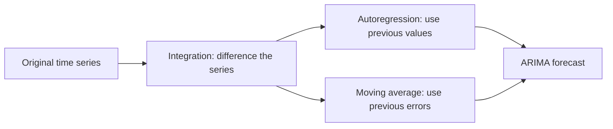
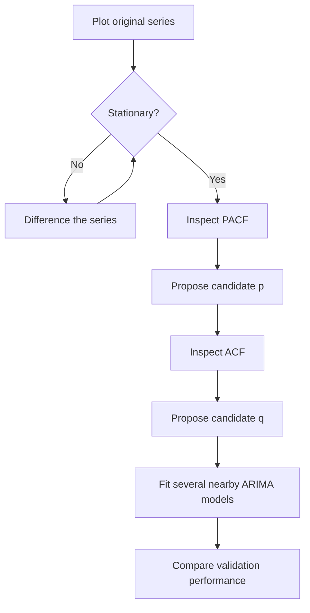
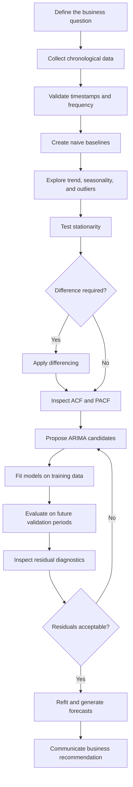
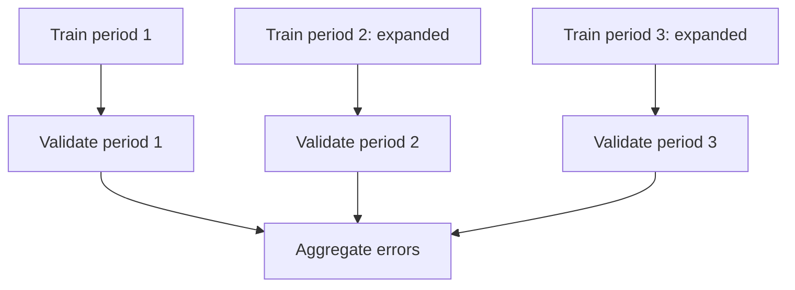
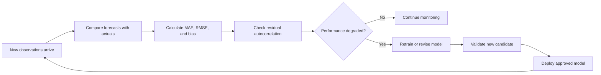
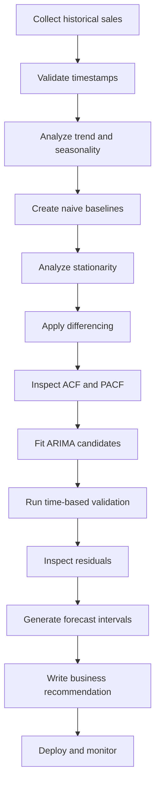

# 017 — ARIMA Model

**Course:** 01 — Mathematics, Statistics, and Econometrics
**Module:** Module 03 — Econometrics and Time Series
**Content Group:** Time Series
**Roadmap Source:** Econometrics and Time Series / Time Series
**Lesson Type:** Econometrics and Time Series
**Order in Module:** 017
**Suggested Duration:** 22 minutes

---

## 1. Overview

This lesson explains the **Autoregressive Integrated Moving Average model**, commonly known as **ARIMA**, in the context of AI and data science.

ARIMA is a classical statistical model for analyzing and forecasting time-series data. It combines three ideas:

* **Autoregression:** predicting the current value from previous values;
* **Integration:** differencing the series to remove non-stationarity;
* **Moving average:** modeling the influence of previous forecast errors.

ARIMA is particularly useful when:

* observations are recorded in chronological order;
* the series contains temporal dependence;
* past values contain information about future values;
* the data can be transformed into a stationary series;
* external predictors are unavailable or unnecessary;
* an interpretable statistical forecasting model is required.

After completing this lesson, you should be able to explain ARIMA, interpret its parameters, fit candidate models, evaluate forecasts, and diagnose model residuals.

---

## 2. Learning Objectives

By the end of this lesson, you should be able to:

* explain the purpose of an ARIMA model;
* interpret the parameters (p), (d), and (q);
* distinguish AR, MA, ARMA, and ARIMA models;
* recognize why stationarity matters;
* apply differencing to a non-stationary series;
* use ACF and PACF plots to propose candidate parameters;
* fit an ARIMA model using Python;
* evaluate forecasts using chronological validation;
* diagnose residual autocorrelation;
* communicate forecasting results in business language.

---

## 3. The Time-Series Forecasting Problem

A time series is an ordered sequence of observations:

$$
y_1, y_2, y_3, \ldots, y_t
$$

The goal of forecasting is to estimate future values:

$$
\hat{y}_{t+1}, \hat{y}_{t+2}, \ldots, \hat{y}_{t+h}
$$

where (h) is the forecast horizon.

Examples include:

* next-day product demand;
* next-week website traffic;
* monthly revenue;
* hourly electricity consumption;
* daily transaction volume;
* weekly customer-support requests.

A forecasting model must respect chronological order.

```text
Past observations                    Future observations
────────────────────────────────┬──────────────────────────
y(t-4)  y(t-3)  y(t-2)  y(t-1)  y(t)   ŷ(t+1)  ŷ(t+2)
                                │
                         Forecast origin
```

Unlike ordinary tabular prediction, future observations must never be used to train or preprocess earlier observations.

---

## 4. What Does ARIMA Mean?

ARIMA stands for:

> **Autoregressive Integrated Moving Average**

An ARIMA model is written as:

$$
\text{ARIMA}(p,d,q)
$$

where:

| Parameter | Component            | Meaning                                   |
| --------- | -------------------- | ----------------------------------------- |
| (p)       | Autoregressive order | Number of previous observations used      |
| (d)       | Integration order    | Number of times the series is differenced |
| (q)       | Moving-average order | Number of previous forecast errors used   |

The three components work together:



---

## 5. The Autoregressive Component — AR

An autoregressive model predicts the current value using previous values of the same series.

An AR model of order (p), written as AR((p)), is:

$$
y_t = c + \phi_1 y_{t-1} + \phi_2 y_{t-2} + \cdots + \phi_p y_{t-p} + \varepsilon_t
$$

where:

* (c) is a constant;
* (\phi_1, \phi_2, \ldots, \phi_p) are autoregressive coefficients;
* (p) is the number of included lags;
* (\varepsilon_t) is a random error term.

### AR(1) example

$$
y_t = c + \phi_1 y_{t-1} + \varepsilon_t
$$

This model assumes that the current observation depends directly on the previous observation.

For daily demand:

> Today's demand is partly explained by yesterday's demand.

### AR(2) example

$$
y_t = c + \phi_1y_{t-1} + \phi_2y_{t-2} + \varepsilon_t
$$

This model uses the previous two observations.

```text
y(t-2) ──────┐
             ├────► y(t)
y(t-1) ──────┘
```

---

## 6. The Integrated Component — I

The integrated component represents the number of times the series is differenced.

Differencing is used to reduce trend and transform a non-stationary series into a more stationary series.

### First difference

$$
\Delta y_t = y_t-y_{t-1}
$$

If (d=1), the ARIMA model is fitted to the first-differenced series.

### Second difference

$$
\Delta^2 y_t = \Delta y_t-\Delta y_{t-1}
$$

Equivalently:

$$
\Delta^2y_t = y_t-2y_{t-1}+y_{t-2}
$$

If (d=2), the series is differenced twice.

### Example

Suppose cumulative sales are:

| Day | Sales |
| --: | ----: |
|   1 |   100 |
|   2 |   108 |
|   3 |   119 |
|   4 |   127 |

The first differences are:

| Day | First difference |
| --: | ---------------: |
|   2 |      (108-100=8) |
|   3 |     (119-108=11) |
|   4 |      (127-119=8) |

The original series may contain a trend, while the differenced series represents daily changes.

---

## 7. The Moving-Average Component — MA

The moving-average component models the current value using previous forecast errors.

An MA model of order (q), written as MA((q)), is:

$$
y_t = \mu + \varepsilon_t + \theta_1\varepsilon_{t-1} + \theta_2\varepsilon_{t-2} + \cdots + \theta_q\varepsilon_{t-q}
$$

where:

* (\mu) is the mean of the series;
* (\varepsilon_t) is the current random error;
* (\varepsilon_{t-1}, \ldots, \varepsilon_{t-q}) are previous errors;
* (\theta_1, \ldots, \theta_q) are moving-average coefficients.

### MA(1) example

$$
y_t = \mu + \varepsilon_t + \theta_1\varepsilon_{t-1}
$$

This means that a forecasting error from the previous time step influences the current observation.

### Important distinction

The moving-average component of ARIMA is not the same as a rolling average.

A rolling average is a data-smoothing transformation:

$$
\text{SMA}_t = \frac{1}{k} \sum_{i=0}^{k-1} y_{t-i}
$$

The MA component in ARIMA uses previous **errors**, not previous observations.

---

## 8. Combining the Components

An ARIMA((p,d,q)) model applies an ARMA((p,q)) model to a series that has been differenced (d) times.

Let:

$$
z_t = \Delta^d y_t
$$

Then the ARMA model for (z_t) is:

$$
z_t = c + \sum_{i=1}^{p}\phi_i z_{t-i} + \varepsilon_t + \sum_{j=1}^{q}\theta_j\varepsilon_{t-j}
$$

### Example: ARIMA(1,1,1)

First difference the original series:

$$
z_t = y_t-y_{t-1}
$$

Then model the differenced values as:

$$
z_t = c + \phi_1z_{t-1} + \varepsilon_t + \theta_1\varepsilon_{t-1}
$$

The final forecast is transformed back to the original scale.

---

## 9. AR, MA, ARMA, and ARIMA

| Model          | Description                                 |            Stationary input required? |
| -------------- | ------------------------------------------- | ------------------------------------: |
| AR((p))        | Uses previous observations                  |                                   Yes |
| MA((q))        | Uses previous errors                        |                                   Yes |
| ARMA((p,q))    | Uses previous observations and errors       |                                   Yes |
| ARIMA((p,d,q)) | Differences the series before applying ARMA | Original series may be non-stationary |

Special cases include:

$$
\text{ARIMA}(p,0,0)=\text{AR}(p)
$$

$$
\text{ARIMA}(0,0,q)=\text{MA}(q)
$$

$$
\text{ARIMA}(p,0,q)=\text{ARMA}(p,q)
$$

---

## 10. Why Stationarity Matters

A stationary time series has statistical properties that remain approximately stable over time.

These properties include:

* mean;
* variance;
* autocovariance;
* autocorrelation structure.

### Stationary series

```text
Value
  ▲       /\       /\   /\        /\
  │  /\  /  \ /\  /  \ /  \  /\  /  \
  │ /  \/    V  \/    V    \/  \/
  └────────────────────────────────────► Time
       Stable mean and variance
```

### Non-stationary series

```text
Value
  ▲                              /
  │                         ____/
  │                    ____/
  │              _____/
  │        _____/
  └────────────────────────────────────► Time
              Upward trend
```

ARIMA assumes that after differencing, the modeled series is approximately stationary.

---

## 11. Detecting Non-Stationarity

Common signs of non-stationarity include:

* a visible trend;
* changing variance;
* changing seasonal amplitude;
* an ACF that decays very slowly;
* very high autocorrelation across many lags;
* different behavior in different time periods.

### Statistical tests

The Augmented Dickey–Fuller test is commonly used to test for a unit root.

Typical hypotheses:

* (H_0): the series contains a unit root and is non-stationary;
* (H_1): the series is stationary.

A small p-value provides evidence against the unit-root hypothesis.

However, statistical tests should not replace visual inspection and domain knowledge.

---

## 12. Selecting the Differencing Order (d)

A practical workflow is:

1. Plot the original time series.
2. Inspect trend and variance.
3. Plot the ACF.
4. Apply first differencing.
5. Inspect the differenced series.
6. Apply another difference only when necessary.

Typical choices are:

* (d=0): the series is already stationary;
* (d=1): one difference removes the trend;
* (d=2): two differences are necessary.

Values above (2) are uncommon in ordinary applications.

### Avoid over-differencing

Over-differencing may:

* introduce unnecessary noise;
* increase forecast variance;
* create artificial negative autocorrelation;
* reduce model interpretability;
* produce unstable forecasts.

Use the smallest value of (d) that produces a sufficiently stationary series.

---

## 13. Selecting (p) and (q) with ACF and PACF

The **Autocorrelation Function** and **Partial Autocorrelation Function** provide useful starting heuristics.

| Process               | ACF pattern                 | PACF pattern           |
| --------------------- | --------------------------- | ---------------------- |
| AR((p))               | Gradually decays            | Cuts off after lag (p) |
| MA((q))               | Cuts off after lag (q)      | Gradually decays       |
| ARMA((p,q))           | Gradually decays            | Gradually decays       |
| Non-stationary series | Slow decay across many lags | Large early spikes     |

### Candidate-selection workflow



ACF and PACF provide candidate values, not guaranteed final parameters.

---

## 14. Example Parameter Interpretation

### ARIMA(1,0,0)

* one autoregressive lag;
* no differencing;
* no moving-average terms;
* equivalent to AR(1).

### ARIMA(0,1,0)

* no AR terms;
* first differencing;
* no MA terms;
* equivalent to a random-walk model without drift.

The model is:

$$
y_t = y_{t-1}+\varepsilon_t
$$

### ARIMA(0,1,1)

* first difference the series;
* use one previous forecast error;
* no autoregressive terms.

### ARIMA(2,1,1)

* first difference the series;
* use two previous differenced observations;
* use one previous forecast error.

---

## 15. Complete ARIMA Workflow



---

## 16. Baseline Models

An ARIMA model should always be compared with simple baselines.

### Naive forecast

The next observation is predicted using the latest observation:

$$
\hat{y}_{t+1}=y_t
$$

### Seasonal naive forecast

For a seasonal period (s):

$$
\hat{y}_t=y_{t-s}
$$

For daily data with weekly seasonality:

$$
\hat{y}_t=y_{t-7}
$$

### Mean forecast

$$
\hat{y}_{t+h} = \frac{1}{n} \sum_{t=1}^{n}y_t
$$

If ARIMA cannot outperform an appropriate baseline, its additional complexity may not be justified.

---

## 17. Python Demo

### 17.1 Import libraries

```python
import warnings

import matplotlib.pyplot as plt
import pandas as pd

from sklearn.metrics import mean_absolute_error, mean_squared_error
from statsmodels.graphics.tsaplots import plot_acf, plot_pacf
from statsmodels.stats.diagnostic import acorr_ljungbox
from statsmodels.tsa.arima.model import ARIMA
from statsmodels.tsa.stattools import adfuller

warnings.filterwarnings("ignore")
```

---

### 17.2 Load and prepare the data

```python
df = pd.read_csv(
    "sales.csv",
    parse_dates=["date"]
)

df = df.sort_values("date")
df = df.set_index("date")

sales = df["sales"].astype(float)
```

Check for missing timestamps:

```python
print(sales.index.min())
print(sales.index.max())
print(sales.index.inferred_freq)
print(sales.isna().sum())
```

For daily data, you may enforce a daily frequency:

```python
sales = sales.asfreq("D")
```

Missing values must be handled using a time-aware method.

---

### 17.3 Plot the series

```python
fig, ax = plt.subplots(figsize=(12, 4))

ax.plot(sales)
ax.set_title("Daily Sales")
ax.set_xlabel("Date")
ax.set_ylabel("Sales")

plt.tight_layout()
plt.show()
```

Look for:

* trend;
* seasonality;
* changing variance;
* outliers;
* structural breaks;
* missing periods.

---

### 17.4 Test stationarity

```python
def run_adf_test(series: pd.Series) -> None:
    clean_series = series.dropna()
    statistic, p_value, used_lags, n_obs, critical_values, _ = adfuller(
        clean_series,
        autolag="AIC",
    )

    print(f"ADF statistic: {statistic:.4f}")
    print(f"p-value: {p_value:.4f}")
    print(f"Used lags: {used_lags}")
    print(f"Number of observations: {n_obs}")

    for level, value in critical_values.items():
        print(f"Critical value ({level}): {value:.4f}")


run_adf_test(sales)
```

Do not decide stationarity from the p-value alone. Combine the test with visual analysis and autocorrelation patterns.

---

### 17.5 Difference the series

```python
sales_diff = sales.diff().dropna()
```

Plot the differenced series:

```python
fig, ax = plt.subplots(figsize=(12, 4))

ax.plot(sales_diff)
ax.set_title("First-Differenced Sales")
ax.set_xlabel("Date")
ax.set_ylabel("Change in Sales")

plt.tight_layout()
plt.show()
```

Run the stationarity test again:

```python
run_adf_test(sales_diff)
```

---

### 17.6 Plot ACF and PACF

```python
fig, ax = plt.subplots(figsize=(10, 4))

plot_acf(
    sales_diff,
    lags=40,
    zero=False,
    ax=ax,
)

ax.set_title("ACF of First-Differenced Sales")

plt.tight_layout()
plt.show()
```

```python
fig, ax = plt.subplots(figsize=(10, 4))

plot_pacf(
    sales_diff,
    lags=40,
    zero=False,
    method="ywm",
    ax=ax,
)

ax.set_title("PACF of First-Differenced Sales")

plt.tight_layout()
plt.show()
```

Use the plots to propose several candidate values of (p) and (q).

---

## 18. Chronological Train-Test Split

Never randomly shuffle a time series.

```python
split_index = int(len(sales) * 0.8)

train = sales.iloc[:split_index]
test = sales.iloc[split_index:]
```

```text
Time ─────────────────────────────────────────────►

|              Training data              | Test data |
```

A random split would allow future observations to influence the training process.

---

## 19. Fit an ARIMA Model

Fit an ARIMA(1,1,1) model:

```python
model = ARIMA(
    train,
    order=(1, 1, 1),
)

fitted_model = model.fit()

print(fitted_model.summary())
```

Generate forecasts:

```python
forecast_result = fitted_model.get_forecast(
    steps=len(test)
)

forecast = forecast_result.predicted_mean
forecast_ci = forecast_result.conf_int()
```

---

## 20. Plot Forecasts

```python
fig, ax = plt.subplots(figsize=(12, 5))

ax.plot(train, label="Training data")
ax.plot(test, label="Actual test data")
ax.plot(forecast, label="ARIMA forecast")

ax.fill_between(
    forecast_ci.index,
    forecast_ci.iloc[:, 0],
    forecast_ci.iloc[:, 1],
    alpha=0.2,
    label="Forecast interval",
)

ax.set_title("ARIMA Forecast")
ax.set_xlabel("Date")
ax.set_ylabel("Sales")
ax.legend()

plt.tight_layout()
plt.show()
```

A forecast should normally include both:

* point predictions;
* prediction intervals.

The interval communicates forecast uncertainty.

---

## 21. Evaluate Forecast Accuracy

### Mean Absolute Error

$$
\text{MAE} = \frac{1}{n} \sum_{t=1}^{n} |y_t-\hat{y}_t|
$$

### Root Mean Squared Error

$$
\text{RMSE} = \sqrt{ \frac{1}{n} \sum_{t=1}^{n} (y_t-\hat{y}_t)^2 }
$$

Python implementation:

```python
mae = mean_absolute_error(test, forecast)

rmse = mean_squared_error(
    test,
    forecast,
) ** 0.5

print(f"MAE: {mae:.2f}")
print(f"RMSE: {rmse:.2f}")
```

### Compare against a naive baseline

```python
naive_forecast = pd.Series(
    train.iloc[-1],
    index=test.index,
)

naive_mae = mean_absolute_error(
    test,
    naive_forecast,
)

print(f"Naive MAE: {naive_mae:.2f}")
print(f"ARIMA MAE: {mae:.2f}")
```

A useful model should outperform a relevant baseline on future data.

---

## 22. Comparing Candidate Models

Candidate models may include:

```python
candidate_orders = [
    (1, 1, 0),
    (0, 1, 1),
    (1, 1, 1),
    (2, 1, 0),
    (0, 1, 2),
    (2, 1, 1),
]
```

```python
results = []

for order in candidate_orders:
    try:
        model = ARIMA(train, order=order)
        fitted = model.fit()

        prediction = fitted.forecast(
            steps=len(test)
        )

        mae = mean_absolute_error(
            test,
            prediction,
        )

        rmse = mean_squared_error(
            test,
            prediction,
        ) ** 0.5

        results.append(
            {
                "order": order,
                "aic": fitted.aic,
                "bic": fitted.bic,
                "mae": mae,
                "rmse": rmse,
            }
        )

    except Exception as error:
        print(
            f"Model {order} failed: {error}"
        )

results_df = pd.DataFrame(results)
results_df = results_df.sort_values("mae")

print(results_df)
```

Do not select the model using AIC alone.

A model with a slightly worse AIC may perform better on future observations.

---

## 23. AIC and BIC

### Akaike Information Criterion

$$
\text{AIC} = -2\log(L)+2k
$$

### Bayesian Information Criterion

$$
\text{BIC} = -2\log(L)+k\log(n)
$$

where:

* (L) is the model likelihood;
* (k) is the number of estimated parameters;
* (n) is the number of observations.

Lower values are preferred when comparing models fitted to the same dataset.

However:

* AIC and BIC measure in-sample statistical fit with complexity penalties;
* they do not directly measure future business performance;
* time-based validation remains necessary.

---

## 24. Rolling Validation

A single train-test split may provide an unstable estimate.

Rolling or walk-forward validation evaluates a model across multiple forecast origins.



Example:

```text
Fold 1: [Train────────] [Validate]
Fold 2: [Train──────────────] [Validate]
Fold 3: [Train────────────────────] [Validate]
```

This better represents how the model will be updated and used in production.

---

## 25. Residual Diagnostics

Residuals are the differences between observed and fitted values:

$$
e_t = y_t-\hat{y}_t
$$

A well-specified ARIMA model should leave residuals that behave approximately like white noise.

Residuals should ideally have:

* mean close to zero;
* no meaningful autocorrelation;
* relatively stable variance;
* no remaining seasonal pattern;
* no systematic trend.

### Plot residuals

```python
residuals = fitted_model.resid

fig, ax = plt.subplots(figsize=(12, 4))

ax.plot(residuals)
ax.axhline(0, linestyle="--")
ax.set_title("ARIMA Residuals")
ax.set_xlabel("Date")
ax.set_ylabel("Residual")

plt.tight_layout()
plt.show()
```

### Plot residual ACF

```python
fig, ax = plt.subplots(figsize=(10, 4))

plot_acf(
    residuals.dropna(),
    lags=30,
    zero=False,
    ax=ax,
)

ax.set_title("Residual ACF")

plt.tight_layout()
plt.show()
```

Significant residual autocorrelation suggests that the model has not captured all temporal structure.

---

## 26. Ljung–Box Test

The Ljung–Box test evaluates whether a group of residual autocorrelations is jointly equal to zero.

Typical hypotheses:

* (H_0): residuals are independently distributed;
* (H_1): residuals contain autocorrelation.

```python
ljung_box_result = acorr_ljungbox(
    residuals.dropna(),
    lags=[10, 20],
    return_df=True,
)

print(ljung_box_result)
```

A small p-value suggests remaining autocorrelation.

However, do not use the test mechanically. Also inspect residual plots and consider the business context.

---

## 27. Forecast Intervals

A point forecast does not communicate uncertainty.

For example:

> Expected demand next week is 1,200 units.

A better statement is:

> Expected demand next week is 1,200 units, with a 95% forecast interval from 1,020 to 1,390 units.

Forecast intervals usually become wider as the forecast horizon increases.

```text
Forecast uncertainty

Value
  ▲             upper interval
  │            /──────────────
  │      _____/  forecast
  │ ____/
  │     \____________________
  │            lower interval
  └────────────────────────────► Horizon
```

Prediction intervals are important for:

* inventory buffers;
* staffing decisions;
* financial planning;
* capacity allocation;
* risk management.

---

## 28. Seasonality and SARIMA

A standard ARIMA model does not explicitly represent a repeating seasonal cycle.

Seasonal ARIMA, or SARIMA, is written as:

$$
\text{SARIMA}(p,d,q)(P,D,Q)_s
$$

where:

* (p,d,q) are non-seasonal parameters;
* (P,D,Q) are seasonal parameters;
* (s) is the seasonal period.

Examples:

* monthly data with yearly seasonality: (s=12);
* quarterly data with yearly seasonality: (s=4);
* daily data with weekly seasonality: (s=7);
* hourly data with daily seasonality: (s=24).

Example:

$$
\text{SARIMA}(1,1,1)(1,1,1)_{12}
$$

This model includes both ordinary and yearly seasonal relationships for monthly data.

---

## 29. External Variables and ARIMAX

Standard ARIMA uses only the history of the target series.

When external variables are available, an ARIMA model can be extended with exogenous predictors.

Examples include:

* price;
* advertising spend;
* promotions;
* holidays;
* weather;
* economic indicators;
* marketing campaigns.

The model can be written conceptually as:

$$
y_t = \text{ARIMA structure} + \beta_1x_{1,t} + \beta_2x_{2,t} + \cdots + \beta_kx_{k,t} + \varepsilon_t
$$

In `statsmodels`, this is commonly implemented using `SARIMAX`.

External variables must also be available for the future forecast period.

---

## 30. Business Interpretation

ARIMA results should be translated into operational language.

### Weak interpretation

> The selected model is ARIMA(1,1,1), with an MAE of 42.6.

### Better interpretation

> The model uses recent changes in demand and the previous forecast error to predict the next period. On the validation period, its forecasts were wrong by approximately 43 units on average.

### Better decision-oriented interpretation

> The ARIMA model reduced average forecast error from 61 units for the naive baseline to 43 units. This improvement may support lower safety-stock levels, but the forecast interval remains wide during promotional periods.

### Residual interpretation

> Residual autocorrelation remains at lag 7, which indicates that the model has not fully captured the weekly purchasing pattern. A seasonal ARIMA model should be evaluated next.

---

## 31. Important Assumptions

### 31.1 Regular time intervals

Observations should be recorded at a consistent frequency.

```text
Valid daily sequence:
Monday → Tuesday → Wednesday → Thursday

Irregular sequence:
Monday → Wednesday → Thursday → Sunday
```

In an irregular series, lag 1 does not consistently represent the same time duration.

---

### 31.2 Stationarity after differencing

The transformed series should have approximately stable statistical properties.

Remaining trend or seasonal structure may reduce model quality.

---

### 31.3 Linear temporal relationships

ARIMA represents linear relationships among past observations and errors.

It may not capture:

* complex nonlinear behavior;
* abrupt regime changes;
* interaction effects;
* saturation effects;
* highly irregular event-driven demand.

---

### 31.4 Stable data-generating process

ARIMA assumes that historical relationships remain useful for the forecast period.

Structural changes may violate this assumption.

Examples include:

* a new pricing strategy;
* a pandemic;
* a product launch;
* a competitor entering the market;
* a permanent policy change;
* a major platform redesign.

---

### 31.5 No future leakage

All preprocessing must respect time order.

Potential leakage sources include:

* calculating statistics using the full dataset;
* filling missing values with future observations;
* selecting parameters using the test period;
* scaling with future data;
* creating centered rolling features;
* using future exogenous variables that would not be known in production.

---

## 32. Common Mistakes

### Mistake 1: Fitting ARIMA directly to a strongly trending series

A trend can create misleading autocorrelation.

**Better approach:** inspect stationarity and apply appropriate differencing.

---

### Mistake 2: Selecting (p) and (q) mechanically

ACF and PACF patterns are not always clean in real data.

**Better approach:** fit several nearby candidates and compare future forecast performance.

---

### Mistake 3: Ignoring a simple baseline

A complex model may still perform worse than the latest-value forecast.

**Better approach:** always report baseline performance.

---

### Mistake 4: Randomly splitting the data

Random splitting introduces future information into the training set.

**Better approach:** use chronological or walk-forward validation.

---

### Mistake 5: Optimizing only AIC

The lowest AIC model may not produce the best out-of-sample forecasts.

**Better approach:** combine information criteria with time-based validation.

---

### Mistake 6: Ignoring residual autocorrelation

Good forecast metrics do not guarantee that the model is correctly specified.

**Better approach:** inspect residual plots, residual ACF, and Ljung–Box results.

---

### Mistake 7: Over-differencing

Excessive differencing adds noise and may create artificial dependence.

**Better approach:** use the smallest effective differencing order.

---

### Mistake 8: Ignoring seasonality

A standard ARIMA model may fail when strong seasonal cycles are present.

**Better approach:** evaluate seasonal differencing or SARIMA.

---

### Mistake 9: Treating prediction intervals as optional

A point forecast may create false confidence.

**Better approach:** provide uncertainty intervals and explain their operational meaning.

---

### Mistake 10: Using unavailable future predictors

An exogenous variable may appear useful historically but be unavailable at prediction time.

**Better approach:** verify how every future feature will be generated or obtained.

---

## 33. When ARIMA Works Well

ARIMA is a strong candidate when:

* the time series has sufficient historical observations;
* temporal dependence is approximately linear;
* trend can be removed through differencing;
* seasonality is absent or can be modeled explicitly;
* the data-generating process is relatively stable;
* interpretability is important;
* a statistical baseline is required;
* external predictors are limited.

---

## 34. When ARIMA May Not Be Enough

Consider other methods when:

* multiple seasonal cycles exist;
* many external variables drive the target;
* relationships are strongly nonlinear;
* there are frequent structural breaks;
* thousands of related time series must be forecast;
* the series is intermittent;
* the series contains many zeros;
* event effects dominate historical patterns;
* complex hierarchical constraints must be respected.

Possible alternatives include:

* exponential smoothing;
* SARIMA or SARIMAX;
* Prophet-style models;
* gradient-boosted trees with lag features;
* recurrent neural networks;
* temporal convolutional networks;
* Transformer-based forecasting models;
* hierarchical forecasting methods.

ARIMA remains valuable as an interpretable baseline even when more advanced models are used.

---

## 35. Practical Exercise

Use a daily sales, website-traffic, energy-demand, or sensor dataset.

### Task 1 — Validate the time index

* sort observations chronologically;
* check for duplicate timestamps;
* detect missing timestamps;
* confirm the sampling frequency;
* document how missing observations are handled.

### Task 2 — Explore the series

* plot the original data;
* identify trend;
* identify seasonality;
* inspect changing variance;
* detect unusual observations or structural breaks.

### Task 3 — Build baselines

Create:

* a naive forecast;
* a seasonal naive forecast when appropriate.

Record MAE and RMSE.

### Task 4 — Analyze stationarity

* run an ADF test;
* inspect the raw-series ACF;
* apply first differencing;
* compare the original and transformed series.

### Task 5 — Select candidates

Use ACF and PACF to propose at least three models, such as:

$$
\text{ARIMA}(1,1,0)
$$

$$
\text{ARIMA}(0,1,1)
$$

$$
\text{ARIMA}(1,1,1)
$$

Explain why each candidate is reasonable.

### Task 6 — Validate

Use:

* a chronological train-test split;
* or walk-forward validation.

Compare:

* baseline error;
* ARIMA error;
* AIC;
* BIC.

### Task 7 — Diagnose residuals

For the best model:

* plot residuals;
* plot residual ACF;
* run the Ljung–Box test;
* identify any remaining trend or seasonality.

### Task 8 — Communicate the result

Write a short recommendation for a non-technical stakeholder.

Include:

* expected forecast;
* expected uncertainty;
* comparison with the baseline;
* one limitation;
* one suggested next step.

---

## 36. Suggested Notebook Structure

```text
01. Business problem
02. Forecast horizon and decision context
03. Dataset description
04. Time-index validation
05. Missing-value treatment
06. Exploratory time-series analysis
07. Naive and seasonal baselines
08. Stationarity analysis
09. Differencing
10. ACF and PACF interpretation
11. Candidate ARIMA models
12. Chronological validation
13. Metric comparison
14. Residual diagnostics
15. Forecast intervals
16. Business interpretation
17. Assumptions and limitations
18. Next modeling steps
```

---

## 37. Portfolio Artifact

Create a notebook titled:

> **Sales Forecasting with ARIMA and Time-Based Validation**

The notebook should include:

* a clear forecasting question;
* a validated time index;
* exploratory time-series charts;
* a naive baseline;
* stationarity analysis;
* ACF and PACF plots;
* at least three ARIMA candidates;
* chronological or rolling validation;
* MAE and RMSE comparisons;
* residual diagnostics;
* forecast intervals;
* a final business recommendation.

Optional deployment artifacts include:

* a FastAPI forecasting endpoint;
* a Streamlit dashboard;
* a scheduled forecasting pipeline;
* a Docker container;
* a model-monitoring report;
* a database table containing forecasts and intervals.

---

## 38. Example Forecasting API

A minimal API contract may look like:

```json
{
  "series_id": "product_001",
  "forecast_horizon": 7,
  "model": "ARIMA(1,1,1)"
}
```

Example response:

```json
{
  "series_id": "product_001",
  "forecast_horizon": 7,
  "model": "ARIMA(1,1,1)",
  "forecast": [
    {
      "date": "2026-07-11",
      "prediction": 1240.5,
      "lower_95": 1102.3,
      "upper_95": 1378.7
    }
  ]
}
```

A production service should also record:

* training-data end date;
* model version;
* model parameters;
* validation metrics;
* forecast creation time;
* data-quality warnings;
* residual-diagnostic results.

---

## 39. Model-Monitoring Workflow



Monitor:

* forecast accuracy;
* forecast bias;
* interval coverage;
* missing observations;
* timestamp irregularities;
* residual autocorrelation;
* changes in trend or seasonality;
* structural breaks.

---

## 40. Completion Checklist

* [ ] I can explain ARIMA in one or two minutes.
* [ ] I understand the meaning of (p), (d), and (q).
* [ ] I can distinguish AR, MA, ARMA, and ARIMA.
* [ ] I understand why stationarity matters.
* [ ] I can apply first differencing.
* [ ] I can use ACF and PACF to propose candidate parameters.
* [ ] I can create a chronological train-test split.
* [ ] I can compare ARIMA against a naive baseline.
* [ ] I can calculate MAE and RMSE.
* [ ] I understand the role of AIC and BIC.
* [ ] I can inspect residual autocorrelation.
* [ ] I can run and interpret the Ljung–Box test.
* [ ] I can explain forecast intervals.
* [ ] I know when seasonal ARIMA may be necessary.
* [ ] I can identify at least one source of time leakage.
* [ ] I have created a notebook, chart, model, API, or portfolio artifact.
* [ ] I have documented at least one assumption or limitation.

---

## 41. Key Takeaways

1. **ARIMA combines autoregression, differencing, and moving-average error terms.**

2. **The model is written as (\text{ARIMA}(p,d,q)).**

3. **The parameter (p) represents the number of autoregressive lags.**

4. **The parameter (d) represents the number of differences.**

5. **The parameter (q) represents the number of previous errors used.**

6. **ARIMA should normally be fitted to an approximately stationary transformed series.**

7. **ACF and PACF help propose candidate parameters but do not guarantee the best model.**

8. **ARIMA must be compared with naive and seasonal baselines.**

9. **Validation must preserve chronological order.**

10. **Residuals should contain little meaningful temporal structure.**

11. **Forecast intervals are essential for communicating uncertainty.**

12. **Strong seasonality may require SARIMA rather than ordinary ARIMA.**

13. **External predictors can be included using ARIMAX or SARIMAX.**

14. **The final output should support a business decision, not merely report model coefficients.**

---

## 42. Related Outcome

Model relationships in time-dependent data using:

* regression;
* lagged variables;
* stationarity diagnostics;
* differencing;
* ACF and PACF;
* AR, MA, ARMA, and ARIMA models;
* seasonal forecasting;
* residual diagnostics;
* time-based validation;
* forecasting APIs and monitoring workflows.

---

## 43. Related Project

### Mini Project: Sales Forecasting with ARIMA

Build a complete forecasting workflow:



The final output should contain:

* a reproducible notebook;
* historical and forecast charts;
* baseline comparisons;
* validation metrics;
* residual diagnostics;
* forecast intervals;
* documented assumptions;
* a practical recommendation;
* an optional API or dashboard.

---

## 44. Summary

The **ARIMA model** is one of the most important classical methods for time-series forecasting.

It combines:

$$
\text{Autoregression}
+
\text{Differencing}
+
\text{Moving-average errors}
$$

The complete workflow is:

$$
\text{Time series}
\rightarrow
\text{time-index validation}
\rightarrow
\text{baseline}
\rightarrow
\text{stationarity analysis}
\rightarrow
\text{differencing}
\rightarrow
\text{ACF/PACF}
\rightarrow
\text{ARIMA candidates}
\rightarrow
\text{time-based validation}
\rightarrow
\text{residual diagnostics}
\rightarrow
\text{forecast}
\rightarrow
\text{business decision}
$$

Do not stop after successfully calling `ARIMA().fit()`.

A complete forecasting artifact should explain:

* why the selected model is appropriate;
* whether it outperforms a baseline;
* whether residual structure remains;
* how uncertain the forecast is;
* which assumptions may fail;
* how the forecast affects a real operational decision.

---

# Bài luyện tập

## Mục tiêu


## Đề bài


## Yêu cầu hoàn thành

- [ ] 
- [ ] 
- [ ] 

## Kết quả / lời giải


## Ghi chú
