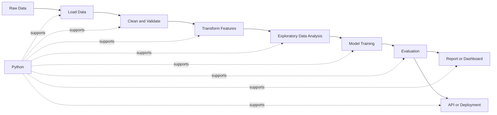
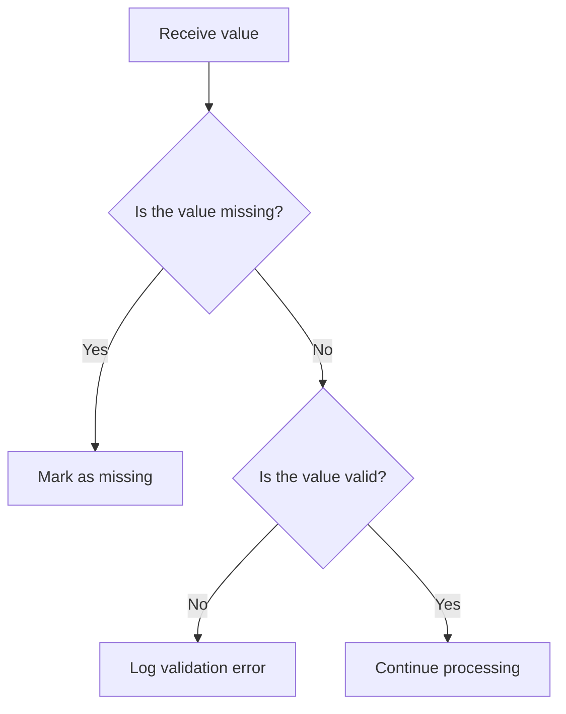
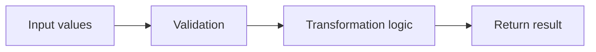
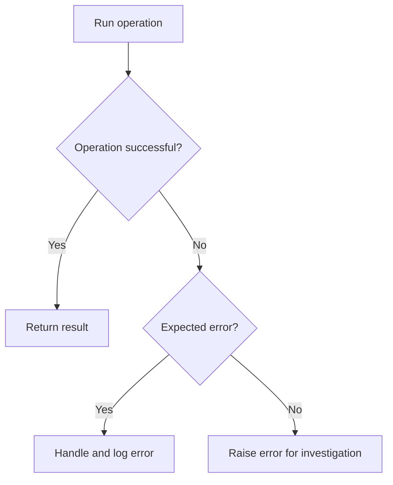
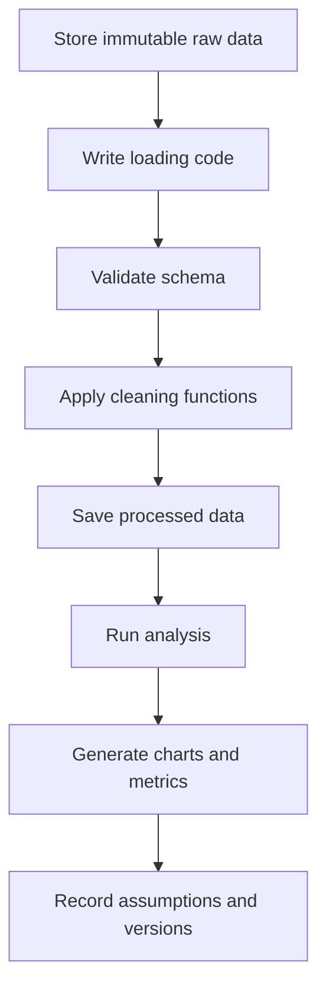
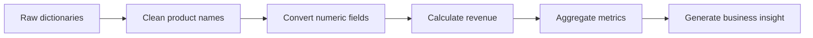
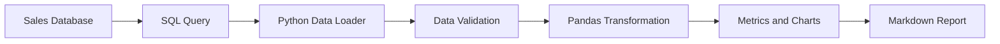

# 001 - Python Foundation

**Course:** 02 - Coding and EDA
**Module:** Module 04 - Coding for Data Science
**Content Group:** Python Foundation
**Roadmap Source:** Coding for Data Science / Python Foundation
**Lesson Type:** Coding
**Order in Module:** 001
**Suggested Duration:** 20 minutes

---

## 1. Overview

Python is one of the most widely used programming languages in data science, artificial intelligence, machine learning, automation and backend development.

In a typical data science workflow, Python is used to:

* Load data from files, databases and APIs.
* Clean and transform raw data.
* Explore datasets and calculate statistics.
* Create charts and reports.
* Train and evaluate machine learning models.
* Build reusable data pipelines.
* Deploy models through APIs or scheduled services.

Before studying advanced machine learning libraries, it is important to understand Python fundamentals such as variables, data types, control flow, functions, collections, file handling, modules and error handling.

A strong Python foundation makes data analysis code easier to understand, test, reproduce and convert from experimental notebooks into production-ready applications.

---

## 2. Learning Objectives

By the end of this lesson, you should be able to:

* Explain why Python is important for AI and data science.
* Use variables and common Python data types.
* Work with lists, tuples, sets and dictionaries.
* Write conditional statements and loops.
* Define reusable functions.
* Read and write files.
* Handle common runtime errors.
* Organize Python code into reusable modules.
* Understand how Python supports a reproducible data workflow.
* Build a small Python script for processing a dataset.

---

## 3. Python in the Data Science Workflow

Python connects most stages of a modern data science project.



A simplified workflow may look like this:

```text
Raw data
    ↓
Load with Python or SQL
    ↓
Clean and validate
    ↓
Transform into analysis-ready tables
    ↓
Explore and visualize
    ↓
Train or evaluate a model
    ↓
Generate a report, dashboard or API
```

---

## 4. Core Concepts

### 4.1 Variables

A variable stores a value that can be reused later.

```python
student_name = "Alex"
age = 21
average_score = 8.5
is_active = True
```

Python uses dynamic typing, meaning that you do not need to declare the variable type explicitly.

```python
value = 10
value = "ten"
```

Although Python allows a variable to change type, frequently changing types can make code difficult to understand.

Use clear and descriptive variable names:

```python
# Good
monthly_revenue = 12500

# Less clear
x = 12500
```

---

### 4.2 Common Data Types

Python provides several built-in data types.

| Data type  | Example    | Typical use                           |
| ---------- | ---------- | ------------------------------------- |
| `int`      | `25`       | Counts, IDs, whole numbers            |
| `float`    | `3.14`     | Measurements, probabilities, averages |
| `str`      | `"Python"` | Names, categories, text               |
| `bool`     | `True`     | Conditions and binary flags           |
| `NoneType` | `None`     | Missing or unavailable values         |

Example:

```python
product_id = 101
product_name = "Wireless Mouse"
price = 24.99
in_stock = True
discount = None
```

You can inspect a value's type with `type()`:

```python
print(type(price))
```

Output:

```text
<class 'float'>
```

---

### 4.3 Type Conversion

Data often needs to be converted from one type to another.

```python
quantity_text = "12"

quantity = int(quantity_text)
price = float("19.99")
product_code = str(1001)
```

A common data-processing problem occurs when numeric values are stored as text.

```python
revenue_text = "2500.50"
revenue = float(revenue_text)

print(revenue * 2)
```

---

### 4.4 Operators

#### Arithmetic operators

```python
a = 10
b = 3

print(a + b)   # Addition
print(a - b)   # Subtraction
print(a * b)   # Multiplication
print(a / b)   # Division
print(a // b)  # Floor division
print(a % b)   # Remainder
print(a ** b)  # Exponentiation
```

#### Comparison operators

```python
score = 85

print(score > 80)
print(score == 85)
print(score != 100)
```

#### Logical operators

```python
age = 22
has_permission = True

can_access = age >= 18 and has_permission
print(can_access)
```

---

## 5. Python Collections

Collections allow multiple values to be stored in one object.

### 5.1 Lists

A list is an ordered and mutable collection.

```python
sales = [120, 150, 90, 200]

sales.append(180)
sales.remove(90)

print(sales)
print(sales[0])
```

Lists are commonly used for:

* Rows of data.
* Feature names.
* Model predictions.
* Experiment results.
* Collections of files.

Example:

```python
daily_revenue = [1200, 1350, 1280, 1490]

average_revenue = sum(daily_revenue) / len(daily_revenue)

print(average_revenue)
```

---

### 5.2 Tuples

A tuple is ordered but immutable.

```python
coordinate = (10.5, 106.7)
image_shape = (224, 224, 3)
```

Tuples are useful when values should not be modified after creation.

```python
height, width, channels = image_shape

print(height)
print(width)
print(channels)
```

---

### 5.3 Sets

A set stores unique values.

```python
categories = {"books", "electronics", "books", "fashion"}

print(categories)
```

Output:

```text
{'books', 'electronics', 'fashion'}
```

Sets are useful for:

* Removing duplicates.
* Comparing categories.
* Finding shared values.
* Validating allowed values.

```python
expected_columns = {"customer_id", "revenue", "region"}
actual_columns = {"customer_id", "revenue", "product"}

missing_columns = expected_columns - actual_columns

print(missing_columns)
```

---

### 5.4 Dictionaries

A dictionary stores key-value pairs.

```python
customer = {
    "customer_id": 1001,
    "name": "Taylor",
    "region": "North",
    "total_spending": 850.5
}

print(customer["name"])
print(customer["total_spending"])
```

Dictionaries are commonly used for:

* Configuration settings.
* JSON data.
* API responses.
* Model parameters.
* Summary metrics.

Example:

```python
model_metrics = {
    "accuracy": 0.91,
    "precision": 0.88,
    "recall": 0.86
}

for metric_name, metric_value in model_metrics.items():
    print(f"{metric_name}: {metric_value:.2f}")
```

---

## 6. Conditional Statements

Conditional statements allow a program to make decisions.

```python
score = 82

if score >= 90:
    grade = "A"
elif score >= 80:
    grade = "B"
elif score >= 70:
    grade = "C"
else:
    grade = "D"

print(grade)
```

### Data validation example

```python
revenue = -200

if revenue < 0:
    print("Warning: revenue cannot be negative.")
else:
    print("Revenue value is valid.")
```

Decision flow:



---

## 7. Loops

Loops repeat operations over a collection of values.

### 7.1 `for` loop

```python
sales = [120, 150, 90, 200]

for value in sales:
    print(value)
```

Example with transformation:

```python
prices = [10, 20, 30]
tax_rate = 0.1

final_prices = []

for price in prices:
    final_price = price * (1 + tax_rate)
    final_prices.append(final_price)

print(final_prices)
```

---

### 7.2 `while` loop

A `while` loop continues while a condition remains true.

```python
attempt = 1

while attempt <= 3:
    print(f"Processing attempt {attempt}")
    attempt += 1
```

Be careful to ensure that the loop condition eventually becomes false.

```python
# Dangerous: this loop never stops.
# while True:
#     print("Running forever")
```

---

### 7.3 List comprehensions

List comprehensions provide a concise way to build lists.

```python
numbers = [1, 2, 3, 4, 5]

squared_numbers = [number**2 for number in numbers]

print(squared_numbers)
```

Filtering example:

```python
sales = [120, 50, 180, 30, 220]

high_sales = [value for value in sales if value >= 100]

print(high_sales)
```

Use list comprehensions for simple transformations. For complicated logic, a regular loop is usually easier to read.

---

## 8. Functions

Functions group reusable logic into named blocks.

```python
def calculate_average(values):
    return sum(values) / len(values)


scores = [80, 90, 75, 95]

average_score = calculate_average(scores)

print(average_score)
```

### Function with validation

```python
def calculate_average(values):
    if not values:
        raise ValueError("The values list cannot be empty.")

    return sum(values) / len(values)
```

### Function with type hints

```python
def calculate_revenue(
    quantity: int,
    unit_price: float,
    discount_rate: float = 0.0
) -> float:
    gross_revenue = quantity * unit_price
    discount = gross_revenue * discount_rate

    return gross_revenue - discount
```

Usage:

```python
revenue = calculate_revenue(
    quantity=10,
    unit_price=25.0,
    discount_rate=0.1
)

print(revenue)
```

### Why functions matter

Functions help you:

* Avoid duplicated code.
* Separate responsibilities.
* Test logic independently.
* Make notebooks easier to maintain.
* Convert notebook code into reusable scripts.
* Build reliable data pipelines.

A useful function should usually perform one clear responsibility.



---

## 9. Strings and Text Processing

Text processing is common when cleaning names, categories, addresses and user-generated content.

```python
product_name = "  Wireless Mouse  "

clean_name = product_name.strip().lower()

print(clean_name)
```

Output:

```text
wireless mouse
```

Useful string methods include:

```python
text = "Data Science with Python"

print(text.lower())
print(text.upper())
print(text.replace("Python", "Pandas"))
print(text.split())
print(text.startswith("Data"))
```

### Formatted strings

Use f-strings to insert values into text.

```python
customer_name = "Alex"
total_spending = 845.5

message = f"{customer_name} spent ${total_spending:.2f}."

print(message)
```

---

## 10. File Handling

Python can read and write text files using `open()`.

### Reading a file

```python
with open("notes.txt", "r", encoding="utf-8") as file:
    content = file.read()

print(content)
```

### Writing a file

```python
report = "Total sales: 1,250 units"

with open("report.txt", "w", encoding="utf-8") as file:
    file.write(report)
```

The `with` statement automatically closes the file after the operation finishes.

### Reading a CSV file with the standard library

```python
import csv

with open("sales.csv", "r", encoding="utf-8") as file:
    reader = csv.DictReader(file)

    for row in reader:
        print(row)
```

For larger data analysis tasks, CSV files are commonly loaded with Pandas:

```python
import pandas as pd

data = pd.read_csv("sales.csv")

print(data.head())
```

---

## 11. Error Handling

Errors are normal in data workflows because files may be missing, values may have incorrect formats and external services may fail.

Use `try` and `except` to handle expected failures.

```python
raw_value = "unknown"

try:
    numeric_value = float(raw_value)
except ValueError:
    numeric_value = None
    print("The value could not be converted to a number.")
```

### File error example

```python
try:
    with open("sales.csv", "r", encoding="utf-8") as file:
        content = file.read()
except FileNotFoundError:
    print("The sales file was not found.")
```

### Multiple exception types

```python
def divide_values(numerator, denominator):
    try:
        return float(numerator) / float(denominator)
    except ValueError:
        print("Both values must be numeric.")
    except ZeroDivisionError:
        print("The denominator cannot be zero.")

    return None
```

### Recommended error-handling flow



Do not silently ignore every exception.

```python
# Avoid this pattern.
try:
    value = int("invalid")
except Exception:
    pass
```

Silent failures make data quality problems difficult to detect.

---

## 12. Modules and Imports

A module is a Python file containing reusable functions, classes or variables.

Suppose the following function is saved in `metrics.py`:

```python
def calculate_average(values):
    if not values:
        raise ValueError("Values cannot be empty.")

    return sum(values) / len(values)
```

You can import it into another file:

```python
from metrics import calculate_average

scores = [80, 90, 85]

print(calculate_average(scores))
```

Common standard-library imports include:

```python
from pathlib import Path
from datetime import datetime
import json
import csv
import statistics
```

Common data science libraries include:

```python
import numpy as np
import pandas as pd
import matplotlib.pyplot as plt
```

---

## 13. Basic Object-Oriented Programming

A class defines a reusable object with data and behavior.

```python
class DatasetReport:
    def __init__(self, dataset_name, row_count):
        self.dataset_name = dataset_name
        self.row_count = row_count

    def display_summary(self):
        print(
            f"Dataset '{self.dataset_name}' "
            f"contains {self.row_count} rows."
        )
```

Usage:

```python
report = DatasetReport(
    dataset_name="sales.csv",
    row_count=1500
)

report.display_summary()
```

Object-oriented programming becomes useful when building:

* Data loaders.
* Feature transformers.
* Model wrappers.
* API services.
* Pipeline components.
* Experiment tracking systems.

For small analysis scripts, functions and dictionaries are often sufficient.

---

## 14. Writing Clean Python Code

Readable code is especially important in collaborative data science projects.

### Use descriptive names

```python
# Avoid
x = sum(a) / len(a)

# Better
average_revenue = sum(monthly_revenue) / len(monthly_revenue)
```

### Keep functions focused

```python
def clean_product_name(name: str) -> str:
    return name.strip().lower()
```

### Avoid repeated values

```python
TAX_RATE = 0.1

final_price = product_price * (1 + TAX_RATE)
```

### Add docstrings

```python
def calculate_growth_rate(
    current_value: float,
    previous_value: float
) -> float:
    """
    Calculate the percentage growth between two values.

    Args:
        current_value: Value from the current period.
        previous_value: Value from the previous period.

    Returns:
        Growth rate expressed as a decimal.

    Raises:
        ValueError: If previous_value is zero.
    """
    if previous_value == 0:
        raise ValueError("Previous value cannot be zero.")

    return (current_value - previous_value) / previous_value
```

### Follow a predictable structure

```text
1. Imports
2. Configuration
3. Helper functions
4. Data loading
5. Data validation
6. Transformation
7. Analysis
8. Output generation
```

---

## 15. Reproducible Python Workflow

A reproducible workflow allows another person to rerun the analysis and obtain the same result.



A recommended project structure is:

```text
python-foundation-project/
├── data/
│   ├── raw/
│   │   └── sales.csv
│   └── processed/
│       └── clean_sales.csv
├── notebooks/
│   └── sales_analysis.ipynb
├── src/
│   ├── data_loader.py
│   ├── cleaning.py
│   └── metrics.py
├── reports/
│   ├── figures/
│   └── summary.md
├── requirements.txt
└── README.md
```

Important principles:

* Do not modify the original raw data manually.
* Store data-cleaning logic in code.
* Record assumptions and transformations.
* Use Git to track code changes.
* Keep dependencies in a requirements file.
* Use fixed random seeds when randomness is involved.
* Separate reusable code from notebook presentation.

---

## 16. Practical Demo: Processing Sales Records

Consider the following raw sales records:

```python
sales_records = [
    {
        "product": " Laptop ",
        "quantity": "2",
        "unit_price": "1200.00"
    },
    {
        "product": "Mouse",
        "quantity": "5",
        "unit_price": "25.50"
    },
    {
        "product": "KEYBOARD ",
        "quantity": "3",
        "unit_price": "75.00"
    }
]
```

### Step 1: Create a cleaning function

```python
def clean_sales_record(record: dict) -> dict:
    product = record["product"].strip().lower()
    quantity = int(record["quantity"])
    unit_price = float(record["unit_price"])
    revenue = quantity * unit_price

    return {
        "product": product,
        "quantity": quantity,
        "unit_price": unit_price,
        "revenue": revenue
    }
```

### Step 2: Clean every record

```python
clean_records = [
    clean_sales_record(record)
    for record in sales_records
]

for record in clean_records:
    print(record)
```

Output:

```text
{'product': 'laptop', 'quantity': 2, 'unit_price': 1200.0, 'revenue': 2400.0}
{'product': 'mouse', 'quantity': 5, 'unit_price': 25.5, 'revenue': 127.5}
{'product': 'keyboard', 'quantity': 3, 'unit_price': 75.0, 'revenue': 225.0}
```

### Step 3: Calculate summary metrics

```python
total_revenue = sum(
    record["revenue"]
    for record in clean_records
)

total_quantity = sum(
    record["quantity"]
    for record in clean_records
)

average_order_revenue = total_revenue / len(clean_records)

print(f"Total quantity: {total_quantity}")
print(f"Total revenue: ${total_revenue:,.2f}")
print(f"Average record revenue: ${average_order_revenue:,.2f}")
```

### Step 4: Find the highest-revenue product

```python
top_product = max(
    clean_records,
    key=lambda record: record["revenue"]
)

print(
    f"Top product: {top_product['product']} "
    f"with ${top_product['revenue']:,.2f} in revenue."
)
```

### Processing pipeline



---

## 17. From Notebook to Reusable Script

Notebooks are useful for experimentation, but important logic should eventually be moved into functions or Python modules.

### Notebook-only approach

```python
data["revenue"] = data["quantity"] * data["unit_price"]
data["product"] = data["product"].str.strip().str.lower()
```

### Reusable approach

```python
def prepare_sales_data(data):
    cleaned_data = data.copy()

    cleaned_data["product"] = (
        cleaned_data["product"]
        .str.strip()
        .str.lower()
    )

    cleaned_data["revenue"] = (
        cleaned_data["quantity"]
        * cleaned_data["unit_price"]
    )

    return cleaned_data
```

Benefits of reusable functions:

* Easier testing.
* Less duplicated code.
* Consistent transformations.
* Simpler production deployment.
* Easier collaboration.
* Better debugging.

---

## 18. Common Mistakes

### 18.1 Performing manual transformations

**Problem:** Data is edited manually in a spreadsheet before analysis.

**Why it matters:** Other people cannot reproduce the same transformation.

**Better approach:** Write the cleaning steps in Python.

```python
data["product"] = data["product"].str.strip().str.lower()
```

---

### 18.2 Overwriting raw data

**Problem:** The original file is replaced with the cleaned version.

**Why it matters:** Mistakes cannot be investigated or reversed.

**Better approach:**

```text
data/raw/sales.csv
data/processed/clean_sales.csv
```

---

### 18.3 Writing one long notebook cell

**Problem:** Loading, cleaning, analysis and visualization are mixed together.

**Better approach:** Separate the workflow into functions or logical notebook sections.

```text
Load → Validate → Clean → Transform → Analyze → Visualize
```

---

### 18.4 Using unclear variable names

```python
# Difficult to understand
a = [10, 20, 30]
b = sum(a) / len(a)
```

```python
# Clearer
monthly_sales = [10, 20, 30]
average_monthly_sales = sum(monthly_sales) / len(monthly_sales)
```

---

### 18.5 Ignoring invalid values

```python
quantity = int(raw_quantity)
```

This will fail if `raw_quantity` contains invalid text.

A safer approach is:

```python
try:
    quantity = int(raw_quantity)
except ValueError:
    quantity = None
```

---

### 18.6 Catching every exception

```python
try:
    process_data()
except Exception:
    pass
```

This hides programming errors and data-quality problems.

Catch only errors that you understand and know how to handle.

---

### 18.7 Creating charts without insights

A chart is not the final conclusion.

Instead of writing:

> The chart shows monthly sales.

Write:

> Sales increased by 28% from January to March, with the strongest growth occurring in the electronics category. Inventory planning should prioritize this category before the next campaign.

---

### 18.8 Mixing configuration with code

Avoid scattering file paths and thresholds throughout a script.

```python
RAW_DATA_PATH = "data/raw/sales.csv"
PROCESSED_DATA_PATH = "data/processed/clean_sales.csv"
MINIMUM_VALID_REVENUE = 0
```

---

## 19. Best Practices

* Use descriptive variable and function names.
* Keep raw and processed data separate.
* Break long operations into small functions.
* Validate input data before analysis.
* Use type hints for reusable code.
* Handle expected errors explicitly.
* Avoid hidden manual transformations.
* Write comments that explain why, not what.
* Save dependencies in `requirements.txt` or `pyproject.toml`.
* Use Git to track code and documentation.
* Keep secrets and credentials outside source code.
* Record assumptions and known data limitations.
* Move reusable logic from notebooks into Python modules.
* Test important functions with normal and edge-case inputs.

---

## 20. Practical Exercise

Choose a small CSV dataset containing sales, customers, products or transactions.

Create a notebook or Python script that performs the following tasks.

### Part 1: Load the dataset

```python
import pandas as pd

data = pd.read_csv("data/raw/sales.csv")

print(data.head())
```

### Part 2: Inspect the dataset

Check:

* Number of rows and columns.
* Column names.
* Data types.
* Missing values.
* Duplicate records.
* Invalid numeric values.

```python
print(data.shape)
print(data.columns)
print(data.dtypes)
print(data.isna().sum())
print(data.duplicated().sum())
```

### Part 3: Clean the data

Possible cleaning operations include:

* Standardizing column names.
* Removing duplicate rows.
* Converting numeric columns.
* Cleaning category labels.
* Handling missing values.
* Removing impossible values.

```python
data.columns = [
    column.strip().lower().replace(" ", "_")
    for column in data.columns
]

data = data.drop_duplicates()
```

### Part 4: Create derived features

```python
data["revenue"] = (
    data["quantity"]
    * data["unit_price"]
)
```

### Part 5: Generate summary metrics

Calculate at least three metrics, such as:

* Total revenue.
* Average order value.
* Number of unique customers.
* Revenue by category.
* Best-performing product.
* Monthly growth rate.

### Part 6: Produce three insights

Each insight should contain:

1. A measurable observation.
2. Supporting evidence.
3. A possible interpretation.
4. A recommendation or next analytical question.

Example:

> The North region generated 42% of total revenue despite containing only 28% of all transactions. This may indicate higher-value customers or a stronger product mix in that region. The next analysis should compare average order value and product categories across regions.

### Part 7: Save the result

```python
data.to_csv(
    "data/processed/clean_sales.csv",
    index=False
)
```

---

## 21. Mini Challenge

Write a function that calculates summary statistics for a list of numeric values.

The function should return:

* Count.
* Minimum.
* Maximum.
* Total.
* Mean.

Expected interface:

```python
def summarize_values(values: list[float]) -> dict:
    pass
```

Example output:

```python
{
    "count": 4,
    "minimum": 10,
    "maximum": 40,
    "total": 100,
    "mean": 25
}
```

Possible solution:

```python
def summarize_values(values: list[float]) -> dict:
    if not values:
        raise ValueError("The values list cannot be empty.")

    return {
        "count": len(values),
        "minimum": min(values),
        "maximum": max(values),
        "total": sum(values),
        "mean": sum(values) / len(values)
    }
```

Test the function:

```python
result = summarize_values([10, 20, 30, 40])

print(result)
```

---

## 22. Completion Checklist

* [ ] I can explain why Python is important for AI and data science.
* [ ] I understand variables and common built-in data types.
* [ ] I can use lists, tuples, sets and dictionaries.
* [ ] I can write conditional statements and loops.
* [ ] I can create reusable functions.
* [ ] I can read and write files.
* [ ] I can handle expected errors using `try` and `except`.
* [ ] I understand how modules help organize reusable code.
* [ ] I can convert raw values into appropriate data types.
* [ ] I can build a small reproducible data-processing workflow.
* [ ] I keep raw and processed data separate.
* [ ] I can produce at least three evidence-based insights.
* [ ] I have recorded at least one assumption, limitation or follow-up question.

---

## 23. Related Outcome

Use Python, SQL, data libraries, notebooks and Git to build reproducible data workflows.

After completing this lesson, you should be prepared to study:

* NumPy fundamentals.
* Pandas fundamentals.
* Data cleaning.
* Exploratory data analysis.
* Data visualization.
* SQL integration.
* Object-oriented programming.
* Testing and debugging.
* Machine learning pipelines.
* API and model deployment.

---

## 24. Related Project

### Mini Project: SQL and Python Sales Analysis

Build a small sales-analysis workflow using a relational database and Python.

The project should include:

1. A small sales database.
2. SQL queries for extracting transactions.
3. Python code for loading query results.
4. Data cleaning and validation.
5. Pandas-based aggregations.
6. At least three charts.
7. Three business insights.
8. A reproducible project structure.
9. A README explaining how to run the analysis.
10. A final Markdown, HTML or PDF report.

Suggested workflow:



Possible portfolio artifacts:

* Jupyter Notebook.
* Python package.
* SQL query file.
* Cleaned dataset.
* Business report.
* Interactive dashboard.
* REST API.
* Dockerized analysis service.

---

## 25. Summary

Python is a foundational tool for AI and data science because it supports the entire workflow from raw data ingestion to analysis, modeling and deployment.

The most important early skills are:

* Working with variables and data types.
* Using Python collections.
* Writing conditions and loops.
* Creating reusable functions.
* Reading and writing files.
* Handling errors safely.
* Organizing code into modules.
* Building reproducible workflows.

Do not treat Python as only a syntax-learning subject. Convert each concept into a practical artifact such as:

* A notebook.
* A data-cleaning script.
* A reusable function library.
* A chart and insight report.
* A database analysis.
* A small API.
* A Docker service.
* A portfolio project.

A strong Python foundation makes every later topic in data science, machine learning and AI easier to learn, debug and deploy.
