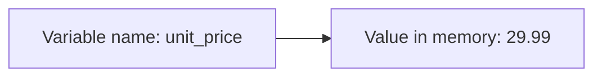
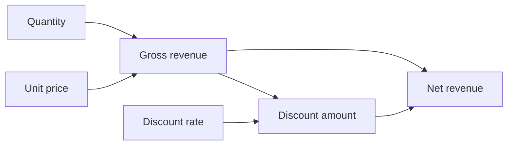
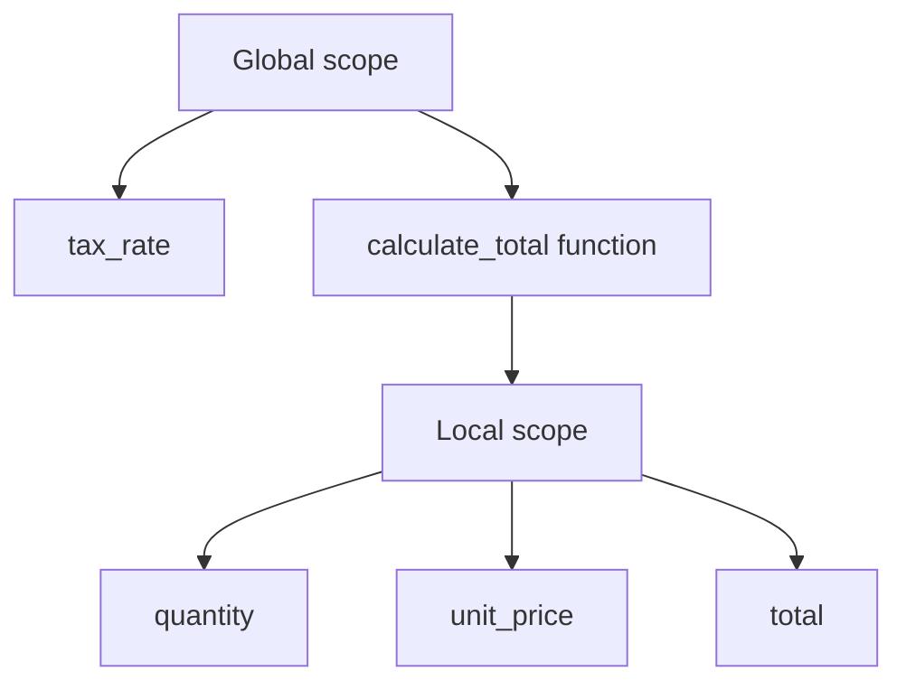
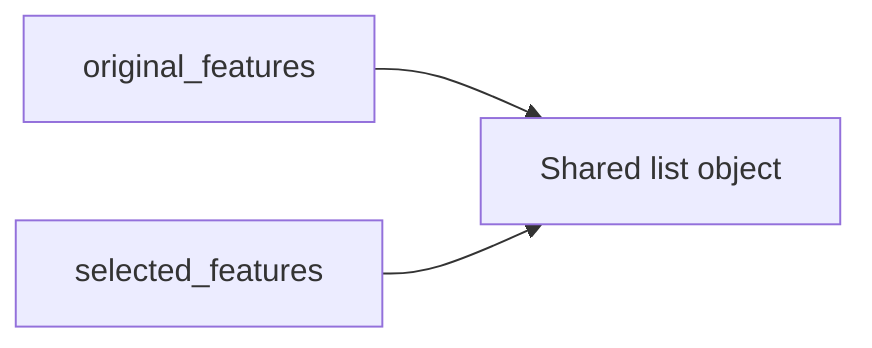
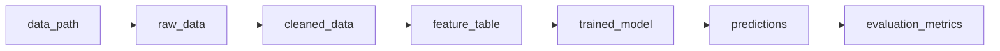
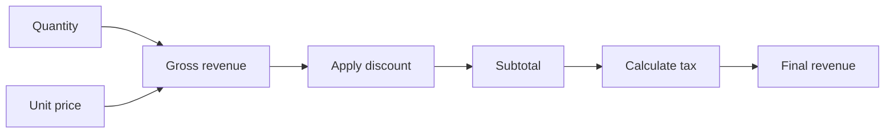
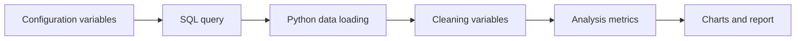

# 002 - Variables

**Course:** 02 - Coding and EDA
**Module:** Module 04 - Coding for Data Science
**Content Group:** Python Foundation
**Roadmap Source:** Coding for Data Science / Python Foundation
**Lesson Type:** Coding
**Order in Module:** 002
**Suggested Duration:** 20 minutes

---

## 1. Overview

A **variable** is a named reference to a value stored in memory.

Variables allow a Python program to store, reuse and update information during execution. In data science, variables may represent:

* File paths.
* Dataset names.
* Numerical measurements.
* Model parameters.
* Evaluation metrics.
* Configuration values.
* Intermediate transformation results.
* User input.
* API responses.

For example:

```python
dataset_name = "sales_data"
row_count = 1500
average_revenue = 245.75
model_is_ready = True
```

Instead of repeating values throughout a notebook or script, variables give those values meaningful names.

```python
tax_rate = 0.1
product_price = 200

final_price = product_price * (1 + tax_rate)

print(final_price)
```

Clear variable names make data workflows easier to read, debug, maintain and convert from notebooks into reusable scripts, pipelines or APIs.

---

## 2. Learning Objectives

By the end of this lesson, you should be able to:

* Explain what a variable is in Python.
* Assign values to variables.
* Follow Python variable-naming rules.
* Choose descriptive variable names.
* Understand dynamic typing.
* Inspect the type of a variable.
* Update and reuse variable values.
* Assign multiple variables in one statement.
* Distinguish variables from constants.
* Avoid common variable-related errors.
* Use variables in a small data-processing workflow.

---

## 3. What Is a Variable?

A variable connects a meaningful name to a value.

```python
customer_name = "Alex"
order_quantity = 5
unit_price = 29.99
```

The assignment operator `=` stores the value on the right under the name on the left.

```text
variable_name = value
```

Conceptually:



The expression below does not mean mathematical equality. It means:

> Assign the value `29.99` to the variable `unit_price`.

```python
unit_price = 29.99
```

---

## 4. Creating Variables

Python variables are created when a value is assigned to them.

```python
course_name = "Python Foundation"
lesson_number = 2
duration_minutes = 20
is_completed = False
```

Python does not require an explicit type declaration.

```python
score = 85
```

In some other programming languages, the type may need to be declared first. Python determines the type from the assigned value.

---

## 5. Common Variable Types

Variables can store different kinds of values.

| Type       | Example              | Data science use                  |
| ---------- | -------------------- | --------------------------------- |
| `int`      | `120`                | Counts, IDs and epochs            |
| `float`    | `0.92`               | Metrics, prices and probabilities |
| `str`      | `"sales.csv"`        | File names, labels and text       |
| `bool`     | `True`               | Flags and conditions              |
| `NoneType` | `None`               | Missing or unavailable values     |
| `list`     | `[10, 20, 30]`       | Collections of observations       |
| `dict`     | `{"accuracy": 0.91}` | Configurations and metrics        |

Example:

```python
experiment_name = "baseline_model"
training_epochs = 20
learning_rate = 0.001
use_early_stopping = True
validation_score = None
feature_names = ["age", "income", "region"]
model_metrics = {
    "accuracy": 0.91,
    "precision": 0.88
}
```

---

## 6. Inspecting a Variable's Type

Use the built-in `type()` function to inspect a variable.

```python
row_count = 1500
average_value = 42.5
dataset_name = "sales"
is_valid = True

print(type(row_count))
print(type(average_value))
print(type(dataset_name))
print(type(is_valid))
```

Output:

```text
<class 'int'>
<class 'float'>
<class 'str'>
<class 'bool'>
```

The `type()` function is useful when:

* Reading unfamiliar code.
* Debugging conversion errors.
* Validating API responses.
* Inspecting imported CSV values.
* Checking intermediate transformation results.

---

## 7. Python Is Dynamically Typed

Python is a dynamically typed language. A variable can refer to values of different types at different times.

```python
result = 100
print(type(result))

result = "completed"
print(type(result))
```

Output:

```text
<class 'int'>
<class 'str'>
```

Although Python allows this, frequently changing a variable's type can make code confusing.

Avoid:

```python
data = 100
data = "sales.csv"
data = [10, 20, 30]
```

Prefer clear variables with consistent purposes:

```python
row_count = 100
data_path = "sales.csv"
sales_values = [10, 20, 30]
```

---

## 8. Variable Naming Rules

A Python variable name:

* May contain letters, numbers and underscores.
* Cannot begin with a number.
* Cannot contain spaces.
* Cannot contain characters such as `-`, `@` or `#`.
* Cannot use a reserved Python keyword.
* Is case-sensitive.

Valid names:

```python
sales
sales_2026
monthly_revenue
customer_id
_model_version
```

Invalid names:

```python
# 2026_sales = 100
# monthly-revenue = 5000
# customer id = 101
# class = "premium"
```

Python is case-sensitive:

```python
revenue = 1000
Revenue = 2000

print(revenue)
print(Revenue)
```

These are two different variables.

---

## 9. Python Naming Conventions

Python commonly uses `snake_case` for variable names.

```python
customer_name = "Taylor"
monthly_revenue = 12500
training_dataset_path = "data/train.csv"
```

Use uppercase names for constants:

```python
MAX_RETRIES = 3
DEFAULT_BATCH_SIZE = 32
TAX_RATE = 0.1
```

Python does not technically prevent constants from being changed. Uppercase naming communicates that the value should remain unchanged.

```python
DEFAULT_LEARNING_RATE = 0.001
```

---

## 10. Choosing Meaningful Names

Variable names should describe what the value represents.

Avoid vague names:

```python
x = 1500
a = 0.92
temp = "sales.csv"
```

Prefer descriptive names:

```python
row_count = 1500
validation_accuracy = 0.92
sales_file_path = "sales.csv"
```

A good variable name reduces the need for comments.

Less clear:

```python
x = sum(v) / len(v)
```

Clearer:

```python
average_revenue = sum(monthly_revenue) / len(monthly_revenue)
```

### Naming comparison

| Weak name | Better name             |
| --------- | ----------------------- |
| `x`       | `customer_age`          |
| `d`       | `sales_dataframe`       |
| `res`     | `prediction_result`     |
| `n`       | `number_of_rows`        |
| `tmp`     | `cleaned_customer_name` |
| `val`     | `validation_accuracy`   |

Short names may be acceptable for small local contexts, such as coordinates or simple loops:

```python
for i in range(5):
    print(i)
```

For important business or analytical values, prefer descriptive names.

---

## 11. Updating Variable Values

A variable can be updated after it has been created.

```python
total_revenue = 1000
total_revenue = 1250

print(total_revenue)
```

The new value replaces the previous reference.

Variables can also be updated using their current values.

```python
total_revenue = 1000
new_order_revenue = 250

total_revenue = total_revenue + new_order_revenue

print(total_revenue)
```

Output:

```text
1250
```

Python provides augmented assignment operators.

```python
total_revenue += 250
total_revenue -= 100
total_revenue *= 1.1
total_revenue /= 2
```

Common operators:

| Operator | Equivalent form |
| -------- | --------------- |
| `x += 1` | `x = x + 1`     |
| `x -= 1` | `x = x - 1`     |
| `x *= 2` | `x = x * 2`     |
| `x /= 2` | `x = x / 2`     |

---

## 12. Multiple Assignment

Python allows multiple variables to be assigned in one statement.

```python
customer_name, customer_age, customer_region = (
    "Alex",
    25,
    "North"
)
```

This is equivalent to:

```python
customer_name = "Alex"
customer_age = 25
customer_region = "North"
```

The number of variables must match the number of values.

```python
latitude, longitude = 10.8231, 106.6297
```

### Assigning the same value

```python
train_loss = validation_loss = test_loss = 0.0
```

### Swapping variables

Python can swap two values without a temporary variable.

```python
minimum_value = 100
maximum_value = 10

minimum_value, maximum_value = maximum_value, minimum_value

print(minimum_value)
print(maximum_value)
```

---

## 13. Unpacking Collections

Values from lists and tuples can be assigned to separate variables.

```python
image_shape = (224, 224, 3)

height, width, channels = image_shape

print(height)
print(width)
print(channels)
```

Output:

```text
224
224
3
```

Use `*` to collect remaining values.

```python
metrics = [0.91, 0.88, 0.86, 0.84]

accuracy, *other_metrics = metrics

print(accuracy)
print(other_metrics)
```

Output:

```text
0.91
[0.88, 0.86, 0.84]
```

Another example:

```python
first_value, *middle_values, last_value = [10, 20, 30, 40, 50]

print(first_value)
print(middle_values)
print(last_value)
```

---

## 14. Variables and Expressions

Variables can be used inside expressions.

```python
quantity = 5
unit_price = 25.0
discount_rate = 0.1

gross_revenue = quantity * unit_price
discount_amount = gross_revenue * discount_rate
net_revenue = gross_revenue - discount_amount

print(net_revenue)
```

Calculation flow:



This structure is easier to understand than placing the entire calculation in one expression.

Less readable:

```python
result = 5 * 25.0 - 5 * 25.0 * 0.1
```

More readable:

```python
quantity = 5
unit_price = 25.0
discount_rate = 0.1

gross_revenue = quantity * unit_price
net_revenue = gross_revenue * (1 - discount_rate)
```

---

## 15. Variables and User Input

The `input()` function reads text entered by a user.

```python
customer_name = input("Enter the customer name: ")

print(f"Welcome, {customer_name}!")
```

Values returned by `input()` are strings.

```python
quantity_text = input("Enter quantity: ")

print(type(quantity_text))
```

To perform numerical calculations, convert the input:

```python
quantity = int(input("Enter quantity: "))
unit_price = float(input("Enter unit price: "))

total_price = quantity * unit_price

print(f"Total price: ${total_price:.2f}")
```

A safer version handles invalid input:

```python
try:
    quantity = int(input("Enter quantity: "))
except ValueError:
    quantity = 0
    print("Invalid quantity. Using 0 instead.")
```

---

## 16. Variables and Missing Values

Python uses `None` to represent the absence of a value.

```python
validation_score = None
```

Check for `None` using `is`:

```python
if validation_score is None:
    print("The model has not been evaluated.")
```

Avoid:

```python
if validation_score == None:
    print("The model has not been evaluated.")
```

Preferred:

```python
if validation_score is None:
    print("The model has not been evaluated.")
```

In Pandas, missing values may appear as `NaN`, which is different from ordinary Python `None`.

```python
import pandas as pd

missing_value = pd.NA
```

---

## 17. Variable Scope

A variable's scope determines where it can be accessed.

### Global variable

A variable created outside a function is available in the module.

```python
tax_rate = 0.1

def calculate_tax(price):
    return price * tax_rate
```

### Local variable

A variable created inside a function is normally available only within that function.

```python
def calculate_total(quantity, unit_price):
    total = quantity * unit_price
    return total
```

The variable `total` cannot be accessed outside the function.

```python
result = calculate_total(3, 25)

print(result)

# print(total) would raise NameError.
```

Scope diagram:



Prefer passing values into functions rather than depending heavily on global variables.

Less reusable:

```python
tax_rate = 0.1
price = 100

def calculate_final_price():
    return price * (1 + tax_rate)
```

More reusable:

```python
def calculate_final_price(
    price: float,
    tax_rate: float
) -> float:
    return price * (1 + tax_rate)
```

---

## 18. Mutable and Immutable Values

Variables store references to objects. The behavior of an object depends on whether it is mutable or immutable.

### Immutable types

Common immutable types include:

* Integers.
* Floats.
* Strings.
* Booleans.
* Tuples.

```python
score = 80
updated_score = score

updated_score += 10

print(score)
print(updated_score)
```

Output:

```text
80
90
```

### Mutable types

Common mutable types include:

* Lists.
* Dictionaries.
* Sets.

```python
original_features = ["age", "income"]
selected_features = original_features

selected_features.append("region")

print(original_features)
```

Output:

```text
['age', 'income', 'region']
```

Both variables refer to the same list.

Conceptually:



Create a copy when the original list must remain unchanged.

```python
original_features = ["age", "income"]
selected_features = original_features.copy()

selected_features.append("region")

print(original_features)
print(selected_features)
```

Output:

```text
['age', 'income']
['age', 'income', 'region']
```

This behavior is important when working with:

* Feature lists.
* Configuration dictionaries.
* Nested records.
* Data transformation functions.
* Machine learning parameters.

---

## 19. Type Hints

Type hints document the expected type of a variable.

```python
dataset_name: str = "sales"
row_count: int = 1500
average_revenue: float = 245.75
is_valid: bool = True
```

Type hints do not normally prevent another type from being assigned at runtime.

```python
row_count: int = 1500
row_count = "unknown"
```

However, tools such as editors, linters and static type checkers can detect potential inconsistencies.

Type hints are particularly useful in functions:

```python
def calculate_revenue(
    quantity: int,
    unit_price: float
) -> float:
    return quantity * unit_price
```

---

## 20. Variables in a Data Science Workflow

Variables connect the individual stages of a data workflow.



Example:

```python
from pathlib import Path

data_path = Path("data/raw/sales.csv")
output_path = Path("data/processed/clean_sales.csv")

minimum_valid_quantity = 1
maximum_valid_discount = 0.5
```

Later in the workflow:

```python
import pandas as pd

raw_data = pd.read_csv(data_path)

valid_data = raw_data[
    raw_data["quantity"] >= minimum_valid_quantity
].copy()

valid_data.to_csv(output_path, index=False)
```

Well-named variables make the relationship between workflow stages clear.

---

## 21. Practical Demo: Sales Variables

### Step 1: Define input variables

```python
product_name = "Wireless Keyboard"
quantity = 4
unit_price = 75.0
discount_rate = 0.1
tax_rate = 0.08
```

### Step 2: Calculate intermediate values

```python
gross_revenue = quantity * unit_price
discount_amount = gross_revenue * discount_rate
subtotal = gross_revenue - discount_amount
tax_amount = subtotal * tax_rate
final_revenue = subtotal + tax_amount
```

### Step 3: Display the result

```python
print(f"Product: {product_name}")
print(f"Gross revenue: ${gross_revenue:.2f}")
print(f"Discount: ${discount_amount:.2f}")
print(f"Tax: ${tax_amount:.2f}")
print(f"Final revenue: ${final_revenue:.2f}")
```

Output:

```text
Product: Wireless Keyboard
Gross revenue: $300.00
Discount: $30.00
Tax: $21.60
Final revenue: $291.60
```

### Calculation pipeline



---

## 22. Practical Demo: Model Configuration

Variables are also used to configure machine learning experiments.

```python
experiment_name = "customer_churn_baseline"
random_seed = 42
test_size = 0.2
learning_rate = 0.001
batch_size = 32
number_of_epochs = 20
```

These values can be stored in a dictionary:

```python
experiment_config = {
    "experiment_name": experiment_name,
    "random_seed": random_seed,
    "test_size": test_size,
    "learning_rate": learning_rate,
    "batch_size": batch_size,
    "number_of_epochs": number_of_epochs
}
```

Using named configuration variables makes experiments easier to reproduce.

```python
print(
    f"Running {experiment_name} "
    f"with learning rate {learning_rate}"
)
```

---

## 23. Environment Variables

Sensitive or environment-specific values should not be written directly into source code.

Avoid:

```python
database_password = "my-secret-password"
```

Use environment variables instead:

```python
import os

database_url = os.getenv("DATABASE_URL")
api_key = os.getenv("API_KEY")
```

Environment variables are commonly used for:

* API keys.
* Database credentials.
* Deployment URLs.
* Cloud-service settings.
* Development and production configurations.

A default value may be provided:

```python
environment = os.getenv("APP_ENV", "development")
```

Never commit real secrets to Git.

---

## 24. Common Mistakes

### 24.1 Using a variable before assignment

```python
# print(total_revenue)
```

This produces:

```text
NameError: name 'total_revenue' is not defined
```

Define the variable first:

```python
total_revenue = 0

print(total_revenue)
```

---

### 24.2 Misspelling a variable name

```python
monthly_revenue = 5000

# print(monthly_revene)
```

Because variable names are case-sensitive and spelling-sensitive, this creates a `NameError`.

---

### 24.3 Overwriting built-in names

Avoid using names of Python built-in functions.

```python
# Avoid
list = [1, 2, 3]
sum = 100
str = "sales"
```

These assignments hide Python's built-in functions.

Prefer:

```python
sales_values = [1, 2, 3]
total_sales = 100
sales_label = "sales"
```

---

### 24.4 Reusing one variable for unrelated purposes

Avoid:

```python
result = 0.91
result = "model.pkl"
result = True
```

Prefer:

```python
validation_accuracy = 0.91
model_file_path = "model.pkl"
model_saved_successfully = True
```

---

### 24.5 Using unclear abbreviations

Avoid:

```python
trn_acc = 0.95
vl_acc = 0.91
```

Prefer:

```python
training_accuracy = 0.95
validation_accuracy = 0.91
```

Use abbreviations only when they are standard and unambiguous.

---

### 24.6 Confusing assignment and comparison

Assignment uses one equals sign:

```python
status = "completed"
```

Comparison uses two equals signs:

```python
if status == "completed":
    print("The process is finished.")
```

---

### 24.7 Accidentally sharing mutable objects

```python
original_columns = ["customer_id", "revenue"]
selected_columns = original_columns

selected_columns.append("region")
```

Both variables now contain `"region"`.

Use a copy:

```python
selected_columns = original_columns.copy()
```

---

### 24.8 Storing secrets in variables inside source code

Avoid:

```python
api_key = "real-api-key"
```

Read the value from a secure environment variable or secret-management service.

---

### 24.9 Creating too many unnecessary variables

Variables should improve readability, not add noise.

Unnecessary:

```python
number_one = 10
number_two = 20
result_one = number_one + number_two
final_result = result_one
```

Simpler:

```python
first_value = 10
second_value = 20
total_value = first_value + second_value
```

---

## 25. Best Practices

* Use descriptive `snake_case` names.
* Keep each variable focused on one purpose.
* Avoid changing a variable's type unnecessarily.
* Use uppercase names for constants.
* Do not overwrite Python built-in names.
* Use type hints in reusable code.
* Use `None` for intentionally unavailable values.
* Copy mutable collections when independent modification is required.
* Store secrets in environment variables.
* Separate configuration values from processing logic.
* Prefer intermediate variables when they improve readability.
* Delete or rename unused variables during cleanup.
* Document units in variable names when necessary.

Example with units:

```python
timeout_seconds = 30
distance_kilometers = 12.5
memory_limit_megabytes = 512
```

---

## 26. Practical Exercise

Create a Python notebook named:

```text
002_variables_practice.ipynb
```

### Exercise 1: Personal learning variables

Create variables for:

* Your name.
* Current learning topic.
* Suggested study duration.
* Completion status.
* Confidence score.

```python
student_name = "Your Name"
learning_topic = "Python Variables"
study_duration_minutes = 20
is_completed = False
confidence_score = 0.7
```

Print them using an f-string.

---

### Exercise 2: Sales calculation

Create variables for:

* Product name.
* Quantity.
* Unit price.
* Discount rate.
* Tax rate.

Calculate:

* Gross revenue.
* Discount amount.
* Subtotal.
* Tax amount.
* Final revenue.

---

### Exercise 3: Swap values

Start with:

```python
minimum_value = 100
maximum_value = 10
```

Swap the values without creating a third variable.

---

### Exercise 4: Collection unpacking

Given:

```python
model_scores = (0.94, 0.91, 0.89)
```

Assign the values to:

```python
training_score
validation_score
test_score
```

---

### Exercise 5: Mutable reference

Run the following code:

```python
original_features = ["age", "income"]
selected_features = original_features

selected_features.append("region")

print(original_features)
print(selected_features)
```

Then modify the code so that `original_features` remains unchanged.

---

### Exercise 6: Model experiment variables

Create variables for:

* Experiment name.
* Random seed.
* Learning rate.
* Batch size.
* Number of epochs.
* Validation accuracy.

Display a one-line experiment summary.

Example:

```text
Experiment baseline_v1 achieved 91.50% validation accuracy after 20 epochs.
```

---

## 27. Mini Challenge

Write a small program that calculates the percentage growth between two periods.

Required variables:

```python
previous_revenue = 10000
current_revenue = 12500
```

Formula:

```text
growth rate = (current value - previous value) / previous value
```

Possible implementation:

```python
previous_revenue = 10000
current_revenue = 12500

revenue_change = current_revenue - previous_revenue
growth_rate = revenue_change / previous_revenue
growth_percentage = growth_rate * 100

print(f"Revenue growth: {growth_percentage:.2f}%")
```

Expected output:

```text
Revenue growth: 25.00%
```

Add validation for the case where `previous_revenue` is zero.

```python
if previous_revenue == 0:
    print("Growth cannot be calculated from a zero baseline.")
else:
    growth_rate = (
        current_revenue - previous_revenue
    ) / previous_revenue

    print(f"Revenue growth: {growth_rate:.2%}")
```

---

## 28. Completion Checklist

* [ ] I can explain what a Python variable is.
* [ ] I can assign values to variables.
* [ ] I understand Python variable-naming rules.
* [ ] I can choose meaningful variable names.
* [ ] I understand that Python is dynamically typed.
* [ ] I can inspect a variable using `type()`.
* [ ] I can update a variable's value.
* [ ] I can use multiple assignment.
* [ ] I can unpack values from a list or tuple.
* [ ] I understand the difference between local and global scope.
* [ ] I understand basic mutable-reference behavior.
* [ ] I know why constants use uppercase names.
* [ ] I avoid overwriting Python built-in names.
* [ ] I store secrets outside source code.
* [ ] I have completed a small variable-based data exercise.
* [ ] I have recorded at least one assumption, limitation or follow-up question.

---

## 29. Related Outcome

Use Python, SQL, data libraries, notebooks and Git to build reproducible data workflows.

Variables support this outcome by making analytical code:

* Readable.
* Configurable.
* Reusable.
* Testable.
* Reproducible.
* Easier to convert into scripts, pipelines and APIs.

Variables appear throughout the data workflow:

```text
Data paths
    ↓
Loading configuration
    ↓
Cleaning thresholds
    ↓
Feature names
    ↓
Model parameters
    ↓
Evaluation metrics
    ↓
Output locations
```

---

## 30. Related Project

### Mini Project: SQL and Python Sales Analysis

Use variables to configure a small sales-analysis project.

Suggested configuration:

```python
DATABASE_PATH = "data/sales.db"
OUTPUT_DIRECTORY = "reports"
REPORT_NAME = "sales_summary.md"

minimum_order_value = 10.0
top_product_limit = 10
analysis_year = 2026
```

Use variables for:

* Database paths.
* SQL query parameters.
* Cleaning thresholds.
* Date filters.
* Output file names.
* Chart titles.
* Summary metrics.

Suggested workflow:



Possible project artifacts:

* Jupyter Notebook.
* Python analysis script.
* SQL query file.
* Configuration module.
* Pandas report.
* README with execution instructions.

---

## 31. Summary

Variables are one of the most fundamental concepts in Python.

They allow a program to assign meaningful names to values such as:

* Dataset paths.
* Customer information.
* Cleaning thresholds.
* Model parameters.
* Calculated metrics.
* Experiment results.
* API configurations.

The most important practices are:

* Choose descriptive names.
* Follow `snake_case` conventions.
* Keep each variable focused on one purpose.
* Avoid unnecessary type changes.
* Understand mutable object references.
* Use uppercase names for constants.
* Avoid overwriting built-in functions.
* Store sensitive values in environment variables.

In AI and data science, clear variables help transform exploratory notebook code into maintainable scripts, reproducible pipelines, APIs and production services.
