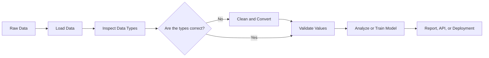
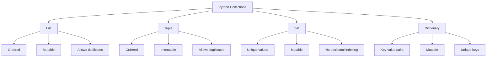
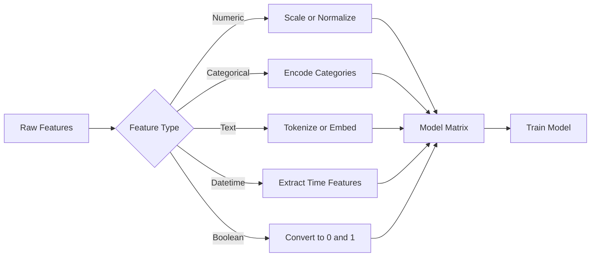
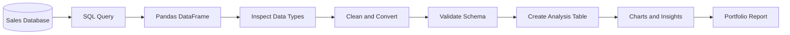

# 003 - Data Types

**Course:** 02 - Coding and EDA
**Module:** Module 04 - Coding for Data Science
**Content Group:** Python Foundation
**Roadmap Source:** Coding for Data Science / Python Foundation
**Lesson Type:** Coding
**Order in Module:** 003
**Suggested Duration:** 20 minutes

---

## 1. Overview

A **data type** describes what kind of value a variable contains and what operations can be performed on that value.

For example:

* An integer can be added or multiplied.
* A string can be joined with another string.
* A Boolean can represent a condition such as `True` or `False`.
* A list can store multiple values.
* A dictionary can represent a structured record.

In AI and Data Science, choosing the correct data type is essential because data types affect:

* Data cleaning
* Memory usage
* Mathematical operations
* Model input
* Database schemas
* API validation
* Data visualization
* Pipeline reliability

Incorrect data types can produce errors, misleading statistics, failed model training, or invalid API responses.

---

## 2. Learning Objectives

By the end of this lesson, you should be able to:

* Explain what a data type is in Python.
* Identify common built-in Python data types.
* Inspect the data type of a value using `type()`.
* Convert values from one data type to another.
* Distinguish between mutable and immutable data types.
* Select appropriate data types for data analysis tasks.
* Recognize common data type problems in real datasets.
* Apply data type validation in a reproducible data workflow.

---

## 3. Why Data Types Matter

Consider the following values:

```python
price_number = 120
price_text = "120"
```

Although they appear similar, they have different data types:

```python
print(type(price_number))
print(type(price_text))
```

Output:

```text
<class 'int'>
<class 'str'>
```

The integer can be used in mathematical operations:

```python
print(price_number + 30)
```

Output:

```text
150
```

The string is treated as text:

```python
print(price_text + "30")
```

Output:

```text
12030
```

This difference is important in Data Science. If a price column is loaded as text instead of a number, calculations such as mean, sum, and standard deviation may fail or produce incorrect results.

---

## 4. Data Type Workflow



A typical data workflow should inspect and validate data types before performing analysis or model training.

---

## 5. Common Python Data Types

Python provides several built-in data types.

| Category       | Python Type | Example          | Typical Data Science Use            |
| -------------- | ----------- | ---------------- | ----------------------------------- |
| Integer        | `int`       | `42`             | Counts, IDs, ages                   |
| Floating-point | `float`     | `3.14`           | Prices, measurements, probabilities |
| Complex number | `complex`   | `2 + 3j`         | Scientific and signal processing    |
| String         | `str`       | `"Python"`       | Names, labels, text                 |
| Boolean        | `bool`      | `True`           | Conditions, flags, filters          |
| Null value     | `NoneType`  | `None`           | Missing or unavailable values       |
| List           | `list`      | `[1, 2, 3]`      | Ordered collections                 |
| Tuple          | `tuple`     | `(1, 2)`         | Fixed ordered collections           |
| Set            | `set`       | `{1, 2, 3}`      | Unique values                       |
| Dictionary     | `dict`      | `{"name": "An"}` | Structured records and mappings     |

---

## 6. Numeric Data Types

### 6.1 Integers

An integer is a whole number without a decimal component.

```python
number_of_users = 1250
number_of_features = 20
model_version = 3

print(type(number_of_users))
```

Output:

```text
<class 'int'>
```

Common uses include:

* Number of users
* Number of transactions
* Product quantity
* Number of model features
* Loop counters

Example:

```python
successful_requests = 950
failed_requests = 50

total_requests = successful_requests + failed_requests

print(total_requests)
```

Output:

```text
1000
```

---

### 6.2 Floating-Point Numbers

A floating-point number contains a decimal component.

```python
product_price = 19.99
model_accuracy = 0.92
temperature = 28.5

print(type(model_accuracy))
```

Output:

```text
<class 'float'>
```

Common uses include:

* Measurements
* Prices
* Probabilities
* Model metrics
* Statistical results

Example:

```python
correct_predictions = 92
total_predictions = 100

accuracy = correct_predictions / total_predictions

print(accuracy)
print(type(accuracy))
```

Output:

```text
0.92
<class 'float'>
```

### Floating-Point Precision

Computers represent floating-point numbers using binary approximations.

```python
result = 0.1 + 0.2

print(result)
```

Output may be:

```text
0.30000000000000004
```

For comparisons, use a tolerance instead of exact equality:

```python
import math

result = 0.1 + 0.2

print(math.isclose(result, 0.3))
```

Output:

```text
True
```

For financial calculations that require exact decimal arithmetic, Python's `Decimal` type may be more appropriate:

```python
from decimal import Decimal

price_a = Decimal("0.1")
price_b = Decimal("0.2")

print(price_a + price_b)
```

Output:

```text
0.3
```

---

### 6.3 Complex Numbers

Complex numbers contain a real and an imaginary component.

```python
signal_value = 2 + 3j

print(type(signal_value))
print(signal_value.real)
print(signal_value.imag)
```

Complex numbers are less common in general data analysis but may appear in:

* Signal processing
* Electrical engineering
* Fourier transforms
* Scientific computing

---

## 7. Strings

A string is a sequence of characters.

```python
customer_name = "Alice"
product_category = "Electronics"
prediction_label = "Fraud"

print(type(customer_name))
```

Output:

```text
<class 'str'>
```

Strings can be defined using single or double quotation marks:

```python
language = "Python"
framework = 'FastAPI'
```

### Common String Operations

```python
text = "  Data Science with Python  "

clean_text = text.strip()
lower_text = clean_text.lower()
words = clean_text.split()

print(clean_text)
print(lower_text)
print(words)
```

Output:

```text
Data Science with Python
data science with python
['Data', 'Science', 'with', 'Python']
```

### Formatted Strings

Use f-strings to combine variables and text:

```python
model_name = "Random Forest"
accuracy = 0.91

message = f"The {model_name} model achieved an accuracy of {accuracy:.2%}."

print(message)
```

Output:

```text
The Random Forest model achieved an accuracy of 91.00%.
```

Strings are commonly used for:

* Customer names
* Product descriptions
* Categories
* Natural language data
* File paths
* Date strings
* Model labels

---

## 8. Boolean Values

A Boolean represents one of two values:

```python
True
False
```

Example:

```python
is_active = True
is_deleted = False

print(type(is_active))
```

Output:

```text
<class 'bool'>
```

Boolean values are often created by comparisons:

```python
age = 22

is_adult = age >= 18

print(is_adult)
```

Output:

```text
True
```

Booleans are widely used in filtering:

```python
price = 150
is_expensive = price > 100

if is_expensive:
    print("This product is expensive.")
```

In Data Science, Boolean values can represent:

* Fraud or non-fraud
* Churn or non-churn
* Active or inactive users
* Passed or failed validation
* Missing or available data
* Training or testing records

---

## 9. The `None` Value

`None` represents the absence of a value.

```python
prediction = None

print(type(prediction))
```

Output:

```text
<class 'NoneType'>
```

Use `is None` to check for `None`:

```python
prediction = None

if prediction is None:
    print("The model has not produced a prediction.")
```

Avoid using equality for this check:

```python
# Not recommended
prediction == None
```

Use:

```python
prediction is None
```

In data workflows, `None` may represent:

* Missing API fields
* Unavailable configuration
* A function without a result
* An uninitialized model
* Missing database values

In Pandas and NumPy, missing values may also appear as:

* `NaN`
* `pd.NA`
* `NaT`

---

## 10. Collection Data Types

Collection data types store multiple values.



---

## 11. Lists

A list is an ordered and mutable collection.

```python
scores = [85, 90, 78, 92]

print(type(scores))
print(scores[0])
```

Output:

```text
<class 'list'>
85
```

Lists allow duplicate values:

```python
labels = ["cat", "dog", "cat"]
```

Lists can also contain different data types:

```python
record = [101, "Alice", 0.95, True]
```

However, consistent types are usually easier to process in data workflows.

### Common List Operations

```python
scores = [85, 90, 78]

scores.append(92)
scores.remove(78)

print(scores)
print(len(scores))
```

Output:

```text
[85, 90, 92]
3
```

### List Comprehension

List comprehensions provide a concise way to transform values:

```python
prices = [10, 20, 30, 40]

discounted_prices = [price * 0.9 for price in prices]

print(discounted_prices)
```

Output:

```text
[9.0, 18.0, 27.0, 36.0]
```

Lists are useful for:

* Storing model predictions
* Collecting feature names
* Holding records before creating a DataFrame
* Processing batches
* Managing experiment results

---

## 12. Tuples

A tuple is an ordered but immutable collection.

```python
image_size = (224, 224)
database_position = (10, 25)

print(type(image_size))
```

Output:

```text
<class 'tuple'>
```

Tuple values cannot be changed after creation:

```python
image_size = (224, 224)

# This raises a TypeError
# image_size[0] = 256
```

Tuples are useful for values that should remain fixed:

* Image dimensions
* Geographic coordinates
* Database records
* Function return values
* Model configuration pairs

Tuple unpacking:

```python
width, height = (224, 224)

print(width)
print(height)
```

---

## 13. Sets

A set stores unique values.

```python
categories = {"food", "technology", "travel"}

print(type(categories))
```

Duplicate values are automatically removed:

```python
labels = {"cat", "dog", "cat", "bird"}

print(labels)
```

Possible output:

```text
{'cat', 'dog', 'bird'}
```

Sets are useful for:

* Finding unique categories
* Removing duplicate values
* Comparing groups
* Checking membership efficiently

Example:

```python
training_users = {1, 2, 3, 4}
testing_users = {4, 5, 6}

overlap = training_users.intersection(testing_users)

print(overlap)
```

Output:

```text
{4}
```

This example detects a user appearing in both training and testing datasets, which may indicate data leakage.

---

## 14. Dictionaries

A dictionary stores data as key-value pairs.

```python
customer = {
    "customer_id": 101,
    "name": "Alice",
    "age": 28,
    "is_active": True,
}

print(type(customer))
print(customer["name"])
```

Output:

```text
<class 'dict'>
Alice
```

Dictionaries are useful for:

* JSON objects
* API requests and responses
* Configuration files
* Database records
* Model metrics
* Feature mappings

Example model result:

```python
model_result = {
    "model": "Logistic Regression",
    "accuracy": 0.91,
    "precision": 0.88,
    "recall": 0.86,
}

print(model_result["accuracy"])
```

### Safely Accessing Dictionary Values

Direct access raises an error if the key does not exist:

```python
# May raise KeyError
# customer["email"]
```

Use `.get()` when a key is optional:

```python
email = customer.get("email", "Not provided")

print(email)
```

Output:

```text
Not provided
```

---

## 15. Inspecting Data Types

Use the `type()` function to inspect a value:

```python
values = [
    42,
    3.14,
    "Python",
    True,
    [1, 2, 3],
    {"name": "Alice"},
]

for value in values:
    print(value, type(value))
```

Use `isinstance()` when validating a value:

```python
age = 25

if isinstance(age, int):
    print("Age is a valid integer.")
```

You can check multiple possible types:

```python
price = 19.99

if isinstance(price, (int, float)):
    print("Price is numeric.")
```

`isinstance()` is usually preferred over directly comparing `type()` when subclasses may be involved.

---

## 16. Type Conversion

Type conversion changes a value from one type to another.

### String to Integer

```python
age_text = "25"
age = int(age_text)

print(age)
print(type(age))
```

### String to Float

```python
price_text = "19.99"
price = float(price_text)

print(price)
```

### Number to String

```python
customer_id = 101
customer_id_text = str(customer_id)

print(customer_id_text)
```

### List to Set

```python
categories = ["A", "B", "A", "C"]
unique_categories = set(categories)

print(unique_categories)
```

### Tuple to List

```python
dimensions = (224, 224)
editable_dimensions = list(dimensions)

editable_dimensions[0] = 256

print(editable_dimensions)
```

---

## 17. Safe Type Conversion

Not every value can be converted successfully.

```python
value = "twenty"

# Raises ValueError
# number = int(value)
```

Use exception handling for uncertain input:

```python
raw_age = "twenty"

try:
    age = int(raw_age)
except ValueError:
    age = None
    print("Invalid age value.")
```

A reusable conversion function:

```python
def parse_float(value):
    """Convert a value to float or return None when conversion fails."""
    try:
        return float(value)
    except (TypeError, ValueError):
        return None


print(parse_float("12.5"))
print(parse_float("unknown"))
print(parse_float(None))
```

Output:

```text
12.5
None
None
```

---

## 18. Mutable and Immutable Types

A mutable object can be changed after creation. An immutable object cannot.

| Type    | Mutable? |
| ------- | -------: |
| `int`   |       No |
| `float` |       No |
| `bool`  |       No |
| `str`   |       No |
| `tuple` |       No |
| `list`  |      Yes |
| `set`   |      Yes |
| `dict`  |      Yes |

### Immutable Example

```python
name = "Alice"

# A new string is created
name = name.upper()

print(name)
```

### Mutable Example

```python
scores = [80, 90]
scores.append(95)

print(scores)
```

### Shared Mutable Objects

Be careful when assigning one mutable object to another variable:

```python
original = [1, 2, 3]
copy_reference = original

copy_reference.append(4)

print(original)
```

Output:

```text
[1, 2, 3, 4]
```

Both variables reference the same list.

Create a shallow copy when an independent list is needed:

```python
original = [1, 2, 3]
independent_copy = original.copy()

independent_copy.append(4)

print(original)
print(independent_copy)
```

Output:

```text
[1, 2, 3]
[1, 2, 3, 4]
```

This behavior is important when processing datasets, feature collections, and configuration objects.

---

## 19. Data Types in NumPy

NumPy arrays normally store values of a single data type.

```python
import numpy as np

values = np.array([10, 20, 30])

print(values.dtype)
```

Possible output:

```text
int64
```

A floating-point array:

```python
probabilities = np.array([0.2, 0.5, 0.8])

print(probabilities.dtype)
```

Possible output:

```text
float64
```

You can specify a data type explicitly:

```python
features = np.array([1, 2, 3], dtype=np.float32)

print(features)
print(features.dtype)
```

Why NumPy data types matter:

* They control memory usage.
* They influence numerical precision.
* Machine learning frameworks may require specific types.
* GPU models often use `float32`, `float16`, or `bfloat16`.
* Classification labels are often stored as integers.

---

## 20. Data Types in Pandas

A Pandas DataFrame can contain different data types in different columns.

```python
import pandas as pd

data = {
    "customer_id": [101, 102, 103],
    "name": ["Alice", "Bob", "Charlie"],
    "age": [28, 35, 22],
    "revenue": [125.50, 210.00, 90.25],
    "is_active": [True, False, True],
}

df = pd.DataFrame(data)

print(df.dtypes)
```

Possible output:

```text
customer_id      int64
name            object
age              int64
revenue        float64
is_active         bool
dtype: object
```

### Common Pandas Data Types

| Pandas Type       | Meaning                      |
| ----------------- | ---------------------------- |
| `int64`           | Integer values               |
| `float64`         | Floating-point values        |
| `object`          | Usually text or mixed values |
| `string`          | Dedicated text type          |
| `bool`            | Boolean values               |
| `category`        | Repeated categorical values  |
| `datetime64[ns]`  | Date and time values         |
| `timedelta64[ns]` | Time differences             |
| `Int64`           | Nullable integer type        |
| `boolean`         | Nullable Boolean type        |

---

## 21. Converting Pandas Column Types

### Convert Text to Numeric Data

```python
df["revenue"] = pd.to_numeric(df["revenue"], errors="coerce")
```

With `errors="coerce"`, invalid values become missing values.

Example:

```python
data = {
    "price": ["10.5", "20.0", "unknown", "35.5"]
}

df = pd.DataFrame(data)

df["price_numeric"] = pd.to_numeric(
    df["price"],
    errors="coerce",
)

print(df)
```

Output:

```text
     price  price_numeric
0     10.5           10.5
1     20.0           20.0
2  unknown            NaN
3     35.5           35.5
```

### Convert Text to Datetime

```python
df["order_date"] = pd.to_datetime(
    df["order_date"],
    errors="coerce",
)
```

### Convert to Category

```python
df["product_category"] = df["product_category"].astype("category")
```

The category type may reduce memory usage when a column contains a small number of repeated values.

### Convert to Nullable Integer

```python
df["age"] = df["age"].astype("Int64")
```

Unlike the standard `int64` type, `Int64` can represent missing values.

---

## 22. Real-World Example: Cleaning Sales Data

Suppose a CSV file contains the following records:

```python
import pandas as pd
from io import StringIO

raw_csv = StringIO(
    """order_id,order_date,quantity,price,is_member
1001,2026-07-01,2,19.99,True
1002,2026-07-02,3,unknown,False
1003,invalid,1,15.50,True
"""
)

sales = pd.read_csv(raw_csv)

print(sales.dtypes)
```

The inferred types may not be suitable for analysis.

Clean and convert the columns:

```python
sales["order_id"] = sales["order_id"].astype("string")

sales["order_date"] = pd.to_datetime(
    sales["order_date"],
    errors="coerce",
)

sales["quantity"] = pd.to_numeric(
    sales["quantity"],
    errors="coerce",
).astype("Int64")

sales["price"] = pd.to_numeric(
    sales["price"],
    errors="coerce",
)

sales["is_member"] = sales["is_member"].astype("boolean")

sales["revenue"] = sales["quantity"] * sales["price"]

print(sales)
print(sales.dtypes)
```

Why convert `order_id` to a string?

Although it contains digits, it is an identifier rather than a measurable number. Calculating the average order ID would have no meaningful interpretation.

---

## 23. Semantic Type vs Storage Type

A column's storage type does not always describe its real meaning.

For example:

```text
customer_id = 1001
```

Python may store this as an integer, but semantically it is an identifier.

| Value      | Possible Storage Type | Semantic Meaning    |
| ---------- | --------------------- | ------------------- |
| `1001`     | Integer               | Customer identifier |
| `20260711` | Integer               | Encoded date        |
| `1`        | Integer               | Binary class label  |
| `"A"`      | String                | Product category    |
| `0.92`     | Float                 | Model probability   |

This distinction is important because semantic meaning determines which analysis is valid.

For example:

* Taking the mean of `customer_id` is usually meaningless.
* Taking the mean of `revenue` is meaningful.
* Sorting a date stored as text may produce an incorrect order.
* Treating categories as ordinary numbers can introduce false relationships.

---

## 24. Data Types and Machine Learning

Machine learning models generally require numeric input.



Examples:

| Raw Feature   | Original Type   | Possible Transformation       |
| ------------- | --------------- | ----------------------------- |
| Age           | Integer         | Scaling                       |
| Income        | Float           | Log transformation or scaling |
| Country       | String/category | One-hot encoding              |
| Review text   | String          | TF-IDF or embedding           |
| Purchase date | Datetime        | Month, weekday, elapsed days  |
| Is active     | Boolean         | Convert to `0` and `1`        |

Incorrect types can cause problems such as:

* A numeric column being ignored because it was loaded as text.
* A category being treated as a continuous measurement.
* Missing values causing integer conversion errors.
* A model rejecting a `float64` tensor when it expects `float32`.
* Dates being passed directly to a model without feature extraction.

---

## 25. Data Types in APIs

Data types are also important when building model APIs.

Example request:

```json
{
  "age": 25,
  "income": 1500.5,
  "country": "Vietnam",
  "is_student": true
}
```

Each field has an expected type.

A Python validation model might look like this:

```python
from pydantic import BaseModel, Field


class PredictionRequest(BaseModel):
    age: int = Field(ge=0, le=120)
    income: float = Field(ge=0)
    country: str
    is_student: bool
```

Type validation prevents invalid input such as:

```json
{
  "age": "unknown",
  "income": -500,
  "country": 123,
  "is_student": "sometimes"
}
```

Reliable type validation makes deployment systems safer and easier to debug.

---

## 26. Data Type Validation

A reproducible workflow should validate both data types and allowed values.

```python
def validate_sales_data(df):
    required_columns = {
        "order_id",
        "order_date",
        "quantity",
        "price",
    }

    missing_columns = required_columns - set(df.columns)

    if missing_columns:
        raise ValueError(
            f"Missing columns: {sorted(missing_columns)}"
        )

    if not pd.api.types.is_datetime64_any_dtype(df["order_date"]):
        raise TypeError("order_date must be a datetime column.")

    if not pd.api.types.is_numeric_dtype(df["quantity"]):
        raise TypeError("quantity must be numeric.")

    if not pd.api.types.is_numeric_dtype(df["price"]):
        raise TypeError("price must be numeric.")

    if (df["quantity"].dropna() < 0).any():
        raise ValueError("quantity cannot be negative.")

    if (df["price"].dropna() < 0).any():
        raise ValueError("price cannot be negative.")
```

This type of validation can be included in:

* Data ingestion scripts
* ETL pipelines
* Model training code
* Automated tests
* API services
* Data quality monitoring

---

## 27. Common Mistakes

### Mistake 1: Treating Numeric Text as Numbers

```python
prices = ["10", "20", "30"]

print(sum(prices))
```

This raises an error because the values are strings.

Correct approach:

```python
prices = ["10", "20", "30"]
numeric_prices = [float(price) for price in prices]

print(sum(numeric_prices))
```

---

### Mistake 2: Treating Identifiers as Measurements

```python
customer_ids = [1001, 1002, 1003]
```

Although these values are integers, calculating their average is usually meaningless.

A better representation may be:

```python
customer_ids = ["1001", "1002", "1003"]
```

---

### Mistake 3: Ignoring Invalid Conversions

```python
df["price"] = pd.to_numeric(
    df["price"],
    errors="coerce",
)
```

This safely converts invalid values to `NaN`, but the new missing values must still be inspected:

```python
invalid_count = df["price"].isna().sum()

print(f"Invalid or missing prices: {invalid_count}")
```

---

### Mistake 4: Using Mixed Types in One Column

```python
values = [10, 20, "unknown", 40]
```

Mixed types make calculations more difficult and may cause a Pandas column to use the generic `object` type.

Prefer a consistent representation:

```python
values = [10.0, 20.0, None, 40.0]
```

---

### Mistake 5: Modifying a Shared Mutable Object

```python
default_features = ["age", "income"]
experiment_features = default_features

experiment_features.append("country")

print(default_features)
```

Output:

```text
['age', 'income', 'country']
```

Use a copy:

```python
experiment_features = default_features.copy()
```

---

### Mistake 6: Converting Missing Values Directly to Standard Integers

This may fail:

```python
# df["age"].astype("int64")
```

Use Pandas' nullable integer type:

```python
df["age"] = df["age"].astype("Int64")
```

---

### Mistake 7: Assuming Inferred Types Are Always Correct

File readers infer data types automatically, but the result may not match the column's meaning.

Always inspect:

```python
print(df.dtypes)
print(df.head())
print(df.info())
```

---

## 28. Practical Exercise

Use a small sales dataset with columns such as:

```text
order_id
order_date
customer_id
product
category
quantity
unit_price
discount
is_member
```

### Tasks

1. Load the CSV file into a Pandas DataFrame.
2. Display the first five rows.
3. Inspect the inferred column types.
4. Decide the correct semantic type for each column.
5. Convert dates to `datetime`.
6. Convert numeric columns using `pd.to_numeric()`.
7. Convert repeated labels to `category`.
8. Convert Boolean columns to `boolean`.
9. Detect values that failed conversion.
10. Calculate total revenue:

```python
df["revenue"] = (
    df["quantity"]
    * df["unit_price"]
    * (1 - df["discount"])
)
```

11. Produce three insights supported by charts or summary tables.

Possible insights:

* Revenue by product category
* Average order value by membership status
* Daily or weekly sales trend

---

## 29. Suggested Notebook Structure

```text
01. Problem definition
02. Import libraries
03. Load raw data
04. Inspect rows and column types
05. Define the expected schema
06. Convert data types
07. Handle invalid and missing values
08. Validate the cleaned dataset
09. Create derived features
10. Analyze and visualize results
11. Write three business insights
12. Record assumptions and limitations
```

A reproducible notebook should clearly separate raw data, cleaning logic, analysis, and conclusions.

---

## 30. Mini Challenge

Given the following data:

```python
records = [
    {
        "user_id": "001",
        "age": "25",
        "score": "88.5",
        "registered_at": "2026-07-01",
        "is_active": "True",
    },
    {
        "user_id": "002",
        "age": "unknown",
        "score": "92.0",
        "registered_at": "invalid",
        "is_active": "False",
    },
]
```

Create a DataFrame and convert:

* `user_id` to string
* `age` to nullable integer
* `score` to float
* `registered_at` to datetime
* `is_active` to Boolean

One possible solution:

```python
import pandas as pd

df = pd.DataFrame(records)

df["user_id"] = df["user_id"].astype("string")

df["age"] = pd.to_numeric(
    df["age"],
    errors="coerce",
).astype("Int64")

df["score"] = pd.to_numeric(
    df["score"],
    errors="coerce",
)

df["registered_at"] = pd.to_datetime(
    df["registered_at"],
    errors="coerce",
)

boolean_mapping = {
    "True": True,
    "False": False,
}

df["is_active"] = (
    df["is_active"]
    .map(boolean_mapping)
    .astype("boolean")
)

print(df)
print(df.dtypes)
```

---

## 31. Completion Checklist

* [ ] I can explain what a data type is in one or two minutes.
* [ ] I can identify Python's main numeric, text, Boolean, and collection types.
* [ ] I can use `type()` and `isinstance()` to inspect values.
* [ ] I can convert strings into numeric values safely.
* [ ] I understand the difference between mutable and immutable objects.
* [ ] I can inspect and convert Pandas column types.
* [ ] I can explain the difference between a storage type and a semantic type.
* [ ] I can identify data type problems before analysis or model training.
* [ ] I have created a notebook, script, chart, API, or practical note for this lesson.
* [ ] I have documented at least one assumption, caveat, or unresolved data quality issue.

---

## 32. Related Outcome

Use Python, SQL, data libraries, notebooks, and Git to build reproducible data workflows.

Understanding data types supports this outcome by ensuring that:

* Data is represented consistently.
* Cleaning steps are repeatable.
* Calculations use valid inputs.
* Model features are prepared correctly.
* API contracts are validated.
* Data pipelines fail clearly when schemas change.

---

## 33. Related Project

### Mini Project: SQL and Python Sales Analysis

Build a small sales analysis workflow using:

* A relational sales database
* SQL queries for extracting records
* Pandas for cleaning and transformation
* Explicit data type conversion
* Schema and value validation
* Charts for revenue and customer behavior
* A Markdown report containing three insights

Suggested pipeline:



Possible portfolio artifacts:

* Jupyter Notebook
* Python cleaning script
* SQL query file
* Data dictionary
* Validation functions
* Analysis report
* GitHub README

---

## 34. Summary

**Data Types** are a fundamental part of Python and every Data Science workflow.

The main Python data types include:

* `int` for whole numbers
* `float` for decimal values
* `str` for text
* `bool` for logical values
* `None` for absent values
* `list`, `tuple`, `set`, and `dict` for collections

In practical Data Science, you must also consider:

* NumPy data types
* Pandas column types
* Missing-value support
* Mutable and immutable objects
* Type conversion
* Semantic meaning
* Model input requirements
* API schema validation

Do not assume that automatically inferred data types are correct. Inspect, convert, validate, and document them before performing analysis or training a model.

Turn this lesson into a practical artifact such as a notebook, cleaning script, schema validator, analysis report, model pipeline, or API endpoint.

---

# Bài luyện tập

## Mục tiêu


## Đề bài


## Yêu cầu hoàn thành

- [ ] 
- [ ] 
- [ ] 

## Kết quả / lời giải


## Ghi chú
