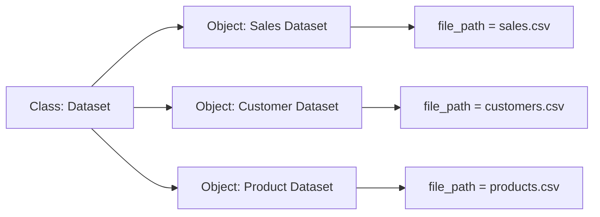
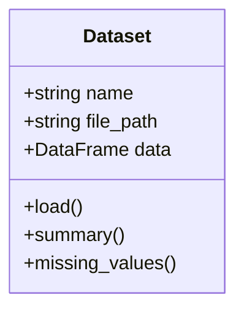
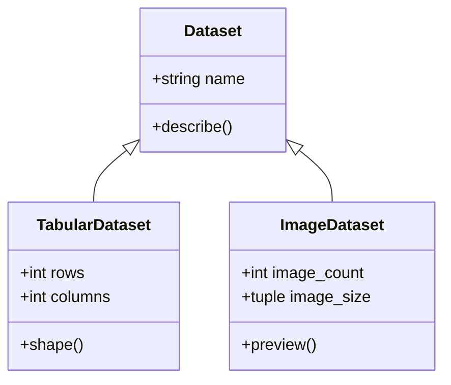
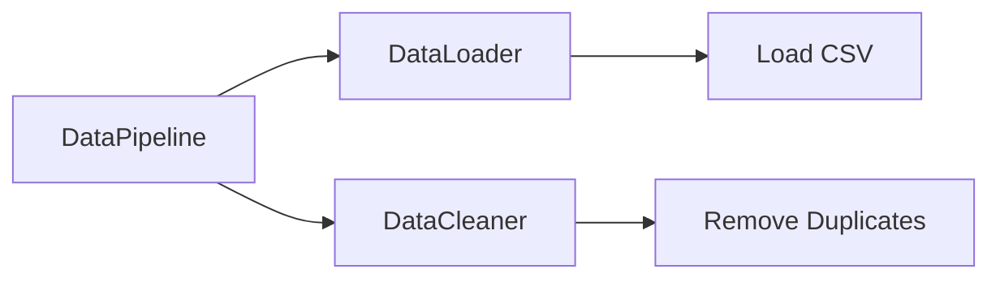
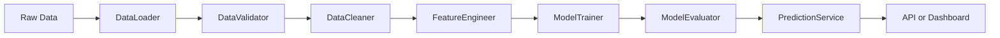
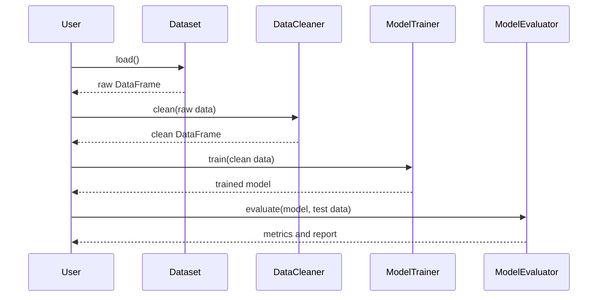
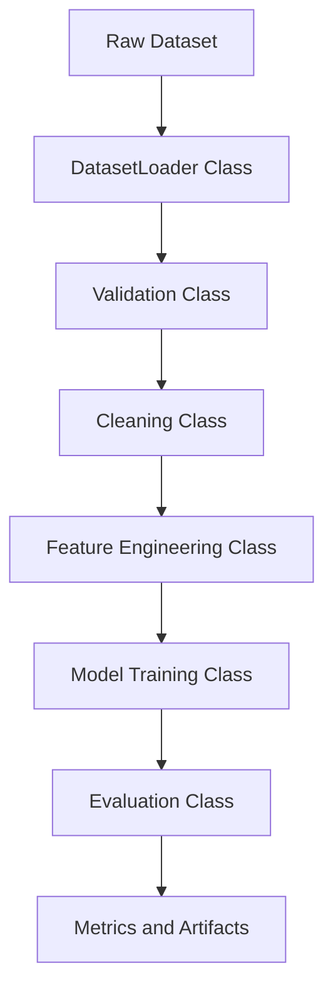
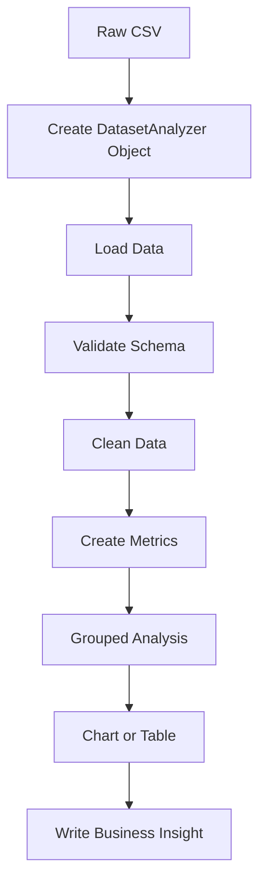
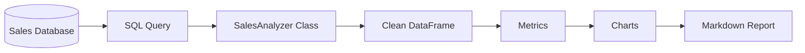

# 005 — Classes

**Course:** 02 — Coding and Exploratory Data Analysis
**Module:** Module 04 — Coding for Data Science
**Content Group:** Python Foundation
**Roadmap Source:** Coding for Data Science / Python Foundation
**Lesson Type:** Coding
**Order in Module:** 005
**Suggested Duration:** 20 minutes

---

## 1. Summary

This lesson introduces **classes** in Python and explains how they are used in AI and data science workflows.

A class is a blueprint for creating objects that combine:

* Data, represented by **attributes**
* Behavior, represented by **methods**

Classes help organize related data and functionality into reusable components. In data science projects, they are commonly used to represent:

* Datasets
* Data preprocessing pipelines
* Machine learning models
* Experiment configurations
* Evaluation results
* API services
* Deployment components

After completing this lesson, you should understand how classes fit into a reproducible data workflow and how they can be transformed into practical artifacts such as notebooks, Python packages, model pipelines, APIs, or portfolio projects.

---

## 2. Learning Objectives

By the end of this lesson, you should be able to:

* Explain what a Python class is in your own words.
* Distinguish between a class and an object.
* Define attributes and methods.
* Use the `__init__` constructor.
* Create multiple objects from the same class.
* Understand instance attributes and class attributes.
* Apply encapsulation to organize data-related logic.
* Use inheritance for simple code reuse.
* Recognize where classes appear in AI and data science workflows.
* Build a small reusable class for loading and analyzing a dataset.

---

## 3. Main Concepts

## 3.1 What Is a Class?

A **class** is a blueprint that describes the data and behavior of a particular type of object.

For example, a data science project may contain a `Dataset` class that knows:

* Where the dataset is stored
* How to load the dataset
* How many rows and columns it contains
* How to detect missing values
* How to generate a summary

```python
class Dataset:
    pass
```

This creates an empty class named `Dataset`.

The class itself is only a definition. To use it, we create an **object**, also called an **instance**.

```python
sales_dataset = Dataset()
```

Here:

* `Dataset` is the class.
* `sales_dataset` is an object created from that class.

---

## 3.2 Class and Object Relationship



One class can be used to create many objects.

Each object follows the same structure but can contain different data.

---

## 3.3 Attributes

An **attribute** is a variable that belongs to an object.

Attributes describe the state or properties of the object.

```python
class Dataset:
    def __init__(self, name, file_path):
        self.name = name
        self.file_path = file_path
```

Create an object:

```python
sales_dataset = Dataset(
    name="Sales Dataset",
    file_path="data/sales.csv",
)
```

Access its attributes:

```python
print(sales_dataset.name)
print(sales_dataset.file_path)
```

Output:

```text
Sales Dataset
data/sales.csv
```

In this example:

* `name` is an attribute.
* `file_path` is an attribute.
* `sales_dataset` is an instance of `Dataset`.

---

## 3.4 The `__init__` Constructor

The `__init__` method is a special method that runs automatically when a new object is created.

It is commonly called the **constructor**.

```python
class Dataset:
    def __init__(self, name, file_path):
        self.name = name
        self.file_path = file_path
```

When this code runs:

```python
dataset = Dataset("Sales", "sales.csv")
```

Python automatically calls:

```python
Dataset.__init__(dataset, "Sales", "sales.csv")
```

The constructor initializes the object's attributes.

---

## 3.5 The `self` Parameter

The `self` parameter refers to the current object.

Consider the following class:

```python
class Dataset:
    def __init__(self, name):
        self.name = name
```

When creating two objects:

```python
sales = Dataset("Sales")
customers = Dataset("Customers")
```

Each object stores its own value:

```python
print(sales.name)
print(customers.name)
```

Output:

```text
Sales
Customers
```

Conceptually:

```text
sales.name     -> "Sales"
customers.name -> "Customers"
```

`self` allows Python to identify which object's data should be accessed or modified.

---

## 3.6 Methods

A **method** is a function defined inside a class.

Methods describe what an object can do.

```python
class Dataset:
    def __init__(self, name, file_path):
        self.name = name
        self.file_path = file_path

    def describe(self):
        return f"{self.name} is stored at {self.file_path}"
```

Use the method:

```python
sales_dataset = Dataset("Sales Dataset", "data/sales.csv")

print(sales_dataset.describe())
```

Output:

```text
Sales Dataset is stored at data/sales.csv
```

---

## 3.7 Attributes and Methods

A class usually combines attributes and methods.



In this example:

### Attributes

* `name`
* `file_path`
* `data`

### Methods

* `load()`
* `summary()`
* `missing_values()`

---

## 3.8 A Practical Dataset Class

The following class loads a CSV file using Pandas.

```python
from pathlib import Path

import pandas as pd


class Dataset:
    def __init__(self, name: str, file_path: str):
        self.name = name
        self.file_path = Path(file_path)
        self.data: pd.DataFrame | None = None

    def load(self) -> pd.DataFrame:
        if not self.file_path.exists():
            raise FileNotFoundError(
                f"Dataset file was not found: {self.file_path}"
            )

        self.data = pd.read_csv(self.file_path)
        return self.data

    def shape(self) -> tuple[int, int]:
        if self.data is None:
            raise ValueError("Load the dataset before requesting its shape.")

        return self.data.shape

    def missing_values(self) -> pd.Series:
        if self.data is None:
            raise ValueError(
                "Load the dataset before checking missing values."
            )

        return self.data.isna().sum()

    def summary(self) -> pd.DataFrame:
        if self.data is None:
            raise ValueError("Load the dataset before generating a summary.")

        return self.data.describe(include="all")
```

Use the class:

```python
sales_dataset = Dataset(
    name="Sales Dataset",
    file_path="data/sales.csv",
)

sales_dataset.load()

print(sales_dataset.shape())
print(sales_dataset.missing_values())
print(sales_dataset.summary())
```

---

## 3.9 Why Use a Class Instead of Separate Functions?

A workflow can be written using independent functions:

```python
def load_dataset(file_path):
    return pd.read_csv(file_path)


def find_missing_values(data):
    return data.isna().sum()
```

This approach is valid for small tasks.

However, a class becomes useful when related data and behavior need to stay together.

```python
dataset = Dataset("Sales", "data/sales.csv")
dataset.load()
dataset.missing_values()
dataset.summary()
```

The object stores its own state:

```text
Dataset object
├── name
├── file_path
├── loaded DataFrame
├── load behavior
├── validation behavior
└── summary behavior
```

Classes are especially useful when:

* The same operations are repeated across multiple datasets.
* An object must remember state between operations.
* Several functions operate on the same data.
* The project is growing into multiple modules.
* The code will become part of a library, pipeline, service, or API.

Functions may remain simpler when:

* The operation is small and stateless.
* Only one transformation is required.
* The function can be reused independently.
* Creating an object would add unnecessary complexity.

---

## 3.10 Instance Attributes

Instance attributes belong to individual objects.

```python
class Experiment:
    def __init__(self, model_name, learning_rate):
        self.model_name = model_name
        self.learning_rate = learning_rate
```

Create two experiments:

```python
experiment_a = Experiment("Logistic Regression", 0.01)
experiment_b = Experiment("Neural Network", 0.001)
```

Each object has its own values:

```python
print(experiment_a.model_name)
print(experiment_b.model_name)
```

Output:

```text
Logistic Regression
Neural Network
```

---

## 3.11 Class Attributes

A class attribute is shared by all instances of a class.

```python
class Experiment:
    framework = "scikit-learn"

    def __init__(self, model_name):
        self.model_name = model_name
```

Use the class attribute:

```python
experiment_a = Experiment("Linear Regression")
experiment_b = Experiment("Random Forest")

print(experiment_a.framework)
print(experiment_b.framework)
```

Output:

```text
scikit-learn
scikit-learn
```

The difference is:

```text
Instance attribute -> belongs to one object
Class attribute    -> shared by every object of the class
```

Example:

```python
class Dataset:
    supported_formats = [".csv", ".json", ".parquet"]

    def __init__(self, file_path):
        self.file_path = file_path
```

Here:

* `supported_formats` is a class attribute.
* `file_path` is an instance attribute.

---

## 3.12 Encapsulation

**Encapsulation** means grouping data and related behavior inside one class.

Instead of exposing every implementation detail, a class provides clear methods for interacting with its internal state.

```python
class DataCleaner:
    def __init__(self, data: pd.DataFrame):
        self.data = data.copy()

    def remove_duplicates(self) -> None:
        self.data = self.data.drop_duplicates()

    def fill_missing_numeric_values(self) -> None:
        numeric_columns = self.data.select_dtypes(include="number").columns

        for column in numeric_columns:
            median_value = self.data[column].median()
            self.data[column] = self.data[column].fillna(median_value)

    def get_clean_data(self) -> pd.DataFrame:
        return self.data.copy()
```

Use the cleaner:

```python
cleaner = DataCleaner(raw_data)

cleaner.remove_duplicates()
cleaner.fill_missing_numeric_values()

clean_data = cleaner.get_clean_data()
```

The cleaning logic is organized inside a single component.

---

## 3.13 Private Attributes by Convention

Python does not enforce strict private attributes in the same way as some other languages.

However, a leading underscore indicates that an attribute is intended for internal use.

```python
class ModelTracker:
    def __init__(self):
        self._metrics = {}

    def add_metric(self, name, value):
        self._metrics[name] = value

    def get_metrics(self):
        return self._metrics.copy()
```

Use the public methods:

```python
tracker = ModelTracker()
tracker.add_metric("accuracy", 0.91)

print(tracker.get_metrics())
```

Although `_metrics` can technically be accessed directly, the underscore communicates that other code should use the provided methods instead.

---

## 3.14 Properties

A property allows a method to be accessed like an attribute.

```python
class Dataset:
    def __init__(self, data: pd.DataFrame):
        self.data = data

    @property
    def row_count(self) -> int:
        return len(self.data)

    @property
    def column_count(self) -> int:
        return len(self.data.columns)
```

Use the properties:

```python
dataset = Dataset(data)

print(dataset.row_count)
print(dataset.column_count)
```

Notice that parentheses are not required.

Properties are useful for computed values that conceptually behave like attributes.

---

## 3.15 Class Methods

A class method operates on the class itself rather than on a specific instance.

It uses `cls` instead of `self`.

```python
class Dataset:
    def __init__(self, name, data):
        self.name = name
        self.data = data

    @classmethod
    def from_csv(cls, name, file_path):
        data = pd.read_csv(file_path)
        return cls(name=name, data=data)
```

Create an object through the class method:

```python
sales_dataset = Dataset.from_csv(
    name="Sales Dataset",
    file_path="data/sales.csv",
)
```

Class methods are often used as alternative constructors.

---

## 3.16 Static Methods

A static method belongs logically to a class but does not need access to `self` or `cls`.

```python
class DataValidator:
    @staticmethod
    def is_valid_percentage(value):
        return 0 <= value <= 100
```

Use the static method:

```python
print(DataValidator.is_valid_percentage(75))
print(DataValidator.is_valid_percentage(120))
```

Output:

```text
True
False
```

Use a static method when the behavior is related to the class but does not require object state.

---

## 3.17 Inheritance

Inheritance allows one class to reuse and extend another class.

The existing class is called the **parent class** or **base class**.

The new class is called the **child class** or **subclass**.

```python
class Dataset:
    def __init__(self, name):
        self.name = name

    def describe(self):
        return f"Dataset: {self.name}"
```

Create a specialized class:

```python
class TabularDataset(Dataset):
    def __init__(self, name, rows, columns):
        super().__init__(name)
        self.rows = rows
        self.columns = columns

    def shape(self):
        return self.rows, self.columns
```

Use the child class:

```python
dataset = TabularDataset(
    name="Sales",
    rows=1000,
    columns=12,
)

print(dataset.describe())
print(dataset.shape())
```

Output:

```text
Dataset: Sales
(1000, 12)
```

---

## 3.18 Inheritance Diagram



Both child classes inherit common behavior from `Dataset`.

---

## 3.19 Method Overriding

A child class can replace a method inherited from its parent.

```python
class Model:
    def predict(self, features):
        raise NotImplementedError("Subclasses must implement predict().")
```

Create a specialized model:

```python
class MeanPredictor(Model):
    def __init__(self, mean_value):
        self.mean_value = mean_value

    def predict(self, features):
        return [self.mean_value] * len(features)
```

The `MeanPredictor` class overrides the `predict()` method.

---

## 3.20 Composition

Composition means creating a class that contains objects from other classes.

It is often described as a **has-a relationship**.

For example:

* A pipeline has a data loader.
* A pipeline has a cleaner.
* A pipeline has a model.
* A pipeline has an evaluator.

```python
class DataLoader:
    def load(self, file_path):
        return pd.read_csv(file_path)


class DataCleaner:
    def clean(self, data):
        return data.drop_duplicates()


class DataPipeline:
    def __init__(self, loader, cleaner):
        self.loader = loader
        self.cleaner = cleaner

    def run(self, file_path):
        data = self.loader.load(file_path)
        clean_data = self.cleaner.clean(data)
        return clean_data
```

Create and run the pipeline:

```python
loader = DataLoader()
cleaner = DataCleaner()

pipeline = DataPipeline(
    loader=loader,
    cleaner=cleaner,
)

clean_data = pipeline.run("data/sales.csv")
```

Diagram:



Composition is often more flexible than deep inheritance hierarchies.

---

## 4. Classes in the AI and Data Science Workflow

Classes can appear at nearly every stage of a data project.



Possible class responsibilities:

| Workflow Stage      | Example Class       | Responsibility                                   |
| ------------------- | ------------------- | ------------------------------------------------ |
| Data ingestion      | `DataLoader`        | Read CSV, JSON, database, or API data            |
| Validation          | `DataValidator`     | Check columns, types, ranges, and missing values |
| Cleaning            | `DataCleaner`       | Remove duplicates and handle missing values      |
| Feature engineering | `FeatureEngineer`   | Create model-ready features                      |
| Training            | `ModelTrainer`      | Train and save models                            |
| Evaluation          | `ModelEvaluator`    | Calculate metrics and comparison tables          |
| Experiment tracking | `ExperimentTracker` | Store parameters, metrics, and artifacts         |
| Prediction          | `PredictionService` | Load a model and generate predictions            |
| Deployment          | `ModelAPI`          | Expose predictions through an API                |

---

## 5. Example: Reusable Sales Analyzer

The following class loads a sales dataset and calculates several business metrics.

```python
from pathlib import Path

import pandas as pd


class SalesAnalyzer:
    required_columns = {
        "order_id",
        "product",
        "quantity",
        "unit_price",
        "region",
    }

    def __init__(self, file_path: str):
        self.file_path = Path(file_path)
        self.data: pd.DataFrame | None = None

    def load(self) -> pd.DataFrame:
        if not self.file_path.exists():
            raise FileNotFoundError(
                f"Sales file does not exist: {self.file_path}"
            )

        self.data = pd.read_csv(self.file_path)
        self._validate_columns()
        return self.data

    def _validate_columns(self) -> None:
        if self.data is None:
            raise ValueError("No data has been loaded.")

        missing_columns = self.required_columns - set(self.data.columns)

        if missing_columns:
            raise ValueError(
                f"Missing required columns: {sorted(missing_columns)}"
            )

    def prepare(self) -> pd.DataFrame:
        if self.data is None:
            raise ValueError("Load the dataset before preparing it.")

        clean_data = self.data.drop_duplicates().copy()

        clean_data["quantity"] = pd.to_numeric(
            clean_data["quantity"],
            errors="coerce",
        )

        clean_data["unit_price"] = pd.to_numeric(
            clean_data["unit_price"],
            errors="coerce",
        )

        clean_data = clean_data.dropna(
            subset=["quantity", "unit_price"]
        )

        clean_data["revenue"] = (
            clean_data["quantity"] * clean_data["unit_price"]
        )

        self.data = clean_data
        return self.data

    def total_revenue(self) -> float:
        self._require_prepared_data()
        return float(self.data["revenue"].sum())

    def revenue_by_region(self) -> pd.Series:
        self._require_prepared_data()

        return (
            self.data.groupby("region")["revenue"]
            .sum()
            .sort_values(ascending=False)
        )

    def top_products(self, limit: int = 5) -> pd.Series:
        self._require_prepared_data()

        return (
            self.data.groupby("product")["revenue"]
            .sum()
            .sort_values(ascending=False)
            .head(limit)
        )

    def _require_prepared_data(self) -> None:
        if self.data is None or "revenue" not in self.data.columns:
            raise ValueError(
                "Load and prepare the dataset before calculating metrics."
            )
```

Use the analyzer:

```python
analyzer = SalesAnalyzer("data/sales.csv")

analyzer.load()
analyzer.prepare()

print("Total revenue:", analyzer.total_revenue())
print(analyzer.revenue_by_region())
print(analyzer.top_products())
```

---

## 6. Example: Experiment Configuration Class

Classes are also useful for storing machine learning experiment settings.

```python
class ExperimentConfig:
    def __init__(
        self,
        model_name: str,
        test_size: float = 0.2,
        random_state: int = 42,
    ):
        self.model_name = model_name
        self.test_size = test_size
        self.random_state = random_state

    def display(self) -> None:
        print(f"Model: {self.model_name}")
        print(f"Test size: {self.test_size}")
        print(f"Random state: {self.random_state}")
```

Create configurations:

```python
logistic_config = ExperimentConfig(
    model_name="Logistic Regression",
    test_size=0.25,
)

forest_config = ExperimentConfig(
    model_name="Random Forest",
    test_size=0.2,
    random_state=100,
)
```

Display one configuration:

```python
logistic_config.display()
```

Output:

```text
Model: Logistic Regression
Test size: 0.25
Random state: 42
```

---

## 7. Example: Model Evaluation Class

```python
from sklearn.metrics import accuracy_score
from sklearn.metrics import classification_report
from sklearn.metrics import confusion_matrix


class ClassificationEvaluator:
    def __init__(self, actual, predicted):
        self.actual = actual
        self.predicted = predicted

    def accuracy(self) -> float:
        return accuracy_score(self.actual, self.predicted)

    def confusion_matrix(self):
        return confusion_matrix(self.actual, self.predicted)

    def report(self) -> str:
        return classification_report(
            self.actual,
            self.predicted,
            zero_division=0,
        )
```

Use the evaluator:

```python
evaluator = ClassificationEvaluator(
    actual=y_test,
    predicted=y_pred,
)

print("Accuracy:", evaluator.accuracy())
print(evaluator.confusion_matrix())
print(evaluator.report())
```

This keeps evaluation logic separate from model training logic.

---

## 8. End-to-End Object-Oriented Workflow



This structure helps separate responsibilities:

```text
Dataset        -> data access
DataCleaner    -> data preparation
ModelTrainer   -> training
ModelEvaluator -> evaluation
```

---

## 9. When Classes Improve Reproducibility

A reproducible data workflow should clearly define:

1. How raw data is loaded
2. How data is validated
3. How data is cleaned
4. How features are generated
5. How the model is trained
6. How results are evaluated
7. How outputs are saved

Classes can encapsulate these responsibilities.



However, using classes alone does not guarantee reproducibility.

A reproducible project should also include:

* Version-controlled source code
* Fixed random seeds
* Saved configurations
* Dependency files
* Raw-data preservation
* Data cleaning logs
* Clear README instructions
* Model and metric versioning

---

## 10. Good Class Design Principles

## 10.1 Give Each Class One Main Responsibility

Avoid creating one class that loads data, cleans data, trains a model, generates charts, sends emails, and starts an API.

Poor design:

```python
class DataScienceProject:
    def load_data(self):
        ...

    def clean_data(self):
        ...

    def train_model(self):
        ...

    def create_dashboard(self):
        ...

    def send_email(self):
        ...
```

Better design:

```text
DataLoader
DataCleaner
ModelTrainer
ModelEvaluator
ReportGenerator
```

Each class has a clear purpose.

---

## 10.2 Use Clear Names

Good class names are usually nouns written in `PascalCase`.

```python
class DataLoader:
    pass


class FeatureEngineer:
    pass


class ModelEvaluator:
    pass
```

Avoid vague names:

```python
class Manager:
    pass


class Helper:
    pass


class Processor:
    pass
```

A class name should communicate what the object represents.

---

## 10.3 Keep Methods Focused

A method should perform one clear action.

Good:

```python
def remove_duplicates(self):
    ...


def fill_missing_values(self):
    ...


def standardize_columns(self):
    ...
```

Less clear:

```python
def process_everything(self):
    ...
```

Focused methods are easier to:

* Read
* Test
* Debug
* Reuse
* Document

---

## 10.4 Validate Inputs

Classes should fail with meaningful error messages.

```python
class ExperimentConfig:
    def __init__(self, test_size):
        if not 0 < test_size < 1:
            raise ValueError(
                "test_size must be greater than 0 and less than 1."
            )

        self.test_size = test_size
```

This prevents invalid objects from being created.

---

## 10.5 Avoid Unnecessary Classes

Do not create a class when a simple function is enough.

Unnecessary:

```python
class MeanCalculator:
    def calculate(self, values):
        return sum(values) / len(values)
```

Simpler:

```python
def calculate_mean(values):
    return sum(values) / len(values)
```

Use classes when they improve organization, state management, extensibility, or reuse.

---

## 11. Common Mistakes

## 11.1 Forgetting `self`

Incorrect:

```python
class Dataset:
    def __init__(name):
        name = name
```

Correct:

```python
class Dataset:
    def __init__(self, name):
        self.name = name
```

The first parameter of an instance method must represent the current object.

---

## 11.2 Creating Local Variables Instead of Attributes

Incorrect:

```python
class Dataset:
    def __init__(self, name):
        name = name
```

Here, `name` is only a local variable.

Correct:

```python
class Dataset:
    def __init__(self, name):
        self.name = name
```

Now the value is stored on the object.

---

## 11.3 Calling a Method Without Parentheses

```python
dataset.load
```

This refers to the method itself but does not execute it.

Correct:

```python
dataset.load()
```

---

## 11.4 Using Mutable Class Attributes

Incorrect:

```python
class Experiment:
    metrics = []
```

Every instance shares the same list.

```python
experiment_a = Experiment()
experiment_b = Experiment()

experiment_a.metrics.append(0.9)

print(experiment_b.metrics)
```

Output:

```text
[0.9]
```

Correct:

```python
class Experiment:
    def __init__(self):
        self.metrics = []
```

Now each object has its own list.

---

## 11.5 Creating One Large God Class

A class with too many responsibilities becomes difficult to maintain.

Warning signs include:

* Dozens of unrelated methods
* Many attributes that are rarely used together
* Frequent changes for unrelated features
* Difficult unit testing
* Strong dependency on external components

Split the class into smaller components with clear responsibilities.

---

## 11.6 Using Deep Inheritance Hierarchies

Avoid structures such as:

```text
BaseDataset
└── TabularDataset
    └── SalesDataset
        └── RegionalSalesDataset
            └── MonthlyRegionalSalesDataset
```

Deep inheritance can make behavior difficult to understand.

Prefer composition when components can be combined independently.

---

## 11.7 Hiding Important State Changes

This method unexpectedly modifies the original dataset:

```python
def summary(self):
    self.data.dropna(inplace=True)
    return self.data.describe()
```

A summary method should usually not alter data.

Better:

```python
def summary(self):
    return self.data.describe()
```

Method names should make side effects clear.

---

## 11.8 Adding Classes Without Documentation

A reusable class should explain:

* What the class represents
* Required inputs
* Available methods
* Expected outputs
* Possible exceptions
* Example usage

Example:

```python
class Dataset:
    """Load and inspect a tabular CSV dataset.

    Parameters
    ----------
    name:
        Human-readable dataset name.
    file_path:
        Path to the CSV file.
    """
```

---

## 12. Practical Exercise

Build a reusable class for analyzing a small CSV dataset.

Suggested datasets:

* Sales transactions
* Customer orders
* Employee records
* House prices
* Movie ratings
* Student performance
* Product inventory

### Requirements

Create a class named `DatasetAnalyzer`.

The class should contain:

* A dataset name
* A file path
* A loaded Pandas DataFrame
* A method to load the CSV file
* A method to validate required columns
* A method to remove duplicate rows
* A method to report missing values
* A method to return dataset dimensions
* A method to calculate at least one business metric
* A method to return a grouped summary

Starter structure:

```python
from pathlib import Path

import pandas as pd


class DatasetAnalyzer:
    def __init__(self, name: str, file_path: str):
        self.name = name
        self.file_path = Path(file_path)
        self.data: pd.DataFrame | None = None

    def load(self) -> pd.DataFrame:
        # Add file validation and CSV loading.
        pass

    def clean(self) -> pd.DataFrame:
        # Remove duplicate rows and handle missing values.
        pass

    def missing_values(self) -> pd.Series:
        # Return missing-value counts.
        pass

    def shape(self) -> tuple[int, int]:
        # Return rows and columns.
        pass

    def grouped_summary(self, group_column: str) -> pd.DataFrame:
        # Return a grouped summary table.
        pass
```

---

## 13. Suggested Analysis Workflow

```text
raw CSV
   ↓
DatasetAnalyzer.load()
   ↓
validate schema
   ↓
DatasetAnalyzer.clean()
   ↓
create calculated columns
   ↓
group and aggregate
   ↓
chart and insight
   ↓
save report
```

Mermaid version:



---

## 14. Expected Deliverables

Your exercise should produce:

1. A reproducible notebook or Python script
2. A reusable analysis class
3. A cleaned dataset or transformation output
4. At least one summary table
5. At least one chart
6. Three written insights
7. A README explaining how to run the project

Example project structure:

```text
sales-analysis/
├── data/
│   ├── raw/
│   │   └── sales.csv
│   └── processed/
│       └── sales_clean.csv
├── notebooks/
│   └── sales_analysis.ipynb
├── src/
│   ├── __init__.py
│   └── dataset_analyzer.py
├── reports/
│   ├── revenue_by_region.png
│   └── summary.md
├── requirements.txt
└── README.md
```

---

## 15. Example Insights

After completing the analysis, write observations such as:

> The northern region generated the highest total revenue, contributing approximately 38% of overall sales.

> Product A produced the most revenue, but Product B had a higher average value per order.

> Missing customer-segment values were concentrated in records imported during the first week of the month, suggesting a possible data collection issue.

A chart alone is not an insight.

A strong insight should include:

```text
Observation
    +
Supporting metric
    +
Possible explanation
    +
Recommended action
```

---

## 16. Completion Checklist

* [ ] I can explain a Python class in one or two minutes.
* [ ] I understand the difference between a class and an object.
* [ ] I can define attributes using `self`.
* [ ] I can create methods inside a class.
* [ ] I can use the `__init__` constructor.
* [ ] I understand instance attributes and class attributes.
* [ ] I can create multiple objects from one class.
* [ ] I can explain basic encapsulation.
* [ ] I understand simple inheritance and composition.
* [ ] I know when a function is more appropriate than a class.
* [ ] I created a reusable class for a small dataset.
* [ ] I saved the cleaning and transformation steps.
* [ ] I produced at least one chart or summary table.
* [ ] I wrote at least three evidence-based insights.
* [ ] I documented at least one assumption, caveat, or follow-up question.

---

## 17. Related Outcome

Use Python, SQL, data libraries, notebooks, and Git to build reproducible data workflows.

Classes support this outcome by helping convert exploratory code into structured and reusable components such as:

* Python modules
* Data processing pipelines
* Machine learning estimators
* Experiment-tracking tools
* API services
* Deployment applications

---

## 18. Related Project

### Mini Project: SQL and Python Sales Analysis

Build a small sales analytics project using:

* A relational sales database
* SQL queries for data extraction
* Pandas for cleaning and transformation
* A reusable `SalesAnalyzer` class
* Matplotlib for visualization
* Markdown for reporting
* Git for version control

Suggested workflow:



Possible class methods:

```python
class SalesAnalyzer:
    def load_from_sql(self):
        ...

    def clean(self):
        ...

    def calculate_revenue(self):
        ...

    def revenue_by_region(self):
        ...

    def top_products(self):
        ...

    def export_report(self):
        ...
```

---

## 19. Key Takeaways

* A class is a blueprint for creating objects.
* An object combines data and behavior.
* Attributes store object state.
* Methods define object behavior.
* `__init__` initializes a new object.
* `self` refers to the current object.
* Classes are useful when related data and operations belong together.
* Inheritance supports specialization, while composition combines independent components.
* Classes can organize loaders, cleaners, models, evaluators, and APIs.
* Not every problem needs a class; simple functions are often better for small stateless operations.
* Good class design improves readability, testability, reuse, and maintainability.

---

## 20. Conclusion

**Classes** are an important milestone in the AI and data scientist roadmap because they help transform experimental notebook code into maintainable software.

A well-designed class can represent a dataset, preprocessing pipeline, experiment, model evaluator, or prediction service. It can preserve state, validate inputs, organize related operations, and make workflows easier to reproduce.

To make this knowledge practical, convert the lesson into a concrete artifact such as:

* A reusable dataset analysis class
* A data-cleaning module
* A model evaluation component
* A machine learning pipeline
* A REST API
* A Dockerized prediction service
* A documented portfolio project

The goal is not to use classes everywhere. The goal is to recognize when combining data and behavior into a reusable object makes a data workflow clearer, safer, and easier to maintain.
