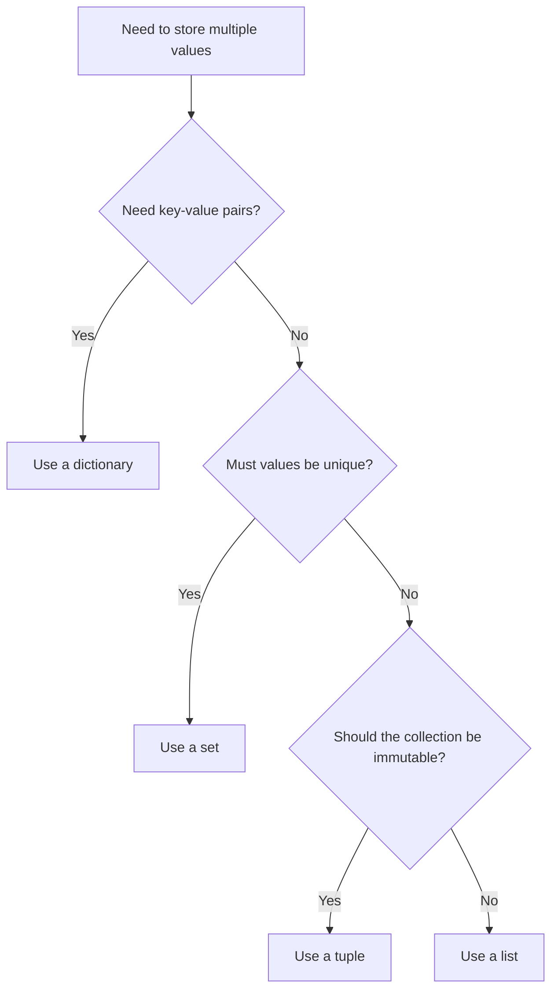
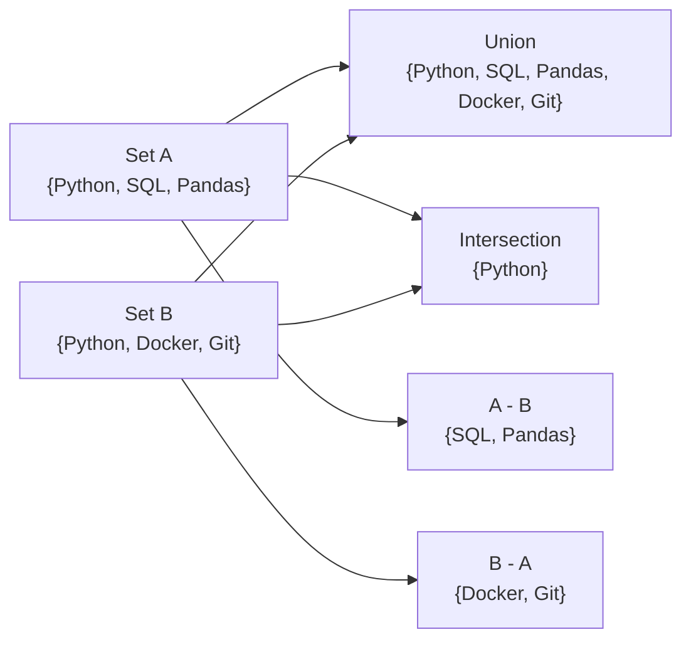
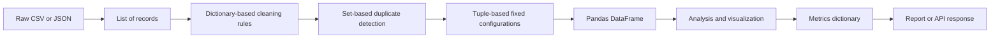

# 006 — List, Tuple, Dictionary, and Set

**Course:** 02 — Coding and Exploratory Data Analysis
**Module:** Module 04 — Coding for Data Science
**Content Group:** Python Foundation
**Roadmap Source:** Coding for Data Science / Python Foundation
**Lesson Type:** Coding
**Lesson Order:** 006
**Suggested Duration:** 20 minutes

---

## 1. Overview

This lesson introduces four essential Python collection types:

* `list`
* `tuple`
* `dict`
* `set`

These data structures are used to organize, store, transform, and retrieve data in Python programs.

In AI and Data Science, they frequently appear in:

* dataset preprocessing;
* feature engineering;
* experiment configuration;
* model outputs;
* API requests and responses;
* data validation;
* metric tracking;
* machine learning pipelines.

By the end of this lesson, you should understand when to use each collection type and how to apply them in a reproducible data workflow.

---

## 2. Learning Objectives

After completing this lesson, you should be able to:

1. Explain the differences between lists, tuples, dictionaries, and sets.
2. Create and modify each collection type.
3. Select the appropriate collection for a given data problem.
4. Iterate through collections using loops and comprehensions.
5. Use nested data structures to represent real datasets.
6. Apply collections in a small Data Science workflow.
7. Recognize common errors related to mutability, indexing, keys, and duplicates.

---

## 3. Collection Types at a Glance

| Collection | Syntax           |                        Ordered | Mutable |   Allows Duplicates | Access Method |
| ---------- | ---------------- | -----------------------------: | ------: | ------------------: | ------------- |
| List       | `[1, 2, 3]`      |                            Yes |     Yes |                 Yes | Index         |
| Tuple      | `(1, 2, 3)`      |                            Yes |      No |                 Yes | Index         |
| Dictionary | `{"name": "An"}` |                            Yes |     Yes | Keys must be unique | Key           |
| Set        | `{1, 2, 3}`      | No guaranteed positional order |     Yes |                  No | Membership    |

> In modern Python versions, dictionaries preserve insertion order. However, dictionary values should still be accessed by key rather than by numerical position.

---

## 4. Choosing the Right Collection



A simple decision rule is:

* Use a **list** for an ordered and changeable sequence.
* Use a **tuple** for an ordered and fixed sequence.
* Use a **dictionary** for named values or key-value relationships.
* Use a **set** for unique values and membership operations.

---

# 5. Lists

## 5.1 What Is a List?

A list is an ordered and mutable collection.

Lists are useful when:

* the order of values matters;
* values may change;
* duplicate values are allowed;
* elements need to be added or removed.

```python
sales = [1200, 1500, 1100, 1800]
```

A list can contain values of different data types:

```python
record = ["P001", 250.5, 3, True]
```

However, using mixed data types in one list may make data processing harder. In Data Science, lists usually contain values with similar meanings.

---

## 5.2 Accessing List Elements

Python uses zero-based indexing.

```python
scores = [78, 85, 91, 66]

print(scores[0])   # 78
print(scores[2])   # 91
print(scores[-1])  # 66
```

Index positions:

```text
Value:          78    85    91    66
Positive index:  0     1     2     3
Negative index: -4    -3    -2    -1
```

---

## 5.3 List Slicing

Slicing extracts part of a list.

```python
scores = [78, 85, 91, 66, 88]

print(scores[1:4])
# [85, 91, 66]

print(scores[:3])
# [78, 85, 91]

print(scores[::2])
# [78, 91, 88]
```

The slicing syntax is:

```python
collection[start:stop:step]
```

The `stop` index is not included.

---

## 5.4 Modifying a List

Lists are mutable, so their values can be changed.

```python
scores = [78, 85, 91]

scores[0] = 80

print(scores)
# [80, 85, 91]
```

---

## 5.5 Common List Methods

```python
products = ["Laptop", "Mouse"]

products.append("Keyboard")
products.insert(1, "Monitor")
products.remove("Mouse")

print(products)
# ['Laptop', 'Monitor', 'Keyboard']
```

Important list methods:

| Method                 | Purpose                               |
| ---------------------- | ------------------------------------- |
| `append(value)`        | Add one element to the end            |
| `extend(iterable)`     | Add multiple elements                 |
| `insert(index, value)` | Add an element at a specific position |
| `remove(value)`        | Remove the first matching value       |
| `pop(index)`           | Remove and return an element          |
| `sort()`               | Sort the list in place                |
| `reverse()`            | Reverse the list                      |
| `count(value)`         | Count occurrences                     |
| `index(value)`         | Find the first matching index         |
| `clear()`              | Remove all elements                   |

Example:

```python
values = [8, 3, 5, 3]

values.sort()

print(values)
# [3, 3, 5, 8]

print(values.count(3))
# 2
```

---

## 5.6 Looping Through a List

```python
revenues = [1200, 1500, 1700]

for revenue in revenues:
    print(revenue)
```

Using both the index and the value:

```python
for index, revenue in enumerate(revenues):
    print(index, revenue)
```

Output:

```text
0 1200
1 1500
2 1700
```

---

## 5.7 List Comprehension

List comprehensions provide a concise way to create lists.

```python
prices = [100, 200, 300]

discounted_prices = [price * 0.9 for price in prices]

print(discounted_prices)
# [90.0, 180.0, 270.0]
```

With a condition:

```python
scores = [45, 72, 89, 51, 30]

passing_scores = [score for score in scores if score >= 50]

print(passing_scores)
# [72, 89, 51]
```

General structure:

```python
new_list = [expression for item in collection if condition]
```

---

## 5.8 Data Science Example with a List

```python
daily_sales = [120, 150, 90, 180, 160]

total_sales = sum(daily_sales)
average_sales = total_sales / len(daily_sales)
maximum_sales = max(daily_sales)

print(f"Total sales: {total_sales}")
print(f"Average sales: {average_sales:.2f}")
print(f"Maximum sales: {maximum_sales}")
```

---

# 6. Tuples

## 6.1 What Is a Tuple?

A tuple is an ordered and immutable collection.

```python
model_shape = (224, 224, 3)
```

Tuples are useful when:

* values should not change;
* a fixed configuration is required;
* a function needs to return multiple values;
* data represents coordinates, dimensions, or ranges.

---

## 6.2 Creating Tuples

```python
coordinates = (10.5, 20.3)
categories = ("low", "medium", "high")
```

A tuple containing one element requires a trailing comma:

```python
single_value = (42,)

print(type(single_value))
# <class 'tuple'>
```

Without the comma:

```python
not_a_tuple = (42)

print(type(not_a_tuple))
# <class 'int'>
```

---

## 6.3 Accessing Tuple Elements

Tuples support indexing and slicing.

```python
image_shape = (1080, 1920, 3)

height = image_shape[0]
width = image_shape[1]
channels = image_shape[2]

print(height, width, channels)
```

---

## 6.4 Tuple Unpacking

Tuple unpacking assigns tuple elements to separate variables.

```python
image_shape = (1080, 1920, 3)

height, width, channels = image_shape

print(height)
print(width)
print(channels)
```

This is common when functions return multiple results.

```python
def calculate_metrics(values):
    minimum = min(values)
    maximum = max(values)
    average = sum(values) / len(values)

    return minimum, maximum, average


minimum, maximum, average = calculate_metrics([10, 20, 30])

print(minimum, maximum, average)
```

---

## 6.5 Tuples Are Immutable

The following code causes an error:

```python
coordinates = (10, 20)

coordinates[0] = 15
```

Error:

```text
TypeError: 'tuple' object does not support item assignment
```

To change a tuple, create a new one:

```python
coordinates = (10, 20)
coordinates = (15, coordinates[1])

print(coordinates)
# (15, 20)
```

---

## 6.6 Data Science Example with a Tuple

Tuples are often used for model and image dimensions.

```python
input_shape = (224, 224, 3)

height, width, channels = input_shape

print(f"Image height: {height}")
print(f"Image width: {width}")
print(f"Number of channels: {channels}")
```

They are also useful for experiment configurations:

```python
learning_rate_range = (0.0001, 0.01)
```

---

# 7. Dictionaries

## 7.1 What Is a Dictionary?

A dictionary stores data as key-value pairs.

```python
student = {
    "name": "An Khanh",
    "score": 88,
    "passed": True
}
```

Each key identifies a value.

```text
"name"   -> "An Khanh"
"score"  -> 88
"passed" -> True
```

Dictionaries are useful for:

* structured records;
* experiment configurations;
* API responses;
* model metrics;
* JSON-like data;
* feature mappings;
* metadata.

---

## 7.2 Accessing Dictionary Values

```python
student = {
    "name": "An Khanh",
    "score": 88
}

print(student["name"])
# An Khanh
```

Using a missing key with square brackets causes a `KeyError`.

```python
print(student["age"])
```

A safer option is `get()`:

```python
age = student.get("age", "Unknown")

print(age)
# Unknown
```

---

## 7.3 Adding and Updating Values

```python
student = {
    "name": "An Khanh",
    "score": 88
}

student["age"] = 21
student["score"] = 92

print(student)
```

Result:

```python
{
    "name": "An Khanh",
    "score": 92,
    "age": 21
}
```

---

## 7.4 Removing Values

```python
student = {
    "name": "An Khanh",
    "score": 92,
    "age": 21
}

student.pop("age")

print(student)
```

Other removal operations:

```python
del student["score"]
student.clear()
```

---

## 7.5 Dictionary Methods

| Method                     | Purpose                            |
| -------------------------- | ---------------------------------- |
| `keys()`                   | Return all keys                    |
| `values()`                 | Return all values                  |
| `items()`                  | Return key-value pairs             |
| `get(key, default)`        | Safely retrieve a value            |
| `update(dictionary)`       | Add or update multiple pairs       |
| `pop(key)`                 | Remove a key and return its value  |
| `setdefault(key, default)` | Return a value or create a default |
| `clear()`                  | Remove all items                   |

Example:

```python
metrics = {
    "accuracy": 0.91,
    "precision": 0.88,
    "recall": 0.86
}

print(metrics.keys())
print(metrics.values())
print(metrics.items())
```

---

## 7.6 Looping Through a Dictionary

Loop through keys:

```python
for metric in metrics:
    print(metric)
```

Loop through values:

```python
for value in metrics.values():
    print(value)
```

Loop through key-value pairs:

```python
for metric, value in metrics.items():
    print(f"{metric}: {value}")
```

---

## 7.7 Dictionary Comprehension

```python
features = ["age", "income", "score"]

feature_indexes = {
    feature: index
    for index, feature in enumerate(features)
}

print(feature_indexes)
```

Output:

```python
{
    "age": 0,
    "income": 1,
    "score": 2
}
```

Another example:

```python
values = [1, 2, 3, 4]

squared_values = {
    value: value ** 2
    for value in values
}

print(squared_values)
```

---

## 7.8 Nested Dictionaries

A dictionary can contain other dictionaries.

```python
experiment = {
    "model": {
        "name": "RandomForestClassifier",
        "n_estimators": 100,
        "max_depth": 8
    },
    "training": {
        "test_size": 0.2,
        "random_state": 42
    },
    "metrics": {
        "accuracy": 0.91,
        "f1_score": 0.89
    }
}
```

Accessing nested values:

```python
model_name = experiment["model"]["name"]
accuracy = experiment["metrics"]["accuracy"]

print(model_name)
print(accuracy)
```

---

## 7.9 Data Science Example with a Dictionary

```python
model_results = {
    "model_name": "Logistic Regression",
    "accuracy": 0.87,
    "precision": 0.84,
    "recall": 0.82,
    "f1_score": 0.83
}

for metric, value in model_results.items():
    print(f"{metric}: {value}")
```

A dictionary is particularly useful when metric names must remain attached to metric values.

---

# 8. Sets

## 8.1 What Is a Set?

A set is a collection of unique elements.

```python
categories = {"Electronics", "Books", "Clothing"}
```

Sets automatically remove duplicates.

```python
labels = ["cat", "dog", "cat", "bird", "dog"]

unique_labels = set(labels)

print(unique_labels)
```

Possible result:

```python
{"cat", "dog", "bird"}
```

Do not depend on a set's display order.

---

## 8.2 Creating an Empty Set

Use `set()` to create an empty set.

```python
unique_users = set()
```

This creates an empty dictionary, not an empty set:

```python
empty_collection = {}
```

---

## 8.3 Adding and Removing Elements

```python
categories = {"Books", "Electronics"}

categories.add("Clothing")
categories.remove("Books")

print(categories)
```

Using `remove()` with a missing value causes a `KeyError`.

```python
categories.remove("Food")
```

Use `discard()` when the value may not exist:

```python
categories.discard("Food")
```

---

## 8.4 Set Operations

Consider two sets:

```python
group_a = {"Python", "SQL", "Pandas"}
group_b = {"Python", "Docker", "Git"}
```

### Union

All unique elements from both sets:

```python
all_skills = group_a | group_b
```

Or:

```python
all_skills = group_a.union(group_b)
```

Result:

```python
{"Python", "SQL", "Pandas", "Docker", "Git"}
```

### Intersection

Elements found in both sets:

```python
common_skills = group_a & group_b
```

Result:

```python
{"Python"}
```

### Difference

Elements in the first set but not the second:

```python
only_group_a = group_a - group_b
```

Result:

```python
{"SQL", "Pandas"}
```

### Symmetric Difference

Elements found in only one of the sets:

```python
different_skills = group_a ^ group_b
```

Result:

```python
{"SQL", "Pandas", "Docker", "Git"}
```

---

## 8.5 Set Operations Diagram



---

## 8.6 Membership Testing

Sets provide efficient membership checks.

```python
valid_categories = {"Books", "Clothing", "Electronics"}

category = "Books"

if category in valid_categories:
    print("Valid category")
```

Sets are useful when repeatedly checking whether values belong to a known collection.

---

## 8.7 Data Science Example with a Set

Finding unique customer locations:

```python
customer_cities = [
    "Hanoi",
    "Da Nang",
    "Hanoi",
    "Ho Chi Minh City",
    "Da Nang"
]

unique_cities = set(customer_cities)

print(unique_cities)
print(f"Number of unique cities: {len(unique_cities)}")
```

Finding duplicated values:

```python
customer_ids = ["C01", "C02", "C01", "C03", "C02"]

seen = set()
duplicates = set()

for customer_id in customer_ids:
    if customer_id in seen:
        duplicates.add(customer_id)
    else:
        seen.add(customer_id)

print(duplicates)
# {'C01', 'C02'}
```

---

# 9. Mutability

Mutability describes whether an object can be changed after it has been created.

| Type       | Mutable? |
| ---------- | -------: |
| List       |      Yes |
| Tuple      |       No |
| Dictionary |      Yes |
| Set        |      Yes |

Example with a list:

```python
numbers = [1, 2, 3]
numbers.append(4)

print(numbers)
# [1, 2, 3, 4]
```

Example with a tuple:

```python
numbers = (1, 2, 3)
numbers.append(4)
```

This causes an error because tuples do not have an `append()` method.

---

## 9.1 Why Mutability Matters

Mutability affects:

* function behavior;
* memory usage;
* reproducibility;
* debugging;
* dictionary keys;
* set elements.

Mutable objects such as lists cannot normally be used as dictionary keys.

Invalid:

```python
data = {
    [1, 2]: "value"
}
```

Valid:

```python
data = {
    (1, 2): "value"
}
```

Tuples can be used as dictionary keys when all their elements are hashable.

---

# 10. Nested Collections

Real datasets often require combinations of lists, tuples, dictionaries, and sets.

## 10.1 List of Dictionaries

A list of dictionaries can represent table-like records.

```python
sales_records = [
    {
        "product": "Laptop",
        "quantity": 2,
        "price": 1000
    },
    {
        "product": "Mouse",
        "quantity": 5,
        "price": 25
    },
    {
        "product": "Keyboard",
        "quantity": 3,
        "price": 60
    }
]
```

Processing the records:

```python
for record in sales_records:
    revenue = record["quantity"] * record["price"]

    print(
        record["product"],
        revenue
    )
```

---

## 10.2 Dictionary of Lists

```python
sales_data = {
    "product": ["Laptop", "Mouse", "Keyboard"],
    "quantity": [2, 5, 3],
    "price": [1000, 25, 60]
}
```

This structure is similar to the column-oriented representation used by Pandas DataFrames.

```python
import pandas as pd

df = pd.DataFrame(sales_data)

print(df)
```

---

## 10.3 Dictionary Containing Sets

```python
user_permissions = {
    "admin": {"read", "write", "delete"},
    "analyst": {"read", "write"},
    "viewer": {"read"}
}
```

Checking permission:

```python
role = "analyst"

if "write" in user_permissions[role]:
    print("The user can modify data.")
```

---

# 11. Converting Between Collection Types

Python allows collections to be converted from one type to another.

```python
numbers = [1, 2, 2, 3, 3, 3]
```

List to tuple:

```python
numbers_tuple = tuple(numbers)
```

List to set:

```python
unique_numbers = set(numbers)
```

Set back to list:

```python
unique_numbers_list = list(unique_numbers)
```

Dictionary keys to list:

```python
metrics = {
    "accuracy": 0.91,
    "precision": 0.88
}

metric_names = list(metrics.keys())
```

---

# 12. Common Operations

## 12.1 Length

```python
values = [10, 20, 30]

print(len(values))
# 3
```

`len()` works with lists, tuples, dictionaries, and sets.

For a dictionary, it returns the number of key-value pairs.

---

## 12.2 Membership

```python
categories = ["Books", "Electronics"]

print("Books" in categories)
# True
```

For dictionaries, membership checks keys:

```python
metrics = {"accuracy": 0.91}

print("accuracy" in metrics)
# True

print(0.91 in metrics)
# False
```

To check dictionary values:

```python
print(0.91 in metrics.values())
# True
```

---

## 12.3 Sorting

Sorting a list:

```python
scores = [70, 95, 82]

scores.sort()

print(scores)
```

Creating a new sorted list:

```python
scores = [70, 95, 82]

sorted_scores = sorted(scores)

print(sorted_scores)
print(scores)
```

`sorted()` can also process tuples, sets, and dictionary keys, but it always returns a list.

```python
categories = {"Books", "Clothing", "Electronics"}

sorted_categories = sorted(categories)
```

---

# 13. Collection Workflow in Data Science



Example roles:

| Workflow Stage      | Useful Collection |
| ------------------- | ----------------- |
| Raw rows            | List              |
| Structured record   | Dictionary        |
| Image dimensions    | Tuple             |
| Unique categories   | Set               |
| Model configuration | Dictionary        |
| Metric values       | Dictionary        |
| Feature sequence    | List              |
| Allowed labels      | Set               |
| Coordinate pairs    | Tuple             |

---

# 14. Complete Example: Sales Data Analysis

Consider the following sales records:

```python
sales_records = [
    {
        "order_id": "O001",
        "product": "Laptop",
        "category": "Electronics",
        "quantity": 2,
        "unit_price": 1000
    },
    {
        "order_id": "O002",
        "product": "Mouse",
        "category": "Accessories",
        "quantity": 5,
        "unit_price": 25
    },
    {
        "order_id": "O003",
        "product": "Keyboard",
        "category": "Accessories",
        "quantity": 3,
        "unit_price": 60
    },
    {
        "order_id": "O004",
        "product": "Laptop",
        "category": "Electronics",
        "quantity": 1,
        "unit_price": 1000
    }
]
```

## 14.1 Calculate Revenue for Each Record

```python
for record in sales_records:
    record["revenue"] = (
        record["quantity"]
        * record["unit_price"]
    )
```

---

## 14.2 Extract Unique Categories

```python
unique_categories = {
    record["category"]
    for record in sales_records
}

print(unique_categories)
```

---

## 14.3 Calculate Total Revenue

```python
total_revenue = sum(
    record["revenue"]
    for record in sales_records
)

print(f"Total revenue: ${total_revenue:,.2f}")
```

---

## 14.4 Calculate Revenue by Category

```python
revenue_by_category = {}

for record in sales_records:
    category = record["category"]
    revenue = record["revenue"]

    revenue_by_category[category] = (
        revenue_by_category.get(category, 0)
        + revenue
    )

print(revenue_by_category)
```

Possible result:

```python
{
    "Electronics": 3000,
    "Accessories": 305
}
```

---

## 14.5 Store a Fixed Report Range

```python
report_period = ("2026-01-01", "2026-01-31")
```

The tuple communicates that the start and end dates belong together and should normally remain unchanged.

---

## 14.6 Convert to a Pandas DataFrame

```python
import pandas as pd

df = pd.DataFrame(sales_records)

print(df)
```

Analysis:

```python
category_summary = (
    df.groupby("category", as_index=False)
    .agg(
        total_quantity=("quantity", "sum"),
        total_revenue=("revenue", "sum")
    )
)

print(category_summary)
```

---

# 15. Common Mistakes

## 15.1 Accessing an Invalid List Index

```python
values = [10, 20, 30]

print(values[5])
```

Error:

```text
IndexError: list index out of range
```

Safer approach:

```python
index = 5

if 0 <= index < len(values):
    print(values[index])
```

---

## 15.2 Accessing a Missing Dictionary Key

```python
record = {"name": "Laptop"}

print(record["price"])
```

Error:

```text
KeyError: 'price'
```

Safer approach:

```python
price = record.get("price", 0)
```

---

## 15.3 Creating an Empty Set Incorrectly

Incorrect:

```python
unique_values = {}
```

Correct:

```python
unique_values = set()
```

---

## 15.4 Trying to Modify a Tuple

```python
shape = (224, 224, 3)

shape[0] = 256
```

Tuples are immutable. Create a new tuple instead:

```python
shape = (256, shape[1], shape[2])
```

---

## 15.5 Expecting a Set to Preserve Position

```python
categories = {"A", "B", "C"}

print(categories[0])
```

This causes an error because sets do not support indexing.

Use a list when positional access matters.

---

## 15.6 Using a Mutable Default Argument

Avoid:

```python
def add_item(item, items=[]):
    items.append(item)
    return items
```

The same list may be reused between function calls.

Prefer:

```python
def add_item(item, items=None):
    if items is None:
        items = []

    items.append(item)

    return items
```

---

## 15.7 Modifying a Collection While Iterating

Avoid removing items directly from a list while looping through it.

```python
values = [1, 2, 3, 4]

for value in values:
    if value % 2 == 0:
        values.remove(value)
```

Prefer a list comprehension:

```python
values = [
    value
    for value in values
    if value % 2 != 0
]
```

---

## 15.8 Confusing `append()` and `extend()`

Using `append()`:

```python
values = [1, 2]
values.append([3, 4])

print(values)
# [1, 2, [3, 4]]
```

Using `extend()`:

```python
values = [1, 2]
values.extend([3, 4])

print(values)
# [1, 2, 3, 4]
```

---

# 16. Performance Considerations

Different collection types are optimized for different operations.

| Operation           |              List |                 Tuple |               Dictionary |             Set |
| ------------------- | ----------------: | --------------------: | -----------------------: | --------------: |
| Access by index     |              Fast |                  Fast |           Not applicable |  Not applicable |
| Access by key       |    Not applicable |        Not applicable |          Fast on average |  Not applicable |
| Membership test     | Linear on average |     Linear on average | Fast on average for keys | Fast on average |
| Add element         |       Fast at end |         Not supported |          Fast on average | Fast on average |
| Preserve duplicates |               Yes |                   Yes |        Values can repeat |              No |
| Memory efficiency   |          Moderate | Often lower than list |                   Higher |          Higher |

Use performance considerations only after choosing a structure that correctly represents the data.

Readable and correct code should come before premature optimization.

---

# 17. Practical Exercise

## Task

Create a notebook that analyzes a small sales dataset.

Each sales record should contain:

* `order_id`
* `product`
* `category`
* `quantity`
* `unit_price`

Use all four collection types.

---

## Requirements

### Step 1: Store Records in a List

```python
sales_records = [
    {
        "order_id": "O001",
        "product": "Laptop",
        "category": "Electronics",
        "quantity": 2,
        "unit_price": 1000
    }
]
```

### Step 2: Use Dictionaries for Records

Each order should be represented as a dictionary.

### Step 3: Use a Set for Unique Categories

```python
unique_categories = {
    record["category"]
    for record in sales_records
}
```

### Step 4: Use a Tuple for the Reporting Period

```python
report_period = ("2026-01-01", "2026-01-31")
```

### Step 5: Calculate Revenue

```python
for record in sales_records:
    record["revenue"] = (
        record["quantity"]
        * record["unit_price"]
    )
```

### Step 6: Produce Three Insights

Example questions:

1. Which category has the highest revenue?
2. Which product has the highest sales quantity?
3. What is the average order value?

### Step 7: Create a Chart or Summary Table

Suggested charts:

* revenue by category;
* quantity sold by product;
* revenue per order.

---

# 18. Mini Challenge

Given the following customer records:

```python
customers = [
    {
        "customer_id": "C001",
        "city": "Hanoi",
        "interests": ["AI", "Python"]
    },
    {
        "customer_id": "C002",
        "city": "Da Nang",
        "interests": ["SQL", "Python"]
    },
    {
        "customer_id": "C003",
        "city": "Hanoi",
        "interests": ["AI", "Docker"]
    }
]
```

Complete these tasks:

1. Create a set of unique cities.
2. Create a set of unique interests.
3. Count the number of customers in each city.
4. Find customers interested in Python.
5. Store the final summary in a dictionary.

Possible structure:

```python
summary = {
    "unique_cities": set(),
    "unique_interests": set(),
    "customers_by_city": {},
    "python_customers": []
}
```

---

# 19. Completion Checklist

* [ ] I can explain lists, tuples, dictionaries, and sets in one or two minutes.
* [ ] I understand the difference between mutable and immutable collections.
* [ ] I can access list and tuple elements using indexes.
* [ ] I can access dictionary values using keys.
* [ ] I can use sets to remove duplicates.
* [ ] I can select the appropriate collection for a data problem.
* [ ] I can write list, dictionary, and set comprehensions.
* [ ] I can work with nested collections.
* [ ] I have created a notebook, script, or analysis artifact for this lesson.
* [ ] I have documented at least one assumption, limitation, or follow-up question.

---

# 20. Related Outcome

Use Python, SQL, data libraries, notebooks, and Git to build reproducible data workflows.

These collection types support reproducibility by helping you represent:

* raw observations;
* named configurations;
* unique categories;
* fixed parameters;
* model metrics;
* API payloads;
* structured analysis results.

---

# 21. Related Project

## Mini Project: SQL and Python Sales Analysis

Build a small sales analysis project using:

1. SQL to retrieve sales data.
2. Python lists and dictionaries to process records.
3. Sets to detect unique values and duplicates.
4. Tuples to store fixed configuration values.
5. Pandas to create an analysis table.
6. Matplotlib to create charts.
7. Git to track changes.
8. A README explaining how to run the project.

Suggested workflow:

```text
Raw sales database
        ↓
SQL query
        ↓
List of dictionaries
        ↓
Cleaning and validation
        ↓
Set-based duplicate detection
        ↓
Pandas DataFrame
        ↓
Summary metrics
        ↓
Charts and recommendations
```

---

# 22. Summary

Python's four fundamental collection types solve different data organization problems:

* A **list** stores an ordered and changeable sequence.
* A **tuple** stores an ordered and fixed sequence.
* A **dictionary** stores named key-value relationships.
* A **set** stores unique values and supports efficient membership testing.

In AI and Data Science, these structures form the foundation for:

* preprocessing datasets;
* configuring experiments;
* storing model metrics;
* validating categories;
* building API payloads;
* transforming records;
* producing reproducible analysis pipelines.

Do not learn these collections only as isolated syntax. Apply them in a notebook, data-cleaning script, model experiment, API service, or portfolio project so that the concepts become part of a practical Data Science workflow.

---

# Bài luyện tập

## Mục tiêu


## Đề bài


## Yêu cầu hoàn thành

- [ ] 
- [ ] 
- [ ] 

## Kết quả / lời giải


## Ghi chú
