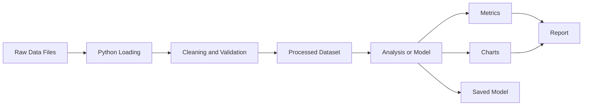
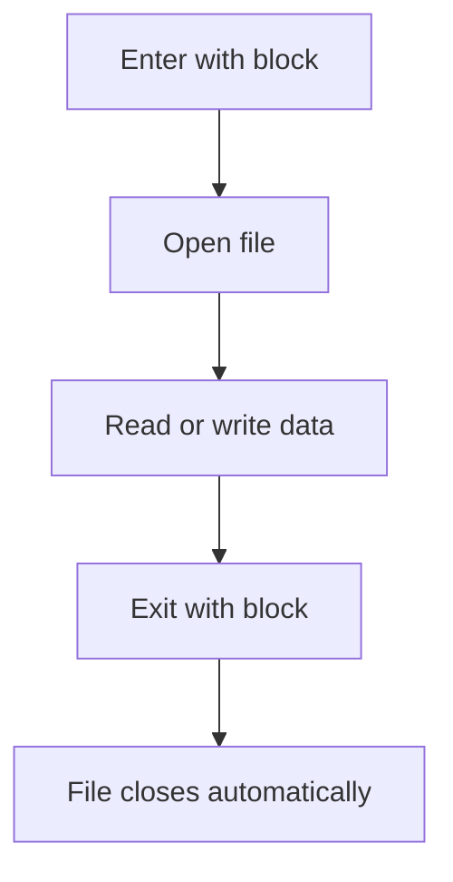
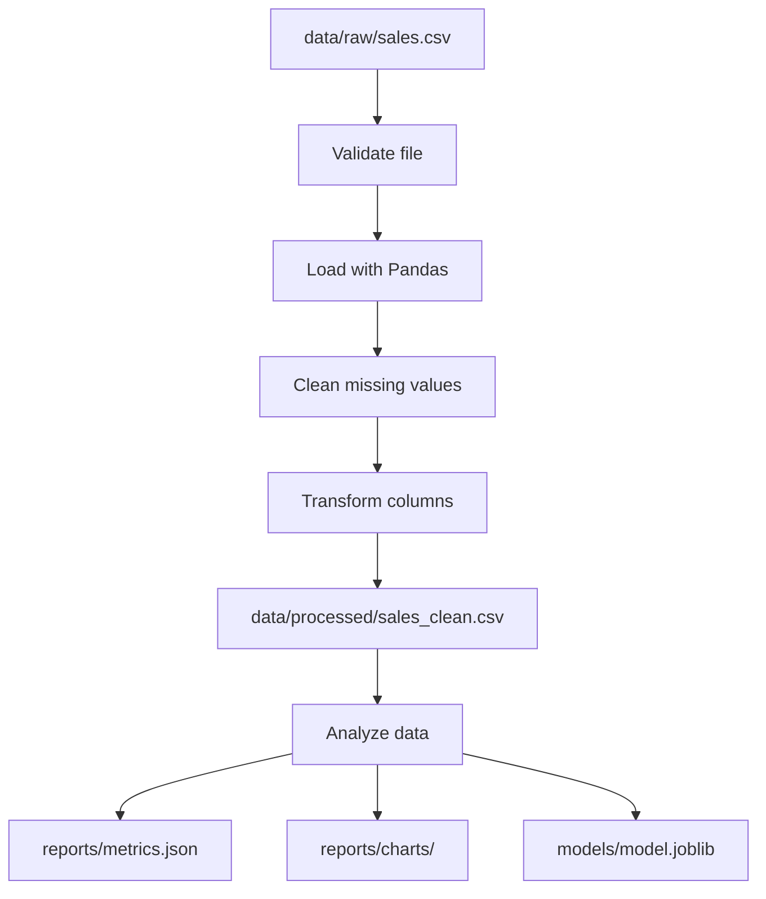
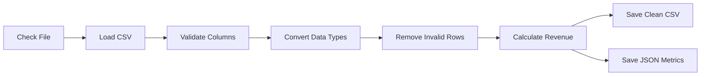
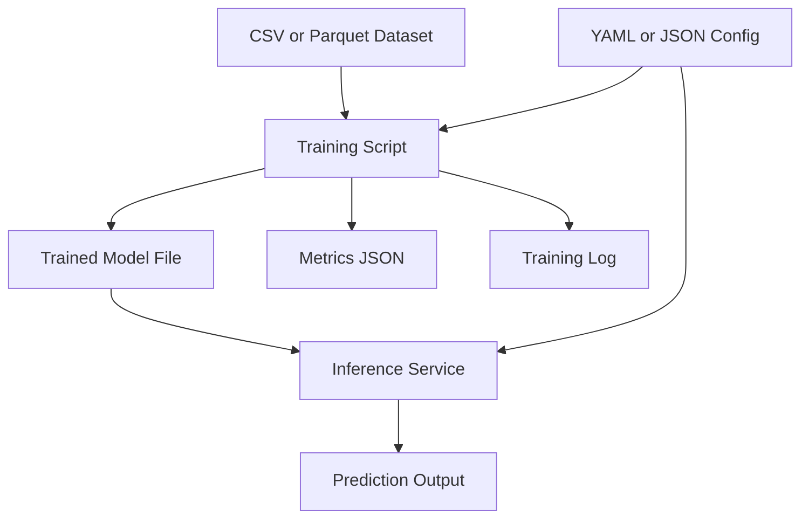
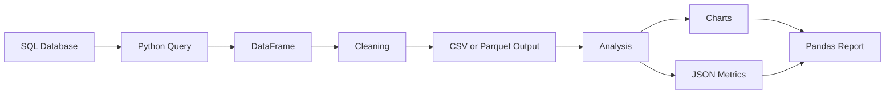

# 007 — File Handling

**Course:** 02 — Coding and Exploratory Data Analysis
**Module:** Module 04 — Coding for Data Science
**Content Group:** Python Foundation
**Roadmap Source:** Coding for Data Science / Python Foundation
**Lesson Type:** Coding
**Order in Module:** 007
**Suggested Duration:** 20 minutes

---

## 1. Overview

This lesson introduces **file handling** in the context of AI and Data Science.

Data scientists regularly work with files containing:

* Raw datasets
* Configuration values
* Model parameters
* Experiment results
* Application logs
* Reports and visualizations
* Serialized machine learning models

After completing this lesson, you should understand how to read, write, update, organize, and validate files using Python.

File handling is an important part of building reproducible workflows because data analysis usually begins with loading data from a file and ends with saving an output artifact.

---

## 2. Learning Objectives

By the end of this lesson, you should be able to:

* Explain file handling in your own words.
* Open and close files safely in Python.
* Read text files using different methods.
* Write and append data to files.
* Understand common file modes.
* Work with file paths using `pathlib`.
* Handle missing files and other file-related errors.
* Load and save common Data Science file formats.
* Organize raw data, processed data, models, and reports.
* Build a small reproducible file-processing workflow.

---

## 3. Why File Handling Matters in Data Science

A typical Data Science project depends on several types of files.



Examples include:

| File type           | Common use                           |
| ------------------- | ------------------------------------ |
| `.csv`              | Tabular datasets                     |
| `.json`             | APIs, configuration, nested data     |
| `.txt`              | Logs, notes, prompts, raw text       |
| `.parquet`          | Efficient analytical datasets        |
| `.xlsx`             | Business spreadsheets                |
| `.pkl` or `.joblib` | Serialized Python objects and models |
| `.yaml`             | Configuration files                  |
| `.log`              | Application and pipeline logs        |

Without proper file handling, a workflow may:

* Fail when moved to another computer.
* Accidentally overwrite raw data.
* Produce outputs that cannot be reproduced.
* Use outdated or incorrect files.
* Lose experiment results.
* Mix source data with generated artifacts.

---

## 4. Core Concepts

### 4.1 Opening a File

Python provides the built-in `open()` function.

```python
file = open("notes.txt", "r", encoding="utf-8")
content = file.read()
file.close()

print(content)
```

The general syntax is:

```python
open(file_path, mode, encoding)
```

Important arguments:

| Argument    | Description                         |
| ----------- | ----------------------------------- |
| `file_path` | Location of the file                |
| `mode`      | How the file will be accessed       |
| `encoding`  | Character encoding, usually `utf-8` |

Although manually calling `close()` works, the recommended method is to use a context manager.

---

### 4.2 Using the `with` Statement

The `with` statement automatically closes the file, even if an error occurs.

```python
with open("notes.txt", "r", encoding="utf-8") as file:
    content = file.read()

print(content)
```

The file is available only inside the `with` block.



This is the preferred pattern for working with files in Python.

---

## 5. File Modes

The mode determines how Python interacts with a file.

| Mode  | Meaning            | Behavior                                 |
| ----- | ------------------ | ---------------------------------------- |
| `"r"` | Read               | Opens an existing file for reading       |
| `"w"` | Write              | Creates or overwrites a file             |
| `"a"` | Append             | Adds content to the end of a file        |
| `"x"` | Exclusive creation | Creates a file and fails if it exists    |
| `"b"` | Binary mode        | Used for images, models, and binary data |
| `"t"` | Text mode          | Default mode for text files              |
| `"+"` | Read and write     | Enables both operations                  |

Examples:

```python
open("data.txt", "r")
open("report.txt", "w")
open("pipeline.log", "a")
open("image.png", "rb")
open("output.bin", "wb")
```

### Important Warning

Opening an existing file with `"w"` immediately removes its previous content.

```python
with open("important.txt", "w", encoding="utf-8") as file:
    file.write("New content")
```

Use `"a"` when you need to preserve the existing content.

---

## 6. Reading Text Files

### 6.1 Read the Entire File

```python
with open("notes.txt", "r", encoding="utf-8") as file:
    content = file.read()

print(content)
```

This method is convenient for small files.

However, it may consume too much memory when the file is very large.

---

### 6.2 Read One Line

```python
with open("notes.txt", "r", encoding="utf-8") as file:
    first_line = file.readline()

print(first_line)
```

Calling `readline()` repeatedly returns the next line.

```python
with open("notes.txt", "r", encoding="utf-8") as file:
    line_1 = file.readline()
    line_2 = file.readline()
```

---

### 6.3 Read All Lines into a List

```python
with open("notes.txt", "r", encoding="utf-8") as file:
    lines = file.readlines()

print(lines)
```

Example output:

```python
[
    "First line\n",
    "Second line\n",
    "Third line\n"
]
```

---

### 6.4 Read a File Line by Line

For large text files, iterate directly over the file object.

```python
with open("application.log", "r", encoding="utf-8") as file:
    for line in file:
        print(line.strip())
```

This approach processes one line at a time and is more memory-efficient.

```text
Large file
    |
    v
Read one line
    |
    v
Process the line
    |
    v
Discard from memory
    |
    v
Read the next line
```

---

## 7. Writing Files

### 7.1 Write Text to a File

```python
report = """
Sales Analysis
--------------
Total revenue: 125000
Average order value: 52.40
"""

with open("sales_report.txt", "w", encoding="utf-8") as file:
    file.write(report)
```

The `write()` method returns the number of characters written.

```python
with open("result.txt", "w", encoding="utf-8") as file:
    characters_written = file.write("Model accuracy: 0.91")

print(characters_written)
```

---

### 7.2 Write Multiple Lines

Use `writelines()` to write an iterable of strings.

```python
metrics = [
    "accuracy: 0.91\n",
    "precision: 0.88\n",
    "recall: 0.86\n"
]

with open("metrics.txt", "w", encoding="utf-8") as file:
    file.writelines(metrics)
```

`writelines()` does not automatically insert newline characters.

Therefore, include `\n` where needed.

---

### 7.3 Append Content

Append mode adds data to the end of an existing file.

```python
with open("experiment.log", "a", encoding="utf-8") as file:
    file.write("Experiment 04: accuracy=0.923\n")
```

Appending is useful for:

* Training logs
* Audit records
* Pipeline events
* Experiment histories
* Error reports

---

## 8. Working with File Paths

Hard-coded file paths often make projects difficult to move or reproduce.

Avoid this:

```python
file_path = "C:/Users/username/Desktop/project/data/sales.csv"
```

Prefer relative paths:

```python
file_path = "data/raw/sales.csv"
```

A common project structure is:

```text
data-science-project/
├── data/
│   ├── raw/
│   │   └── sales.csv
│   └── processed/
│       └── sales_clean.csv
├── models/
│   └── sales_model.joblib
├── notebooks/
│   └── exploration.ipynb
├── reports/
│   └── sales_summary.txt
├── src/
│   └── process_data.py
├── requirements.txt
└── README.md
```

---

## 9. Using `pathlib`

The `pathlib` module provides an object-oriented way to work with file paths.

```python
from pathlib import Path

project_root = Path(".")
data_path = project_root / "data" / "raw" / "sales.csv"

print(data_path)
```

### 9.1 Check Whether a File Exists

```python
from pathlib import Path

file_path = Path("data/raw/sales.csv")

if file_path.exists():
    print("The file exists.")
else:
    print("The file does not exist.")
```

---

### 9.2 Check Whether a Path Is a File or Directory

```python
if file_path.is_file():
    print("This path points to a file.")

data_directory = Path("data")

if data_directory.is_dir():
    print("This path points to a directory.")
```

---

### 9.3 Create Directories

```python
from pathlib import Path

output_directory = Path("data/processed")
output_directory.mkdir(parents=True, exist_ok=True)
```

Arguments:

* `parents=True` creates missing parent directories.
* `exist_ok=True` prevents an error if the directory already exists.

---

### 9.4 Get File Information

```python
file_path = Path("data/raw/sales.csv")

print(file_path.name)
print(file_path.stem)
print(file_path.suffix)
print(file_path.parent)
```

Example output:

```text
sales.csv
sales
.csv
data/raw
```

---

### 9.5 Find Files with `glob`

```python
from pathlib import Path

data_directory = Path("data/raw")

csv_files = list(data_directory.glob("*.csv"))

for csv_file in csv_files:
    print(csv_file)
```

Search recursively:

```python
csv_files = list(Path("data").rglob("*.csv"))
```

---

## 10. Error Handling

File operations may fail for several reasons:

* The file does not exist.
* The user does not have permission.
* The path points to a directory.
* The file encoding is incorrect.
* The file is corrupted.
* The disk is full.

Use `try` and `except` to handle expected errors.

```python
from pathlib import Path

file_path = Path("data/raw/sales.csv")

try:
    with file_path.open("r", encoding="utf-8") as file:
        content = file.read()
except FileNotFoundError:
    print(f"File not found: {file_path}")
except PermissionError:
    print(f"Permission denied: {file_path}")
except UnicodeDecodeError:
    print(f"Unable to decode file: {file_path}")
```

A reusable function may raise a clearer error:

```python
from pathlib import Path


def read_text_file(file_path: str) -> str:
    path = Path(file_path)

    if not path.exists():
        raise FileNotFoundError(f"Input file does not exist: {path}")

    if not path.is_file():
        raise ValueError(f"Expected a file but received: {path}")

    return path.read_text(encoding="utf-8")
```

Usage:

```python
content = read_text_file("notes.txt")
print(content)
```

---

## 11. File Encodings

Text files are stored using character encodings.

UTF-8 is the recommended default because it supports many languages.

```python
with open("vietnamese_notes.txt", "r", encoding="utf-8") as file:
    content = file.read()
```

An encoding mismatch may produce:

```text
UnicodeDecodeError
```

Some older files may use encodings such as:

* `latin-1`
* `cp1252`
* `utf-16`

Example:

```python
with open("legacy_data.txt", "r", encoding="latin-1") as file:
    content = file.read()
```

Do not silently ignore encoding errors unless you understand the consequences.

This can hide corrupted characters:

```python
with open(
    "legacy_data.txt",
    "r",
    encoding="utf-8",
    errors="ignore"
) as file:
    content = file.read()
```

---

## 12. Working with CSV Files

CSV is one of the most common formats in Data Science.

### 12.1 Using Python's `csv` Module

```python
import csv

with open("data/raw/sales.csv", "r", encoding="utf-8", newline="") as file:
    reader = csv.DictReader(file)

    for row in reader:
        print(row)
```

Each row is represented as a dictionary.

```python
{
    "order_id": "1001",
    "product": "Keyboard",
    "quantity": "2",
    "price": "45.50"
}
```

Writing CSV data:

```python
import csv

rows = [
    {"product": "Keyboard", "revenue": 91.0},
    {"product": "Mouse", "revenue": 52.0}
]

with open(
    "data/processed/product_revenue.csv",
    "w",
    encoding="utf-8",
    newline=""
) as file:
    writer = csv.DictWriter(
        file,
        fieldnames=["product", "revenue"]
    )

    writer.writeheader()
    writer.writerows(rows)
```

---

### 12.2 Using Pandas

Pandas is usually more convenient for analytical workflows.

```python
import pandas as pd

sales = pd.read_csv("data/raw/sales.csv")

print(sales.head())
print(sales.info())
```

Save a processed DataFrame:

```python
sales.to_csv(
    "data/processed/sales_clean.csv",
    index=False
)
```

Why use `index=False`?

Without it, Pandas writes the DataFrame index as an additional column.

---

## 13. Working with JSON Files

JSON is commonly used for:

* API responses
* Experiment configurations
* Model metadata
* Nested application data

### 13.1 Reading JSON

```python
import json

with open("config.json", "r", encoding="utf-8") as file:
    config = json.load(file)

print(config)
```

Example file:

```json
{
  "model_name": "random_forest",
  "test_size": 0.2,
  "random_state": 42
}
```

Access values:

```python
print(config["model_name"])
print(config["test_size"])
```

---

### 13.2 Writing JSON

```python
import json

metrics = {
    "accuracy": 0.91,
    "precision": 0.88,
    "recall": 0.86
}

with open("reports/metrics.json", "w", encoding="utf-8") as file:
    json.dump(
        metrics,
        file,
        indent=2,
        ensure_ascii=False
    )
```

Important parameters:

| Parameter            | Purpose                          |
| -------------------- | -------------------------------- |
| `indent=2`           | Makes the file human-readable    |
| `ensure_ascii=False` | Preserves non-English characters |

---

## 14. Working with Binary Files

Binary mode is required for images, audio files, serialized models, and other non-text content.

### 14.1 Copy a Binary File

```python
with open("input_image.png", "rb") as source:
    image_data = source.read()

with open("output_image.png", "wb") as destination:
    destination.write(image_data)
```

---

### 14.2 Save a Machine Learning Model

Using `joblib`:

```python
from joblib import dump, load
from sklearn.ensemble import RandomForestClassifier

model = RandomForestClassifier(random_state=42)

dump(model, "models/random_forest.joblib")
```

Load the model:

```python
loaded_model = load("models/random_forest.joblib")
```

Only load serialized objects from trusted sources. Malicious serialized files can execute unsafe code.

---

## 15. Data Science File-Handling Workflow

A reproducible workflow should separate raw inputs from generated outputs.



Recommended principles:

1. Never modify the original raw data manually.
2. Store processed data in a separate directory.
3. Save cleaning logic in code.
4. Use meaningful file names.
5. Record configuration and metadata.
6. Validate input and output paths.
7. Avoid machine-specific absolute paths.
8. Document how each file was created.

---

## 16. Practical Demo: Sales File Pipeline

Suppose `data/raw/sales.csv` contains:

```csv
order_id,product,quantity,unit_price
1001,Keyboard,2,45.50
1002,Mouse,4,18.00
1003,Monitor,1,210.00
1004,Keyboard,3,45.50
1005,Mouse,,18.00
```

### 16.1 Complete Processing Script

```python
from pathlib import Path
import json

import pandas as pd


RAW_DATA_PATH = Path("data/raw/sales.csv")
PROCESSED_DATA_PATH = Path("data/processed/sales_clean.csv")
METRICS_PATH = Path("reports/sales_metrics.json")


def load_sales_data(file_path: Path) -> pd.DataFrame:
    if not file_path.exists():
        raise FileNotFoundError(f"Sales file not found: {file_path}")

    if file_path.suffix.lower() != ".csv":
        raise ValueError("The input file must be a CSV file.")

    return pd.read_csv(file_path)


def clean_sales_data(data: pd.DataFrame) -> pd.DataFrame:
    required_columns = {
        "order_id",
        "product",
        "quantity",
        "unit_price"
    }

    missing_columns = required_columns - set(data.columns)

    if missing_columns:
        raise ValueError(
            f"Missing required columns: {sorted(missing_columns)}"
        )

    cleaned = data.copy()

    cleaned["quantity"] = pd.to_numeric(
        cleaned["quantity"],
        errors="coerce"
    )

    cleaned["unit_price"] = pd.to_numeric(
        cleaned["unit_price"],
        errors="coerce"
    )

    cleaned = cleaned.dropna(
        subset=["quantity", "unit_price"]
    )

    cleaned = cleaned[
        (cleaned["quantity"] > 0)
        & (cleaned["unit_price"] >= 0)
    ]

    cleaned["revenue"] = (
        cleaned["quantity"] * cleaned["unit_price"]
    )

    return cleaned


def calculate_metrics(data: pd.DataFrame) -> dict:
    return {
        "number_of_orders": int(data["order_id"].nunique()),
        "total_units": int(data["quantity"].sum()),
        "total_revenue": round(float(data["revenue"].sum()), 2),
        "average_order_revenue": round(
            float(data["revenue"].mean()),
            2
        )
    }


def save_outputs(
    data: pd.DataFrame,
    metrics: dict
) -> None:
    PROCESSED_DATA_PATH.parent.mkdir(
        parents=True,
        exist_ok=True
    )

    METRICS_PATH.parent.mkdir(
        parents=True,
        exist_ok=True
    )

    data.to_csv(
        PROCESSED_DATA_PATH,
        index=False
    )

    with METRICS_PATH.open(
        "w",
        encoding="utf-8"
    ) as file:
        json.dump(
            metrics,
            file,
            indent=2
        )


def main() -> None:
    sales = load_sales_data(RAW_DATA_PATH)
    cleaned_sales = clean_sales_data(sales)
    metrics = calculate_metrics(cleaned_sales)

    save_outputs(cleaned_sales, metrics)

    print("Processing completed successfully.")
    print(f"Processed data: {PROCESSED_DATA_PATH}")
    print(f"Metrics: {METRICS_PATH}")


if __name__ == "__main__":
    main()
```

---

## 17. Understanding the Demo

The processing pipeline performs the following steps:



The code is divided into reusable functions:

| Function              | Responsibility                     |
| --------------------- | ---------------------------------- |
| `load_sales_data()`   | Validates and loads the input file |
| `clean_sales_data()`  | Cleans and transforms the data     |
| `calculate_metrics()` | Produces summary metrics           |
| `save_outputs()`      | Saves generated artifacts          |
| `main()`              | Coordinates the pipeline           |

This structure is easier to test, debug, reuse, and convert into a scheduled pipeline or API.

---

## 18. File Validation

A reliable pipeline should validate files before processing them.

### 18.1 Validate the Extension

```python
from pathlib import Path


def validate_csv_file(file_path: Path) -> None:
    if file_path.suffix.lower() != ".csv":
        raise ValueError(
            f"Expected a CSV file, received: {file_path.suffix}"
        )
```

---

### 18.2 Validate File Size

```python
def validate_non_empty_file(file_path: Path) -> None:
    if file_path.stat().st_size == 0:
        raise ValueError(f"The file is empty: {file_path}")
```

---

### 18.3 Validate Required Columns

```python
def validate_columns(
    dataframe,
    required_columns: set[str]
) -> None:
    missing_columns = required_columns - set(dataframe.columns)

    if missing_columns:
        raise ValueError(
            f"Missing columns: {sorted(missing_columns)}"
        )
```

---

### 18.4 Validate Before Processing

```python
from pathlib import Path

import pandas as pd


def load_validated_csv(file_path: Path) -> pd.DataFrame:
    if not file_path.exists():
        raise FileNotFoundError(file_path)

    if not file_path.is_file():
        raise ValueError(f"Not a file: {file_path}")

    if file_path.suffix.lower() != ".csv":
        raise ValueError("Only CSV files are supported.")

    if file_path.stat().st_size == 0:
        raise ValueError("The CSV file is empty.")

    return pd.read_csv(file_path)
```

---

## 19. Reproducibility and Metadata

Saving the processed dataset alone may not be enough.

A useful pipeline can also save metadata describing:

* Input file
* Output file
* Processing timestamp
* Number of input rows
* Number of output rows
* Removed rows
* Script version
* Configuration
* Data quality warnings

```python
from datetime import datetime, timezone
import json

metadata = {
    "input_file": "data/raw/sales.csv",
    "output_file": "data/processed/sales_clean.csv",
    "processed_at": datetime.now(timezone.utc).isoformat(),
    "input_rows": 5,
    "output_rows": 4,
    "removed_rows": 1,
    "pipeline_version": "1.0.0"
}

with open(
    "data/processed/sales_metadata.json",
    "w",
    encoding="utf-8"
) as file:
    json.dump(metadata, file, indent=2)
```

This makes it easier to trace how an output was produced.

---

## 20. Safer File Writing

A pipeline may fail while writing an output file.

One safer strategy is:

1. Write to a temporary file.
2. Confirm that the write succeeded.
3. Replace the final output file.

```python
from pathlib import Path


def safe_write_text(
    output_path: Path,
    content: str
) -> None:
    output_path.parent.mkdir(
        parents=True,
        exist_ok=True
    )

    temporary_path = output_path.with_suffix(
        output_path.suffix + ".tmp"
    )

    temporary_path.write_text(
        content,
        encoding="utf-8"
    )

    temporary_path.replace(output_path)
```

This reduces the risk of leaving a partially written output.

---

## 21. Common Mistakes

### 21.1 Forgetting to Close the File

Bad:

```python
file = open("data.txt", "r")
content = file.read()
```

Better:

```python
with open("data.txt", "r", encoding="utf-8") as file:
    content = file.read()
```

---

### 21.2 Overwriting a File Accidentally

```python
open("raw_data.csv", "w")
```

Opening the file in write mode removes its contents.

Use a different output path for processed data.

```text
data/raw/sales.csv
data/processed/sales_clean.csv
```

---

### 21.3 Using Absolute Machine-Specific Paths

Bad:

```python
path = "C:/Users/An/Desktop/project/data.csv"
```

Better:

```python
from pathlib import Path

path = Path("data/raw/data.csv")
```

---

### 21.4 Modifying Raw Data Manually

Manual edits are difficult to reproduce and audit.

Bad workflow:

```text
Open CSV in spreadsheet
        |
        v
Delete rows manually
        |
        v
Save over original file
```

Better workflow:

```text
Keep original raw file
        |
        v
Write cleaning code
        |
        v
Save a new processed file
```

---

### 21.5 Reading a Large File Entirely into Memory

Potentially problematic:

```python
content = file.read()
```

Better for large text files:

```python
for line in file:
    process(line)
```

For large CSV files, use chunking:

```python
import pandas as pd

for chunk in pd.read_csv(
    "large_dataset.csv",
    chunksize=100_000
):
    print(chunk.shape)
```

---

### 21.6 Ignoring Data Types

CSV columns may be loaded with incorrect types.

```python
sales = pd.read_csv(
    "sales.csv",
    dtype={
        "order_id": "string",
        "product": "string"
    }
)
```

Dates may require explicit parsing:

```python
sales = pd.read_csv(
    "sales.csv",
    parse_dates=["order_date"]
)
```

---

### 21.7 Saving Outputs Without Documentation

A file such as `final_v2_new_fixed.csv` does not explain:

* What was changed
* Which source file was used
* Which script created it
* Whether it is the latest version

Use clear names and metadata:

```text
sales_clean_2026_07.csv
sales_clean_metadata.json
```

---

### 21.8 Trusting File Extensions

A file named `sales.csv` may still contain invalid content.

Validate both the extension and the actual data structure.

```python
try:
    data = pd.read_csv("sales.csv")
except pd.errors.ParserError as error:
    raise ValueError("The file is not a valid CSV.") from error
```

---

## 22. File Handling in an AI Workflow

File handling appears throughout the machine learning lifecycle.



Examples:

### Training Data

```python
training_data = pd.read_parquet(
    "data/processed/train.parquet"
)
```

### Configuration

```python
import json

with open("config/train.json", encoding="utf-8") as file:
    training_config = json.load(file)
```

### Saved Model

```python
from joblib import dump

dump(model, "models/customer_churn.joblib")
```

### Metrics

```python
metrics = {
    "accuracy": 0.91,
    "f1_score": 0.89
}
```

### Predictions

```python
predictions.to_csv(
    "outputs/predictions.csv",
    index=False
)
```

---

## 23. Practical Exercise

Build a small file-processing notebook or script using a CSV dataset.

### Suggested Dataset

Create a file named `sales.csv` with these columns:

```csv
order_id,order_date,product,category,quantity,unit_price
1001,2026-01-05,Laptop,Electronics,1,1200
1002,2026-01-05,Mouse,Accessories,3,25
1003,2026-01-06,Keyboard,Accessories,2,60
1004,2026-01-07,Monitor,Electronics,1,320
1005,2026-01-07,Mouse,Accessories,,25
```

### Tasks

1. Create the following directory structure:

```text
file-handling-project/
├── data/
│   ├── raw/
│   └── processed/
├── reports/
├── notebooks/
└── src/
```

2. Save the original dataset in `data/raw/`.

3. Load the CSV file with Pandas.

4. Validate that the required columns exist.

5. Convert `order_date` to a datetime column.

6. Convert `quantity` and `unit_price` to numeric values.

7. Remove or document invalid rows.

8. Create a `revenue` column:

```python
revenue = quantity * unit_price
```

9. Save the cleaned data to:

```text
data/processed/sales_clean.csv
```

10. Save summary metrics to:

```text
reports/sales_metrics.json
```

11. Produce at least three insights with charts or tables.

---

## 24. Suggested Insights

Possible analytical questions include:

### Insight 1: Total Revenue

```python
total_revenue = sales["revenue"].sum()
```

### Insight 2: Revenue by Category

```python
revenue_by_category = (
    sales.groupby("category")["revenue"]
    .sum()
    .sort_values(ascending=False)
)
```

### Insight 3: Best-Selling Product

```python
best_selling_product = (
    sales.groupby("product")["quantity"]
    .sum()
    .sort_values(ascending=False)
)
```

### Insight 4: Daily Revenue

```python
daily_revenue = (
    sales.groupby("order_date")["revenue"]
    .sum()
)
```

For every chart or table, write a clear interpretation.

Weak insight:

> Electronics has the highest bar.

Better insight:

> Electronics generated the highest revenue because high-priced products such as laptops and monitors contributed more revenue despite having fewer units sold.

---

## 25. Mini Challenge

Create a function that loads all CSV files from a directory and combines them.

```python
from pathlib import Path

import pandas as pd


def combine_csv_files(
    input_directory: str,
    output_file: str
) -> pd.DataFrame:
    input_path = Path(input_directory)
    csv_files = list(input_path.glob("*.csv"))

    if not csv_files:
        raise FileNotFoundError(
            f"No CSV files found in {input_path}"
        )

    dataframes = []

    for csv_file in csv_files:
        dataframe = pd.read_csv(csv_file)
        dataframe["source_file"] = csv_file.name
        dataframes.append(dataframe)

    combined = pd.concat(
        dataframes,
        ignore_index=True
    )

    output_path = Path(output_file)
    output_path.parent.mkdir(
        parents=True,
        exist_ok=True
    )

    combined.to_csv(
        output_path,
        index=False
    )

    return combined
```

Usage:

```python
combined_sales = combine_csv_files(
    input_directory="data/monthly",
    output_file="data/processed/all_sales.csv"
)
```

This pattern is commonly used when data arrives as one file per day, month, region, or business unit.

---

## 26. Completion Checklist

* [ ] I can explain file handling in one or two minutes.
* [ ] I understand the difference between read, write, and append modes.
* [ ] I use `with` to open files safely.
* [ ] I can read and write text files.
* [ ] I can work with CSV and JSON files.
* [ ] I can use `pathlib` to construct file paths.
* [ ] I can create directories programmatically.
* [ ] I can handle missing files with exceptions.
* [ ] I keep raw and processed data separate.
* [ ] I can validate file types, sizes, and required columns.
* [ ] I can save processed datasets and analytical metrics.
* [ ] I have created a notebook or script for this lesson.
* [ ] I have documented at least one caveat or assumption.

---

## 27. Related Outcome

Use Python, SQL, Data Science libraries, notebooks, and Git to build reproducible data workflows.

File handling supports this outcome by connecting code to persistent inputs and outputs.

```text
Code + Input Files + Configuration
                  |
                  v
          Reproducible Process
                  |
                  v
Data + Metrics + Charts + Models + Reports
```

---

## 28. Related Project

### Mini Project: SQL and Python Sales Analysis

Build a small analytical workflow using a sales database and Pandas.

Suggested workflow:



Suggested deliverables:

```text
sales-analysis/
├── data/
│   ├── raw/
│   └── processed/
├── notebooks/
│   └── sales_analysis.ipynb
├── reports/
│   ├── charts/
│   └── metrics.json
├── src/
│   ├── extract.py
│   ├── transform.py
│   └── report.py
├── README.md
└── requirements.txt
```

The README should explain:

* The dataset source
* The project structure
* How to install dependencies
* How to run the analysis
* Which files are generated
* Key assumptions and limitations

---

## 29. Summary

**File handling** is a foundational Python skill for AI and Data Science.

A reliable workflow should:

1. Read source files safely.
2. Validate file paths and file contents.
3. Keep raw data unchanged.
4. Perform cleaning and transformation in code.
5. Save processed data separately.
6. Record metrics and metadata.
7. Handle errors clearly.
8. Use portable paths.
9. Document how outputs were generated.

The central workflow is:

```text
Raw File
   |
   v
Validate
   |
   v
Load
   |
   v
Clean and Transform
   |
   v
Analyze or Train
   |
   v
Save Data, Metrics, Models and Reports
```

Turn this lesson into a concrete portfolio artifact such as:

* A reproducible notebook
* A data-cleaning script
* A CSV-processing pipeline
* A model-training workflow
* An API that accepts and validates uploaded files
* A report generator
* A documented Git repository

File handling becomes valuable when it transforms a manual analysis into a repeatable and reliable data workflow.

---

# Bài luyện tập

## Mục tiêu


## Đề bài


## Yêu cầu hoàn thành

- [ ] 
- [ ] 
- [ ] 

## Kết quả / lời giải


## Ghi chú
