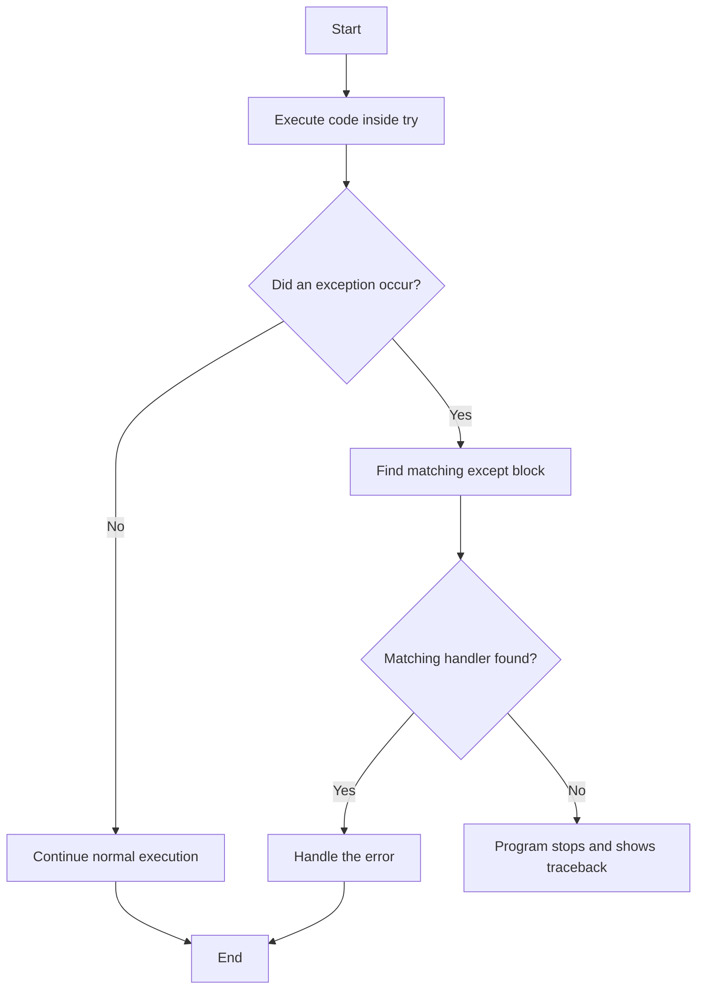
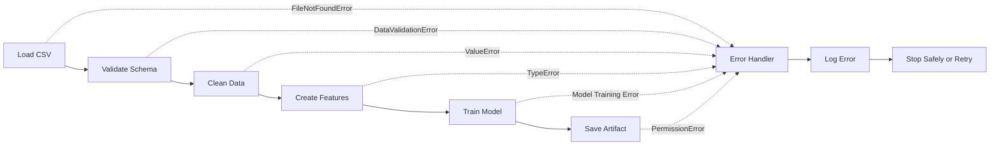

# 008 - Error Handling

**Course:** 02 - Coding and EDA
**Module:** Module 04 - Coding for Data Science
**Topic Group:** Python Foundation
**Roadmap Source:** Coding for Data Science / Python Foundation
**Lesson Type:** Coding
**Lesson Order:** 008
**Suggested Duration:** 20 minutes

---

## 1. Overview

**Error handling** is the process of detecting, managing, and responding to problems that occur while a program is running.

In AI and Data Science workflows, errors may appear when:

* A dataset file does not exist.
* A CSV file has an unexpected format.
* A column is missing.
* A value cannot be converted to a number.
* A database or API connection fails.
* A model receives invalid input.
* A pipeline runs out of memory.
* A prediction service receives an incorrect request.

Without proper error handling, a notebook, script, data pipeline, or API may stop unexpectedly and provide little information about what went wrong.

Good error handling makes data workflows:

* More reliable
* Easier to debug
* Safer to run
* Easier to reproduce
* Easier to maintain
* More suitable for production

---

## 2. Learning Objectives

After completing this lesson, you should be able to:

* Explain error handling in your own words.
* Distinguish between syntax errors, runtime errors, and logical errors.
* Use `try`, `except`, `else`, and `finally`.
* Catch specific Python exceptions.
* Raise exceptions when input data is invalid.
* Create simple custom exceptions.
* Add useful error messages to data-processing code.
* Apply error handling to notebooks, scripts, pipelines, and APIs.

---

## 3. Why Error Handling Matters in Data Science

A typical data workflow contains many possible failure points.

```text
Raw data
   ↓
Load data
   ↓
Validate schema
   ↓
Clean and transform
   ↓
Analyze or train model
   ↓
Generate report or prediction
```

For example:

* The **load step** may fail because the file is missing.
* The **validation step** may fail because required columns are absent.
* The **transformation step** may fail because values have incorrect types.
* The **training step** may fail because the dataset contains no valid rows.
* The **deployment step** may fail because a request contains invalid input.

A reliable workflow should detect these problems and return clear, actionable information.

---

## 4. Types of Errors

### 4.1 Syntax Errors

A syntax error occurs when Python cannot understand the structure of the code.

```python
if score > 0
    print(score)
```

The colon after the condition is missing.

Correct version:

```python
if score > 0:
    print(score)
```

Syntax errors usually prevent the program from starting.

---

### 4.2 Runtime Errors

A runtime error occurs while the program is running.

```python
result = 10 / 0
```

This raises:

```text
ZeroDivisionError
```

Other common runtime errors include:

* `FileNotFoundError`
* `KeyError`
* `ValueError`
* `TypeError`
* `IndexError`
* `AttributeError`

---

### 4.3 Logical Errors

A logical error does not necessarily stop the program. Instead, the program produces an incorrect result.

```python
revenue = 1000
cost = 400

profit = revenue + cost
```

The code runs, but the formula is incorrect.

Correct version:

```python
profit = revenue - cost
```

Logical errors are often more difficult to detect because no exception is raised.

---

## 5. Basic Exception Handling

Python uses `try` and `except` to handle runtime errors.

```python
try:
    value = int(input("Enter a number: "))
    result = 100 / value
    print(result)
except ValueError:
    print("The input must be a valid integer.")
except ZeroDivisionError:
    print("The number must not be zero.")
```

### Execution Flow



---

## 6. The `try`, `except`, `else`, and `finally` Structure

A complete exception-handling structure may contain four parts.

```python
try:
    number = int("25")
except ValueError:
    print("The value cannot be converted to an integer.")
else:
    print(f"Conversion succeeded: {number}")
finally:
    print("The conversion attempt has finished.")
```

### `try`

Contains code that may raise an exception.

### `except`

Handles a specific exception.

### `else`

Runs only when no exception occurs.

### `finally`

Runs whether an exception occurs or not.

The `finally` block is useful for cleanup operations such as:

* Closing files
* Closing database connections
* Releasing resources
* Removing temporary files
* Recording that a process has finished

---

## 7. Catch Specific Exceptions

Avoid catching every exception without identifying its type.

Poor practice:

```python
try:
    data = load_data()
except:
    print("Something went wrong.")
```

This approach hides important information and makes debugging difficult.

Better practice:

```python
try:
    data = load_data()
except FileNotFoundError:
    print("The dataset file could not be found.")
except PermissionError:
    print("The program does not have permission to read the file.")
except ValueError as error:
    print(f"The dataset contains an invalid value: {error}")
```

Catching specific exceptions helps you:

* Understand the actual failure.
* Return a more useful message.
* Handle different problems differently.
* Avoid hiding programming bugs.

---

## 8. Reading a CSV File Safely

A common Data Science task is loading a CSV file with Pandas.

```python
from pathlib import Path

import pandas as pd


def load_csv(file_path: str) -> pd.DataFrame:
    path = Path(file_path)

    if not path.exists():
        raise FileNotFoundError(f"Dataset not found: {path}")

    try:
        dataframe = pd.read_csv(path)
    except pd.errors.EmptyDataError as error:
        raise ValueError("The CSV file is empty.") from error
    except pd.errors.ParserError as error:
        raise ValueError("The CSV file has an invalid structure.") from error

    if dataframe.empty:
        raise ValueError("The dataset contains no rows.")

    return dataframe
```

Usage:

```python
try:
    sales_df = load_csv("data/sales.csv")
except FileNotFoundError as error:
    print(f"File error: {error}")
except ValueError as error:
    print(f"Data error: {error}")
else:
    print(f"Loaded {len(sales_df):,} rows successfully.")
```

---

## 9. Validating Required Columns

A dataset may exist but still have an invalid schema.

```python
import pandas as pd


def validate_sales_schema(dataframe: pd.DataFrame) -> None:
    required_columns = {
        "order_id",
        "product",
        "quantity",
        "unit_price",
    }

    missing_columns = required_columns - set(dataframe.columns)

    if missing_columns:
        missing_text = ", ".join(sorted(missing_columns))
        raise ValueError(f"Missing required columns: {missing_text}")
```

Usage:

```python
try:
    sales_df = pd.read_csv("data/sales.csv")
    validate_sales_schema(sales_df)
except FileNotFoundError:
    print("The sales dataset does not exist.")
except ValueError as error:
    print(f"Dataset validation failed: {error}")
else:
    print("The dataset schema is valid.")
```

---

## 10. Handling Invalid Numeric Values

Real-world datasets often contain values that cannot be converted directly.

Example data:

```text
unit_price
120.50
85.00
unknown
150.25
```

One strategy is to convert invalid values into missing values.

```python
import pandas as pd


sales_df["unit_price"] = pd.to_numeric(
    sales_df["unit_price"],
    errors="coerce",
)
```

You can then count and inspect the invalid rows.

```python
invalid_price_mask = sales_df["unit_price"].isna()
invalid_price_count = invalid_price_mask.sum()

if invalid_price_count > 0:
    print(f"Warning: {invalid_price_count} invalid price values were found.")
```

For strict validation, raise an exception instead.

```python
if sales_df["unit_price"].isna().any():
    raise ValueError("The unit_price column contains invalid numeric values.")
```

---

## 11. Raising Exceptions

Use `raise` when your program detects invalid conditions.

```python
def calculate_average(values: list[float]) -> float:
    if not values:
        raise ValueError("The values list must not be empty.")

    return sum(values) / len(values)
```

Usage:

```python
try:
    average = calculate_average([])
except ValueError as error:
    print(f"Cannot calculate the average: {error}")
```

Raising exceptions is useful for enforcing:

* Input requirements
* Business rules
* Dataset schemas
* Valid value ranges
* Model constraints
* API request formats

---

## 12. Input Validation Example

```python
def calculate_revenue(quantity: int, unit_price: float) -> float:
    if not isinstance(quantity, int):
        raise TypeError("quantity must be an integer.")

    if not isinstance(unit_price, (int, float)):
        raise TypeError("unit_price must be numeric.")

    if quantity < 0:
        raise ValueError("quantity must not be negative.")

    if unit_price < 0:
        raise ValueError("unit_price must not be negative.")

    return quantity * unit_price
```

Usage:

```python
try:
    revenue = calculate_revenue(quantity=5, unit_price=20.5)
except (TypeError, ValueError) as error:
    print(f"Invalid input: {error}")
else:
    print(f"Revenue: ${revenue:.2f}")
```

---

## 13. Custom Exceptions

Custom exceptions can make domain-specific errors easier to understand.

```python
class DataValidationError(Exception):
    """Raised when a dataset fails validation."""


class ModelInputError(Exception):
    """Raised when model input is invalid."""
```

Example:

```python
import pandas as pd


def validate_training_data(dataframe: pd.DataFrame) -> None:
    if dataframe.empty:
        raise DataValidationError("The training dataset is empty.")

    if "target" not in dataframe.columns:
        raise DataValidationError(
            "The training dataset must contain a target column."
        )

    if dataframe["target"].isna().any():
        raise DataValidationError(
            "The target column contains missing values."
        )
```

Usage:

```python
try:
    validate_training_data(training_df)
except DataValidationError as error:
    print(f"Training data validation failed: {error}")
```

---

## 14. Exception Chaining

Exception chaining preserves the original cause of an error.

```python
import pandas as pd


def load_customer_data(file_path: str) -> pd.DataFrame:
    try:
        return pd.read_csv(file_path)
    except FileNotFoundError as error:
        raise RuntimeError(
            f"Unable to load customer data from {file_path}."
        ) from error
```

The `from error` syntax connects the new exception to the original exception.

This is useful because the higher-level message explains the business context, while the original exception preserves technical details.

---

## 15. Logging Errors

For scripts, pipelines, and APIs, logging is usually better than relying only on `print`.

```python
import logging

import pandas as pd


logging.basicConfig(
    level=logging.INFO,
    format="%(asctime)s | %(levelname)s | %(message)s",
)

logger = logging.getLogger(__name__)


def load_dataset(file_path: str) -> pd.DataFrame:
    logger.info("Loading dataset from %s", file_path)

    try:
        dataframe = pd.read_csv(file_path)
    except FileNotFoundError:
        logger.exception("Dataset file not found: %s", file_path)
        raise
    except pd.errors.ParserError:
        logger.exception("Unable to parse dataset: %s", file_path)
        raise

    logger.info("Loaded %d rows", len(dataframe))

    return dataframe
```

`logger.exception()` records both the error message and the traceback.

---

## 16. Error Handling in a Data Pipeline

A simple data pipeline may contain several stages.



Example implementation:

```python
import logging

import pandas as pd


logger = logging.getLogger(__name__)


def run_pipeline(file_path: str) -> pd.DataFrame:
    try:
        dataframe = pd.read_csv(file_path)

        validate_sales_schema(dataframe)

        dataframe["quantity"] = pd.to_numeric(
            dataframe["quantity"],
            errors="raise",
        )

        dataframe["unit_price"] = pd.to_numeric(
            dataframe["unit_price"],
            errors="raise",
        )

        dataframe["revenue"] = (
            dataframe["quantity"] * dataframe["unit_price"]
        )

        return dataframe

    except FileNotFoundError:
        logger.exception("Input dataset was not found.")
        raise

    except ValueError:
        logger.exception("Dataset validation or conversion failed.")
        raise

    except Exception:
        logger.exception("An unexpected pipeline error occurred.")
        raise
```

The broad `Exception` handler is placed last. It logs unexpected failures but still raises them instead of silently hiding them.

---

## 17. Fail Fast vs. Continue Processing

There are two common error-handling strategies.

### Fail Fast

Stop immediately when invalid data is detected.

```python
if dataframe["customer_id"].isna().any():
    raise ValueError("customer_id contains missing values.")
```

Use fail-fast behavior when:

* Invalid data would produce misleading results.
* A required field is missing.
* Model training would be unreliable.
* Continuing could corrupt stored data.

### Continue With Warnings

Record the problem and continue processing valid records.

```python
invalid_rows = dataframe[dataframe["quantity"] < 0]

if not invalid_rows.empty:
    logger.warning(
        "Removing %d rows with negative quantity.",
        len(invalid_rows),
    )

dataframe = dataframe[dataframe["quantity"] >= 0].copy()
```

Use this approach when:

* Invalid rows can be safely removed.
* Partial results are still useful.
* The number of rejected rows is tracked.
* The cleaning rule is clearly documented.

---

## 18. Error Handling in Notebooks

In exploratory notebooks, errors should remain visible enough to support debugging.

Avoid hiding all exceptions:

```python
try:
    model.fit(features, target)
except Exception:
    pass
```

This is dangerous because you do not know whether the model was trained.

A better approach is:

```python
try:
    model.fit(features, target)
except ValueError as error:
    print(f"Model training failed: {error}")
    raise
```

For experimental code, consider recording:

* The input dataset version
* The parameters used
* The exact error message
* The failed pipeline step
* The number of valid and invalid rows
* The environment and package versions

---

## 19. Error Handling in APIs

A prediction API should convert internal errors into appropriate responses.

Conceptual example:

```python
from fastapi import FastAPI, HTTPException


app = FastAPI()


@app.post("/predict")
def predict(features: list[float]) -> dict[str, float]:
    if not features:
        raise HTTPException(
            status_code=400,
            detail="The features list must not be empty.",
        )

    try:
        prediction = model.predict([features])[0]
    except ValueError as error:
        raise HTTPException(
            status_code=422,
            detail=f"Invalid model input: {error}",
        ) from error
    except Exception as error:
        raise HTTPException(
            status_code=500,
            detail="Prediction failed because of an internal error.",
        ) from error

    return {"prediction": float(prediction)}
```

Do not expose sensitive internal details, secrets, credentials, or full stack traces to API users.

---

## 20. Complete Mini Example

The following example loads a sales dataset, validates it, cleans numeric fields, and calculates revenue.

```python
from pathlib import Path

import pandas as pd


class SalesDataError(Exception):
    """Raised when sales data cannot be processed."""


def load_sales_data(file_path: str) -> pd.DataFrame:
    path = Path(file_path)

    if not path.exists():
        raise SalesDataError(f"Sales file not found: {path}")

    try:
        dataframe = pd.read_csv(path)
    except pd.errors.EmptyDataError as error:
        raise SalesDataError("The sales file is empty.") from error
    except pd.errors.ParserError as error:
        raise SalesDataError(
            "The sales file has an invalid CSV structure."
        ) from error

    return dataframe


def validate_sales_data(dataframe: pd.DataFrame) -> None:
    required_columns = {
        "order_id",
        "product",
        "quantity",
        "unit_price",
    }

    missing_columns = required_columns - set(dataframe.columns)

    if missing_columns:
        raise SalesDataError(
            "Missing columns: "
            + ", ".join(sorted(missing_columns))
        )


def transform_sales_data(
    dataframe: pd.DataFrame,
) -> pd.DataFrame:
    result = dataframe.copy()

    try:
        result["quantity"] = pd.to_numeric(
            result["quantity"],
            errors="raise",
        )

        result["unit_price"] = pd.to_numeric(
            result["unit_price"],
            errors="raise",
        )
    except ValueError as error:
        raise SalesDataError(
            "quantity and unit_price must contain numeric values."
        ) from error

    if (result["quantity"] < 0).any():
        raise SalesDataError("quantity must not contain negative values.")

    if (result["unit_price"] < 0).any():
        raise SalesDataError("unit_price must not contain negative values.")

    result["revenue"] = (
        result["quantity"] * result["unit_price"]
    )

    return result


def build_sales_report(file_path: str) -> pd.DataFrame:
    dataframe = load_sales_data(file_path)
    validate_sales_data(dataframe)

    return transform_sales_data(dataframe)


try:
    sales_report = build_sales_report("data/sales.csv")
except SalesDataError as error:
    print(f"Sales report failed: {error}")
else:
    print("Sales report created successfully.")
    print(sales_report.head())
```

---

## 21. Practical Exercise

Use a small sales CSV dataset with the following columns:

```text
order_id,product,quantity,unit_price
1001,Keyboard,2,45.50
1002,Mouse,3,20.00
1003,Monitor,1,180.00
```

### Tasks

1. Load the dataset with Pandas.
2. Handle the case where the file does not exist.
3. Validate the required columns.
4. Convert `quantity` and `unit_price` to numeric values.
5. Detect missing or negative values.
6. Create a `revenue` column.
7. Log the number of valid and invalid rows.
8. Save the clean dataset to a new file.
9. Produce three insights using a chart or summary table.
10. Document all assumptions and cleaning rules.

### Suggested Insights

* Total revenue by product
* Average order value
* Products with the highest quantity sold

---

## 22. Common Mistakes

### Catching Every Error Without a Type

```python
try:
    process_data()
except:
    print("Error")
```

This hides the actual cause of the problem.

---

### Silently Ignoring Errors

```python
try:
    process_data()
except Exception:
    pass
```

The program continues without confirming whether the operation succeeded.

---

### Returning Misleading Default Values

```python
def calculate_metric(dataframe):
    try:
        return dataframe["value"].mean()
    except Exception:
        return 0
```

Returning `0` may incorrectly suggest that the real metric is zero.

---

### Catching Exceptions Too Early

```python
def process_data():
    try:
        # Hundreds of unrelated operations
        ...
    except Exception:
        print("Processing failed.")
```

Smaller `try` blocks make it easier to identify the exact failing operation.

---

### Using Error Handling Instead of Validation

Exceptions should not replace clear input checks.

Better:

```python
if "target" not in dataframe.columns:
    raise ValueError("Missing target column.")
```

Instead of allowing a less understandable `KeyError` to occur later.

---

### Hiding the Original Exception

Poor:

```python
except ValueError:
    raise RuntimeError("Processing failed.")
```

Better:

```python
except ValueError as error:
    raise RuntimeError("Processing failed.") from error
```

---

### Showing Sensitive Information

Production error messages should not reveal:

* Passwords
* API keys
* Database credentials
* Internal file paths
* Private user data
* Full stack traces to external users

---

## 23. Best Practices

* Catch specific exceptions whenever possible.
* Keep `try` blocks small and focused.
* Write clear and actionable error messages.
* Validate data before analysis or model training.
* Use `raise` to enforce assumptions and constraints.
* Preserve the original cause with exception chaining.
* Log errors in scripts, pipelines, and services.
* Do not silently ignore unexpected exceptions.
* Distinguish recoverable errors from fatal errors.
* Record invalid-row counts and cleaning decisions.
* Keep raw data unchanged.
* Test both successful and failing scenarios.
* Document how users should run and debug the workflow.

---

## 24. Completion Checklist

* [ ] I can explain error handling in one or two minutes.
* [ ] I understand syntax, runtime, and logical errors.
* [ ] I can use `try`, `except`, `else`, and `finally`.
* [ ] I catch specific exceptions instead of using a bare `except`.
* [ ] I can raise exceptions for invalid input.
* [ ] I can validate a dataset before processing it.
* [ ] I can create a simple custom exception.
* [ ] I can log errors with useful context.
* [ ] I have tested my code with missing files and invalid values.
* [ ] I have documented at least one assumption or limitation.
* [ ] I have created a notebook, script, API, or pipeline artifact for this lesson.

---

## 25. Related Outcome

Use Python, SQL, data libraries, notebooks, and Git to build reproducible and reliable data workflows.

Error handling supports this outcome by ensuring that workflows:

* Detect invalid inputs
* Fail safely
* Produce useful diagnostics
* Preserve data quality
* Can be debugged and maintained

---

## 26. Related Project

### Mini Project: SQL and Python Sales Analysis

Build a small analysis workflow using a sales database and Pandas.

The project should include:

* SQL data extraction
* CSV or database error handling
* Schema validation
* Numeric data conversion
* Missing-value detection
* Revenue calculation
* Logging
* Summary tables
* Data visualizations
* A README with setup and troubleshooting instructions

Suggested project structure:

```text
sales-analysis/
├── data/
│   ├── raw/
│   │   └── sales.csv
│   └── processed/
│       └── sales_clean.csv
├── notebooks/
│   └── sales_analysis.ipynb
├── src/
│   ├── exceptions.py
│   ├── validation.py
│   ├── transform.py
│   └── pipeline.py
├── tests/
│   └── test_pipeline.py
├── requirements.txt
└── README.md
```

---

## 27. Summary

**Error handling** is an essential Python skill for AI engineers and Data Scientists.

It allows a program to:

* Detect failures
* Explain what went wrong
* Protect data quality
* Clean up resources
* Stop safely
* Recover from expected problems
* Produce reliable results

A useful progression is:

```text
Notebook experiment
        ↓
Reusable functions
        ↓
Validated script
        ↓
Logged data pipeline
        ↓
Reliable API or production service
```

Do not treat an error message as an obstacle to hide. Treat it as structured information that helps you understand and improve the data workflow.
