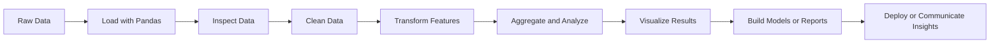
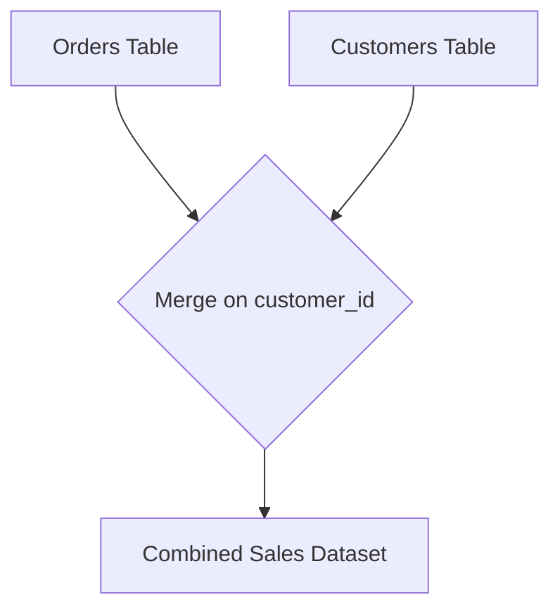
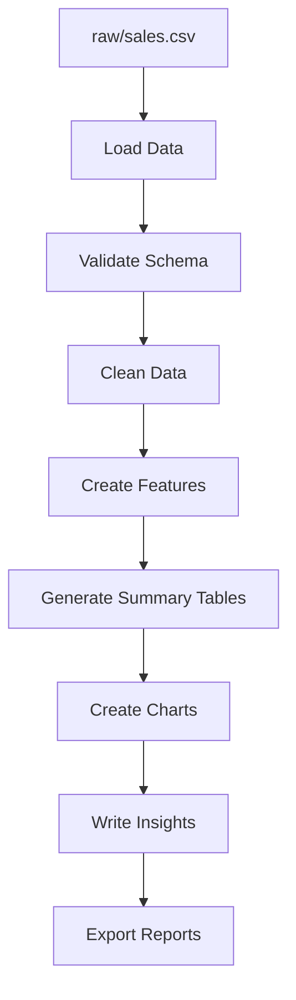
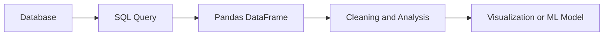

# 010 — Pandas

**Course:** 02 — Coding and Exploratory Data Analysis
**Module:** Module 04 — Coding for Data Science
**Content Group:** Python for Data
**Roadmap Source:** Coding for Data Science / Python for Data
**Lesson Type:** Coding
**Lesson Order:** 010
**Suggested Duration:** 20 minutes

---

## 1. Overview

This lesson introduces **Pandas** in the context of AI and Data Science.

Pandas is a Python library used to work with structured data such as:

* CSV files
* Excel spreadsheets
* SQL query results
* JSON records
* Time-series datasets
* Experiment logs
* Model evaluation results

Pandas helps data professionals load, inspect, clean, transform, aggregate and summarize data before using it for visualization, statistical analysis or machine learning.

After completing this lesson, you should understand:

* What problems Pandas solves
* Where Pandas belongs in a data workflow
* How to perform common DataFrame operations
* How to create a small, reproducible analysis notebook

---

## 2. Learning Objectives

By the end of this lesson, you should be able to:

* Explain Pandas using your own words.
* Understand the difference between a `Series` and a `DataFrame`.
* Load data from a CSV file.
* Inspect the structure and quality of a dataset.
* Select, filter and sort rows.
* Handle missing values.
* Create and transform columns.
* Aggregate data using `groupby`.
* Combine datasets using `merge`.
* Process date and time columns.
* Produce a reproducible data analysis workflow.
* Convert an analysis into a notebook, report, dashboard or portfolio artifact.

---

## 3. What Is Pandas?

**Pandas** is an open-source Python library for working with labeled and tabular data.

It is especially useful when a dataset contains rows and columns similar to a database table or spreadsheet.

The two main Pandas data structures are:

### 3.1 Series

A `Series` is a one-dimensional labeled collection of values.

```python
import pandas as pd

revenue = pd.Series([1200, 1500, 1800])

print(revenue)
```

Output:

```text
0    1200
1    1500
2    1800
dtype: int64
```

A Series can represent one column of a dataset.

---

### 3.2 DataFrame

A `DataFrame` is a two-dimensional table containing rows and columns.

```python
import pandas as pd

data = {
    "product": ["Laptop", "Mouse", "Keyboard"],
    "quantity": [2, 10, 5],
    "price": [1200, 25, 70]
}

df = pd.DataFrame(data)

print(df)
```

Output:

```text
    product  quantity  price
0    Laptop         2   1200
1     Mouse        10     25
2  Keyboard         5     70
```

A DataFrame is the primary data structure used in most Pandas workflows.

---

## 4. Pandas in the Data Science Workflow

Pandas usually appears between data collection and advanced analysis.



A typical workflow is:

1. Load raw data.
2. Inspect columns and data types.
3. Identify missing, duplicated or invalid values.
4. Clean and standardize the data.
5. Create useful features.
6. Aggregate and summarize results.
7. Visualize patterns.
8. Export the processed dataset or use it for modeling.

---

## 5. Core Pandas Operations

### 5.1 Loading Data

Pandas supports several common data formats.

```python
import pandas as pd

# CSV file
df = pd.read_csv("sales.csv")

# Excel file
df_excel = pd.read_excel("sales.xlsx")

# JSON file
df_json = pd.read_json("sales.json")

# SQL query result
# df_sql = pd.read_sql(query, connection)
```

For large CSV files, load only the required columns when possible.

```python
df = pd.read_csv(
    "sales.csv",
    usecols=["order_date", "product", "quantity", "revenue"]
)
```

---

### 5.2 Inspecting a Dataset

Always inspect a dataset before transforming it.

```python
print(df.head())
print(df.tail())
print(df.shape)
print(df.columns)
print(df.dtypes)
print(df.info())
print(df.describe())
```

Common inspection methods:

| Method              | Purpose                                  |
| ------------------- | ---------------------------------------- |
| `df.head()`         | Display the first rows                   |
| `df.tail()`         | Display the last rows                    |
| `df.shape`          | Return the number of rows and columns    |
| `df.columns`        | Display column names                     |
| `df.dtypes`         | Display data types                       |
| `df.info()`         | Show structure, types and missing values |
| `df.describe()`     | Generate descriptive statistics          |
| `df.nunique()`      | Count unique values                      |
| `df.value_counts()` | Count category frequencies               |

Example:

```python
print(df["product"].value_counts())
```

---

### 5.3 Selecting Columns

Select one column:

```python
revenue = df["revenue"]
```

Select multiple columns:

```python
sales_view = df[["product", "quantity", "revenue"]]
```

Using `loc`:

```python
sales_view = df.loc[:, ["product", "revenue"]]
```

---

### 5.4 Selecting Rows

Pandas provides two major row-selection methods:

* `loc` selects data using labels.
* `iloc` selects data using integer positions.

```python
# Select rows using index labels
first_rows = df.loc[0:4]

# Select rows using positions
first_rows = df.iloc[0:5]
```

Select a specific value:

```python
value = df.loc[0, "revenue"]
```

---

### 5.5 Filtering Data

Filter rows using Boolean conditions.

```python
high_revenue = df[df["revenue"] > 1000]
```

Use multiple conditions:

```python
filtered = df[
    (df["revenue"] > 1000)
    & (df["region"] == "North")
]
```

Use `isin` for multiple accepted values:

```python
selected_regions = df[
    df["region"].isin(["North", "Central"])
]
```

Filter text:

```python
laptop_orders = df[
    df["product"].str.contains("Laptop", case=False, na=False)
]
```

---

### 5.6 Sorting Data

Sort by one column:

```python
df_sorted = df.sort_values("revenue", ascending=False)
```

Sort by multiple columns:

```python
df_sorted = df.sort_values(
    ["region", "revenue"],
    ascending=[True, False]
)
```

---

### 5.7 Creating and Transforming Columns

Create a calculated column:

```python
df["total"] = df["quantity"] * df["price"]
```

Apply a simple transformation:

```python
df["product"] = df["product"].str.strip().str.title()
```

Create a conditional column:

```python
df["revenue_level"] = "Low"

df.loc[df["revenue"] >= 1000, "revenue_level"] = "High"
```

Using `assign`:

```python
df = df.assign(
    total=lambda data: data["quantity"] * data["price"]
)
```

Using `map` for category mapping:

```python
region_mapping = {
    "N": "North",
    "S": "South",
    "C": "Central"
}

df["region_name"] = df["region_code"].map(region_mapping)
```

---

## 6. Handling Missing Data

Missing values may be represented as:

* `NaN`
* `None`
* Empty strings
* Invalid placeholder values such as `"N/A"` or `"-"`

Check missing values:

```python
print(df.isna().sum())
```

Remove rows containing missing values:

```python
df_clean = df.dropna()
```

Remove rows only when specific columns are missing:

```python
df_clean = df.dropna(subset=["product", "revenue"])
```

Fill missing numerical values:

```python
df["revenue"] = df["revenue"].fillna(
    df["revenue"].median()
)
```

Fill missing categorical values:

```python
df["region"] = df["region"].fillna("Unknown")
```

Forward-fill time-series data:

```python
df["inventory"] = df["inventory"].ffill()
```

The correct missing-value strategy depends on:

* Why the data is missing
* How much data is missing
* Whether the variable is numerical or categorical
* How the cleaned data will be used

Do not automatically remove every row containing a missing value.

---

## 7. Handling Duplicate Data

Check duplicate rows:

```python
duplicate_count = df.duplicated().sum()

print(duplicate_count)
```

Remove exact duplicates:

```python
df = df.drop_duplicates()
```

Remove duplicates using selected columns:

```python
df = df.drop_duplicates(
    subset=["order_id"],
    keep="first"
)
```

Before removing duplicates, determine whether repeated rows represent:

* A data-entry problem
* Multiple valid transactions
* Repeated measurements
* Different versions of the same record

---

## 8. Grouping and Aggregation

The `groupby` operation follows the split-apply-combine pattern.


Example dataset:

```python
import pandas as pd

df = pd.DataFrame({
    "month": ["Jan", "Jan", "Feb", "Feb"],
    "region": ["North", "South", "North", "South"],
    "revenue": [1200, 900, 1500, 1100]
})
```

Calculate revenue by month:

```python
monthly = (
    df.groupby("month", as_index=False)["revenue"]
    .sum()
)
```

Calculate multiple statistics:

```python
summary = (
    df.groupby("region", as_index=False)
    .agg(
        total_revenue=("revenue", "sum"),
        average_revenue=("revenue", "mean"),
        order_count=("revenue", "count")
    )
)
```

Expected structure:

| region | total_revenue | average_revenue | order_count |
| ------ | ------------: | --------------: | ----------: |
| North  |          2700 |            1350 |           2 |
| South  |          2000 |            1000 |           2 |

---

## 9. Combining DataFrames

### 9.1 Concatenation

Use `concat` to combine DataFrames vertically or horizontally.

```python
all_sales = pd.concat(
    [january_sales, february_sales],
    ignore_index=True
)
```

---

### 9.2 Merge

Use `merge` to combine tables using a common key.

```python
orders = pd.DataFrame({
    "order_id": [1, 2, 3],
    "customer_id": [101, 102, 103],
    "revenue": [500, 700, 300]
})

customers = pd.DataFrame({
    "customer_id": [101, 102, 103],
    "customer_name": ["Anna", "Ben", "Chris"]
})

result = orders.merge(
    customers,
    on="customer_id",
    how="left"
)
```

Common merge types:

| Merge type | Meaning                            |
| ---------- | ---------------------------------- |
| `inner`    | Keep only matching keys            |
| `left`     | Keep all rows from the left table  |
| `right`    | Keep all rows from the right table |
| `outer`    | Keep all keys from both tables     |



Validate merge relationships when possible:

```python
result = orders.merge(
    customers,
    on="customer_id",
    how="left",
    validate="many_to_one"
)
```

This validation helps detect unexpected duplicate keys.

---

## 10. Working with Date and Time Data

Convert a text column to a datetime type:

```python
df["order_date"] = pd.to_datetime(
    df["order_date"],
    errors="coerce"
)
```

Extract date components:

```python
df["year"] = df["order_date"].dt.year
df["month"] = df["order_date"].dt.month
df["month_name"] = df["order_date"].dt.month_name()
df["day_of_week"] = df["order_date"].dt.day_name()
```

Create a monthly period:

```python
df["year_month"] = df["order_date"].dt.to_period("M")
```

Aggregate revenue by month:

```python
monthly_revenue = (
    df.groupby("year_month", as_index=False)["revenue"]
    .sum()
)
```

Sort time-series data before applying time-dependent operations:

```python
df = df.sort_values("order_date")
```

---

## 11. Complete Demo: Sales Analysis

Assume that `sales.csv` contains the following columns:

```text
order_id,order_date,product,region,quantity,price
```

### Step 1: Load the Dataset

```python
import pandas as pd

df = pd.read_csv("sales.csv")
```

### Step 2: Inspect the Data

```python
print(df.head())
print(df.info())
print(df.isna().sum())
print(df.duplicated().sum())
```

### Step 3: Clean the Data

```python
df.columns = (
    df.columns
    .str.strip()
    .str.lower()
    .str.replace(" ", "_")
)

df["product"] = df["product"].str.strip().str.title()
df["region"] = df["region"].str.strip().str.title()

df["order_date"] = pd.to_datetime(
    df["order_date"],
    errors="coerce"
)

df["quantity"] = pd.to_numeric(
    df["quantity"],
    errors="coerce"
)

df["price"] = pd.to_numeric(
    df["price"],
    errors="coerce"
)

df = df.drop_duplicates(subset=["order_id"])

df = df.dropna(
    subset=["order_date", "product", "quantity", "price"]
)
```

### Step 4: Create Features

```python
df["revenue"] = df["quantity"] * df["price"]
df["month"] = df["order_date"].dt.to_period("M")
```

### Step 5: Create Summary Tables

```python
monthly_revenue = (
    df.groupby("month", as_index=False)
    .agg(
        revenue=("revenue", "sum"),
        orders=("order_id", "nunique")
    )
)

product_summary = (
    df.groupby("product", as_index=False)
    .agg(
        units_sold=("quantity", "sum"),
        revenue=("revenue", "sum")
    )
    .sort_values("revenue", ascending=False)
)

region_summary = (
    df.groupby("region", as_index=False)
    .agg(
        revenue=("revenue", "sum"),
        average_order_value=("revenue", "mean")
    )
    .sort_values("revenue", ascending=False)
)
```

### Step 6: Display Results

```python
print(monthly_revenue)
print(product_summary.head(10))
print(region_summary)
```

### Step 7: Export Processed Data

```python
df.to_csv(
    "sales_cleaned.csv",
    index=False
)

monthly_revenue.to_csv(
    "monthly_revenue.csv",
    index=False
)
```

---

## 12. Writing Data Insights

A table or chart is not automatically an insight.

A useful insight should contain:

1. An observation
2. Supporting evidence
3. A possible explanation
4. A recommended action or follow-up question

Weak statement:

> Product A has the highest revenue.

Stronger statement:

> Product A generated 32% of total revenue, making it the largest revenue contributor. However, most of its sales occurred in only one region. The business should investigate whether the product can be expanded to other regions.

Another example:

> Monthly revenue increased by 18% from March to April, while the number of orders increased by only 5%. This suggests that the average order value increased. The next analysis should determine whether the change came from higher prices, larger quantities or a different product mix.

---

## 13. Reproducible Pandas Workflow

A reproducible analysis should preserve every important transformation in code.



Recommended project structure:

```text
pandas-sales-analysis/
├── data/
│   ├── raw/
│   │   └── sales.csv
│   └── processed/
│       └── sales_cleaned.csv
├── notebooks/
│   └── sales_analysis.ipynb
├── reports/
│   ├── monthly_revenue.csv
│   └── figures/
├── src/
│   └── clean_sales.py
├── README.md
└── requirements.txt
```

Important principles:

* Keep raw data unchanged.
* Store cleaning rules in code.
* Record assumptions and data-quality decisions.
* Use clear variable names.
* Organize notebook cells logically.
* Save important outputs.
* Track source code with Git.
* Avoid undocumented manual spreadsheet edits.

---

## 14. Pandas and Machine Learning

Pandas is commonly used before and after model training.

### Before Training

Pandas can help with:

* Removing invalid records
* Handling missing values
* Creating features
* Encoding categories
* Selecting input columns
* Splitting data by date or category
* Detecting class imbalance

Example:

```python
features = df[
    ["age", "income", "purchase_count"]
]

target = df["churn"]
```

### After Training

Pandas can help with:

* Storing predictions
* Comparing predictions with actual values
* Calculating metrics by segment
* Finding error patterns
* Exporting model results

```python
results = pd.DataFrame({
    "actual": y_test,
    "predicted": predictions
})

results["is_correct"] = (
    results["actual"] == results["predicted"]
)
```

---

## 15. Pandas and SQL

Pandas and SQL solve related but different problems.

| Pandas                       | SQL                                       |
| ---------------------------- | ----------------------------------------- |
| Runs inside Python           | Runs inside a database                    |
| Useful for flexible analysis | Useful for querying large stored datasets |
| Integrates with ML libraries | Optimized for database operations         |
| Supports custom Python logic | Supports declarative queries              |
| Usually works in memory      | Can process data inside the database      |

A common workflow is:



Whenever possible, use SQL to reduce a very large dataset before loading it into Pandas.

---

## 16. Common Mistakes

### 16.1 Editing Data Manually

Problem:

* Changes cannot be reproduced.
* Other people cannot verify the analysis.
* The process becomes difficult to maintain.

Better approach:

```python
df["region"] = df["region"].replace({
    "NORTH ": "North",
    "north": "North"
})
```

---

### 16.2 Overwriting Raw Data

Problem:

```python
df.to_csv("sales.csv", index=False)
```

This may destroy the original dataset.

Better approach:

```python
df.to_csv(
    "data/processed/sales_cleaned.csv",
    index=False
)
```

---

### 16.3 Ignoring Data Types

A numerical column may be loaded as text.

```python
print(df.dtypes)
```

Convert it explicitly:

```python
df["revenue"] = pd.to_numeric(
    df["revenue"],
    errors="coerce"
)
```

---

### 16.4 Using Chained Assignment

Avoid:

```python
df[df["revenue"] > 1000]["level"] = "High"
```

This operation may not update the original DataFrame correctly.

Use `loc`:

```python
df.loc[
    df["revenue"] > 1000,
    "level"
] = "High"
```

---

### 16.5 Dropping Missing Values Without Investigation

Avoid immediately using:

```python
df = df.dropna()
```

First inspect the missing-value pattern:

```python
missing_summary = (
    df.isna()
    .mean()
    .sort_values(ascending=False)
)

print(missing_summary)
```

---

### 16.6 Incorrect Merges

A merge with duplicated keys can unexpectedly increase the number of rows.

```python
print(orders["customer_id"].duplicated().sum())
print(customers["customer_id"].duplicated().sum())
```

Use merge validation:

```python
result = orders.merge(
    customers,
    on="customer_id",
    how="left",
    validate="many_to_one"
)
```

---

### 16.7 Using Row Loops for Vectorizable Operations

Avoid:

```python
for index, row in df.iterrows():
    df.loc[index, "revenue"] = (
        row["quantity"] * row["price"]
    )
```

Prefer vectorized operations:

```python
df["revenue"] = df["quantity"] * df["price"]
```

Vectorized operations are usually shorter, clearer and faster.

---

### 16.8 Creating Charts Without Insights

A chart should answer a question.

Instead of only producing a chart, explain:

* What changed?
* How large was the change?
* Which segment caused it?
* Why might it matter?
* What should be investigated next?

---

## 17. Performance Considerations

Pandas is powerful, but it normally processes data in memory.

For larger datasets:

* Load only required columns.
* Filter data before loading when using SQL.
* Use appropriate data types.
* Avoid unnecessary copies.
* Prefer vectorized operations.
* Process data in chunks when necessary.
* Consider Polars, Dask, DuckDB, Spark or a database when the dataset becomes too large.

Load a CSV in chunks:

```python
chunks = pd.read_csv(
    "large_sales.csv",
    chunksize=100_000
)

results = []

for chunk in chunks:
    summary = (
        chunk.groupby("region")["revenue"]
        .sum()
    )

    results.append(summary)
```

Memory usage can be inspected with:

```python
print(
    df.memory_usage(deep=True)
    .sort_values(ascending=False)
)
```

---

## 18. Practical Exercise

Choose a small CSV dataset containing at least:

* One date column
* One categorical column
* Two numerical columns
* Some missing or duplicated values

Possible datasets:

* Retail sales
* E-commerce orders
* Student performance
* Housing prices
* Customer transactions
* Website traffic
* Mobile application events

### Tasks

1. Load the dataset into a DataFrame.
2. Display its shape, columns and data types.
3. Identify missing values.
4. Identify duplicate rows.
5. Standardize column names.
6. Convert columns to appropriate data types.
7. Handle missing values using a documented strategy.
8. Remove or explain duplicate records.
9. Create at least one calculated column.
10. Filter the dataset using at least two conditions.
11. Create one grouped summary.
12. Sort the summary by an important metric.
13. Create at least one chart or summary table.
14. Write three evidence-based insights.
15. Export the cleaned dataset.
16. Record one caveat or unanswered question.

---

## 19. Suggested Notebook Structure

```markdown
# Sales Data Analysis

## 1. Business Question

## 2. Dataset Description

## 3. Imports and Configuration

## 4. Data Loading

## 5. Data Inspection

## 6. Data Quality Assessment

## 7. Data Cleaning

## 8. Feature Engineering

## 9. Exploratory Analysis

## 10. Visualizations

## 11. Key Insights

## 12. Recommendations

## 13. Assumptions and Limitations

## 14. Next Steps
```

This structure makes the analysis easier to understand, review and reproduce.

---

## 20. Completion Checklist

* [ ] I can explain Pandas in one or two minutes.
* [ ] I understand the difference between a Series and a DataFrame.
* [ ] I can load a CSV file.
* [ ] I can inspect columns, data types and missing values.
* [ ] I can select and filter rows.
* [ ] I can clean and transform columns.
* [ ] I can handle missing and duplicate values.
* [ ] I can use `groupby` and aggregation.
* [ ] I can merge two DataFrames.
* [ ] I can process datetime columns.
* [ ] I created a reproducible notebook or Python script.
* [ ] I preserved the original raw dataset.
* [ ] I wrote at least three insights supported by evidence.
* [ ] I documented at least one caveat, assumption or follow-up question.

---

## 21. Related Outcome

Use Python, SQL, data libraries, notebooks and Git to build reproducible data workflows.

Pandas supports this outcome by connecting:

* Raw datasets
* SQL query results
* Exploratory data analysis
* Feature engineering
* Statistical analysis
* Machine learning
* Reports and dashboards

---

## 22. Related Project

### Mini Project: SQL and Python Sales Analysis

Build a small sales analysis project using:

* SQLite or PostgreSQL
* SQL queries
* Pandas
* Matplotlib
* Jupyter Notebook
* Git

Suggested workflow:


Suggested KPIs:

* Total revenue
* Number of orders
* Average order value
* Revenue by month
* Revenue by region
* Revenue by product
* Best-performing product
* Month-over-month growth

Suggested portfolio artifacts:

* A documented notebook
* A cleaned dataset
* A Python cleaning script
* Three or more charts
* A short business report
* A GitHub README explaining the project

---

## 23. Summary

**Pandas** is one of the most important libraries for practical data work in Python.

It provides tools for:

* Loading structured data
* Inspecting data quality
* Cleaning invalid values
* Handling missing data
* Transforming columns
* Aggregating records
* Combining datasets
* Processing time-series data
* Preparing data for models
* Producing reports and analysis outputs

However, knowing Pandas syntax is not enough.

A strong data workflow should also be:

* Reproducible
* Documented
* Testable
* Easy to review
* Connected to a real analytical question

Turn this lesson into a concrete artifact such as a notebook, data-cleaning script, SQL and Pandas report, visualization dashboard or portfolio project.
