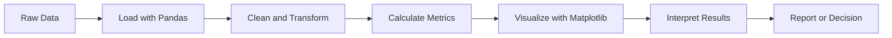
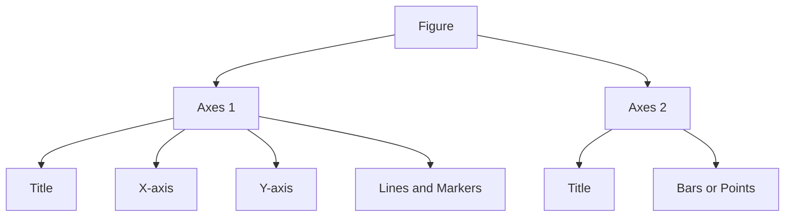
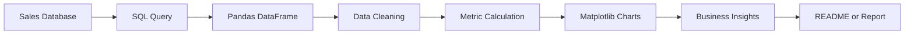

# 011 — Matplotlib

**Course:** 02 — Coding and EDA
**Module:** Module 04 — Coding for Data Science
**Content Group:** Python for Data
**Roadmap Source:** Coding for Data Science / Python for Data
**Lesson Type:** Coding
**Lesson Order:** 011
**Suggested Duration:** 20 minutes

---

## 1. Summary

This lesson introduces **Matplotlib** in the context of AI and Data Science.

Matplotlib is a Python library for creating static, animated, and interactive data visualizations. It is commonly used during exploratory data analysis, experiment evaluation, model diagnostics, and reporting.

After completing this lesson, you should understand:

* What Matplotlib is and why it is useful.
* How figures and axes work.
* How to create common chart types.
* How to customize and save charts.
* How visualizations support data analysis and machine learning workflows.

---

## 2. Learning Objectives

By the end of this lesson, you should be able to:

* Explain Matplotlib in your own words.
* Identify where visualization fits into a Data Science workflow.
* Create line charts, bar charts, histograms, and scatter plots.
* Add titles, labels, legends, and grid lines to a chart.
* Create multiple charts using subplots.
* Save a visualization as an image file.
* Write meaningful insights based on a chart.
* Build a small visualization artifact for your portfolio.

---

## 3. What Is Matplotlib?

**Matplotlib** is a Python visualization library that converts numerical or tabular data into charts.

It is frequently used together with:

* NumPy
* Pandas
* SciPy
* Scikit-learn
* Jupyter Notebook

A simple visualization workflow looks like this:



Matplotlib helps answer questions such as:

* How does a metric change over time?
* Which category has the highest value?
* What is the distribution of a variable?
* Are two variables related?
* Are there outliers in the dataset?
* How does model performance change during training?

---

## 4. Why Matplotlib Matters in Data Science

Data tables are useful, but they can be difficult to interpret when they contain many rows or columns.

A good chart can quickly reveal:

* Trends
* Patterns
* Differences
* Relationships
* Outliers
* Data-quality problems
* Model-performance changes

For example, a table may show monthly revenue:

| Month    | Revenue |
| -------- | ------: |
| January  |  12,000 |
| February |  13,500 |
| March    |  12,800 |
| April    |  16,000 |
| May      |  18,500 |

A line chart makes the upward trend much easier to recognize.

Visualization is therefore not only a presentation step. It is also an important analytical tool.

---

## 5. Installing and Importing Matplotlib

Install Matplotlib with `pip`:

```bash
pip install matplotlib
```

Import the `pyplot` module:

```python
import matplotlib.pyplot as plt
```

The common alias for `matplotlib.pyplot` is `plt`.

When working in Jupyter Notebook, charts normally appear directly below the code cell.

Older notebooks may require:

```python
%matplotlib inline
```

---

## 6. Core Matplotlib Concepts

Matplotlib uses several important objects.

### 6.1 Figure

A **Figure** is the complete visualization container.

It can contain:

* One chart
* Multiple charts
* Titles
* Legends
* Annotations
* Other visual elements

### 6.2 Axes

An **Axes** object represents an individual plotting area.

An Axes normally contains:

* An x-axis
* A y-axis
* Data points
* Labels
* A title
* A legend

### 6.3 Artist

Almost everything displayed in a Matplotlib figure is an **Artist**.

Examples include:

* Lines
* Text
* Markers
* Labels
* Legends
* Rectangles

The basic structure is:



---

## 7. Pyplot Interface vs Object-Oriented Interface

Matplotlib supports two common coding styles.

### 7.1 Pyplot Interface

The `pyplot` interface is convenient for small and simple charts.

```python
import matplotlib.pyplot as plt

x = [1, 2, 3, 4]
y = [10, 15, 13, 18]

plt.plot(x, y)
plt.title("Simple Line Chart")
plt.xlabel("X Value")
plt.ylabel("Y Value")
plt.show()
```

### 7.2 Object-Oriented Interface

The object-oriented interface creates explicit `Figure` and `Axes` objects.

```python
import matplotlib.pyplot as plt

x = [1, 2, 3, 4]
y = [10, 15, 13, 18]

fig, ax = plt.subplots()

ax.plot(x, y)
ax.set_title("Simple Line Chart")
ax.set_xlabel("X Value")
ax.set_ylabel("Y Value")

plt.show()
```

The object-oriented interface is usually recommended because it:

* Is easier to maintain.
* Works better with multiple charts.
* Makes customization more explicit.
* Produces cleaner reusable functions.

---

## 8. Basic Visualization Workflow

A reproducible visualization workflow can be organized as follows:

```text
raw data
    ↓
load data
    ↓
inspect data types and missing values
    ↓
clean and transform
    ↓
calculate analysis metrics
    ↓
select an appropriate chart
    ↓
add labels and context
    ↓
write an insight
    ↓
save the chart
```

A chart should not be created without first understanding:

1. The analytical question.
2. The variables involved.
3. The data types.
4. The intended audience.
5. The decision supported by the chart.

---

## 9. Line Chart

A line chart is useful for showing changes over an ordered sequence, especially time.

```python
import matplotlib.pyplot as plt

months = ["Jan", "Feb", "Mar", "Apr", "May"]
revenue = [12000, 13500, 12800, 16000, 18500]

fig, ax = plt.subplots(figsize=(8, 4))

ax.plot(months, revenue, marker="o")

ax.set_title("Monthly Revenue")
ax.set_xlabel("Month")
ax.set_ylabel("Revenue")
ax.grid(True)

plt.show()
```

### Appropriate use cases

Use a line chart for:

* Revenue over time
* Daily active users
* Website traffic
* Temperature changes
* Training and validation loss
* Stock-price movement

### Example insight

> Revenue increased from 12,000 in January to 18,500 in May. The largest increase occurred between March and April.

---

## 10. Bar Chart

A bar chart compares values across categories.

```python
import matplotlib.pyplot as plt

products = ["Laptop", "Phone", "Tablet", "Monitor"]
sales = [120, 210, 95, 150]

fig, ax = plt.subplots(figsize=(8, 4))

ax.bar(products, sales)

ax.set_title("Sales by Product")
ax.set_xlabel("Product")
ax.set_ylabel("Units Sold")

plt.show()
```

### Appropriate use cases

Use a bar chart for:

* Sales by product
* Revenue by region
* Customer count by segment
* Model accuracy by algorithm
* Errors by category

### Horizontal bar chart

A horizontal bar chart is helpful when category names are long.

```python
fig, ax = plt.subplots(figsize=(8, 4))

ax.barh(products, sales)

ax.set_title("Sales by Product")
ax.set_xlabel("Units Sold")
ax.set_ylabel("Product")

plt.show()
```

---

## 11. Histogram

A histogram shows the distribution of a numerical variable.

```python
import matplotlib.pyplot as plt

ages = [
    18, 19, 20, 20, 21, 22, 22, 23,
    24, 25, 25, 26, 28, 30, 32, 35
]

fig, ax = plt.subplots(figsize=(8, 4))

ax.hist(ages, bins=6, edgecolor="black")

ax.set_title("Customer Age Distribution")
ax.set_xlabel("Age")
ax.set_ylabel("Frequency")

plt.show()
```

A histogram can help identify:

* The center of a distribution
* Spread
* Skewness
* Multiple peaks
* Extreme values
* Unusual gaps

### Histogram vs bar chart

| Histogram                        | Bar chart                     |
| -------------------------------- | ----------------------------- |
| Represents numerical intervals   | Represents categories         |
| Bars normally touch              | Bars normally have gaps       |
| Shows a distribution             | Compares category values      |
| Bin width affects interpretation | Category order can be changed |

---

## 12. Scatter Plot

A scatter plot shows the relationship between two numerical variables.

```python
import matplotlib.pyplot as plt

advertising_cost = [100, 150, 200, 250, 300, 350]
revenue = [900, 1100, 1400, 1550, 1900, 2100]

fig, ax = plt.subplots(figsize=(8, 4))

ax.scatter(advertising_cost, revenue)

ax.set_title("Advertising Cost vs Revenue")
ax.set_xlabel("Advertising Cost")
ax.set_ylabel("Revenue")
ax.grid(True)

plt.show()
```

A scatter plot can reveal:

* Positive relationships
* Negative relationships
* Nonlinear relationships
* Clusters
* Outliers
* Changes in variance

### Important caution

A visible relationship does not automatically prove causation.

For example:

> Advertising cost and revenue increase together.

This observation does not prove that advertising alone caused the increase. Other variables may also affect revenue.

---

## 13. Box Plot

A box plot summarizes the distribution of a numerical variable.

```python
import matplotlib.pyplot as plt

delivery_times = [18, 19, 20, 21, 21, 22, 23, 25, 27, 40]

fig, ax = plt.subplots(figsize=(6, 4))

ax.boxplot(delivery_times)

ax.set_title("Delivery Time Distribution")
ax.set_ylabel("Minutes")

plt.show()
```

A box plot highlights:

* Median
* Lower quartile
* Upper quartile
* Interquartile range
* Potential outliers

Box plots are especially useful when comparing distributions between groups.

---

## 14. Creating Multiple Charts with Subplots

Subplots allow multiple charts to appear inside one figure.

```python
import matplotlib.pyplot as plt

months = ["Jan", "Feb", "Mar", "Apr", "May"]
revenue = [12000, 13500, 12800, 16000, 18500]
orders = [200, 220, 210, 260, 290]

fig, axes = plt.subplots(
    nrows=1,
    ncols=2,
    figsize=(12, 4)
)

axes[0].plot(months, revenue, marker="o")
axes[0].set_title("Monthly Revenue")
axes[0].set_xlabel("Month")
axes[0].set_ylabel("Revenue")

axes[1].bar(months, orders)
axes[1].set_title("Monthly Orders")
axes[1].set_xlabel("Month")
axes[1].set_ylabel("Orders")

plt.tight_layout()
plt.show()
```

`plt.tight_layout()` adjusts spacing to reduce overlapping labels and titles.

---

## 15. Titles, Labels, Legends, and Grid Lines

A chart should contain enough context for the reader to understand it.

```python
import matplotlib.pyplot as plt

epochs = [1, 2, 3, 4, 5]
training_loss = [0.80, 0.62, 0.49, 0.41, 0.35]
validation_loss = [0.85, 0.68, 0.57, 0.54, 0.56]

fig, ax = plt.subplots(figsize=(8, 4))

ax.plot(epochs, training_loss, marker="o", label="Training Loss")
ax.plot(epochs, validation_loss, marker="o", label="Validation Loss")

ax.set_title("Model Loss by Epoch")
ax.set_xlabel("Epoch")
ax.set_ylabel("Loss")
ax.legend()
ax.grid(True)

plt.show()
```

The chart suggests that validation loss stops improving near the final epochs. This may be an early sign of overfitting.

A useful chart should normally include:

* A descriptive title
* Meaningful axis labels
* Units where appropriate
* A legend when multiple series are shown
* Readable tick labels
* A short written interpretation

---

## 16. Figure Size and Resolution

Use `figsize` to control the size of a figure.

```python
fig, ax = plt.subplots(figsize=(10, 5))
```

The values represent width and height in inches.

Use `dpi` to control resolution:

```python
fig, ax = plt.subplots(figsize=(10, 5), dpi=120)
```

Higher DPI values can improve image quality but may also increase file size.

---

## 17. Saving a Chart

Use `savefig()` to save a chart.

```python
import matplotlib.pyplot as plt

categories = ["A", "B", "C"]
values = [10, 16, 12]

fig, ax = plt.subplots()

ax.bar(categories, values)
ax.set_title("Category Comparison")

fig.savefig(
    "category_comparison.png",
    dpi=300,
    bbox_inches="tight"
)

plt.show()
```

Common output formats include:

* PNG
* JPG
* SVG
* PDF

`bbox_inches="tight"` reduces unnecessary whitespace around the figure.

For reproducible projects, save charts inside a dedicated directory:

```text
project/
├── data/
│   ├── raw/
│   └── processed/
├── notebooks/
├── src/
├── reports/
│   └── figures/
├── README.md
└── requirements.txt
```

---

## 18. Matplotlib with Pandas

Pandas provides a convenient `.plot()` method that uses Matplotlib internally.

```python
import pandas as pd
import matplotlib.pyplot as plt

sales = pd.DataFrame({
    "month": ["Jan", "Feb", "Mar", "Apr", "May"],
    "revenue": [12000, 13500, 12800, 16000, 18500]
})

ax = sales.plot(
    x="month",
    y="revenue",
    kind="line",
    marker="o",
    legend=False,
    figsize=(8, 4)
)

ax.set_title("Monthly Revenue")
ax.set_xlabel("Month")
ax.set_ylabel("Revenue")

plt.show()
```

Pandas plotting is useful for quick exploratory analysis.

Direct Matplotlib code usually provides more control for:

* Complex layouts
* Detailed annotations
* Reusable plotting functions
* Publication-quality charts

---

## 19. Complete Sales Analysis Example

The following example creates a small dataset, calculates metrics, and produces a chart.

```python
import pandas as pd
import matplotlib.pyplot as plt

sales = pd.DataFrame({
    "month": ["Jan", "Feb", "Mar", "Apr", "May", "Jun"],
    "revenue": [12000, 13500, 12800, 16000, 18500, 20100],
    "orders": [200, 220, 210, 260, 290, 310]
})

sales["average_order_value"] = (
    sales["revenue"] / sales["orders"]
)

fig, ax = plt.subplots(figsize=(9, 5))

ax.plot(
    sales["month"],
    sales["average_order_value"],
    marker="o"
)

ax.set_title("Average Order Value by Month")
ax.set_xlabel("Month")
ax.set_ylabel("Average Order Value")
ax.grid(True)

fig.savefig(
    "average_order_value.png",
    dpi=300,
    bbox_inches="tight"
)

plt.show()
```

### Possible observations

1. Average order value generally increases over time.
2. March shows a small decline compared with February.
3. Revenue growth is driven by both increased order volume and increased average order value.

### Possible recommendation

> Investigate the campaigns or product combinations used in May and June, because these months produced both higher order volume and stronger revenue.

---

## 20. Choosing the Correct Chart

| Analytical question                         | Recommended chart   |
| ------------------------------------------- | ------------------- |
| How does a metric change over time?         | Line chart          |
| Which category has the highest value?       | Bar chart           |
| How is a numerical variable distributed?    | Histogram           |
| Are two numerical variables related?        | Scatter plot        |
| Are there potential outliers?               | Box plot            |
| How do parts contribute to a total?         | Stacked bar chart   |
| How do two models perform across epochs?    | Multiple-line chart |
| How do distributions differ between groups? | Multiple box plots  |

The chart should be selected based on the analytical question, not personal preference.

---

## 21. Writing Insights from Charts

A chart is incomplete without interpretation.

A useful insight normally contains three parts:

```text
Observation → Evidence → Meaning or recommendation
```

### Weak insight

> Revenue increased.

### Better insight

> Revenue increased from 12,000 in January to 20,100 in June, representing an increase of approximately 67.5%.

### Stronger insight

> Revenue increased from 12,000 in January to 20,100 in June. Because both order volume and average order value increased, the growth appears to come from a combination of customer demand and higher transaction value. The team should investigate which campaigns or products contributed to the May–June acceleration.

Avoid conclusions that are not supported by the chart.

---

## 22. Reusable Plotting Functions

Visualization code should be reusable when the same chart format is required multiple times.

```python
import matplotlib.pyplot as plt


def plot_time_series(
    data,
    x_column,
    y_column,
    title,
    x_label,
    y_label,
    output_path=None
):
    """Create and optionally save a time-series line chart."""

    fig, ax = plt.subplots(figsize=(9, 5))

    ax.plot(
        data[x_column],
        data[y_column],
        marker="o"
    )

    ax.set_title(title)
    ax.set_xlabel(x_label)
    ax.set_ylabel(y_label)
    ax.grid(True)

    if output_path:
        fig.savefig(
            output_path,
            dpi=300,
            bbox_inches="tight"
        )

    plt.show()
```

Example usage:

```python
plot_time_series(
    data=sales,
    x_column="month",
    y_column="revenue",
    title="Monthly Revenue",
    x_label="Month",
    y_label="Revenue",
    output_path="monthly_revenue.png"
)
```

Reusable functions improve:

* Consistency
* Maintainability
* Testability
* Reproducibility
* Collaboration

---

## 23. Matplotlib in Machine Learning

Matplotlib is commonly used to visualize model behavior.

### 23.1 Training history

```python
fig, ax = plt.subplots()

ax.plot(history["loss"], label="Training Loss")
ax.plot(history["val_loss"], label="Validation Loss")

ax.set_title("Training History")
ax.set_xlabel("Epoch")
ax.set_ylabel("Loss")
ax.legend()

plt.show()
```

### 23.2 Feature importance

```python
fig, ax = plt.subplots()

ax.barh(feature_names, feature_importance)

ax.set_title("Feature Importance")
ax.set_xlabel("Importance Score")

plt.show()
```

### 23.3 Actual vs predicted values

```python
fig, ax = plt.subplots()

ax.scatter(y_test, y_predicted)

ax.set_title("Actual vs Predicted Values")
ax.set_xlabel("Actual Value")
ax.set_ylabel("Predicted Value")
ax.grid(True)

plt.show()
```

Other machine-learning visualizations include:

* Confusion matrices
* ROC curves
* Precision-recall curves
* Residual plots
* Learning curves
* Cluster visualizations
* Hyperparameter comparison charts

---

## 24. Common Mistakes

### 24.1 Creating a chart without an analytical question

A chart should answer a specific question.

Bad approach:

> I will create several charts and see what happens.

Better approach:

> I want to determine whether revenue is increasing over time.

---

### 24.2 Missing labels or units

A chart without labels forces the reader to guess what the values mean.

Poor label:

```text
Value
```

Better label:

```text
Monthly Revenue (USD)
```

---

### 24.3 Using the wrong chart type

Examples:

* Using a line chart for unordered categories.
* Using a pie chart with too many categories.
* Using a bar chart for a continuous distribution.
* Using a histogram to compare unrelated categorical values.

---

### 24.4 Showing too much information

Too many lines, categories, labels, or annotations can make a chart difficult to read.

Possible solutions:

* Filter unnecessary categories.
* Create multiple subplots.
* Group small categories.
* Focus on the most important metric.
* Move detailed numbers into a table.

---

### 24.5 Starting the y-axis at a misleading value

A truncated y-axis can exaggerate small differences.

Always check whether the axis range creates a misleading visual impression.

---

### 24.6 Manual and non-reproducible operations

Avoid creating charts by manually editing data in spreadsheet software when the analysis should be reproducible.

Prefer:

```text
raw data
    → Python cleaning script
    → analysis table
    → Matplotlib chart
    → saved output
```

---

### 24.7 Showing a chart without an insight

Do not stop after producing the image.

Explain:

* What changed?
* By how much?
* Why might it matter?
* What should be investigated next?

---

### 24.8 Forgetting to close figures in automated scripts

When creating many charts inside a loop or service, close figures after saving them.

```python
fig.savefig("output.png")
plt.close(fig)
```

This helps prevent unnecessary memory usage.

---

## 25. Practical Exercise

Choose a small CSV dataset containing at least:

* One categorical column
* One numerical column
* One date or ordered column

Possible datasets include:

* Online store sales
* Student scores
* Website traffic
* Movie ratings
* Weather measurements
* Customer transactions

### Task 1: Load and inspect the data

```python
import pandas as pd

df = pd.read_csv("data.csv")

print(df.head())
print(df.info())
print(df.isna().sum())
```

### Task 2: Clean the data

Perform at least two cleaning operations, such as:

* Remove duplicate rows.
* Convert a date column.
* Handle missing values.
* Correct column data types.
* Remove impossible values.
* Standardize category names.

### Task 3: Create three visualizations

Create at least three charts:

1. A line or bar chart.
2. A histogram or box plot.
3. A scatter plot.

### Task 4: Write three insights

For every chart, write:

* One observation.
* Supporting numerical evidence.
* One interpretation or recommendation.

### Task 5: Save the outputs

Save the charts in:

```text
reports/figures/
```

Example:

```python
fig.savefig(
    "reports/figures/monthly_sales.png",
    dpi=300,
    bbox_inches="tight"
)
```

---

## 26. Suggested Notebook Structure

```markdown
# Matplotlib Sales Analysis

## 1. Business Question

## 2. Dataset Description

## 3. Library Imports

## 4. Data Loading

## 5. Data Quality Checks

## 6. Data Cleaning

## 7. Exploratory Visualizations

### 7.1 Revenue Over Time

### 7.2 Sales by Category

### 7.3 Order Value Distribution

### 7.4 Advertising Cost vs Revenue

## 8. Key Insights

## 9. Recommendations

## 10. Assumptions and Limitations
```

---

## 27. Mini Project Connection

### Project

**SQL and Python Sales Analysis**

### Suggested workflow



### Possible project outputs

* A cleaned analysis table
* A Jupyter Notebook
* Three to five charts
* A folder containing saved figures
* A short business report
* A README explaining how to run the project

### Suggested questions

* Which product category generates the most revenue?
* How does revenue change by month?
* Which region has the highest average order value?
* Are discounts associated with higher order volume?
* Which products have high sales but low profit?

---

## 28. Completion Checklist

* [ ] I can explain Matplotlib in one or two minutes.
* [ ] I understand the difference between a Figure and an Axes.
* [ ] I can create a line chart.
* [ ] I can create a bar chart.
* [ ] I can create a histogram.
* [ ] I can create a scatter plot.
* [ ] I can add titles, labels, legends, and grid lines.
* [ ] I can create multiple charts with subplots.
* [ ] I can save a chart as an image.
* [ ] I can use Matplotlib with a Pandas DataFrame.
* [ ] I can write an evidence-based insight from a chart.
* [ ] I have documented at least one assumption or limitation.
* [ ] I have created a notebook or portfolio artifact for this lesson.

---

## 29. Related Outcome

Use Python, SQL, data libraries, notebooks, and Git to build reproducible data workflows.

Matplotlib contributes to this outcome by converting processed data and model results into visual evidence that can be inspected, communicated, and reproduced.

---

## 30. Key Takeaways

* Matplotlib is a foundational Python visualization library.
* A Figure is the complete visualization container.
* An Axes object represents an individual chart.
* Line charts are useful for trends over time.
* Bar charts compare categories.
* Histograms show numerical distributions.
* Scatter plots show relationships between numerical variables.
* Subplots allow multiple charts inside one figure.
* A chart should include clear titles, labels, units, and context.
* A visualization should answer an analytical question.
* Every important chart should be accompanied by a written insight.
* Reusable plotting functions improve consistency and reproducibility.
* Charts should be saved as project artifacts rather than existing only inside a notebook.

---

## 31. Final Summary

**Matplotlib** is an essential milestone in the AI and Data Scientist roadmap.

It helps transform raw numbers into visual evidence that can reveal patterns, diagnose problems, evaluate models, and communicate findings.

Do not treat Matplotlib as only a chart-drawing library. Use it as part of a complete analytical workflow:

```text
question
    → data
    → cleaning
    → metric
    → visualization
    → insight
    → recommendation
```

Turn this lesson into a notebook, analysis report, model-evaluation chart, dashboard component, or portfolio project so that the knowledge becomes practical and reusable.
