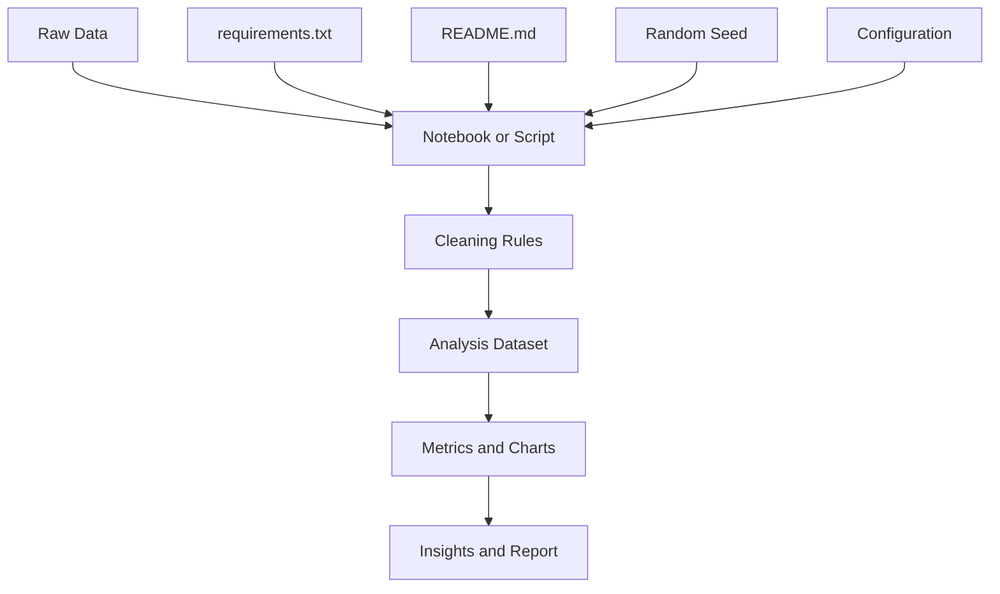
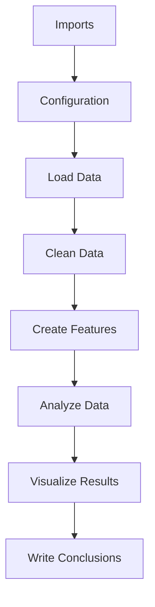
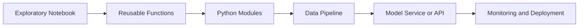

# 013 - Jupyter Notebook

**Course Section:** 02 - Coding and Exploratory Data Analysis
**Module:** Module 04 - Coding for Data Science
**Content Group:** Python for Data
**Roadmap Source:** Coding for Data Science / Python for Data
**Lesson Type:** Coding
**Order in Module:** 013
**Suggested Duration:** 20 minutes

---

## 1. Overview

This lesson explains **Jupyter Notebook** in the context of AI and Data Science.

Jupyter Notebook is an interactive development environment that allows you to combine:

* Python code
* Markdown documentation
* Mathematical formulas
* Tables
* Charts
* Model outputs
* Experimental notes

A notebook is especially useful for exploratory data analysis, data cleaning, visualization, machine learning experiments, and communicating analytical results.

After completing this lesson, you should understand:

* What a Jupyter Notebook is
* How notebooks support the data science workflow
* How to organize a notebook clearly
* How to make an analysis reproducible
* How to convert an experimental notebook into a script, pipeline, model, report, or API

---

## 2. Learning Objectives

By the end of this lesson, you should be able to:

* Explain Jupyter Notebook in your own words.
* Identify where notebooks belong in an AI and Data Science workflow.
* Create and run Markdown and code cells.
* Load, clean, transform, and analyze a small dataset.
* Present findings using tables and charts.
* Organize notebook cells in a logical and reproducible order.
* Recognize when notebook code should be moved into reusable Python modules.
* Produce a small notebook suitable for a portfolio project.

---

## 3. What Is Jupyter Notebook?

A **Jupyter Notebook** is an interactive document that contains executable code, formatted text, formulas, visualizations, and outputs.

Notebook files normally use the `.ipynb` extension.

A notebook is divided into cells. The most common cell types are:

| Cell type | Purpose                                                     |
| --------- | ----------------------------------------------------------- |
| Code      | Executes Python or another supported language               |
| Markdown  | Displays headings, explanations, lists, links, and formulas |
| Raw       | Stores unformatted content that is not executed             |

A notebook allows developers and analysts to work incrementally:

1. Write a small piece of code.
2. Run the cell.
3. Inspect the result.
4. Modify the code.
5. Continue the analysis.

This interactive workflow makes notebooks useful for experimentation and exploration.

---

## 4. Jupyter Notebook in the Data Science Workflow

A typical data analysis workflow may look like this:


Jupyter Notebook can support almost every stage of this process.

For example, a notebook may contain:

1. A Markdown cell describing the business question.
2. A code cell importing Python libraries.
3. A code cell loading a CSV file.
4. Cells checking missing values and data types.
5. Cells cleaning and transforming the data.
6. Cells producing summary statistics.
7. Cells creating charts.
8. Markdown cells explaining the findings.
9. A final section with recommendations.

---

## 5. Why Jupyter Notebook Is Useful

### 5.1 Interactive Development

You can run one cell at a time instead of executing an entire program.

This is useful when:

* Exploring an unfamiliar dataset
* Testing a transformation
* Debugging a calculation
* Comparing multiple models
* Experimenting with chart types

### 5.2 Code and Explanation in One Place

A notebook can combine code with written explanations.

For example:

```markdown
## Revenue Analysis

The following calculation compares monthly revenue across product categories.
```

The explanation can be followed immediately by executable Python code.

### 5.3 Immediate Visual Output

Charts, tables, images, and model results appear directly below the code cell that produced them.

```python
import matplotlib.pyplot as plt

monthly_sales.plot(
    kind="line",
    x="month",
    y="revenue",
    title="Monthly Revenue"
)

plt.show()
```

### 5.4 Useful for Communication

A well-organized notebook can communicate:

* The analytical question
* The methodology
* The code
* The evidence
* The findings
* The limitations
* The recommendations

This makes notebooks useful for technical reports, research experiments, and portfolio projects.

### 5.5 Supports Multiple Languages

The name **Jupyter** originally came from three programming languages:

* Julia
* Python
* R

Python is currently one of the most commonly used languages in Jupyter notebooks.

---

## 6. Notebook Structure

A professional notebook should follow a clear structure.

```text
1. Title and project context
2. Problem statement
3. Environment setup
4. Library imports
5. Data loading
6. Initial data inspection
7. Data cleaning
8. Data transformation
9. Exploratory data analysis
10. Visualizations
11. Key insights
12. Limitations
13. Recommendations
14. Conclusion
```

A simple notebook outline may look like this:

```markdown
# Sales Data Analysis

## 1. Business Question

## 2. Environment Setup

## 3. Data Loading

## 4. Data Quality Checks

## 5. Data Cleaning

## 6. Exploratory Data Analysis

## 7. Visualizations

## 8. Key Insights

## 9. Limitations

## 10. Conclusion
```

---

## 7. Code Cells

A code cell contains executable Python code.

Example:

```python
message = "Hello, Jupyter Notebook!"
print(message)
```

Expected output:

```text
Hello, Jupyter Notebook!
```

A code cell can also return the result of its final expression without using `print()`.

```python
sales = [120, 150, 180, 210]
sum(sales)
```

Expected output:

```text
660
```

---

## 8. Markdown Cells

Markdown cells are used to explain the analysis.

### Headings

```markdown
# Main Title

## Section

### Subsection
```

### Bold and Italic Text

```markdown
**Important result**

*Additional explanation*
```

### Lists

```markdown
- Load the dataset
- Clean missing values
- Create visualizations
```

### Links

```markdown
[Jupyter Documentation](https://jupyter.org/)
```

### Inline Code

```markdown
Use `pandas.read_csv()` to load the dataset.
```

### Code Blocks

````markdown
```python
import pandas as pd
```
````

### Mathematical Formulas

Inline formula:

```markdown
The sample mean is $\bar{x}$.
```

Display formula:

```markdown
$$
\bar{x} = \frac{1}{n}\sum_{i=1}^{n}x_i
$$
```

---

## 9. Installing and Starting Jupyter Notebook

Jupyter Notebook can be installed with `pip`.

```bash
pip install notebook
```

Start the notebook server with:

```bash
jupyter notebook
```

JupyterLab provides a more modern interface:

```bash
pip install jupyterlab
```

Start JupyterLab with:

```bash
jupyter lab
```

When Jupyter starts, it normally opens a browser interface where you can create and manage notebook files.

---

## 10. Common Keyboard Shortcuts

Jupyter Notebook has two main interaction modes:

* **Edit mode:** Edit the content inside a cell.
* **Command mode:** Manage cells and notebook structure.

Press `Esc` to enter command mode.

Press `Enter` to enter edit mode.

| Shortcut        | Action                                         |
| --------------- | ---------------------------------------------- |
| `Shift + Enter` | Run the current cell and move to the next cell |
| `Ctrl + Enter`  | Run the current cell                           |
| `Alt + Enter`   | Run the cell and insert a new cell below       |
| `A`             | Insert a cell above                            |
| `B`             | Insert a cell below                            |
| `D`, `D`        | Delete the selected cell                       |
| `M`             | Convert the cell to Markdown                   |
| `Y`             | Convert the cell to code                       |
| `Z`             | Undo cell deletion                             |
| `Esc`           | Enter command mode                             |
| `Enter`         | Enter edit mode                                |

Keyboard shortcuts can significantly improve notebook productivity.

---

## 11. Practical Example: Sales Data Analysis

Suppose we have a small sales dataset:

```csv
order_id,date,product,category,quantity,unit_price
1001,2026-01-05,Laptop,Electronics,1,1200
1002,2026-01-06,Mouse,Accessories,3,25
1003,2026-01-07,Keyboard,Accessories,2,50
1004,2026-01-08,Monitor,Electronics,1,300
1005,2026-01-09,Mouse,Accessories,4,25
```

### 11.1 Import Libraries

```python
import pandas as pd
import matplotlib.pyplot as plt
```

### 11.2 Load the Dataset

```python
df = pd.read_csv("sales.csv")

df.head()
```

### 11.3 Inspect the Dataset

```python
df.shape
```

```python
df.info()
```

```python
df.describe(include="all")
```

### 11.4 Check Missing Values

```python
df.isna().sum()
```

### 11.5 Convert the Date Column

```python
df["date"] = pd.to_datetime(df["date"])
```

### 11.6 Create a Revenue Column

```python
df["revenue"] = df["quantity"] * df["unit_price"]

df.head()
```

### 11.7 Calculate Total Revenue

```python
total_revenue = df["revenue"].sum()

print(f"Total revenue: ${total_revenue:,.2f}")
```

### 11.8 Revenue by Category

```python
category_revenue = (
    df.groupby("category", as_index=False)["revenue"]
    .sum()
    .sort_values("revenue", ascending=False)
)

category_revenue
```

### 11.9 Create a Chart

```python
category_revenue.plot(
    kind="bar",
    x="category",
    y="revenue",
    legend=False,
    title="Revenue by Category"
)

plt.xlabel("Category")
plt.ylabel("Revenue")
plt.xticks(rotation=0)
plt.tight_layout()
plt.show()
```

---

## 12. Writing Insights

A chart is not the final result of an analysis. It is evidence that should support an explanation.

A useful insight usually contains:

```text
Observation + Evidence + Interpretation + Recommendation
```

Example:

> Electronics generated the highest revenue even though the category had fewer transactions. This happened because products such as laptops and monitors had much higher unit prices. The business should therefore evaluate revenue and profit together with transaction volume instead of using order count alone.

A weak insight would be:

> Electronics has the highest bar.

The weak version only describes the chart. It does not explain why the result matters.

---

## 13. Reproducibility

A reproducible notebook should produce the same results when executed again in a clean environment.

A reproducible workflow looks like this:



Important reproducibility practices include:

* Keep raw data unchanged.
* Record every cleaning step in code.
* Avoid manual spreadsheet edits.
* Use relative file paths.
* Record library versions.
* Set random seeds for experiments.
* Restart the kernel and run all cells before sharing.
* Document assumptions and limitations.
* Store notebooks and scripts in Git.

---

## 14. Execution Order and Hidden State

One of the most common notebook problems is **hidden state**.

Consider the following cells.

Cell 1:

```python
tax_rate = 0.1
```

Cell 2:

```python
price = 100
final_price = price * (1 + tax_rate)
```

Cell 3:

```python
tax_rate = 0.2
```

If the cells are executed in an unusual order, the result may depend on the current value stored in memory.

This means the notebook may appear correct on one computer but fail when another person runs it from the beginning.

### Recommended Check

Before submitting or sharing a notebook:

1. Restart the kernel.
2. Clear all outputs if necessary.
3. Run all cells from top to bottom.
4. Confirm that no cell produces an error.
5. Check that the results are still correct.

A notebook should follow this dependency direction:



Later cells should depend on earlier cells, not the other way around.

---

## 15. Restarting and Running All Cells

A notebook should be tested from a clean state.

In Jupyter Notebook, use:

```text
Kernel -> Restart & Run All
```

In JupyterLab, use:

```text
Run -> Restart Kernel and Run All Cells
```

This helps detect:

* Missing imports
* Undefined variables
* Incorrect cell order
* Missing files
* Environment-specific dependencies
* Hidden state

---

## 16. Notebook Best Practices

### 16.1 Start with a Clear Question

Instead of writing:

```markdown
# Sales Analysis
```

Use a more specific objective:

```markdown
# Sales Analysis

## Business Question

Which product categories generated the most revenue during the first quarter, and what factors explain the difference?
```

### 16.2 Keep Imports Together

Place imports near the beginning of the notebook.

```python
import numpy as np
import pandas as pd
import matplotlib.pyplot as plt
```

Avoid importing the same library repeatedly in different sections.

### 16.3 Use Meaningful Variable Names

Poor naming:

```python
x = pd.read_csv("sales.csv")
y = x.groupby("category")["revenue"].sum()
```

Better naming:

```python
sales_df = pd.read_csv("sales.csv")
revenue_by_category = sales_df.groupby("category")["revenue"].sum()
```

### 16.4 Keep Cells Focused

A code cell should ideally perform one clear task.

Instead of combining loading, cleaning, modeling, and plotting in one very long cell, divide the work into logical steps.

### 16.5 Add Explanations Before Important Code

```markdown
### Remove Invalid Transactions

Transactions with a non-positive quantity cannot represent valid sales, so they will be removed before revenue is calculated.
```

```python
valid_sales_df = sales_df[sales_df["quantity"] > 0].copy()
```

### 16.6 Avoid Excessive Output

Do not display thousands of rows.

Use:

```python
df.head()
```

```python
df.sample(5, random_state=42)
```

```python
df.describe()
```

### 16.7 Separate Data Preparation from Analysis

A clean notebook structure may look like this:

```text
Data Loading
    ↓
Data Validation
    ↓
Data Cleaning
    ↓
Feature Engineering
    ↓
Exploratory Analysis
    ↓
Visualization
    ↓
Insights
```

### 16.8 Save Important Outputs

```python
category_revenue.to_csv(
    "outputs/category_revenue.csv",
    index=False
)
```

```python
plt.savefig(
    "outputs/revenue_by_category.png",
    dpi=300,
    bbox_inches="tight"
)
```

---

## 17. Reusable Functions in Notebooks

Repeated logic should be moved into functions.

Without a function:

```python
df["product"] = df["product"].str.strip()
df["category"] = df["category"].str.strip()
df["region"] = df["region"].str.strip()
```

With a reusable function:

```python
def clean_text_column(series: pd.Series) -> pd.Series:
    """Remove surrounding whitespace from a text column."""
    return series.astype("string").str.strip()
```

```python
text_columns = ["product", "category", "region"]

for column in text_columns:
    df[column] = clean_text_column(df[column])
```

Functions improve:

* Readability
* Testability
* Reusability
* Maintainability
* Reproducibility

---

## 18. Moving from Notebook to Production Code

Notebooks are excellent for exploration, but they are not always the best format for production systems.

A common development path is:



Code should be moved out of the notebook when:

* The same logic is used multiple times.
* The notebook becomes very long.
* Functions require unit tests.
* The code must run automatically.
* The analysis becomes part of a scheduled pipeline.
* The model must be deployed behind an API.
* Multiple developers need to maintain the project.

Example project structure:

```text
sales-analysis/
├── data/
│   ├── raw/
│   │   └── sales.csv
│   └── processed/
│       └── cleaned_sales.csv
├── notebooks/
│   └── 01_sales_eda.ipynb
├── src/
│   ├── __init__.py
│   ├── data_cleaning.py
│   └── analysis.py
├── outputs/
│   ├── charts/
│   └── tables/
├── tests/
│   └── test_data_cleaning.py
├── requirements.txt
└── README.md
```

---

## 19. Notebook Naming Conventions

Meaningful names make notebook projects easier to navigate.

Good examples:

```text
01_data_loading.ipynb
02_data_cleaning.ipynb
03_exploratory_analysis.ipynb
04_feature_engineering.ipynb
05_model_training.ipynb
06_model_evaluation.ipynb
```

Avoid names such as:

```text
test.ipynb
new.ipynb
final.ipynb
final_v2.ipynb
final_v2_latest.ipynb
```

Use Git for version control instead of creating many files with unclear version names.

---

## 20. Jupyter Notebook and Git

Notebook files are stored as JSON documents. As a result, Git differences can sometimes be difficult to review.

Useful practices include:

* Clear unnecessary outputs before committing.
* Avoid committing very large embedded images.
* Keep notebooks focused.
* Move reusable logic into `.py` files.
* Use meaningful commit messages.
* Avoid storing passwords or API keys in notebook cells.

Example `.gitignore` entries:

```gitignore
.ipynb_checkpoints/
__pycache__/
.env
data/raw/private/
outputs/temp/
```

Never write secrets directly inside a notebook:

```python
API_KEY = "my-secret-key"
```

Use environment variables instead:

```python
import os

api_key = os.getenv("API_KEY")

if not api_key:
    raise ValueError("API_KEY environment variable is not configured.")
```

---

## 21. Common Mistakes

### 21.1 Running Cells in a Random Order

**Problem:** The notebook depends on variables created by cells that were executed earlier but are no longer visible in the logical order.

**Solution:** Restart the kernel and run all cells from top to bottom.

---

### 21.2 Performing Manual Data Cleaning

**Problem:** Values are changed manually in Excel or another interface without recording the process.

**Solution:** Express every cleaning operation in code.

```python
df["category"] = df["category"].replace({
    "Electronic": "Electronics",
    "electronic": "Electronics"
})
```

---

### 21.3 Modifying Raw Data

**Problem:** The original dataset is overwritten, making the transformation impossible to audit.

**Solution:** Keep raw and processed data separate.

```text
data/
├── raw/
└── processed/
```

---

### 21.4 Writing Very Large Cells

**Problem:** A single cell loads data, cleans data, trains a model, and creates charts.

**Solution:** Divide the workflow into smaller, logically named sections.

---

### 21.5 Creating Charts Without Insights

**Problem:** The notebook contains many visualizations but does not explain their meaning.

**Solution:** Add an interpretation after each important chart.

---

### 21.6 Leaving Debugging Code in the Notebook

Examples:

```python
print("test")
print(df.shape)
print(df.head(50))
```

Some debugging output is useful during development, but unnecessary output should be removed before sharing.

---

### 21.7 Hard-Coding File Paths

Poor example:

```python
df = pd.read_csv(
    "C:/Users/username/Desktop/project/data/sales.csv"
)
```

Better example:

```python
from pathlib import Path

project_root = Path.cwd()
data_path = project_root / "data" / "raw" / "sales.csv"

df = pd.read_csv(data_path)
```

---

### 21.8 Ignoring Errors and Warnings

Warnings may indicate:

* Incorrect data types
* Deprecated functions
* Chained assignment problems
* Invalid values
* Numerical instability

Read warning messages carefully instead of hiding them immediately.

---

### 21.9 Failing to Document Assumptions

An analysis may depend on assumptions such as:

* Missing quantity values are invalid.
* Returned orders are represented by negative quantities.
* Revenue excludes tax.
* Duplicate order IDs should be removed.
* Dates use a specific time zone.

These assumptions should be written explicitly in Markdown.

---

## 22. Error Handling in a Notebook

Notebook code should fail with useful error messages.

```python
from pathlib import Path

data_path = Path("data/raw/sales.csv")

if not data_path.exists():
    raise FileNotFoundError(
        f"Dataset was not found at: {data_path.resolve()}"
    )
```

Validate required columns:

```python
required_columns = {
    "order_id",
    "date",
    "product",
    "category",
    "quantity",
    "unit_price",
}

missing_columns = required_columns.difference(df.columns)

if missing_columns:
    raise ValueError(
        f"Missing required columns: {sorted(missing_columns)}"
    )
```

Validate numeric values:

```python
if (df["quantity"] < 0).any():
    print("Warning: negative quantities were found.")
```

---

## 23. Environment Documentation

A notebook depends on its Python environment and installed libraries.

Export dependencies with:

```bash
pip freeze > requirements.txt
```

A shorter manually maintained file may look like this:

```text
jupyterlab
numpy
pandas
matplotlib
scikit-learn
```

Install the dependencies with:

```bash
pip install -r requirements.txt
```

You can also record the Python version:

```python
import platform

print(platform.python_version())
```

And package versions:

```python
import pandas as pd
import numpy as np

print("Pandas:", pd.__version__)
print("NumPy:", np.__version__)
```

---

## 24. Practical Exercise

Choose a small CSV dataset and create a complete Jupyter Notebook.

Possible datasets include:

* Sales transactions
* Student scores
* House prices
* Customer orders
* Weather observations
* Website traffic
* Product reviews

Your notebook should contain the following sections.

### Part 1: Problem Definition

Write:

* The main analytical question
* The dataset description
* The expected output

### Part 2: Data Loading

Load the CSV file with Pandas.

```python
import pandas as pd

df = pd.read_csv("data.csv")
```

### Part 3: Data Inspection

Inspect:

```python
df.head()
df.shape
df.info()
df.describe(include="all")
```

### Part 4: Data Quality Checks

Check:

* Missing values
* Duplicate rows
* Invalid values
* Incorrect data types
* Inconsistent categories

```python
df.isna().sum()
df.duplicated().sum()
```

### Part 5: Data Cleaning

Record all cleaning steps in code.

Examples:

```python
df = df.drop_duplicates()
df["date"] = pd.to_datetime(df["date"], errors="coerce")
df["category"] = df["category"].str.strip().str.title()
```

### Part 6: Data Transformation

Create at least one calculated column.

```python
df["revenue"] = df["quantity"] * df["unit_price"]
```

### Part 7: Analysis

Create at least:

* One summary table
* Two aggregations
* Three insights
* Two charts

### Part 8: Conclusion

Write:

* Three key findings
* One recommendation
* One limitation
* One question for future analysis

---

## 25. Suggested Mini-Project

### SQL and Python Sales Analysis

Build a small sales database and analyze it using SQL, Python, Pandas, and Jupyter Notebook.

### Project Workflow


### Suggested Questions

* Which product category generated the most revenue?
* Which month had the highest number of orders?
* Which products had high sales volume but low revenue?
* What was the average order value?
* Which customers generated the most revenue?
* Were there unusual spikes or drops in sales?

### Suggested Deliverables

```text
sales-analysis/
├── data/
│   ├── raw/
│   └── processed/
├── notebooks/
│   └── sales_analysis.ipynb
├── sql/
│   └── sales_queries.sql
├── outputs/
│   ├── charts/
│   └── summary_tables/
├── requirements.txt
└── README.md
```

---

## 26. Completion Checklist

* [ ] I can explain Jupyter Notebook in one or two minutes.
* [ ] I understand the difference between code cells and Markdown cells.
* [ ] I can create, execute, move, and delete notebook cells.
* [ ] I can load a CSV dataset into a Pandas DataFrame.
* [ ] I can inspect missing values, duplicates, and data types.
* [ ] I record data-cleaning steps in code.
* [ ] My notebook can be executed from top to bottom.
* [ ] I can create at least one table and one chart.
* [ ] I explain the meaning of each important visualization.
* [ ] I record assumptions, limitations, and unanswered questions.
* [ ] I know when to move notebook code into Python functions or modules.
* [ ] I have created a notebook, analysis, chart, experiment, or portfolio artifact for this lesson.

---

## 27. Related Outcome

Use Python, SQL, data libraries, notebooks, and Git to build reproducible data workflows.

Jupyter Notebook contributes to this outcome by combining:

* Executable code
* Data transformations
* Visual evidence
* Experimental results
* Technical explanations
* Reproducible analysis steps

---

## 28. Related Project

**Mini-project:** SQL and Python Data Analysis using a small sales database and a Pandas report.

The final artifact may include:

* SQL queries
* A Jupyter Notebook
* Cleaned data
* Summary tables
* Charts
* Business insights
* A project README

---

## 29. Key Takeaways

* Jupyter Notebook combines executable code, documentation, tables, formulas, and visualizations.
* It is especially useful for exploratory data analysis and machine learning experiments.
* A notebook should follow a clear top-to-bottom execution order.
* Every data-cleaning step should be expressed in code.
* Charts should be followed by interpretations and recommendations.
* Raw data should remain unchanged.
* A notebook should be tested by restarting the kernel and running all cells.
* Repeated or production-level code should be moved into reusable Python modules.
* A strong notebook can become a valuable portfolio artifact.

---

## 30. Summary

**Jupyter Notebook** is an important tool in the AI and Data Scientist roadmap.

It supports interactive programming, exploratory data analysis, data visualization, experimentation, and technical communication. However, a notebook is most valuable when it is organized, reproducible, documented, and connected to a clear analytical question.

Do not treat a notebook as a collection of unrelated code cells. Treat it as an executable analytical report that tells a complete story:

```text
Question
   ↓
Data
   ↓
Cleaning
   ↓
Transformation
   ↓
Analysis
   ↓
Visualization
   ↓
Insight
   ↓
Recommendation
```

Turn your understanding of Jupyter Notebook into a concrete artifact such as:

* A data analysis notebook
* A SQL and Pandas report
* A machine learning experiment
* A visualization report
* A reusable data-cleaning pipeline
* A Python module
* A model API
* A portfolio project
