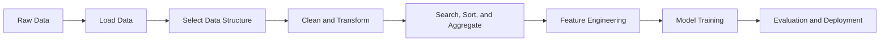
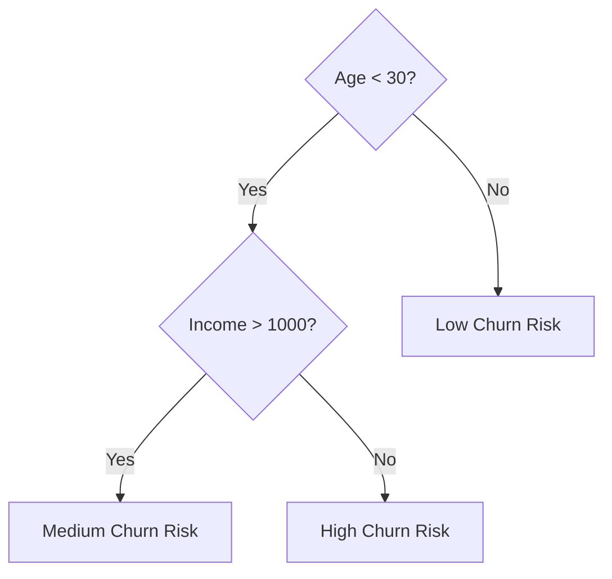
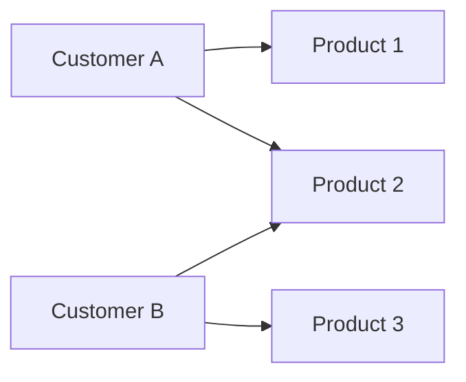
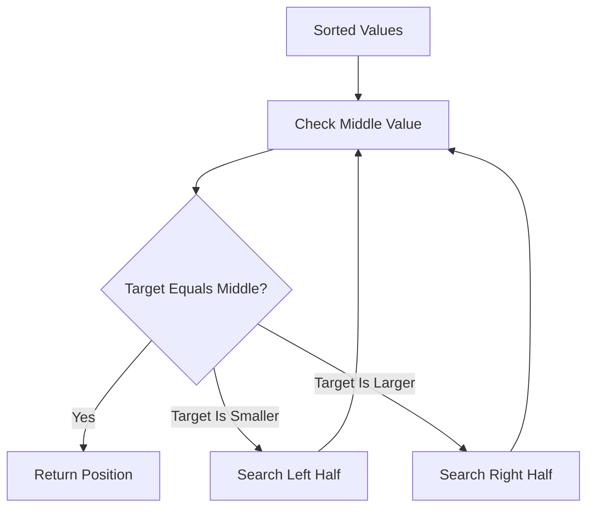
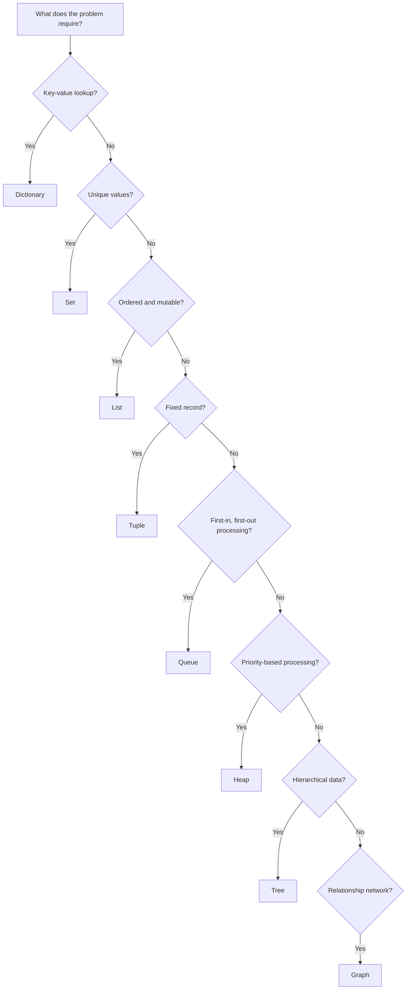

# 014 — Data Structures and Algorithms

**Course:** 02 — Coding and Exploratory Data Analysis
**Module:** Module 04 — Coding for Data Science
**Topic Group:** Data Structures and Algorithms
**Roadmap Source:** Coding for Data Science / Data Structures and Algorithms
**Lesson Type:** Coding
**Lesson Order:** 014
**Suggested Duration:** 20 minutes

---

## 1. Overview

This lesson introduces **Data Structures and Algorithms (DSA)** in the context of AI and Data Science.

Data structures determine how data is organized and accessed, while algorithms define the steps used to process that data.

For a Data Scientist or AI Engineer, DSA knowledge helps you:

* Process large datasets efficiently.
* Choose appropriate Python containers.
* Reduce unnecessary computation.
* Build scalable data pipelines.
* Understand how libraries and machine-learning systems work internally.
* Write cleaner and more maintainable code.

After completing this lesson, you should be able to connect DSA concepts to practical artifacts such as notebooks, data pipelines, APIs, machine-learning experiments, and portfolio projects.

---

## 2. Learning Objectives

By the end of this lesson, you should be able to:

* Explain Data Structures and Algorithms in your own words.
* Distinguish between common data structures.
* Estimate the time and space complexity of simple operations.
* Select an appropriate data structure for a data problem.
* Apply searching, sorting, filtering, and aggregation algorithms.
* Recognize where DSA appears in the AI and Data Science workflow.
* Build a small reproducible Python analysis using efficient data operations.

---

## 3. What Are Data Structures and Algorithms?

### 3.1 Data Structures

A **data structure** is a method of organizing and storing data so that it can be accessed and modified efficiently.

Examples include:

* Arrays
* Lists
* Tuples
* Dictionaries
* Sets
* Stacks
* Queues
* Trees
* Graphs
* Heaps

Different data structures are designed for different types of operations.

For example:

* A list is useful when order matters.
* A set is useful when uniqueness matters.
* A dictionary is useful when values must be retrieved by a key.
* A queue is useful when tasks must be processed in arrival order.
* A graph is useful for representing relationships.

### 3.2 Algorithms

An **algorithm** is a finite sequence of steps used to solve a problem.

Common algorithm categories include:

* Searching
* Sorting
* Filtering
* Aggregation
* Traversal
* Recursion
* Optimization
* Graph processing
* Dynamic programming

A data structure stores the information, while an algorithm operates on that information.

```text
Input Data
    │
    ▼
Data Structure
    │
    ▼
Algorithm
    │
    ▼
Processed Result
```

---

## 4. Why DSA Matters in Data Science

A typical Data Science workflow involves repeated operations on collections of data.



DSA concepts appear throughout this workflow.

| Data Science Task                | Relevant Data Structure or Algorithm |
| -------------------------------- | ------------------------------------ |
| Remove duplicate customer IDs    | Set                                  |
| Map product IDs to product names | Dictionary                           |
| Store ordered observations       | List or array                        |
| Process streaming events         | Queue                                |
| Rank model predictions           | Sorting algorithm or heap            |
| Find nearest observations        | Search algorithm or spatial tree     |
| Represent social connections     | Graph                                |
| Schedule tasks by priority       | Priority queue or heap               |
| Cache previous calculations      | Hash table or dictionary             |
| Explore decision-tree nodes      | Tree traversal                       |

Choosing the wrong structure can make a program slower, harder to read, and more memory-intensive.

---

## 5. Common Data Structures

## 5.1 List

A Python list is an ordered and mutable collection.

```python
sales = [120, 150, 90, 200]

sales.append(175)
sales.sort()

print(sales)
```

Lists are useful for:

* Ordered records
* Sequential processing
* Small collections
* Iteration
* Storing values that may change

However, searching for an arbitrary element in a list may require checking every item.

```python
target = 200

if target in sales:
    print("Sale found")
```

The average search complexity is approximately (O(n)).

---

## 5.2 Tuple

A tuple is ordered but immutable.

```python
coordinate = (10.7626, 106.6602)
latitude, longitude = coordinate
```

Tuples are useful for:

* Fixed records
* Geographic coordinates
* Model configuration values
* Returning multiple values from a function
* Dictionary keys when all elements are hashable

Because tuples cannot be modified after creation, they communicate that the stored values should remain stable.

---

## 5.3 Dictionary

A dictionary stores key-value pairs.

```python
product_prices = {
    "laptop": 1200,
    "mouse": 25,
    "keyboard": 70,
}

print(product_prices["laptop"])
```

Dictionaries are useful for:

* ID-to-value mappings
* Feature configurations
* JSON-like records
* Aggregation results
* Caching
* Fast lookup by key

Average dictionary lookup complexity is approximately (O(1)).

```python
customer = {
    "id": 101,
    "name": "Alice",
    "segment": "Premium",
}
```

---

## 5.4 Set

A set stores unique values.

```python
customer_ids = [101, 102, 101, 103, 102]

unique_customer_ids = set(customer_ids)

print(unique_customer_ids)
```

Sets are useful for:

* Removing duplicates
* Membership testing
* Comparing groups
* Finding intersections and differences

```python
campaign_a = {101, 102, 103}
campaign_b = {102, 103, 104}

common_customers = campaign_a & campaign_b
only_in_a = campaign_a - campaign_b

print(common_customers)
print(only_in_a)
```

Average membership-check complexity is approximately (O(1)).

---

## 5.5 Stack

A stack follows the **Last In, First Out**, or LIFO, principle.

```text
Push A
Push B
Push C

Top
 │
 ▼
[C]
[B]
[A]
```

Python lists can be used as stacks.

```python
stack = []

stack.append("load_data")
stack.append("clean_data")
stack.append("train_model")

latest_task = stack.pop()

print(latest_task)
```

Stacks are useful for:

* Undo operations
* Function calls
* Depth-first search
* Expression evaluation
* Tracking notebook or pipeline states

---

## 5.6 Queue

A queue follows the **First In, First Out**, or FIFO, principle.

```text
First In                           First Out
   │                                   │
   ▼                                   ▼
[Task A] → [Task B] → [Task C] → Processing
```

Use `collections.deque` for efficient queue operations.

```python
from collections import deque

task_queue = deque()

task_queue.append("load_data")
task_queue.append("clean_data")
task_queue.append("train_model")

next_task = task_queue.popleft()

print(next_task)
```

Queues are useful for:

* Data-stream processing
* Background jobs
* Message systems
* Breadth-first search
* Machine-learning inference requests

---

## 5.7 Heap and Priority Queue

A heap allows fast access to the smallest or largest priority item.

Python provides the `heapq` module.

```python
import heapq

errors = [0.45, 0.12, 0.31, 0.08]

smallest_errors = heapq.nsmallest(2, errors)

print(smallest_errors)
```

Heaps are useful for:

* Top-(k) predictions
* Ranking
* Task scheduling
* Finding the largest or smallest observations
* Nearest-neighbor algorithms

---

## 5.8 Tree

A tree represents hierarchical relationships.

```text
Dataset
├── Training Data
│   ├── Class A
│   └── Class B
└── Test Data
    ├── Class A
    └── Class B
```

Trees appear in:

* Decision trees
* Random forests
* File systems
* Hierarchical clustering
* Search indexes
* Syntax parsers

A binary decision tree repeatedly divides data based on feature conditions.



---

## 5.9 Graph

A graph represents entities and their relationships.

A graph consists of:

* **Nodes:** entities
* **Edges:** relationships between entities



Graphs are useful for:

* Recommendation systems
* Social-network analysis
* Knowledge graphs
* Fraud detection
* Route planning
* Dependency analysis
* Graph-based Retrieval-Augmented Generation

---

## 6. Algorithms in Data Workflows

## 6.1 Linear Search

Linear search examines each item until the target is found.

```python
def linear_search(values: list[int], target: int) -> int:
    for index, value in enumerate(values):
        if value == target:
            return index

    return -1


numbers = [4, 7, 2, 9, 5]

result = linear_search(numbers, 9)
print(result)
```

Time complexity:

$$
O(n)
$$

Linear search works with unsorted data but becomes inefficient for very large collections.

---

## 6.2 Binary Search

Binary search repeatedly divides a sorted collection into two halves.



Python provides binary-search utilities in the `bisect` module.

```python
from bisect import bisect_left


def binary_search(values: list[int], target: int) -> int:
    position = bisect_left(values, target)

    if position < len(values) and values[position] == target:
        return position

    return -1


numbers = [2, 4, 5, 7, 9]

print(binary_search(numbers, 7))
```

Time complexity:

$$
O(\log n)
$$

Binary search requires sorted input.

---

## 6.3 Sorting

Sorting arranges values into a defined order.

```python
sales = [
    {"product": "A", "revenue": 500},
    {"product": "B", "revenue": 300},
    {"product": "C", "revenue": 700},
]

sorted_sales = sorted(
    sales,
    key=lambda item: item["revenue"],
    reverse=True,
)

print(sorted_sales)
```

Python's built-in sorting implementation is highly optimized and generally has a time complexity of:

$$
O(n \log n)
$$

Sorting is commonly used for:

* Ranking model predictions
* Creating reports
* Detecting outliers
* Preparing data for binary search
* Finding top-performing categories

---

## 6.4 Filtering

Filtering selects values that satisfy a condition.

```python
sales = [120, 80, 200, 45, 160]

high_value_sales = [
    value
    for value in sales
    if value >= 100
]

print(high_value_sales)
```

Equivalent Pandas operation:

```python
import pandas as pd

df = pd.DataFrame({
    "sale": [120, 80, 200, 45, 160]
})

high_value_rows = df[df["sale"] >= 100]

print(high_value_rows)
```

Filtering usually requires examining each observation:

$$
O(n)
$$

---

## 6.5 Aggregation

Aggregation combines multiple observations into summary statistics.

```python
from collections import defaultdict

records = [
    ("Laptop", 1200),
    ("Mouse", 25),
    ("Laptop", 1100),
    ("Mouse", 30),
]

revenue_by_product = defaultdict(float)

for product, revenue in records:
    revenue_by_product[product] += revenue

print(dict(revenue_by_product))
```

Equivalent Pandas operation:

```python
import pandas as pd

df = pd.DataFrame(
    records,
    columns=["product", "revenue"],
)

summary = (
    df.groupby("product", as_index=False)["revenue"]
    .sum()
    .sort_values("revenue", ascending=False)
)

print(summary)
```

---

## 7. Time and Space Complexity

Algorithm complexity describes how resource usage changes as the input size grows.

### 7.1 Big-O Notation

Big-O notation describes the upper growth rate of an algorithm.

| Complexity    | Name         | Example                          |
| ------------- | ------------ | -------------------------------- |
| (O(1))        | Constant     | Dictionary lookup                |
| (O(\log n))   | Logarithmic  | Binary search                    |
| (O(n))        | Linear       | Scanning a list                  |
| (O(n \log n)) | Linearithmic | Efficient sorting                |
| (O(n^2))      | Quadratic    | Comparing every pair             |
| (O(2^n))      | Exponential  | Some brute-force subset problems |

The goal is not always to find the theoretically fastest algorithm. The goal is to choose a solution that is correct, readable, and efficient enough for the expected data size.

### 7.2 Growth Comparison

```text
Operations
   ^
   |                               O(n²)
   |                         /
   |                    /
   |               O(n log n)
   |            /
   |         O(n)
   |      /
   |   O(log n)
   | O(1)
   +------------------------------------> Input Size
```

### 7.3 Example: Membership Testing

Using a list:

```python
customer_ids = list(range(1_000_000))

exists = 999_999 in customer_ids
```

Expected complexity:

$$
O(n)
$$

Using a set:

```python
customer_ids = set(range(1_000_000))

exists = 999_999 in customer_ids
```

Expected average complexity:

$$
O(1)
$$

The second version uses more memory but provides much faster repeated membership checks.

---

## 8. Choosing the Right Data Structure

Use the following decision guide:



Before selecting a structure, ask:

1. Does order matter?
2. Can duplicate values appear?
3. Is fast lookup required?
4. Will the collection change?
5. Is the data hierarchical?
6. Does the data describe relationships?
7. Is memory usage important?
8. How large can the dataset become?

---

## 9. Practical Example: Sales Data Analysis

Suppose a small sales dataset contains the following columns:

```text
order_id, customer_id, product, quantity, unit_price
```

The analysis workflow may look like this:


### Example Implementation

```python
from pathlib import Path

import pandas as pd


REQUIRED_COLUMNS = {
    "order_id",
    "customer_id",
    "product",
    "quantity",
    "unit_price",
}


def load_sales_data(file_path: str) -> pd.DataFrame:
    path = Path(file_path)

    if not path.exists():
        raise FileNotFoundError(f"File not found: {path}")

    df = pd.read_csv(path)

    missing_columns = REQUIRED_COLUMNS - set(df.columns)

    if missing_columns:
        raise ValueError(
            f"Missing required columns: {sorted(missing_columns)}"
        )

    return df


def clean_sales_data(df: pd.DataFrame) -> pd.DataFrame:
    cleaned = df.copy()

    cleaned = cleaned.drop_duplicates(subset=["order_id"])

    cleaned["quantity"] = pd.to_numeric(
        cleaned["quantity"],
        errors="coerce",
    )

    cleaned["unit_price"] = pd.to_numeric(
        cleaned["unit_price"],
        errors="coerce",
    )

    cleaned = cleaned.dropna(
        subset=["quantity", "unit_price"]
    )

    cleaned = cleaned[
        (cleaned["quantity"] > 0)
        & (cleaned["unit_price"] >= 0)
    ]

    cleaned["revenue"] = (
        cleaned["quantity"]
        * cleaned["unit_price"]
    )

    return cleaned


def summarize_products(df: pd.DataFrame) -> pd.DataFrame:
    return (
        df.groupby("product", as_index=False)
        .agg(
            total_revenue=("revenue", "sum"),
            total_quantity=("quantity", "sum"),
            unique_customers=("customer_id", "nunique"),
        )
        .sort_values(
            "total_revenue",
            ascending=False,
        )
    )
```

The example uses several DSA ideas:

* A **set** validates required column names.
* A **DataFrame** stores tabular data.
* Hash-based grouping aggregates records.
* Sorting ranks products by revenue.
* Functions divide the workflow into reusable steps.

---

## 10. Reproducible Data Workflow

Good DSA knowledge supports reproducible analysis.

```text
Raw Data
   │
   ▼
Validation
   │
   ▼
Cleaning Functions
   │
   ▼
Transformation Functions
   │
   ▼
Analysis Table
   │
   ▼
Chart and Written Insights
   │
   ▼
Reusable Script, Pipeline, or API
```

A reproducible workflow should:

* Preserve the original raw data.
* Store cleaning steps in code.
* Separate loading, cleaning, analysis, and visualization.
* Record assumptions and data-quality issues.
* Use descriptive function and variable names.
* Include a README with execution instructions.
* Save package dependencies.
* Track code changes with Git.

---

## 11. Common Mistakes

### 11.1 Using a List for Repeated Membership Checks

Less efficient:

```python
valid_ids = [101, 102, 103, 104]

if customer_id in valid_ids:
    ...
```

Better for repeated checks:

```python
valid_ids = {101, 102, 103, 104}

if customer_id in valid_ids:
    ...
```

---

### 11.2 Writing Unnecessary Nested Loops

Less efficient:

```python
for customer in customers:
    for order in orders:
        if customer["id"] == order["customer_id"]:
            ...
```

This may require approximately:

$$
O(n \times m)
$$

A dictionary lookup is often better:

```python
customers_by_id = {
    customer["id"]: customer
    for customer in customers
}

for order in orders:
    customer = customers_by_id.get(
        order["customer_id"]
    )
```

---

### 11.3 Ignoring Library Optimizations

Avoid manually iterating through every DataFrame row when a vectorized Pandas operation is available.

Less efficient:

```python
revenues = []

for _, row in df.iterrows():
    revenues.append(
        row["quantity"] * row["unit_price"]
    )

df["revenue"] = revenues
```

Preferred:

```python
df["revenue"] = (
    df["quantity"]
    * df["unit_price"]
)
```

---

### 11.4 Optimizing Too Early

Do not replace clear code with complex code before measuring performance.

A recommended process is:

```text
Write Correct Code
        ↓
Test the Result
        ↓
Measure Performance
        ↓
Find the Bottleneck
        ↓
Optimize the Bottleneck
```

---

### 11.5 Producing Charts Without Insights

A chart is not a complete analysis.

Weak conclusion:

> Product A has the highest bar.

Better conclusion:

> Product A generated 42% of total revenue but was purchased by only 18% of unique customers. Revenue is therefore concentrated in a relatively small customer segment, which may create retention risk.

---

## 12. Practical Exercise

Use a small CSV dataset such as sales, customer transactions, movie ratings, or product orders.

### Task 1: Load and Inspect the Data

* Load the CSV file with Pandas.
* Display its shape, column names, and data types.
* Identify missing values and duplicate rows.

### Task 2: Apply Appropriate Data Structures

Use at least three of the following:

* List
* Tuple
* Dictionary
* Set
* Queue
* Heap

Possible examples:

* Use a set to find unique customer IDs.
* Use a dictionary to map product IDs to categories.
* Use a tuple to store a fixed date range.
* Use a heap to find the top five transactions.

### Task 3: Build Reusable Functions

Create separate functions for:

* Loading data
* Validating columns
* Cleaning values
* Creating derived features
* Aggregating results

### Task 4: Produce Three Insights

Each insight should include:

1. A numerical result
2. A chart or summary table
3. An interpretation
4. A possible recommendation

### Task 5: Document the Workflow

Create a short README containing:

* Project objective
* Dataset description
* Installation instructions
* Execution instructions
* Output description
* Assumptions
* Known limitations

---

## 13. Suggested Mini Challenge

Given a list of transactions:

```python
transactions = [
    {"customer": "A", "amount": 120},
    {"customer": "B", "amount": 80},
    {"customer": "A", "amount": 150},
    {"customer": "C", "amount": 200},
    {"customer": "B", "amount": 40},
]
```

Complete the following tasks:

1. Calculate total spending by customer.
2. Find the highest-spending customer.
3. Return the top two transactions.
4. Count the number of unique customers.
5. Explain the time complexity of your solution.

Example starting point:

```python
from collections import defaultdict
import heapq


spending_by_customer = defaultdict(float)

for transaction in transactions:
    spending_by_customer[
        transaction["customer"]
    ] += transaction["amount"]

highest_spender = max(
    spending_by_customer.items(),
    key=lambda item: item[1],
)

top_transactions = heapq.nlargest(
    2,
    transactions,
    key=lambda item: item["amount"],
)

unique_customers = {
    transaction["customer"]
    for transaction in transactions
}

print(spending_by_customer)
print(highest_spender)
print(top_transactions)
print(unique_customers)
```

---

## 14. Completion Checklist

* [ ] I can explain Data Structures and Algorithms in one or two minutes.
* [ ] I understand the difference between a data structure and an algorithm.
* [ ] I can select between a list, tuple, dictionary, and set.
* [ ] I understand stack, queue, tree, graph, and heap use cases.
* [ ] I can explain (O(1)), (O(\log n)), (O(n)), and (O(n^2)).
* [ ] I can identify an inefficient nested loop.
* [ ] I can implement basic searching, sorting, filtering, and aggregation.
* [ ] I have created a notebook, script, query, chart, model, API, or practical note for this lesson.
* [ ] I have recorded at least one assumption, limitation, or question for further analysis.
* [ ] My analysis can be reproduced without repeating manual steps.

---

## 15. Related Outcome

Use Python, SQL, data libraries, notebooks, and Git to build efficient and reproducible data workflows.

---

## 16. Related Project

### Mini Project: SQL and Python Sales Analysis

Build a small sales-analysis system using:

* SQLite or PostgreSQL for data storage
* SQL for data extraction
* Pandas for cleaning and aggregation
* Matplotlib for visualization
* Python functions for reusable transformations
* Git for version control

Suggested outputs:

* A cleaned sales table
* Revenue by product and category
* Top customers
* Monthly sales trends
* Three written business insights
* A README explaining how to run the project

---

## 17. Key Takeaways

* Data structures determine how information is organized.
* Algorithms determine how information is processed.
* The best data structure depends on the operations required.
* Complexity analysis helps predict how code behaves as datasets grow.
* Dictionaries and sets provide efficient lookup in many common problems.
* Trees and graphs represent hierarchical and relational information.
* Efficient code should also remain readable, testable, and reproducible.
* Performance optimization should be based on measurement rather than guesswork.

---

## 18. Summary

**Data Structures and Algorithms** are foundational skills for AI Engineers and Data Scientists.

They help transform exploratory notebook code into reliable scripts, scalable pipelines, APIs, recommendation systems, graph applications, and production machine-learning services.

Do not study DSA only as abstract interview material. Apply each concept to a real dataset or engineering problem and convert it into a practical artifact such as:

* A notebook
* A SQL query
* A chart
* A reusable Python package
* A machine-learning experiment
* An API
* A Docker service
* A portfolio project

The most valuable question is not only:

> Which algorithm should I memorize?

It is:

> Which data structure and algorithm make this data problem correct, clear, reproducible, and efficient?
