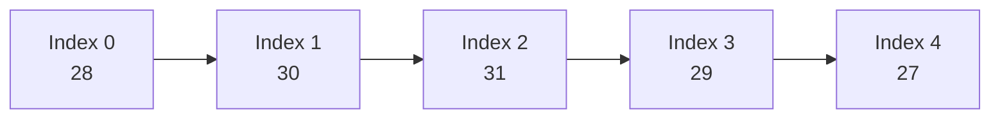
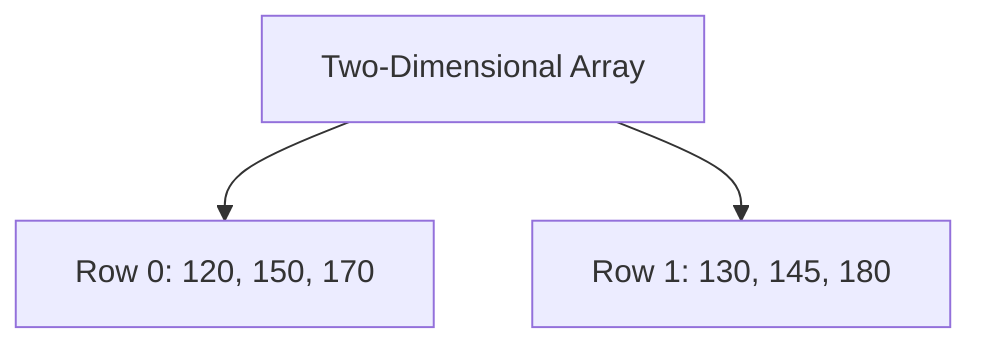
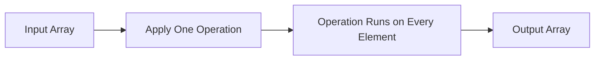
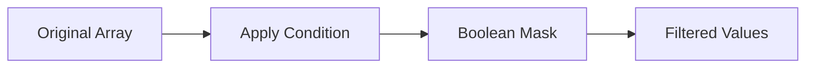
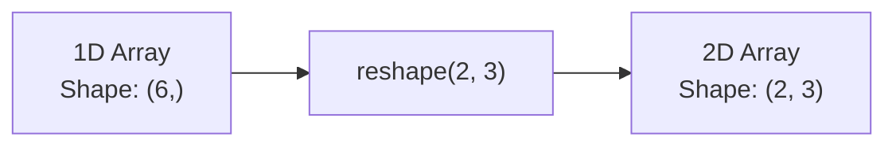
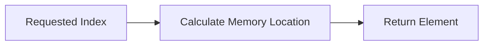
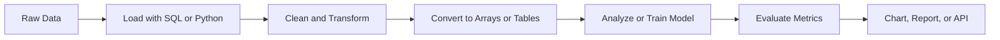
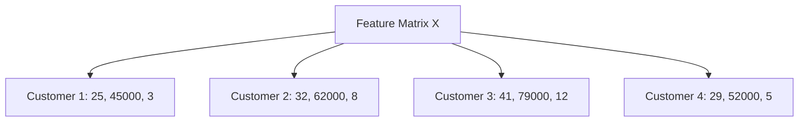
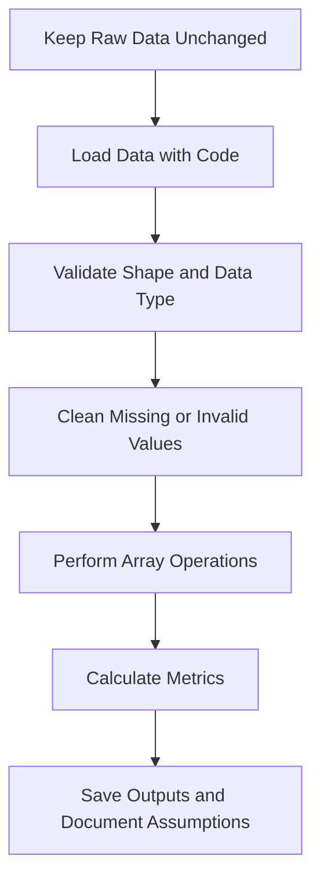
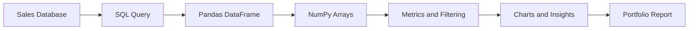

# 015 - Array

**Course:** 02 - Coding and Exploratory Data Analysis
**Module:** Module 04 - Coding for Data Science
**Content Group:** Data Structures and Algorithms
**Roadmap Source:** Coding for Data Science / Data Structures and Algorithms
**Lesson Type:** Coding
**Order in Module:** 015
**Suggested Duration:** 20 minutes

---

## 1. Overview

This lesson explains **arrays** in the context of AI and Data Science.

An array is an ordered data structure used to store multiple values under one variable name. Arrays are essential for working with:

* Numerical datasets
* Feature vectors
* Matrices
* Images
* Time-series observations
* Machine-learning inputs
* Model parameters and predictions

After completing this lesson, you should understand how arrays support data processing, numerical computation, machine learning, experimentation, and deployment workflows.

---

## 2. Learning Objectives

By the end of this lesson, you should be able to:

* Explain what an array is in your own words.
* Create and manipulate arrays in Python.
* Access array elements using indexes.
* Extract subsets using slicing.
* Perform vectorized numerical operations.
* Filter array values using conditions.
* Explain the difference between Python lists and NumPy arrays.
* Apply array operations to a small data-analysis problem.

---

## 3. What Is an Array?

An **array** is an ordered collection of values.

Each value in an array is called an **element**. Each element can be accessed using a numerical position called an **index**.

```python
temperatures = [28, 30, 31, 29, 27]
```

The array contains five temperature values:

| Index | Value |
| ----: | ----: |
|     0 |    28 |
|     1 |    30 |
|     2 |    31 |
|     3 |    29 |
|     4 |    27 |

Python uses **zero-based indexing**, which means that the first element is stored at index `0`.

```python
print(temperatures[0])  # 28
print(temperatures[2])  # 31
print(temperatures[-1]) # 27
```

### Array Structure



---

## 4. Why Arrays Matter in Data Science

Most data used in AI and Data Science can be represented using arrays.

| Data                 | Array representation          |
| -------------------- | ----------------------------- |
| Customer ages        | One-dimensional array         |
| Sales table          | Two-dimensional array         |
| Grayscale image      | Two-dimensional array         |
| RGB image            | Three-dimensional array       |
| Feature vector       | One-dimensional array         |
| Dataset              | Two-dimensional array         |
| Neural-network batch | Multi-dimensional array       |
| Time series          | Ordered one-dimensional array |

A customer record may be represented as:

```python
customer = [25, 45000, 3, 0]
```

The values could represent:

```text
[age, annual_income, number_of_purchases, subscription_status]
```

A dataset containing multiple customers can be represented as:

```python
customers = [
    [25, 45000, 3, 0],
    [32, 62000, 8, 1],
    [41, 79000, 12, 1]
]
```

Each row represents one customer, while each column represents one feature.

---

## 5. Python Lists and NumPy Arrays

Python programmers commonly work with two array-like structures:

1. Python lists
2. NumPy arrays

### 5.1 Python List

A Python list is a general-purpose collection that can contain different data types.

```python
record = [101, "Laptop", 999.99, True]
```

Lists are flexible, but they are not optimized for large numerical calculations.

### 5.2 NumPy Array

NumPy arrays are designed for efficient numerical computation.

```python
import numpy as np

prices = np.array([10.5, 15.0, 8.75, 12.25])

print(prices)
print(prices.dtype)
```

Output:

```text
[10.5  15.    8.75 12.25]
float64
```

NumPy arrays usually store elements with the same data type.

---

## 6. Python List vs. NumPy Array

| Feature                | Python list             | NumPy array                    |
| ---------------------- | ----------------------- | ------------------------------ |
| Data types             | Can contain mixed types | Usually contains one type      |
| Numerical operations   | Often requires loops    | Supports vectorized operations |
| Memory efficiency      | Lower                   | Higher                         |
| Numerical performance  | Slower                  | Faster                         |
| Multi-dimensional data | Uses nested lists       | Native support                 |
| Main use               | General programming     | Data Science and AI            |

Consider a Python list:

```python
values = [1, 2, 3]

print(values * 2)
```

Output:

```text
[1, 2, 3, 1, 2, 3]
```

The list is repeated rather than multiplied numerically.

With NumPy:

```python
import numpy as np

values = np.array([1, 2, 3])

print(values * 2)
```

Output:

```text
[2 4 6]
```

NumPy applies the multiplication to every element.

---

## 7. Creating NumPy Arrays

First, import NumPy:

```python
import numpy as np
```

### Create an Array from a List

```python
scores = np.array([78, 85, 92, 88, 76])

print(scores)
```

### Create an Array of Zeros

```python
zeros = np.zeros(5)

print(zeros)
```

Output:

```text
[0. 0. 0. 0. 0.]
```

### Create an Array of Ones

```python
ones = np.ones(5)

print(ones)
```

Output:

```text
[1. 1. 1. 1. 1.]
```

### Create a Number Sequence

```python
numbers = np.arange(0, 10, 2)

print(numbers)
```

Output:

```text
[0 2 4 6 8]
```

The arguments represent:

```text
start = 0
stop  = 10
step  = 2
```

### Create Evenly Spaced Values

```python
values = np.linspace(0, 1, 5)

print(values)
```

Output:

```text
[0.   0.25 0.5  0.75 1.  ]
```

### Create Random Values

```python
random_values = np.random.random(5)

print(random_values)
```

---

## 8. Array Dimensions

Arrays can have one or more dimensions.

### 8.1 One-Dimensional Array

A one-dimensional array is similar to a sequence or vector.

```python
sales = np.array([120, 150, 170, 160])
```

Its shape is:

```python
print(sales.shape)
```

Output:

```text
(4,)
```

### 8.2 Two-Dimensional Array

A two-dimensional array contains rows and columns.

```python
sales = np.array([
    [120, 150, 170],
    [130, 145, 180]
])
```

Its shape is:

```python
print(sales.shape)
```

Output:

```text
(2, 3)
```

This means that the array has:

* 2 rows
* 3 columns



### 8.3 Three-Dimensional Array

A three-dimensional array can represent multiple matrices or an image with multiple channels.

```python
images = np.array([
    [
        [0, 255],
        [128, 64]
    ],
    [
        [255, 0],
        [64, 128]
    ]
])
```

Multi-dimensional arrays are commonly used for:

* Images
* Video frames
* Neural-network batches
* Scientific simulations

---

## 9. Important Array Attributes

Consider the following array:

```python
data = np.array([
    [10, 20, 30],
    [40, 50, 60]
])
```

### Shape

The `shape` attribute shows the size of each dimension.

```python
print(data.shape)
```

Output:

```text
(2, 3)
```

### Number of Dimensions

```python
print(data.ndim)
```

Output:

```text
2
```

### Number of Elements

```python
print(data.size)
```

Output:

```text
6
```

### Data Type

```python
print(data.dtype)
```

Possible output:

```text
int64
```

A useful inspection pattern is:

```python
print("Shape:", data.shape)
print("Dimensions:", data.ndim)
print("Size:", data.size)
print("Data type:", data.dtype)
```

---

## 10. Accessing Array Elements

### 10.1 One-Dimensional Indexing

```python
scores = np.array([78, 85, 92, 88, 76])

print(scores[0])   # 78
print(scores[2])   # 92
print(scores[-1])  # 76
```

Negative indexes count from the end:

```text
scores[-1] → last element
scores[-2] → second-to-last element
```

### 10.2 Two-Dimensional Indexing

```python
matrix = np.array([
    [10, 20, 30],
    [40, 50, 60]
])
```

Access an element using:

```python
matrix[row_index, column_index]
```

Examples:

```python
print(matrix[0, 1])  # 20
print(matrix[1, 2])  # 60
```

---

## 11. Array Slicing

Slicing extracts part of an array.

The general syntax is:

```python
array[start:stop:step]
```

The `stop` position is not included.

```python
values = np.array([10, 20, 30, 40, 50, 60])
```

### Select a Range

```python
print(values[1:4])
```

Output:

```text
[20 30 40]
```

### Select from the Beginning

```python
print(values[:3])
```

Output:

```text
[10 20 30]
```

### Select to the End

```python
print(values[3:])
```

Output:

```text
[40 50 60]
```

### Select Every Second Element

```python
print(values[::2])
```

Output:

```text
[10 30 50]
```

### Reverse the Array

```python
print(values[::-1])
```

Output:

```text
[60 50 40 30 20 10]
```

---

## 12. Slicing Two-Dimensional Arrays

Consider the following matrix:

```python
matrix = np.array([
    [10, 20, 30],
    [40, 50, 60],
    [70, 80, 90]
])
```

### Select One Row

```python
print(matrix[1, :])
```

Output:

```text
[40 50 60]
```

### Select One Column

```python
print(matrix[:, 1])
```

Output:

```text
[20 50 80]
```

### Select a Submatrix

```python
print(matrix[0:2, 1:3])
```

Output:

```text
[[20 30]
 [50 60]]
```

The expression selects:

* Rows `0` and `1`
* Columns `1` and `2`

---

## 13. Modifying Array Values

NumPy arrays are **mutable**, which means their values can be changed.

```python
scores = np.array([78, 85, 92, 88])

scores[0] = 80

print(scores)
```

Output:

```text
[80 85 92 88]
```

A range of elements can also be modified:

```python
scores[1:3] = 90

print(scores)
```

Output:

```text
[80 90 90 88]
```

You can also modify values using conditions:

```python
scores[scores < 85] = 85

print(scores)
```

---

## 14. Vectorized Operations

A major advantage of NumPy arrays is **vectorization**.

Vectorization means applying an operation to an entire array without manually writing a loop.

```python
prices = np.array([100, 200, 300])
```

### Add a Value

```python
new_prices = prices + 20

print(new_prices)
```

Output:

```text
[120 220 320]
```

### Multiply Every Element

```python
discounted_prices = prices * 0.9

print(discounted_prices)
```

Output:

```text
[ 90. 180. 270.]
```

### Compare Every Element

```python
print(prices > 150)
```

Output:

```text
[False  True  True]
```

### Vectorization Process



Vectorized code is usually:

* Shorter
* Faster
* Easier to read
* Less error-prone

---

## 15. Operations Between Arrays

Arrays with compatible shapes can be combined element by element.

```python
array_a = np.array([10, 20, 30])
array_b = np.array([1, 2, 3])
```

### Addition

```python
print(array_a + array_b)
```

Output:

```text
[11 22 33]
```

### Subtraction

```python
print(array_a - array_b)
```

Output:

```text
[ 9 18 27]
```

### Multiplication

```python
print(array_a * array_b)
```

Output:

```text
[10 40 90]
```

### Division

```python
print(array_a / array_b)
```

Output:

```text
[10. 10. 10.]
```

The operations above are **element-wise operations**.

---

## 16. Aggregation Functions

Aggregation functions summarize the values in an array.

```python
sales = np.array([120, 150, 170, 160, 200])
```

### Sum

```python
print(sales.sum())
```

Output:

```text
800
```

### Mean

```python
print(sales.mean())
```

Output:

```text
160.0
```

### Minimum and Maximum

```python
print(sales.min())
print(sales.max())
```

Output:

```text
120
200
```

### Standard Deviation

```python
print(sales.std())
```

### Position of the Minimum and Maximum

```python
print(sales.argmin())
print(sales.argmax())
```

Output:

```text
0
4
```

These functions are frequently used during Exploratory Data Analysis.

---

## 17. Filtering Arrays

Boolean conditions can be used to select array elements.

```python
scores = np.array([45, 67, 82, 91, 58, 76])
```

Create a Boolean mask:

```python
mask = scores >= 70

print(mask)
```

Output:

```text
[False False  True  True False  True]
```

Apply the mask:

```python
passing_scores = scores[mask]

print(passing_scores)
```

Output:

```text
[82 91 76]
```

The condition can also be written directly:

```python
passing_scores = scores[scores >= 70]
```

### Filtering Process



### Multiple Conditions

Use `&` for AND conditions:

```python
selected = scores[(scores >= 70) & (scores <= 90)]

print(selected)
```

Use `|` for OR conditions:

```python
selected = scores[(scores < 50) | (scores > 90)]

print(selected)
```

Each condition should be placed inside parentheses.

---

## 18. Reshaping Arrays

Reshaping changes an array's dimensions without changing its values.

```python
values = np.array([1, 2, 3, 4, 5, 6])
```

Convert the array into two rows and three columns:

```python
matrix = values.reshape(2, 3)

print(matrix)
```

Output:

```text
[[1 2 3]
 [4 5 6]]
```

Convert the matrix back into one dimension:

```python
flattened = matrix.flatten()

print(flattened)
```

Output:

```text
[1 2 3 4 5 6]
```

Reshaping is common when preparing data for machine-learning models.



The total number of elements must remain unchanged.

For example, six elements can be reshaped into:

* `(2, 3)`
* `(3, 2)`
* `(1, 6)`
* `(6, 1)`

However, six elements cannot be reshaped into `(2, 4)`.

---

## 19. Combining Arrays

Arrays can be combined to create a larger array.

```python
first = np.array([1, 2, 3])
second = np.array([4, 5, 6])
```

### Concatenate Arrays

```python
combined = np.concatenate([first, second])

print(combined)
```

Output:

```text
[1 2 3 4 5 6]
```

### Stack Vertically

```python
vertical = np.vstack([first, second])

print(vertical)
```

Output:

```text
[[1 2 3]
 [4 5 6]]
```

### Stack Horizontally

```python
horizontal = np.hstack([first, second])

print(horizontal)
```

Output:

```text
[1 2 3 4 5 6]
```

---

## 20. Array Copying

Assigning an array to another variable does not necessarily create an independent copy.

```python
original = np.array([10, 20, 30])

reference = original
reference[0] = 999

print(original)
```

Output:

```text
[999  20  30]
```

Both variables reference the same array.

To create an independent copy, use `.copy()`:

```python
original = np.array([10, 20, 30])

copied = original.copy()
copied[0] = 999

print(original)
print(copied)
```

Output:

```text
[10 20 30]
[999  20  30]
```

Use `.copy()` when the original data must remain unchanged.

---

## 21. Array Operation Complexity

For an array containing `n` elements:

| Operation                    | Typical time complexity |
| ---------------------------- | ----------------------: |
| Access an element by index   |                  `O(1)` |
| Update an element by index   |                  `O(1)` |
| Search for an unsorted value |                  `O(n)` |
| Traverse all elements        |                  `O(n)` |
| Insert at the beginning      |                  `O(n)` |
| Insert in the middle         |                  `O(n)` |
| Delete from the middle       |                  `O(n)` |

Access by index is fast because the element's memory location can be calculated directly.



Insertion and deletion can be slower because other elements may need to be shifted.

---

## 22. Arrays in a Data Science Workflow

Arrays commonly appear after raw data has been loaded and cleaned.



Example:

```python
import pandas as pd

df = pd.read_csv("sales.csv")

sales_array = df["sales"].to_numpy()

average_sales = sales_array.mean()
highest_sales = sales_array.max()

print("Average sales:", average_sales)
print("Highest sales:", highest_sales)
```

The conversion workflow is:

```text
CSV Column
    ↓
Pandas Series
    ↓
NumPy Array
    ↓
Numerical Analysis
    ↓
Metric or Chart
```

---

## 23. Example: Sales Analysis

Suppose we have daily sales data:

```python
import numpy as np

sales = np.array([120, 150, 90, 200, 175, 130, 220])
```

### Calculate Summary Statistics

```python
total_sales = sales.sum()
average_sales = sales.mean()
highest_sales = sales.max()
lowest_sales = sales.min()

print("Total:", total_sales)
print("Average:", average_sales)
print("Highest:", highest_sales)
print("Lowest:", lowest_sales)
```

### Find Sales Above Average

```python
above_average = sales[sales > average_sales]

print("Sales above average:", above_average)
```

### Count Days Above Average

```python
number_of_days = np.sum(sales > average_sales)

print("Number of days above average:", number_of_days)
```

### Calculate Percentage Change

```python
percentage_change = (
    (sales[1:] - sales[:-1]) / sales[:-1]
) * 100

print(percentage_change)
```

Interpretation:

* Positive values indicate an increase.
* Negative values indicate a decrease.
* Large changes may require further investigation.

---

## 24. Example: Feature Matrix for Machine Learning

A machine-learning dataset usually uses:

* Rows for observations
* Columns for features

```python
features = np.array([
    [25, 45000, 3],
    [32, 62000, 8],
    [41, 79000, 12],
    [29, 52000, 5]
])
```

The columns could represent:

```text
age, annual_income, number_of_purchases
```



Select individual columns:

```python
ages = features[:, 0]
incomes = features[:, 1]
purchases = features[:, 2]
```

Calculate the average of each column:

```python
column_means = features.mean(axis=0)

print(column_means)
```

Calculate the average of each row:

```python
row_means = features.mean(axis=1)

print(row_means)
```

In NumPy:

* `axis=0` calculates down the rows and returns one result per column.
* `axis=1` calculates across the columns and returns one result per row.

---

## 25. Example: Image as an Array

A grayscale image can be represented as a two-dimensional array.

```python
image = np.array([
    [0, 50, 100],
    [150, 200, 255],
    [80, 120, 160]
])
```

Each number represents pixel brightness:

```text
0   → black
255 → white
```

### Normalize the Pixel Values

```python
normalized_image = image / 255.0

print(normalized_image)
```

The normalized values are between `0` and `1`.

This format is commonly used as input for machine-learning models.

### Increase Brightness Safely

Convert the array before adding values to avoid integer overflow:

```python
brighter_image = np.clip(
    image.astype(np.int16) + 30,
    0,
    255
).astype(np.uint8)
```

The `np.clip()` function keeps all values between `0` and `255`.

---

## 26. Reproducible Array Workflow

Good array-based analysis should be reproducible.



Example validation:

```python
import numpy as np

sales = np.array([100, 120, 150, 130])

assert sales.ndim == 1
assert sales.size > 0
assert np.all(sales >= 0)
```

Assertions help detect invalid data before the analysis continues.

A reusable validation function could be:

```python
import numpy as np


def validate_sales(values: np.ndarray) -> None:
    if values.ndim != 1:
        raise ValueError("Sales data must be one-dimensional.")

    if values.size == 0:
        raise ValueError("Sales data cannot be empty.")

    if not np.issubdtype(values.dtype, np.number):
        raise TypeError("Sales data must contain numerical values.")

    if np.any(values < 0):
        raise ValueError("Sales values cannot be negative.")
```

---

## 27. Common Mistakes

### 27.1 Confusing List Repetition with Multiplication

```python
values = [1, 2, 3]

print(values * 2)
```

Output:

```text
[1, 2, 3, 1, 2, 3]
```

For numerical multiplication, use NumPy:

```python
values = np.array([1, 2, 3])

print(values * 2)
```

Output:

```text
[2 4 6]
```

### 27.2 Using an Invalid Index

```python
values = np.array([10, 20, 30])

print(values[3])
```

This raises an `IndexError` because the valid indexes are:

```text
0, 1, 2
```

### 27.3 Combining Incompatible Shapes

```python
first = np.array([1, 2, 3])
second = np.array([1, 2])

result = first + second
```

This raises a broadcasting error because the shapes are incompatible.

Inspect array shapes before combining them:

```python
print(first.shape)
print(second.shape)
```

### 27.4 Modifying a View Accidentally

Some slices share memory with the original array.

```python
original = np.array([10, 20, 30, 40])

subset = original[1:3]
subset[0] = 999

print(original)
```

Output:

```text
[ 10 999  30  40]
```

Use `.copy()` when an independent array is required:

```python
subset = original[1:3].copy()
```

### 27.5 Ignoring Data Types

```python
values = np.array([1, 2, 3], dtype=np.int32)

values[0] = 2.9

print(values[0])
```

Output:

```text
2
```

The decimal portion is removed because the array stores integers.

Inspect the data type when precision matters:

```python
print(values.dtype)
```

### 27.6 Performing Manual, Unrecorded Cleaning

Avoid manually changing values without recording the transformation.

Instead, write reproducible code:

```python
sales = np.array([100, -10, 150, 200], dtype=float)

cleaned_sales = np.where(sales < 0, np.nan, sales)
```

### 27.7 Producing Metrics Without Interpretation

A metric alone is not a complete insight.

Weak result:

```text
Average sales = 154.3
```

Better result:

```text
Average daily sales were 154.3 units. Three of the seven days were
above average, and the highest-performing day reached 220 units.
```

---

## 28. Practical Exercise

Use a small CSV dataset containing sales data.

Suggested columns:

```text
date, product, quantity, unit_price, region
```

### Task 1: Load the Dataset

```python
import pandas as pd
import numpy as np

df = pd.read_csv("sales.csv")
```

### Task 2: Inspect the Data

```python
print(df.head())
print(df.info())
print(df.isna().sum())
```

### Task 3: Convert Columns to Arrays

```python
quantities = df["quantity"].to_numpy()
prices = df["unit_price"].to_numpy()
```

### Task 4: Calculate Revenue

```python
revenue = quantities * prices
```

### Task 5: Add Revenue to the DataFrame

```python
df["revenue"] = revenue
```

### Task 6: Calculate Summary Metrics

```python
total_revenue = revenue.sum()
average_revenue = revenue.mean()
highest_revenue = revenue.max()

print("Total revenue:", total_revenue)
print("Average revenue:", average_revenue)
print("Highest transaction revenue:", highest_revenue)
```

### Task 7: Filter High-Value Transactions

```python
high_value_mask = revenue > average_revenue
high_value_transactions = df[high_value_mask]

print(high_value_transactions)
```

### Task 8: Create Three Insights

Answer questions such as:

1. Which transaction generated the highest revenue?
2. How many transactions were above average?
3. Which region generated the most revenue?
4. What percentage of total revenue came from high-value transactions?

Calculate the high-value revenue percentage:

```python
high_value_percentage = (
    revenue[revenue > average_revenue].sum()
    / total_revenue
) * 100

print("High-value revenue percentage:", high_value_percentage)
```

### Task 9: Produce a Summary Table

```python
regional_summary = (
    df.groupby("region", as_index=False)["revenue"]
    .sum()
    .sort_values("revenue", ascending=False)
)

print(regional_summary)
```

### Task 10: Document the Analysis

Record:

* Data-cleaning decisions
* Missing-value handling
* Assumptions
* Important findings
* Limitations
* Questions for further analysis

---

## 29. Mini Challenge

Given the following array:

```python
temperatures = np.array([
    [28, 30, 31, 29, 27],
    [26, 29, 32, 30, 28],
    [27, 31, 33, 31, 29]
])
```

Complete the following tasks:

1. Print the array's shape.
2. Calculate the overall average temperature.
3. Calculate the average temperature for each row.
4. Calculate the average temperature for each column.
5. Find all temperatures above `30`.
6. Find the highest temperature.
7. Find the position of the highest temperature.
8. Normalize the temperatures to a range between `0` and `1`.
9. Explain what the rows and columns could represent.

### Normalization Formula

$$
x_{\text{normalized}} = \frac{x-x_{\min}}{x_{\max}-x_{\min}}
$$

### Python Implementation

```python
minimum = temperatures.min()
maximum = temperatures.max()

normalized = (
    temperatures - minimum
) / (
    maximum - minimum
)

print(normalized)
```

### Find the Position of the Maximum Value

```python
flat_index = temperatures.argmax()
row_index, column_index = np.unravel_index(
    flat_index,
    temperatures.shape
)

print("Maximum position:", row_index, column_index)
```

---

## 30. Completion Checklist

* [ ] I can explain an array in one or two minutes.
* [ ] I understand zero-based indexing.
* [ ] I can create one-dimensional and two-dimensional arrays.
* [ ] I can access and modify array elements.
* [ ] I can use slicing to select rows, columns, and ranges.
* [ ] I can perform vectorized numerical operations.
* [ ] I can filter values using Boolean conditions.
* [ ] I can calculate summary statistics from an array.
* [ ] I understand the difference between Python lists and NumPy arrays.
* [ ] I can inspect an array's shape, size, dimensions, and data type.
* [ ] I understand the difference between an array reference and a copy.
* [ ] I have created a notebook, chart, script, model, API, or practical note for this lesson.
* [ ] I have documented at least one assumption, limitation, or question for further analysis.

---

## 31. Related Outcome

Use Python, SQL, data libraries, notebooks, and Git to build reproducible data workflows.

Arrays contribute to this outcome by providing an efficient structure for:

* Numerical computation
* Data transformation
* Feature engineering
* Statistical analysis
* Image processing
* Model training
* Metric calculation
* Prediction storage

---

## 32. Related Project

### Mini Project: SQL and Python Sales Analysis

Build a small data-analysis workflow using:

* A sales database
* SQL queries
* Pandas DataFrames
* NumPy arrays
* Summary metrics
* Charts
* A Markdown report

### Suggested Workflow



### Suggested Project Structure

```text
sales_analysis/
├── data/
│   ├── raw/
│   │   └── sales.csv
│   └── processed/
│       └── cleaned_sales.csv
├── notebooks/
│   └── sales_analysis.ipynb
├── src/
│   ├── data_cleaning.py
│   └── analysis.py
├── reports/
│   └── findings.md
├── requirements.txt
└── README.md
```

### Suggested Deliverables

* One reproducible notebook
* One reusable Python script
* At least three summary metrics
* At least two charts
* Three written insights
* A README explaining how to run the project
* A note describing assumptions and limitations

---

## 33. Summary

An **array** is an ordered data structure that stores multiple values and provides efficient access through indexes.

In Data Science, arrays are commonly used to represent:

* Observations
* Features
* Matrices
* Images
* Time-series values
* Model parameters
* Predictions
* Evaluation metrics

The most important array skills are:

1. Creating arrays
2. Inspecting their shapes and data types
3. Accessing elements with indexes
4. Extracting subsets with slicing
5. Applying vectorized operations
6. Filtering with Boolean conditions
7. Calculating summary statistics
8. Reshaping arrays
9. Combining arrays
10. Copying arrays safely

Do not treat arrays as an isolated programming concept. Turn this lesson into a practical artifact such as a notebook, reusable script, analysis report, machine-learning experiment, API, or portfolio project.

---

# Bài luyện tập

## Mục tiêu


## Đề bài


## Yêu cầu hoàn thành

- [ ] 
- [ ] 
- [ ] 

## Kết quả / lời giải


## Ghi chú
